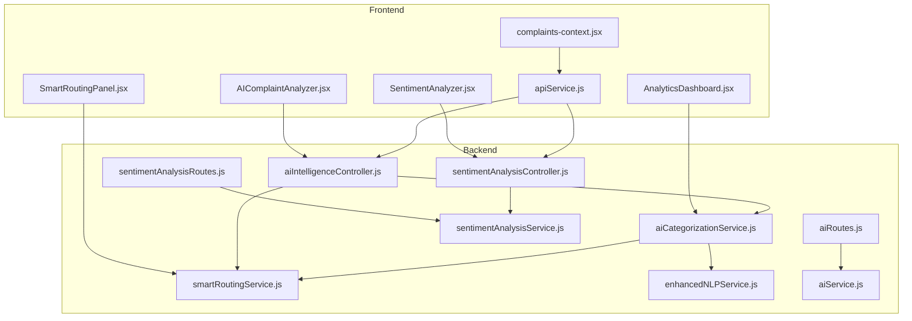
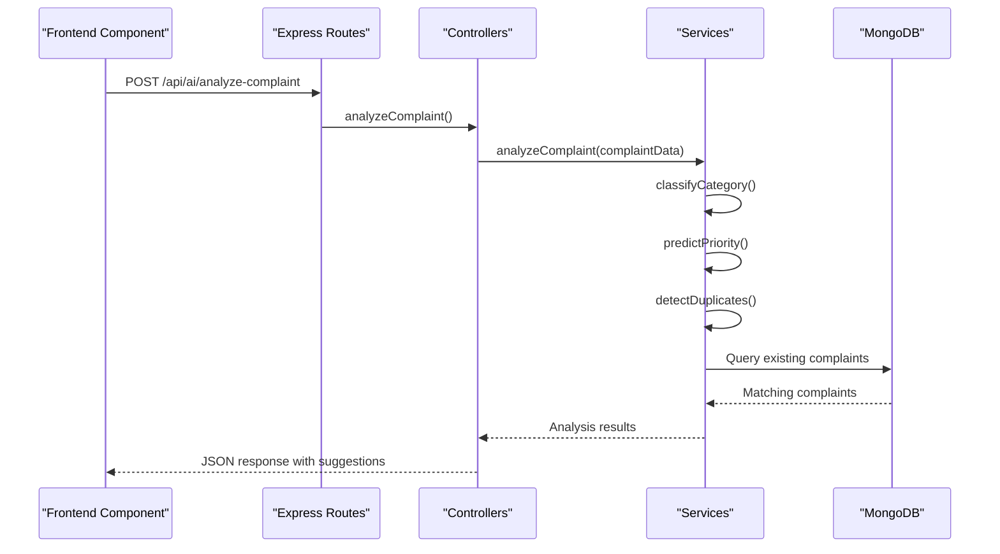
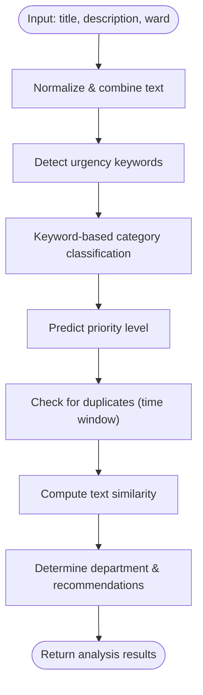
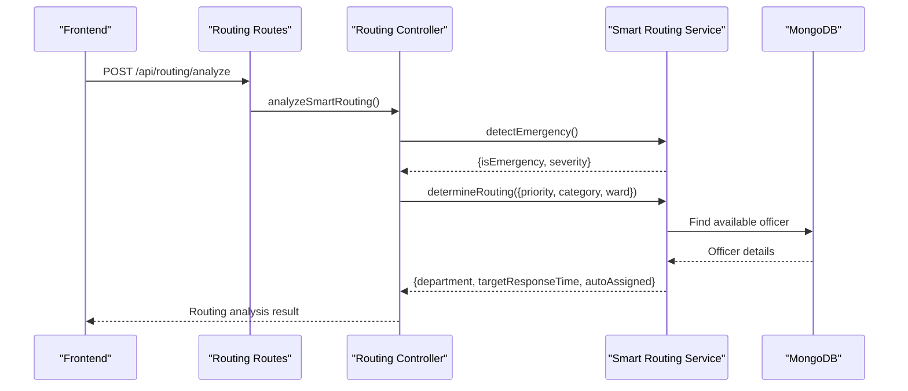
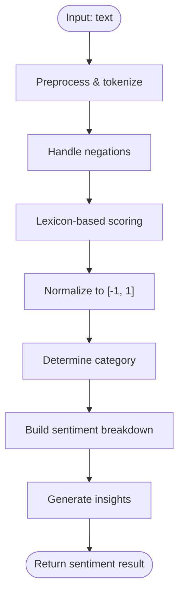
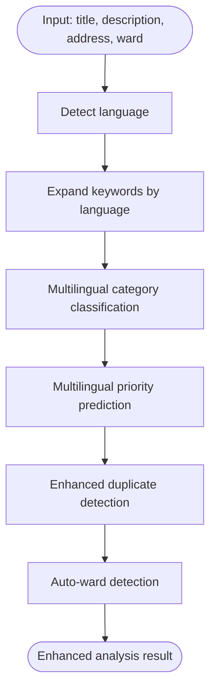
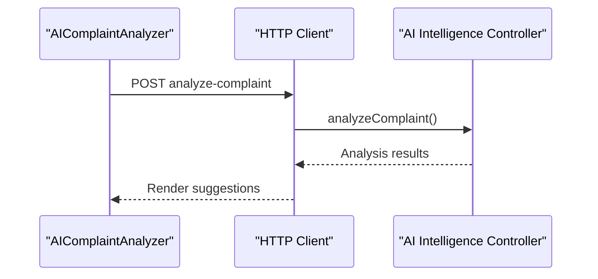
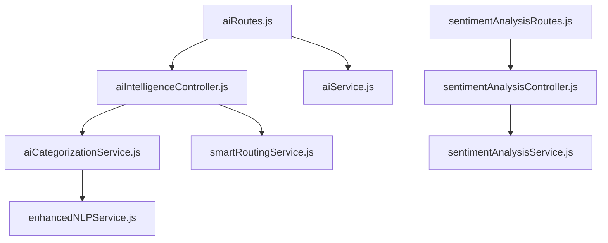

# AI Complaint Analyzer

<cite>
**Referenced Files in This Document**
- [AIComplaintAnalyzer.jsx](file://Frontend/src/components/ai/AIComplaintAnalyzer.jsx)
- [SentimentAnalyzer.jsx](file://Frontend/src/components/ai/SentimentAnalyzer.jsx)
- [aiIntelligenceController.js](file://backend/src/controllers/aiIntelligenceController.js)
- [sentimentAnalysisController.js](file://backend/src/controllers/sentimentAnalysisController.js)
- [aiCategorizationService.js](file://backend/src/services/aiCategorizationService.js)
- [smartRoutingService.js](file://backend/src/services/smartRoutingService.js)
- [sentimentAnalysisService.js](file://backend/src/services/sentimentAnalysisService.js)
- [enhancedNLPService.js](file://backend/src/services/enhancedNLPService.js)
- [aiService.js](file://backend/src/services/aiService.js)
- [aiRoutes.js](file://backend/src/routes/aiRoutes.js)
- [sentimentAnalysisRoutes.js](file://backend/src/routes/sentimentAnalysisRoutes.js)
- [SmartRoutingPanel.jsx](file://Frontend/src/components/analytics/SmartRoutingPanel.jsx)
- [AnalyticsDashboard.jsx](file://Frontend/src/pages/admin/AnalyticsDashboard.jsx)
- [complaints-context.jsx](file://Frontend/src/context/complaints-context.jsx)
- [apiService.js](file://Frontend/src/services/apiService.js)
</cite>

## Table of Contents
1. [Introduction](#introduction)
2. [Project Structure](#project-structure)
3. [Core Components](#core-components)
4. [Architecture Overview](#architecture-overview)
5. [Detailed Component Analysis](#detailed-component-analysis)
6. [Dependency Analysis](#dependency-analysis)
7. [Performance Considerations](#performance-considerations)
8. [Troubleshooting Guide](#troubleshooting-guide)
9. [Conclusion](#conclusion)
10. [Appendices](#appendices)

## Introduction
The AI Complaint Analyzer is a machine learning-driven system designed to automate municipal complaint processing. It provides intelligent text preprocessing, feature extraction, and classification algorithms to categorize complaints, predict priority levels, detect duplicates, and recommend smart routing to appropriate departments. The system supports multi-language inputs, sentiment analysis, and offers batch processing capabilities for scalability. Administrators can monitor performance via an integrated analytics dashboard, while end-users benefit from real-time AI-powered suggestions during complaint submission.

## Project Structure
The system is organized into three primary layers:
- Frontend: React components for AI analysis, sentiment visualization, and administrative dashboards
- Backend: Express routes and controllers exposing AI services, plus dedicated services for NLP, categorization, routing, and sentiment analysis
- Data Access: MongoDB models and aggregation pipelines supporting analytics and batch operations

**Diagram sources**
- [AIComplaintAnalyzer.jsx:1-276](file://Frontend/src/components/ai/AIComplaintAnalyzer.jsx#L1-L276)
- [SentimentAnalyzer.jsx:1-281](file://Frontend/src/components/ai/SentimentAnalyzer.jsx#L1-L281)
- [SmartRoutingPanel.jsx:1-178](file://Frontend/src/components/analytics/SmartRoutingPanel.jsx#L1-L178)
- [AnalyticsDashboard.jsx:1-24](file://Frontend/src/pages/admin/AnalyticsDashboard.jsx#L1-L24)
- [complaints-context.jsx:1-153](file://Frontend/src/context/complaints-context.jsx#L1-L153)
- [apiService.js:1-50](file://Frontend/src/services/apiService.js#L1-L50)
- [aiRoutes.js:1-94](file://backend/src/routes/aiRoutes.js#L1-L94)
- [sentimentAnalysisRoutes.js:1-56](file://backend/src/routes/sentimentAnalysisRoutes.js#L1-L56)
- [aiIntelligenceController.js:1-342](file://backend/src/controllers/aiIntelligenceController.js#L1-L342)
- [sentimentAnalysisController.js:1-248](file://backend/src/controllers/sentimentAnalysisController.js#L1-L248)
- [aiCategorizationService.js:1-344](file://backend/src/services/aiCategorizationService.js#L1-L344)
- [smartRoutingService.js:1-199](file://backend/src/services/smartRoutingService.js#L1-L199)
- [sentimentAnalysisService.js:1-374](file://backend/src/services/sentimentAnalysisService.js#L1-L374)
- [enhancedNLPService.js:1-487](file://backend/src/services/enhancedNLPService.js#L1-L487)
- [aiService.js:1-322](file://backend/src/services/aiService.js#L1-L322)

**Section sources**
- [AIComplaintAnalyzer.jsx:1-276](file://Frontend/src/components/ai/AIComplaintAnalyzer.jsx#L1-L276)
- [aiIntelligenceController.js:1-342](file://backend/src/controllers/aiIntelligenceController.js#L1-L342)
- [aiCategorizationService.js:1-344](file://backend/src/services/aiCategorizationService.js#L1-L344)

## Core Components
- AI Intelligence Controller: Orchestrates complaint analysis, category suggestions, priority prediction, duplicate checks, and routing recommendations.
- AI Categorization Service: Implements keyword-based classification, urgency detection, duplicate detection, and routing logic.
- Smart Routing Service: Detects emergencies, auto-assigns officers, and determines priority-based routing configurations.
- Sentiment Analysis Service: Performs lexicon-based sentiment scoring with insights and batch processing.
- Enhanced NLP Service: Adds multilingual support, advanced duplicate detection, and auto-ward detection.
- AI Service: Integrates external AI APIs with structured fallbacks for categorization and streaming chatbot responses.
- Frontend Components: Provide real-time AI analysis results, sentiment breakdowns, and administrative routing panels.

**Section sources**
- [aiIntelligenceController.js:1-342](file://backend/src/controllers/aiIntelligenceController.js#L1-L342)
- [aiCategorizationService.js:1-344](file://backend/src/services/aiCategorizationService.js#L1-L344)
- [smartRoutingService.js:1-199](file://backend/src/services/smartRoutingService.js#L1-L199)
- [sentimentAnalysisService.js:1-374](file://backend/src/services/sentimentAnalysisService.js#L1-L374)
- [enhancedNLPService.js:1-487](file://backend/src/services/enhancedNLPService.js#L1-L487)
- [aiService.js:1-322](file://backend/src/services/aiService.js#L1-L322)
- [AIComplaintAnalyzer.jsx:1-276](file://Frontend/src/components/ai/AIComplaintAnalyzer.jsx#L1-L276)
- [SentimentAnalyzer.jsx:1-281](file://Frontend/src/components/ai/SentimentAnalyzer.jsx#L1-L281)
- [SmartRoutingPanel.jsx:1-178](file://Frontend/src/components/analytics/SmartRoutingPanel.jsx#L1-L178)

## Architecture Overview
The AI Complaint Analyzer follows a layered architecture:
- Presentation Layer: React components render AI insights and administrative dashboards.
- API Layer: Express routes expose endpoints for AI analysis, sentiment, and routing.
- Service Layer: Business logic encapsulated in specialized services for NLP, categorization, routing, and sentiment.
- Data Layer: MongoDB models and aggregation pipelines support analytics and batch operations.

**Diagram sources**
- [aiRoutes.js:1-94](file://backend/src/routes/aiRoutes.js#L1-L94)
- [aiIntelligenceController.js:1-342](file://backend/src/controllers/aiIntelligenceController.js#L1-L342)
- [aiCategorizationService.js:1-344](file://backend/src/services/aiCategorizationService.js#L1-L344)

## Detailed Component Analysis

### AI Intelligence Pipeline
The AI Intelligence Pipeline performs end-to-end complaint analysis:
- Text preprocessing: Combines title and description, normalizes text, and extracts urgency indicators.
- Feature extraction: Computes keyword-based scores for categories and urgency levels.
- Classification: Determines suggested category with confidence and alternative categories.
- Priority prediction: Assigns priority level with detected keywords and reasoning.
- Duplicate detection: Compares against recent complaints within a time window using similarity thresholds.
- Smart routing: Maps category to department and generates recommendations based on priority.

**Diagram sources**
- [aiCategorizationService.js:92-167](file://backend/src/services/aiCategorizationService.js#L92-L167)
- [aiCategorizationService.js:172-229](file://backend/src/services/aiCategorizationService.js#L172-L229)
- [aiCategorizationService.js:234-273](file://backend/src/services/aiCategorizationService.js#L234-L273)
- [aiCategorizationService.js:278-332](file://backend/src/services/aiCategorizationService.js#L278-L332)

**Section sources**
- [aiIntelligenceController.js:15-43](file://backend/src/controllers/aiIntelligenceController.js#L15-L43)
- [aiCategorizationService.js:278-332](file://backend/src/services/aiCategorizationService.js#L278-L332)

### Smart Routing Engine
The Smart Routing Engine integrates emergency detection, auto-assignment, and priority-based routing:
- Emergency detection: Scans for critical keywords to override priority to high.
- Auto-assignment: Finds available ward administrators or falls back to general admins.
- Priority configuration: Defines target response times, escalation levels, and supervisor notifications.

**Diagram sources**
- [SmartRoutingPanel.jsx:21-42](file://Frontend/src/components/analytics/SmartRoutingPanel.jsx#L21-L42)
- [smartRoutingService.js:161-190](file://backend/src/services/smartRoutingService.js#L161-L190)
- [smartRoutingService.js:120-156](file://backend/src/services/smartRoutingService.js#L120-L156)

**Section sources**
- [smartRoutingService.js:1-199](file://backend/src/services/smartRoutingService.js#L1-L199)
- [SmartRoutingPanel.jsx:1-178](file://Frontend/src/components/analytics/SmartRoutingPanel.jsx#L1-L178)

### Sentiment Analysis Module
The Sentiment Analysis Module provides real-time sentiment scoring with lexicon-based approach:
- Lexicon scoring: Uses predefined positive/negative word lists with polarity scores.
- Negation handling: Marks subsequent words as negated within a scope.
- Intensifier amplification: Adjusts sentiment magnitude based on intensifiers.
- Insights generation: Produces actionable insights based on emotional intensity and sentiment balance.

**Diagram sources**
- [sentimentAnalysisService.js:57-92](file://backend/src/services/sentimentAnalysisService.js#L57-L92)
- [sentimentAnalysisService.js:97-153](file://backend/src/services/sentimentAnalysisService.js#L97-L153)
- [sentimentAnalysisService.js:187-226](file://backend/src/services/sentimentAnalysisService.js#L187-L226)

**Section sources**
- [sentimentAnalysisController.js:14-41](file://backend/src/controllers/sentimentAnalysisController.js#L14-L41)
- [sentimentAnalysisService.js:1-374](file://backend/src/services/sentimentAnalysisService.js#L1-L374)

### Enhanced NLP and Multilingual Support
Enhanced NLP adds:
- Multilingual keyword expansion for Marathi and Hindi alongside English.
- Auto-ward detection from address text using patterns, landmarks, and numeric parsing.
- Advanced duplicate detection combining Jaccard and Levenshtein similarity with configurable thresholds.

**Diagram sources**
- [enhancedNLPService.js:73-91](file://backend/src/services/enhancedNLPService.js#L73-L91)
- [enhancedNLPService.js:96-156](file://backend/src/services/enhancedNLPService.js#L96-L156)
- [enhancedNLPService.js:337-401](file://backend/src/services/enhancedNLPService.js#L337-L401)
- [enhancedNLPService.js:221-274](file://backend/src/services/enhancedNLPService.js#L221-L274)

**Section sources**
- [enhancedNLPService.js:1-487](file://backend/src/services/enhancedNLPService.js#L1-L487)

### Frontend Integration Patterns
Frontend components integrate with backend APIs:
- AIComplaintAnalyzer: Submits complaint text and displays AI suggestions for category, priority, duplicates, and routing.
- SentimentAnalyzer: Analyzes sentiment in real-time and shows breakdown and insights.
- SmartRoutingPanel: Allows administrators to simulate routing analysis with various inputs.
- AnalyticsDashboard: Renders administrative analytics using enhanced dashboard components.

**Diagram sources**
- [AIComplaintAnalyzer.jsx:45-74](file://Frontend/src/components/ai/AIComplaintAnalyzer.jsx#L45-L74)
- [aiIntelligenceController.js:15-43](file://backend/src/controllers/aiIntelligenceController.js#L15-L43)

**Section sources**
- [AIComplaintAnalyzer.jsx:1-276](file://Frontend/src/components/ai/AIComplaintAnalyzer.jsx#L1-L276)
- [SentimentAnalyzer.jsx:1-281](file://Frontend/src/components/ai/SentimentAnalyzer.jsx#L1-L281)
- [SmartRoutingPanel.jsx:1-178](file://Frontend/src/components/analytics/SmartRoutingPanel.jsx#L1-L178)
- [AnalyticsDashboard.jsx:1-24](file://Frontend/src/pages/admin/AnalyticsDashboard.jsx#L1-L24)
- [complaints-context.jsx:1-153](file://Frontend/src/context/complaints-context.jsx#L1-L153)
- [apiService.js:1-50](file://Frontend/src/services/apiService.js#L1-L50)

## Dependency Analysis
The system exhibits clear separation of concerns:
- Controllers depend on services for business logic.
- Services encapsulate domain-specific algorithms and data access.
- Routes connect frontend requests to controllers.
- Frontend components consume backend endpoints via API service wrappers.

**Diagram sources**
- [aiRoutes.js:1-94](file://backend/src/routes/aiRoutes.js#L1-L94)
- [sentimentAnalysisRoutes.js:1-56](file://backend/src/routes/sentimentAnalysisRoutes.js#L1-L56)
- [aiIntelligenceController.js:1-342](file://backend/src/controllers/aiIntelligenceController.js#L1-L342)
- [sentimentAnalysisController.js:1-248](file://backend/src/controllers/sentimentAnalysisController.js#L1-L248)
- [aiCategorizationService.js:1-344](file://backend/src/services/aiCategorizationService.js#L1-L344)
- [smartRoutingService.js:1-199](file://backend/src/services/smartRoutingService.js#L1-L199)
- [sentimentAnalysisService.js:1-374](file://backend/src/services/sentimentAnalysisService.js#L1-L374)
- [enhancedNLPService.js:1-487](file://backend/src/services/enhancedNLPService.js#L1-L487)
- [aiService.js:1-322](file://backend/src/services/aiService.js#L1-L322)

**Section sources**
- [aiIntelligenceController.js:1-342](file://backend/src/controllers/aiIntelligenceController.js#L1-L342)
- [sentimentAnalysisController.js:1-248](file://backend/src/controllers/sentimentAnalysisController.js#L1-L248)
- [aiCategorizationService.js:1-344](file://backend/src/services/aiCategorizationService.js#L1-L344)
- [smartRoutingService.js:1-199](file://backend/src/services/smartRoutingService.js#L1-L199)
- [sentimentAnalysisService.js:1-374](file://backend/src/services/sentimentAnalysisService.js#L1-L374)
- [enhancedNLPService.js:1-487](file://backend/src/services/enhancedNLPService.js#L1-L487)
- [aiService.js:1-322](file://backend/src/services/aiService.js#L1-L322)

## Performance Considerations
- Parallel processing: Controllers use Promise.all to execute categorization, priority prediction, and duplicate detection concurrently.
- Threshold tuning: Duplicate detection thresholds and time windows can be adjusted to balance recall and precision.
- Batch limits: Controllers enforce maximum batch sizes for batch analysis to prevent overload.
- Caching opportunities: Frequently accessed keyword mappings and lexicons can be cached to reduce computation overhead.
- Streaming responses: AI chatbot uses streaming to improve perceived latency.

[No sources needed since this section provides general guidance]

## Troubleshooting Guide
Common issues and resolutions:
- Missing API key: AI categorization falls back to keyword-based classification with reduced confidence.
- Network errors: External AI requests are wrapped with error handling and fallback logic.
- Duplicate detection failures: Service logs errors and returns safe defaults to avoid blocking the pipeline.
- Authentication failures: Admin-only endpoints require proper bearer tokens; ensure frontend stores and attaches tokens correctly.

**Section sources**
- [aiService.js:96-213](file://backend/src/services/aiService.js#L96-L213)
- [aiIntelligenceController.js:28-42](file://backend/src/controllers/aiIntelligenceController.js#L28-L42)
- [aiCategorizationService.js:179-229](file://backend/src/services/aiCategorizationService.js#L179-L229)
- [sentimentAnalysisController.js:14-41](file://backend/src/controllers/sentimentAnalysisController.js#L14-L41)

## Conclusion
The AI Complaint Analyzer delivers a robust, scalable solution for automated municipal complaint processing. By combining keyword-based classification, multilingual NLP enhancements, sentiment analysis, and smart routing, it improves operational efficiency and citizen satisfaction. The modular architecture ensures maintainability and extensibility, while administrative dashboards provide actionable insights for continuous improvement.

[No sources needed since this section summarizes without analyzing specific files]

## Appendices

### Practical Examples
- Complaint analysis workflow: Submit a complaint with title and description; the AI analyzer suggests category, priority, duplicates, and routing.
- Integration pattern: Frontend components call backend endpoints via API service wrappers; controllers orchestrate service calls and return structured results.
- Administrative dashboard: Administrators can simulate routing scenarios, review analytics, and manage complaint statuses through shared contexts.

**Section sources**
- [AIComplaintAnalyzer.jsx:45-74](file://Frontend/src/components/ai/AIComplaintAnalyzer.jsx#L45-L74)
- [SmartRoutingPanel.jsx:21-42](file://Frontend/src/components/analytics/SmartRoutingPanel.jsx#L21-L42)
- [AnalyticsDashboard.jsx:1-24](file://Frontend/src/pages/admin/AnalyticsDashboard.jsx#L1-L24)
- [complaints-context.jsx:74-110](file://Frontend/src/context/complaints-context.jsx#L74-L110)
- [apiService.js:16-50](file://Frontend/src/services/apiService.js#L16-L50)