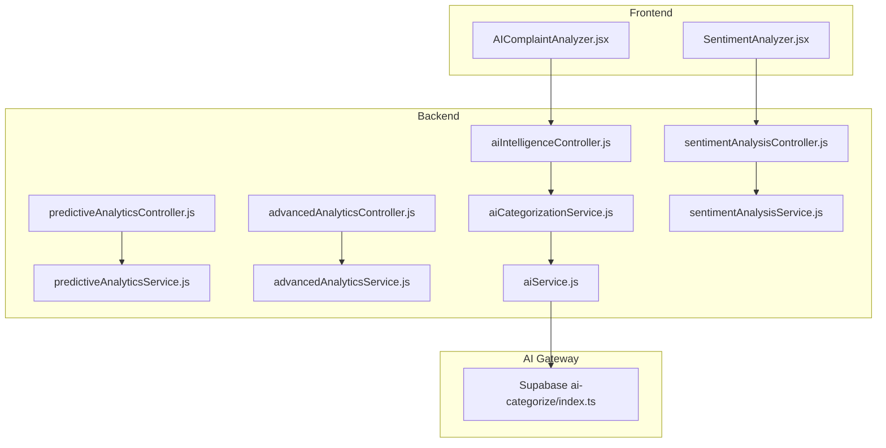
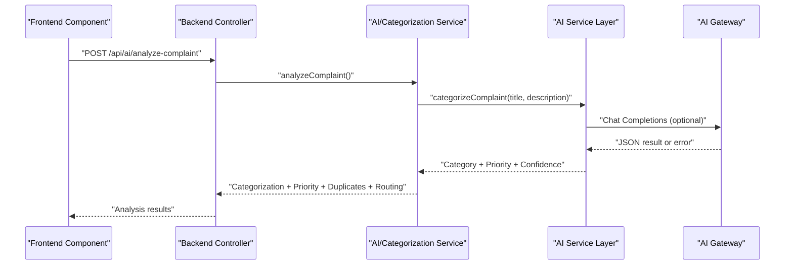
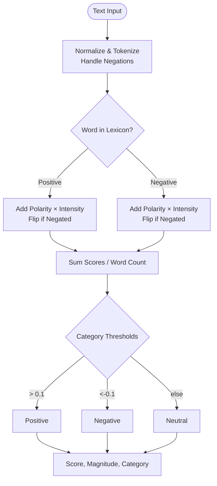
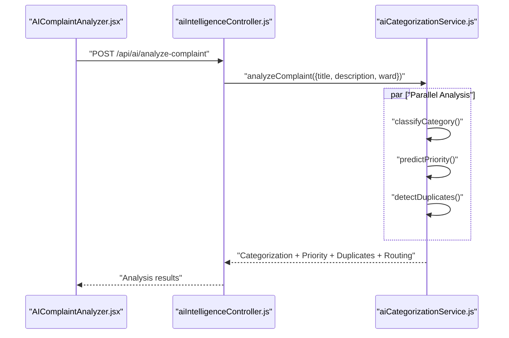
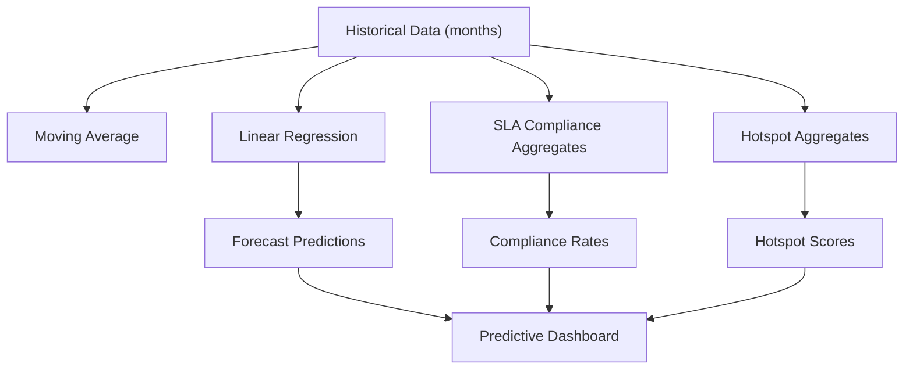
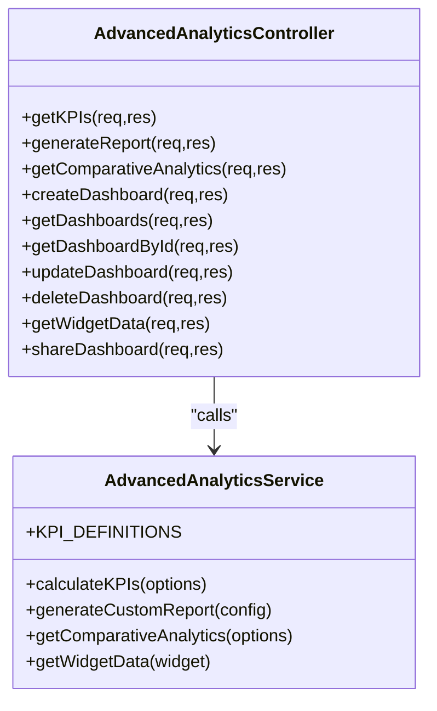
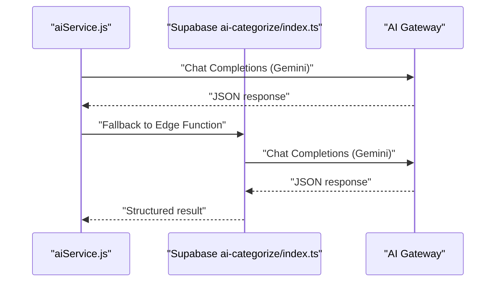
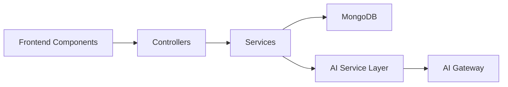

# AI Intelligence & Analytics

<cite>
**Referenced Files in This Document**
- [AIComplaintAnalyzer.jsx](file://Frontend/src/components/ai/AIComplaintAnalyzer.jsx)
- [SentimentAnalyzer.jsx](file://Frontend/src/components/ai/SentimentAnalyzer.jsx)
- [aiIntelligenceController.js](file://backend/src/controllers/aiIntelligenceController.js)
- [sentimentAnalysisController.js](file://backend/src/controllers/sentimentAnalysisController.js)
- [predictiveAnalyticsController.js](file://backend/src/controllers/predictiveAnalyticsController.js)
- [advancedAnalyticsController.js](file://backend/src/controllers/advancedAnalyticsController.js)
- [aiCategorizationService.js](file://backend/src/services/aiCategorizationService.js)
- [sentimentAnalysisService.js](file://backend/src/services/sentimentAnalysisService.js)
- [predictiveAnalyticsService.js](file://backend/src/services/predictiveAnalyticsService.js)
- [advancedAnalyticsService.js](file://backend/src/services/advancedAnalyticsService.js)
- [aiService.js](file://backend/src/services/aiService.js)
- [index.ts](file://Frontend/supabase/functions/ai-categorize/index.ts)
- [package.json](file://backend/package.json)
</cite>

## Table of Contents
1. [Introduction](#introduction)
2. [Project Structure](#project-structure)
3. [Core Components](#core-components)
4. [Architecture Overview](#architecture-overview)
5. [Detailed Component Analysis](#detailed-component-analysis)
6. [Dependency Analysis](#dependency-analysis)
7. [Performance Considerations](#performance-considerations)
8. [Troubleshooting Guide](#troubleshooting-guide)
9. [Conclusion](#conclusion)
10. [Appendices](#appendices)

## Introduction
This document presents comprehensive AI intelligence and analytics capabilities for the Smart Voice Report system. It covers:
- Sentiment analysis engine with lexicon-based scoring and real-time insights
- AI complaint analyzer with category classification, priority assignment, duplicate detection, and smart routing
- Predictive analytics for trend forecasting, SLA tracking, and hotspot identification
- Integration of Supabase AI functions and native Node.js AI service layer
- Implementation examples, data preprocessing requirements, and accuracy considerations

## Project Structure
The AI and analytics features span frontend UI components and backend services/controllers:
- Frontend: AI-driven UI components for sentiment and complaint analysis
- Backend: Controllers exposing REST endpoints and services implementing ML/NLP logic
- AI Gateway: Integration with external AI providers via Supabase functions and a native Node.js service

**Diagram sources**
- [AIComplaintAnalyzer.jsx:1-276](file://Frontend/src/components/ai/AIComplaintAnalyzer.jsx#L1-L276)
- [SentimentAnalyzer.jsx:1-281](file://Frontend/src/components/ai/SentimentAnalyzer.jsx#L1-L281)
- [aiIntelligenceController.js:1-342](file://backend/src/controllers/aiIntelligenceController.js#L1-L342)
- [sentimentAnalysisController.js:1-248](file://backend/src/controllers/sentimentAnalysisController.js#L1-L248)
- [predictiveAnalyticsController.js:1-190](file://backend/src/controllers/predictiveAnalyticsController.js#L1-L190)
- [advancedAnalyticsController.js:1-397](file://backend/src/controllers/advancedAnalyticsController.js#L1-L397)
- [aiCategorizationService.js:1-344](file://backend/src/services/aiCategorizationService.js#L1-L344)
- [sentimentAnalysisService.js:1-374](file://backend/src/services/sentimentAnalysisService.js#L1-L374)
- [predictiveAnalyticsService.js:1-519](file://backend/src/services/predictiveAnalyticsService.js#L1-L519)
- [advancedAnalyticsService.js:1-532](file://backend/src/services/advancedAnalyticsService.js#L1-L532)
- [aiService.js:1-322](file://backend/src/services/aiService.js#L1-L322)
- [index.ts:1-223](file://Frontend/supabase/functions/ai-categorize/index.ts#L1-L223)

**Section sources**
- [AIComplaintAnalyzer.jsx:1-276](file://Frontend/src/components/ai/AIComplaintAnalyzer.jsx#L1-L276)
- [SentimentAnalyzer.jsx:1-281](file://Frontend/src/components/ai/SentimentAnalyzer.jsx#L1-L281)
- [aiIntelligenceController.js:1-342](file://backend/src/controllers/aiIntelligenceController.js#L1-L342)
- [sentimentAnalysisController.js:1-248](file://backend/src/controllers/sentimentAnalysisController.js#L1-L248)
- [predictiveAnalyticsController.js:1-190](file://backend/src/controllers/predictiveAnalyticsController.js#L1-L190)
- [advancedAnalyticsController.js:1-397](file://backend/src/controllers/advancedAnalyticsController.js#L1-L397)
- [aiCategorizationService.js:1-344](file://backend/src/services/aiCategorizationService.js#L1-L344)
- [sentimentAnalysisService.js:1-374](file://backend/src/services/sentimentAnalysisService.js#L1-L374)
- [predictiveAnalyticsService.js:1-519](file://backend/src/services/predictiveAnalyticsService.js#L1-L519)
- [advancedAnalyticsService.js:1-532](file://backend/src/services/advancedAnalyticsService.js#L1-L532)
- [aiService.js:1-322](file://backend/src/services/aiService.js#L1-L322)
- [index.ts:1-223](file://Frontend/supabase/functions/ai-categorize/index.ts#L1-L223)

## Core Components
- AI Complaint Analyzer: Real-time suggestion of category, priority, duplicates, and routing for submitted complaints
- Sentiment Analyzer: Lexicon-based sentiment scoring with intensity and breakdown
- Predictive Analytics: Trend forecasting, SLA compliance tracking, and geographic hotspot identification
- Advanced Analytics: KPI calculations, comparative analytics, and custom dashboard/report generation
- AI Service Layer: Unified interface to external AI providers with fallback logic

**Section sources**
- [AIComplaintAnalyzer.jsx:26-276](file://Frontend/src/components/ai/AIComplaintAnalyzer.jsx#L26-L276)
- [SentimentAnalyzer.jsx:24-281](file://Frontend/src/components/ai/SentimentAnalyzer.jsx#L24-L281)
- [aiIntelligenceController.js:15-43](file://backend/src/controllers/aiIntelligenceController.js#L15-L43)
- [sentimentAnalysisController.js:14-41](file://backend/src/controllers/sentimentAnalysisController.js#L14-L41)
- [predictiveAnalyticsController.js:14-32](file://backend/src/controllers/predictiveAnalyticsController.js#L14-L32)
- [advancedAnalyticsController.js:15-36](file://backend/src/controllers/advancedAnalyticsController.js#L15-L36)
- [aiService.js:9-36](file://backend/src/services/aiService.js#L9-L36)

## Architecture Overview
The system integrates frontend UI components with backend controllers and services. AI categorization leverages both a native Node.js AI service and Supabase Edge Functions as fallbacks. Predictive and advanced analytics rely on MongoDB aggregation pipelines and mathematical models.

**Diagram sources**
- [AIComplaintAnalyzer.jsx:50-74](file://Frontend/src/components/ai/AIComplaintAnalyzer.jsx#L50-L74)
- [aiIntelligenceController.js:15-43](file://backend/src/controllers/aiIntelligenceController.js#L15-L43)
- [aiCategorizationService.js:278-332](file://backend/src/services/aiCategorizationService.js#L278-L332)
- [aiService.js:96-213](file://backend/src/services/aiService.js#L96-L213)
- [index.ts:117-205](file://Frontend/supabase/functions/ai-categorize/index.ts#L117-L205)

## Detailed Component Analysis

### Sentiment Analysis Engine
- Lexicon-based approach with polarity scores, negation handling, and intensifier scaling
- Real-time scoring with category thresholds and magnitude normalization
- Optional insights generation and batch/statistical analysis
- Frontend component renders sentiment score, intensity, breakdown, and AI insights

**Diagram sources**
- [sentimentAnalysisService.js:57-153](file://backend/src/services/sentimentAnalysisService.js#L57-L153)

**Section sources**
- [sentimentAnalysisService.js:11-37](file://backend/src/services/sentimentAnalysisService.js#L11-L37)
- [sentimentAnalysisService.js:57-153](file://backend/src/services/sentimentAnalysisService.js#L57-L153)
- [sentimentAnalysisService.js:187-226](file://backend/src/services/sentimentAnalysisService.js#L187-L226)
- [sentimentAnalysisController.js:14-41](file://backend/src/controllers/sentimentAnalysisController.js#L14-L41)
- [SentimentAnalyzer.jsx:43-79](file://Frontend/src/components/ai/SentimentAnalyzer.jsx#L43-L79)

### AI Complaint Analyzer
- Multi-modal AI analysis: category classification, priority prediction, duplicate detection, and smart routing
- Parallel execution of analyzers for performance
- Confidence scoring and alternative categories for interpretability
- Frontend UI displays categorized results, priority, duplicates warning, and routing recommendations

**Diagram sources**
- [AIComplaintAnalyzer.jsx:50-74](file://Frontend/src/components/ai/AIComplaintAnalyzer.jsx#L50-L74)
- [aiIntelligenceController.js:15-43](file://backend/src/controllers/aiIntelligenceController.js#L15-L43)
- [aiCategorizationService.js:284-332](file://backend/src/services/aiCategorizationService.js#L284-L332)

**Section sources**
- [aiCategorizationService.js:92-128](file://backend/src/services/aiCategorizationService.js#L92-L128)
- [aiCategorizationService.js:133-167](file://backend/src/services/aiCategorizationService.js#L133-L167)
- [aiCategorizationService.js:172-229](file://backend/src/services/aiCategorizationService.js#L172-L229)
- [aiCategorizationService.js:234-273](file://backend/src/services/aiCategorizationService.js#L234-L273)
- [aiIntelligenceController.js:15-43](file://backend/src/controllers/aiIntelligenceController.js#L15-L43)
- [AIComplaintAnalyzer.jsx:111-272](file://Frontend/src/components/ai/AIComplaintAnalyzer.jsx#L111-L272)

### Predictive Analytics System
- Trend forecasting using moving averages and linear regression
- SLA compliance tracking with priority-specific targets
- Hotspot identification with composite scoring across volume, pending ratio, priority mix, and resolution time
- Dashboard orchestration combining forecasts, SLA, and hotspots

**Diagram sources**
- [predictiveAnalyticsService.js:66-167](file://backend/src/services/predictiveAnalyticsService.js#L66-L167)
- [predictiveAnalyticsService.js:240-381](file://backend/src/services/predictiveAnalyticsService.js#L240-L381)
- [predictiveAnalyticsService.js:386-512](file://backend/src/services/predictiveAnalyticsService.js#L386-L512)
- [predictiveAnalyticsController.js:88-114](file://backend/src/controllers/predictiveAnalyticsController.js#L88-L114)

**Section sources**
- [predictiveAnalyticsService.js:12-61](file://backend/src/services/predictiveAnalyticsService.js#L12-L61)
- [predictiveAnalyticsService.js:66-167](file://backend/src/services/predictiveAnalyticsService.js#L66-L167)
- [predictiveAnalyticsService.js:240-381](file://backend/src/services/predictiveAnalyticsService.js#L240-L381)
- [predictiveAnalyticsService.js:386-512](file://backend/src/services/predictiveAnalyticsService.js#L386-L512)
- [predictiveAnalyticsController.js:14-32](file://backend/src/controllers/predictiveAnalyticsController.js#L14-L32)
- [predictiveAnalyticsController.js:88-114](file://backend/src/controllers/predictiveAnalyticsController.js#L88-L114)

### Advanced Analytics and Reporting
- KPI definitions and calculations for resolution rates, SLA compliance, first response time, and productivity
- Comparative analytics across wards/categories/priorities with ranking and benchmarking
- Custom dashboard creation with widget data fetching and sharing
- Report generation with configurable metrics and dimensions

**Diagram sources**
- [advancedAnalyticsService.js:87-207](file://backend/src/services/advancedAnalyticsService.js#L87-L207)
- [advancedAnalyticsService.js:322-418](file://backend/src/services/advancedAnalyticsService.js#L322-L418)
- [advancedAnalyticsController.js:15-36](file://backend/src/controllers/advancedAnalyticsController.js#L15-L36)
- [advancedAnalyticsController.js:65-84](file://backend/src/controllers/advancedAnalyticsController.js#L65-L84)

**Section sources**
- [advancedAnalyticsService.js:14-82](file://backend/src/services/advancedAnalyticsService.js#L14-L82)
- [advancedAnalyticsService.js:87-207](file://backend/src/services/advancedAnalyticsService.js#L87-L207)
- [advancedAnalyticsService.js:322-418](file://backend/src/services/advancedAnalyticsService.js#L322-L418)
- [advancedAnalyticsController.js:15-36](file://backend/src/controllers/advancedAnalyticsController.js#L15-L36)
- [advancedAnalyticsController.js:65-84](file://backend/src/controllers/advancedAnalyticsController.js#L65-L84)

### AI Service Layer and Supabase Integration
- Native Node.js AI service with structured JSON parsing and fallback to keyword-based categorization
- Supabase Edge Function for AI categorization with Gemini model and keyword fallback
- Unified urgency detection and priority inference

**Diagram sources**
- [aiService.js:125-213](file://backend/src/services/aiService.js#L125-L213)
- [index.ts:117-205](file://Frontend/supabase/functions/ai-categorize/index.ts#L117-L205)

**Section sources**
- [aiService.js:9-36](file://backend/src/services/aiService.js#L9-L36)
- [aiService.js:96-213](file://backend/src/services/aiService.js#L96-L213)
- [index.ts:11-27](file://Frontend/supabase/functions/ai-categorize/index.ts#L11-L27)
- [index.ts:117-205](file://Frontend/supabase/functions/ai-categorize/index.ts#L117-L205)

## Dependency Analysis
- Controllers depend on services for business logic
- Services encapsulate domain-specific algorithms and data access
- AI Service Layer abstracts external provider integration
- Frontend components communicate with backend via REST endpoints

**Diagram sources**
- [aiIntelligenceController.js:1-10](file://backend/src/controllers/aiIntelligenceController.js#L1-L10)
- [sentimentAnalysisController.js:1-10](file://backend/src/controllers/sentimentAnalysisController.js#L1-L10)
- [predictiveAnalyticsController.js:1-10](file://backend/src/controllers/predictiveAnalyticsController.js#L1-L10)
- [advancedAnalyticsController.js:1-10](file://backend/src/controllers/advancedAnalyticsController.js#L1-L10)
- [aiCategorizationService.js:1-10](file://backend/src/services/aiCategorizationService.js#L1-L10)
- [sentimentAnalysisService.js:1-10](file://backend/src/services/sentimentAnalysisService.js#L1-L10)
- [predictiveAnalyticsService.js:1-10](file://backend/src/services/predictiveAnalyticsService.js#L1-L10)
- [advancedAnalyticsService.js:1-10](file://backend/src/services/advancedAnalyticsService.js#L1-L10)
- [aiService.js:1-10](file://backend/src/services/aiService.js#L1-L10)

**Section sources**
- [package.json:10-26](file://backend/package.json#L10-L26)

## Performance Considerations
- Parallel execution of analyzers in AI complaint analysis reduces latency
- Batch endpoints for sentiment and AI analysis improve throughput
- Aggregation pipelines in predictive and advanced analytics minimize round trips
- Keyword-based fallback ensures availability when external AI is unavailable
- Confidence thresholds and limits (e.g., batch sizes) prevent overload

[No sources needed since this section provides general guidance]

## Troubleshooting Guide
- API key configuration: Ensure AI gateway credentials are set; otherwise, fallback logic activates
- Input validation: Controllers validate required fields and enforce batch limits
- Error propagation: Controllers wrap service calls and return structured error responses
- Frontend error handling: Components render loading states and error messages gracefully

**Section sources**
- [aiService.js:14-17](file://backend/src/services/aiService.js#L14-L17)
- [aiIntelligenceController.js:19-25](file://backend/src/controllers/aiIntelligenceController.js#L19-L25)
- [sentimentAnalysisController.js:18-23](file://backend/src/controllers/sentimentAnalysisController.js#L18-L23)
- [AIComplaintAnalyzer.jsx:68-71](file://Frontend/src/components/ai/AIComplaintAnalyzer.jsx#L68-L71)
- [SentimentAnalyzer.jsx:73-76](file://Frontend/src/components/ai/SentimentAnalyzer.jsx#L73-L76)

## Conclusion
The system delivers robust AI intelligence and analytics through modular controllers, services, and frontend components. It combines lexicon-based sentiment analysis, structured AI categorization with keyword fallbacks, predictive modeling, and comprehensive reporting. The architecture supports scalability, resilience via fallbacks, and extensibility for future enhancements.

[No sources needed since this section summarizes without analyzing specific files]

## Appendices

### Implementation Examples
- Frontend integration examples:
  - [AIComplaintAnalyzer.jsx:50-74](file://Frontend/src/components/ai/AIComplaintAnalyzer.jsx#L50-L74)
  - [SentimentAnalyzer.jsx:43-79](file://Frontend/src/components/ai/SentimentAnalyzer.jsx#L43-L79)
- Backend endpoints:
  - [aiIntelligenceController.js:15-43](file://backend/src/controllers/aiIntelligenceController.js#L15-L43)
  - [sentimentAnalysisController.js:14-41](file://backend/src/controllers/sentimentAnalysisController.js#L14-L41)
  - [predictiveAnalyticsController.js:14-32](file://backend/src/controllers/predictiveAnalyticsController.js#L14-L32)
  - [advancedAnalyticsController.js:15-36](file://backend/src/controllers/advancedAnalyticsController.js#L15-L36)

### Data Preprocessing Requirements
- Text normalization, tokenization, and punctuation removal
- Negation scope handling and intensifier application
- Similarity computation using Jaccard index for duplicate detection

**Section sources**
- [sentimentAnalysisService.js:57-92](file://backend/src/services/sentimentAnalysisService.js#L57-L92)
- [aiCategorizationService.js:79-87](file://backend/src/services/aiCategorizationService.js#L79-L87)

### Accuracy Metrics and Confidence Scoring
- Sentiment analysis: Category thresholds and magnitude normalization
- Categorization: Confidence derived from keyword match counts and lexical lookup
- Priority prediction: Keyword frequency weighted by urgency level
- Trend forecasting: Confidence calculated from historical variance

**Section sources**
- [sentimentAnalysisService.js:134-153](file://backend/src/services/sentimentAnalysisService.js#L134-L153)
- [aiCategorizationService.js:119-127](file://backend/src/services/aiCategorizationService.js#L119-L127)
- [aiCategorizationService.js:161-166](file://backend/src/services/aiCategorizationService.js#L161-L166)
- [predictiveAnalyticsService.js:134-136](file://backend/src/services/predictiveAnalyticsService.js#L134-L136)