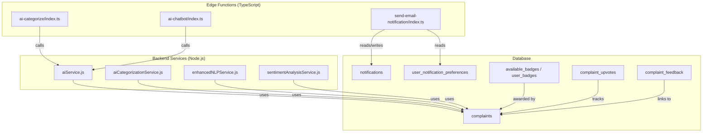
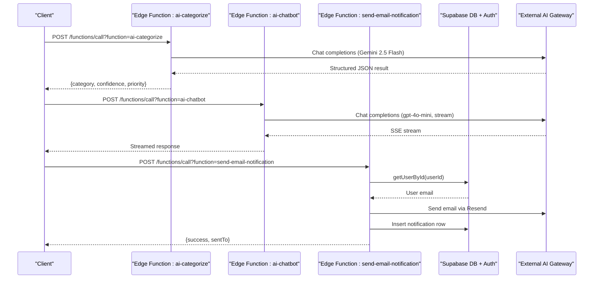
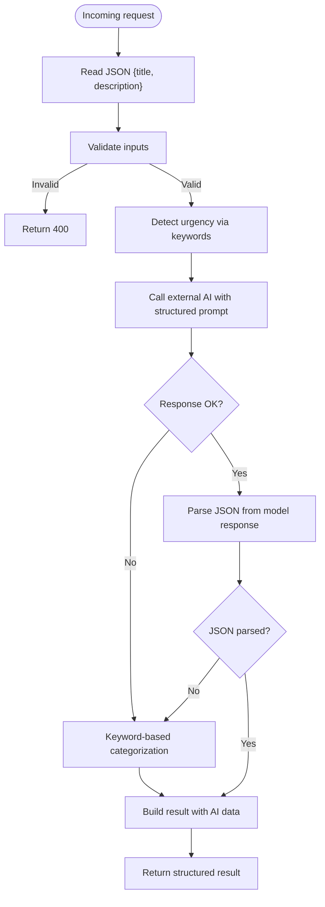
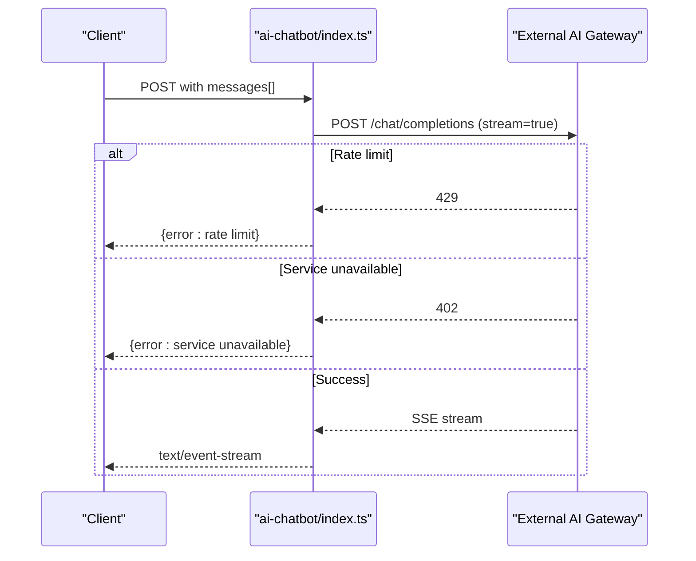
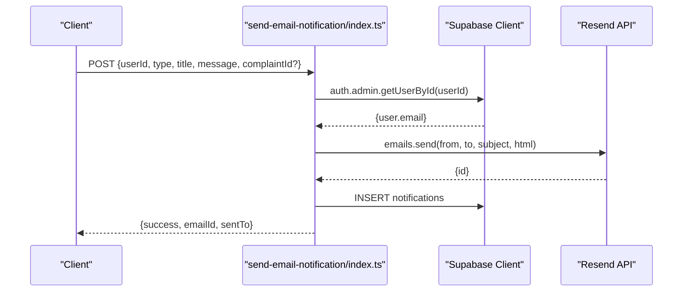
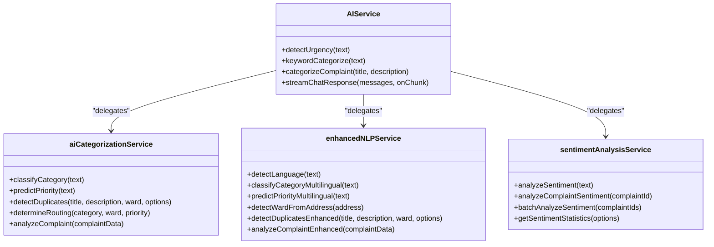
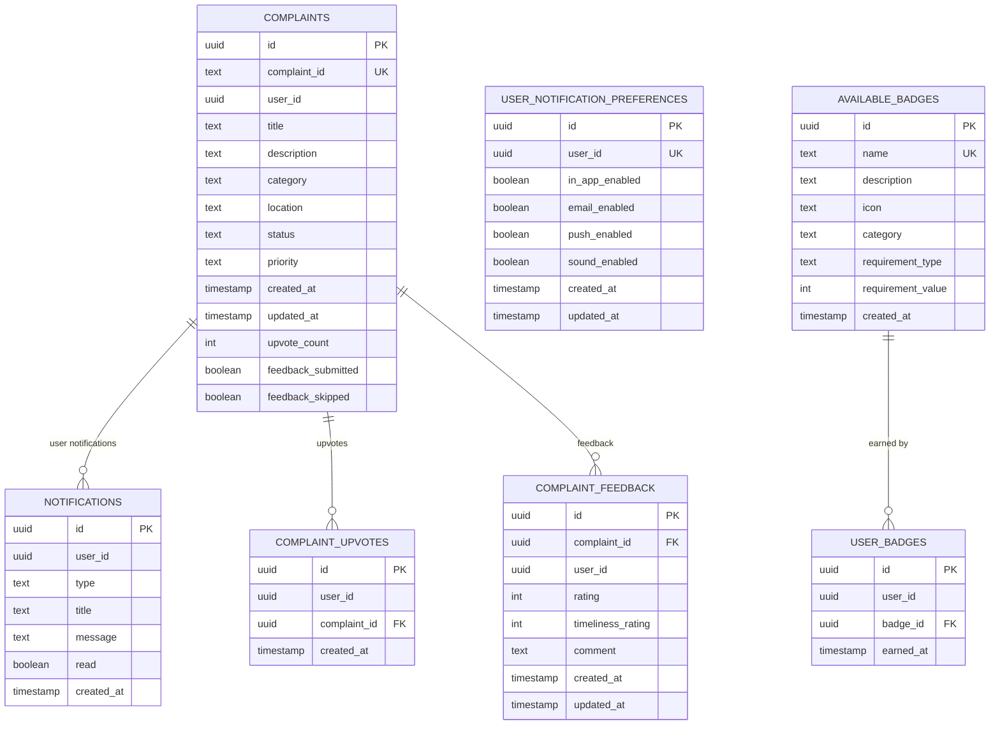
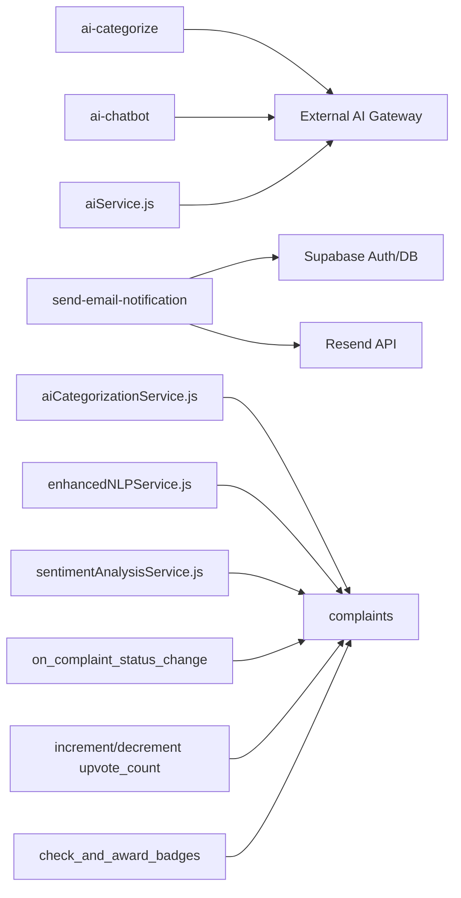

# AI Model Integration & Supabase Functions

<cite>
**Referenced Files in This Document**
- [ai-categorize/index.ts](file://Frontend/supabase/functions/ai-categorize/index.ts)
- [ai-chatbot/index.ts](file://Frontend/supabase/functions/ai-chatbot/index.ts)
- [send-email-notification/index.ts](file://Frontend/supabase/functions/send-email-notification/index.ts)
- [aiService.js](file://backend/src/services/aiService.js)
- [aiCategorizationService.js](file://backend/src/services/aiCategorizationService.js)
- [enhancedNLPService.js](file://backend/src/services/enhancedNLPService.js)
- [sentimentAnalysisService.js](file://backend/src/services/sentimentAnalysisService.js)
- [aiIntelligenceController.js](file://backend/src/controllers/aiIntelligenceController.js)
- [20260109195527_19c1635e-2c87-4d72-9195-25cd61fb9064.sql](file://Frontend/supabase/migrations/20260109195527_19c1635e-2c87-4d72-9195-25cd61fb9064.sql)
- [20260110200542_ba1fdd08-97e5-452f-ad68-a6a0adc4d026.sql](file://Frontend/supabase/migrations/20260110200542_ba1fdd08-97e5-452f-ad68-a6a0adc4d026.sql)
- [20260111091530_3a214bc1-7339-4a67-8f5c-1cab34fb9d11.sql](file://Frontend/supabase/migrations/20260111091530_3a214bc1-7339-4a67-8f5c-1cab34fb9d11.sql)
- [20260111091929_e987a032-64ae-4eae-9144-5faa6bf9ec15.sql](file://Frontend/supabase/migrations/20260111091929_e987a032-64ae-4eae-9144-5faa6bf9ec15.sql)
- [20260112120309_03b52b7f-dbb4-4c87-90bc-13842b952ca5.sql](file://Frontend/supabase/migrations/20260112120309_03b52b7f-dbb4-4c87-90bc-13842b952ca5.sql)
- [20260108191133_02ddf716-c5c4-48c9-9459-b24f42d145f8.sql](file://Frontend/supabase/migrations/20260108191133_02ddf716-c5c4-48c9-9459-b24f42d145f8.sql)
- [20260108191329_d0f55b85-9f1d-40dd-ae26-0f06d7bac986.sql](file://Frontend/supabase/migrations/20260108191329_d0f55b85-9f1d-40dd-ae26-0f06d7bac986.sql)
- [20260103164505_7ef66a27-61e5-4229-acf2-c592ec82bd45.sql](file://Frontend/supabase/migrations/20260103164505_7ef66a27-61e5-4229-acf2-c592ec82bd45.sql)
</cite>

## Table of Contents
1. [Introduction](#introduction)
2. [Project Structure](#project-structure)
3. [Core Components](#core-components)
4. [Architecture Overview](#architecture-overview)
5. [Detailed Component Analysis](#detailed-component-analysis)
6. [Dependency Analysis](#dependency-analysis)
7. [Performance Considerations](#performance-considerations)
8. [Troubleshooting Guide](#troubleshooting-guide)
9. [Conclusion](#conclusion)
10. [Appendices](#appendices)

## Introduction
This document explains the AI model integration architecture for the Smart Voice Report platform, focusing on:
- Supabase Edge Functions for AI categorization, chatbot, and notification automation
- TypeScript-based AI categorization function and chatbot integration
- Notification automation via email and in-app notifications
- Database schema modifications for AI metadata storage, model versioning, and performance tracking
- Edge computing implementation, latency optimization, and scalability considerations
- Integration patterns with external AI providers, model training workflows, and continuous learning processes
- Deployment configurations, environment setup, and monitoring approaches

## Project Structure
The AI integration spans three primary areas:
- Supabase Edge Functions (TypeScript): ai-categorize, ai-chatbot, send-email-notification
- Backend AI Services (Node.js): AIService, aiCategorizationService, enhancedNLPService, sentimentAnalysisService
- Database Schema: complaints, notifications, user_notification_preferences, badges, upvotes, feedback

**Diagram sources**
- [ai-categorize/index.ts:117-150](file://Frontend/supabase/functions/ai-categorize/index.ts#L117-L150)
- [ai-chatbot/index.ts:65-102](file://Frontend/supabase/functions/ai-chatbot/index.ts#L65-L102)
- [send-email-notification/index.ts:90-135](file://Frontend/supabase/functions/send-email-notification/index.ts#L90-L135)
- [aiService.js:125-213](file://backend/src/services/aiService.js#L125-L213)
- [20260109195527_19c1635e-2c87-4d72-9195-25cd61fb9064.sql:33-100](file://Frontend/supabase/migrations/20260109195527_19c1635e-2c87-4d72-9195-25cd61fb9064.sql#L33-L100)
- [20260110200542_ba1fdd08-97e5-452f-ad68-a6a0adc4d026.sql:1-11](file://Frontend/supabase/migrations/20260110200542_ba1fdd08-97e5-452f-ad68-a6a0adc4d026.sql#L1-L11)
- [20260111091530_3a214bc1-7339-4a67-8f5c-1cab34fb9d11.sql:1-11](file://Frontend/supabase/migrations/20260111091530_3a214bc1-7339-4a67-8f5c-1cab34fb9d11.sql#L1-L11)
- [20260112120309_03b52b7f-dbb4-4c87-90bc-13842b952ca5.sql:1-12](file://Frontend/supabase/migrations/20260112120309_03b52b7f-dbb4-4c87-90bc-13842b952ca5.sql#L1-L12)

**Section sources**
- [ai-categorize/index.ts:1-223](file://Frontend/supabase/functions/ai-categorize/index.ts#L1-L223)
- [ai-chatbot/index.ts:1-117](file://Frontend/supabase/functions/ai-chatbot/index.ts#L1-L117)
- [send-email-notification/index.ts:1-163](file://Frontend/supabase/functions/send-email-notification/index.ts#L1-L163)
- [aiService.js:1-322](file://backend/src/services/aiService.js#L1-L322)
- [aiCategorizationService.js:1-344](file://backend/src/services/aiCategorizationService.js#L1-L344)
- [enhancedNLPService.js:1-487](file://backend/src/services/enhancedNLPService.js#L1-L487)
- [sentimentAnalysisService.js:1-374](file://backend/src/services/sentimentAnalysisService.js#L1-L374)

## Core Components
- AI Categorization Edge Function: Accepts complaint title and description, detects urgency, calls external AI provider, falls back to keyword-based categorization, and returns structured results.
- AI Chatbot Edge Function: Streams chat completions from external AI provider with system prompts and handles rate limits and service errors.
- Notification Automation: Sends emails via Resend and creates in-app notifications; integrates with Supabase auth and RLS.
- Backend AI Services: Replicates AI logic in Node.js with fallbacks, enabling zero-regression deployment strategies.
- Enhanced NLP: Multi-language support (English/Marathi/Hindi), auto-ward detection, and advanced duplicate detection.
- Sentiment Analysis: Lexicon-based sentiment scoring with insights for complaints.
- Database Schema: Supports AI metadata, performance tracking, and real-time notifications.

**Section sources**
- [ai-categorize/index.ts:29-84](file://Frontend/supabase/functions/ai-categorize/index.ts#L29-L84)
- [ai-chatbot/index.ts:8-38](file://Frontend/supabase/functions/ai-chatbot/index.ts#L8-L38)
- [send-email-notification/index.ts:21-80](file://Frontend/supabase/functions/send-email-notification/index.ts#L21-L80)
- [aiService.js:96-213](file://backend/src/services/aiService.js#L96-L213)
- [enhancedNLPService.js:96-274](file://backend/src/services/enhancedNLPService.js#L96-L274)
- [sentimentAnalysisService.js:97-257](file://backend/src/services/sentimentAnalysisService.js#L97-L257)

## Architecture Overview
The system uses a hybrid architecture:
- Edge Functions for latency-sensitive tasks (real-time chat streaming, quick categorization)
- Backend services for robust AI processing, analytics, and extended NLP
- Supabase-managed database with RLS and realtime for notifications and metadata
- External AI provider gateway for model inference with structured outputs and streaming

**Diagram sources**
- [ai-categorize/index.ts:86-221](file://Frontend/supabase/functions/ai-categorize/index.ts#L86-L221)
- [ai-chatbot/index.ts:40-116](file://Frontend/supabase/functions/ai-chatbot/index.ts#L40-L116)
- [send-email-notification/index.ts:82-160](file://Frontend/supabase/functions/send-email-notification/index.ts#L82-L160)
- [20260109195527_19c1635e-2c87-4d72-9195-25cd61fb9064.sql:75-100](file://Frontend/supabase/migrations/20260109195527_19c1635e-2c87-4d72-9195-25cd61fb9064.sql#L75-L100)

## Detailed Component Analysis

### AI Categorization Function (Edge)
- Purpose: Categorize complaints with urgency detection and fallback to keyword-based classification when external AI is unavailable.
- Inputs: title, description
- Outputs: category, confidence, reasoning, priority, urgencyKeywords, isAISuggestion
- External Provider: Calls external AI gateway with a structured prompt and parses JSON from model response.
- Fallback: Keyword-based categorization and urgency detection.

**Diagram sources**
- [ai-categorize/index.ts:86-221](file://Frontend/supabase/functions/ai-categorize/index.ts#L86-L221)

**Section sources**
- [ai-categorize/index.ts:117-195](file://Frontend/supabase/functions/ai-categorize/index.ts#L117-L195)

### AI Chatbot Function (Edge)
- Purpose: Stream chatbot responses with system prompts and handle rate limits/service errors.
- Streaming: Uses SSE with stream:true and returns text/event-stream.
- Error Handling: Distinguishes rate limit and service unavailable scenarios.

**Diagram sources**
- [ai-chatbot/index.ts:65-108](file://Frontend/supabase/functions/ai-chatbot/index.ts#L65-L108)

**Section sources**
- [ai-chatbot/index.ts:40-116](file://Frontend/supabase/functions/ai-chatbot/index.ts#L40-L116)

### Notification Automation (Edge)
- Purpose: Send email notifications via Resend and create in-app notifications.
- Auth Integration: Uses Supabase client to fetch user email by userId.
- In-app Notifications: Inserts into notifications table with type mapped from notification category.

**Diagram sources**
- [send-email-notification/index.ts:90-146](file://Frontend/supabase/functions/send-email-notification/index.ts#L90-L146)

**Section sources**
- [send-email-notification/index.ts:82-160](file://Frontend/supabase/functions/send-email-notification/index.ts#L82-L160)

### Backend AI Services (Node.js)
- AIService: Centralized AI orchestration with fallbacks, structured prompts, and streaming chat support.
- aiCategorizationService: NLP-based categorization, urgency prediction, duplicate detection, routing.
- enhancedNLPService: Multi-language support, auto-ward detection, advanced duplicate detection.
- sentimentAnalysisService: Lexicon-based sentiment scoring and insights.

**Diagram sources**
- [aiService.js:9-322](file://backend/src/services/aiService.js#L9-L322)
- [aiCategorizationService.js:1-344](file://backend/src/services/aiCategorizationService.js#L1-L344)
- [enhancedNLPService.js:1-487](file://backend/src/services/enhancedNLPService.js#L1-L487)
- [sentimentAnalysisService.js:1-374](file://backend/src/services/sentimentAnalysisService.js#L1-L374)

**Section sources**
- [aiService.js:96-213](file://backend/src/services/aiService.js#L96-L213)
- [aiCategorizationService.js:278-332](file://backend/src/services/aiCategorizationService.js#L278-L332)
- [enhancedNLPService.js:410-467](file://backend/src/services/enhancedNLPService.js#L410-L467)
- [sentimentAnalysisService.js:231-257](file://backend/src/services/sentimentAnalysisService.js#L231-L257)

### Database Schema Modifications
- complaints: Stores complaint metadata, status, priority, timestamps, and links to user.
- notifications: Real-time in-app notifications with RLS policies.
- user_notification_preferences: Per-user notification channel preferences.
- available_badges / user_badges: Achievement system with triggers to award badges.
- complaint_upvotes: Tracks upvotes with triggers to maintain upvote_count.
- complaint_feedback: Ratings and comments for resolved complaints.

**Diagram sources**
- [20260109195527_19c1635e-2c87-4d72-9195-25cd61fb9064.sql:33-100](file://Frontend/supabase/migrations/20260109195527_19c1635e-2c87-4d72-9195-25cd61fb9064.sql#L33-L100)
- [20260108191133_02ddf716-c5c4-48c9-9459-b24f42d145f8.sql:2-10](file://Frontend/supabase/migrations/20260108191133_02ddf716-c5c4-48c9-9459-b24f42d145f8.sql#L2-L10)
- [20260110200542_ba1fdd08-97e5-452f-ad68-a6a0adc4d026.sql:1-11](file://Frontend/supabase/migrations/20260110200542_ba1fdd08-97e5-452f-ad68-a6a0adc4d026.sql#L1-L11)
- [20260111091530_3a214bc1-7339-4a67-8f5c-1cab34fb9d11.sql:5-11](file://Frontend/supabase/migrations/20260111091530_3a214bc1-7339-4a67-8f5c-1cab34fb9d11.sql#L5-L11)
- [20260112120309_03b52b7f-dbb4-4c87-90bc-13842b952ca5.sql:2-12](file://Frontend/supabase/migrations/20260112120309_03b52b7f-dbb4-4c87-90bc-13842b952ca5.sql#L2-L12)

**Section sources**
- [20260109195527_19c1635e-2c87-4d72-9195-25cd61fb9064.sql:33-100](file://Frontend/supabase/migrations/20260109195527_19c1635e-2c87-4d72-9195-25cd61fb9064.sql#L33-L100)
- [20260108191133_02ddf716-c5c4-48c9-9459-b24f42d145f8.sql:2-10](file://Frontend/supabase/migrations/20260108191133_02ddf716-c5c4-48c9-9459-b24f42d145f8.sql#L2-L10)
- [20260110200542_ba1fdd08-97e5-452f-ad68-a6a0adc4d026.sql:1-11](file://Frontend/supabase/migrations/20260110200542_ba1fdd08-97e5-452f-ad68-a6a0adc4d026.sql#L1-L11)
- [20260111091530_3a214bc1-7339-4a67-8f5c-1cab34fb9d11.sql:5-11](file://Frontend/supabase/migrations/20260111091530_3a214bc1-7339-4a67-8f5c-1cab34fb9d11.sql#L5-L11)
- [20260112120309_03b52b7f-dbb4-4c87-90bc-13842b952ca5.sql:2-12](file://Frontend/supabase/migrations/20260112120309_03b52b7f-dbb4-4c87-90bc-13842b952ca5.sql#L2-L12)

## Dependency Analysis
- Edge Functions depend on external AI gateway and environment variables (LOVABLE_API_KEY).
- Notification function depends on Supabase auth and Resend API keys.
- Backend services depend on AIService and database models for analytics and metadata.
- Database triggers enforce RLS and maintain counters and timestamps.

**Diagram sources**
- [ai-categorize/index.ts:93-98](file://Frontend/supabase/functions/ai-categorize/index.ts#L93-L98)
- [ai-chatbot/index.ts:56-61](file://Frontend/supabase/functions/ai-chatbot/index.ts#L56-L61)
- [send-email-notification/index.ts:5-9](file://Frontend/supabase/functions/send-email-notification/index.ts#L5-L9)
- [aiService.js:10-17](file://backend/src/services/aiService.js#L10-L17)
- [20260109195527_19c1635e-2c87-4d72-9195-25cd61fb9064.sql:75-100](file://Frontend/supabase/migrations/20260109195527_19c1635e-2c87-4d72-9195-25cd61fb9064.sql#L75-L100)
- [20260111091530_3a214bc1-7339-4a67-8f5c-1cab34fb9d11.sql:33-60](file://Frontend/supabase/migrations/20260111091530_3a214bc1-7339-4a67-8f5c-1cab34fb9d11.sql#L33-L60)
- [20260110200542_ba1fdd08-97e5-452f-ad68-a6a0adc4d026.sql:54-93](file://Frontend/supabase/migrations/20260110200542_ba1fdd08-97e5-452f-ad68-a6a0adc4d026.sql#L54-L93)

**Section sources**
- [ai-categorize/index.ts:93-98](file://Frontend/supabase/functions/ai-categorize/index.ts#L93-L98)
- [ai-chatbot/index.ts:56-61](file://Frontend/supabase/functions/ai-chatbot/index.ts#L56-L61)
- [send-email-notification/index.ts:5-9](file://Frontend/supabase/functions/send-email-notification/index.ts#L5-L9)
- [aiService.js:10-17](file://backend/src/services/aiService.js#L10-L17)

## Performance Considerations
- Edge Functions minimize cold starts by keeping runtime small and leveraging Supabase’s managed environment.
- Streaming responses reduce perceived latency for chatbot interactions.
- Backend services parallelize AI operations (e.g., analyzeComplaint runs categorization, priority, and duplicate detection concurrently).
- Database indexing supports frequent queries on notifications, upvotes, and feedback.
- Triggers maintain counters and real-time updates without application-level overhead.

[No sources needed since this section provides general guidance]

## Troubleshooting Guide
- Missing LOVABLE_API_KEY: Both Edge Functions and AIService check for the key and fall back to keyword-based logic or return errors.
- External AI errors: Functions log and return structured fallback responses; chatbot distinguishes rate limit vs service unavailable.
- Notification failures: Email function logs user lookup errors and returns detailed error messages; ensure RESEND_API_KEY and SITE_URL are configured.
- Database RLS: Ensure authenticated user context and correct policies for notifications, preferences, and complaints.

**Section sources**
- [ai-categorize/index.ts:93-98](file://Frontend/supabase/functions/ai-categorize/index.ts#L93-L98)
- [ai-chatbot/index.ts:81-102](file://Frontend/supabase/functions/ai-chatbot/index.ts#L81-L102)
- [send-email-notification/index.ts:147-159](file://Frontend/supabase/functions/send-email-notification/index.ts#L147-L159)
- [aiService.js:14-17](file://backend/src/services/aiService.js#L14-L17)

## Conclusion
The AI integration leverages Supabase Edge Functions for low-latency AI tasks and Node.js services for robust analytics and NLP. The database schema supports real-time notifications, metadata tracking, and performance insights. The architecture balances reliability with scalability through structured prompts, fallbacks, and triggers.

[No sources needed since this section summarizes without analyzing specific files]

## Appendices

### Environment Variables
- LOVABLE_API_KEY: Required by Edge Functions and AIService for external AI provider access.
- RESEND_API_KEY: Required by send-email-notification for email delivery.
- SUPABASE_URL, SUPABASE_SERVICE_ROLE_KEY: Used by notification function to access Supabase client.
- SITE_URL: Used by notification function to build tracking links.

**Section sources**
- [ai-categorize/index.ts:93-98](file://Frontend/supabase/functions/ai-categorize/index.ts#L93-L98)
- [ai-chatbot/index.ts:56-61](file://Frontend/supabase/functions/ai-chatbot/index.ts#L56-L61)
- [send-email-notification/index.ts:5-9](file://Frontend/supabase/functions/send-email-notification/index.ts#L5-L9)
- [send-email-notification/index.ts:63-66](file://Frontend/supabase/functions/send-email-notification/index.ts#L63-L66)

### Monitoring Approaches
- Edge Functions: Log inputs, AI gateway responses, and fallback decisions; monitor response times and error rates.
- Backend Services: Instrument AIService calls and categorization timings; track batch analysis throughput.
- Database: Monitor trigger performance and index usage; watch notification and feedback volumes.

[No sources needed since this section provides general guidance]