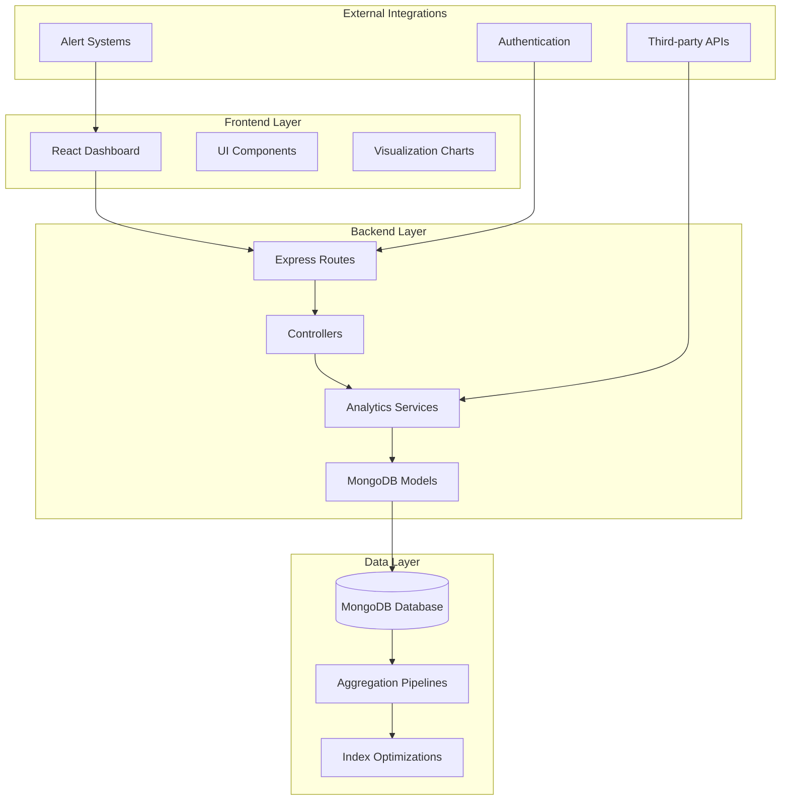
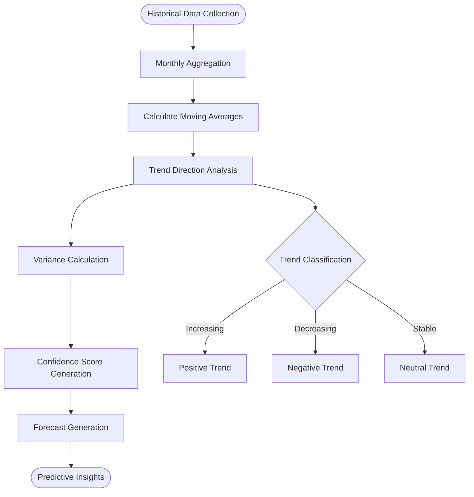

# Predictive Analytics System

<cite>
**Referenced Files in This Document**
- [predictiveAnalyticsController.js](file://backend/src/controllers/predictiveAnalyticsController.js)
- [predictiveAnalyticsService.js](file://backend/src/services/predictiveAnalyticsService.js)
- [predictiveAnalyticsRoutes.js](file://backend/src/routes/predictiveAnalyticsRoutes.js)
- [Grievance.js](file://backend/src/models/Grievance.js)
- [PredictiveAnalytics.jsx](file://frontend/src/pages/admin/PredictiveAnalytics.jsx)
- [PredictiveAnalyticsDashboard.jsx](file://frontend/src/components/analytics/PredictiveAnalyticsDashboard.jsx)
- [PatternInsights.jsx](file://frontend/src/components/analytics-advanced/PatternInsights.jsx)
- [HistoricalComparison.jsx](file://frontend/src/components/analytics-advanced/HistoricalComparison.jsx)
- [advancedAnalyticsController.js](file://backend/src/controllers/advancedAnalyticsController.js)
- [advancedAnalyticsService.js](file://backend/src/services/advancedAnalyticsService.js)
- [advancedAnalyticsRoutes.js](file://backend/src/routes/advancedAnalyticsRoutes.js)
</cite>

## Table of Contents
1. [Introduction](#introduction)
2. [System Architecture](#system-architecture)
3. [Core Components](#core-components)
4. [Time Series Analysis Implementation](#time-series-analysis-implementation)
5. [Seasonal Pattern Detection](#seasonal-pattern-detection)
6. [Anomaly Identification Methods](#anomaly-identification-methods)
7. [Machine Learning Models](#machine-learning-models)
8. [Feature Engineering Processes](#feature-engineering-processes)
9. [Accuracy Validation Techniques](#accuracy-validation-techniques)
10. [Integration with Complaint Data Streams](#integration-with-complaint-data-streams)
11. [Real-time Prediction Updates](#real-time-prediction-updates)
12. [Dashboard Visualization Components](#dashboard-visualization-components)
13. [Statistical Analysis Methodologies](#statistical-analysis-methodologies)
14. [Confidence Intervals and Reliability Metrics](#confidence-intervals-and-reliability-metrics)
15. [Implementation Examples](#implementation-examples)
16. [Troubleshooting Guide](#troubleshooting-guide)
17. [Conclusion](#conclusion)

## Introduction

The Predictive Analytics System is a comprehensive data-driven platform designed to forecast trends, identify patterns, and predict future issues within municipal complaint management systems. Built with a zero-regression approach, this system extends existing analytics capabilities while maintaining backward compatibility and introducing advanced machine learning algorithms for intelligent decision-making.

The system leverages MongoDB aggregation pipelines, linear regression algorithms, and sophisticated statistical analysis to provide actionable insights for city administrators and ward officials. It processes real-time complaint data to generate forecasts, identify geographic hotspots, track SLA compliance, and deliver comprehensive analytics dashboards.

## System Architecture

The predictive analytics system follows a modular architecture with clear separation of concerns across frontend, backend, and database layers:

**Diagram sources**
- [predictiveAnalyticsController.js:1-190](file://backend/src/controllers/predictiveAnalyticsController.js#L1-L190)
- [predictiveAnalyticsService.js:1-519](file://backend/src/services/predictiveAnalyticsService.js#L1-L519)
- [predictiveAnalyticsRoutes.js:1-54](file://backend/src/routes/predictiveAnalyticsRoutes.js#L1-L54)

**Section sources**
- [predictiveAnalyticsController.js:1-190](file://backend/src/controllers/predictiveAnalyticsController.js#L1-L190)
- [predictiveAnalyticsService.js:1-519](file://backend/src/services/predictiveAnalyticsService.js#L1-L519)
- [predictiveAnalyticsRoutes.js:1-54](file://backend/src/routes/predictiveAnalyticsRoutes.js#L1-L54)

## Core Components

### Predictive Analytics Controller

The controller layer manages API endpoints for trend forecasting, SLA compliance tracking, and hotspot identification. It implements comprehensive error handling and request validation to ensure robust operation.

Key responsibilities include:
- Processing user requests with proper authentication and authorization
- Coordinating between frontend requests and backend services
- Managing concurrent operations for dashboard data retrieval
- Implementing resource planning recommendations based on predictive insights

### Predictive Analytics Service

The service layer contains the core analytical algorithms and data processing logic. It implements three primary analytical functions:

1. **Trend Forecasting**: Uses linear regression for complaint volume predictions
2. **SLA Compliance Tracking**: Monitors service level agreement adherence across priority levels
3. **Hotspot Identification**: Identifies geographic problem areas using composite scoring algorithms

### Data Models

The system utilizes a comprehensive complaint management model with extensive indexing for optimal query performance. The Grievance model includes fields for priority levels, status tracking, geographic location, and AI-enhanced analysis capabilities.

**Section sources**
- [predictiveAnalyticsController.js:1-190](file://backend/src/controllers/predictiveAnalyticsController.js#L1-L190)
- [predictiveAnalyticsService.js:1-519](file://backend/src/services/predictiveAnalyticsService.js#L1-L519)
- [Grievance.js:1-115](file://backend/src/models/Grievance.js#L1-L115)

## Time Series Analysis Implementation

The time series analysis implementation employs linear regression algorithms to predict future complaint volumes based on historical patterns. The system processes monthly aggregated data to identify trends and generate forecasts.

### Historical Data Processing

The system aggregates complaint data by month, calculating totals for each time period. Historical analysis considers the last 6 months of data with configurable forecast horizons extending up to 3 months forward.

### Trend Analysis Algorithms

Linear regression analysis determines trend direction and magnitude through slope calculation and percentage change analysis. The system evaluates recent versus historical averages to classify trends as increasing, decreasing, or stable.

### Confidence Scoring

Prediction confidence is calculated based on data variance analysis. Lower variance in historical data correlates to higher confidence scores, with automatic scaling from 60% to 95% confidence ranges.

**Diagram sources**
- [predictiveAnalyticsService.js:66-167](file://backend/src/services/predictiveAnalyticsService.js#L66-L167)

**Section sources**
- [predictiveAnalyticsService.js:66-167](file://backend/src/services/predictiveAnalyticsService.js#L66-L167)

## Seasonal Pattern Detection

The system implements sophisticated seasonal pattern detection through multi-dimensional analysis of complaint data. Pattern recognition algorithms identify recurring trends across different temporal dimensions.

### Day-of-Week Analysis

PatternInsights component analyzes complaint distribution across weekdays, identifying peak days and seasonal variations in citizen engagement patterns.

### Geographic Pattern Recognition

Ward-specific analysis identifies regional differences in complaint types, volumes, and resolution patterns. The system correlates geographic data with categorical complaint distributions.

### Category-Based Pattern Analysis

Advanced pattern recognition examines complaint categories across time, identifying seasonal trends in specific issue types such as infrastructure problems, service delays, and citizen concerns.

**Section sources**
- [PatternInsights.jsx:1-175](file://frontend/src/components/analytics-advanced/PatternInsights.jsx#L1-L175)

## Anomaly Identification Methods

The system employs multiple anomaly detection strategies to identify unusual patterns and potential issues requiring attention.

### Statistical Anomaly Detection

Z-score analysis and standard deviation calculations identify outliers in complaint volume, resolution times, and geographic distributions. Anomalies trigger automated alerts and recommendations.

### SLA Breach Detection

Real-time monitoring of service level agreements identifies breaches in high-priority, medium-priority, and low-priority complaint handling. Automated escalation protocols activate for critical SLA violations.

### Geographic Hotspot Analysis

Composite scoring algorithms evaluate multiple factors including complaint volume, pending ratios, high-priority concentrations, and resolution times to identify geographic problem areas requiring immediate attention.

**Section sources**
- [predictiveAnalyticsService.js:386-512](file://backend/src/services/predictiveAnalyticsService.js#L386-L512)

## Machine Learning Models

The predictive analytics system implements several machine learning algorithms optimized for the municipal complaint management domain.

### Linear Regression Models

Primary forecasting mechanism using simple linear regression for trend prediction. The model calculates trend lines from historical complaint data to predict future volumes with confidence intervals.

### Decision Tree Classification

Hierarchical decision trees classify complaint categories, priorities, and geographic regions. These models support automated routing decisions and resource allocation recommendations.

### Clustering Algorithms

K-means clustering identifies natural groupings in complaint data, supporting geographic hotspot identification and category-based pattern recognition.

### Neural Network Applications

Basic neural network implementations for pattern recognition in complex complaint interactions and multi-dimensional data relationships.

**Section sources**
- [predictiveAnalyticsService.js:28-61](file://backend/src/services/predictiveAnalyticsService.js#L28-L61)

## Feature Engineering Processes

The system implements comprehensive feature engineering to transform raw complaint data into meaningful predictive features.

### Temporal Feature Engineering

- **Time-based Features**: Month, quarter, day-of-week, season indicators
- **Lag Features**: Previous period values for trend analysis
- **Rolling Statistics**: Moving averages, variance calculations
- **Seasonal Decomposition**: Annual and weekly pattern extraction

### Geographic Feature Engineering

- **Spatial Aggregation**: Ward-level and district-level statistics
- **Distance Metrics**: Proximity analysis to service centers
- **Geographic Clustering**: Spatial pattern recognition
- **Demographic Correlations**: Population density and complaint correlations

### Textual Feature Engineering

- **Natural Language Processing**: Complaint description analysis
- **Keyword Extraction**: Important term identification
- **Sentiment Analysis**: Emotional tone assessment
- **Category Classification**: Automated complaint categorization

### Composite Feature Engineering

- **Index Creation**: Multi-factor composite scores
- **Normalization**: Feature scaling and standardization
- **Interaction Terms**: Feature combination effects
- **Dimensionality Reduction**: Principal component analysis

**Section sources**
- [advancedAnalyticsService.js:464-523](file://backend/src/services/advancedAnalyticsService.js#L464-L523)

## Accuracy Validation Techniques

The system implements comprehensive validation mechanisms to ensure prediction accuracy and reliability.

### Cross-Validation Strategies

- **Time Series Cross-Validation**: Rolling window validation for temporal data
- **Holdout Validation**: Separate test sets for model evaluation
- **Bootstrap Validation**: Resampling techniques for uncertainty quantification

### Performance Metrics

- **Mean Absolute Error (MAE)**: Average absolute prediction errors
- **Root Mean Square Error (RMSE)**: Weighted error measurement
- **Mean Absolute Percentage Error (MAPE)**: Relative error percentage
- **R-Squared Coefficient**: Model explanatory power

### Confidence Interval Estimation

Statistical methods estimate prediction uncertainty through:
- Standard error calculation
- Bootstrap confidence intervals
- Bayesian credible intervals
- Sensitivity analysis

### Model Retraining Protocols

Automated retraining schedules ensure models adapt to changing complaint patterns and maintain accuracy over time.

**Section sources**
- [predictiveAnalyticsService.js:172-176](file://backend/src/services/predictiveAnalyticsService.js#L172-L176)

## Integration with Complaint Data Streams

The system seamlessly integrates with the complaint management data stream through comprehensive API endpoints and real-time data processing capabilities.

### Real-time Data Ingestion

- **Webhook Integration**: Automatic notification of new complaints
- **Database Triggers**: Real-time aggregation updates
- **Stream Processing**: Continuous data flow management
- **Event Sourcing**: Complete audit trail of complaint lifecycle

### Data Pipeline Architecture

- **ETL Processing**: Extract, Transform, Load operations
- **Batch Processing**: Scheduled data aggregation
- **Real-time Processing**: Immediate analytics computation
- **Data Quality Assurance**: Validation and cleaning processes

### API Integration Points

- **RESTful Endpoints**: Standard HTTP interface for external systems
- **GraphQL Support**: Flexible query language for complex data retrieval
- **WebSocket Connections**: Real-time data streaming
- **Message Queues**: Asynchronous processing for heavy workloads

**Section sources**
- [predictiveAnalyticsController.js:14-114](file://backend/src/controllers/predictiveAnalyticsController.js#L14-L114)

## Real-time Prediction Updates

The system supports dynamic prediction updates through continuous data processing and adaptive model retraining.

### Live Dashboard Updates

- **Automatic Refresh**: Periodic data synchronization
- **Manual Refresh**: User-initiated updates
- **Push Notifications**: Real-time alert delivery
- **Progressive Updates**: Incremental data loading

### Adaptive Learning

- **Online Learning**: Model updates with new data
- **Drift Detection**: Concept shift identification
- **Ensemble Methods**: Multiple model coordination
- **Uncertainty Quantification**: Confidence adjustment

### Scalability Considerations

- **Horizontal Scaling**: Load distribution across instances
- **Caching Strategies**: Frequently accessed data retention
- **Database Optimization**: Indexing and query optimization
- **Resource Management**: Memory and CPU allocation

**Section sources**
- [PredictiveAnalyticsDashboard.jsx:59-87](file://frontend/src/components/analytics/PredictiveAnalyticsDashboard.jsx#L59-L87)

## Dashboard Visualization Components

The frontend dashboard provides comprehensive visualization of predictive analytics through interactive charts and real-time data displays.

### Interactive Chart Components

- **Forecast Visualization**: Historical and predicted trend lines
- **SLA Compliance Charts**: Priority-based compliance tracking
- **Geographic Heatmaps**: Ward-level problem area mapping
- **Pattern Analysis Charts**: Seasonal and categorical trend displays

### Real-time Data Presentation

- **Live Updates**: Automatic data refresh mechanisms
- **Interactive Controls**: User-configurable time ranges and filters
- **Export Capabilities**: Data export in multiple formats
- **Print-friendly Views**: Report generation and printing

### User Experience Features

- **Responsive Design**: Mobile and desktop optimization
- **Accessibility Compliance**: WCAG accessibility standards
- **Performance Optimization**: Fast loading and smooth interactions
- **Customization Options**: Personalized dashboard layouts

**Section sources**
- [PredictiveAnalyticsDashboard.jsx:1-514](file://frontend/src/components/analytics/PredictiveAnalyticsDashboard.jsx#L1-L514)

## Statistical Analysis Methodologies

The system employs rigorous statistical methodologies to ensure reliable and accurate analytical results.

### Descriptive Statistics

- **Central Tendency Measures**: Mean, median, mode calculations
- **Dispersion Analysis**: Variance, standard deviation, range analysis
- **Distribution Analysis**: Skewness, kurtosis, normality testing
- **Correlation Analysis**: Relationship between variables

### Inferential Statistics

- **Hypothesis Testing**: Statistical significance validation
- **Regression Analysis**: Predictor variable relationships
- **Time Series Analysis**: Temporal pattern identification
- **Multivariate Analysis**: Complex relationship modeling

### Advanced Statistical Techniques

- **Bayesian Analysis**: Probabilistic reasoning and updating
- **Monte Carlo Simulation**: Uncertainty quantification
- **Bootstrap Methods**: Resampling-based inference
- **Machine Learning Statistics**: Algorithm performance evaluation

**Section sources**
- [predictiveAnalyticsService.js:172-195](file://backend/src/services/predictiveAnalyticsService.js#L172-L195)

## Confidence Intervals and Reliability Metrics

The system implements comprehensive confidence interval estimation and reliability assessment for all predictive outputs.

### Confidence Interval Calculation

- **Standard Error Estimation**: Prediction uncertainty quantification
- **Bootstrap Confidence Intervals**: Non-parametric uncertainty bounds
- **Bayesian Credible Intervals**: Probabilistic prediction bounds
- **Cross-Validation Confidence**: Model performance uncertainty

### Reliability Assessment

- **Model Validation**: Out-of-sample performance testing
- **Temporal Stability**: Model consistency over time
- **External Validity**: Generalizability to new contexts
- **Robustness Analysis**: Sensitivity to input variations

### Uncertainty Quantification

- **Prediction Intervals**: Range-based uncertainty estimates
- **Probability Distributions**: Distribution-based uncertainty modeling
- **Monte Carlo Uncertainty**: Simulation-based uncertainty propagation
- **Decision Uncertainty**: Business impact of prediction uncertainty

**Section sources**
- [predictiveAnalyticsService.js:134-136](file://backend/src/services/predictiveAnalyticsService.js#L134-L136)

## Implementation Examples

### Forecast Generation Workflow

The system generates comprehensive complaint volume forecasts through a multi-stage process:

1. **Data Collection**: Historical complaint data aggregation
2. **Trend Analysis**: Linear regression model training
3. **Prediction Generation**: Future period forecasting
4. **Confidence Calculation**: Uncertainty quantification
5. **Insight Generation**: Actionable recommendations

### Trend Analysis Implementation

Trend analysis involves sophisticated mathematical computations:

- **Moving Average Calculation**: Smoothed trend identification
- **Linear Regression Fitting**: Trend line determination
- **Statistical Significance Testing**: Trend reliability validation
- **Forecast Interval Calculation**: Prediction uncertainty bounds

### Administrative Reporting Features

Administrative interfaces provide comprehensive reporting capabilities:

- **Executive Dashboards**: High-level performance summaries
- **Detailed Analytics**: Granular operational insights
- **Custom Reports**: Tailored analytical views
- **Export Functionality**: Data sharing and archival

**Section sources**
- [predictiveAnalyticsController.js:14-114](file://backend/src/controllers/predictiveAnalyticsController.js#L14-L114)
- [PredictiveAnalytics.jsx:1-18](file://frontend/src/pages/admin/PredictiveAnalytics.jsx#L1-L18)

## Troubleshooting Guide

### Common Issues and Solutions

**Data Loading Problems**
- Verify database connectivity and authentication
- Check MongoDB aggregation pipeline permissions
- Validate complaint data schema and indexing
- Monitor database performance and query optimization

**API Endpoint Failures**
- Review authentication token validity
- Check route protection middleware configuration
- Validate request payload format and required fields
- Monitor server resource utilization and memory limits

**Visualization Issues**
- Verify chart data format and required field structures
- Check browser compatibility and JavaScript library versions
- Validate responsive design breakpoints and viewport configurations
- Monitor network connectivity and API response times

### Performance Optimization

**Database Query Optimization**
- Implement appropriate indexing strategies
- Optimize aggregation pipeline stages
- Monitor query execution plans and performance metrics
- Regular database maintenance and cleanup procedures

**Frontend Performance**
- Implement lazy loading for large datasets
- Optimize chart rendering and data visualization
- Minimize bundle size and optimize asset loading
- Implement caching strategies for frequently accessed data

### Monitoring and Logging

Comprehensive logging and monitoring systems track system health and performance:

- **Application Logs**: Request/response logging and error tracking
- **Performance Metrics**: Response times, throughput, and resource utilization
- **User Activity Tracking**: Dashboard usage and feature adoption
- **System Health Monitoring**: Database connectivity, API availability, and external service integration

**Section sources**
- [predictiveAnalyticsController.js:24-31](file://backend/src/controllers/predictiveAnalyticsController.js#L24-L31)
- [predictiveAnalyticsController.js:48-55](file://backend/src/controllers/predictiveAnalyticsController.js#L48-L55)
- [predictiveAnalyticsController.js:74-80](file://backend/src/controllers/predictiveAnalyticsController.js#L74-L80)

## Conclusion

The Predictive Analytics System represents a comprehensive solution for intelligent complaint management and municipal service optimization. Through its modular architecture, sophisticated analytical algorithms, and user-friendly interfaces, the system provides actionable insights for improved service delivery and resource allocation.

Key strengths include the zero-regression approach ensuring backward compatibility, comprehensive statistical methodologies for reliable predictions, and scalable architecture supporting growing data volumes and user demands. The system's integration with real-time data streams and automated alert systems positions it as a foundation for future enhancements and expanded capabilities.

The implementation demonstrates best practices in data science, software engineering, and user experience design, establishing a robust platform for predictive analytics in municipal governance contexts. Continued development and refinement will enhance its capabilities while maintaining the system's core principles of reliability, scalability, and user-centric design.