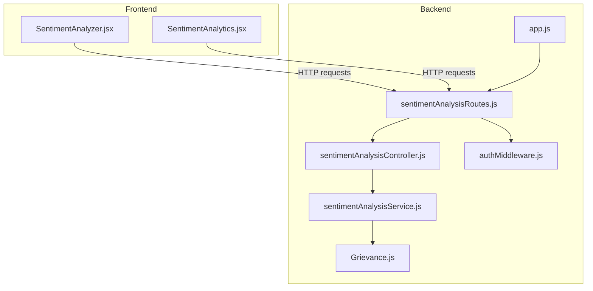
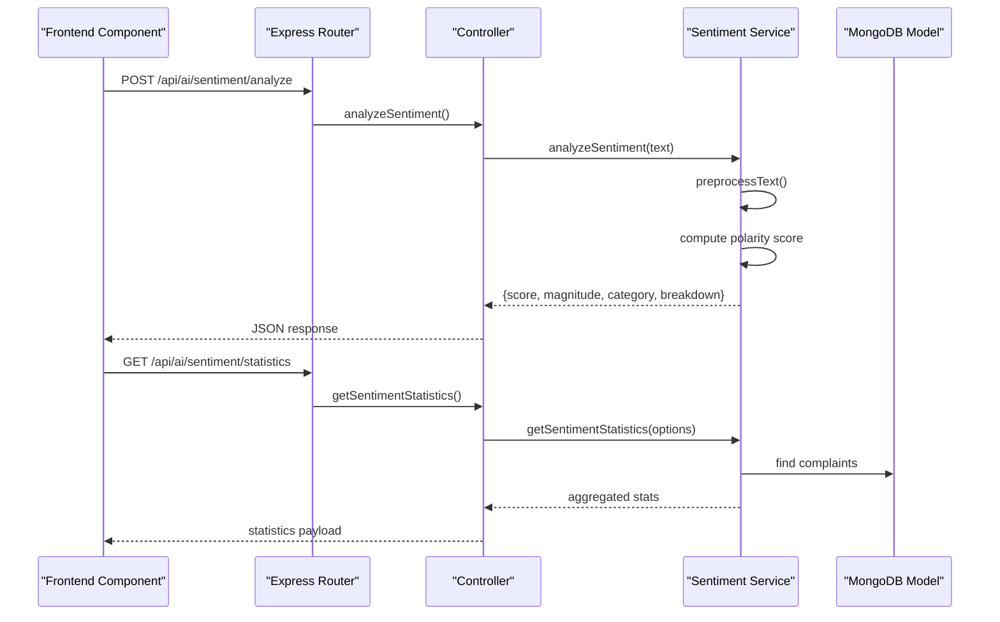
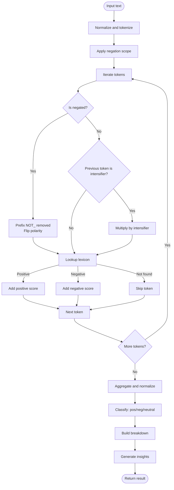
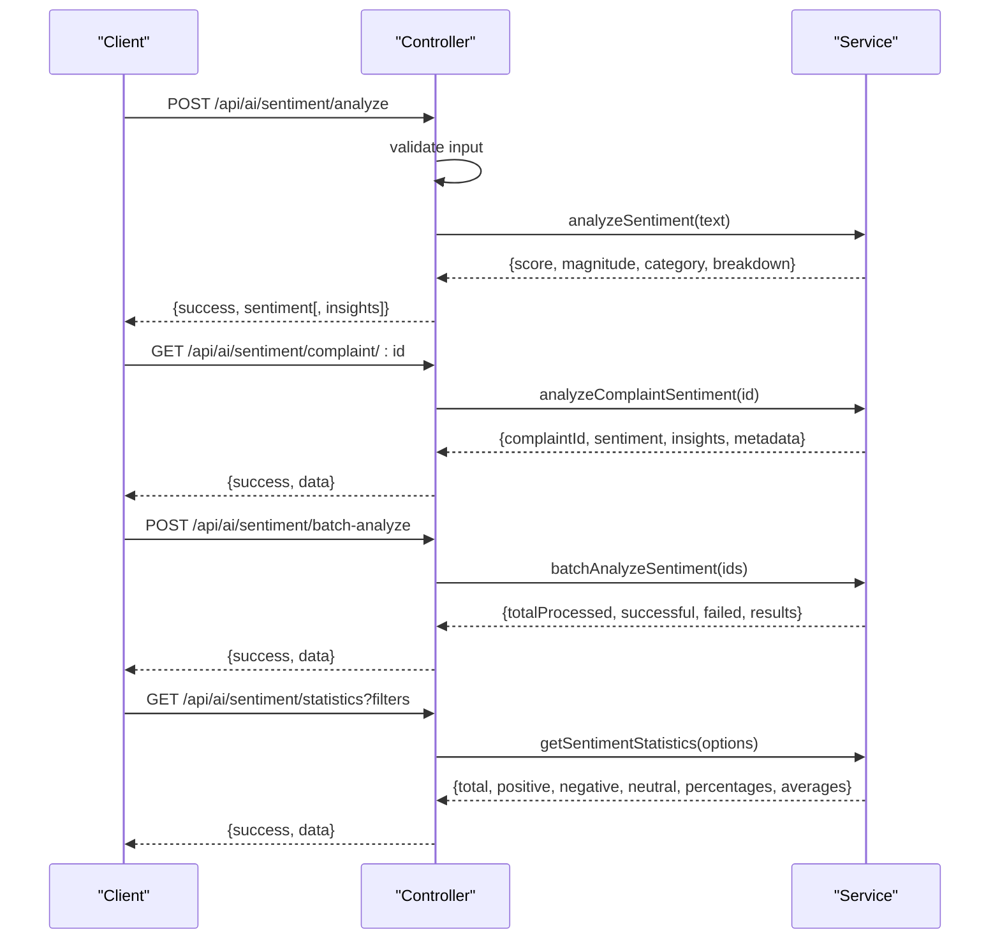
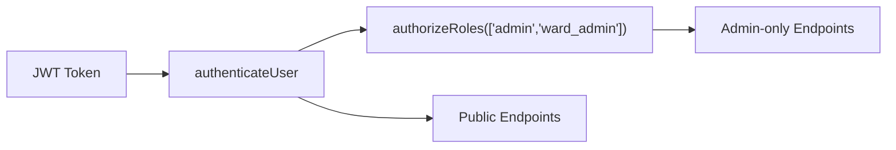
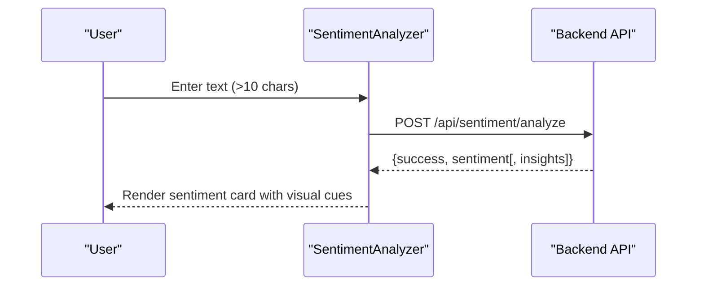
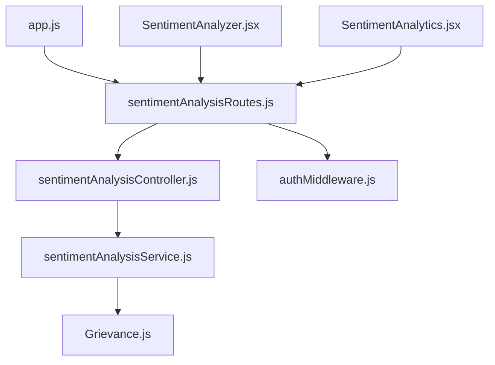

# Sentiment Analysis Engine

<cite>
**Referenced Files in This Document**
- [sentimentAnalysisService.js](file://backend/src/services/sentimentAnalysisService.js)
- [sentimentAnalysisController.js](file://backend/src/controllers/sentimentAnalysisController.js)
- [sentimentAnalysisRoutes.js](file://backend/src/routes/sentimentAnalysisRoutes.js)
- [Grievance.js](file://backend/src/models/Grievance.js)
- [app.js](file://backend/src/app.js)
- [authMiddleware.js](file://backend/src/middleware/authMiddleware.js)
- [SentimentAnalyzer.jsx](file://Frontend/src/components/ai/SentimentAnalyzer.jsx)
- [SentimentAnalytics.jsx](file://Frontend/src/pages/admin/SentimentAnalytics.jsx)
</cite>

## Table of Contents
1. [Introduction](#introduction)
2. [Project Structure](#project-structure)
3. [Core Components](#core-components)
4. [Architecture Overview](#architecture-overview)
5. [Detailed Component Analysis](#detailed-component-analysis)
6. [Dependency Analysis](#dependency-analysis)
7. [Performance Considerations](#performance-considerations)
8. [Troubleshooting Guide](#troubleshooting-guide)
9. [Conclusion](#conclusion)

## Introduction
This document describes the sentiment analysis engine that powers real-time emotion detection and text analysis for complaint text processing. It covers the custom NLP implementation with word scoring systems, emotional keyword detection, contextual analysis, and integration with the broader grievance management system. The documentation explains the sentiment scoring methodology, confidence thresholds, classification accuracy metrics, real-time analysis workflows, performance optimization techniques, and frontend visualization components.

## Project Structure
The sentiment analysis engine spans backend services and controllers, frontend components, and shared models. The backend exposes REST endpoints for real-time sentiment analysis, batch processing, and analytics dashboards. The frontend integrates these APIs into interactive components for live sentiment visualization and administrative analytics.

**Diagram sources**
- [sentimentAnalysisRoutes.js:1-56](file://backend/src/routes/sentimentAnalysisRoutes.js#L1-L56)
- [sentimentAnalysisController.js:1-248](file://backend/src/controllers/sentimentAnalysisController.js#L1-L248)
- [sentimentAnalysisService.js:1-374](file://backend/src/services/sentimentAnalysisService.js#L1-L374)
- [Grievance.js:1-115](file://backend/src/models/Grievance.js#L1-L115)
- [app.js:1-71](file://backend/src/app.js#L1-L71)
- [authMiddleware.js:1-114](file://backend/src/middleware/authMiddleware.js#L1-L114)
- [SentimentAnalyzer.jsx:1-281](file://Frontend/src/components/ai/SentimentAnalyzer.jsx#L1-L281)
- [SentimentAnalytics.jsx:1-633](file://Frontend/src/pages/admin/SentimentAnalytics.jsx#L1-L633)

**Section sources**
- [app.js:56-58](file://backend/src/app.js#L56-L58)
- [sentimentAnalysisRoutes.js:1-56](file://backend/src/routes/sentimentAnalysisRoutes.js#L1-L56)

## Core Components
- Backend service: Implements lexicon-based sentiment analysis with negation handling, intensifier scaling, and contextual insights.
- Controllers: Expose REST endpoints for real-time analysis, complaint-specific analysis, batch processing, statistics, and trend analysis.
- Routes: Define endpoint contracts and apply authentication/authorization middleware.
- Models: Store complaint data used for sentiment analysis and analytics.
- Frontend components: Provide real-time sentiment visualization and administrative dashboards.

**Section sources**
- [sentimentAnalysisService.js:10-374](file://backend/src/services/sentimentAnalysisService.js#L10-L374)
- [sentimentAnalysisController.js:14-245](file://backend/src/controllers/sentimentAnalysisController.js#L14-L245)
- [sentimentAnalysisRoutes.js:22-53](file://backend/src/routes/sentimentAnalysisRoutes.js#L22-L53)
- [Grievance.js:3-99](file://backend/src/models/Grievance.js#L3-L99)
- [SentimentAnalyzer.jsx:24-79](file://Frontend/src/components/ai/SentimentAnalyzer.jsx#L24-L79)
- [SentimentAnalytics.jsx:72-123](file://Frontend/src/pages/admin/SentimentAnalytics.jsx#L72-L123)

## Architecture Overview
The system follows a layered architecture:
- Presentation layer: Frontend components consume backend APIs.
- Application layer: Controllers orchestrate requests and responses.
- Domain layer: Services encapsulate sentiment analysis logic.
- Persistence layer: Mongoose models represent complaint data.

**Diagram sources**
- [sentimentAnalysisController.js:14-138](file://backend/src/controllers/sentimentAnalysisController.js#L14-L138)
- [sentimentAnalysisService.js:97-363](file://backend/src/services/sentimentAnalysisService.js#L97-L363)
- [Grievance.js:3-99](file://backend/src/models/Grievance.js#L3-L99)
- [sentimentAnalysisRoutes.js:22-53](file://backend/src/routes/sentimentAnalysisRoutes.js#L22-L53)

## Detailed Component Analysis

### Backend Service: Lexicon-Based Sentiment Analysis
The service implements a custom NLP pipeline:
- Text normalization and tokenization
- Negation scope handling (marks subsequent words)
- Intensifier application (multipliers)
- Polarity scoring aggregation
- Normalization to [-1, 1]
- Category assignment with thresholds
- Insight generation based on magnitude and direction

**Diagram sources**
- [sentimentAnalysisService.js:57-153](file://backend/src/services/sentimentAnalysisService.js#L57-L153)
- [sentimentAnalysisService.js:187-226](file://backend/src/services/sentimentAnalysisService.js#L187-L226)

Key implementation details:
- Lexicon-based scoring with predefined positive and negative words mapped to polarities in [-1, 1].
- Negation words flip sentiment polarity for a short scope.
- Intensifiers multiply the absolute score contribution of the following word.
- Final score is averaged by number of sentiment-bearing words to normalize.
- Category thresholds: positive if score > 0.1, negative if score < -0.1, otherwise neutral.
- Insights include emotional intensity, sentiment severity, and comparative word counts.

**Section sources**
- [sentimentAnalysisService.js:10-37](file://backend/src/services/sentimentAnalysisService.js#L10-L37)
- [sentimentAnalysisService.js:46-52](file://backend/src/services/sentimentAnalysisService.js#L46-L52)
- [sentimentAnalysisService.js:57-92](file://backend/src/services/sentimentAnalysisService.js#L57-L92)
- [sentimentAnalysisService.js:97-153](file://backend/src/services/sentimentAnalysisService.js#L97-L153)
- [sentimentAnalysisService.js:187-226](file://backend/src/services/sentimentAnalysisService.js#L187-L226)

### Controllers: Real-Time and Batch Workflows
Controllers expose endpoints for:
- Real-time sentiment analysis of arbitrary text
- Complaint-specific sentiment analysis
- Batch sentiment analysis for multiple complaints
- Statistics and trend analysis for admin dashboards

**Diagram sources**
- [sentimentAnalysisController.js:14-245](file://backend/src/controllers/sentimentAnalysisController.js#L14-L245)
- [sentimentAnalysisService.js:231-257](file://backend/src/services/sentimentAnalysisService.js#L231-L257)
- [sentimentAnalysisService.js:262-299](file://backend/src/services/sentimentAnalysisService.js#L262-L299)
- [sentimentAnalysisService.js:304-363](file://backend/src/services/sentimentAnalysisService.js#L304-L363)

Operational constraints and validations:
- Text length threshold for auto-analysis in frontend.
- Batch size capped at 100 complaints.
- Trend analysis supports day/week/month intervals with a maximum window of 365 days.
- Admin-only endpoints protected by role-based authorization.

**Section sources**
- [SentimentAnalyzer.jsx:34-41](file://Frontend/src/components/ai/SentimentAnalyzer.jsx#L34-L41)
- [sentimentAnalysisController.js:73-105](file://backend/src/controllers/sentimentAnalysisController.js#L73-L105)
- [sentimentAnalysisController.js:145-244](file://backend/src/controllers/sentimentAnalysisController.js#L145-L244)

### Routes and Middleware: Security and Access Control
Routes define endpoint contracts and enforce authentication and authorization:
- All sentiment routes are protected by JWT authentication.
- Admin-only routes require roles "admin" or "ward_admin".
- Legacy mounting under "/api/sentiment" for frontend compatibility.

**Diagram sources**
- [sentimentAnalysisRoutes.js:19-35](file://backend/src/routes/sentimentAnalysisRoutes.js#L19-L35)
- [authMiddleware.js:10-71](file://backend/src/middleware/authMiddleware.js#L10-L71)
- [app.js:56-58](file://backend/src/app.js#L56-L58)

**Section sources**
- [sentimentAnalysisRoutes.js:19-35](file://backend/src/routes/sentimentAnalysisRoutes.js#L19-L35)
- [authMiddleware.js:10-71](file://backend/src/middleware/authMiddleware.js#L10-L71)
- [app.js:56-58](file://backend/src/app.js#L56-L58)

### Frontend Components: Real-Time Visualization and Admin Dashboards
Frontend components integrate with backend APIs to deliver:
- Real-time sentiment cards with score, magnitude, and breakdown
- Interactive insights and visual indicators
- Administrative analytics dashboards with charts and filters

**Diagram sources**
- [SentimentAnalyzer.jsx:43-79](file://Frontend/src/components/ai/SentimentAnalyzer.jsx#L43-L79)
- [sentimentAnalysisController.js:14-41](file://backend/src/controllers/sentimentAnalysisController.js#L14-L41)

Administrative dashboard features:
- Statistics endpoint for sentiment distribution and averages
- Trend visualization over configurable periods
- Filtering by date range, category, priority, and ward
- Recommendations and insights surfaced from AI analysis

**Section sources**
- [SentimentAnalyzer.jsx:1-281](file://Frontend/src/components/ai/SentimentAnalyzer.jsx#L1-L281)
- [SentimentAnalytics.jsx:72-123](file://Frontend/src/pages/admin/SentimentAnalytics.jsx#L72-L123)
- [SentimentAnalytics.jsx:396-465](file://Frontend/src/pages/admin/SentimentAnalytics.jsx#L396-L465)

## Dependency Analysis
The sentiment analysis module exhibits low coupling and high cohesion:
- Controllers depend on the service layer for business logic.
- Service layer depends on the complaint model for data retrieval.
- Routes depend on controllers and middleware for request handling.
- Frontend components depend on backend endpoints for data.

**Diagram sources**
- [sentimentAnalysisRoutes.js:1-56](file://backend/src/routes/sentimentAnalysisRoutes.js#L1-L56)
- [sentimentAnalysisController.js:1-248](file://backend/src/controllers/sentimentAnalysisController.js#L1-L248)
- [sentimentAnalysisService.js:1-374](file://backend/src/services/sentimentAnalysisService.js#L1-L374)
- [Grievance.js:1-115](file://backend/src/models/Grievance.js#L1-L115)
- [app.js:1-71](file://backend/src/app.js#L1-L71)
- [authMiddleware.js:1-114](file://backend/src/middleware/authMiddleware.js#L1-L114)
- [SentimentAnalyzer.jsx:1-281](file://Frontend/src/components/ai/SentimentAnalyzer.jsx#L1-L281)
- [SentimentAnalytics.jsx:1-633](file://Frontend/src/pages/admin/SentimentAnalytics.jsx#L1-L633)

**Section sources**
- [sentimentAnalysisService.js:231-257](file://backend/src/services/sentimentAnalysisService.js#L231-L257)
- [sentimentAnalysisController.js:48-66](file://backend/src/controllers/sentimentAnalysisController.js#L48-L66)

## Performance Considerations
- Tokenization and preprocessing: O(n) over the number of tokens; negation scope scanning adds bounded overhead per token.
- Lexicon lookup: O(1) average-case hash map access per token.
- Aggregation: Single pass over tokens with constant-time operations.
- Batch processing: Parallelizable per complaint; capped at 100 to prevent overload.
- Database queries: Indexes on complaint fields support efficient filtering for statistics and trends.
- Frontend throttling: Auto-analysis triggers only for texts exceeding a minimum length to avoid unnecessary requests.

[No sources needed since this section provides general guidance]

## Troubleshooting Guide
Common issues and resolutions:
- Missing or invalid JWT token: Ensure proper authentication headers and valid token expiration.
- Complaint not found: Verify complaint ID exists and belongs to the requesting user or ward.
- Empty or insufficient text: Minimum length checks prevent analysis for very short inputs.
- Batch size exceeded: Reduce the number of complaint IDs to ≤100 per request.
- CORS or endpoint mismatch: Confirm frontend requests target the correct base URL and route paths.

**Section sources**
- [authMiddleware.js:13-54](file://backend/src/middleware/authMiddleware.js#L13-L54)
- [sentimentAnalysisController.js:18-23](file://backend/src/controllers/sentimentAnalysisController.js#L18-L23)
- [sentimentAnalysisController.js:77-89](file://backend/src/controllers/sentimentAnalysisController.js#L77-L89)
- [SentimentAnalyzer.jsx:34-41](file://Frontend/src/components/ai/SentimentAnalyzer.jsx#L34-L41)

## Conclusion
The sentiment analysis engine provides a robust, lexicon-based solution for real-time emotion detection integrated with complaint text processing. Its modular design enables seamless frontend visualization and administrative analytics while maintaining clear separation of concerns. The system’s thresholds, insights, and visualization components support informed decision-making and improved citizen service delivery.