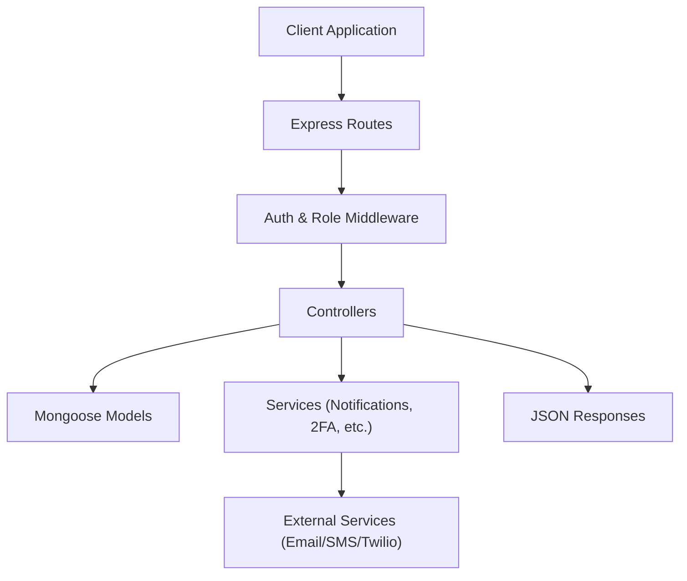
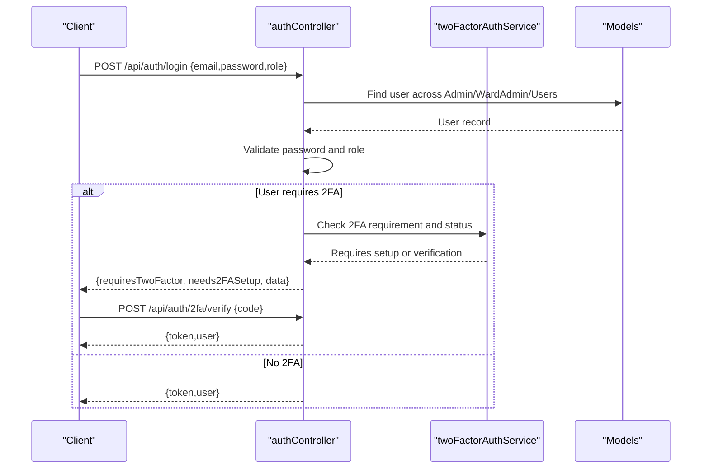
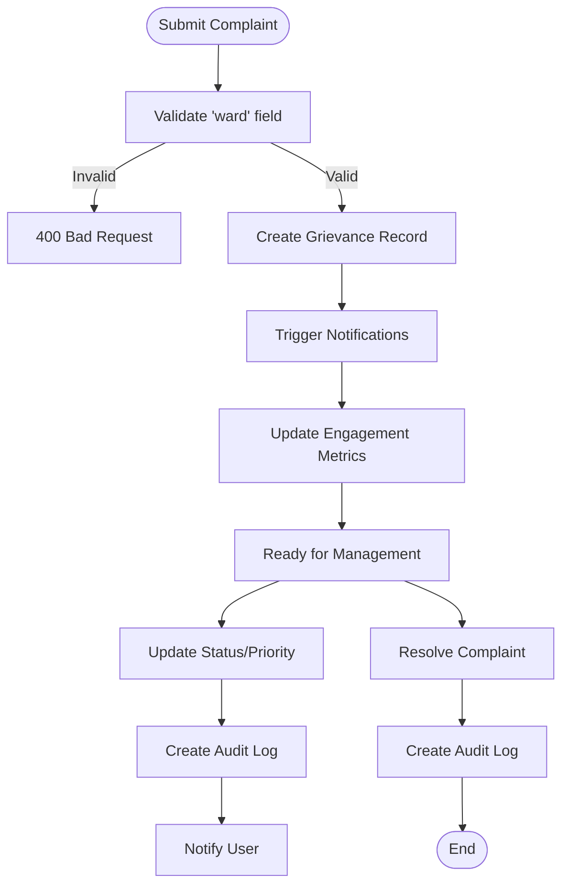
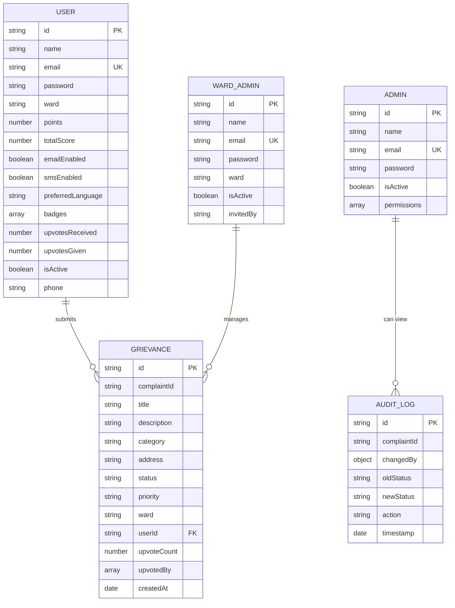
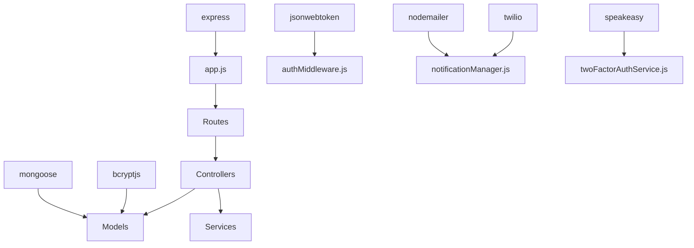

# API Reference

<cite>
**Referenced Files in This Document**
- [server.js](file://backend/server.js)
- [app.js](file://backend/src/app.js)
- [authRoutes.js](file://backend/src/routes/authRoutes.js)
- [twoFactorAuthRoutes.js](file://backend/src/routes/twoFactorAuthRoutes.js)
- [grievanceRoutes.js](file://backend/src/routes/grievanceRoutes.js)
- [userRoutes.js](file://backend/src/routes/userRoutes.js)
- [adminRoutes.js](file://backend/src/routes/adminRoutes.js)
- [wardAdminRoutes.js](file://backend/src/routes/wardAdminRoutes.js)
- [authController.js](file://backend/src/controllers/authController.js)
- [grievanceController.js](file://backend/src/controllers/grievanceController.js)
- [userController.js](file://backend/src/controllers/userController.js)
- [authMiddleware.js](file://backend/src/middleware/authMiddleware.js)
- [User.js](file://backend/src/models/User.js)
- [Admin.js](file://backend/src/models/Admin.js)
- [WardAdmin.js](file://backend/src/models/WardAdmin.js)
- [Grievance.js](file://backend/src/models/Grievance.js)
- [AuditLog.js](file://backend/src/models/AuditLog.js)
- [notificationManager.js](file://backend/src/services/notificationManager.js)
- [twoFactorAuthService.js](file://backend/src/services/twoFactorAuthService.js)
</cite>

## Table of Contents
1. [Introduction](#introduction)
2. [Project Structure](#project-structure)
3. [Core Components](#core-components)
4. [Architecture Overview](#architecture-overview)
5. [Detailed Component Analysis](#detailed-component-analysis)
6. [Dependency Analysis](#dependency-analysis)
7. [Performance Considerations](#performance-considerations)
8. [Troubleshooting Guide](#troubleshooting-guide)
9. [Conclusion](#conclusion)
10. [Appendices](#appendices)

## Introduction
This document provides comprehensive API documentation for the Smart Voice Report system. It covers authentication endpoints, complaint management, analytics, administrative operations, and system configuration. The API follows REST conventions, uses JSON for requests and responses, and enforces role-based access control via JWT. It also documents error handling, rate limiting considerations, and versioning information.

## Project Structure
The backend is structured around Express.js with modular routing, controllers, middleware, models, and services. Routes are mounted under /api with versioning handled at the path level (e.g., /api/auth, /api/grievances, /api/analytics). The server initializes the database connection and starts the HTTP listener.

```mermaid
graph TB
Server["server.js<br/>Initialize env, DB, start app"] --> App["app.js<br/>Express app, CORS, JSON, Morgan, routes, error handlers"]
App --> AuthRoutes["/api/auth<br/>authRoutes.js"]
App --> TfaRoutes["/api/auth/2fa<br/>twoFactorAuthRoutes.js"]
App --> GrievanceRoutes["/api/grievances<br/>grievanceRoutes.js"]
App --> UserRoutes["/api/users<br/>userRoutes.js"]
App --> AdminRoutes["/api/admin<br/>adminRoutes.js"]
App --> WardAdminRoutes["/api/ward-admin<br/>wardAdminRoutes.js"]
App --> AnalyticsRoutes["/api/analytics<br/>analyticsRoutes.js"]
App --> AdvancedAnalyticsRoutes["/api/analytics-advanced<br/>advancedAnalyticsRoutes.js"]
App --> FeedbackRoutes["/api/feedback<br/>feedbackRoutes.js"]
App --> LeaderboardRoutes["/api/leaderboard<br/>leaderboardRoutes.js"]
App --> EngagementRoutes["/api/engagement<br/>engagementRoutes.js"]
App --> AiIntelligenceRoutes["/api/ai<br/>aiIntelligenceRoutes.js"]
App --> PredictiveAnalyticsRoutes["/api/predictive<br/>predictiveAnalyticsRoutes.js"]
App --> SentimentAnalysisRoutes["/api/sentiment & /api/ai/sentiment<br/>sentimentAnalysisRoutes.js"]
App --> AdvancedReportingRoutes["/api/advanced-analytics<br/>advancedReportingRoutes.js"]
App --> EnhancedAnalyticsRoutes["/api/analytics<br/>enhancedAnalyticsRoutes.js"]
App --> EnhancedAIRoutes["/api/enhanced-ai<br/>enhancedAIRoutes.js"]
App --> HeatmapRoutes["/api/heatmap<br/>heatmapRoutes.js"]
App --> SmartRoutingRoutes["/api/routing<br/>smartRoutingRoutes.js"]
App --> TransparencyRoutes["/api/transparency<br/>transparencyRoutes.js"]
```

**Diagram sources**
- [server.js:1-22](file://backend/server.js#L1-L22)
- [app.js:43-65](file://backend/src/app.js#L43-L65)

**Section sources**
- [server.js:1-22](file://backend/server.js#L1-L22)
- [app.js:1-71](file://backend/src/app.js#L1-L71)

## Core Components
- Authentication and Authorization: JWT-based with role-aware middleware supporting admin, ward_admin, and user roles.
- Complaint Management: Full lifecycle including creation, tracking, updates, upvotes, resolution, and audit logging.
- Analytics: Statistics, trends, and reporting endpoints for administrators and public dashboards.
- Administration: User management, role assignment, status toggling, and system announcements.
- Notifications: Integrated notification manager for status updates and critical alerts.

**Section sources**
- [authMiddleware.js:10-55](file://backend/src/middleware/authMiddleware.js#L10-L55)
- [authController.js:7-88](file://backend/src/controllers/authController.js#L7-L88)
- [grievanceController.js:70-217](file://backend/src/controllers/grievanceController.js#L70-L217)
- [userController.js:10-64](file://backend/src/controllers/userController.js#L10-L64)

## Architecture Overview
The API architecture separates concerns into routes, controllers, middleware, models, and services. Controllers orchestrate business logic, middleware enforces authentication and authorization, models define data structures, and services encapsulate cross-cutting concerns like notifications and 2FA.

**Diagram sources**
- [app.js:28-71](file://backend/src/app.js#L28-L71)
- [authMiddleware.js:10-55](file://backend/src/middleware/authMiddleware.js#L10-L55)
- [authController.js:90-237](file://backend/src/controllers/authController.js#L90-L237)

## Detailed Component Analysis

### Authentication APIs
Endpoints for user registration and login, including 2FA flows.

- POST /api/auth/register
  - Description: Register a new citizen user.
  - Authentication: None.
  - Request body:
    - name: string (required)
    - email: string (required)
    - password: string (required, length 10–12, must contain letters and digits, not derived from email)
  - Response:
    - token: string
    - user: { id, name, email, role, ward, createdAt }
  - Errors: 400 (validation), 409 (duplicate email), 500 (server error).

- POST /api/auth/login
  - Description: Authenticate user with role-based access control.
  - Authentication: None.
  - Request body:
    - email: string (required)
    - password: string (required)
    - role: string (optional; "admin" or "user")
  - Response:
    - If 2FA required:
      - requiresTwoFactor: boolean
      - needs2FASetup: boolean (true if 2FA not enabled)
      - data: { userId, email, setupToken (when applicable) }
    - Else:
      - token: string
      - user: { id, name, email, role, createdAt, ward (for ward_admin) }
  - Errors: 400 (missing fields), 401 (invalid credentials), 403 (access denied), 500 (server error).

- POST /api/auth/2fa/send-code
  - Description: Send 2FA code to enrolled user (client initiates).
  - Authentication: None.
  - Response: Success indicator.

- POST /api/auth/2fa/verify
  - Description: Verify 2FA code and finalize login.
  - Authentication: None.
  - Response: Same as login success payload with token.

- POST /api/auth/2fa/setup
  - Description: Enable 2FA for a user who requires setup.
  - Authentication: Requires setupToken issued during login.
  - Response: Success indicator.

- POST /api/auth/2fa/disable
  - Description: Disable 2FA for the authenticated user.
  - Authentication: JWT required.
  - Response: Success indicator.

- POST /api/auth/logout
  - Description: Logout endpoint (no-op server-side; client clears token).
  - Authentication: JWT required.
  - Response: Success indicator.

Authentication flow sequence:

**Diagram sources**
- [authController.js:90-237](file://backend/src/controllers/authController.js#L90-L237)
- [twoFactorAuthService.js](file://backend/src/services/twoFactorAuthService.js)

**Section sources**
- [authRoutes.js:1-10](file://backend/src/routes/authRoutes.js#L1-L10)
- [authController.js:7-88](file://backend/src/controllers/authController.js#L7-L88)
- [authController.js:90-237](file://backend/src/controllers/authController.js#L90-L237)

### Complaint Management APIs
Endpoints for submitting, tracking, updating, resolving, and auditing complaints.

- POST /api/grievances
  - Description: Submit a new grievance (ward is mandatory).
  - Authentication: JWT required.
  - Roles: user, admin.
  - Request body:
    - title: string
    - description: string
    - category: string
    - location/address: string
    - priority: string ("low" | "medium" | "high")
    - anonymous: boolean
    - ward: string (must be one of ["Ward 1","Ward 2","Ward 3","Ward 4","Ward 5"])
    - imageUrl, latitude, longitude: optional
  - Response: Created grievance with populated user info.
  - Errors: 400 (ward validation), 403 (access denied), 500 (server error).

- GET /api/grievances/my
  - Description: Retrieve authenticated user’s grievances.
  - Authentication: JWT required.
  - Roles: user.
  - Response: Array of grievances sorted by newest.

- GET /api/grievances/id/:complaintId
  - Description: Public tracking endpoint (no auth).
  - Response: Grievance details for public display.

- GET /api/grievances/public
  - Description: Public listing with filters and sorting.
  - Query params:
    - sortBy: "newest" | "most-upvoted"
    - category: string
    - status: string
  - Response: Transformed array for frontend.

- GET /api/grievances
  - Description: Fetch grievances (admin/ward_admin).
  - Authentication: JWT required.
  - Roles: admin, ward_admin.
  - Query params:
    - ward or wardId: filter by ward (super admin only).
  - Response: Paginated and filtered grievances.

- GET /api/grievances/admin/stats
  - Description: Admin dashboard statistics.
  - Authentication: JWT required.
  - Roles: admin, ward_admin.
  - Response: Counts for total, pending, resolved, in-progress.

- GET /api/grievances/admin/ward-stats
  - Description: Ward-wise complaint distribution and trends.
  - Authentication: JWT required.
  - Roles: admin, ward_admin.
  - Response: Ward data, issue type distribution, monthly resolution trend.

- PUT /api/grievances/:id
  - Description: Update status or priority.
  - Authentication: JWT required.
  - Roles: admin, ward_admin.
  - Path params:
    - id: complaintId
  - Request body:
    - status: string
    - priority: string
  - Response: Updated grievance with audit log entry.

- POST /api/grievances/:id/resolve
  - Description: Mark grievance as resolved.
  - Authentication: JWT required.
  - Roles: admin, ward_admin.
  - Response: Resolved grievance with notification.

- POST /api/grievances/:id/upvote
  - Description: Upvote a grievance (self-upvote forbidden).
  - Authentication: JWT required.
  - Response: New upvote count, awarded points, and owner info.

- GET /api/grievances/:id/audit-logs
  - Description: View audit logs for a grievance.
  - Authentication: JWT required.
  - Roles: admin, ward_admin.
  - Response: Audit log entries ordered by timestamp.

Complaint lifecycle flow:

**Diagram sources**
- [grievanceController.js:70-217](file://backend/src/controllers/grievanceController.js#L70-L217)
- [grievanceController.js:344-428](file://backend/src/controllers/grievanceController.js#L344-L428)
- [grievanceController.js:520-569](file://backend/src/controllers/grievanceController.js#L520-L569)
- [grievanceController.js:434-514](file://backend/src/controllers/grievanceController.js#L434-L514)

**Section sources**
- [grievanceRoutes.js:1-62](file://backend/src/routes/grievanceRoutes.js#L1-L62)
- [grievanceController.js:10-42](file://backend/src/controllers/grievanceController.js#L10-L42)
- [grievanceController.js:70-217](file://backend/src/controllers/grievanceController.js#L70-L217)
- [grievanceController.js:223-292](file://backend/src/controllers/grievanceController.js#L223-L292)
- [grievanceController.js:298-337](file://backend/src/controllers/grievanceController.js#L298-L337)
- [grievanceController.js:344-428](file://backend/src/controllers/grievanceController.js#L344-L428)
- [grievanceController.js:434-514](file://backend/src/controllers/grievanceController.js#L434-L514)
- [grievanceController.js:520-569](file://backend/src/controllers/grievanceController.js#L520-L569)
- [grievanceController.js:576-722](file://backend/src/controllers/grievanceController.js#L576-L722)
- [grievanceController.js:728-751](file://backend/src/controllers/grievanceController.js#L728-L751)

### Analytics APIs
Endpoints for retrieving statistics, exporting reports, and real-time updates.

- GET /api/analytics/complaints-summary
  - Description: Summary statistics for complaints.
  - Authentication: JWT required.
  - Roles: admin, ward_admin.
  - Response: Aggregated counts and distributions.

- GET /api/analytics/complaints-trends
  - Description: Monthly trends for pending/resolved.
  - Authentication: JWT required.
  - Roles: admin, ward_admin.
  - Response: Time-series data.

- GET /api/analytics/ward-performance
  - Description: Ward-wise performance metrics.
  - Authentication: JWT required.
  - Roles: admin, ward_admin.
  - Response: Ward rankings and KPIs.

- GET /api/analytics/export
  - Description: Export complaint data (CSV/Excel).
  - Authentication: JWT required.
  - Roles: admin, ward_admin.
  - Query params:
    - format: "csv" | "xlsx"
    - ward: optional
  - Response: File download.

- GET /api/analytics/realtime
  - Description: Real-time updates for dashboards.
  - Authentication: JWT required.
  - Roles: admin, ward_admin.
  - Response: Live event stream or polling endpoint.

Note: Specific endpoint paths and schemas for analytics endpoints are defined in their respective route and controller files.

**Section sources**
- [advancedAnalyticsRoutes.js](file://backend/src/routes/advancedAnalyticsRoutes.js)
- [advancedAnalyticsController.js](file://backend/src/controllers/advancedAnalyticsController.js)
- [enhancedAnalyticsRoutes.js](file://backend/src/routes/enhancedAnalyticsRoutes.js)
- [enhancedAnalyticsController.js](file://backend/src/controllers/enhancedAnalyticsController.js)

### Administrative APIs
Endpoints for managing users, complaints, and system configuration.

- GET /api/admin/complaints/all
  - Description: Fetch all complaints (super admin).
  - Authentication: JWT required.
  - Roles: admin.
  - Response: All complaints with optional ward filter.

- GET /api/admin/stats
  - Description: System-wide dashboard stats.
  - Authentication: JWT required.
  - Roles: admin.
  - Response: Global KPIs.

- GET /api/admin/ward-stats
  - Description: Ward-wise complaint distribution.
  - Authentication: JWT required.
  - Roles: admin.
  - Response: Ward data and issue type breakdown.

- GET /api/admin/users/ward-admins
  - Description: List ward admins with complaint counts.
  - Authentication: JWT required.
  - Roles: admin.
  - Response: Ward admin profiles with counts.

- GET /api/admin/users
  - Description: List all admin and ward admin users.
  - Authentication: JWT required.
  - Roles: admin.
  - Query params:
    - role: "admin" | "ward_admin"
  - Response: Formatted user list.

- PUT /api/admin/users/:id/assign-role
  - Description: Assign role and ward to a user.
  - Authentication: JWT required.
  - Roles: admin.
  - Request body:
    - role: "user" | "ward_admin" | "admin"
    - ward: string (required for ward_admin)
  - Response: Updated user info.

- PATCH /api/admin/users/toggle-status/:id
  - Description: Enable/disable admin/ward admin accounts.
  - Authentication: JWT required.
  - Roles: admin.
  - Response: Status change confirmation.

- POST /api/admin/announcement
  - Description: Send system-wide or ward-targeted announcement.
  - Authentication: JWT required.
  - Roles: admin.
  - Request body:
    - title: string
    - message: string
    - targetWard: string (optional)
  - Response: Delivery summary.

**Section sources**
- [adminRoutes.js:1-40](file://backend/src/routes/adminRoutes.js#L1-L40)
- [userController.js:278-350](file://backend/src/controllers/userController.js#L278-L350)
- [userController.js:357-402](file://backend/src/controllers/userController.js#L357-L402)
- [userController.js:409-449](file://backend/src/controllers/userController.js#L409-L449)
- [userController.js:489-523](file://backend/src/controllers/userController.js#L489-L523)

### User Management APIs
Endpoints for user profiles, badges, stats, and preferences.

- GET /api/users/profile
  - Description: Current user profile with dynamic stats and badges.
  - Authentication: JWT required.
  - Roles: user.
  - Response: User, stats, badges, and progress.

- GET /api/users/profile/:id
  - Description: Public profile of another user.
  - Authentication: JWT required.
  - Roles: user.
  - Response: Public profile data.

- GET /api/users/badges
  - Description: Earned badges and progress.
  - Authentication: JWT required.
  - Roles: user.
  - Response: Badges and collection progress.

- GET /api/users/stats
  - Description: Dynamic user statistics.
  - Authentication: JWT required.
  - Roles: user.
  - Response: Submitted, resolved, upvotes, score, and breakdown.

- GET /api/users/recent-activity
  - Description: Recent grievances with current status.
  - Authentication: JWT required.
  - Roles: user.
  - Query params:
    - limit: number
  - Response: Recent activity list.

- PATCH /api/users/preferences
  - Description: Update notification preferences.
  - Authentication: JWT required.
  - Roles: user.
  - Request body:
    - emailEnabled: boolean
    - smsEnabled: boolean
    - phone: string
    - preferredLanguage: string
  - Response: Updated preferences.

**Section sources**
- [userRoutes.js](file://backend/src/routes/userRoutes.js)
- [userController.js:10-64](file://backend/src/controllers/userController.js#L10-L64)
- [userController.js:67-125](file://backend/src/controllers/userController.js#L67-L125)
- [userController.js:132-157](file://backend/src/controllers/userController.js#L132-L157)
- [userController.js:164-198](file://backend/src/controllers/userController.js#L164-L198)
- [userController.js:204-232](file://backend/src/controllers/userController.js#L204-L232)
- [userController.js:455-484](file://backend/src/controllers/userController.js#L455-L484)

### Data Models
Core data structures used by the API.

**Diagram sources**
- [User.js:4-165](file://backend/src/models/User.js#L4-L165)
- [Admin.js](file://backend/src/models/Admin.js)
- [WardAdmin.js](file://backend/src/models/WardAdmin.js)
- [Grievance.js](file://backend/src/models/Grievance.js)
- [AuditLog.js](file://backend/src/models/AuditLog.js)

**Section sources**
- [User.js:4-165](file://backend/src/models/User.js#L4-L165)
- [Admin.js](file://backend/src/models/Admin.js)
- [WardAdmin.js](file://backend/src/models/WardAdmin.js)
- [Grievance.js](file://backend/src/models/Grievance.js)
- [AuditLog.js](file://backend/src/models/AuditLog.js)

## Dependency Analysis
Key dependencies and their roles:
- Express: Web framework and routing.
- Mongoose: MongoDB ODM for models.
- jsonwebtoken: JWT signing and verification.
- bcryptjs: Password hashing.
- nodemailer, qrcode, speakeasy, twilio: Email/SMS, QR, 2FA, and messaging.
- morgan: HTTP request logging.
- cors: Cross-origin support.

**Diagram sources**
- [package.json:10-22](file://backend/package.json#L10-L22)
- [app.js:28-71](file://backend/src/app.js#L28-L71)
- [authMiddleware.js:10-55](file://backend/src/middleware/authMiddleware.js#L10-L55)
- [notificationManager.js](file://backend/src/services/notificationManager.js)
- [twoFactorAuthService.js](file://backend/src/services/twoFactorAuthService.js)

**Section sources**
- [package.json:10-22](file://backend/package.json#L10-L22)

## Performance Considerations
- Rate Limiting: Not implemented in the current codebase. Consider adding rate limiting per IP or per user for sensitive endpoints (login, 2FA).
- Payload Limits: JSON body size is capped at 2MB to accommodate base64 images; adjust as needed.
- Indexes: Models include indexes for performance (email, ward, scores). Ensure additional indexes for frequent queries.
- Asynchronous Operations: Notifications and engagement updates are non-blocking to avoid response delays.
- Pagination: Use query parameters (limit, skip) for large datasets in listing endpoints.

[No sources needed since this section provides general guidance]

## Troubleshooting Guide
- Authentication Failures:
  - Missing or invalid Bearer token: 401 Unauthorized.
  - Expired or malformed token: 401 Unauthorized.
  - Disabled account: 403 Forbidden.
- Authorization Failures:
  - Insufficient role: 403 Forbidden.
  - Ward access violation: 403 Forbidden for ward_admin attempting to access other wards.
- Validation Errors:
  - Missing required fields or invalid formats: 400 Bad Request.
  - Duplicate email: 409 Conflict.
- Complaint Management:
  - Not found: 404 Not Found.
  - Self-upvote or duplicate upvote: 403 Forbidden.
  - Already resolved: 400 Bad Request.
- Notifications:
  - Non-blocking failures logged; verify external service credentials.

**Section sources**
- [authMiddleware.js:10-55](file://backend/src/middleware/authMiddleware.js#L10-L55)
- [authController.js:90-237](file://backend/src/controllers/authController.js#L90-L237)
- [grievanceController.js:344-428](file://backend/src/controllers/grievanceController.js#L344-L428)
- [grievanceController.js:434-514](file://backend/src/controllers/grievanceController.js#L434-L514)
- [grievanceController.js:520-569](file://backend/src/controllers/grievanceController.js#L520-L569)

## Conclusion
The API provides a robust, role-aware interface for authentication, complaint management, analytics, and administration. It emphasizes clear separation of concerns, non-blocking operations, and extensibility. Future enhancements could include standardized rate limiting, OpenAPI/Swagger documentation, and granular audit trails.

[No sources needed since this section summarizes without analyzing specific files]

## Appendices

### Authentication Requirements
- Header: Authorization: Bearer <token>
- Token Payload: { id, role, ward (optional) }
- Secret: JWT_SECRET (environment variable)

**Section sources**
- [authMiddleware.js:10-55](file://backend/src/middleware/authMiddleware.js#L10-L55)
- [authController.js:59-84](file://backend/src/controllers/authController.js#L59-L84)

### Versioning Information
- Base URL: /api
- Versioning Strategy: Path-based (e.g., /api/v1). Current routes do not include a version segment; future versions can be introduced under /api/v2.

**Section sources**
- [app.js:43-65](file://backend/src/app.js#L43-L65)

### Error Handling
- Centralized error middleware handles uncaught exceptions.
- Standardized response shape: { success: boolean, message: string, data?: any }.

**Section sources**
- [app.js:67-68](file://backend/src/app.js#L67-L68)

### Practical Examples and Client Implementation Guidelines
- Client Responsibilities:
  - Store JWT securely (e.g., HttpOnly cookies or secure storage).
  - Attach Authorization header for protected endpoints.
  - Handle 2FA setup and verification flows.
- Example Flows:
  - Registration: POST /api/auth/register -> Store token -> Redirect to dashboard.
  - Login: POST /api/auth/login -> On requiresTwoFactor=true, prompt for 2FA -> POST /api/auth/2fa/verify -> Receive token.
  - Submit Complaint: POST /api/grievances with ward validation -> Handle notifications.
  - Admin Actions: Use /api/admin endpoints with admin role.

[No sources needed since this section provides general guidance]