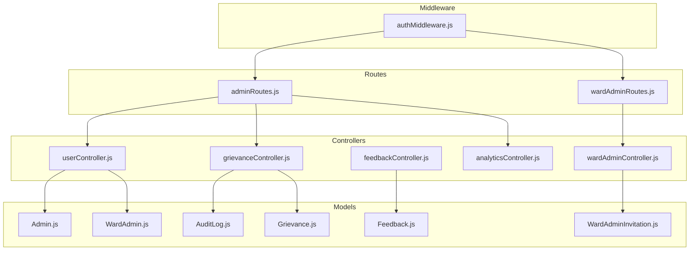
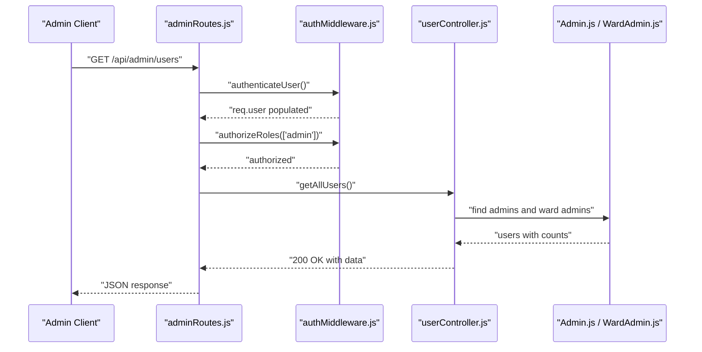
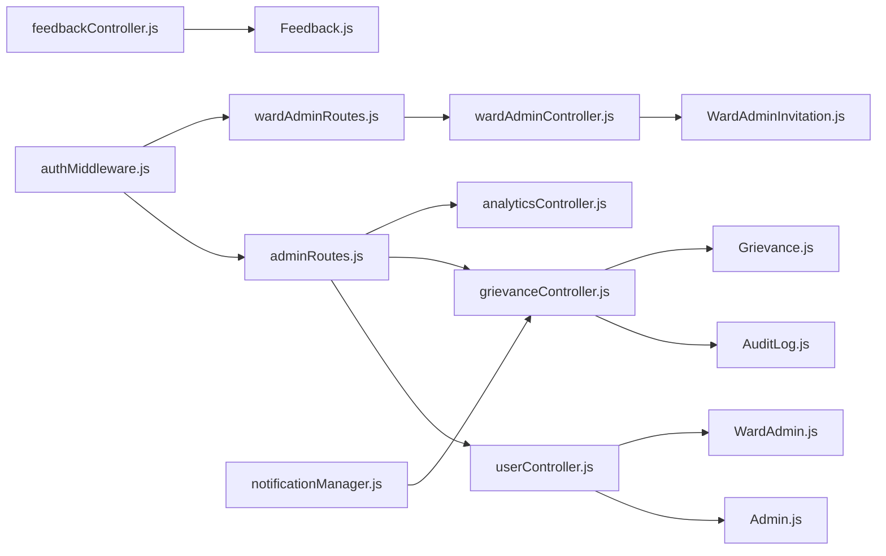
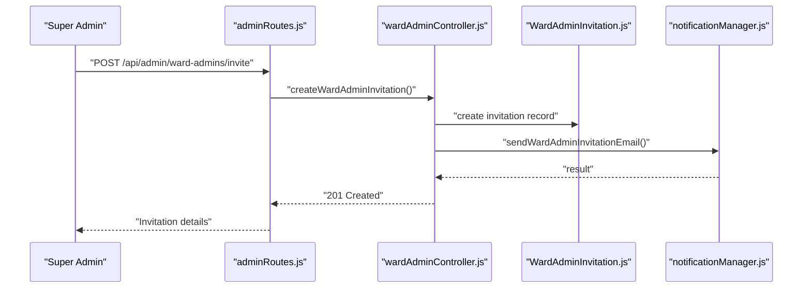
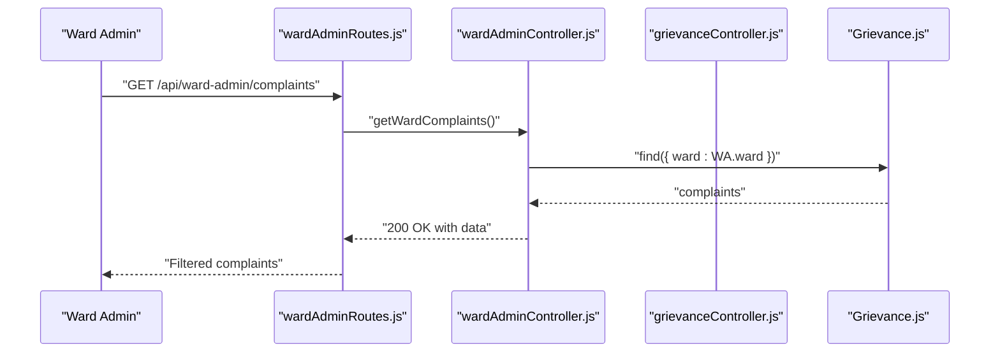
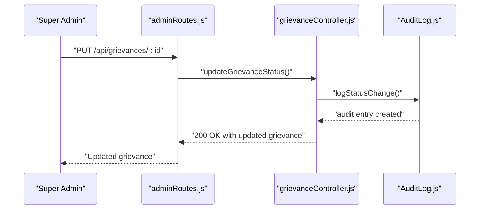

# Administrative APIs

<cite>
**Referenced Files in This Document**
- [adminRoutes.js](file://backend/src/routes/adminRoutes.js)
- [wardAdminRoutes.js](file://backend/src/routes/wardAdminRoutes.js)
- [authMiddleware.js](file://backend/src/middleware/authMiddleware.js)
- [userController.js](file://backend/src/controllers/userController.js)
- [grievanceController.js](file://backend/src/controllers/grievanceController.js)
- [feedbackController.js](file://backend/src/controllers/feedbackController.js)
- [analyticsController.js](file://backend/src/controllers/analyticsController.js)
- [wardAdminController.js](file://backend/src/controllers/wardAdminController.js)
- [Admin.js](file://backend/src/models/Admin.js)
- [WardAdmin.js](file://backend/src/models/WardAdmin.js)
- [WardAdminInvitation.js](file://backend/src/models/WardAdminInvitation.js)
- [Grievance.js](file://backend/src/models/Grievance.js)
- [Feedback.js](file://backend/src/models/Feedback.js)
- [AuditLog.js](file://backend/src/models/AuditLog.js)
- [notificationManager.js](file://backend/src/services/notificationManager.js)
- [WARD_ADMIN_IMPLEMENTATION.md](file://WARD_ADMIN_IMPLEMENTATION.md)
</cite>

## Table of Contents
1. [Introduction](#introduction)
2. [Project Structure](#project-structure)
3. [Core Components](#core-components)
4. [Architecture Overview](#architecture-overview)
5. [Detailed Component Analysis](#detailed-component-analysis)
6. [Dependency Analysis](#dependency-analysis)
7. [Performance Considerations](#performance-considerations)
8. [Troubleshooting Guide](#troubleshooting-guide)
9. [Conclusion](#conclusion)
10. [Appendices](#appendices)

## Introduction
This document provides comprehensive API documentation for administrative management endpoints. It covers:
- Super admin APIs for user management, system configuration, and complaint oversight
- Ward administrator APIs for ward-specific complaint handling, performance monitoring, and staff management
- User management endpoints for profile updates, role assignments, and access control
- Feedback management APIs for citizen feedback collection, analysis, and response tracking
- Administrative dashboard endpoints for system metrics, user analytics, and complaint trends
- Permission requirements, audit logging, and administrative workflow examples

## Project Structure
Administrative APIs are organized under dedicated routes and controllers:
- Super admin routes: `/api/admin`
- Ward admin routes: `/api/ward-admin`
- Shared complaint and feedback endpoints: `/api/grievances`, `/api/feedback`
- Analytics endpoints: `/api/analytics`

**Diagram sources**
- [adminRoutes.js:1-40](file://backend/src/routes/adminRoutes.js#L1-L40)
- [wardAdminRoutes.js:1-28](file://backend/src/routes/wardAdminRoutes.js#L1-L28)
- [authMiddleware.js:1-114](file://backend/src/middleware/authMiddleware.js#L1-L114)
- [userController.js:1-523](file://backend/src/controllers/userController.js#L1-L523)
- [grievanceController.js:1-752](file://backend/src/controllers/grievanceController.js#L1-L752)
- [feedbackController.js:1-225](file://backend/src/controllers/feedbackController.js#L1-L225)
- [analyticsController.js:1-203](file://backend/src/controllers/analyticsController.js#L1-L203)
- [wardAdminController.js:1-450](file://backend/src/controllers/wardAdminController.js#L1-L450)
- [Admin.js:1-55](file://backend/src/models/Admin.js#L1-L55)
- [WardAdmin.js:1-61](file://backend/src/models/WardAdmin.js#L1-L61)
- [WardAdminInvitation.js:1-50](file://backend/src/models/WardAdminInvitation.js#L1-L50)
- [Grievance.js:1-115](file://backend/src/models/Grievance.js#L1-L115)
- [Feedback.js:1-40](file://backend/src/models/Feedback.js#L1-L40)
- [AuditLog.js:1-42](file://backend/src/models/AuditLog.js#L1-L42)

**Section sources**
- [adminRoutes.js:1-40](file://backend/src/routes/adminRoutes.js#L1-L40)
- [wardAdminRoutes.js:1-28](file://backend/src/routes/wardAdminRoutes.js#L1-L28)
- [authMiddleware.js:1-114](file://backend/src/middleware/authMiddleware.js#L1-L114)

## Core Components
- Authentication and authorization enforce role-based access across all administrative endpoints.
- Super admin endpoints manage users, system announcements, and global complaint statistics.
- Ward admin endpoints manage invitations, staff onboarding, and ward-specific complaints.
- Complaint lifecycle endpoints support status updates, priority escalation, and audit logging.
- Feedback endpoints enable citizen feedback collection and aggregated analytics.
- Analytics endpoints provide trends, ward performance, and resolution time insights.

**Section sources**
- [authMiddleware.js:10-114](file://backend/src/middleware/authMiddleware.js#L10-L114)
- [userController.js:277-523](file://backend/src/controllers/userController.js#L277-L523)
- [wardAdminController.js:14-450](file://backend/src/controllers/wardAdminController.js#L14-L450)
- [grievanceController.js:238-752](file://backend/src/controllers/grievanceController.js#L238-L752)
- [feedbackController.js:8-225](file://backend/src/controllers/feedbackController.js#L8-L225)
- [analyticsController.js:8-203](file://backend/src/controllers/analyticsController.js#L8-L203)

## Architecture Overview
Administrative APIs follow a layered architecture:
- Routes define endpoint contracts and bind middleware for authentication and role authorization.
- Controllers encapsulate business logic, enforce access control, and orchestrate services.
- Models represent domain entities and indexes for efficient queries.
- Services handle cross-cutting concerns like notifications and analytics.

**Diagram sources**
- [adminRoutes.js:21-37](file://backend/src/routes/adminRoutes.js#L21-L37)
- [authMiddleware.js:10-71](file://backend/src/middleware/authMiddleware.js#L10-L71)
- [userController.js:282-350](file://backend/src/controllers/userController.js#L282-L350)
- [Admin.js:1-55](file://backend/src/models/Admin.js#L1-L55)
- [WardAdmin.js:1-61](file://backend/src/models/WardAdmin.js#L1-L61)

## Detailed Component Analysis

### Super Admin APIs

#### User Management Endpoints
- GET /api/admin/users
  - Description: Retrieve all admin and ward admin users with optional role filtering.
  - Permissions: admin
  - Response: Array of users with role, ward, and complaint counts for ward admins.
  - Notes: Combines Admin and WardAdmin collections; includes avatar initials derived from names.

- GET /api/admin/users/ward-admins
  - Description: List all ward admins with their ward-specific complaint counts.
  - Permissions: admin
  - Response: Array of ward admins with counts.

- PUT /api/admin/users/:id/assign-role
  - Description: Assign role and optionally ward to a user.
  - Permissions: admin
  - Validation: Prevents removal of the last super admin; requires role and ward for ward_admin.
  - Response: Updated user details.

- PATCH /api/admin/users/toggle-status/:id
  - Description: Enable or disable an admin or ward admin account.
  - Permissions: admin
  - Validation: Prevents self-disable; searches Admin and WardAdmin collections.

- POST /api/admin/announcement
  - Description: Send system-wide or ward-targeted announcements to users.
  - Permissions: admin
  - Behavior: Uses notification manager to send critical alerts via email/SMS.

**Section sources**
- [adminRoutes.js:30-37](file://backend/src/routes/adminRoutes.js#L30-L37)
- [userController.js:277-523](file://backend/src/controllers/userController.js#L277-L523)
- [authMiddleware.js:61-71](file://backend/src/middleware/authMiddleware.js#L61-L71)

#### Complaint Oversight Endpoints
- GET /api/admin/complaints/all
  - Description: Fetch all grievances with role-based visibility (ward admin restricted to their ward).
  - Permissions: admin or ward_admin
  - Query params: Optional ward filter for admin.

- GET /api/admin/stats
  - Description: Admin dashboard statistics (total, pending, resolved, in-progress).
  - Permissions: admin or ward_admin

- GET /api/admin/ward-stats
  - Description: Ward-wise complaint counts, issue type distribution, and resolution trends.
  - Permissions: admin or ward_admin

**Section sources**
- [adminRoutes.js:25-28](file://backend/src/routes/adminRoutes.js#L25-L28)
- [grievanceController.js:238-752](file://backend/src/controllers/grievanceController.js#L238-L752)

### Ward Administrator APIs

#### Staff Management and Onboarding
- POST /api/ward-admin/invite
  - Description: Create a ward admin invitation with token and expiry.
  - Permissions: admin
  - Validation: Email format, valid ward, uniqueness of pending invitations.

- GET /api/ward-admin/verify/:token
  - Description: Verify invitation token and return invitation details.
  - Permissions: public

- POST /api/ward-admin/verify-and-signup
  - Description: Create a ward admin account using a valid, unexpired token.
  - Permissions: public
  - Validation: Password strength, email uniqueness, token validity.

- GET /api/ward-admin/invitations
  - Description: List pending invitations.
  - Permissions: admin

- POST /api/ward-admin/invitations/:id/resend
  - Description: Resend invitation email; extends expiry if expired.
  - Permissions: admin

- DELETE /api/ward-admin/invitations/:id
  - Description: Delete a pending invitation.
  - Permissions: admin

**Section sources**
- [wardAdminRoutes.js:15-27](file://backend/src/routes/wardAdminRoutes.js#L15-L27)
- [wardAdminController.js:14-450](file://backend/src/controllers/wardAdminController.js#L14-L450)
- [WARD_ADMIN_IMPLEMENTATION.md:145-274](file://WARD_ADMIN_IMPLEMENTATION.md#L145-L274)

#### Ward-Specific Complaint Handling
- GET /api/ward-admin/complaints
  - Description: Retrieve all complaints for the authenticated ward admin’s assigned ward.
  - Permissions: ward_admin
  - Response: Complaints filtered by ward with metadata.

**Section sources**
- [wardAdminRoutes.js:26](file://backend/src/routes/wardAdminRoutes.js#L26)
- [wardAdminController.js:411-450](file://backend/src/controllers/wardAdminController.js#L411-L450)

### Feedback Management APIs
- POST /api/feedback
  - Description: Submit feedback for a resolved complaint owned by the user.
  - Permissions: user
  - Validation: Rating range, complaint ownership, uniqueness.

- GET /api/feedback
  - Description: Retrieve all feedback with aggregated statistics.
  - Permissions: admin

- GET /api/feedback/:complaintId
  - Description: Retrieve feedback for a specific complaint.
  - Permissions: admin

- GET /api/feedback/pending
  - Description: Check for the most recent unresolved, non-skipped resolved complaint requiring feedback.
  - Permissions: user

- POST /api/feedback/skip
  - Description: Skip feedback for a complaint owned by the user.
  - Permissions: user

**Section sources**
- [feedbackController.js:8-225](file://backend/src/controllers/feedbackController.js#L8-L225)

### Administrative Dashboard Endpoints
- GET /api/analytics/trends
  - Description: Complaint trends over time (daily, weekly, monthly) with resolved/pending totals.
  - Permissions: admin

- GET /api/analytics/ward-performance
  - Description: Ward performance ranking by resolution rate, avg resolution time, and counts.
  - Permissions: admin

- GET /api/analytics/resolution-time
  - Description: Average, min, and max resolution time by category for resolved complaints.
  - Permissions: admin

- GET /api/analytics/category-correlation
  - Description: Category distribution per ward.
  - Permissions: admin

**Section sources**
- [analyticsController.js:8-203](file://backend/src/controllers/analyticsController.js#L8-L203)

### Audit Logging
- Status change logging is performed whenever a grievance status is updated.
- Audit entries capture complaintId, actor (userId, role, name), old/new status, and action.

**Section sources**
- [grievanceController.js:47-63](file://backend/src/controllers/grievanceController.js#L47-L63)
- [AuditLog.js:1-42](file://backend/src/models/AuditLog.js#L1-L42)

## Dependency Analysis
Administrative APIs depend on:
- Authentication middleware to populate req.user and enforce roles.
- Controllers to implement access control and orchestrate services.
- Models to persist and query administrative data.
- Services for notifications and analytics.

**Diagram sources**
- [authMiddleware.js:10-114](file://backend/src/middleware/authMiddleware.js#L10-L114)
- [adminRoutes.js:1-40](file://backend/src/routes/adminRoutes.js#L1-L40)
- [wardAdminRoutes.js:1-28](file://backend/src/routes/wardAdminRoutes.js#L1-L28)
- [userController.js:1-523](file://backend/src/controllers/userController.js#L1-L523)
- [grievanceController.js:1-752](file://backend/src/controllers/grievanceController.js#L1-L752)
- [feedbackController.js:1-225](file://backend/src/controllers/feedbackController.js#L1-L225)
- [analyticsController.js:1-203](file://backend/src/controllers/analyticsController.js#L1-L203)
- [wardAdminController.js:1-450](file://backend/src/controllers/wardAdminController.js#L1-L450)
- [Admin.js:1-55](file://backend/src/models/Admin.js#L1-L55)
- [WardAdmin.js:1-61](file://backend/src/models/WardAdmin.js#L1-L61)
- [WardAdminInvitation.js:1-50](file://backend/src/models/WardAdminInvitation.js#L1-L50)
- [Grievance.js:1-115](file://backend/src/models/Grievance.js#L1-L115)
- [Feedback.js:1-40](file://backend/src/models/Feedback.js#L1-L40)
- [AuditLog.js:1-42](file://backend/src/models/AuditLog.js#L1-L42)
- [notificationManager.js:1-93](file://backend/src/services/notificationManager.js#L1-L93)

**Section sources**
- [authMiddleware.js:10-114](file://backend/src/middleware/authMiddleware.js#L10-L114)
- [userController.js:277-523](file://backend/src/controllers/userController.js#L277-L523)
- [grievanceController.js:238-752](file://backend/src/controllers/grievanceController.js#L238-L752)
- [feedbackController.js:8-225](file://backend/src/controllers/feedbackController.js#L8-L225)
- [analyticsController.js:8-203](file://backend/src/controllers/analyticsController.js#L8-L203)
- [wardAdminController.js:14-450](file://backend/src/controllers/wardAdminController.js#L14-L450)

## Performance Considerations
- Indexes on grievance collection (ward, status, category, priority, createdAt, upvoteCount) optimize administrative queries.
- Aggregation pipelines in analytics endpoints compute statistics server-side.
- Notification sending is non-blocking and uses Promise.allSettled to avoid partial failures.

[No sources needed since this section provides general guidance]

## Troubleshooting Guide
Common issues and resolutions:
- Authorization errors: Ensure the Authorization header contains a valid Bearer token and the user role matches the required permissions.
- Role enforcement failures: Verify that authorizeRoles middleware is applied after authenticateUser.
- Ward access violations: Ward admins can only access data for their assigned ward; controllers enforce this restriction.
- Invitation creation conflicts: Pending invitations prevent duplicate creation until expiry.
- Notification failures: notificationManager uses non-blocking promises; check service logs for underlying errors.

**Section sources**
- [authMiddleware.js:10-114](file://backend/src/middleware/authMiddleware.js#L10-L114)
- [grievanceController.js:344-428](file://backend/src/controllers/grievanceController.js#L344-L428)
- [wardAdminController.js:44-101](file://backend/src/controllers/wardAdminController.js#L44-L101)
- [notificationManager.js:7-93](file://backend/src/services/notificationManager.js#L7-L93)

## Conclusion
Administrative APIs provide a secure, role-based interface for managing users, complaints, feedback, and analytics. Super admins oversee system-wide operations, while ward admins focus on localized complaint handling and staff onboarding. Robust access controls, audit logging, and non-blocking notifications ensure reliability and compliance.

[No sources needed since this section summarizes without analyzing specific files]

## Appendices

### Request/Response Schemas

- GET /api/admin/users
  - Response: Array of objects with fields: id, name, email, role, isActive, createdAt, permissions (for admin), or id, name, email, role, ward, isActive, createdAt, invitedBy, complaints, avatar (for ward_admin).

- PUT /api/admin/users/:id/assign-role
  - Request body: { role: "user"|"ward_admin"|"admin", ward?: string }
  - Response: { id, name, role, ward }

- PATCH /api/admin/users/toggle-status/:id
  - Response: { id, name, isActive }

- POST /api/admin/announcement
  - Request body: { title: string, message: string, targetWard?: string }
  - Response: { recipientCount: number }

- GET /api/admin/complaints/all
  - Query params: ward or wardId (admin may filter by ward)
  - Response: Array of grievances with populated userId and complaint metadata

- GET /api/admin/stats
  - Response: { totalComplaints, pendingComplaints, resolvedComplaints, inProgressComplaints }

- GET /api/admin/ward-stats
  - Response: { wardData: [{ ward, complaints }], issueTypeData: [{ category, count }], resolutionTrend: [{ month, year, status, count }] }

- POST /api/ward-admin/invite
  - Request body: { name: string, email: string, ward: "Ward 1"|"Ward 2"|...|"Ward 5" }
  - Response: { id, email, name, ward, expiresAt }

- POST /api/ward-admin/verify-and-signup
  - Request body: { token: string, password: string }
  - Response: { email, role, ward }

- GET /api/ward-admin/complaints
  - Response: Array of grievances for the authenticated ward

- POST /api/feedback
  - Request body: { complaintId: string, rating: number, timelinessRating?: number, comment?: string }
  - Response: Feedback object with timestamps

- GET /api/feedback
  - Response: { feedback: [...], stats: { averageRating, totalFeedback, averageTimeliness, positivePercent } }

- GET /api/feedback/:complaintId
  - Response: Feedback object

- POST /api/feedback/skip
  - Request body: { complaintId: string }
  - Response: { message: "Feedback skipped" }

- GET /api/analytics/trends
  - Query params: range: "daily"|"weekly"|"monthly", startDate, endDate
  - Response: Array of { _id, total, resolved, pending }

- GET /api/analytics/ward-performance
  - Response: Array of { ward, totalComplaints, resolvedComplaints, pendingComplaints, avgResolutionTime, resolutionRate }

- GET /api/analytics/resolution-time
  - Response: Array of { category, avgHours, minHours, maxHours, count }

- GET /api/analytics/category-correlation
  - Response: Array of { ward, categories: [{ category, count }], total }

**Section sources**
- [userController.js:282-523](file://backend/src/controllers/userController.js#L282-L523)
- [grievanceController.js:238-752](file://backend/src/controllers/grievanceController.js#L238-L752)
- [feedbackController.js:8-225](file://backend/src/controllers/feedbackController.js#L8-L225)
- [analyticsController.js:8-203](file://backend/src/controllers/analyticsController.js#L8-L203)
- [wardAdminController.js:14-450](file://backend/src/controllers/wardAdminController.js#L14-L450)

### Administrative Workflow Examples

#### Super Admin: Invite and Onboard Ward Admin

**Diagram sources**
- [wardAdminRoutes.js:20](file://backend/src/routes/wardAdminRoutes.js#L20)
- [wardAdminController.js:14-101](file://backend/src/controllers/wardAdminController.js#L14-L101)
- [WardAdminInvitation.js:1-50](file://backend/src/models/WardAdminInvitation.js#L1-L50)
- [notificationManager.js:1-93](file://backend/src/services/notificationManager.js#L1-L93)

#### Ward Admin: Manage Assigned Ward Complaints

**Diagram sources**
- [wardAdminRoutes.js:26](file://backend/src/routes/wardAdminRoutes.js#L26)
- [wardAdminController.js:411-450](file://backend/src/controllers/wardAdminController.js#L411-L450)
- [Grievance.js:1-115](file://backend/src/models/Grievance.js#L1-L115)

#### Super Admin: Update Complaint Status and Log Audit

**Diagram sources**
- [adminRoutes.js:25](file://backend/src/routes/adminRoutes.js#L25)
- [grievanceController.js:344-428](file://backend/src/controllers/grievanceController.js#L344-L428)
- [AuditLog.js:1-42](file://backend/src/models/AuditLog.js#L1-L42)