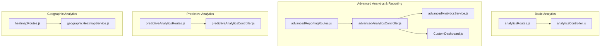
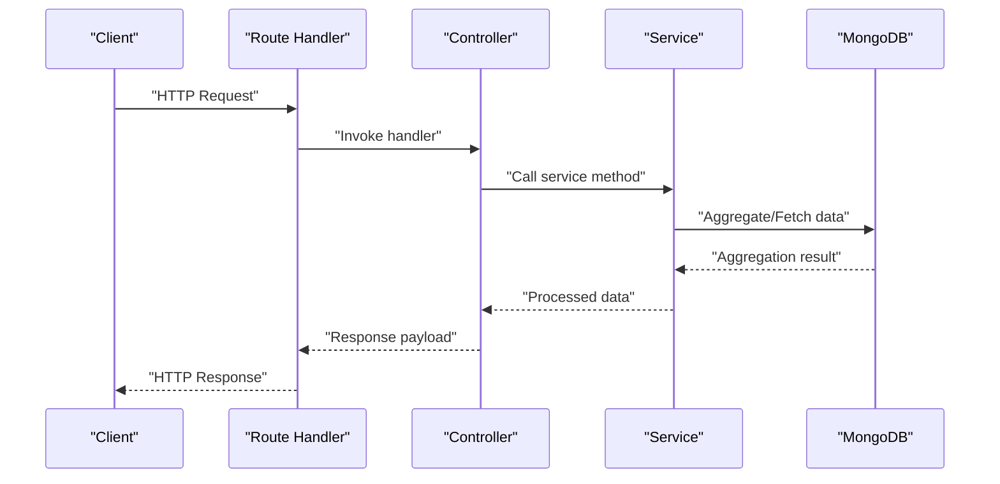
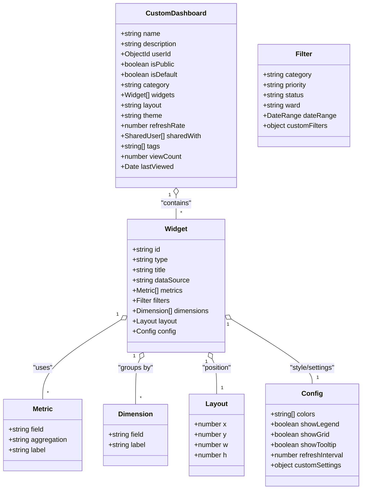
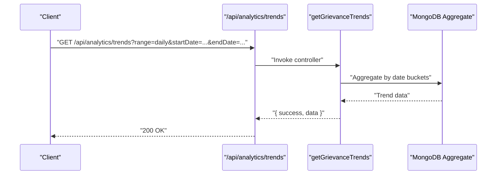
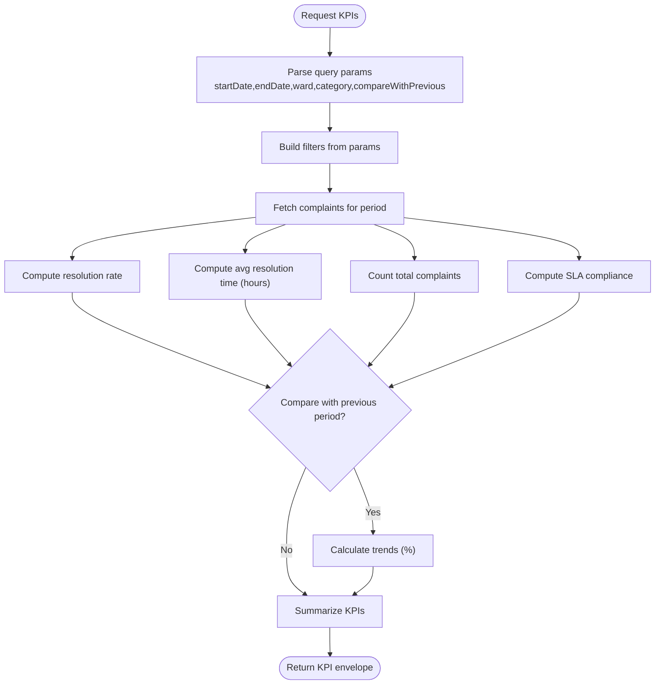
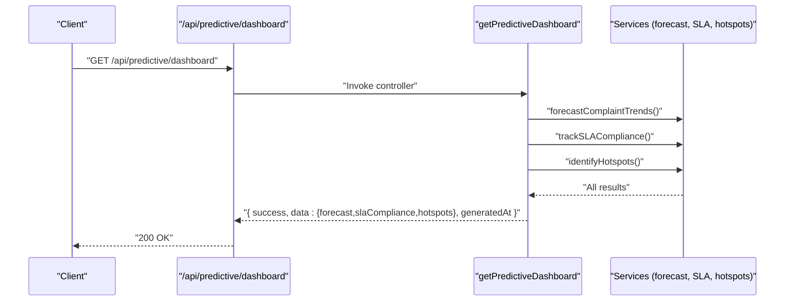
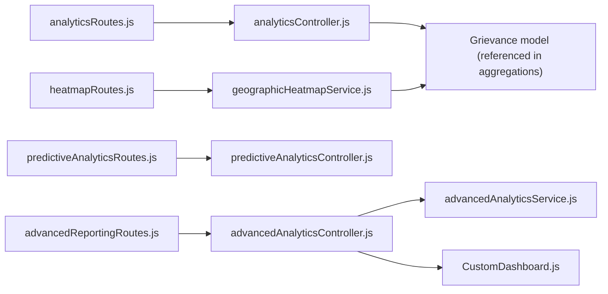

# Analytics & Reporting APIs

<cite>
**Referenced Files in This Document**
- [analyticsController.js](file://backend/src/controllers/analyticsController.js)
- [analyticsRoutes.js](file://backend/src/routes/analyticsRoutes.js)
- [advancedAnalyticsController.js](file://backend/src/controllers/advancedAnalyticsController.js)
- [advancedAnalyticsRoutes.js](file://backend/src/routes/advancedAnalyticsRoutes.js)
- [advancedReportingRoutes.js](file://backend/src/routes/advancedReportingRoutes.js)
- [advancedAnalyticsService.js](file://backend/src/services/advancedAnalyticsService.js)
- [predictiveAnalyticsController.js](file://backend/src/controllers/predictiveAnalyticsController.js)
- [predictiveAnalyticsRoutes.js](file://backend/src/routes/predictiveAnalyticsRoutes.js)
- [geographicHeatmapService.js](file://backend/src/services/geographicHeatmapService.js)
- [heatmapRoutes.js](file://backend/src/routes/heatmapRoutes.js)
- [CustomDashboard.js](file://backend/src/models/CustomDashboard.js)
</cite>

## Table of Contents
1. [Introduction](#introduction)
2. [Project Structure](#project-structure)
3. [Core Components](#core-components)
4. [Architecture Overview](#architecture-overview)
5. [Detailed Component Analysis](#detailed-component-analysis)
6. [Dependency Analysis](#dependency-analysis)
7. [Performance Considerations](#performance-considerations)
8. [Troubleshooting Guide](#troubleshooting-guide)
9. [Conclusion](#conclusion)

## Introduction
This document provides comprehensive API documentation for analytics and reporting endpoints across three primary domains:
- Basic analytics: complaint statistics, trend analysis, and performance metrics
- Advanced analytics: custom dashboards, widget management, and report generation
- Predictive analytics: trend forecasting, SLA tracking, hotspots, and resource planning
- Geographic analytics: heatmaps, SLA monitoring, and ward performance comparison

It covers request/response schemas, filtering options, pagination support, and real-time streaming capabilities where applicable.

## Project Structure
The analytics APIs are organized by domain and layered with controllers, routes, services, and models:
- Basic analytics: controllers and routes under analytics
- Advanced analytics & reporting: controllers, routes, and services under advanced-analytics
- Predictive analytics: controllers and routes under predictive
- Geographic analytics: routes and services under heatmap

**Diagram sources**
- [analyticsRoutes.js:1-22](file://backend/src/routes/analyticsRoutes.js#L1-L22)
- [analyticsController.js:1-203](file://backend/src/controllers/analyticsController.js#L1-L203)
- [advancedReportingRoutes.js:1-88](file://backend/src/routes/advancedReportingRoutes.js#L1-L88)
- [advancedAnalyticsController.js:1-397](file://backend/src/controllers/advancedAnalyticsController.js#L1-L397)
- [advancedAnalyticsService.js:1-532](file://backend/src/services/advancedAnalyticsService.js#L1-L532)
- [CustomDashboard.js:1-160](file://backend/src/models/CustomDashboard.js#L1-L160)
- [predictiveAnalyticsRoutes.js:1-54](file://backend/src/routes/predictiveAnalyticsRoutes.js#L1-L54)
- [predictiveAnalyticsController.js:1-190](file://backend/src/controllers/predictiveAnalyticsController.js#L1-L190)
- [heatmapRoutes.js:1-68](file://backend/src/routes/heatmapRoutes.js#L1-L68)
- [geographicHeatmapService.js:1-91](file://backend/src/services/geographicHeatmapService.js#L1-L91)

**Section sources**
- [analyticsRoutes.js:1-22](file://backend/src/routes/analyticsRoutes.js#L1-L22)
- [advancedReportingRoutes.js:1-88](file://backend/src/routes/advancedReportingRoutes.js#L1-L88)
- [predictiveAnalyticsRoutes.js:1-54](file://backend/src/routes/predictiveAnalyticsRoutes.js#L1-L54)
- [heatmapRoutes.js:1-68](file://backend/src/routes/heatmapRoutes.js#L1-L68)

## Core Components
- Basic analytics endpoints expose complaint trends, ward performance, resolution time analytics, and category correlation.
- Advanced analytics endpoints provide KPI calculation, custom reports, comparative analytics, and full dashboard lifecycle management.
- Predictive analytics endpoints deliver forecasts, SLA compliance, hotspots, and resource planning recommendations.
- Geographic analytics endpoints offer ward heatmaps, category hotspots, and SLA monitoring.

**Section sources**
- [analyticsController.js:1-203](file://backend/src/controllers/analyticsController.js#L1-L203)
- [advancedAnalyticsController.js:1-397](file://backend/src/controllers/advancedAnalyticsController.js#L1-L397)
- [predictiveAnalyticsController.js:1-190](file://backend/src/controllers/predictiveAnalyticsController.js#L1-L190)
- [geographicHeatmapService.js:1-91](file://backend/src/services/geographicHeatmapService.js#L1-L91)

## Architecture Overview
The analytics APIs follow a layered architecture:
- Routes define endpoint contracts and apply authentication/authorization
- Controllers orchestrate requests and delegate to services
- Services encapsulate business logic and data aggregation
- Models represent persistent entities (e.g., CustomDashboard)

**Diagram sources**
- [analyticsRoutes.js:12-21](file://backend/src/routes/analyticsRoutes.js#L12-L21)
- [analyticsController.js:8-53](file://backend/src/controllers/analyticsController.js#L8-L53)
- [advancedReportingRoutes.js:24-87](file://backend/src/routes/advancedReportingRoutes.js#L24-L87)
- [advancedAnalyticsController.js:15-36](file://backend/src/controllers/advancedAnalyticsController.js#L15-L36)
- [predictiveAnalyticsRoutes.js:19-51](file://backend/src/routes/predictiveAnalyticsRoutes.js#L19-L51)
- [predictiveAnalyticsController.js:14-32](file://backend/src/controllers/predictiveAnalyticsController.js#L14-L32)
- [heatmapRoutes.js:20-27](file://backend/src/routes/heatmapRoutes.js#L20-L27)
- [geographicHeatmapService.js:8-63](file://backend/src/services/geographicHeatmapService.js#L8-L63)

## Detailed Component Analysis

### Basic Analytics APIs
Endpoints for complaint statistics, trends, and performance metrics.

- GET /api/analytics/trends
  - Purpose: Retrieve complaint trends over time with configurable grouping (daily, weekly, monthly).
  - Authentication/Authorization: Required, admin or ward_admin.
  - Query Parameters:
    - range: "daily" | "weekly" | "monthly" (default: "monthly")
    - startDate: ISO date
    - endDate: ISO date
  - Response Schema:
    - success: boolean
    - data: array of trend items with keys: _id (time bucket), total, resolved, pending
  - Notes: Supports date range filtering; aggregation groups by formatted date.

- GET /api/analytics/ward-performance
  - Purpose: Rank wards by resolution rate and related metrics.
  - Authentication/Authorization: Required, admin or ward_admin.
  - Response Schema:
    - success: boolean
    - data: array of ward performance items with keys: ward, totalComplaints, resolvedComplaints, pendingComplaints, avgResolutionTime (hours), resolutionRate (%)
  - Notes: Sorts by resolutionRate descending.

- GET /api/analytics/resolution-time
  - Purpose: Category-wise average/min/max resolution time.
  - Authentication/Authorization: Required, admin or ward_admin.
  - Response Schema:
    - success: boolean
    - data: array of category analytics with keys: category, avgHours, minHours, maxHours, count
  - Notes: Filters to resolved complaints only.

- GET /api/analytics/category-correlation
  - Purpose: Ward-category distribution for correlation analysis.
  - Authentication/Authorization: Required, admin or ward_admin.
  - Response Schema:
    - success: boolean
    - data: array of ward entries with keys: ward, categories (array of {category, count}), total
  - Notes: Aggregates counts per ward-category pair.

**Section sources**
- [analyticsRoutes.js:16-19](file://backend/src/routes/analyticsRoutes.js#L16-L19)
- [analyticsController.js:8-53](file://backend/src/controllers/analyticsController.js#L8-L53)
- [analyticsController.js:60-114](file://backend/src/controllers/analyticsController.js#L60-L114)
- [analyticsController.js:121-158](file://backend/src/controllers/analyticsController.js#L121-L158)
- [analyticsController.js:165-202](file://backend/src/controllers/analyticsController.js#L165-L202)

### Advanced Analytics & Reporting APIs
Endpoints for KPIs, custom reports, comparative analytics, and dashboard management.

- GET /api/advanced-analytics/kpis
  - Purpose: Compute KPIs for a given period with optional comparison to previous period.
  - Authentication/Authorization: admin or ward_admin.
  - Query Parameters:
    - startDate: ISO date
    - endDate: ISO date
    - ward: string
    - category: string
    - compareWithPrevious: "true" | "false" (default: "true")
  - Response Schema:
    - success: boolean
    - kpis: object keyed by KPI identifiers with fields: name, description, unit, target, critical, value, trend
    - period: { start, end, ward, category }
    - summary: { totalKPIs, targetsMet, criticalIssues }
  - Notes: Calculates resolution rate, average resolution time, complaint volume, SLA compliance, and growth rates.

- POST /api/advanced-analytics/reports/generate
  - Purpose: Generate custom reports with flexible metrics, dimensions, and filters.
  - Authentication/Authorization: admin or ward_admin.
  - Request Body:
    - reportType: "summary" | "aggregated"
    - dataSource: "complaints" | "users"
    - metrics: array of { field, aggregation: "count"|"sum"|"avg"|"min"|"max", label? }
    - dimensions: array of { field, label? }
    - filters: { category?, priority?, status?, ward? }
    - dateRange: { start?, end? }
    - format: "json" | "csv" | "pdf" (service supports JSON; CSV/PDF export not implemented here)
  - Response Schema:
    - success: boolean
    - reportType, data, metadata: { generatedAt, recordCount, filters, dateRange }

- GET /api/advanced-analytics/comparative
  - Purpose: Comparative analytics across dimensions (ward, category, priority).
  - Authentication/Authorization: admin or ward_admin.
  - Query Parameters:
    - compareBy: "ward" | "category" | "priority"
    - metric: "resolutionRate" | "avgResolutionHours"
    - startDate: ISO date
    - endDate: ISO date
  - Response Schema:
    - success: boolean
    - compareBy, metric
    - results: array of { dimension, totalComplaints, resolvedComplaints, pendingComplaints, resolutionRate (%), avgResolutionHours, rank }
    - benchmarks: { avgResolutionRate, avgResolutionTime, topPerformer, needsImprovement }
    - insights: array of { type, message, priority }

- Dashboard Management
  - POST /api/advanced-analytics/dashboards
    - Purpose: Create a custom dashboard with widgets.
    - Request Body: { name, description?, widgets, layout?, category?, isPublic?, tags? }
    - Response: { success, message, data: dashboard }
  - GET /api/advanced-analytics/dashboards
    - Purpose: List dashboards with optional filters.
    - Query Parameters: category, isPublic
    - Response: { success, data: [dashboard] }
  - GET /api/advanced-analytics/dashboards/:id
    - Purpose: Retrieve a dashboard by ID with view count increment and permission checks.
    - Response: { success, data: dashboard }
  - PUT /api/advanced-analytics/dashboards/:id
    - Purpose: Update dashboard (owner or editor permission required).
    - Request Body: updates (excluding protected fields)
    - Response: { success, message, data: dashboard }
  - DELETE /api/advanced-analytics/dashboards/:id
    - Purpose: Delete dashboard (owner only).
    - Response: { success, message }
  - POST /api/advanced-analytics/dashboards/:id/share
    - Purpose: Share dashboard with users (owner only).
    - Request Body: { userIds, permission: "view" | "edit" }
    - Response: { success, message, data: dashboard }

- Widget Data
  - POST /api/advanced-analytics/widgets/data
    - Purpose: Fetch widget-specific data based on widget configuration.
    - Request Body: { widget: { type, dataSource, metrics, filters, dimensions } }
    - Response: { success, data }

**Section sources**
- [advancedReportingRoutes.js:27-85](file://backend/src/routes/advancedReportingRoutes.js#L27-L85)
- [advancedAnalyticsController.js:15-85](file://backend/src/controllers/advancedAnalyticsController.js#L15-L85)
- [advancedAnalyticsController.js:92-339](file://backend/src/controllers/advancedAnalyticsController.js#L92-L339)
- [advancedAnalyticsService.js:87-207](file://backend/src/services/advancedAnalyticsService.js#L87-L207)
- [advancedAnalyticsService.js:212-317](file://backend/src/services/advancedAnalyticsService.js#L212-L317)
- [advancedAnalyticsService.js:322-418](file://backend/src/services/advancedAnalyticsService.js#L322-L418)
- [advancedAnalyticsService.js:464-523](file://backend/src/services/advancedAnalyticsService.js#L464-L523)
- [CustomDashboard.js:9-160](file://backend/src/models/CustomDashboard.js#L9-L160)

### Predictive Analytics APIs
Endpoints for forecasting, SLA compliance, hotspots, and resource planning.

- GET /api/predictive/forecast
  - Purpose: Forecast complaint trends with historical and forecast windows.
  - Authentication/Authorization: admin or ward_admin.
  - Query Parameters:
    - historicalMonths: number (default: 6)
    - forecastMonths: number (default: 3)
  - Response Schema: depends on service implementation (forecast data structure)

- GET /api/predictive/sla-compliance
  - Purpose: Track SLA compliance over a specified window.
  - Authentication/Authorization: admin or ward_admin.
  - Query Parameters:
    - days: number (default: 30)
  - Response Schema: depends on service implementation (compliance metrics)

- GET /api/predictive/hotspots
  - Purpose: Identify geographic hotspots by recent complaint activity.
  - Authentication/Authorization: admin or ward_admin.
  - Query Parameters:
    - days: number (default: 30)
    - minComplaintsThreshold: number (default: 5)
  - Response Schema: depends on service implementation (hotspot list)

- GET /api/predictive/dashboard
  - Purpose: Aggregate all predictive analytics in a single response.
  - Authentication/Authorization: admin or ward_admin.
  - Response Schema:
    - success: boolean
    - data: { forecast, slaCompliance, hotspots }
    - generatedAt: ISO timestamp

- GET /api/predictive/resource-planning
  - Purpose: Derive resource planning recommendations from forecast and hotspots.
  - Authentication/Authorization: admin or ward_admin.
  - Response Schema:
    - success: boolean
    - data: {
        recommendations: array of { type, priority, message, targetArea, focus? },
        staffAllocation: { immediate, planned, monitoring },
        predictedLoad,
        criticalAreas,
        analysis: { trend, trendPercentage, mostAffectedWard }
      }
    - generatedAt: ISO timestamp

**Section sources**
- [predictiveAnalyticsRoutes.js:24-51](file://backend/src/routes/predictiveAnalyticsRoutes.js#L24-L51)
- [predictiveAnalyticsController.js:14-187](file://backend/src/controllers/predictiveAnalyticsController.js#L14-L187)

### Geographic Analytics APIs
Endpoints for heatmaps, hotspots, and SLA monitoring.

- GET /api/heatmap/heatmap
  - Purpose: Ward-based complaint density for heatmap visualization.
  - Authentication/Authorization: admin or ward_admin.
  - Response Schema:
    - success: boolean
    - data: array of { ward, totalComplaints, pending, inProgress, resolved, highPriority, densityScore, resolutionRate, status }
    - summary: { totalWards, totalComplaints, criticalWards, warningWards }

- GET /api/heatmap/hotspots
  - Purpose: Top category hotspots by ward.
  - Authentication/Authorization: admin or ward_admin.
  - Query Parameters:
    - limit: number (default: 15)
  - Response Schema:
    - success: boolean
    - hotspots: array of { ward, category, complaintCount }

- GET /api/heatmap/sla-alerts
  - Purpose: Real-time SLA breach alerts.
  - Authentication/Authorization: admin or ward_admin.
  - Response Schema: depends on service implementation (alerts list)

- GET /api/heatmap/sla-compliance
  - Purpose: SLA compliance statistics.
  - Authentication/Authorization: admin or ward_admin.
  - Response Schema: depends on service implementation (compliance stats)

**Section sources**
- [heatmapRoutes.js:20-66](file://backend/src/routes/heatmapRoutes.js#L20-L66)
- [geographicHeatmapService.js:8-89](file://backend/src/services/geographicHeatmapService.js#L8-L89)

### Request/Response Schemas and Filtering Options

- Authentication and Authorization
  - All analytics endpoints require bearer token authentication.
  - Roles: admin, ward_admin for most endpoints; some dashboard endpoints are private to owners/editors.

- Filtering Options
  - Date Range: startDate and endDate supported across basic and advanced analytics.
  - Dimensions: ward, category, priority, status, and custom filters supported in advanced analytics.
  - Pagination: Not implemented in current endpoints; use date ranges and limits where available.

- Response Envelope
  - Most endpoints return a standardized envelope: { success: boolean, data?, message?, error? }.

- Real-Time Streaming
  - No WebSocket or Server-Sent Events endpoints are exposed in the current codebase.

**Section sources**
- [analyticsRoutes.js:12-14](file://backend/src/routes/analyticsRoutes.js#L12-L14)
- [advancedReportingRoutes.js:24-26](file://backend/src/routes/advancedReportingRoutes.js#L24-L26)
- [predictiveAnalyticsRoutes.js:19-21](file://backend/src/routes/predictiveAnalyticsRoutes.js#L19-L21)
- [heatmapRoutes.js:13-14](file://backend/src/routes/heatmapRoutes.js#L13-L14)

### Export Functionality
- CSV/PDF Export
  - Not implemented in the current backend analytics endpoints.
  - The advanced reporting service accepts a format parameter but returns JSON; export to CSV/PDF is not present in the current code.

**Section sources**
- [advancedAnalyticsService.js:212-317](file://backend/src/services/advancedAnalyticsService.js#L212-L317)

## Architecture Overview

**Diagram sources**
- [CustomDashboard.js:87-160](file://backend/src/models/CustomDashboard.js#L87-L160)

## Detailed Component Analysis

### Basic Analytics Flow

**Diagram sources**
- [analyticsRoutes.js:16](file://backend/src/routes/analyticsRoutes.js#L16)
- [analyticsController.js:8-53](file://backend/src/controllers/analyticsController.js#L8-L53)

### Advanced Analytics KPI Pipeline

**Diagram sources**
- [advancedAnalyticsService.js:87-207](file://backend/src/services/advancedAnalyticsService.js#L87-L207)

### Predictive Analytics Dashboard Composition

**Diagram sources**
- [predictiveAnalyticsRoutes.js:42](file://backend/src/routes/predictiveAnalyticsRoutes.js#L42)
- [predictiveAnalyticsController.js:88-114](file://backend/src/controllers/predictiveAnalyticsController.js#L88-L114)

## Dependency Analysis

**Diagram sources**
- [analyticsRoutes.js:1-22](file://backend/src/routes/analyticsRoutes.js#L1-L22)
- [advancedReportingRoutes.js:1-88](file://backend/src/routes/advancedReportingRoutes.js#L1-L88)
- [predictiveAnalyticsRoutes.js:1-54](file://backend/src/routes/predictiveAnalyticsRoutes.js#L1-L54)
- [heatmapRoutes.js:1-68](file://backend/src/routes/heatmapRoutes.js#L1-L68)
- [advancedAnalyticsController.js:1-397](file://backend/src/controllers/advancedAnalyticsController.js#L1-L397)
- [advancedAnalyticsService.js:1-532](file://backend/src/services/advancedAnalyticsService.js#L1-L532)
- [geographicHeatmapService.js:1-91](file://backend/src/services/geographicHeatmapService.js#L1-L91)

**Section sources**
- [advancedAnalyticsController.js:1-397](file://backend/src/controllers/advancedAnalyticsController.js#L1-L397)
- [advancedAnalyticsService.js:1-532](file://backend/src/services/advancedAnalyticsService.js#L1-L532)
- [geographicHeatmapService.js:1-91](file://backend/src/services/geographicHeatmapService.js#L1-L91)

## Performance Considerations
- Aggregation Pipelines: Basic and advanced analytics rely heavily on MongoDB aggregation; ensure appropriate indexes on frequently filtered fields (createdAt, status, ward, category, priority).
- Dashboard Widgets: Widget data fetching performs targeted aggregations; avoid excessive widget counts per dashboard to minimize load.
- Predictive Analytics: Forecasting and hotspot identification involve larger datasets; consider caching or scheduled recomputation for frequent access.
- Pagination: Not implemented; use date range filters to limit dataset sizes.

[No sources needed since this section provides general guidance]

## Troubleshooting Guide
- Authentication Failures
  - Symptom: 401 Unauthorized on protected endpoints.
  - Cause: Missing or invalid bearer token.
  - Action: Ensure proper login and token inclusion in Authorization header.

- Authorization Denial
  - Symptom: 403 Forbidden on analytics endpoints.
  - Cause: Missing admin or ward_admin role.
  - Action: Verify user role assignment.

- Dashboard Access Control
  - Symptom: 403 when accessing shared dashboards.
  - Cause: Insufficient permissions (view/edit).
  - Action: Confirm sharedWith entries and permission level.

- Service Errors
  - Symptom: 500 Internal Server Error with { success: false, error }.
  - Cause: Exceptions during aggregation or computation.
  - Action: Check query parameters and data availability; review logs.

**Section sources**
- [advancedAnalyticsController.js:180-192](file://backend/src/controllers/advancedAnalyticsController.js#L180-L192)
- [advancedAnalyticsController.js:232-244](file://backend/src/controllers/advancedAnalyticsController.js#L232-L244)
- [advancedAnalyticsController.js:360-367](file://backend/src/controllers/advancedAnalyticsController.js#L360-L367)

## Conclusion
The analytics and reporting APIs provide a robust foundation for operational insights, custom dashboards, predictive planning, and geographic visualization. While export functionality (CSV/PDF) is not currently implemented in the backend, the architecture supports extension for such features. For optimal performance, leverage date-range filtering, monitor aggregation complexity, and consider caching for frequently accessed predictive outputs.

[No sources needed since this section summarizes without analyzing specific files]