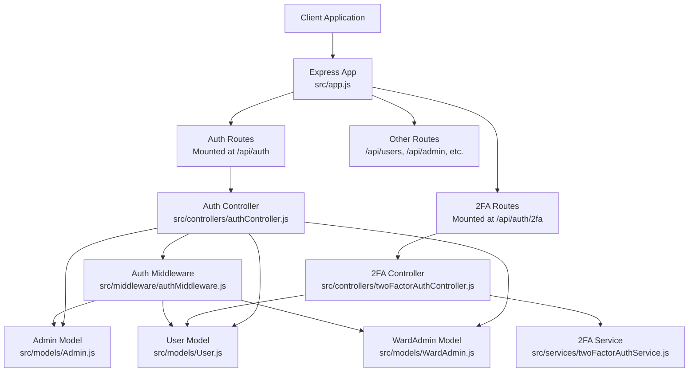
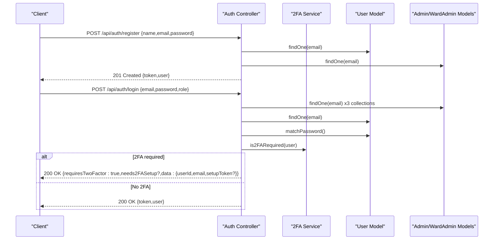
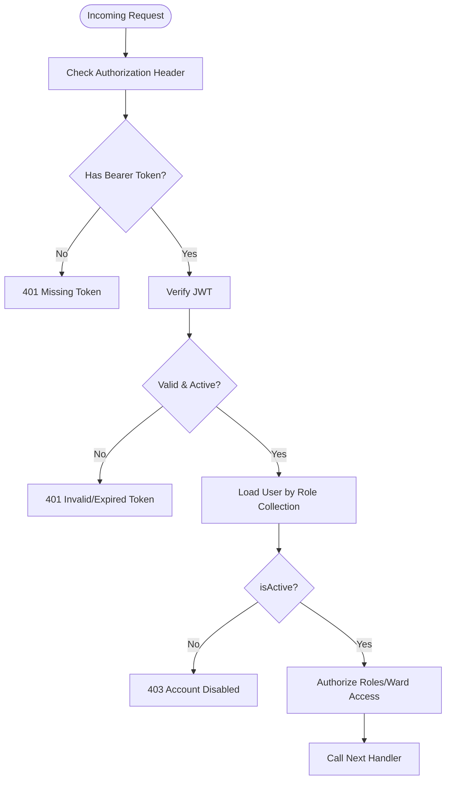
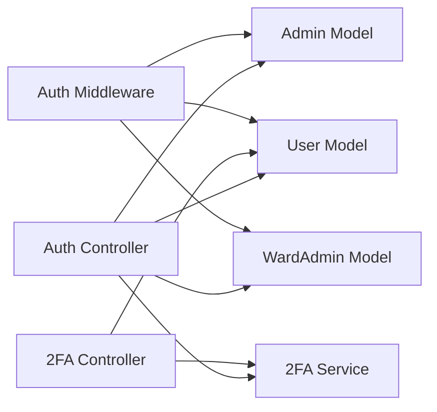

# Authentication & User Management APIs

<cite>
**Referenced Files in This Document**
- [server.js](file://backend/server.js)
- [app.js](file://backend/src/app.js)
- [authController.js](file://backend/src/controllers/authController.js)
- [twoFactorAuthController.js](file://backend/src/controllers/twoFactorAuthController.js)
- [authMiddleware.js](file://backend/src/middleware/authMiddleware.js)
- [twoFactorAuthService.js](file://backend/src/services/twoFactorAuthService.js)
- [User.js](file://backend/src/models/User.js)
- [Admin.js](file://backend/src/models/Admin.js)
- [WardAdmin.js](file://backend/src/models/WardAdmin.js)
- [userController.js](file://backend/src/controllers/userController.js)
</cite>

## Table of Contents
1. [Introduction](#introduction)
2. [Project Structure](#project-structure)
3. [Core Components](#core-components)
4. [Architecture Overview](#architecture-overview)
5. [Detailed Component Analysis](#detailed-component-analysis)
6. [Dependency Analysis](#dependency-analysis)
7. [Performance Considerations](#performance-considerations)
8. [Troubleshooting Guide](#troubleshooting-guide)
9. [Conclusion](#conclusion)
10. [Appendices](#appendices)

## Introduction
This document provides comprehensive API documentation for authentication and user management endpoints. It covers:
- User registration with email/password validation and automatic role assignment
- Login with JWT token generation, session management, and multi-factor authentication (2FA) integration
- Logout and token invalidation mechanisms
- 2FA setup and verification APIs including QR code generation, backup codes, and authentication flow
- Authentication middleware, token validation, and role-based access control (RBAC)
- Request/response schemas, error codes, security considerations, and client implementation examples

## Project Structure
The backend is structured around Express.js with modular controllers, middleware, services, and models. Routes are mounted under /api and grouped by domain (authentication, user management, admin, analytics, etc.). Authentication endpoints are exposed under /api/auth and /api/auth/2fa.

**Diagram sources**
- [app.js:43-65](file://backend/src/app.js#L43-L65)
- [authController.js:1-237](file://backend/src/controllers/authController.js#L1-L237)
- [twoFactorAuthController.js:1-453](file://backend/src/controllers/twoFactorAuthController.js#L1-L453)
- [authMiddleware.js:1-114](file://backend/src/middleware/authMiddleware.js#L1-L114)
- [twoFactorAuthService.js:1-152](file://backend/src/services/twoFactorAuthService.js#L1-L152)
- [User.js:1-165](file://backend/src/models/User.js#L1-L165)
- [Admin.js:1-55](file://backend/src/models/Admin.js#L1-L55)
- [WardAdmin.js:1-61](file://backend/src/models/WardAdmin.js#L1-L61)

**Section sources**
- [app.js:1-71](file://backend/src/app.js#L1-L71)
- [server.js:1-22](file://backend/server.js#L1-L22)

## Core Components
- Authentication Controller: Implements registration, login, and 2FA integration logic.
- 2FA Controller: Manages 2FA setup, verification, backup codes, and status queries.
- Authentication Middleware: Validates JWT tokens and enforces RBAC and ward-based access control.
- 2FA Service: Generates secrets, QR codes, verifies tokens, and manages backup codes.
- User/Role Models: Define schemas for citizens, admins, and ward admins, including 2FA fields.

Key responsibilities:
- Registration validates inputs and passwords, checks uniqueness across collections, and issues a JWT with role.
- Login supports multi-role discovery, account activation checks, and 2FA gating.
- 2FA endpoints handle secret generation, verification, backup code management, and status reporting.
- Middleware authenticates requests and authorizes access based on roles and optional ward filters.

**Section sources**
- [authController.js:7-88](file://backend/src/controllers/authController.js#L7-L88)
- [authController.js:90-237](file://backend/src/controllers/authController.js#L90-L237)
- [twoFactorAuthController.js:15-136](file://backend/src/controllers/twoFactorAuthController.js#L15-L136)
- [twoFactorAuthController.js:143-265](file://backend/src/controllers/twoFactorAuthController.js#L143-L265)
- [authMiddleware.js:10-55](file://backend/src/middleware/authMiddleware.js#L10-L55)
- [authMiddleware.js:61-104](file://backend/src/middleware/authMiddleware.js#L61-L104)
- [twoFactorAuthService.js:15-152](file://backend/src/services/twoFactorAuthService.js#L15-L152)
- [User.js:4-165](file://backend/src/models/User.js#L4-L165)
- [Admin.js:4-55](file://backend/src/models/Admin.js#L4-L55)
- [WardAdmin.js:4-61](file://backend/src/models/WardAdmin.js#L4-L61)

## Architecture Overview
The authentication flow integrates controllers, middleware, services, and models to provide secure, role-aware access.

**Diagram sources**
- [authController.js:7-88](file://backend/src/controllers/authController.js#L7-L88)
- [authController.js:90-237](file://backend/src/controllers/authController.js#L90-L237)
- [twoFactorAuthService.js:125-135](file://backend/src/services/twoFactorAuthService.js#L125-L135)
- [User.js:146-156](file://backend/src/models/User.js#L146-L156)
- [Admin.js:40-52](file://backend/src/models/Admin.js#L40-L52)
- [WardAdmin.js:46-58](file://backend/src/models/WardAdmin.js#L46-L58)

## Detailed Component Analysis

### Authentication Endpoints

#### POST /api/auth/register
- Purpose: Register a new citizen user.
- Request body:
  - name: string, required
  - email: string, required
  - password: string, required (10–12 chars, must contain alphabets and numbers, must not include email)
- Response:
  - success: boolean
  - message: string
  - data.user: { id, name, email, role, ward, createdAt }
  - data.token: string (JWT)
- Validation:
  - Input presence
  - Password policy
  - Email uniqueness across User, Admin, and WardAdmin collections
- Role assignment: Automatically sets role to user for citizens.
- Security:
  - Password hashing handled by model pre-save hook.
  - JWT issued with 7-day expiry.

**Section sources**
- [authController.js:7-88](file://backend/src/controllers/authController.js#L7-L88)
- [User.js:146-156](file://backend/src/models/User.js#L146-L156)

#### POST /api/auth/login
- Purpose: Authenticate user and issue JWT; integrate with 2FA.
- Request body:
  - email: string, required
  - password: string, required
  - role: string, optional ("admin" or "user")
- Response variants:
  - Standard login: { success, message, data: { token, user } }
  - Requires 2FA: { requiresTwoFactor: true, needs2FASetup: true/false, data: { userId, email, setupToken? } }
- Behavior:
  - Searches Admin, WardAdmin, then User by email.
  - Verifies password and checks isActive flag.
  - Enforces role constraints (e.g., admin-only role requests for admin endpoints).
  - Enforces mandatory 2FA for all users on login attempts.
- Security:
  - JWT payload includes id, role, and ward.
  - 2FA enforced on every login attempt.

**Section sources**
- [authController.js:90-237](file://backend/src/controllers/authController.js#L90-L237)
- [twoFactorAuthService.js:125-135](file://backend/src/services/twoFactorAuthService.js#L125-L135)

#### POST /api/auth/logout
- Purpose: Invalidate current session.
- Implementation note: Not present in the provided code. Recommended approach:
  - Maintain a server-side blacklist (Redis/Set) of invalidated tokens with TTL matching JWT expiry.
  - On logout, add current token to blacklist; middleware rejects blacklisted tokens.
  - Alternatively, rely on short-lived tokens and re-authentication.

[No sources needed since this section provides general guidance]

### Two-Factor Authentication Endpoints

#### POST /api/auth/2fa/setup
- Purpose: Initiate 2FA setup for a user.
- Request: Authenticated (JWT) request.
- Response:
  - success: boolean
  - message: string
  - data: { secret, qrCode, otpauth_url }
- Behavior:
  - Generates a secret and stores tempSecret.
  - QR code URL provided for frontend to render.

**Section sources**
- [twoFactorAuthController.js:15-64](file://backend/src/controllers/twoFactorAuthController.js#L15-L64)
- [twoFactorAuthService.js:15-28](file://backend/src/services/twoFactorAuthService.js#L15-L28)

#### POST /api/auth/2fa/verify-setup
- Purpose: Verify and enable 2FA using a 6-digit code.
- Request body:
  - token: string, required (6 digits)
- Response:
  - success: boolean
  - message: string
  - data: { backupCodes } (sent once)
- Behavior:
  - Verifies token against tempSecret.
  - Generates and hashes 10 backup codes.
  - Enables 2FA and clears tempSecret.

**Section sources**
- [twoFactorAuthController.js:71-136](file://backend/src/controllers/twoFactorAuthController.js#L71-L136)
- [twoFactorAuthService.js:52-66](file://backend/src/services/twoFactorAuthService.js#L52-L66)
- [twoFactorAuthService.js:73-84](file://backend/src/services/twoFactorAuthService.js#L73-L84)
- [twoFactorAuthService.js:91-105](file://backend/src/services/twoFactorAuthService.js#L91-L105)

#### POST /api/auth/2fa/verify
- Purpose: Finalize login after 2FA verification.
- Request body:
  - userId: string, required
  - token: string, required
- Response:
  - success: boolean
  - message: string
  - data: { token, user }
- Behavior:
  - Accepts either TOTP or unused backup code.
  - Marks backup code as used upon successful verification.
  - Issues final JWT for authenticated session.

**Section sources**
- [twoFactorAuthController.js:143-265](file://backend/src/controllers/twoFactorAuthController.js#L143-L265)
- [twoFactorAuthService.js:102-105](file://backend/src/services/twoFactorAuthService.js#L102-L105)

#### POST /api/auth/2fa/disable
- Purpose: Disable 2FA after verifying password and current 2FA token.
- Request body:
  - password: string, required
  - token: string, required
- Response:
  - success: boolean
  - message: string

**Section sources**
- [twoFactorAuthController.js:272-343](file://backend/src/controllers/twoFactorAuthController.js#L272-L343)
- [twoFactorAuthService.js:52-66](file://backend/src/services/twoFactorAuthService.js#L52-L66)

#### GET /api/auth/2fa/status
- Purpose: Retrieve current 2FA status and backup code counts.
- Response:
  - success: boolean
  - data: { enabled, enabledAt, backupCodesCount, unusedBackupCodes }

**Section sources**
- [twoFactorAuthController.js:350-380](file://backend/src/controllers/twoFactorAuthController.js#L350-L380)

#### POST /api/auth/2fa/regenerate-backup-codes
- Purpose: Regenerate backup codes after password verification.
- Request body:
  - password: string, required
- Response:
  - success: boolean
  - message: string
  - data: { backupCodes }

**Section sources**
- [twoFactorAuthController.js:387-450](file://backend/src/controllers/twoFactorAuthController.js#L387-L450)

### Authentication Middleware and RBAC
- authenticateUser:
  - Extracts Authorization: Bearer <token>
  - Verifies JWT and loads user from appropriate collection based on role
  - Rejects if account is inactive
  - Injects req.user and continues
- authorizeRoles:
  - Enforces allowed roles array
- authorizeWardAccess:
  - For ward_admin, ensures access only to their assigned ward
  - Injects req.wardFilter for downstream filtering

**Diagram sources**
- [authMiddleware.js:10-55](file://backend/src/middleware/authMiddleware.js#L10-L55)
- [authMiddleware.js:61-104](file://backend/src/middleware/authMiddleware.js#L61-L104)

**Section sources**
- [authMiddleware.js:10-55](file://backend/src/middleware/authMiddleware.js#L10-L55)
- [authMiddleware.js:61-104](file://backend/src/middleware/authMiddleware.js#L61-L104)

### User Profile and Related Endpoints
- GET /api/users/profile: Returns user profile with dynamic stats and badges.
- GET /api/users/profile/:id: Public profile retrieval by ID.
- GET /api/users/stats: Dynamic stats derived from grievances.
- GET /api/users/recent-activity: Recent grievances for the user.
- GET /api/users/badges: Earned badges and progress.
- PATCH /api/users/preferences: Update notification preferences.

These endpoints are protected by authentication middleware and leverage dynamic calculations from the grievances collection.

**Section sources**
- [userController.js:10-64](file://backend/src/controllers/userController.js#L10-L64)
- [userController.js:71-125](file://backend/src/controllers/userController.js#L71-L125)
- [userController.js:164-198](file://backend/src/controllers/userController.js#L164-L198)
- [userController.js:204-232](file://backend/src/controllers/userController.js#L204-L232)
- [userController.js:132-157](file://backend/src/controllers/userController.js#L132-L157)

## Dependency Analysis
- Controllers depend on:
  - Models for persistence and password comparison
  - Services for 2FA operations
- Middleware depends on:
  - Models to resolve users by role
  - JWT library for token verification
- Routes are mounted centrally in the app and delegate to controllers.

**Diagram sources**
- [authController.js:1-8](file://backend/src/controllers/authController.js#L1-L8)
- [twoFactorAuthController.js:1-2](file://backend/src/controllers/twoFactorAuthController.js#L1-L2)
- [authMiddleware.js:1-4](file://backend/src/middleware/authMiddleware.js#L1-L4)
- [User.js:1-3](file://backend/src/models/User.js#L1-L3)
- [Admin.js:1-3](file://backend/src/models/Admin.js#L1-L3)
- [WardAdmin.js:1-3](file://backend/src/models/WardAdmin.js#L1-L3)
- [twoFactorAuthService.js:1-2](file://backend/src/services/twoFactorAuthService.js#L1-L2)

**Section sources**
- [app.js:5-26](file://backend/src/app.js#L5-L26)

## Performance Considerations
- Token verification is O(1) with minimal overhead.
- Password hashing occurs on save and login comparisons; ensure adequate bcrypt cost for production.
- 2FA verification uses time-based windows; tune window parameter if needed.
- Indexes on email, ward, and leaderboard fields improve query performance.

[No sources needed since this section provides general guidance]

## Troubleshooting Guide
Common errors and resolutions:
- 400 Bad Request:
  - Missing fields in registration/login
  - Invalid password format
  - Invalid 2FA token length/format
- 401 Unauthorized:
  - Missing or malformed Authorization header
  - Invalid/expired JWT
  - Incorrect credentials
- 403 Forbidden:
  - Account disabled
  - Insufficient role for requested endpoint
  - Ward access violation for ward_admin
- 404 Not Found:
  - User not found during 2FA operations
- 409 Conflict:
  - Email already registered across collections

Operational tips:
- Ensure JWT_SECRET is configured and consistent across instances.
- For 2FA, confirm the authenticator app uses the provided otpauth URL or QR code.
- Backup codes are hashed; they are only revealed once during initial enablement.

**Section sources**
- [authController.js:11-87](file://backend/src/controllers/authController.js#L11-L87)
- [authController.js:94-151](file://backend/src/controllers/authController.js#L94-L151)
- [twoFactorAuthController.js:75-135](file://backend/src/controllers/twoFactorAuthController.js#L75-L135)
- [twoFactorAuthController.js:147-203](file://backend/src/controllers/twoFactorAuthController.js#L147-L203)
- [authMiddleware.js:13-54](file://backend/src/middleware/authMiddleware.js#L13-L54)

## Conclusion
The authentication and user management system provides robust, role-aware access control with mandatory 2FA enforcement. The modular design separates concerns across controllers, middleware, services, and models, enabling maintainability and extensibility. Clients should implement token-based authentication, handle 2FA flows, and manage token lifecycle securely.

[No sources needed since this section summarizes without analyzing specific files]

## Appendices

### Request/Response Schemas

- POST /api/auth/register
  - Request: { name, email, password }
  - Response: { success, message, data: { token, user: { id, name, email, role, ward, createdAt } } }

- POST /api/auth/login
  - Request: { email, password, role? }
  - Response (standard): { success, message, data: { token, user: { id, name, email, role, createdAt?, ward? } } }
  - Response (requires 2FA): { success, requiresTwoFactor: true, needs2FASetup: boolean, data: { userId, email, setupToken? } }

- POST /api/auth/2fa/setup
  - Request: Authenticated
  - Response: { success, message, data: { secret, qrCode, otpauth_url } }

- POST /api/auth/2fa/verify-setup
  - Request: { token }
  - Response: { success, message, data: { backupCodes } }

- POST /api/auth/2fa/verify
  - Request: { userId, token }
  - Response: { success, message, data: { token, user } }

- POST /api/auth/2fa/disable
  - Request: { password, token }
  - Response: { success, message }

- GET /api/auth/2fa/status
  - Request: Authenticated
  - Response: { success, data: { enabled, enabledAt, backupCodesCount, unusedBackupCodes } }

- POST /api/auth/2fa/regenerate-backup-codes
  - Request: { password }
  - Response: { success, message, data: { backupCodes } }

- GET /api/users/profile
  - Request: Authenticated
  - Response: { success, data: { user, stats, badges, badgeProgress } }

- PATCH /api/users/preferences
  - Request: { emailEnabled?, smsEnabled?, phone?, preferredLanguage? }
  - Response: { success, message, data: { emailEnabled, smsEnabled, phone, preferredLanguage } }

Security considerations:
- Use HTTPS in production.
- Store JWT_SECRET securely and rotate periodically.
- Enforce 2FA for all users; treat backup codes as sensitive.
- Implement rate limiting and monitoring for authentication endpoints.

Client implementation examples (paths only):
- Registration: [authController.js:7-88](file://backend/src/controllers/authController.js#L7-L88)
- Login and 2FA flow: [authController.js:90-237](file://backend/src/controllers/authController.js#L90-L237), [twoFactorAuthController.js:15-64](file://backend/src/controllers/twoFactorAuthController.js#L15-L64), [twoFactorAuthController.js:143-265](file://backend/src/controllers/twoFactorAuthController.js#L143-L265)
- Protected routes: [authMiddleware.js:10-55](file://backend/src/middleware/authMiddleware.js#L10-L55), [authMiddleware.js:61-104](file://backend/src/middleware/authMiddleware.js#L61-L104)