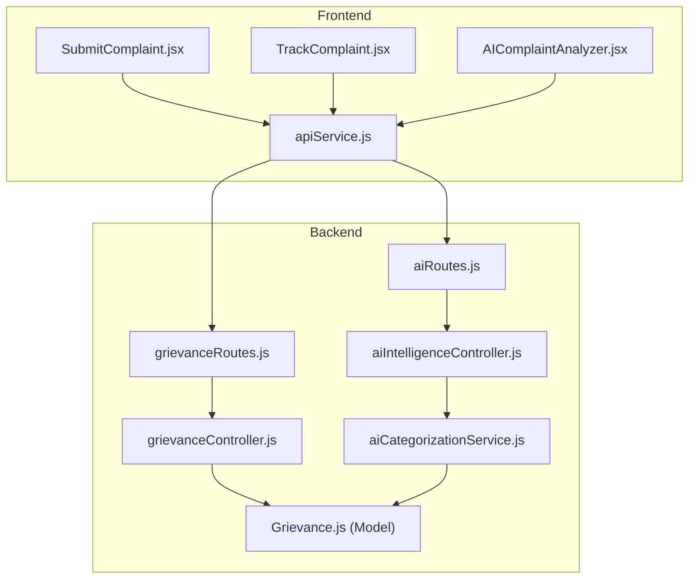
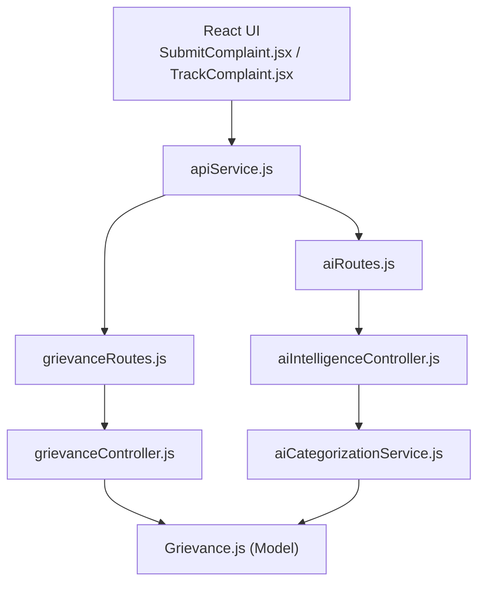
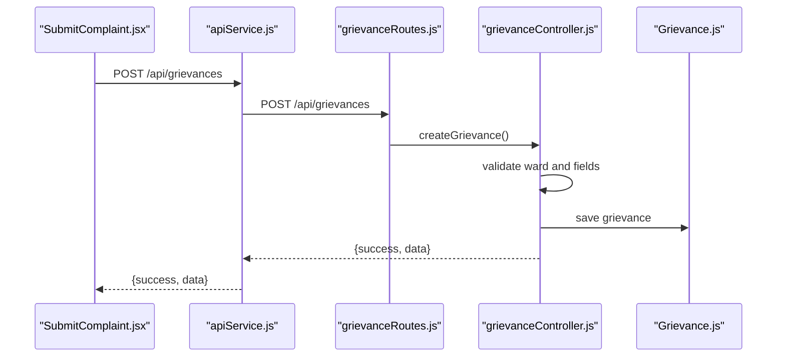
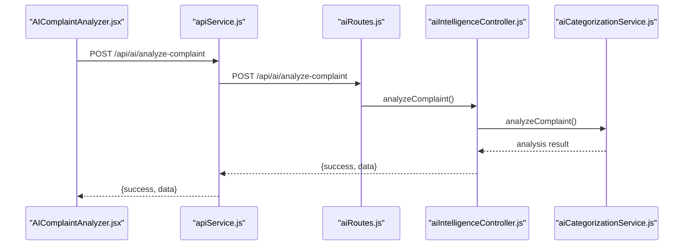
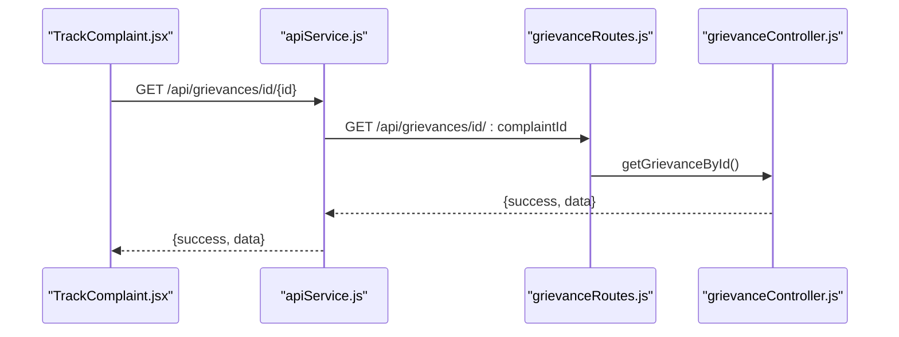
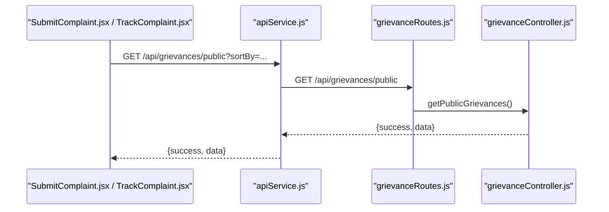
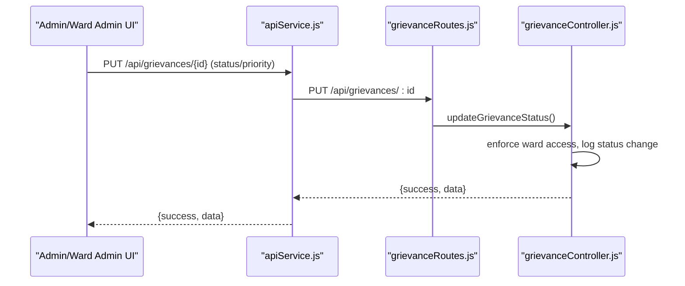
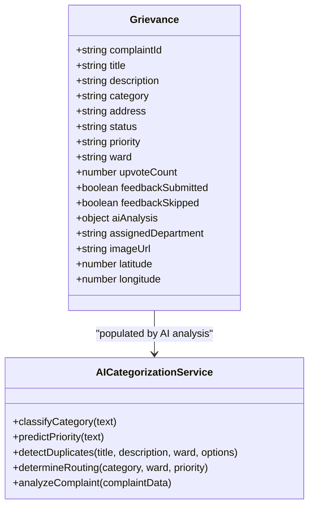
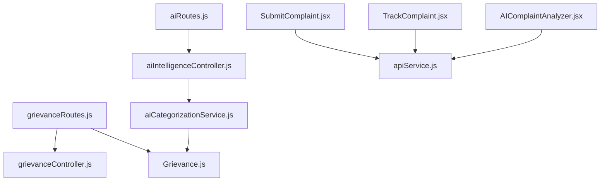

# Complaint Management APIs

<cite>
**Referenced Files in This Document**
- [grievanceRoutes.js](file://backend/src/routes/grievanceRoutes.js)
- [grievanceController.js](file://backend/src/controllers/grievanceController.js)
- [aiRoutes.js](file://backend/src/routes/aiRoutes.js)
- [aiIntelligenceController.js](file://backend/src/controllers/aiIntelligenceController.js)
- [aiCategorizationService.js](file://backend/src/services/aiCategorizationService.js)
- [Grievance.js](file://backend/src/models/Grievance.js)
- [SubmitComplaint.jsx](file://frontend/src/pages/SubmitComplaint.jsx)
- [TrackComplaint.jsx](file://frontend/src/pages/TrackComplaint.jsx)
- [apiService.js](file://frontend/src/services/apiService.js)
- [AIComplaintAnalyzer.jsx](file://frontend/src/components/ai/AIComplaintAnalyzer.jsx)
</cite>

## Table of Contents
1. [Introduction](#introduction)
2. [Project Structure](#project-structure)
3. [Core Components](#core-components)
4. [Architecture Overview](#architecture-overview)
5. [Detailed Component Analysis](#detailed-component-analysis)
6. [Dependency Analysis](#dependency-analysis)
7. [Performance Considerations](#performance-considerations)
8. [Troubleshooting Guide](#troubleshooting-guide)
9. [Conclusion](#conclusion)

## Introduction
This document provides comprehensive API documentation for the complaint management system, covering:
- Complaint submission with AI categorization and priority prediction
- Complaint tracking for public users
- Listing APIs for citizens, admins, and ward-level filtering
- Complaint update endpoints for status changes and resolution
- Request/response schemas, workflows, error handling, and integration patterns with voice recognition services

## Project Structure
The complaint management system spans a Node.js/Express backend and a React frontend:
- Backend routes define endpoints for grievance CRUD, listing, and admin analytics
- Controllers implement business logic and integrate with AI services
- AI services provide NLP-based categorization, priority prediction, duplicate detection, and smart routing
- Frontend pages and components integrate voice input, AI suggestions, and public tracking

**Diagram sources**
- [grievanceRoutes.js:1-62](file://backend/src/routes/grievanceRoutes.js#L1-L62)
- [grievanceController.js:1-752](file://backend/src/controllers/grievanceController.js#L1-L752)
- [aiRoutes.js:1-94](file://backend/src/routes/aiRoutes.js#L1-L94)
- [aiIntelligenceController.js:1-342](file://backend/src/controllers/aiIntelligenceController.js#L1-L342)
- [aiCategorizationService.js:1-344](file://backend/src/services/aiCategorizationService.js#L1-L344)
- [Grievance.js:1-115](file://backend/src/models/Grievance.js#L1-L115)
- [SubmitComplaint.jsx:1-973](file://frontend/src/pages/SubmitComplaint.jsx#L1-L973)
- [TrackComplaint.jsx:1-399](file://frontend/src/pages/TrackComplaint.jsx#L1-L399)
- [AIComplaintAnalyzer.jsx:1-276](file://frontend/src/components/ai/AIComplaintAnalyzer.jsx#L1-L276)
- [apiService.js:1-539](file://frontend/src/services/apiService.js#L1-L539)

**Section sources**
- [grievanceRoutes.js:1-62](file://backend/src/routes/grievanceRoutes.js#L1-L62)
- [grievanceController.js:1-752](file://backend/src/controllers/grievanceController.js#L1-L752)
- [aiRoutes.js:1-94](file://backend/src/routes/aiRoutes.js#L1-L94)
- [aiIntelligenceController.js:1-342](file://backend/src/controllers/aiIntelligenceController.js#L1-L342)
- [aiCategorizationService.js:1-344](file://backend/src/services/aiCategorizationService.js#L1-L344)
- [Grievance.js:1-115](file://backend/src/models/Grievance.js#L1-L115)
- [SubmitComplaint.jsx:1-973](file://frontend/src/pages/SubmitComplaint.jsx#L1-L973)
- [TrackComplaint.jsx:1-399](file://frontend/src/pages/TrackComplaint.jsx#L1-L399)
- [AIComplaintAnalyzer.jsx:1-276](file://frontend/src/components/ai/AIComplaintAnalyzer.jsx#L1-L276)
- [apiService.js:1-539](file://frontend/src/services/apiService.js#L1-L539)

## Core Components
- Grievance model defines complaint fields, enums, indexes, and AI analysis metadata
- Grievance routes expose endpoints for citizens, public tracking, and admin/ward admin
- Grievance controller implements validation, persistence, notifications, and audit logging
- AI routes and intelligence controller provide NLP-based categorization, priority prediction, duplicate detection, and smart routing
- AI categorization service encapsulates keyword-based classification, urgency scoring, duplicate detection, and routing logic
- Frontend pages integrate voice input, AI suggestions, and public tracking

**Section sources**
- [Grievance.js:1-115](file://backend/src/models/Grievance.js#L1-L115)
- [grievanceRoutes.js:1-62](file://backend/src/routes/grievanceRoutes.js#L1-L62)
- [grievanceController.js:1-752](file://backend/src/controllers/grievanceController.js#L1-L752)
- [aiRoutes.js:1-94](file://backend/src/routes/aiRoutes.js#L1-L94)
- [aiIntelligenceController.js:1-342](file://backend/src/controllers/aiIntelligenceController.js#L1-L342)
- [aiCategorizationService.js:1-344](file://backend/src/services/aiCategorizationService.js#L1-L344)
- [SubmitComplaint.jsx:1-973](file://frontend/src/pages/SubmitComplaint.jsx#L1-L973)
- [TrackComplaint.jsx:1-399](file://frontend/src/pages/TrackComplaint.jsx#L1-L399)
- [AIComplaintAnalyzer.jsx:1-276](file://frontend/src/components/ai/AIComplaintAnalyzer.jsx#L1-L276)

## Architecture Overview
The system follows a layered architecture:
- Presentation layer: React pages and components
- Service layer: API service wrapper for backend communication
- Application layer: Express routes and controllers
- Domain layer: AI services and models
- Data layer: Mongoose model with indexes for performance

**Diagram sources**
- [grievanceRoutes.js:1-62](file://backend/src/routes/grievanceRoutes.js#L1-L62)
- [grievanceController.js:1-752](file://backend/src/controllers/grievanceController.js#L1-L752)
- [aiRoutes.js:1-94](file://backend/src/routes/aiRoutes.js#L1-L94)
- [aiIntelligenceController.js:1-342](file://backend/src/controllers/aiIntelligenceController.js#L1-L342)
- [aiCategorizationService.js:1-344](file://backend/src/services/aiCategorizationService.js#L1-L344)
- [Grievance.js:1-115](file://backend/src/models/Grievance.js#L1-L115)
- [apiService.js:1-539](file://frontend/src/services/apiService.js#L1-L539)
- [SubmitComplaint.jsx:1-973](file://frontend/src/pages/SubmitComplaint.jsx#L1-L973)
- [TrackComplaint.jsx:1-399](file://frontend/src/pages/TrackComplaint.jsx#L1-L399)

## Detailed Component Analysis

### Complaint Submission API
- Endpoint: POST /api/grievances
- Authentication: Required (user/admin roles)
- Purpose: Create a new complaint with strict ward validation and optional image/geolocation
- AI integration: Frontend optionally requests AI categorization and priority prediction before submission

Request schema
- title: string, required
- description: string, required
- category: string, required
- address: string, required
- ward: string, required (must be one of predefined wards)
- priority: string, optional (default inferred by AI)
- imageUrl: string, optional (base64)
- latitude: number, optional
- longitude: number, optional
- anonymous: boolean, optional

Response schema
- success: boolean
- message: string
- data: Grievance object (includes complaintId, status, priority, timestamps)

Validation and behavior
- Ward is mandatory and validated against allowed values
- Complaint ID is generated and persisted
- On successful creation, notifications are triggered (non-blocking)
- Engagement events are triggered for user streaks and challenges

**Diagram sources**
- [SubmitComplaint.jsx:252-341](file://frontend/src/pages/SubmitComplaint.jsx#L252-L341)
- [apiService.js:93-107](file://frontend/src/services/apiService.js#L93-L107)
- [grievanceRoutes.js:26-26](file://backend/src/routes/grievanceRoutes.js#L26-L26)
- [grievanceController.js:70-217](file://backend/src/controllers/grievanceController.js#L70-L217)
- [Grievance.js:1-115](file://backend/src/models/Grievance.js#L1-L115)

**Section sources**
- [grievanceController.js:70-217](file://backend/src/controllers/grievanceController.js#L70-L217)
- [grievanceRoutes.js:26-26](file://backend/src/routes/grievanceRoutes.js#L26-L26)
- [SubmitComplaint.jsx:252-341](file://frontend/src/pages/SubmitComplaint.jsx#L252-L341)
- [apiService.js:93-107](file://frontend/src/services/apiService.js#L93-L107)

### AI Categorization and Priority Prediction
- Endpoint: POST /api/ai/categorize
- Purpose: Provide category and priority suggestions based on title/description
- Frontend integration: Used by SubmitComplaint.jsx and AIComplaintAnalyzer.jsx

Request schema
- title: string, optional
- description: string, optional (at least one required)

Response schema
- success: boolean
- data: {
  category: string
  confidence: number
  priority: string
  urgencyKeywords: string[]
  reasoning: string
}

**Diagram sources**
- [AIComplaintAnalyzer.jsx:45-92](file://frontend/src/components/ai/AIComplaintAnalyzer.jsx#L45-L92)
- [apiService.js:1-539](file://frontend/src/services/apiService.js#L1-L539)
- [aiRoutes.js:15-44](file://backend/src/routes/aiRoutes.js#L15-L44)
- [aiIntelligenceController.js:15-43](file://backend/src/controllers/aiIntelligenceController.js#L15-L43)
- [aiCategorizationService.js:278-332](file://backend/src/services/aiCategorizationService.js#L278-L332)

**Section sources**
- [aiRoutes.js:15-44](file://backend/src/routes/aiRoutes.js#L15-L44)
- [aiIntelligenceController.js:15-43](file://backend/src/controllers/aiIntelligenceController.js#L15-L43)
- [aiCategorizationService.js:278-332](file://backend/src/services/aiCategorizationService.js#L278-L332)
- [AIComplaintAnalyzer.jsx:45-92](file://frontend/src/components/ai/AIComplaintAnalyzer.jsx#L45-L92)

### Complaint Tracking API
- Endpoint: GET /api/grievances/id/:complaintId
- Purpose: Public tracking of a complaint by ID (no authentication required)
- Response includes complaintId, title, description, category, status, priority, ward, timestamps

**Diagram sources**
- [TrackComplaint.jsx:123-151](file://frontend/src/pages/TrackComplaint.jsx#L123-L151)
- [apiService.js:187-203](file://frontend/src/services/apiService.js#L187-L203)
- [grievanceRoutes.js:33-33](file://backend/src/routes/grievanceRoutes.js#L33-L33)
- [grievanceController.js:10-42](file://backend/src/controllers/grievanceController.js#L10-L42)

**Section sources**
- [grievanceController.js:10-42](file://backend/src/controllers/grievanceController.js#L10-L42)
- [grievanceRoutes.js:33-33](file://backend/src/routes/grievanceRoutes.js#L33-L33)
- [TrackComplaint.jsx:123-151](file://frontend/src/pages/TrackComplaint.jsx#L123-L151)

### Complaint Listing APIs
Citizen view (authenticated)
- Endpoint: GET /api/grievances/my
- Returns user’s complaints sorted by newest

Public listing (unauthenticated)
- Endpoint: GET /api/grievances/public
- Query params: sortBy (newest|most-upvoted), category (all|string), status (all|string)
- Response includes transformed data with userName, upvoteCount, complaintId, _id

Admin/ward admin listing (authenticated)
- Endpoint: GET /api/grievances/
- Query param: ward or wardId (ward_admin can filter by their own ward)
- Response includes count and data array

Ward-level filtering
- Endpoint: GET /api/grievances/ward (ward_admin only)
- Filters complaints by the admin’s assigned ward

Super admin filtering
- Endpoint: GET /api/grievances/all (admin only)
- Returns all complaints regardless of ward

**Diagram sources**
- [apiService.js:285-300](file://frontend/src/services/apiService.js#L285-L300)
- [grievanceRoutes.js:38-38](file://backend/src/routes/grievanceRoutes.js#L38-L38)
- [grievanceController.js:298-337](file://backend/src/controllers/grievanceController.js#L298-L337)

**Section sources**
- [grievanceController.js:223-337](file://backend/src/controllers/grievanceController.js#L223-L337)
- [grievanceRoutes.js:27-59](file://backend/src/routes/grievanceRoutes.js#L27-L59)
- [apiService.js:109-137](file://frontend/src/services/apiService.js#L109-L137)
- [apiService.js:285-300](file://frontend/src/services/apiService.js#L285-L300)

### Complaint Update Endpoints
Status and priority update
- Endpoint: PUT /api/grievances/:id
- Body: status or priority (or both)
- Access control: ward_admin can only modify complaints in their own ward
- Behavior: Logs status changes, triggers notifications for priority escalation and status updates

Resolve complaint
- Endpoint: POST /api/grievances/:id/resolve
- Access control: ward_admin can only resolve complaints in their own ward
- Behavior: Sets status to resolved, logs change, sends notification

Audit logs
- Endpoint: GET /api/grievances/:id/audit-logs
- Access control: ward_admin can only view logs for their own ward

**Diagram sources**
- [grievanceRoutes.js:47-47](file://backend/src/routes/grievanceRoutes.js#L47-L47)
- [grievanceController.js:344-428](file://backend/src/controllers/grievanceController.js#L344-L428)
- [apiService.js:139-156](file://frontend/src/services/apiService.js#L139-L156)

**Section sources**
- [grievanceController.js:344-428](file://backend/src/controllers/grievanceController.js#L344-L428)
- [grievanceController.js:520-569](file://backend/src/controllers/grievanceController.js#L520-L569)
- [grievanceController.js:728-751](file://backend/src/controllers/grievanceController.js#L728-L751)
- [grievanceRoutes.js:47-49](file://backend/src/routes/grievanceRoutes.js#L47-L49)
- [apiService.js:139-156](file://frontend/src/services/apiService.js#L139-L156)

### Data Models and AI Analysis
Grievance model fields include complaintId, title, description, category, address, status, priority, userId, ward, upvote tracking, feedback flags, AI analysis metadata (suggestedCategory, categoryConfidence, suggestedPriority, priorityConfidence, isDuplicateSuspected, duplicateMatches, routingDepartment, detectedKeywords, analysisTimestamp), assignedDepartment, assignedOfficialId, and image/geolocation fields.

AI categorization service provides:
- Keyword-based category classification with confidence scores
- Urgency/priority prediction with detected keywords
- Duplicate detection using Jaccard similarity within a time window and ward
- Smart routing to departments with estimated response times and recommendations

**Diagram sources**
- [Grievance.js:1-115](file://backend/src/models/Grievance.js#L1-L115)
- [aiCategorizationService.js:1-344](file://backend/src/services/aiCategorizationService.js#L1-L344)

**Section sources**
- [Grievance.js:1-115](file://backend/src/models/Grievance.js#L1-L115)
- [aiCategorizationService.js:1-344](file://backend/src/services/aiCategorizationService.js#L1-L344)

## Dependency Analysis
Key dependencies and relationships:
- Routes depend on controllers for business logic
- Controllers depend on the Grievance model and notification manager
- AI routes depend on the AI intelligence controller
- AI intelligence controller depends on the AI categorization service
- Frontend components depend on apiService for backend communication

**Diagram sources**
- [grievanceRoutes.js:1-62](file://backend/src/routes/grievanceRoutes.js#L1-L62)
- [grievanceController.js:1-752](file://backend/src/controllers/grievanceController.js#L1-L752)
- [aiRoutes.js:1-94](file://backend/src/routes/aiRoutes.js#L1-L94)
- [aiIntelligenceController.js:1-342](file://backend/src/controllers/aiIntelligenceController.js#L1-L342)
- [aiCategorizationService.js:1-344](file://backend/src/services/aiCategorizationService.js#L1-L344)
- [Grievance.js:1-115](file://backend/src/models/Grievance.js#L1-L115)
- [SubmitComplaint.jsx:1-973](file://frontend/src/pages/SubmitComplaint.jsx#L1-L973)
- [TrackComplaint.jsx:1-399](file://frontend/src/pages/TrackComplaint.jsx#L1-L399)
- [AIComplaintAnalyzer.jsx:1-276](file://frontend/src/components/ai/AIComplaintAnalyzer.jsx#L1-L276)
- [apiService.js:1-539](file://frontend/src/services/apiService.js#L1-L539)

**Section sources**
- [grievanceRoutes.js:1-62](file://backend/src/routes/grievanceRoutes.js#L1-L62)
- [grievanceController.js:1-752](file://backend/src/controllers/grievanceController.js#L1-L752)
- [aiRoutes.js:1-94](file://backend/src/routes/aiRoutes.js#L1-L94)
- [aiIntelligenceController.js:1-342](file://backend/src/controllers/aiIntelligenceController.js#L1-L342)
- [aiCategorizationService.js:1-344](file://backend/src/services/aiCategorizationService.js#L1-L344)
- [Grievance.js:1-115](file://backend/src/models/Grievance.js#L1-L115)
- [apiService.js:1-539](file://frontend/src/services/apiService.js#L1-L539)

## Performance Considerations
- Database indexes on frequently queried fields (ward, userId, complaintId, category, priority, status, createdAt, upvoteCount, aiAnalysis.isDuplicateSuspected, assignedDepartment) improve query performance
- AI analysis runs in parallel for categorization, priority prediction, and duplicate detection
- Frontend debounces AI categorization requests to reduce unnecessary calls
- Public listing supports sorting and filtering to minimize payload size

[No sources needed since this section provides general guidance]

## Troubleshooting Guide
Common errors and resolutions:
- Invalid ward during submission: Ensure the ward value matches one of the allowed values; otherwise, the backend returns a 400 error with a descriptive message
- Complaint not found during tracking: Public endpoint returns a 404 error when the complaintId does not exist
- Access denied for admin endpoints: Ward admin cannot modify complaints outside their assigned ward; backend returns a 403 error
- Duplicate detection failures: AI categorization service wraps errors and returns safe defaults; check backend logs for underlying causes
- Notification failures: Non-blocking notifications are logged; verify notification service configuration

**Section sources**
- [grievanceController.js:86-102](file://backend/src/controllers/grievanceController.js#L86-L102)
- [grievanceController.js:18-23](file://backend/src/controllers/grievanceController.js#L18-L23)
- [grievanceController.js:355-360](file://backend/src/controllers/grievanceController.js#L355-L360)
- [aiCategorizationService.js:220-228](file://backend/src/services/aiCategorizationService.js#L220-L228)

## Conclusion
The complaint management system integrates voice-enabled submission, AI-powered categorization and priority prediction, robust access controls, and comprehensive listing and tracking capabilities. The modular backend architecture and frontend components provide a scalable foundation for further enhancements, including advanced analytics and expanded AI features.