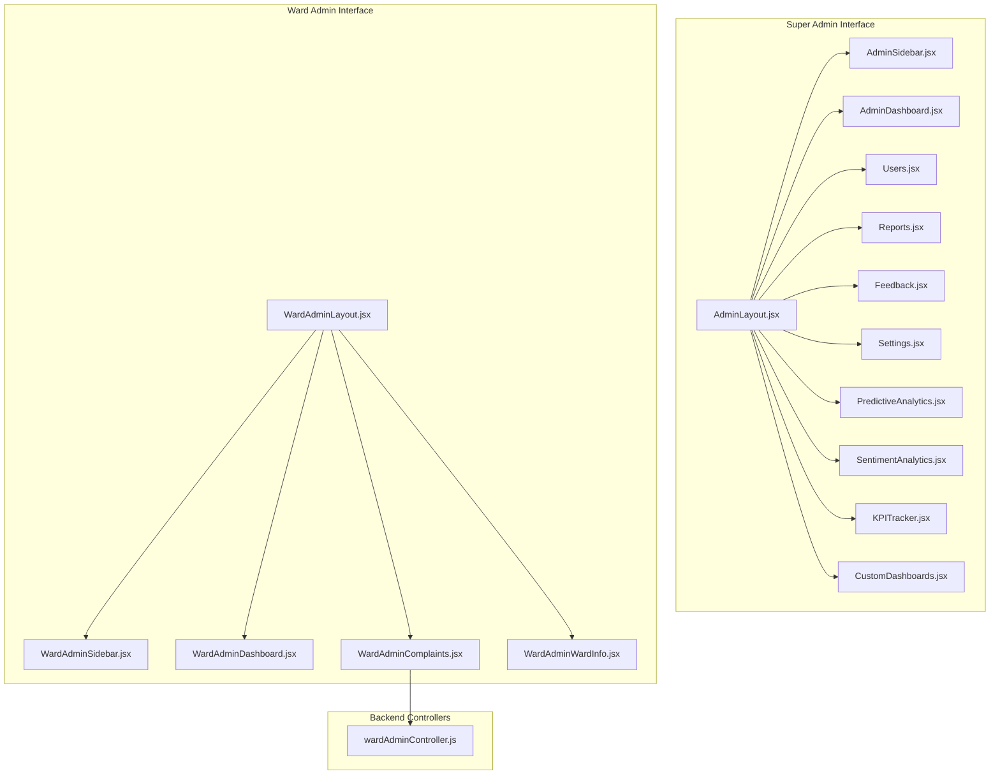
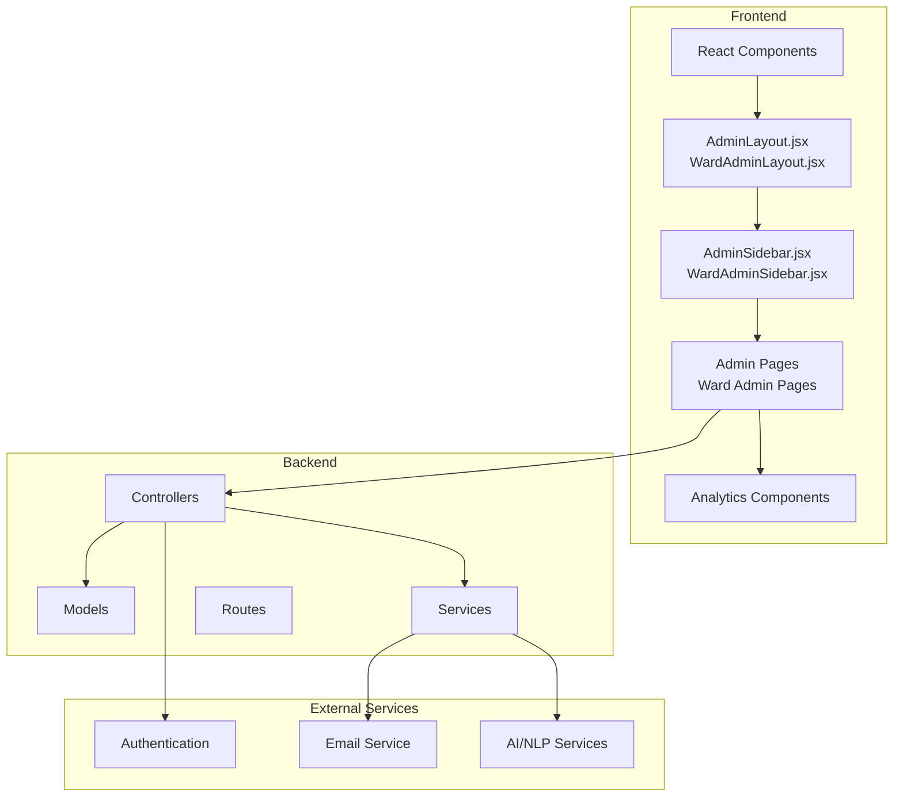
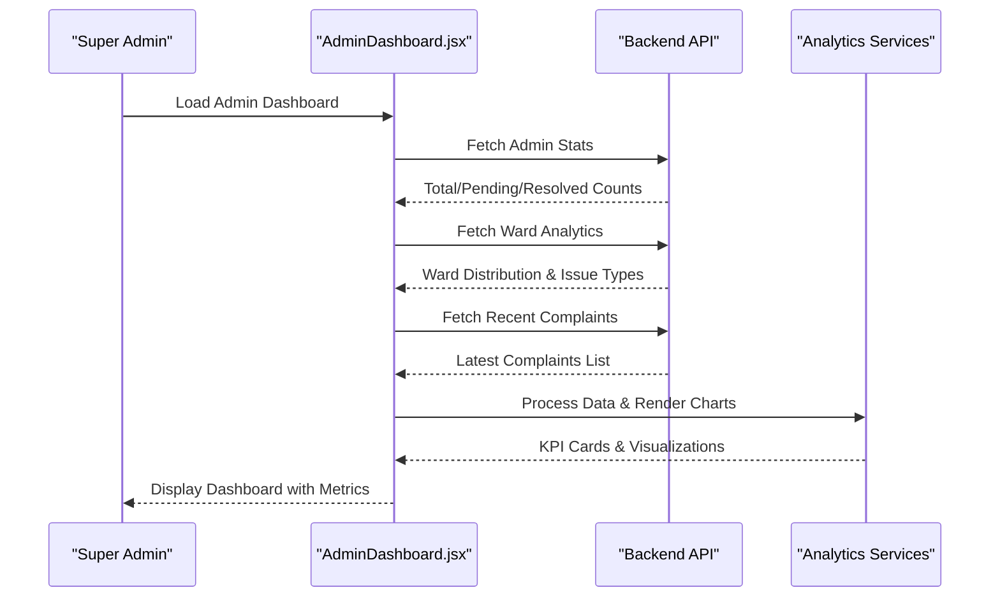
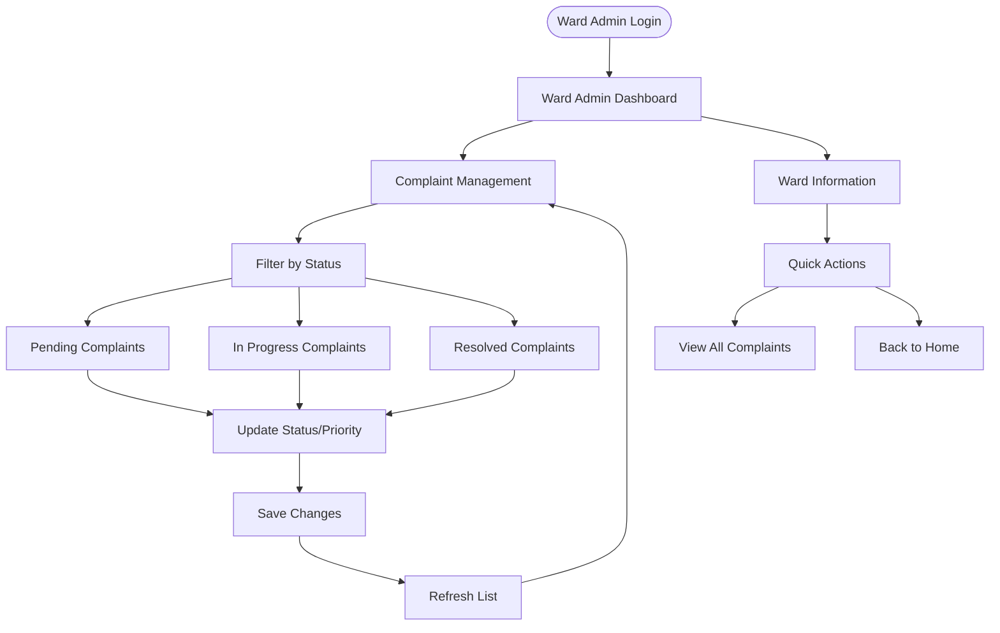
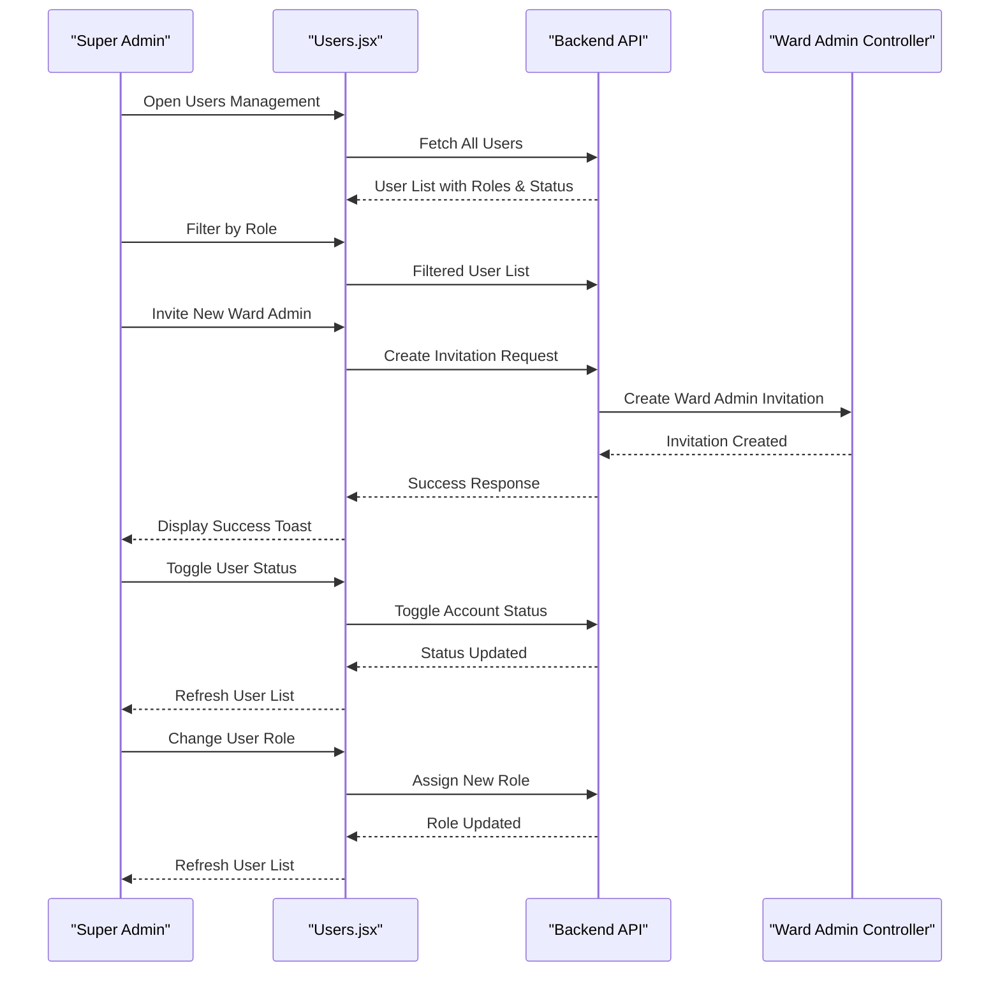
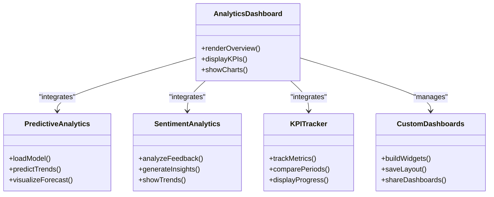
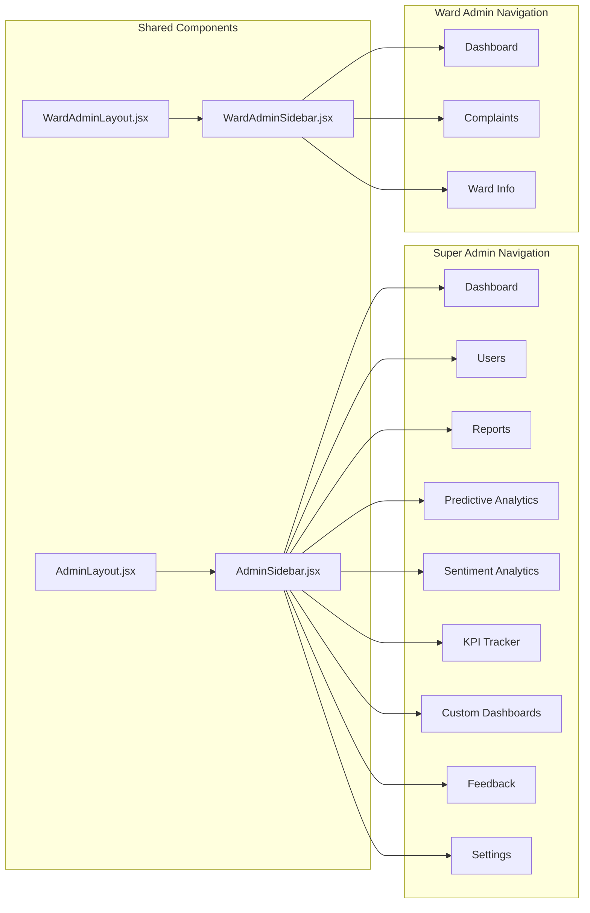
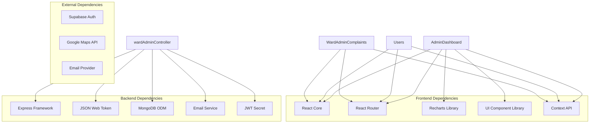

# Administrative Interfaces

<cite>
**Referenced Files in This Document**
- [AdminLayout.jsx](file://Frontend/src/pages/AdminLayout.jsx)
- [AdminSidebar.jsx](file://Frontend/src/components/AdminSidebar.jsx)
- [WardAdminLayout.jsx](file://Frontend/src/pages/WardAdminLayout.jsx)
- [WardAdminSidebar.jsx](file://Frontend/src/components/WardAdminSidebar.jsx)
- [AdminDashboard.jsx](file://Frontend/src/pages/admin/Dashboard.jsx)
- [WardAdminDashboard.jsx](file://Frontend/src/pages/ward-admin/Dashboard.jsx)
- [Users.jsx](file://Frontend/src/pages/admin/Users.jsx)
- [Reports.jsx](file://Frontend/src/pages/admin/Reports.jsx)
- [Feedback.jsx](file://Frontend/src/pages/admin/Feedback.jsx)
- [Settings.jsx](file://Frontend/src/pages/admin/Settings.jsx)
- [WardAdminComplaints.jsx](file://Frontend/src/pages/ward-admin/Complaints.jsx)
- [WardAdminWardInfo.jsx](file://Frontend/src/pages/ward-admin/WardInfo.jsx)
- [wardAdminController.js](file://backend/src/controllers/wardAdminController.js)
- [PredictiveAnalytics.jsx](file://Frontend/src/pages/admin/PredictiveAnalytics.jsx)
- [SentimentAnalytics.jsx](file://Frontend/src/pages/admin/SentimentAnalytics.jsx)
- [KPITracker.jsx](file://Frontend/src/pages/admin/KPITracker.jsx)
- [CustomDashboards.jsx](file://Frontend/src/pages/admin/CustomDashboards.jsx)
</cite>

## Table of Contents
1. [Introduction](#introduction)
2. [Project Structure](#project-structure)
3. [Core Components](#core-components)
4. [Architecture Overview](#architecture-overview)
5. [Detailed Component Analysis](#detailed-component-analysis)
6. [Dependency Analysis](#dependency-analysis)
7. [Performance Considerations](#performance-considerations)
8. [Troubleshooting Guide](#troubleshooting-guide)
9. [Conclusion](#conclusion)

## Introduction
This document provides comprehensive documentation for the multi-tier administrative interfaces of the SmartCity platform. It covers the super admin dashboard for system oversight, user management, and analytics monitoring; the ward administrator interface for ward-specific management, complaint handling, and performance monitoring; and the shared administrative layout components, navigation patterns, and role-specific features. Administrative workflows for user administration, complaint review, and system configuration are explained alongside reporting interfaces, feedback management, and administrative analytics dashboards.

## Project Structure
The administrative interfaces are organized into two primary admin tiers:
- Super Admin (City-level): Centralized oversight with comprehensive analytics, user management, and system configuration.
- Ward Admin (Local-level): Ward-specific management focused on complaints, performance metrics, and local insights.

**Diagram sources**
- [AdminLayout.jsx:58-90](file://Frontend/src/pages/AdminLayout.jsx#L58-L90)
- [AdminSidebar.jsx:178-267](file://Frontend/src/components/AdminSidebar.jsx#L178-L267)
- [AdminDashboard.jsx:11-516](file://Frontend/src/pages/admin/Dashboard.jsx#L11-L516)
- [Users.jsx:15-393](file://Frontend/src/pages/admin/Users.jsx#L15-L393)
- [Reports.jsx:16-398](file://Frontend/src/pages/admin/Reports.jsx#L16-L398)
- [Feedback.jsx:274-384](file://Frontend/src/pages/admin/Feedback.jsx#L274-L384)
- [Settings.jsx:5-433](file://Frontend/src/pages/admin/Settings.jsx#L5-L433)
- [PredictiveAnalytics.jsx:9-17](file://Frontend/src/pages/admin/PredictiveAnalytics.jsx#L9-L17)
- [SentimentAnalytics.jsx:43-633](file://Frontend/src/pages/admin/SentimentAnalytics.jsx#L43-L633)
- [KPITracker.jsx:23-353](file://Frontend/src/pages/admin/KPITracker.jsx#L23-L353)
- [CustomDashboards.jsx:11-333](file://Frontend/src/pages/admin/CustomDashboards.jsx#L11-L333)
- [WardAdminLayout.jsx:5-36](file://Frontend/src/pages/WardAdminLayout.jsx#L5-L36)
- [WardAdminSidebar.jsx:12-94](file://Frontend/src/components/WardAdminSidebar.jsx#L12-L94)
- [WardAdminDashboard.jsx:10-278](file://Frontend/src/pages/ward-admin/Dashboard.jsx#L10-L278)
- [WardAdminComplaints.jsx:10-468](file://Frontend/src/pages/ward-admin/Complaints.jsx#L10-L468)
- [WardAdminWardInfo.jsx:10-204](file://Frontend/src/pages/ward-admin/WardInfo.jsx#L10-L204)
- [wardAdminController.js:416-450](file://backend/src/controllers/wardAdminController.js#L416-L450)

**Section sources**
- [AdminLayout.jsx:58-90](file://Frontend/src/pages/AdminLayout.jsx#L58-L90)
- [AdminSidebar.jsx:178-267](file://Frontend/src/components/AdminSidebar.jsx#L178-L267)
- [WardAdminLayout.jsx:5-36](file://Frontend/src/pages/WardAdminLayout.jsx#L5-L36)
- [WardAdminSidebar.jsx:12-94](file://Frontend/src/components/WardAdminSidebar.jsx#L12-L94)

## Core Components
This section outlines the core administrative components and their responsibilities:

- Super Admin Layout and Navigation
  - AdminLayout.jsx: Provides the main layout for the super admin portal, including sidebar integration and outlet rendering.
  - AdminSidebar.jsx: Implements the navigation menu for super admin features such as dashboard, users, reports, analytics, feedback, and settings.

- Ward Admin Layout and Navigation
  - WardAdminLayout.jsx: Provides the main layout for the ward admin portal, integrating the ward-specific sidebar and outlet rendering.
  - WardAdminSidebar.jsx: Implements the navigation menu for ward admin features including dashboard, complaints, and ward info.

- Super Admin Pages
  - AdminDashboard.jsx: Central analytics hub displaying system-wide KPIs, complaint distributions, and recent activity.
  - Users.jsx: Manages administrator accounts, role assignments, and user status toggles.
  - Reports.jsx: Generates comprehensive reports and exports analytics data.
  - Feedback.jsx: Displays and analyzes citizen feedback metrics.
  - Settings.jsx: Manages profile, notifications, security, and system preferences.

- Advanced Analytics Pages
  - PredictiveAnalytics.jsx: Full-page view for AI-powered predictive analytics dashboards.
  - SentimentAnalytics.jsx: Comprehensive sentiment analysis dashboard with filters and insights.
  - KPITracker.jsx: Real-time monitoring of key performance indicators with trend analysis.
  - CustomDashboards.jsx: Creation and management of personalized analytics dashboards.

- Ward Admin Pages
  - WardAdminDashboard.jsx: Ward-specific analytics and performance metrics.
  - WardAdminComplaints.jsx: Management of complaints within the assigned ward with status and priority updates.
  - WardAdminWardInfo.jsx: Ward overview, statistics, and quick actions.

**Section sources**
- [AdminLayout.jsx:58-90](file://Frontend/src/pages/AdminLayout.jsx#L58-L90)
- [AdminSidebar.jsx:178-267](file://Frontend/src/components/AdminSidebar.jsx#L178-L267)
- [WardAdminLayout.jsx:5-36](file://Frontend/src/pages/WardAdminLayout.jsx#L5-L36)
- [WardAdminSidebar.jsx:12-94](file://Frontend/src/components/WardAdminSidebar.jsx#L12-L94)
- [AdminDashboard.jsx:11-516](file://Frontend/src/pages/admin/Dashboard.jsx#L11-L516)
- [Users.jsx:15-393](file://Frontend/src/pages/admin/Users.jsx#L15-L393)
- [Reports.jsx:16-398](file://Frontend/src/pages/admin/Reports.jsx#L16-L398)
- [Feedback.jsx:274-384](file://Frontend/src/pages/admin/Feedback.jsx#L274-L384)
- [Settings.jsx:5-433](file://Frontend/src/pages/admin/Settings.jsx#L5-L433)
- [PredictiveAnalytics.jsx:9-17](file://Frontend/src/pages/admin/PredictiveAnalytics.jsx#L9-L17)
- [SentimentAnalytics.jsx:43-633](file://Frontend/src/pages/admin/SentimentAnalytics.jsx#L43-L633)
- [KPITracker.jsx:23-353](file://Frontend/src/pages/admin/KPITracker.jsx#L23-L353)
- [CustomDashboards.jsx:11-333](file://Frontend/src/pages/admin/CustomDashboards.jsx#L11-L333)
- [WardAdminDashboard.jsx:10-278](file://Frontend/src/pages/ward-admin/Dashboard.jsx#L10-L278)
- [WardAdminComplaints.jsx:10-468](file://Frontend/src/pages/ward-admin/Complaints.jsx#L10-L468)
- [WardAdminWardInfo.jsx:10-204](file://Frontend/src/pages/ward-admin/WardInfo.jsx#L10-L204)

## Architecture Overview
The administrative interfaces follow a layered architecture with clear separation of concerns:
- Frontend React components handle UI, routing, and user interactions.
- Backend controllers manage data access, validation, and business logic.
- Authentication and authorization enforce role-based access control.
- APIs expose endpoints for data retrieval and administrative operations.

**Diagram sources**
- [AdminLayout.jsx:58-90](file://Frontend/src/pages/AdminLayout.jsx#L58-L90)
- [AdminSidebar.jsx:178-267](file://Frontend/src/components/AdminSidebar.jsx#L178-L267)
- [WardAdminLayout.jsx:5-36](file://Frontend/src/pages/WardAdminLayout.jsx#L5-L36)
- [WardAdminSidebar.jsx:12-94](file://Frontend/src/components/WardAdminSidebar.jsx#L12-L94)
- [wardAdminController.js:416-450](file://backend/src/controllers/wardAdminController.js#L416-L450)

## Detailed Component Analysis

### Super Admin Dashboard
The super admin dashboard serves as the central command center for city-level oversight. It aggregates system-wide metrics, complaint distributions, and recent activities while providing quick access to administrative functions.

**Diagram sources**
- [AdminDashboard.jsx:50-150](file://Frontend/src/pages/admin/Dashboard.jsx#L50-L150)

Key features include:
- Real-time KPI cards for total complaints, pending, resolved, and average ratings
- Interactive charts for ward distribution, issue type breakdown, and resolution trends
- Recent complaints panel with filtering and status indicators
- Manual refresh capability with last-updated timestamps

**Section sources**
- [AdminDashboard.jsx:11-516](file://Frontend/src/pages/admin/Dashboard.jsx#L11-L516)

### Ward Administrator Interface
The ward administrator interface focuses on localized management with role-specific navigation and streamlined workflows.

**Diagram sources**
- [WardAdminComplaints.jsx:42-87](file://Frontend/src/pages/ward-admin/Complaints.jsx#L42-L87)
- [WardAdminWardInfo.jsx:10-204](file://Frontend/src/pages/ward-admin/WardInfo.jsx#L10-L204)

Ward admin capabilities include:
- Comprehensive complaint management with status and priority updates
- Real-time statistics for pending, in-progress, and resolved complaints
- Ward-specific analytics and performance metrics
- Quick navigation to related functions

**Section sources**
- [WardAdminDashboard.jsx:10-278](file://Frontend/src/pages/ward-admin/Dashboard.jsx#L10-L278)
- [WardAdminComplaints.jsx:10-468](file://Frontend/src/pages/ward-admin/Complaints.jsx#L10-L468)
- [WardAdminWardInfo.jsx:10-204](file://Frontend/src/pages/ward-admin/WardInfo.jsx#L10-L204)

### User Administration Workflow
The user administration system enables super admins to manage administrator accounts with role-based access control and status management.

**Diagram sources**
- [Users.jsx:30-80](file://Frontend/src/pages/admin/Users.jsx#L30-L80)
- [wardAdminController.js:14-101](file://backend/src/controllers/wardAdminController.js#L14-L101)

Administrative features include:
- Role-based filtering (super admin vs ward admin)
- Invitation creation for new ward administrators
- Account status management (enable/disable)
- Role assignment and demotion
- Ward-specific user statistics

**Section sources**
- [Users.jsx:15-393](file://Frontend/src/pages/admin/Users.jsx#L15-L393)
- [wardAdminController.js:14-101](file://backend/src/controllers/wardAdminController.js#L14-L101)

### Administrative Analytics and Reporting
The analytics system provides comprehensive insights through multiple specialized dashboards and reporting capabilities.

**Diagram sources**
- [PredictiveAnalytics.jsx:9-17](file://Frontend/src/pages/admin/PredictiveAnalytics.jsx#L9-L17)
- [SentimentAnalytics.jsx:43-633](file://Frontend/src/pages/admin/SentimentAnalytics.jsx#L43-L633)
- [KPITracker.jsx:23-353](file://Frontend/src/pages/admin/KPITracker.jsx#L23-L353)
- [CustomDashboards.jsx:11-333](file://Frontend/src/pages/admin/CustomDashboards.jsx#L11-L333)

Advanced analytics features include:
- Predictive analytics for future trends and forecasting
- Sentiment analysis of citizen feedback with emotional intelligence insights
- KPI tracking with performance benchmarks and target comparisons
- Custom dashboard builder for personalized analytics views

**Section sources**
- [PredictiveAnalytics.jsx:9-17](file://Frontend/src/pages/admin/PredictiveAnalytics.jsx#L9-L17)
- [SentimentAnalytics.jsx:43-633](file://Frontend/src/pages/admin/SentimentAnalytics.jsx#L43-L633)
- [KPITracker.jsx:23-353](file://Frontend/src/pages/admin/KPITracker.jsx#L23-L353)
- [CustomDashboards.jsx:11-333](file://Frontend/src/pages/admin/CustomDashboards.jsx#L11-L333)

### Navigation Patterns and Layout Components
Both admin interfaces utilize consistent navigation patterns with role-specific menus and responsive layouts.

**Diagram sources**
- [AdminSidebar.jsx:184-196](file://Frontend/src/components/AdminSidebar.jsx#L184-L196)
- [WardAdminSidebar.jsx:18-22](file://Frontend/src/components/WardAdminSidebar.jsx#L18-L22)
- [AdminLayout.jsx:79-89](file://Frontend/src/pages/AdminLayout.jsx#L79-L89)
- [WardAdminLayout.jsx:23-33](file://Frontend/src/pages/WardAdminLayout.jsx#L23-L33)

Navigation characteristics:
- Persistent sidebar with active state highlighting
- Role-aware menu items and access control
- Responsive design with collapsible navigation
- Consistent branding and typography across both interfaces

**Section sources**
- [AdminSidebar.jsx:178-267](file://Frontend/src/components/AdminSidebar.jsx#L178-L267)
- [WardAdminSidebar.jsx:12-94](file://Frontend/src/components/WardAdminSidebar.jsx#L12-L94)
- [AdminLayout.jsx:58-90](file://Frontend/src/pages/AdminLayout.jsx#L58-L90)
- [WardAdminLayout.jsx:5-36](file://Frontend/src/pages/WardAdminLayout.jsx#L5-L36)

## Dependency Analysis
The administrative interfaces demonstrate clear separation of concerns with well-defined dependencies between frontend components and backend services.

**Diagram sources**
- [AdminDashboard.jsx:1-10](file://Frontend/src/pages/admin/Dashboard.jsx#L1-L10)
- [Users.jsx:1-14](file://Frontend/src/pages/admin/Users.jsx#L1-L14)
- [WardAdminComplaints.jsx:1-8](file://Frontend/src/pages/ward-admin/Complaints.jsx#L1-L8)
- [wardAdminController.js:1-7](file://backend/src/controllers/wardAdminController.js#L1-L7)

Key dependency patterns:
- Frontend components depend on React ecosystem and charting libraries
- Backend controllers encapsulate database operations and external service integrations
- Authentication flows integrate with Supabase for secure user management
- External APIs support mapping and email notification services

**Section sources**
- [AdminDashboard.jsx:1-10](file://Frontend/src/pages/admin/Dashboard.jsx#L1-L10)
- [Users.jsx:1-14](file://Frontend/src/pages/admin/Users.jsx#L1-L14)
- [WardAdminComplaints.jsx:1-8](file://Frontend/src/pages/ward-admin/Complaints.jsx#L1-L8)
- [wardAdminController.js:1-7](file://backend/src/controllers/wardAdminController.js#L1-L7)

## Performance Considerations
The administrative interfaces implement several performance optimization strategies:

- Lazy loading of heavy analytics components to minimize initial bundle size
- Efficient data fetching with caching mechanisms for repeated queries
- Optimized chart rendering using responsive containers and virtualized lists
- Debounced search and filter operations to reduce API calls
- Client-side state management to minimize unnecessary re-renders
- Progressive enhancement for analytics features with fallbacks

Best practices for maintaining performance:
- Implement proper error boundaries for analytics components
- Use memoization for expensive computations in dashboard calculations
- Optimize image loading for complaint attachments
- Leverage browser caching for static resources
- Monitor API response times and implement retry logic for transient failures

## Troubleshooting Guide
Common issues and their resolutions:

### Authentication and Authorization Issues
- **Problem**: Super admin cannot access certain features
  - **Solution**: Verify JWT token validity and role claims in local storage
  - **Prevention**: Implement automatic token refresh and role validation on page load

### Data Loading Failures
- **Problem**: Dashboard charts show empty or stale data
  - **Solution**: Check network connectivity and API endpoint availability
  - **Debugging**: Inspect console for fetch errors and verify authentication headers
  - **Prevention**: Implement retry mechanisms and loading state indicators

### Ward Admin Complaint Updates
- **Problem**: Status changes not persisting
  - **Solution**: Verify backend controller permissions and complaint ownership
  - **Debugging**: Check API response status and error messages
  - **Prevention**: Implement optimistic updates with rollback on failure

### Analytics Dashboard Performance
- **Problem**: Slow loading of analytics charts
  - **Solution**: Reduce data volume by implementing date range filters
  - **Debugging**: Monitor chart rendering performance and memory usage
  - **Prevention**: Implement lazy loading for heavy analytics components

**Section sources**
- [AdminDashboard.jsx:149-174](file://Frontend/src/pages/admin/Dashboard.jsx#L149-L174)
- [WardAdminComplaints.jsx:54-87](file://Frontend/src/pages/ward-admin/Complaints.jsx#L54-L87)
- [Users.jsx:30-51](file://Frontend/src/pages/admin/Users.jsx#L30-L51)

## Conclusion
The multi-tier administrative interface system provides comprehensive oversight and management capabilities for the SmartCity platform. The super admin dashboard offers centralized control with advanced analytics and user management, while the ward administrator interface delivers focused, role-specific functionality for local governance. The architecture supports scalability, maintainability, and user experience through consistent navigation patterns, robust authentication, and modular component design. The system's analytics capabilities, including predictive modeling and sentiment analysis, enable data-driven decision-making at both city and ward levels.