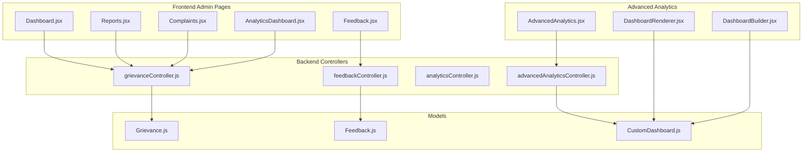
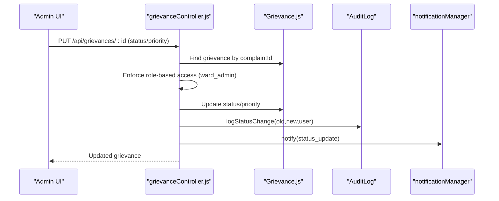
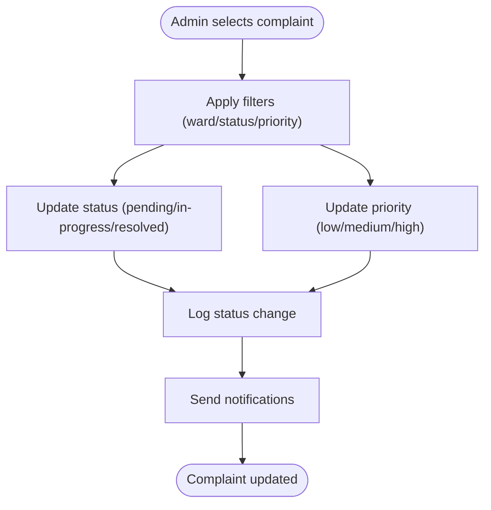
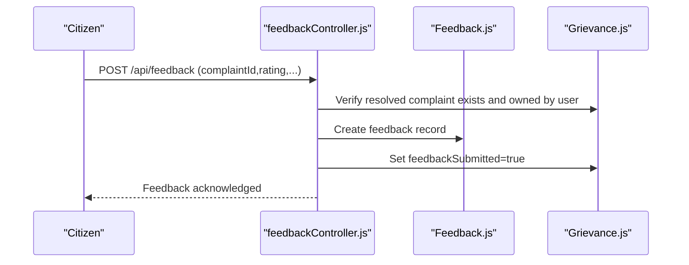
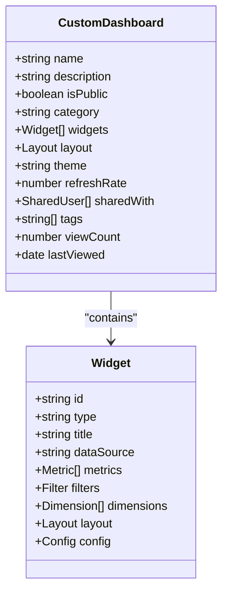
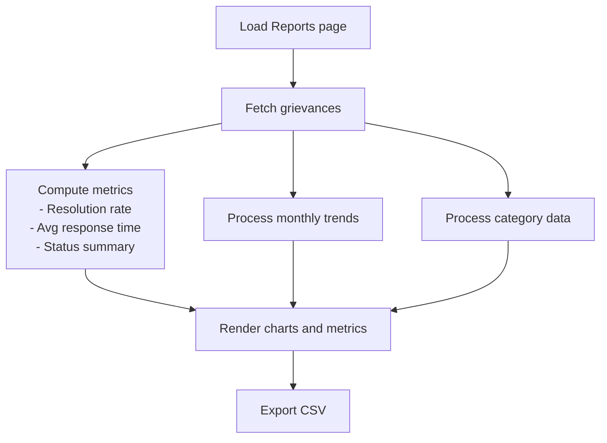
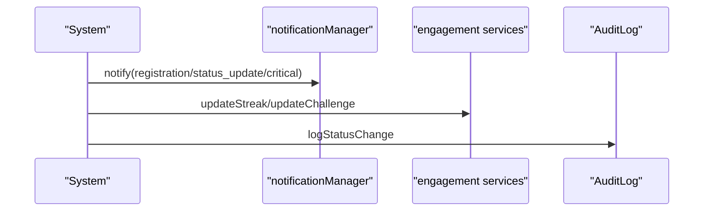
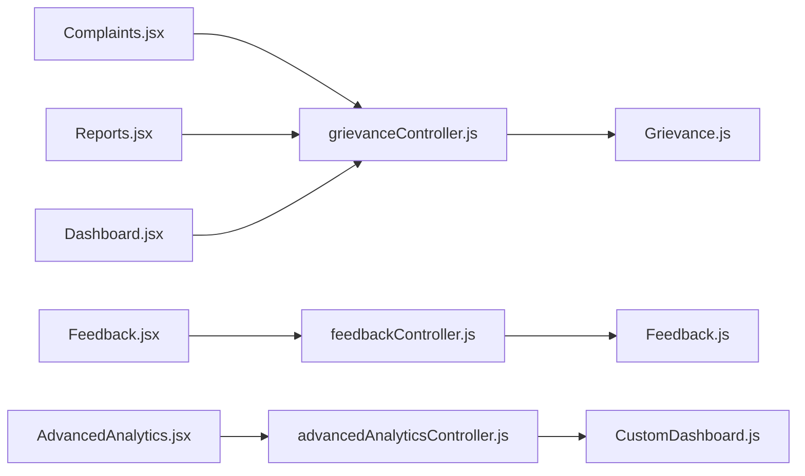

# Administrative Workflows & Reporting

<cite>
**Referenced Files in This Document**
- [AnalyticsDashboard.jsx](file://Frontend/src/pages/admin/AnalyticsDashboard.jsx)
- [Complaints.jsx](file://Frontend/src/pages/admin/Complaints.jsx)
- [Feedback.jsx](file://Frontend/src/pages/admin/Feedback.jsx)
- [Reports.jsx](file://Frontend/src/pages/admin/Reports.jsx)
- [Dashboard.jsx](file://Frontend/src/pages/admin/Dashboard.jsx)
- [AdvancedAnalytics.jsx](file://Frontend/src/components/analytics/AdvancedAnalytics.jsx)
- [DashboardBuilder.jsx](file://Frontend/src/components/analytics-advanced/DashboardBuilder.jsx)
- [DashboardRenderer.jsx](file://Frontend/src/components/analytics-advanced/DashboardRenderer.jsx)
- [grievanceController.js](file://backend/src/controllers/grievanceController.js)
- [feedbackController.js](file://backend/src/controllers/feedbackController.js)
- [analyticsController.js](file://backend/src/controllers/analyticsController.js)
- [advancedAnalyticsController.js](file://backend/src/controllers/advancedAnalyticsController.js)
- [Grievance.js](file://backend/src/models/Grievance.js)
- [Feedback.js](file://backend/src/models/Feedback.js)
- [CustomDashboard.js](file://backend/src/models/CustomDashboard.js)
</cite>

## Table of Contents
1. [Introduction](#introduction)
2. [Project Structure](#project-structure)
3. [Core Components](#core-components)
4. [Architecture Overview](#architecture-overview)
5. [Detailed Component Analysis](#detailed-component-analysis)
6. [Dependency Analysis](#dependency-analysis)
7. [Performance Considerations](#performance-considerations)
8. [Troubleshooting Guide](#troubleshooting-guide)
9. [Conclusion](#conclusion)

## Introduction
This document provides comprehensive documentation for administrative workflows and reporting systems within the SmartCity platform. It covers complaint handling workflows including review processes, status assignments, and resolution tracking; the feedback management system for processing citizen feedback and suggestions; the advanced analytics reporting interface with custom dashboard creation, data export capabilities, and performance metrics; and administrative reporting features including compliance reports, audit trails, and system usage analytics. Additionally, it explains workflow automation features, batch processing capabilities, and administrative approval processes.

## Project Structure
The system consists of:
- Frontend administrative pages for analytics, complaints, feedback, and reports
- Advanced analytics components enabling custom dashboards and data visualization
- Backend controllers managing grievance lifecycle, feedback collection, analytics computation, and advanced reporting
- MongoDB models supporting grievance records, feedback entries, and custom dashboards
- Route handlers exposing REST endpoints for administrative operations

**Diagram sources**
- [AnalyticsDashboard.jsx:1-24](file://Frontend/src/pages/admin/AnalyticsDashboard.jsx#L1-L24)
- [Complaints.jsx:1-195](file://Frontend/src/pages/admin/Complaints.jsx#L1-L195)
- [Feedback.jsx:1-384](file://Frontend/src/pages/admin/Feedback.jsx#L1-L384)
- [Reports.jsx:1-398](file://Frontend/src/pages/admin/Reports.jsx#L1-L398)
- [Dashboard.jsx:1-516](file://Frontend/src/pages/admin/Dashboard.jsx#L1-L516)
- [AdvancedAnalytics.jsx:1-120](file://Frontend/src/components/analytics/AdvancedAnalytics.jsx#L1-L120)
- [DashboardBuilder.jsx:1-379](file://Frontend/src/components/analytics-advanced/DashboardBuilder.jsx#L1-L379)
- [DashboardRenderer.jsx:1-388](file://Frontend/src/components/analytics-advanced/DashboardRenderer.jsx#L1-L388)
- [grievanceController.js:1-752](file://backend/src/controllers/grievanceController.js#L1-L752)
- [feedbackController.js:1-225](file://backend/src/controllers/feedbackController.js#L1-L225)
- [analyticsController.js:1-203](file://backend/src/controllers/analyticsController.js#L1-L203)
- [advancedAnalyticsController.js:1-397](file://backend/src/controllers/advancedAnalyticsController.js#L1-L397)
- [Grievance.js:1-115](file://backend/src/models/Grievance.js#L1-L115)
- [Feedback.js:1-40](file://backend/src/models/Feedback.js#L1-L40)
- [CustomDashboard.js:1-160](file://backend/src/models/CustomDashboard.js#L1-L160)

**Section sources**
- [AnalyticsDashboard.jsx:1-24](file://Frontend/src/pages/admin/AnalyticsDashboard.jsx#L1-L24)
- [Complaints.jsx:1-195](file://Frontend/src/pages/admin/Complaints.jsx#L1-L195)
- [Feedback.jsx:1-384](file://Frontend/src/pages/admin/Feedback.jsx#L1-L384)
- [Reports.jsx:1-398](file://Frontend/src/pages/admin/Reports.jsx#L1-L398)
- [Dashboard.jsx:1-516](file://Frontend/src/pages/admin/Dashboard.jsx#L1-L516)
- [AdvancedAnalytics.jsx:1-120](file://Frontend/src/components/analytics/AdvancedAnalytics.jsx#L1-L120)
- [DashboardBuilder.jsx:1-379](file://Frontend/src/components/analytics-advanced/DashboardBuilder.jsx#L1-L379)
- [DashboardRenderer.jsx:1-388](file://Frontend/src/components/analytics-advanced/DashboardRenderer.jsx#L1-L388)
- [grievanceController.js:1-752](file://backend/src/controllers/grievanceController.js#L1-L752)
- [feedbackController.js:1-225](file://backend/src/controllers/feedbackController.js#L1-L225)
- [analyticsController.js:1-203](file://backend/src/controllers/analyticsController.js#L1-L203)
- [advancedAnalyticsController.js:1-397](file://backend/src/controllers/advancedAnalyticsController.js#L1-L397)
- [Grievance.js:1-115](file://backend/src/models/Grievance.js#L1-L115)
- [Feedback.js:1-40](file://backend/src/models/Feedback.js#L1-L40)
- [CustomDashboard.js:1-160](file://backend/src/models/CustomDashboard.js#L1-L160)

## Core Components
- Administrative Complaints Management: Real-time filtering, status/priority updates, and ward-based visibility controls
- Feedback Collection and Analysis: Structured feedback submission, rating distribution, and satisfaction metrics
- Reporting and Analytics: Monthly trends, category breakdowns, performance metrics, and CSV export
- Advanced Analytics Dashboards: Customizable widgets, KPI cards, benchmarking, pattern insights, and export capabilities
- Audit and Compliance: Status change logging with role-based access enforcement

**Section sources**
- [Complaints.jsx:1-195](file://Frontend/src/pages/admin/Complaints.jsx#L1-L195)
- [Feedback.jsx:1-384](file://Frontend/src/pages/admin/Feedback.jsx#L1-L384)
- [Reports.jsx:1-398](file://Frontend/src/pages/admin/Reports.jsx#L1-L398)
- [AdvancedAnalytics.jsx:1-120](file://Frontend/src/components/analytics/AdvancedAnalytics.jsx#L1-L120)
- [DashboardBuilder.jsx:1-379](file://Frontend/src/components/analytics-advanced/DashboardBuilder.jsx#L1-L379)
- [DashboardRenderer.jsx:1-388](file://Frontend/src/components/analytics-advanced/DashboardRenderer.jsx#L1-L388)
- [grievanceController.js:47-63](file://backend/src/controllers/grievanceController.js#L47-L63)

## Architecture Overview
The administrative workflow architecture integrates frontend pages with backend controllers and models. Administrative actions (status updates, feedback processing, report generation) are protected by role-based access control and logged for auditability.

**Diagram sources**
- [grievanceController.js:344-428](file://backend/src/controllers/grievanceController.js#L344-L428)
- [Grievance.js:1-115](file://backend/src/models/Grievance.js#L1-L115)

**Section sources**
- [grievanceController.js:344-428](file://backend/src/controllers/grievanceController.js#L344-L428)
- [Grievance.js:1-115](file://backend/src/models/Grievance.js#L1-L115)

## Detailed Component Analysis

### Complaint Handling Workflows
Administrative complaint handling supports:
- Filtering by ward, status, and priority via URL query parameters and UI controls
- Real-time status and priority updates with immediate audit logging
- Role-based access enforcement ensuring ward admins cannot modify other wards’ complaints
- Automatic notifications for status changes and priority escalations

**Diagram sources**
- [Complaints.jsx:20-34](file://Frontend/src/pages/admin/Complaints.jsx#L20-L34)
- [grievanceController.js:344-428](file://backend/src/controllers/grievanceController.js#L344-L428)

**Section sources**
- [Complaints.jsx:1-195](file://Frontend/src/pages/admin/Complaints.jsx#L1-L195)
- [grievanceController.js:344-428](file://backend/src/controllers/grievanceController.js#L344-L428)

### Feedback Management System
The feedback system enables structured citizen feedback collection:
- Submission validation for complaint ownership, rating bounds, and duplicate prevention
- Computed statistics (average rating, positive percentage, average timeliness)
- Pending feedback reminders and skip functionality

**Diagram sources**
- [feedbackController.js:8-82](file://backend/src/controllers/feedbackController.js#L8-L82)
- [Feedback.js:1-40](file://backend/src/models/Feedback.js#L1-L40)
- [Grievance.js:60-67](file://backend/src/models/Grievance.js#L60-L67)

**Section sources**
- [Feedback.jsx:1-384](file://Frontend/src/pages/admin/Feedback.jsx#L1-L384)
- [feedbackController.js:1-225](file://backend/src/controllers/feedbackController.js#L1-L225)
- [Feedback.js:1-40](file://backend/src/models/Feedback.js#L1-L40)
- [Grievance.js:1-115](file://backend/src/models/Grievance.js#L1-L115)

### Advanced Analytics Reporting Interface
The advanced analytics interface provides:
- Custom dashboard builder with drag-and-drop widgets (KPI cards, charts, gauges, tables)
- Dashboard renderer with live data fetching and refresh capabilities
- Export analytics and historical comparisons
- Performance benchmarking and pattern insights

**Diagram sources**
- [CustomDashboard.js:87-150](file://backend/src/models/CustomDashboard.js#L87-L150)
- [DashboardBuilder.jsx:46-139](file://Frontend/src/components/analytics-advanced/DashboardBuilder.jsx#L46-L139)
- [DashboardRenderer.jsx:28-80](file://Frontend/src/components/analytics-advanced/DashboardRenderer.jsx#L28-L80)

**Section sources**
- [AdvancedAnalytics.jsx:1-120](file://Frontend/src/components/analytics/AdvancedAnalytics.jsx#L1-L120)
- [DashboardBuilder.jsx:1-379](file://Frontend/src/components/analytics-advanced/DashboardBuilder.jsx#L1-L379)
- [DashboardRenderer.jsx:1-388](file://Frontend/src/components/analytics-advanced/DashboardRenderer.jsx#L1-L388)
- [advancedAnalyticsController.js:88-394](file://backend/src/controllers/advancedAnalyticsController.js#L88-L394)
- [CustomDashboard.js:1-160](file://backend/src/models/CustomDashboard.js#L1-L160)

### Administrative Reporting Features
Administrative reporting includes:
- Monthly complaint trends and category distributions
- Performance metrics (resolution rate, average response time, total complaints)
- CSV export of comprehensive analytics
- Ward performance rankings and resolution time analytics

**Diagram sources**
- [Reports.jsx:36-137](file://Frontend/src/pages/admin/Reports.jsx#L36-L137)

**Section sources**
- [Reports.jsx:1-398](file://Frontend/src/pages/admin/Reports.jsx#L1-L398)
- [analyticsController.js:1-203](file://backend/src/controllers/analyticsController.js#L1-L203)

### Workflow Automation and Batch Processing
Workflow automation features include:
- Automated notifications for status updates and priority escalations
- Audit trail logging for all status changes
- Engagement triggers (streaks, challenges) upon complaint submission
- Batch export of analytics data for external reporting

**Diagram sources**
- [grievanceController.js:154-206](file://backend/src/controllers/grievanceController.js#L154-L206)
- [grievanceController.js:47-63](file://backend/src/controllers/grievanceController.js#L47-L63)

**Section sources**
- [grievanceController.js:154-206](file://backend/src/controllers/grievanceController.js#L154-L206)
- [grievanceController.js:47-63](file://backend/src/controllers/grievanceController.js#L47-L63)

## Dependency Analysis
The administrative system exhibits clear separation of concerns:
- Frontend pages depend on controllers for data retrieval and mutations
- Controllers operate on models and services, enforcing business rules and access control
- Advanced analytics introduces a separate controller and model for custom dashboards
- Audit logging ensures compliance and traceability

**Diagram sources**
- [Complaints.jsx:1-195](file://Frontend/src/pages/admin/Complaints.jsx#L1-L195)
- [Feedback.jsx:1-384](file://Frontend/src/pages/admin/Feedback.jsx#L1-L384)
- [Reports.jsx:1-398](file://Frontend/src/pages/admin/Reports.jsx#L1-L398)
- [Dashboard.jsx:1-516](file://Frontend/src/pages/admin/Dashboard.jsx#L1-L516)
- [AdvancedAnalytics.jsx:1-120](file://Frontend/src/components/analytics/AdvancedAnalytics.jsx#L1-L120)
- [grievanceController.js:1-752](file://backend/src/controllers/grievanceController.js#L1-L752)
- [feedbackController.js:1-225](file://backend/src/controllers/feedbackController.js#L1-L225)
- [advancedAnalyticsController.js:1-397](file://backend/src/controllers/advancedAnalyticsController.js#L1-L397)
- [Grievance.js:1-115](file://backend/src/models/Grievance.js#L1-L115)
- [Feedback.js:1-40](file://backend/src/models/Feedback.js#L1-L40)
- [CustomDashboard.js:1-160](file://backend/src/models/CustomDashboard.js#L1-L160)

**Section sources**
- [Complaints.jsx:1-195](file://Frontend/src/pages/admin/Complaints.jsx#L1-L195)
- [Feedback.jsx:1-384](file://Frontend/src/pages/admin/Feedback.jsx#L1-L384)
- [Reports.jsx:1-398](file://Frontend/src/pages/admin/Reports.jsx#L1-L398)
- [Dashboard.jsx:1-516](file://Frontend/src/pages/admin/Dashboard.jsx#L1-L516)
- [AdvancedAnalytics.jsx:1-120](file://Frontend/src/components/analytics/AdvancedAnalytics.jsx#L1-L120)
- [grievanceController.js:1-752](file://backend/src/controllers/grievanceController.js#L1-L752)
- [feedbackController.js:1-225](file://backend/src/controllers/feedbackController.js#L1-L225)
- [advancedAnalyticsController.js:1-397](file://backend/src/controllers/advancedAnalyticsController.js#L1-L397)
- [Grievance.js:1-115](file://backend/src/models/Grievance.js#L1-L115)
- [Feedback.js:1-40](file://backend/src/models/Feedback.js#L1-L40)
- [CustomDashboard.js:1-160](file://backend/src/models/CustomDashboard.js#L1-L160)

## Performance Considerations
- Database indexing on frequently queried fields (ward, status, category, priority, createdAt) improves query performance
- Aggregation pipelines in analytics controllers minimize round trips and leverage server-side computations
- Frontend lazy-loading of advanced analytics modules reduces initial bundle size
- Efficient chart rendering with responsive containers and minimal re-renders

## Troubleshooting Guide
Common issues and resolutions:
- Access Denied for Ward Admins: Ensure the complaint belongs to the admin’s assigned ward before attempting updates
- Duplicate Feedback Errors: Validate that feedback is not already submitted for the complaint
- Export Failures: Confirm network connectivity and that the grievance endpoint returns data successfully
- Dashboard Rendering Errors: Verify widget configurations and ensure required metrics are present

**Section sources**
- [grievanceController.js:354-360](file://backend/src/controllers/grievanceController.js#L354-L360)
- [feedbackController.js:73-82](file://backend/src/controllers/feedbackController.js#L73-L82)
- [Reports.jsx:139-209](file://Frontend/src/pages/admin/Reports.jsx#L139-L209)
- [DashboardRenderer.jsx:45-70](file://Frontend/src/components/analytics-advanced/DashboardRenderer.jsx#L45-L70)

## Conclusion
The administrative workflows and reporting systems provide a robust foundation for managing citizen complaints, collecting feedback, and generating actionable insights. The modular architecture supports scalability, maintainability, and extensibility, enabling administrators to monitor performance, enforce compliance, and drive continuous improvement through data-driven decision-making.