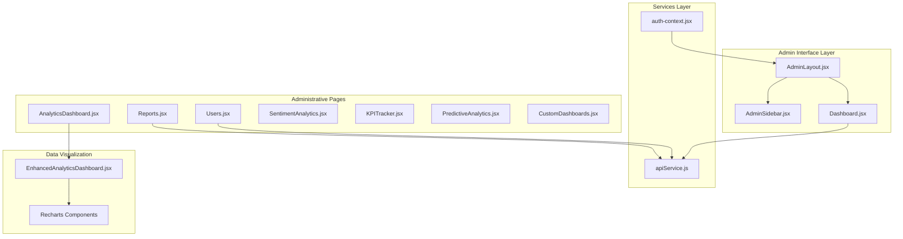
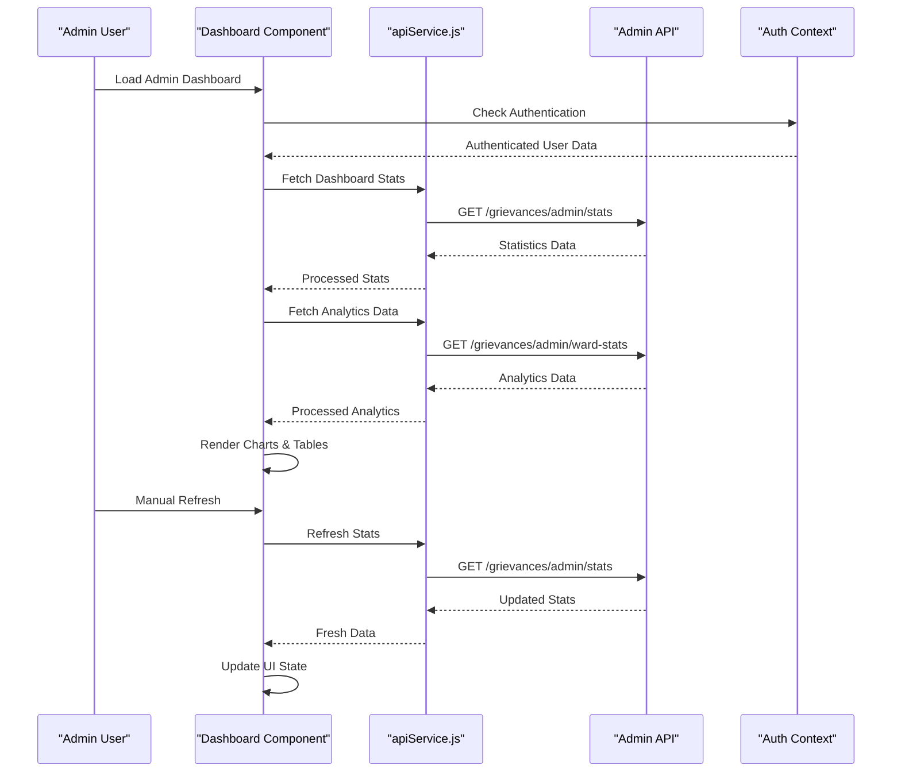
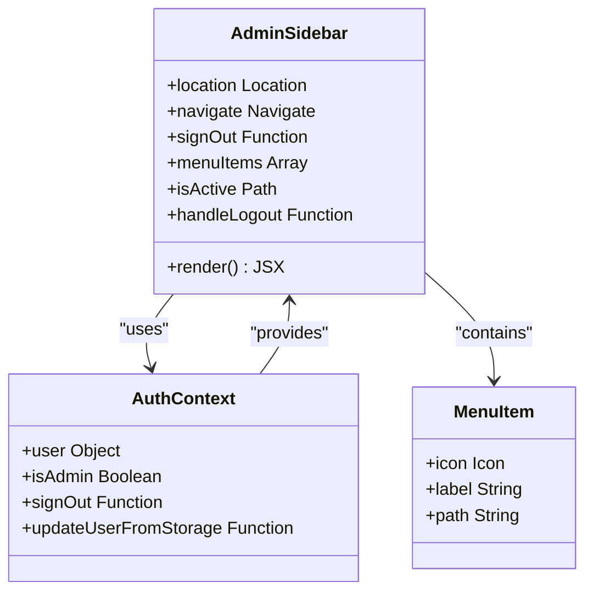
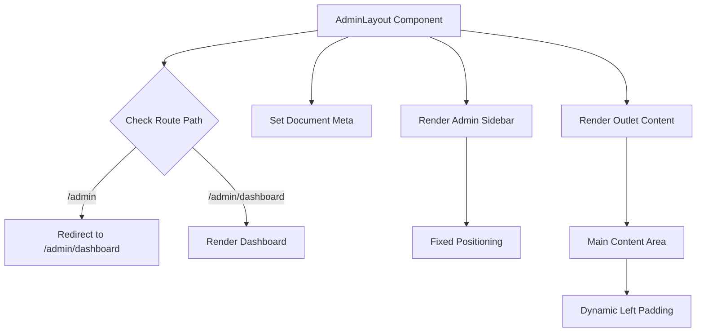
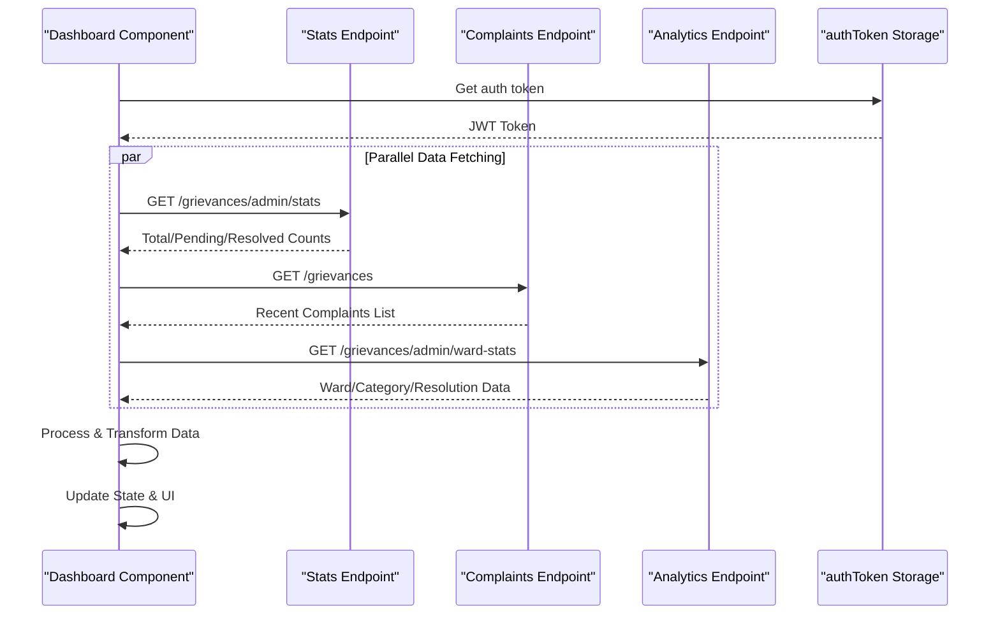
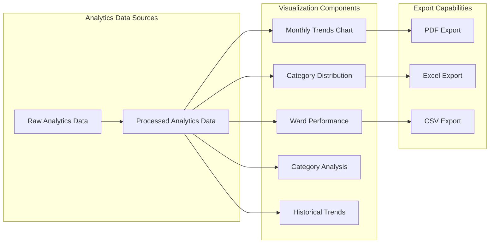
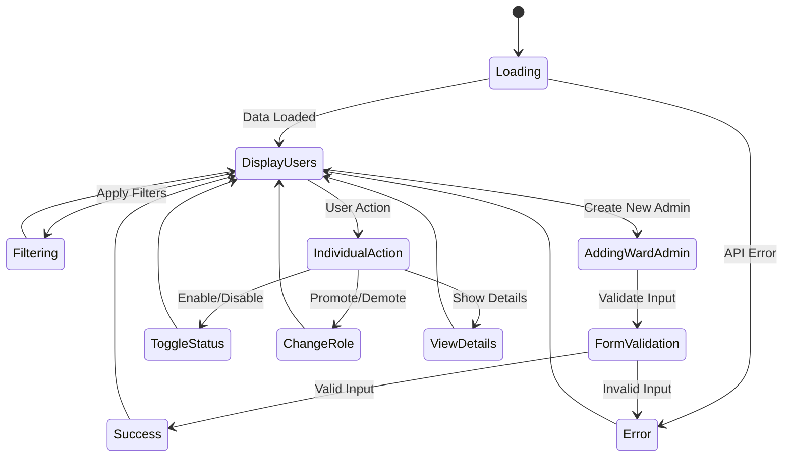
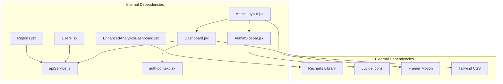

# Super Admin Dashboard

<cite>
**Referenced Files in This Document**
- [Dashboard.jsx](file://Frontend/src/pages/admin/Dashboard.jsx)
- [AdminSidebar.jsx](file://Frontend/src/components/AdminSidebar.jsx)
- [AdminLayout.jsx](file://Frontend/src/pages/AdminLayout.jsx)
- [apiService.js](file://Frontend/src/services/apiService.js)
- [auth-context.jsx](file://Frontend/src/context/auth-context.jsx)
- [Users.jsx](file://Frontend/src/pages/admin/Users.jsx)
- [Reports.jsx](file://Frontend/src/pages/admin/Reports.jsx)
- [AnalyticsDashboard.jsx](file://Frontend/src/pages/admin/AnalyticsDashboard.jsx)
- [EnhancedAnalyticsDashboard.jsx](file://Frontend/src/components/analytics/EnhancedAnalyticsDashboard.jsx)
- [SentimentAnalytics.jsx](file://Frontend/src/pages/admin/SentimentAnalytics.jsx)
- [PredictiveAnalytics.jsx](file://Frontend/src/pages/admin/PredictiveAnalytics.jsx)
- [KPITracker.jsx](file://Frontend/src/pages/admin/KPITracker.jsx)
- [CustomDashboards.jsx](file://Frontend/src/pages/admin/CustomDashboards.jsx)
</cite>

## Table of Contents
1. [Introduction](#introduction)
2. [Project Structure](#project-structure)
3. [Core Components](#core-components)
4. [Architecture Overview](#architecture-overview)
5. [Detailed Component Analysis](#detailed-component-analysis)
6. [Dependency Analysis](#dependency-analysis)
7. [Performance Considerations](#performance-considerations)
8. [Troubleshooting Guide](#troubleshooting-guide)
9. [Conclusion](#conclusion)

## Introduction
The Super Admin Dashboard is a comprehensive administrative interface designed for city administrators to monitor, analyze, and manage municipal grievance systems in real-time. The system provides centralized oversight through an intuitive dashboard with key performance indicators, interactive data visualizations, and administrative controls for user management and system configuration.

The dashboard integrates multiple data visualization components including bar charts for ward complaint distributions, pie charts for issue type categorization, and line charts for resolution trend analysis. It features a responsive layout with a collapsible navigation sidebar, real-time data fetching capabilities, and robust authentication integration for secure admin access.

## Project Structure
The super admin dashboard follows a modular React-based architecture with clear separation of concerns across components, services, and pages. The system is organized into distinct functional areas:

**Diagram sources**
- [AdminLayout.jsx:58-90](file://Frontend/src/pages/AdminLayout.jsx#L58-L90)
- [AdminSidebar.jsx:178-267](file://Frontend/src/components/AdminSidebar.jsx#L178-L267)
- [Dashboard.jsx:11-516](file://Frontend/src/pages/admin/Dashboard.jsx#L11-L516)

**Section sources**
- [AdminLayout.jsx:58-90](file://Frontend/src/pages/AdminLayout.jsx#L58-L90)
- [AdminSidebar.jsx:178-267](file://Frontend/src/components/AdminSidebar.jsx#L178-L267)

## Core Components

### Dashboard Overview Cards
The dashboard presents four key performance indicators in a responsive grid layout, each featuring professional styling with gradient accents and trend information:

- **Total Complaints**: Displays overall complaint volume with percentage change indicators
- **Pending Complaints**: Shows unresolved cases requiring immediate attention  
- **Resolved Complaints**: Tracks completed cases and resolution effectiveness
- **Average Rating**: Presents citizen satisfaction scores with star-based visualization

Each card implements hover animations, gradient borders, and consistent color coding for quick status assessment.

**Section sources**
- [Dashboard.jsx:12-17](file://Frontend/src/pages/admin/Dashboard.jsx#L12-L17)
- [Dashboard.jsx:234-286](file://Frontend/src/pages/admin/Dashboard.jsx#L234-L286)

### Data Visualization Components
The dashboard incorporates three primary chart types for comprehensive analytics:

#### Ward Complaint Distribution (Bar Chart)
Visualizes complaint volume across five city wards using blue-styled bars with responsive containers ensuring optimal display on all devices.

#### Issue Type Distribution (Pie Chart)  
Displays categorical breakdown of complaints including water supply, road repair, garbage collection, street lighting, and others with custom color coding and percentage labels.

#### Resolution Trends (Line Chart)
Shows monthly trends for resolved versus pending complaints, enabling pattern recognition and resource planning across time periods.

**Section sources**
- [Dashboard.jsx:290-430](file://Frontend/src/pages/admin/Dashboard.jsx#L290-L430)

### Recent Complaints Table
Features a scrollable list of the six most recent complaints with status indicators, priority badges, and essential metadata including complaint IDs, ward assignments, submission dates, and issue descriptions.

**Section sources**
- [Dashboard.jsx:432-510](file://Frontend/src/pages/admin/Dashboard.jsx#L432-L510)

## Architecture Overview

**Diagram sources**
- [Dashboard.jsx:50-150](file://Frontend/src/pages/admin/Dashboard.jsx#L50-L150)
- [apiService.js:220-234](file://Frontend/src/services/apiService.js#L220-L234)
- [auth-context.jsx:99-102](file://Frontend/src/context/auth-context.jsx#L99-L102)

The architecture implements a clean separation between presentation logic and data management, with centralized authentication handling and modular service layer for API communications.

**Section sources**
- [Dashboard.jsx:11-516](file://Frontend/src/pages/admin/Dashboard.jsx#L11-L516)
- [apiService.js:16-539](file://Frontend/src/services/apiService.js#L16-L539)

## Detailed Component Analysis

### Admin Navigation Sidebar
The navigation sidebar provides comprehensive access to all administrative functions with a clean, professional design:

**Diagram sources**
- [AdminSidebar.jsx:178-267](file://Frontend/src/components/AdminSidebar.jsx#L178-L267)
- [auth-context.jsx:136-143](file://Frontend/src/context/auth-context.jsx#L136-L143)

The sidebar features:
- **Professional Branding**: SmartCity Portal with blue accent color scheme
- **Navigation Menu**: Dashboard, Users, Reports, Analytics, Feedback, Settings
- **Quick Access**: Home, Services, Submit Complaint, Track Complaint links
- **Authentication Integration**: Secure logout functionality with proper state cleanup

**Section sources**
- [AdminSidebar.jsx:178-267](file://Frontend/src/components/AdminSidebar.jsx#L178-L267)

### Admin Layout Container
The layout container manages the overall page structure with responsive design principles:

**Diagram sources**
- [AdminLayout.jsx:58-90](file://Frontend/src/pages/AdminLayout.jsx#L58-L90)

**Section sources**
- [AdminLayout.jsx:58-90](file://Frontend/src/pages/AdminLayout.jsx#L58-L90)

### Real-Time Data Fetching System
The dashboard implements sophisticated real-time data management through multiple API endpoints:

**Diagram sources**
- [Dashboard.jsx:50-150](file://Frontend/src/pages/admin/Dashboard.jsx#L50-L150)

**Section sources**
- [Dashboard.jsx:50-150](file://Frontend/src/pages/admin/Dashboard.jsx#L50-L150)

### Advanced Analytics Integration
The enhanced analytics dashboard provides comprehensive data visualization capabilities:

**Diagram sources**
- [EnhancedAnalyticsDashboard.jsx:46-85](file://Frontend/src/components/analytics/EnhancedAnalyticsDashboard.jsx#L46-L85)

**Section sources**
- [EnhancedAnalyticsDashboard.jsx:46-85](file://Frontend/src/components/analytics/EnhancedAnalyticsDashboard.jsx#L46-L85)

### User Management System
The user management interface provides comprehensive administrative controls for managing city administrators:

**Diagram sources**
- [Users.jsx:15-56](file://Frontend/src/pages/admin/Users.jsx#L15-L56)

**Section sources**
- [Users.jsx:15-56](file://Frontend/src/pages/admin/Users.jsx#L15-L56)

## Dependency Analysis

**Diagram sources**
- [Dashboard.jsx:1-10](file://Frontend/src/pages/admin/Dashboard.jsx#L1-L10)
- [AdminSidebar.jsx:159-176](file://Frontend/src/components/AdminSidebar.jsx#L159-L176)

The system demonstrates excellent modularity with clear dependency boundaries. The service layer (`apiService.js`) centralizes all API communications, while the context layer (`auth-context.jsx`) manages authentication state across components.

**Section sources**
- [Dashboard.jsx:1-10](file://Frontend/src/pages/admin/Dashboard.jsx#L1-L10)
- [AdminSidebar.jsx:159-176](file://Frontend/src/components/AdminSidebar.jsx#L159-L176)

## Performance Considerations
The dashboard implementation incorporates several performance optimization strategies:

- **Lazy Loading**: Chart components utilize responsive containers that adapt to screen sizes without performance degradation
- **State Management**: Efficient state updates prevent unnecessary re-renders through proper React patterns
- **Data Processing**: Client-side data transformation reduces server load while maintaining responsiveness
- **Memory Management**: Proper cleanup of event listeners and timers prevents memory leaks
- **Caching Strategy**: Strategic use of local storage for authentication tokens reduces network requests

## Troubleshooting Guide

### Common Issues and Solutions

**Authentication Problems**
- **Symptom**: Dashboard shows unauthorized access errors
- **Solution**: Verify JWT token in localStorage and check backend authentication endpoint
- **Prevention**: Implement automatic token refresh and proper error handling

**Data Loading Failures**
- **Symptom**: Charts show empty or incomplete data
- **Solution**: Check API endpoint availability and network connectivity
- **Prevention**: Implement retry mechanisms and graceful error boundaries

**Performance Issues**
- **Symptom**: Slow chart rendering or UI lag
- **Solution**: Optimize data processing and reduce unnecessary re-renders
- **Prevention**: Implement virtual scrolling for large datasets

**Section sources**
- [Dashboard.jsx:144-147](file://Frontend/src/pages/admin/Dashboard.jsx#L144-L147)
- [EnhancedAnalyticsDashboard.jsx:75-85](file://Frontend/src/components/analytics/EnhancedAnalyticsDashboard.jsx#L75-L85)

## Conclusion
The Super Admin Dashboard represents a comprehensive solution for municipal administration, combining intuitive navigation, powerful data visualization, and robust administrative controls. The system's modular architecture ensures maintainability and scalability while providing administrators with the tools necessary for effective city governance.

Key strengths include the professional dashboard design with real-time data visualization, comprehensive user management capabilities, and advanced analytics integration. The responsive layout ensures accessibility across device types, while the authentication system provides secure access control for administrative functions.

Future enhancements could include real-time data streaming, advanced filtering capabilities, and expanded export formats to further improve the administrative experience.