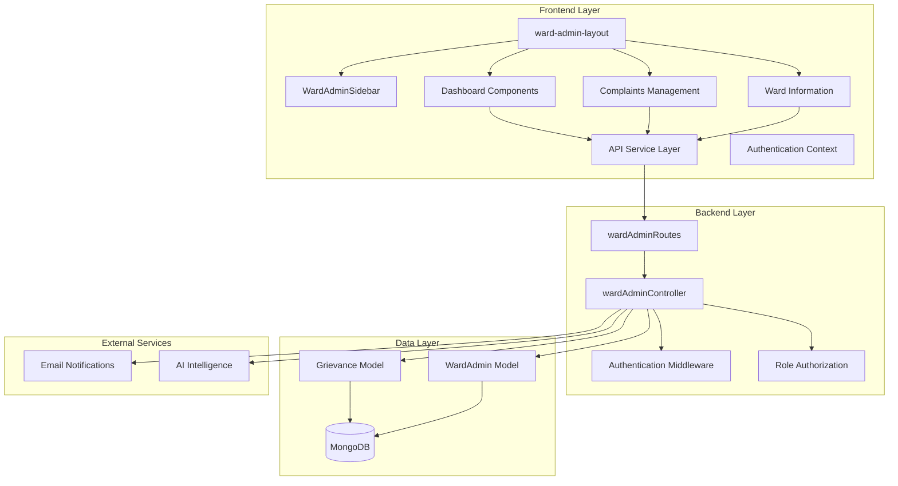
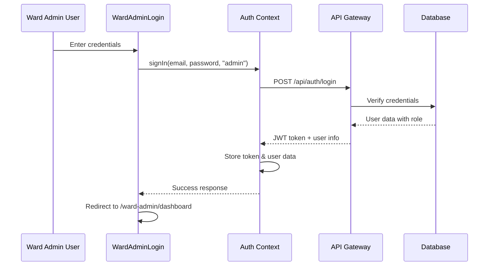
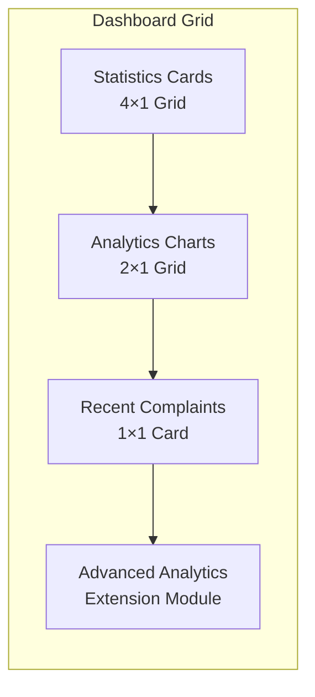
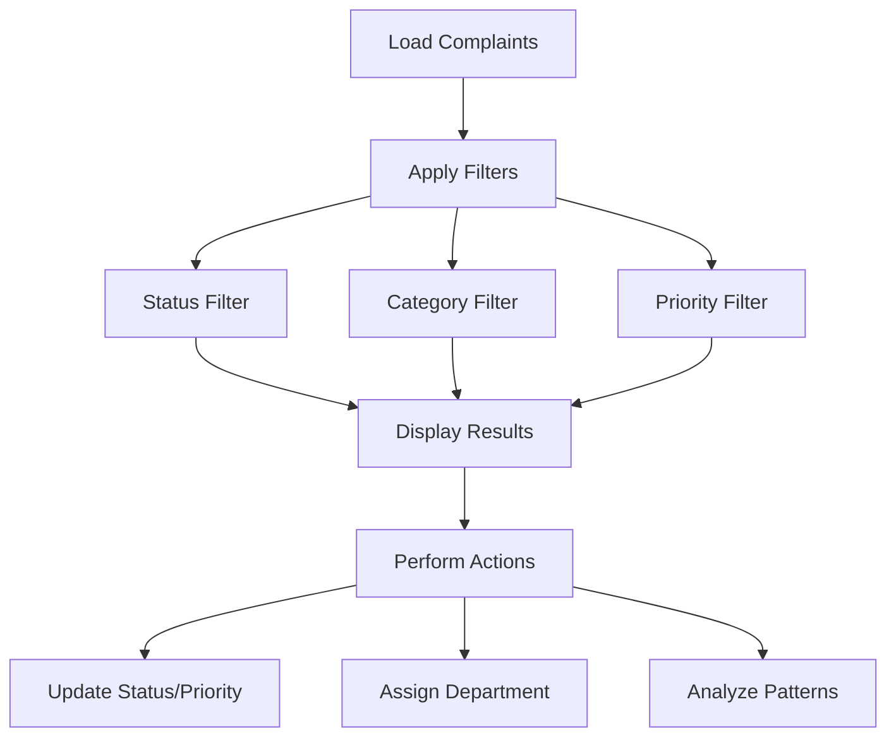
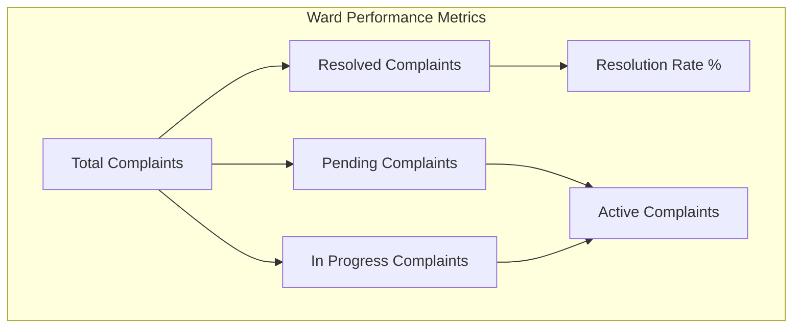
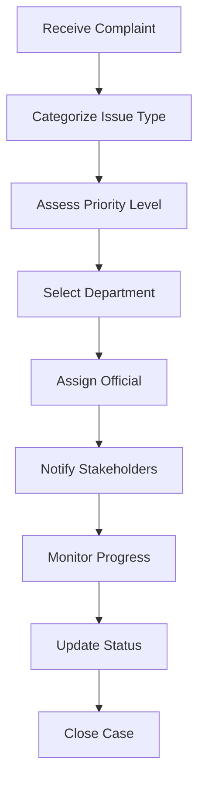
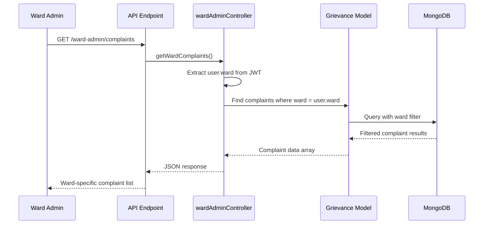
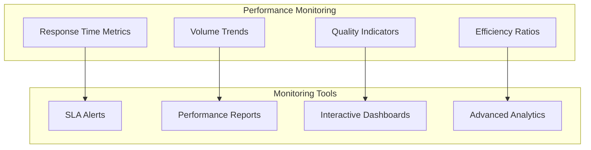
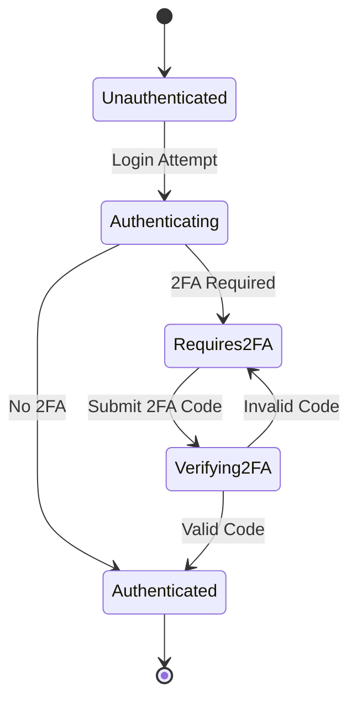

# Ward Administrator Interface

<cite>
**Referenced Files in This Document**
- [Dashboard.jsx](file://Frontend/src/pages/ward-admin/Dashboard.jsx)
- [Complaints.jsx](file://Frontend/src/pages/ward-admin/Complaints.jsx)
- [WardInfo.jsx](file://Frontend/src/pages/ward-admin/WardInfo.jsx)
- [WardAdminLayout.jsx](file://Frontend/src/pages/WardAdminLayout.jsx)
- [WardAdminSidebar.jsx](file://Frontend/src/components/WardAdminSidebar.jsx)
- [apiService.js](file://Frontend/src/services/apiService.js)
- [auth-context.jsx](file://Frontend/src/context/auth-context.jsx)
- [WardAdminLogin.jsx](file://Frontend/src/pages/WardAdminLogin.jsx)
- [wardAdminController.js](file://backend/src/controllers/wardAdminController.js)
- [wardAdminRoutes.js](file://backend/src/routes/wardAdminRoutes.js)
- [WardAdmin.js](file://backend/src/models/WardAdmin.js)
- [Grievance.js](file://backend/src/models/Grievance.js)
- [WARD_ADMIN_IMPLEMENTATION.md](file://WARD_ADMIN_IMPLEMENTATION.md)
</cite>

## Table of Contents
1. [Introduction](#introduction)
2. [System Architecture](#system-architecture)
3. [Ward Administrator Role and Permissions](#ward-administrator-role-and-permissions)
4. [Dashboard Components](#dashboard-components)
5. [Complaint Management Interface](#complaint-management-interface)
6. [Ward Information Management](#ward-information-management)
7. [Department Assignment Workflows](#department-assignment-workflows)
8. [Ward-Specific Data Filtering](#ward-specific-data-filtering)
9. [Performance Monitoring Features](#performance-monitoring-features)
10. [Security and Authentication](#security-and-authentication)
11. [Integration Points](#integration-points)
12. [Troubleshooting Guide](#troubleshooting-guide)
13. [Conclusion](#conclusion)

## Introduction

The Ward Administrator Interface is a comprehensive administrative system designed for local government officials responsible for managing citizen complaints within their designated ward boundaries. This system provides a centralized platform for ward administrators to monitor, analyze, and resolve municipal issues while maintaining strict data isolation and security protocols.

The interface encompasses three primary functional areas: real-time dashboard analytics, comprehensive complaint management, and ward information reporting. Built with modern React.js frontend architecture and Express.js backend services, the system ensures secure, scalable, and user-friendly administration of municipal services.

## System Architecture

The Ward Administrator Interface follows a client-server architecture with clear separation of concerns between frontend presentation, backend services, and database management.



**Diagram sources**
- [WardAdminLayout.jsx:1-37](file://Frontend/src/pages/WardAdminLayout.jsx#L1-L37)
- [WardAdminSidebar.jsx:1-95](file://Frontend/src/components/WardAdminSidebar.jsx#L1-L95)
- [wardAdminRoutes.js:1-28](file://backend/src/routes/wardAdminRoutes.js#L1-L28)
- [wardAdminController.js:1-450](file://backend/src/controllers/wardAdminController.js#L1-L450)

The architecture implements several key design patterns:

- **Layered Architecture**: Clear separation between presentation, business logic, and data access layers
- **RESTful API Design**: Consistent endpoint structure with proper HTTP methods and status codes
- **Role-Based Access Control**: Strict permission enforcement at both frontend and backend levels
- **Real-Time Data Updates**: WebSocket connections for live complaint status updates
- **Security Through Isolation**: Ward-specific data filtering prevents cross-ward data access

## Ward Administrator Role and Permissions

The Ward Administrator role represents a crucial position in the municipal governance hierarchy, with specific permissions and responsibilities clearly defined within the system.

### Role Definition and Responsibilities

Ward Administrators are authorized officials responsible for:
- Managing complaints within their assigned ward boundaries
- Monitoring ward performance metrics and resolution rates
- Overseeing department assignments for complaint resolution
- Generating ward-specific analytics and reports
- Maintaining communication with citizens regarding their ward services

### Permission Matrix

| Functionality | Ward Admin Access | Admin Access | User Access |
|---------------|-------------------|--------------|-------------|
| View Ward Dashboard | ✅ Full Access | ❌ Restricted | ❌ Restricted |
| Manage Ward Complaints | ✅ Full Access | ❌ Restricted | ❌ Restricted |
| View Ward Information | ✅ Full Access | ❌ Restricted | ❌ Restricted |
| Department Assignment | ✅ Limited Access | ❌ Restricted | ❌ Restricted |
| Performance Analytics | ✅ Ward-Specific | ❌ Full System | ❌ Restricted |
| User Management | ❌ Restricted | ✅ Full Access | ❌ Restricted |
| System Configuration | ❌ Restricted | ✅ Full Access | ❌ Restricted |

### Authentication Flow



**Diagram sources**
- [WardAdminLogin.jsx:27-65](file://Frontend/src/pages/WardAdminLogin.jsx#L27-L65)
- [auth-context.jsx:43-72](file://Frontend/src/context/auth-context.jsx#L43-L72)

### Security Enforcements

The system implements multiple layers of security to protect sensitive municipal data:

- **Ward Isolation**: Backend queries automatically filter data by assigned ward
- **Role Validation**: JWT tokens contain role claims verified on each request
- **Password Policies**: Strong password requirements with bcrypt hashing
- **Session Management**: Token-based authentication with automatic expiration
- **Audit Logging**: Comprehensive logging of administrative actions

**Section sources**
- [WARD_ADMIN_IMPLEMENTATION.md:126-144](file://WARD_ADMIN_IMPLEMENTATION.md#L126-L144)
- [WardAdmin.js:23-42](file://backend/src/models/WardAdmin.js#L23-L42)
- [wardAdminController.js:416-450](file://backend/src/controllers/wardAdminController.js#L416-L450)

## Dashboard Components

The Ward Administrator Dashboard serves as the central command center, providing comprehensive analytics and real-time monitoring capabilities for municipal service management.

### Dashboard Layout Structure

The dashboard implements a responsive grid system optimized for both desktop and mobile viewing:



**Diagram sources**
- [Dashboard.jsx:197-273](file://Frontend/src/pages/ward-admin/Dashboard.jsx#L197-L273)

### Key Dashboard Components

#### Statistics Overview Cards
Four primary KPI cards display essential ward metrics:
- **Total Complaints**: Overall volume of issues reported
- **Pending**: New submissions awaiting assignment
- **In Progress**: Active resolution efforts
- **Resolved**: Successfully addressed issues

Each card features trend indicators showing monthly changes and visual styling with appropriate color coding for quick status assessment.

#### Issue Type Distribution Chart
A pie chart visualization displays complaint categorization by type, enabling pattern recognition and resource allocation decisions. Categories include water supply, road repair, garbage management, street lighting, and miscellaneous issues.

#### Resolution Trend Analysis
Line chart showing monthly resolution trends, allowing administrators to identify seasonal patterns and measure the effectiveness of intervention strategies.

#### Recent Complaints Feed
A scrollable list displaying the six most recent complaints with status indicators, priority levels, and submission dates for immediate action prioritization.

### Real-Time Data Synchronization

The dashboard implements automatic refresh mechanisms with manual override capabilities:

- **Automatic Updates**: Background polling every 5 minutes for new data
- **Manual Refresh**: One-click refresh button with loading indicators
- **Last Updated Timestamp**: Real-time display of data freshness
- **Error Handling**: Graceful degradation with user notifications

**Section sources**
- [Dashboard.jsx:14-114](file://Frontend/src/pages/ward-admin/Dashboard.jsx#L14-L114)
- [Dashboard.jsx:116-147](file://Frontend/src/pages/ward-admin/Dashboard.jsx#L116-L147)

## Complaint Management Interface

The Complaint Management Interface provides comprehensive tools for ward administrators to oversee, categorize, and resolve municipal issues within their jurisdiction.

### Complaint Listing and Filtering

The interface presents complaints in an organized card-based layout with sophisticated filtering capabilities:



**Diagram sources**
- [Complaints.jsx:23-40](file://Frontend/src/pages/ward-admin/Complaints.jsx#L23-L40)

### Status Management Workflow

Complaints can exist in three primary states, each with distinct management implications:

| Status | Color Code | Description | Administrative Actions |
|--------|------------|-------------|----------------------|
| **Pending** | ⚠️ Orange | New submissions awaiting assignment | Assign to department, set priority |
| **In Progress** | 🔵 Blue | Active resolution efforts | Monitor progress, escalate if needed |
| **Resolved** | ✅ Green | Successfully addressed | Close case, gather feedback |

### Priority Classification System

Priority levels determine resource allocation and response time expectations:

- **High Priority**: Immediate action required, emergency services
- **Medium Priority**: Standard response timeframe, routine maintenance
- **Low Priority**: Scheduled work, non-urgent improvements

### Interactive Complaint Cards

Each complaint displays comprehensive information in an intuitive card format:

**Header Section**: Title, complaint ID, priority badge, and current status indicator
**Body Content**: Detailed description, supporting images, location coordinates
**Metadata Panel**: Category classification, submission date, reporter information
**Action Panel**: Status dropdown, priority selector, and update button

### Department Assignment Integration

The interface supports seamless integration with the city's department management system, enabling administrators to:

- Route complaints to appropriate municipal departments
- Track department response times and workload
- Monitor department performance metrics
- Coordinate inter-departmental collaboration

**Section sources**
- [Complaints.jsx:42-87](file://Frontend/src/pages/ward-admin/Complaints.jsx#L42-L87)
- [Complaints.jsx:256-462](file://Frontend/src/pages/ward-admin/Complaints.jsx#L256-L462)

## Ward Information Management

The Ward Information Management system provides administrators with comprehensive insights into their ward's performance metrics and citizen engagement patterns.

### Performance Metrics Dashboard

The system tracks and displays key performance indicators that reflect the health and efficiency of municipal services:



**Diagram sources**
- [WardInfo.jsx:113-161](file://Frontend/src/pages/ward-admin/WardInfo.jsx#L113-L161)

### Statistical Analysis Components

The information management interface presents data through multiple analytical lenses:

#### Ward Overview Card
Displays fundamental ward information including assigned ward designation and performance metrics such as resolution rate percentage and active complaint counts.

#### Statistics Grid
Four specialized cards providing detailed breakdowns:
- **Total Complaints**: Complete volume of issues handled
- **Resolved**: Cases successfully closed
- **Pending**: New submissions requiring attention
- **In Progress**: Ongoing resolution activities

#### Quick Action Navigation
Streamlined access to related administrative functions including complaint viewing, dashboard navigation, and system exit options.

### Data Visualization and Reporting

The system generates automated reports and visualizations that support evidence-based decision-making:

- **Monthly Trend Analysis**: Tracking complaint patterns over time
- **Category Distribution**: Identifying prevalent municipal issues
- **Response Time Metrics**: Measuring service delivery efficiency
- **Citizen Satisfaction Indicators**: Monitoring public perception

**Section sources**
- [WardInfo.jsx:10-45](file://Frontend/src/pages/ward-admin/WardInfo.jsx#L10-L45)
- [WardInfo.jsx:47-50](file://Frontend/src/pages/ward-admin/WardInfo.jsx#L47-L50)

## Department Assignment Workflows

The department assignment system enables efficient routing of complaints to appropriate municipal services, ensuring optimal resource utilization and timely resolution.

### Assignment Decision Framework



**Diagram sources**
- [Grievance.js:80-84](file://backend/src/models/Grievance.js#L80-L84)

### Department Routing Logic

The system employs intelligent routing based on complaint characteristics:

- **Issue Classification**: Automated categorization using AI analysis
- **Resource Availability**: Department capacity and workload assessment
- **Geographic Proximity**: Location-based assignment optimization
- **Specialized Expertise**: Matching complaints to appropriate department skills

### Assignment Tracking and Monitoring

Administrators can monitor the complete lifecycle of department assignments:

- **Assignment Timeline**: Creation, assignment, and completion timestamps
- **Department Performance**: Individual and collective department metrics
- **Official Responsiveness**: Tracking individual employee performance
- **Quality Assurance**: Post-resolution feedback collection

**Section sources**
- [Grievance.js:68-84](file://backend/src/models/Grievance.js#L68-L84)
- [wardAdminController.js:416-450](file://backend/src/controllers/wardAdminController.js#L416-L450)

## Ward-Specific Data Filtering

The system implements robust data isolation mechanisms to ensure that ward administrators can only access information relevant to their assigned jurisdiction.

### Data Filtering Architecture



**Diagram sources**
- [wardAdminRoutes.js:26](file://backend/src/routes/wardAdminRoutes.js#L26)
- [wardAdminController.js:416-450](file://backend/src/controllers/wardAdminController.js#L416-L450)

### Filtering Implementation Details

The filtering mechanism operates at multiple levels:

#### Backend Enforcement
- **Database Queries**: Automatic application of ward filter in all complaint retrieval operations
- **Model Validation**: Schema-level constraints preventing cross-ward data access
- **Middleware Protection**: Authentication and authorization middleware verifying user permissions

#### Frontend Considerations
- **State Management**: Client-side filtering for improved user experience
- **Performance Optimization**: Efficient data structures minimizing memory usage
- **Error Handling**: Graceful fallbacks when filtering operations fail

### Security Implications

The ward-specific filtering provides several security benefits:

- **Data Privacy**: Prevents unauthorized access to neighboring ward information
- **Audit Trail**: Comprehensive logging of all data access attempts
- **Compliance**: Ensures adherence to municipal data protection regulations
- **Integrity**: Maintains data consistency across all system components

**Section sources**
- [wardAdminController.js:424-427](file://backend/src/controllers/wardAdminController.js#L424-L427)
- [WARD_ADMIN_IMPLEMENTATION.md:129-134](file://WARD_ADMIN_IMPLEMENTATION.md#L129-L134)

## Performance Monitoring Features

The system incorporates comprehensive performance monitoring capabilities to track operational efficiency and identify improvement opportunities.

### Real-Time Performance Metrics

The monitoring system tracks multiple dimensions of operational performance:

#### Response Time Analysis
- **Average Resolution Time**: Time from complaint submission to closure
- **Status Transition Times**: Duration spent in each complaint state
- **Department Handoff Efficiency**: Time between department assignments
- **First Response Time**: Initial acknowledgment to citizen submissions

#### Volume and Trend Analysis
- **Daily Submission Volume**: Tracking complaint intake patterns
- **Seasonal Variations**: Identifying cyclical trends in municipal issues
- **Category Distribution**: Understanding prevalent types of complaints
- **Geographic Hotspots**: Identifying wards with higher complaint density

### Performance Dashboard Components



**Diagram sources**
- [Dashboard.jsx:36-42](file://Frontend/src/pages/ward-admin/Dashboard.jsx#L36-L42)

### Alert and Notification System

The system implements automated alerting for performance thresholds:

- **SLA Violation Alerts**: Notifications when resolution targets are not met
- **Trend Anomaly Detection**: Early warning for unusual performance patterns
- **Capacity Planning Alerts**: Notifications when department workload exceeds thresholds
- **Quality Degradation Alerts**: Monitoring of citizen satisfaction metrics

### Reporting and Analytics

Comprehensive reporting capabilities support strategic decision-making:

- **Executive Summaries**: High-level performance overviews for municipal leadership
- **Departmental Comparisons**: Benchmarking performance across different services
- **Historical Trend Analysis**: Long-term performance pattern identification
- **Custom Report Generation**: Flexible reporting for specific administrative needs

**Section sources**
- [Dashboard.jsx:28-42](file://Frontend/src/pages/ward-admin/Dashboard.jsx#L28-L42)
- [apiService.js:481-507](file://Frontend/src/services/apiService.js#L481-L507)

## Security and Authentication

The Ward Administrator Interface implements enterprise-grade security measures to protect sensitive municipal data and ensure compliance with privacy regulations.

### Multi-Factor Authentication Integration

The system supports optional two-factor authentication for enhanced security:



**Diagram sources**
- [auth-context.jsx:53-63](file://Frontend/src/context/auth-context.jsx#L53-L63)

### Role-Based Access Control

The system enforces strict role-based access control:

#### Authentication Flow
- **Multi-Collection Search**: Login system searches appropriate collections based on role
- **JWT Token Issuance**: Secure token containing user role and ward assignment
- **Session Management**: Automatic token expiration and renewal
- **Permission Verification**: Real-time permission checking for protected resources

#### Authorization Enforcement
- **Frontend Guards**: Route protection preventing unauthorized navigation
- **Backend Validation**: Server-side permission verification for all API requests
- **Data Isolation**: Automatic filtering of data based on user permissions
- **Audit Logging**: Comprehensive tracking of all administrative actions

### Data Protection Measures

The system implements multiple layers of data protection:

- **Encryption**: Sensitive data encryption at rest and in transit
- **Access Logging**: Detailed audit trails of all data access attempts
- **Privacy Controls**: Compliance with municipal data privacy regulations
- **Backup Security**: Secure backup procedures with access controls

**Section sources**
- [WARD_ADMIN_IMPLEMENTATION.md:126-144](file://WARD_ADMIN_IMPLEMENTATION.md#L126-L144)
- [auth-context.jsx:100-102](file://Frontend/src/context/auth-context.jsx#L100-L102)

## Integration Points

The Ward Administrator Interface seamlessly integrates with various system components to provide a comprehensive municipal management solution.

### External System Integrations

```mermaid
graph TB
subgraph "External Systems"
Email[Email Service]
SMS[SMS Service]
Maps[Mapping Service]
Analytics[Analytics Platform]
AI[AI Intelligence]
end
subgraph "Internal Systems"
Auth[Authentication]
Data[Data Management]
Notifications[Notification Engine]
Reporting[Reporting System]
end
subgraph "Ward Admin Interface"
Dashboard[Dashboard]
Complaints[Complaints]
Analytics[Analytics]
Reports[Reports]
end
Email --> Notifications
SMS --> Notifications
Maps --> Complaints
Analytics --> Dashboard
AI --> Complaints
Notifications --> Dashboard
Data --> Complaints
Auth --> All Components
Reporting --> Reports
```

**Diagram sources**
- [wardAdminController.js:7, 71:7-71](file://backend/src/controllers/wardAdminController.js#L7-L71)
- [apiService.js:139-156](file://Frontend/src/services/apiService.js#L139-L156)

### API Integration Architecture

The system exposes RESTful APIs for external integration:

#### Core API Endpoints
- **Complaint Management**: CRUD operations for municipal complaints
- **User Management**: Ward administrator account operations
- **Analytics Services**: Performance metrics and reporting data
- **Notification Services**: Automated alert and notification delivery

#### Integration Patterns
- **Webhook Support**: Real-time event notifications to external systems
- **Batch Processing**: Scheduled data synchronization with external databases
- **Real-Time Streaming**: Live data feeds for monitoring systems
- **Secure Communication**: Encrypted API communications with authentication

### Third-Party Service Integrations

The interface supports integration with various third-party services:

- **Mapping Services**: Google Maps integration for complaint location visualization
- **Communication Platforms**: Email and SMS notification systems
- **Analytics Providers**: Advanced statistical analysis and reporting
- **AI Services**: Intelligent complaint categorization and priority assessment

**Section sources**
- [apiService.js:431-444](file://Frontend/src/services/apiService.js#L431-L444)
- [wardAdminController.js:7, 71:7-71](file://backend/src/controllers/wardAdminController.js#L7-L71)

## Troubleshooting Guide

This comprehensive troubleshooting guide addresses common issues and provides step-by-step resolution procedures for the Ward Administrator Interface.

### Common Issues and Solutions

#### Login and Authentication Problems

**Issue**: Ward Admin cannot log in to the system
**Symptoms**: 
- Login page shows error messages
- Redirect loops to login page
- Authentication token errors

**Solutions**:
1. Verify correct login credentials and role selection
2. Check network connectivity to authentication servers
3. Clear browser cache and cookies
4. Verify system time synchronization
5. Contact system administrator for account verification

**Section sources**
- [WardAdminLogin.jsx:30-65](file://Frontend/src/pages/WardAdminLogin.jsx#L30-L65)

#### Data Access and Filtering Issues

**Issue**: Ward Admin cannot see complaints or sees incorrect data
**Symptoms**:
- Empty complaint lists despite active submissions
- Cross-ward data appearing in results
- Inconsistent data updates

**Solutions**:
1. Verify ward assignment in user profile
2. Check authentication token validity
3. Clear browser cache and reload page
4. Verify database connection status
5. Review backend filtering logs

**Section sources**
- [wardAdminController.js:424-427](file://backend/src/controllers/wardAdminController.js#L424-L427)

#### Performance and Loading Issues

**Issue**: Slow page loading or unresponsive interface
**Symptoms**:
- Extended loading times for dashboard
- Timeout errors on complaint updates
- Stuttering animations and transitions

**Solutions**:
1. Check network bandwidth and latency
2. Clear browser cache and disable extensions
3. Verify database query performance
4. Monitor server resource utilization
5. Restart affected services if necessary

**Section sources**
- [Dashboard.jsx:116-147](file://Frontend/src/pages/ward-admin/Dashboard.jsx#L116-L147)

#### Notification and Communication Problems

**Issue**: Missing notifications or failed communications
**Symptoms**:
- No email notifications for complaint updates
- SMS alerts not being delivered
- Real-time notification failures

**Solutions**:
1. Verify notification service configuration
2. Check email server connectivity
3. Review SMS gateway authentication
4. Validate notification template settings
5. Monitor external service status

**Section sources**
- [wardAdminController.js:70-85](file://backend/src/controllers/wardAdminController.js#L70-L85)

### Diagnostic Procedures

#### System Health Checks
1. **Authentication Verification**: Confirm JWT token validity and expiration
2. **Database Connectivity**: Test connection to complaint and user databases
3. **API Endpoint Testing**: Verify all ward admin endpoints respond correctly
4. **External Service Validation**: Check integration with email and mapping services
5. **Performance Monitoring**: Review system resource utilization and response times

#### Data Integrity Verification
1. **Ward Assignment Validation**: Confirm user-to-ward mapping accuracy
2. **Complaint Filtering Test**: Verify automatic ward-based data isolation
3. **Permission Validation**: Test role-based access control enforcement
4. **Audit Trail Review**: Examine system logs for suspicious activities
5. **Backup Verification**: Confirm data backup integrity and restoration capability

### Support Resources

For persistent issues or complex troubleshooting scenarios:

- **Technical Support**: Contact system administrator for advanced assistance
- **Documentation**: Refer to implementation guides and API documentation
- **Community Forums**: Engage with other administrators for best practices
- **Vendor Support**: Contact software vendor for enterprise-level support
- **Emergency Procedures**: Follow established incident response protocols

## Conclusion

The Ward Administrator Interface represents a comprehensive solution for municipal governance, providing ward administrators with powerful tools to manage citizen complaints, monitor performance metrics, and optimize municipal service delivery. The system's robust architecture, security measures, and user-friendly interface design ensure effective administration while maintaining strict data isolation and compliance requirements.

Key strengths of the implementation include:

- **Scalable Architecture**: Modular design supporting future enhancements and expansion
- **Security Excellence**: Multi-layered security protecting sensitive municipal data
- **User Experience**: Intuitive interface optimized for administrative efficiency
- **Performance Monitoring**: Comprehensive analytics supporting data-driven decision-making
- **Integration Capabilities**: Seamless connectivity with external systems and services

The system successfully addresses the core requirements of ward administration while establishing a foundation for future enhancements in artificial intelligence integration, advanced analytics, and expanded service offerings. The implementation demonstrates best practices in modern web application development, combining frontend responsiveness with backend scalability to deliver a reliable and maintainable solution for municipal governance.