# Advanced Analytics & Dashboard System

<cite>
**Referenced Files in This Document**
- [AnalyticsDashboard.jsx](file://Frontend/src/pages/admin/AnalyticsDashboard.jsx)
- [EnhancedAnalyticsDashboard.jsx](file://Frontend/src/components/analytics/EnhancedAnalyticsDashboard.jsx)
- [DashboardBuilder.jsx](file://Frontend/src/components/analytics-advanced/DashboardBuilder.jsx)
- [DashboardRenderer.jsx](file://Frontend/src/components/analytics-advanced/DashboardRenderer.jsx)
- [GeographicHeatmap.jsx](file://Frontend/src/components/analytics/GeographicHeatmap.jsx)
- [PredictiveAnalyticsDashboard.jsx](file://Frontend/src/components/analytics/PredictiveAnalyticsDashboard.jsx)
- [PublicTransparencyPanel.jsx](file://Frontend/src/components/analytics/PublicTransparencyPanel.jsx)
- [SLAAlertPanel.jsx](file://Frontend/src/components/analytics/SLAAlertPanel.jsx)
- [TrendChart.jsx](file://Frontend/src/components/analytics/TrendChart.jsx)
- [PatternInsights.jsx](file://Frontend/src/components/analytics-advanced/PatternInsights.jsx)
- [analyticsController.js](file://backend/src/controllers/analyticsController.js)
- [advancedAnalyticsService.js](file://backend/src/services/advancedAnalyticsService.js)
- [geographicHeatmapService.js](file://backend/src/services/geographicHeatmapService.js)
- [predictiveAnalyticsService.js](file://backend/src/services/predictiveAnalyticsService.js)
- [publicTransparencyService.js](file://backend/src/services/publicTransparencyService.js)
</cite>

## Table of Contents
1. [Introduction](#introduction)
2. [Project Structure](#project-structure)
3. [Core Components](#core-components)
4. [Architecture Overview](#architecture-overview)
5. [Detailed Component Analysis](#detailed-component-analysis)
6. [Dependency Analysis](#dependency-analysis)
7. [Performance Considerations](#performance-considerations)
8. [Troubleshooting Guide](#troubleshooting-guide)
9. [Conclusion](#conclusion)

## Introduction
This document describes the Advanced Analytics & Dashboard System, a comprehensive solution for municipal governance analytics. It covers:
- Basic analytics dashboard with real-time statistics, complaint trends, and performance metrics
- Advanced analytics features including geographic heatmaps, SLA monitoring, and custom dashboard builder
- Dashboard widget system, export functionality, and data visualization components
- Geographic analytics implementation, correlation analysis, and trend chart generation
- Predictive analytics dashboard for future issue forecasting
- Public transparency panel for citizen access

The system integrates frontend React components with a Node.js/Express backend, leveraging MongoDB aggregation pipelines for efficient analytics computation.

## Project Structure
The analytics system spans the frontend and backend:
- Frontend: React components for dashboards, charts, and interactive widgets
- Backend: Controllers and services implementing analytics computations and data retrieval

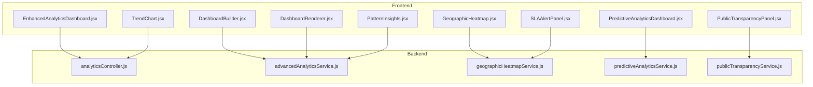

**Diagram sources**
- [EnhancedAnalyticsDashboard.jsx:1-598](file://Frontend/src/components/analytics/EnhancedAnalyticsDashboard.jsx#L1-L598)
- [DashboardBuilder.jsx:1-379](file://Frontend/src/components/analytics-advanced/DashboardBuilder.jsx#L1-L379)
- [DashboardRenderer.jsx:1-388](file://Frontend/src/components/analytics-advanced/DashboardRenderer.jsx#L1-L388)
- [GeographicHeatmap.jsx:1-101](file://Frontend/src/components/analytics/GeographicHeatmap.jsx#L1-L101)
- [PredictiveAnalyticsDashboard.jsx:1-514](file://Frontend/src/components/analytics/PredictiveAnalyticsDashboard.jsx#L1-L514)
- [PublicTransparencyPanel.jsx:1-232](file://Frontend/src/components/analytics/PublicTransparencyPanel.jsx#L1-L232)
- [SLAAlertPanel.jsx:1-103](file://Frontend/src/components/analytics/SLAAlertPanel.jsx#L1-L103)
- [TrendChart.jsx:1-82](file://Frontend/src/components/analytics/TrendChart.jsx#L1-L82)
- [PatternInsights.jsx:1-175](file://Frontend/src/components/analytics-advanced/PatternInsights.jsx#L1-L175)
- [analyticsController.js:1-203](file://backend/src/controllers/analyticsController.js#L1-L203)
- [advancedAnalyticsService.js:1-532](file://backend/src/services/advancedAnalyticsService.js#L1-L532)
- [geographicHeatmapService.js:1-91](file://backend/src/services/geographicHeatmapService.js#L1-L91)
- [predictiveAnalyticsService.js:1-519](file://backend/src/services/predictiveAnalyticsService.js#L1-L519)
- [publicTransparencyService.js:1-222](file://backend/src/services/publicTransparencyService.js#L1-L222)

**Section sources**
- [AnalyticsDashboard.jsx:1-24](file://Frontend/src/pages/admin/AnalyticsDashboard.jsx#L1-L24)
- [EnhancedAnalyticsDashboard.jsx:1-598](file://Frontend/src/components/analytics/EnhancedAnalyticsDashboard.jsx#L1-L598)

## Core Components
- Basic Analytics Dashboard: Real-time KPI cards, trend charts, category distribution, and export capabilities
- Advanced Analytics Dashboard Builder: Drag-and-drop widget creation, layout configuration, and persistence
- Dashboard Renderer: Dynamic rendering of custom dashboards with live data fetching
- Geographic Heatmap: Ward-level complaint density and status visualization
- Predictive Analytics Dashboard: Trend forecasting, SLA compliance tracking, and hotspot identification
- Public Transparency Panel: Citizen-accessible ward performance, officer scores, and resolution time
- SLA Alert Panel: Real-time SLA breach detection and compliance status
- Trend Chart: Historical trend visualization with configurable ranges
- Pattern Insights: Day-of-week peaks, resolution time patterns, and ward-category patterns

**Section sources**
- [EnhancedAnalyticsDashboard.jsx:1-598](file://Frontend/src/components/analytics/EnhancedAnalyticsDashboard.jsx#L1-L598)
- [DashboardBuilder.jsx:1-379](file://Frontend/src/components/analytics-advanced/DashboardBuilder.jsx#L1-L379)
- [DashboardRenderer.jsx:1-388](file://Frontend/src/components/analytics-advanced/DashboardRenderer.jsx#L1-L388)
- [GeographicHeatmap.jsx:1-101](file://Frontend/src/components/analytics/GeographicHeatmap.jsx#L1-L101)
- [PredictiveAnalyticsDashboard.jsx:1-514](file://Frontend/src/components/analytics/PredictiveAnalyticsDashboard.jsx#L1-L514)
- [PublicTransparencyPanel.jsx:1-232](file://Frontend/src/components/analytics/PublicTransparencyPanel.jsx#L1-L232)
- [SLAAlertPanel.jsx:1-103](file://Frontend/src/components/analytics/SLAAlertPanel.jsx#L1-L103)
- [TrendChart.jsx:1-82](file://Frontend/src/components/analytics/TrendChart.jsx#L1-L82)
- [PatternInsights.jsx:1-175](file://Frontend/src/components/analytics-advanced/PatternInsights.jsx#L1-L175)

## Architecture Overview
The system follows a layered architecture:
- Presentation Layer: React components render dashboards and charts
- Business Logic Layer: Services encapsulate analytics computations
- Data Access Layer: Controllers orchestrate service calls and return structured responses
- Data Storage: MongoDB collections backing complaints, users, and audit logs

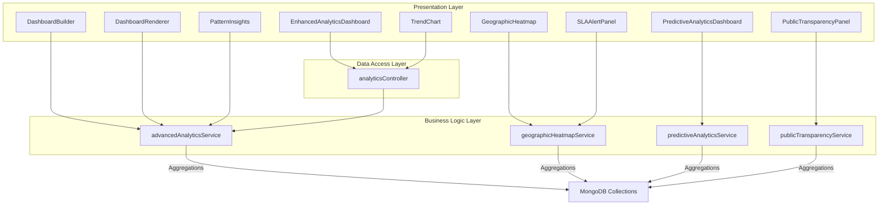

**Diagram sources**
- [EnhancedAnalyticsDashboard.jsx:1-598](file://Frontend/src/components/analytics/EnhancedAnalyticsDashboard.jsx#L1-L598)
- [DashboardBuilder.jsx:1-379](file://Frontend/src/components/analytics-advanced/DashboardBuilder.jsx#L1-L379)
- [DashboardRenderer.jsx:1-388](file://Frontend/src/components/analytics-advanced/DashboardRenderer.jsx#L1-L388)
- [GeographicHeatmap.jsx:1-101](file://Frontend/src/components/analytics/GeographicHeatmap.jsx#L1-L101)
- [PredictiveAnalyticsDashboard.jsx:1-514](file://Frontend/src/components/analytics/PredictiveAnalyticsDashboard.jsx#L1-L514)
- [PublicTransparencyPanel.jsx:1-232](file://Frontend/src/components/analytics/PublicTransparencyPanel.jsx#L1-L232)
- [SLAAlertPanel.jsx:1-103](file://Frontend/src/components/analytics/SLAAlertPanel.jsx#L1-L103)
- [TrendChart.jsx:1-82](file://Frontend/src/components/analytics/TrendChart.jsx#L1-L82)
- [PatternInsights.jsx:1-175](file://Frontend/src/components/analytics-advanced/PatternInsights.jsx#L1-L175)
- [advancedAnalyticsService.js:1-532](file://backend/src/services/advancedAnalyticsService.js#L1-L532)
- [geographicHeatmapService.js:1-91](file://backend/src/services/geographicHeatmapService.js#L1-L91)
- [predictiveAnalyticsService.js:1-519](file://backend/src/services/predictiveAnalyticsService.js#L1-L519)
- [publicTransparencyService.js:1-222](file://backend/src/services/publicTransparencyService.js#L1-L222)
- [analyticsController.js:1-203](file://backend/src/controllers/analyticsController.js#L1-L203)

## Detailed Component Analysis

### Basic Analytics Dashboard
The basic dashboard aggregates real-time statistics and presents them via KPI cards and charts. It supports filtering by timeframe, ward, and category, and provides export to PDF, Excel, and CSV.

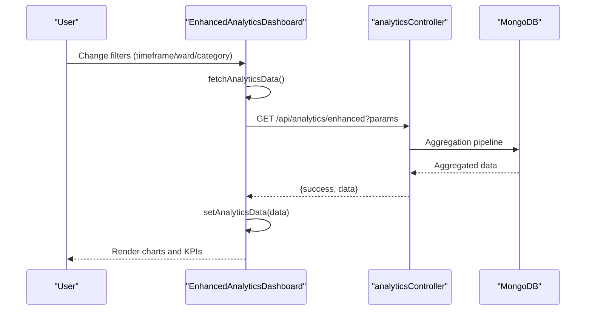

**Diagram sources**
- [EnhancedAnalyticsDashboard.jsx:57-85](file://Frontend/src/components/analytics/EnhancedAnalyticsDashboard.jsx#L57-L85)
- [analyticsController.js:8-53](file://backend/src/controllers/analyticsController.js#L8-L53)

Key features:
- KPI cards for total complaints, resolution rate, average resolution time, and active users
- Charts: monthly trends (area), category distribution (pie), ward performance (bar), category resolution rates (bar), average resolution time by category (line), historical trends (dual-axis line)
- Export: PDF (multi-page), Excel (summary and multiple sheets), CSV

**Section sources**
- [EnhancedAnalyticsDashboard.jsx:1-598](file://Frontend/src/components/analytics/EnhancedAnalyticsDashboard.jsx#L1-L598)
- [analyticsController.js:1-203](file://backend/src/controllers/analyticsController.js#L1-L203)

### Advanced Analytics Dashboard Builder
The builder enables administrators to create custom dashboards with drag-and-drop widgets, configure layouts, and manage tags and visibility.

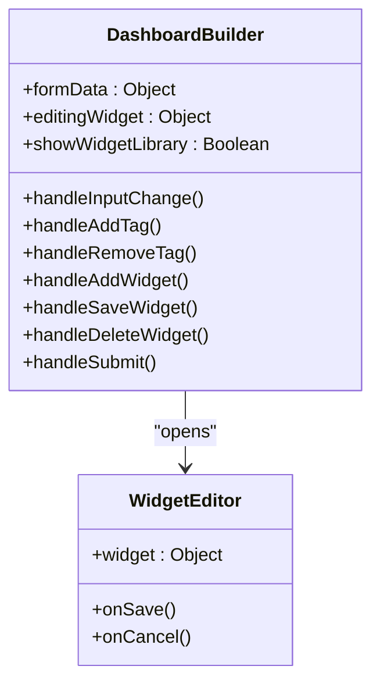

**Diagram sources**
- [DashboardBuilder.jsx:46-139](file://Frontend/src/components/analytics-advanced/DashboardBuilder.jsx#L46-L139)
- [DashboardRenderer.jsx:1-388](file://Frontend/src/components/analytics-advanced/DashboardRenderer.jsx#L1-L388)

Key features:
- Widget library: KPI card, line chart, bar chart, pie chart, area chart, gauge, heatmap, data table
- Layout options: grid, freeform, tabbed
- Dashboard metadata: name, description, category, public flag, tags
- Widget management: add, edit, delete, drag-and-drop positioning

**Section sources**
- [DashboardBuilder.jsx:1-379](file://Frontend/src/components/analytics-advanced/DashboardBuilder.jsx#L1-L379)
- [DashboardRenderer.jsx:1-388](file://Frontend/src/components/analytics-advanced/DashboardRenderer.jsx#L1-L388)

### Dashboard Renderer
The renderer dynamically loads widget data, renders appropriate chart types, and supports refresh and edit actions.

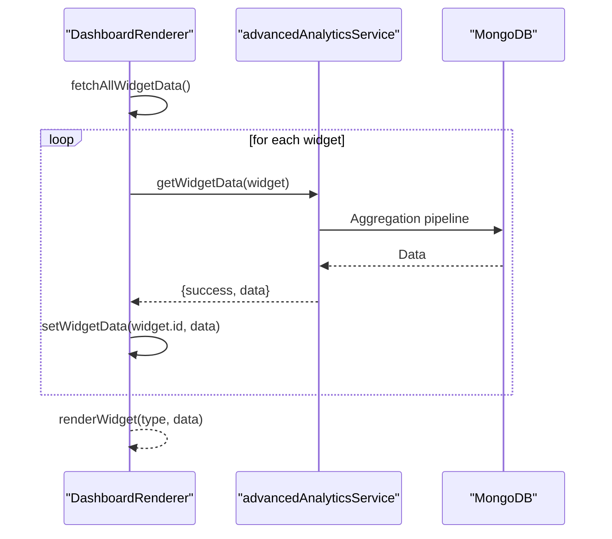

**Diagram sources**
- [DashboardRenderer.jsx:34-70](file://Frontend/src/components/analytics-advanced/DashboardRenderer.jsx#L34-L70)
- [advancedAnalyticsService.js:464-523](file://backend/src/services/advancedAnalyticsService.js#L464-L523)

Supported widget types:
- KPI card: single metric with trend
- Line chart: time-series metrics
- Bar chart: categorical comparisons
- Pie chart: distribution
- Area chart: cumulative trends
- Gauge: progress meter
- Table: tabular data

**Section sources**
- [DashboardRenderer.jsx:1-388](file://Frontend/src/components/analytics-advanced/DashboardRenderer.jsx#L1-L388)
- [advancedAnalyticsService.js:464-523](file://backend/src/services/advancedAnalyticsService.js#L464-L523)

### Geographic Heatmap
Visualizes ward-level complaint density and status using color-coded indicators.

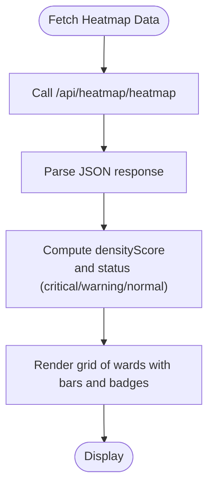

**Diagram sources**
- [GeographicHeatmap.jsx:20-33](file://Frontend/src/components/analytics/GeographicHeatmap.jsx#L20-L33)
- [geographicHeatmapService.js:8-63](file://backend/src/services/geographicHeatmapService.js#L8-L63)

**Section sources**
- [GeographicHeatmap.jsx:1-101](file://Frontend/src/components/analytics/GeographicHeatmap.jsx#L1-L101)
- [geographicHeatmapService.js:1-91](file://backend/src/services/geographicHeatmapService.js#L1-L91)

### Predictive Analytics Dashboard
Provides trend forecasting, SLA compliance tracking, and hotspot identification with AI-driven insights.

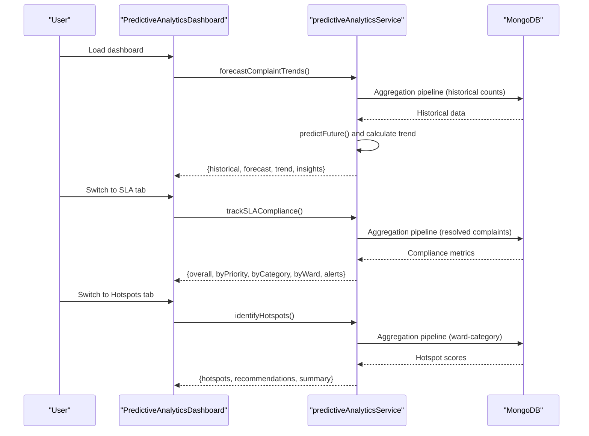

**Diagram sources**
- [PredictiveAnalyticsDashboard.jsx:63-87](file://Frontend/src/components/analytics/PredictiveAnalyticsDashboard.jsx#L63-L87)
- [predictiveAnalyticsService.js:66-167](file://backend/src/services/predictiveAnalyticsService.js#L66-L167)
- [predictiveAnalyticsService.js:240-381](file://backend/src/services/predictiveAnalyticsService.js#L240-L381)
- [predictiveAnalyticsService.js:386-512](file://backend/src/services/predictiveAnalyticsService.js#L386-L512)

**Section sources**
- [PredictiveAnalyticsDashboard.jsx:1-514](file://Frontend/src/components/analytics/PredictiveAnalyticsDashboard.jsx#L1-L514)
- [predictiveAnalyticsService.js:1-519](file://backend/src/services/predictiveAnalyticsService.js#L1-L519)

### Public Transparency Panel
Citizen-facing dashboard showing ward performance, officer scores, and resolution time analytics.

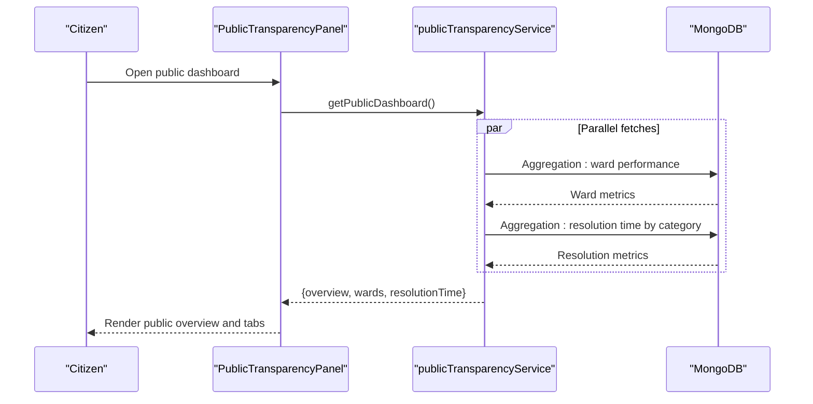

**Diagram sources**
- [PublicTransparencyPanel.jsx:23-51](file://Frontend/src/components/analytics/PublicTransparencyPanel.jsx#L23-L51)
- [publicTransparencyService.js:180-215](file://backend/src/services/publicTransparencyService.js#L180-L215)

**Section sources**
- [PublicTransparencyPanel.jsx:1-232](file://Frontend/src/components/analytics/PublicTransparencyPanel.jsx#L1-L232)
- [publicTransparencyService.js:1-222](file://backend/src/services/publicTransparencyService.js#L1-L222)

### SLA Alert Panel
Monitors SLA compliance and displays real-time alerts.

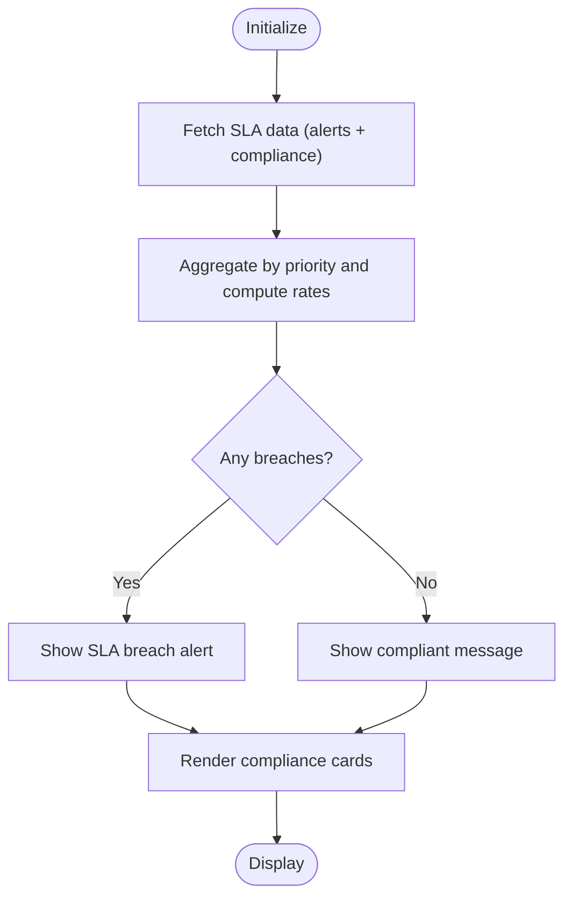

**Diagram sources**
- [SLAAlertPanel.jsx:18-38](file://Frontend/src/components/analytics/SLAAlertPanel.jsx#L18-L38)
- [geographicHeatmapService.js:8-63](file://backend/src/services/geographicHeatmapService.js#L8-L63)

**Section sources**
- [SLAAlertPanel.jsx:1-103](file://Frontend/src/components/analytics/SLAAlertPanel.jsx#L1-L103)
- [geographicHeatmapService.js:1-91](file://backend/src/services/geographicHeatmapService.js#L1-L91)

### Trend Chart
Displays historical trends with selectable ranges (daily, weekly, monthly).

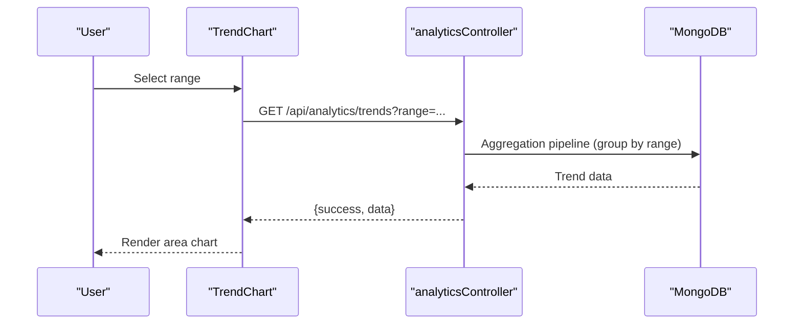

**Diagram sources**
- [TrendChart.jsx:12-22](file://Frontend/src/components/analytics/TrendChart.jsx#L12-L22)
- [analyticsController.js:8-53](file://backend/src/controllers/analyticsController.js#L8-L53)

**Section sources**
- [TrendChart.jsx:1-82](file://Frontend/src/components/analytics/TrendChart.jsx#L1-L82)
- [analyticsController.js:1-203](file://backend/src/controllers/analyticsController.js#L1-L203)

### Pattern Insights
Identifies peak days, resolution time patterns, and ward-category patterns.

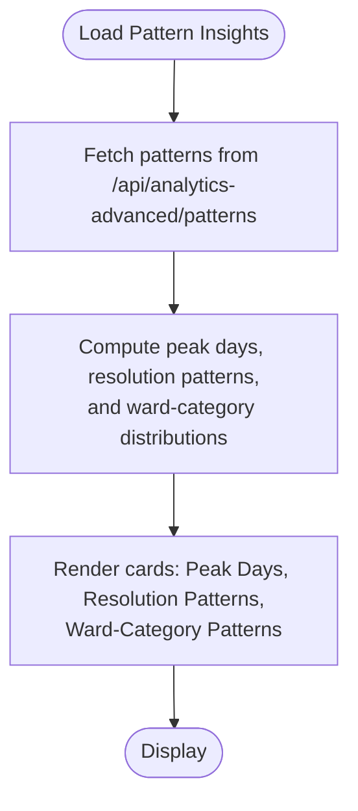

**Diagram sources**
- [PatternInsights.jsx:16-39](file://Frontend/src/components/analytics-advanced/PatternInsights.jsx#L16-L39)
- [advancedAnalyticsService.js:1-532](file://backend/src/services/advancedAnalyticsService.js#L1-L532)

**Section sources**
- [PatternInsights.jsx:1-175](file://Frontend/src/components/analytics-advanced/PatternInsights.jsx#L1-L175)
- [advancedAnalyticsService.js:1-532](file://backend/src/services/advancedAnalyticsService.js#L1-L532)

## Dependency Analysis
The frontend components depend on:
- Recharts for data visualization
- Lucide icons for UI elements
- Export libraries for PDF/Excel/CSV generation
- Local storage for authentication tokens

The backend services depend on:
- MongoDB aggregation pipelines for analytics computations
- Express controllers for request routing and response formatting

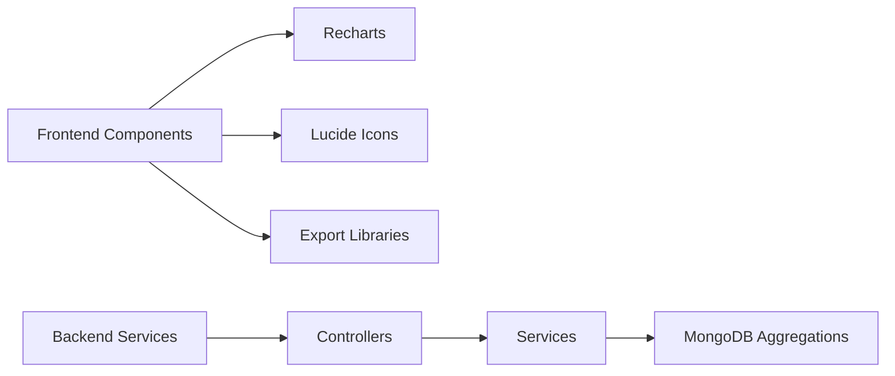

**Diagram sources**
- [EnhancedAnalyticsDashboard.jsx:23-42](file://Frontend/src/components/analytics/EnhancedAnalyticsDashboard.jsx#L23-L42)
- [DashboardBuilder.jsx:3-27](file://Frontend/src/components/analytics-advanced/DashboardBuilder.jsx#L3-L27)
- [DashboardRenderer.jsx:8-24](file://Frontend/src/components/analytics-advanced/DashboardRenderer.jsx#L8-L24)
- [analyticsController.js:1-203](file://backend/src/controllers/analyticsController.js#L1-L203)
- [advancedAnalyticsService.js:1-532](file://backend/src/services/advancedAnalyticsService.js#L1-L532)

**Section sources**
- [EnhancedAnalyticsDashboard.jsx:1-598](file://Frontend/src/components/analytics/EnhancedAnalyticsDashboard.jsx#L1-L598)
- [advancedAnalyticsService.js:1-532](file://backend/src/services/advancedAnalyticsService.js#L1-L532)

## Performance Considerations
- Use MongoDB aggregation pipelines to compute analytics server-side, reducing payload sizes
- Implement caching for frequently accessed dashboards and static reports
- Optimize chart rendering by limiting data points and using responsive containers
- Batch widget data requests to minimize network overhead
- Apply pagination for large datasets in tables and lists
- Use lazy loading for heavy visualizations and off-main-thread computations for forecasts

## Troubleshooting Guide
Common issues and resolutions:
- Authentication failures: Ensure the auth token is present in local storage and included in Authorization headers
- Network errors: Verify backend endpoints are reachable and CORS is configured
- Empty charts: Confirm filter parameters (timeframe, ward, category) produce non-empty datasets
- Export failures: Check browser permissions for downloads and available memory for large exports
- Widget rendering errors: Validate widget configurations and supported metric types

**Section sources**
- [EnhancedAnalyticsDashboard.jsx:75-84](file://Frontend/src/components/analytics/EnhancedAnalyticsDashboard.jsx#L75-L84)
- [DashboardRenderer.jsx:62-70](file://Frontend/src/components/analytics-advanced/DashboardRenderer.jsx#L62-L70)
- [SLAAlertPanel.jsx:33-38](file://Frontend/src/components/analytics/SLAAlertPanel.jsx#L33-L38)

## Conclusion
The Advanced Analytics & Dashboard System delivers a robust, extensible platform for municipal analytics. It combines real-time dashboards, predictive insights, geographic visualization, and citizen transparency into a cohesive solution. The modular frontend components and service-oriented backend enable easy customization and scaling.