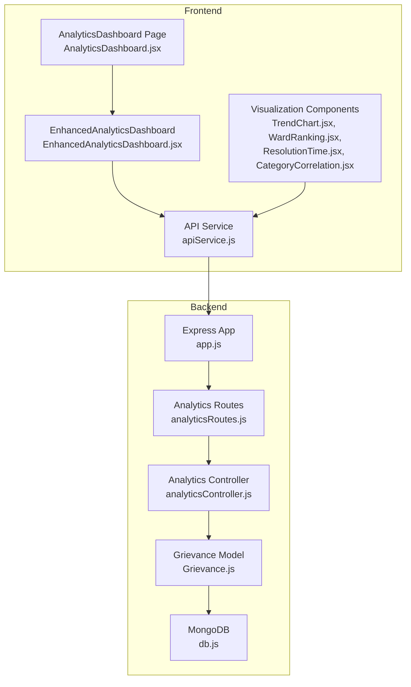
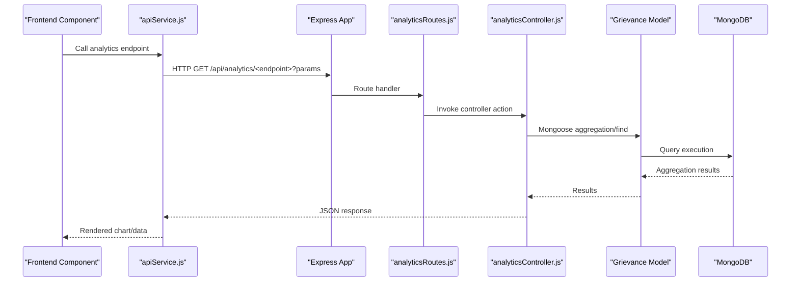
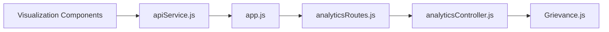

# Basic Analytics Dashboard

<cite>
**Referenced Files in This Document**
- [analyticsController.js](file://backend/src/controllers/analyticsController.js)
- [analyticsRoutes.js](file://backend/src/routes/analyticsRoutes.js)
- [enhancedAnalyticsController.js](file://backend/src/controllers/enhancedAnalyticsController.js)
- [enhancedAnalyticsRoutes.js](file://backend/src/routes/enhancedAnalyticsRoutes.js)
- [advancedAnalyticsService.js](file://backend/src/services/advancedAnalyticsService.js)
- [db.js](file://backend/src/config/db.js)
- [app.js](file://backend/src/app.js)
- [Grievance.js](file://backend/src/models/Grievance.js)
- [apiService.js](file://Frontend/src/services/apiService.js)
- [TrendChart.jsx](file://Frontend/src/components/analytics/TrendChart.jsx)
- [WardRanking.jsx](file://Frontend/src/components/analytics/WardRanking.jsx)
- [ResolutionTime.jsx](file://Frontend/src/components/analytics/ResolutionTime.jsx)
- [CategoryCorrelation.jsx](file://Frontend/src/components/analytics/CategoryCorrelation.jsx)
- [EnhancedAnalyticsDashboard.jsx](file://Frontend/src/components/analytics/EnhancedAnalyticsDashboard.jsx)
- [AnalyticsDashboard.jsx](file://Frontend/src/pages/admin/AnalyticsDashboard.jsx)
</cite>

## Table of Contents
1. [Introduction](#introduction)
2. [Project Structure](#project-structure)
3. [Core Components](#core-components)
4. [Architecture Overview](#architecture-overview)
5. [Detailed Component Analysis](#detailed-component-analysis)
6. [Dependency Analysis](#dependency-analysis)
7. [Performance Considerations](#performance-considerations)
8. [Troubleshooting Guide](#troubleshooting-guide)
9. [Conclusion](#conclusion)

## Introduction
This document describes the basic analytics dashboard system for real-time municipal complaint analytics. It covers the MongoDB aggregation pipeline implementation for data processing, frontend visualization components, and the API endpoints used to retrieve analytics data. The system provides:
- Real-time complaint trends over time
- Ward performance rankings
- Resolution time analytics by category
- Category correlation analysis across wards
- Statistical calculations for performance metrics
- Visualization components for trend representation

## Project Structure
The analytics dashboard spans backend and frontend layers:
- Backend: Express routes and controllers expose analytics endpoints backed by MongoDB aggregation pipelines
- Frontend: React components consume the backend APIs and render charts and tables using Recharts and custom UI components

**Diagram sources**
- [app.js:39-65](file://backend/src/app.js#L39-L65)
- [analyticsRoutes.js:10-21](file://backend/src/routes/analyticsRoutes.js#L10-L21)
- [analyticsController.js:8-203](file://backend/src/controllers/analyticsController.js#L8-L203)
- [Grievance.js:3-115](file://backend/src/models/Grievance.js#L3-L115)
- [db.js:3-15](file://backend/src/config/db.js#L3-L15)
- [AnalyticsDashboard.jsx:5-22](file://Frontend/src/pages/admin/AnalyticsDashboard.jsx#L5-L22)
- [EnhancedAnalyticsDashboard.jsx:46-598](file://Frontend/src/components/analytics/EnhancedAnalyticsDashboard.jsx#L46-L598)
- [apiService.js:463-521](file://Frontend/src/services/apiService.js#L463-L521)
- [TrendChart.jsx:7-82](file://Frontend/src/components/analytics/TrendChart.jsx#L7-L82)
- [WardRanking.jsx:7-75](file://Frontend/src/components/analytics/WardRanking.jsx#L7-L75)
- [ResolutionTime.jsx:6-63](file://Frontend/src/components/analytics/ResolutionTime.jsx#L6-L63)
- [CategoryCorrelation.jsx:6-84](file://Frontend/src/components/analytics/CategoryCorrelation.jsx#L6-L84)

**Section sources**
- [app.js:39-65](file://backend/src/app.js#L39-L65)
- [analyticsRoutes.js:10-21](file://backend/src/routes/analyticsRoutes.js#L10-L21)
- [AnalyticsDashboard.jsx:5-22](file://Frontend/src/pages/admin/AnalyticsDashboard.jsx#L5-L22)

## Core Components
- Backend analytics endpoints:
  - Trends over time: GET /api/analytics/trends
  - Ward performance ranking: GET /api/analytics/ward-performance
  - Resolution time analytics: GET /api/analytics/resolution-time
  - Category correlation: GET /api/analytics/category-correlation
- Frontend visualization components:
  - TrendChart: renders historical trends area chart
  - WardRanking: displays ward performance cards
  - ResolutionTime: shows category average resolution time bars
  - CategoryCorrelation: stacks category counts per ward
  - EnhancedAnalyticsDashboard: comprehensive dashboard with filters and exports

**Section sources**
- [analyticsController.js:8-203](file://backend/src/controllers/analyticsController.js#L8-L203)
- [TrendChart.jsx:7-82](file://Frontend/src/components/analytics/TrendChart.jsx#L7-L82)
- [WardRanking.jsx:7-75](file://Frontend/src/components/analytics/WardRanking.jsx#L7-L75)
- [ResolutionTime.jsx:6-63](file://Frontend/src/components/analytics/ResolutionTime.jsx#L6-L63)
- [CategoryCorrelation.jsx:6-84](file://Frontend/src/components/analytics/CategoryCorrelation.jsx#L6-L84)
- [EnhancedAnalyticsDashboard.jsx:46-598](file://Frontend/src/components/analytics/EnhancedAnalyticsDashboard.jsx#L46-L598)

## Architecture Overview
The analytics system follows a layered architecture:
- API Layer: Routes define endpoint contracts and apply authentication/authorization
- Controller Layer: Implements business logic and delegates to services or directly queries models
- Data Access Layer: Mongoose models and MongoDB aggregation pipelines
- Presentation Layer: React components and Recharts visualizations

**Diagram sources**
- [apiService.js:463-521](file://Frontend/src/services/apiService.js#L463-L521)
- [app.js:39-65](file://backend/src/app.js#L39-L65)
- [analyticsRoutes.js:10-21](file://backend/src/routes/analyticsRoutes.js#L10-L21)
- [analyticsController.js:8-203](file://backend/src/controllers/analyticsController.js#L8-L203)
- [Grievance.js:3-115](file://backend/src/models/Grievance.js#L3-L115)

## Detailed Component Analysis

### API Endpoints and Controllers
- GET /api/analytics/trends
  - Purpose: Returns complaint volume and resolution counts over time with configurable range (daily, weekly, monthly)
  - Query params: range (daily|weekly|monthly), startDate, endDate
  - Response: Array of grouped records with keys: _id (formatted timestamp), total, resolved, pending
  - Implementation: Uses aggregation with date grouping and conditional sums
- GET /api/analytics/ward-performance
  - Purpose: Ranks wards by resolution rate and shows average resolution time
  - Response: Array of objects with ward, totalComplaints, resolvedComplaints, pendingComplaints, avgResolutionTime, resolutionRate
  - Implementation: Groups by ward, computes counts and averages, projects computed metrics, sorts by resolution rate descending
- GET /api/analytics/resolution-time
  - Purpose: Shows average, minimum, and maximum resolution times by category for resolved complaints
  - Response: Array of objects with category, avgHours, minHours, maxHours, count
  - Implementation: Filters resolved complaints, groups by category, computes time deltas, projects hours
- GET /api/analytics/category-correlation
  - Purpose: Correlates categories with wards to show issue distribution
  - Response: Array of objects with ward, categories (array of category/count), total
  - Implementation: Double group by ward+category, aggregates counts, projects normalized structure

**Section sources**
- [analyticsController.js:8-203](file://backend/src/controllers/analyticsController.js#L8-L203)

### MongoDB Aggregation Pipelines
- Trends over time:
  - Match stage: optional date range filter
  - Group stage: date truncation to selected granularity, conditional counting for resolved/pending
  - Sort stage: ascending order by grouped date
- Ward performance ranking:
  - Group stage: by ward, conditional sums for statuses, average of resolved durations
  - Project stage: derived metrics (resolutionRate, avgResolutionTime in hours)
  - Sort stage: by resolutionRate descending
- Resolution time analytics:
  - Match stage: status equals resolved
  - Group stage: by category, compute avg/min/max of time delta
  - Project stage: convert milliseconds to hours
- Category correlation:
  - Group stage: by ward+category, sum counts
  - Group stage: by ward, collect categories and totals
  - Project stage: normalize to array of categories with counts

**Section sources**
- [analyticsController.js:24-44](file://backend/src/controllers/analyticsController.js#L24-L44)
- [analyticsController.js:62-100](file://backend/src/controllers/analyticsController.js#L62-L100)
- [analyticsController.js:123-144](file://backend/src/controllers/analyticsController.js#L123-L144)
- [analyticsController.js:167-188](file://backend/src/controllers/analyticsController.js#L167-L188)

### Frontend Visualization Components
- TrendChart
  - Fetches trends via apiService.getGrievanceTrends(range)
  - Renders an area chart with total and resolved series
  - Supports daily/weekly/monthly range selection
- WardRanking
  - Fetches ward performance via apiService.getWardPerformance
  - Displays ranked wards with resolution rate, counts, and average time
- ResolutionTime
  - Fetches resolution analytics via apiService.getResolutionTimeAnalytics
  - Renders a vertical bar chart of average hours per category
- CategoryCorrelation
  - Fetches correlation data via apiService.getCategoryCorrelation
  - Transforms data for a stacked bar chart across categories and wards
- EnhancedAnalyticsDashboard
  - Central dashboard with filters (timeframe, ward, category)
  - Renders KPI cards, trend charts, category distribution, and export capabilities

**Section sources**
- [TrendChart.jsx:7-82](file://Frontend/src/components/analytics/TrendChart.jsx#L7-L82)
- [WardRanking.jsx:7-75](file://Frontend/src/components/analytics/WardRanking.jsx#L7-L75)
- [ResolutionTime.jsx:6-63](file://Frontend/src/components/analytics/ResolutionTime.jsx#L6-L63)
- [CategoryCorrelation.jsx:6-84](file://Frontend/src/components/analytics/CategoryCorrelation.jsx#L6-L84)
- [EnhancedAnalyticsDashboard.jsx:46-598](file://Frontend/src/components/analytics/EnhancedAnalyticsDashboard.jsx#L46-L598)
- [apiService.js:463-521](file://Frontend/src/services/apiService.js#L463-L521)

### Statistical Calculations and Ranking Algorithms
- Resolution rate: (resolved / total) * 100, rounded to nearest integer
- Average resolution time: mean of resolved complaint durations (hours)
- Ward ranking: computed per ward, sorted descending by resolution rate
- Category analysis: percentage calculated as (category_count / total) * 100
- Historical trends: simplified comparative periods for demonstration

**Section sources**
- [enhancedAnalyticsController.js:60-166](file://backend/src/controllers/enhancedAnalyticsController.js#L60-L166)
- [analyticsController.js:91-96](file://backend/src/controllers/analyticsController.js#L91-L96)

### API Endpoints for Data Retrieval
- GET /api/analytics/trends
  - Query: range, startDate, endDate
  - Response: success flag, data array
- GET /api/analytics/ward-performance
  - Response: success flag, data array
- GET /api/analytics/resolution-time
  - Response: success flag, data array
- GET /api/analytics/category-correlation
  - Response: success flag, data array

**Section sources**
- [analyticsRoutes.js:16-19](file://backend/src/routes/analyticsRoutes.js#L16-L19)
- [analyticsController.js:8-203](file://backend/src/controllers/analyticsController.js#L8-L203)

## Dependency Analysis
- Route registration mounts analytics endpoints under /api/analytics
- Controllers depend on the Grievance model for data access
- Frontend components depend on apiService for HTTP communication
- Enhanced dashboard integrates multiple backend endpoints for comprehensive views

**Diagram sources**
- [analyticsRoutes.js:10-21](file://backend/src/routes/analyticsRoutes.js#L10-L21)
- [analyticsController.js:8-203](file://backend/src/controllers/analyticsController.js#L8-L203)
- [Grievance.js:3-115](file://backend/src/models/Grievance.js#L3-L115)
- [apiService.js:463-521](file://Frontend/src/services/apiService.js#L463-L521)
- [app.js:39-65](file://backend/src/app.js#L39-L65)

**Section sources**
- [app.js:39-65](file://backend/src/app.js#L39-L65)
- [analyticsRoutes.js:10-21](file://backend/src/routes/analyticsRoutes.js#L10-L21)

## Performance Considerations
- Aggregation efficiency: Use appropriate indexes on frequently queried fields (ward, category, status, createdAt)
- Query scoping: Apply date range filters early in aggregation pipelines
- Projection minimization: Limit returned fields to those needed for visualization
- Client-side caching: Debounce rapid filter changes in the dashboard to reduce network requests
- Parallel fetching: Where applicable, fetch related datasets concurrently to minimize latency

## Troubleshooting Guide
- Authentication failures: Ensure Authorization header is present for protected endpoints
- Empty or stale data: Verify date range filters and that complaints exist within the selected timeframe
- Aggregation errors: Confirm field names match the Grievance schema and that required timestamps are populated
- CORS issues: Confirm backend CORS configuration allows frontend origin

**Section sources**
- [apiService.js:8-14](file://Frontend/src/services/apiService.js#L8-L14)
- [analyticsController.js:46-52](file://backend/src/controllers/analyticsController.js#L46-L52)

## Conclusion
The basic analytics dashboard provides a robust foundation for monitoring municipal complaint trends, evaluating ward performance, analyzing resolution times, and understanding category distributions. The backend leverages MongoDB aggregation pipelines for efficient data processing, while the frontend delivers interactive visualizations through React and Recharts. Extending the system with advanced analytics services and enhanced indexing can further improve performance and insights.