# Custom Dashboard Builder

<cite>
**Referenced Files in This Document**
- [DashboardBuilder.jsx](file://Frontend/src/components/analytics-advanced/DashboardBuilder.jsx)
- [DashboardRenderer.jsx](file://Frontend/src/components/analytics-advanced/DashboardRenderer.jsx)
- [WidgetEditor.jsx](file://Frontend/src/components/analytics-advanced/WidgetEditor.jsx)
- [HistoricalComparison.jsx](file://Frontend/src/components/analytics-advanced/HistoricalComparison.jsx)
- [PatternInsights.jsx](file://Frontend/src/components/analytics-advanced/PatternInsights.jsx)
- [PerformanceBenchmark.jsx](file://Frontend/src/components/analytics-advanced/PerformanceBenchmark.jsx)
- [AdvancedKPICards.jsx](file://Frontend/src/components/analytics-advanced/AdvancedKPICards.jsx)
- [CustomDashboards.jsx](file://Frontend/src/pages/admin/CustomDashboards.jsx)
- [advancedAnalyticsService.js](file://backend/src/services/advancedAnalyticsService.js)
- [advancedAnalyticsController.js](file://backend/src/controllers/advancedAnalyticsController.js)
- [CustomDashboard.js](file://backend/src/models/CustomDashboard.js)
- [advancedAnalyticsRoutes.js](file://backend/src/routes/advancedAnalyticsRoutes.js)
</cite>

## Table of Contents
1. [Introduction](#introduction)
2. [Project Structure](#project-structure)
3. [Core Components](#core-components)
4. [Architecture Overview](#architecture-overview)
5. [Detailed Component Analysis](#detailed-component-analysis)
6. [Dependency Analysis](#dependency-analysis)
7. [Performance Considerations](#performance-considerations)
8. [Troubleshooting Guide](#troubleshooting-guide)
9. [Conclusion](#conclusion)

## Introduction
This document describes the custom dashboard builder and advanced analytics components. It covers the dashboard creation interface, widget management system, and custom visualization tools. It also explains the dashboard renderer architecture, widget editor functionality, and historical comparison features. Additionally, it details pattern insights generation, performance benchmarking, and widget customization options. The document outlines the drag-and-drop interface implementation, widget persistence mechanisms, and export functionality, along with advanced analytics features such as historical data comparison and pattern recognition algorithms.

## Project Structure
The custom dashboard builder and advanced analytics features are implemented across the frontend and backend:

- Frontend components:
  - DashboardBuilder: Creates and edits dashboards with configurable widgets.
  - DashboardRenderer: Renders dashboards with live data and interactive controls.
  - WidgetEditor: Configures individual widget data sources, metrics, filters, and layout.
  - Advanced analytics panels: HistoricalComparison, PatternInsights, PerformanceBenchmark, AdvancedKPICards.
  - CustomDashboards page: Lists, creates, edits, and deletes dashboards.

- Backend services and models:
  - advancedAnalyticsService: Implements KPI calculations, custom reports, comparative analytics, and widget data retrieval.
  - advancedAnalyticsController: Exposes REST endpoints for dashboards and widget data.
  - CustomDashboard model: Defines the schema for persisted dashboards and widgets.

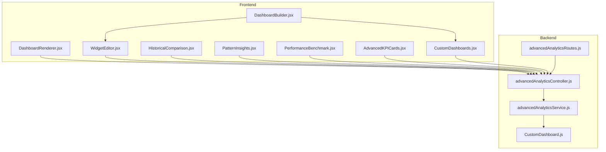

**Diagram sources**
- [DashboardBuilder.jsx:1-379](file://Frontend/src/components/analytics-advanced/DashboardBuilder.jsx#L1-L379)
- [DashboardRenderer.jsx:1-388](file://Frontend/src/components/analytics-advanced/DashboardRenderer.jsx#L1-L388)
- [WidgetEditor.jsx:1-332](file://Frontend/src/components/analytics-advanced/WidgetEditor.jsx#L1-L332)
- [HistoricalComparison.jsx:1-177](file://Frontend/src/components/analytics-advanced/HistoricalComparison.jsx#L1-L177)
- [PatternInsights.jsx:1-175](file://Frontend/src/components/analytics-advanced/PatternInsights.jsx#L1-L175)
- [PerformanceBenchmark.jsx:1-191](file://Frontend/src/components/analytics-advanced/PerformanceBenchmark.jsx#L1-L191)
- [AdvancedKPICards.jsx:1-158](file://Frontend/src/components/analytics-advanced/AdvancedKPICards.jsx#L1-L158)
- [CustomDashboards.jsx:1-333](file://Frontend/src/pages/admin/CustomDashboards.jsx#L1-L333)
- [advancedAnalyticsService.js:1-532](file://backend/src/services/advancedAnalyticsService.js#L1-L532)
- [advancedAnalyticsController.js:1-397](file://backend/src/controllers/advancedAnalyticsController.js#L1-L397)
- [CustomDashboard.js:1-160](file://backend/src/models/CustomDashboard.js#L1-L160)
- [advancedAnalyticsRoutes.js:1-34](file://backend/src/routes/advancedAnalyticsRoutes.js#L1-L34)

**Section sources**
- [DashboardBuilder.jsx:1-379](file://Frontend/src/components/analytics-advanced/DashboardBuilder.jsx#L1-L379)
- [DashboardRenderer.jsx:1-388](file://Frontend/src/components/analytics-advanced/DashboardRenderer.jsx#L1-L388)
- [WidgetEditor.jsx:1-332](file://Frontend/src/components/analytics-advanced/WidgetEditor.jsx#L1-L332)
- [HistoricalComparison.jsx:1-177](file://Frontend/src/components/analytics-advanced/HistoricalComparison.jsx#L1-L177)
- [PatternInsights.jsx:1-175](file://Frontend/src/components/analytics-advanced/PatternInsights.jsx#L1-L175)
- [PerformanceBenchmark.jsx:1-191](file://Frontend/src/components/analytics-advanced/PerformanceBenchmark.jsx#L1-L191)
- [AdvancedKPICards.jsx:1-158](file://Frontend/src/components/analytics-advanced/AdvancedKPICards.jsx#L1-L158)
- [CustomDashboards.jsx:1-333](file://Frontend/src/pages/admin/CustomDashboards.jsx#L1-L333)
- [advancedAnalyticsService.js:1-532](file://backend/src/services/advancedAnalyticsService.js#L1-L532)
- [advancedAnalyticsController.js:1-397](file://backend/src/controllers/advancedAnalyticsController.js#L1-L397)
- [CustomDashboard.js:1-160](file://backend/src/models/CustomDashboard.js#L1-L160)
- [advancedAnalyticsRoutes.js:1-34](file://backend/src/routes/advancedAnalyticsRoutes.js#L1-L34)

## Core Components
- DashboardBuilder: Provides a guided interface to configure dashboard metadata (name, description, layout, category, tags, public visibility) and manage widgets via a library of visualization types. It supports adding, editing, and removing widgets and persists the dashboard to the backend.
- DashboardRenderer: Renders the dashboard grid with responsive sizing, loads widget data in parallel, and displays KPI cards, charts, gauges, and tables. Includes refresh and edit controls.
- WidgetEditor: Allows configuring widget title, data source, metrics (with aggregation types), filters, and layout dimensions. Supports multi-metric configuration and layout adjustments.
- HistoricalComparison: Visualizes multi-month trends for total complaints, resolved, and pending counts with summary statistics.
- PatternInsights: Identifies peak days, resolution time patterns by category, and ward-specific category distributions.
- PerformanceBenchmark: Compares ward performance scores and resolution rates against city averages with ranking indicators.
- AdvancedKPICards: Displays advanced KPIs such as growth rate, resolution efficiency, average resolution time, and active complaints.
- CustomDashboards page: Manages lifecycle of dashboards (list, create, edit, delete) and toggles between builder and renderer views.

**Section sources**
- [DashboardBuilder.jsx:29-139](file://Frontend/src/components/analytics-advanced/DashboardBuilder.jsx#L29-L139)
- [DashboardRenderer.jsx:28-110](file://Frontend/src/components/analytics-advanced/DashboardRenderer.jsx#L28-L110)
- [WidgetEditor.jsx:27-92](file://Frontend/src/components/analytics-advanced/WidgetEditor.jsx#L27-L92)
- [HistoricalComparison.jsx:13-60](file://Frontend/src/components/analytics-advanced/HistoricalComparison.jsx#L13-L60)
- [PatternInsights.jsx:11-56](file://Frontend/src/components/analytics-advanced/PatternInsights.jsx#L11-L56)
- [PerformanceBenchmark.jsx:12-57](file://Frontend/src/components/analytics-advanced/PerformanceBenchmark.jsx#L12-L57)
- [AdvancedKPICards.jsx:12-59](file://Frontend/src/components/analytics-advanced/AdvancedKPICards.jsx#L12-L59)
- [CustomDashboards.jsx:11-124](file://Frontend/src/pages/admin/CustomDashboards.jsx#L11-L124)

## Architecture Overview
The system follows a layered architecture:
- Frontend presentation layer: React components handle UI, state, and user interactions.
- Backend API layer: Express routes and controllers expose endpoints for dashboards and widget data.
- Business logic layer: Services encapsulate analytics computations and data retrieval.
- Data persistence: Mongoose model stores dashboard configurations and widgets.

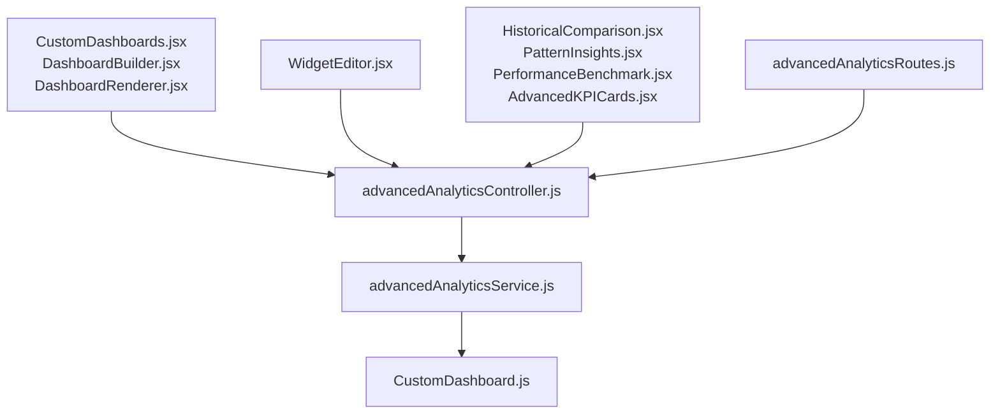

**Diagram sources**
- [CustomDashboards.jsx:1-333](file://Frontend/src/pages/admin/CustomDashboards.jsx#L1-L333)
- [DashboardBuilder.jsx:1-379](file://Frontend/src/components/analytics-advanced/DashboardBuilder.jsx#L1-L379)
- [DashboardRenderer.jsx:1-388](file://Frontend/src/components/analytics-advanced/DashboardRenderer.jsx#L1-L388)
- [WidgetEditor.jsx:1-332](file://Frontend/src/components/analytics-advanced/WidgetEditor.jsx#L1-L332)
- [HistoricalComparison.jsx:1-177](file://Frontend/src/components/analytics-advanced/HistoricalComparison.jsx#L1-L177)
- [PatternInsights.jsx:1-175](file://Frontend/src/components/analytics-advanced/PatternInsights.jsx#L1-L175)
- [PerformanceBenchmark.jsx:1-191](file://Frontend/src/components/analytics-advanced/PerformanceBenchmark.jsx#L1-L191)
- [AdvancedKPICards.jsx:1-158](file://Frontend/src/components/analytics-advanced/AdvancedKPICards.jsx#L1-L158)
- [advancedAnalyticsController.js:1-397](file://backend/src/controllers/advancedAnalyticsController.js#L1-L397)
- [advancedAnalyticsService.js:1-532](file://backend/src/services/advancedAnalyticsService.js#L1-L532)
- [CustomDashboard.js:1-160](file://backend/src/models/CustomDashboard.js#L1-L160)
- [advancedAnalyticsRoutes.js:1-34](file://backend/src/routes/advancedAnalyticsRoutes.js#L1-L34)

## Detailed Component Analysis

### DashboardBuilder: Creation and Widget Library
- Purpose: Create or edit dashboards with metadata and widget collections.
- Key features:
  - Dashboard metadata: name, description, layout style (grid/freeform/tabs), category, public flag, tags.
  - Widget library: Adds pre-defined widget types (KPI card, line/bar/pie/area charts, gauge, heatmap, table).
  - Widget lifecycle: Add, edit (via WidgetEditor), delete.
  - Validation: Ensures non-empty name and at least one widget before saving.
- Persistence: Calls backend to create/update dashboards.

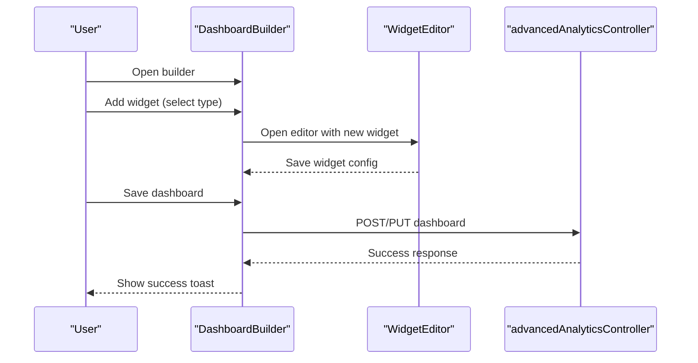

**Diagram sources**
- [DashboardBuilder.jsx:86-139](file://Frontend/src/components/analytics-advanced/DashboardBuilder.jsx#L86-L139)
- [WidgetEditor.jsx:27-92](file://Frontend/src/components/analytics-advanced/WidgetEditor.jsx#L27-L92)
- [advancedAnalyticsController.js:92-129](file://backend/src/controllers/advancedAnalyticsController.js#L92-L129)

**Section sources**
- [DashboardBuilder.jsx:29-139](file://Frontend/src/components/analytics-advanced/DashboardBuilder.jsx#L29-L139)
- [advancedAnalyticsController.js:92-129](file://backend/src/controllers/advancedAnalyticsController.js#L92-L129)

### DashboardRenderer: Rendering and Data Fetching
- Purpose: Render dashboards with responsive grid layout and fetch widget data.
- Key features:
  - Grid layout: Uses CSS grid with column/row spans derived from widget layout.
  - Parallel data loading: Fetches all widget data concurrently.
  - Widget rendering: Supports KPI cards, line/bar/pie/area charts, gauges, and tables.
  - Controls: Refresh, edit, and back navigation.
- Data flow: Posts widget configurations to backend endpoint to retrieve transformed data.

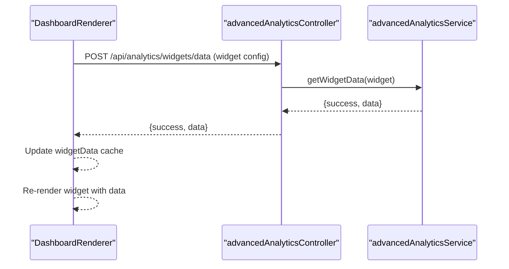

**Diagram sources**
- [DashboardRenderer.jsx:34-70](file://Frontend/src/components/analytics-advanced/DashboardRenderer.jsx#L34-L70)
- [advancedAnalyticsController.js:317-339](file://backend/src/controllers/advancedAnalyticsController.js#L317-L339)
- [advancedAnalyticsService.js:464-523](file://backend/src/services/advancedAnalyticsService.js#L464-L523)

**Section sources**
- [DashboardRenderer.jsx:28-110](file://Frontend/src/components/analytics-advanced/DashboardRenderer.jsx#L28-L110)
- [advancedAnalyticsController.js:317-339](file://backend/src/controllers/advancedAnalyticsController.js#L317-L339)
- [advancedAnalyticsService.js:464-523](file://backend/src/services/advancedAnalyticsService.js#L464-L523)

### WidgetEditor: Widget Configuration
- Purpose: Configure widget details including data source, metrics, filters, and layout.
- Key features:
  - Data sources: complaints, users, feedback, sentiment, SLA, predictive analytics.
  - Metrics: Field selection, aggregation types (count, sum, avg, min, max, distinct), optional labels.
  - Filters: Placeholder for future filter support; currently displays all data from the selected source.
  - Layout: Grid positions and sizes (x, y, width, height).
  - Validation: Requires title and at least one metric.
- Persistence: Returns edited widget to DashboardBuilder for saving.

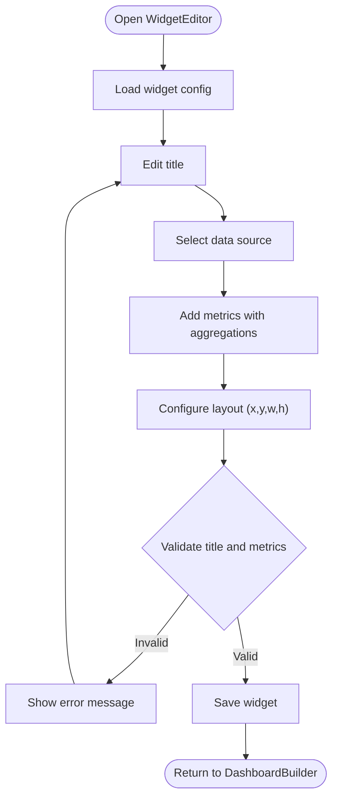

**Diagram sources**
- [WidgetEditor.jsx:27-92](file://Frontend/src/components/analytics-advanced/WidgetEditor.jsx#L27-L92)

**Section sources**
- [WidgetEditor.jsx:9-92](file://Frontend/src/components/analytics-advanced/WidgetEditor.jsx#L9-L92)

### HistoricalComparison: Multi-Month Trend Analysis
- Purpose: Compare total, resolved, and pending complaints over multiple months.
- Key features:
  - Period selector: 3, 6, or 12 months.
  - Line chart visualization with gradients and tooltips.
  - Summary statistics: average totals, resolved, and resolution rates.
- Data source: Backend endpoint returns aggregated monthly metrics.

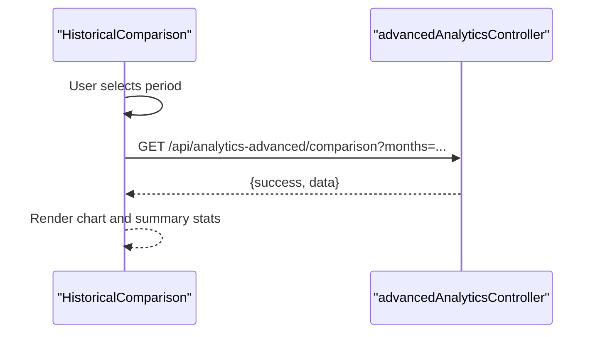

**Diagram sources**
- [HistoricalComparison.jsx:19-43](file://Frontend/src/components/analytics-advanced/HistoricalComparison.jsx#L19-L43)
- [advancedAnalyticsController.js:65-85](file://backend/src/controllers/advancedAnalyticsController.js#L65-L85)

**Section sources**
- [HistoricalComparison.jsx:13-60](file://Frontend/src/components/analytics-advanced/HistoricalComparison.jsx#L13-L60)

### PatternInsights: Pattern Recognition and Insights
- Purpose: Identify patterns such as peak complaint days, resolution time by category, and ward-specific category distributions.
- Key features:
  - Peak days: Top day-of-week patterns with trend indicators.
  - Resolution patterns: Average hours to resolve by category with color-coded thresholds.
  - Ward patterns: Category distribution per ward.
- Data source: Backend endpoint returns structured insights.

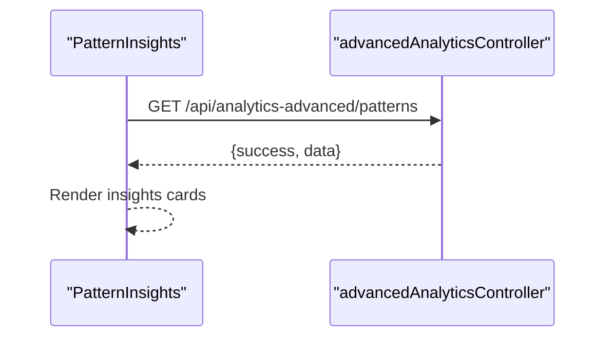

**Diagram sources**
- [PatternInsights.jsx:16-39](file://Frontend/src/components/analytics-advanced/PatternInsights.jsx#L16-L39)
- [advancedAnalyticsController.js:65-85](file://backend/src/controllers/advancedAnalyticsController.js#L65-L85)

**Section sources**
- [PatternInsights.jsx:11-56](file://Frontend/src/components/analytics-advanced/PatternInsights.jsx#L11-L56)

### PerformanceBenchmark: Ward Performance Comparison
- Purpose: Benchmark ward performance against city averages with rankings and metrics.
- Key features:
  - Bar chart of performance scores.
  - Detailed ward rankings with resolution rate and average resolution time.
  - City averages and comparisons.
- Data source: Backend endpoint returns ward metrics and city averages.

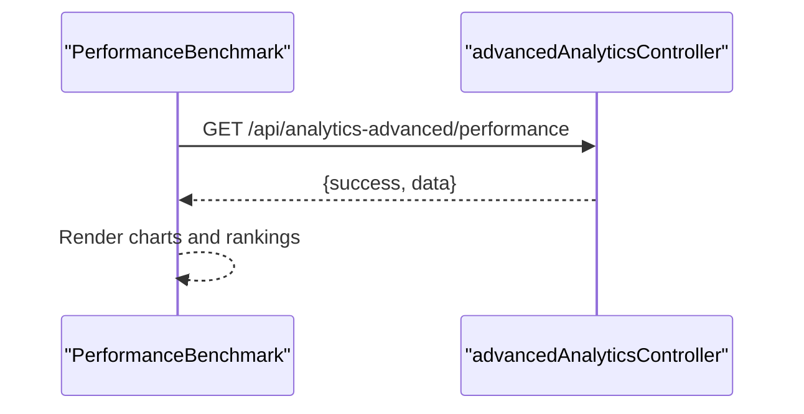

**Diagram sources**
- [PerformanceBenchmark.jsx:17-40](file://Frontend/src/components/analytics-advanced/PerformanceBenchmark.jsx#L17-L40)
- [advancedAnalyticsController.js:65-85](file://backend/src/controllers/advancedAnalyticsController.js#L65-L85)

**Section sources**
- [PerformanceBenchmark.jsx:12-57](file://Frontend/src/components/analytics-advanced/PerformanceBenchmark.jsx#L12-L57)

### AdvancedKPICards: Enhanced Metrics Display
- Purpose: Display advanced KPIs with trend indicators and contextual descriptions.
- Key features:
  - Complaint growth rate with trend.
  - Resolution efficiency index and change.
  - Average resolution time and improvement.
  - Active complaints with total context.
- Data source: Backend endpoint returns computed metrics.

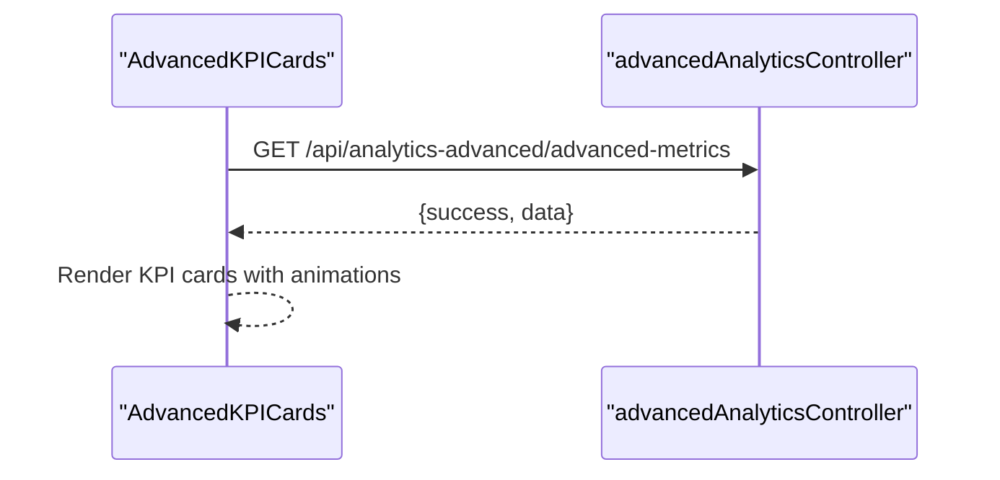

**Diagram sources**
- [AdvancedKPICards.jsx:17-40](file://Frontend/src/components/analytics-advanced/AdvancedKPICards.jsx#L17-L40)
- [advancedAnalyticsController.js:65-85](file://backend/src/controllers/advancedAnalyticsController.js#L65-L85)

**Section sources**
- [AdvancedKPICards.jsx:12-59](file://Frontend/src/components/analytics-advanced/AdvancedKPICards.jsx#L12-L59)

### CustomDashboards Page: Dashboard Lifecycle Management
- Purpose: Manage dashboards (list, create, edit, delete) and toggle between builder and renderer views.
- Key features:
  - Grid/list view modes.
  - Stats cards for dashboards, public dashboards, total views, and total widgets.
  - Actions: View, Edit, Delete dashboards.
  - Save handler for create/update flows.

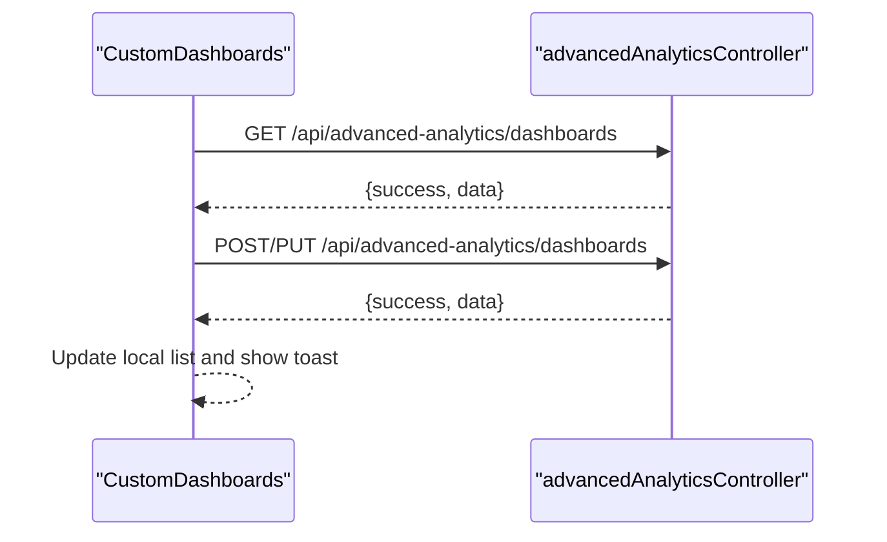

**Diagram sources**
- [CustomDashboards.jsx:19-124](file://Frontend/src/pages/admin/CustomDashboards.jsx#L19-L124)
- [advancedAnalyticsController.js:92-160](file://backend/src/controllers/advancedAnalyticsController.js#L92-L160)

**Section sources**
- [CustomDashboards.jsx:11-124](file://Frontend/src/pages/admin/CustomDashboards.jsx#L11-L124)

## Dependency Analysis
- Frontend-to-backend dependencies:
  - DashboardBuilder and WidgetEditor call backend endpoints for dashboard creation/update and widget data retrieval.
  - DashboardRenderer calls the widget data endpoint for each widget.
  - Advanced analytics components call dedicated endpoints for historical comparison, pattern insights, performance benchmarking, and advanced metrics.
- Backend dependencies:
  - advancedAnalyticsController orchestrates requests and delegates to advancedAnalyticsService.
  - advancedAnalyticsService performs computations and queries the CustomDashboard model.
  - CustomDashboard model defines the schema for persisted dashboards and widgets.

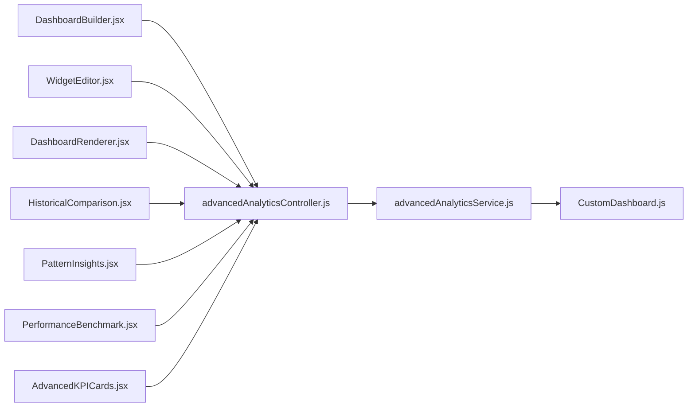

**Diagram sources**
- [DashboardBuilder.jsx:1-379](file://Frontend/src/components/analytics-advanced/DashboardBuilder.jsx#L1-L379)
- [WidgetEditor.jsx:1-332](file://Frontend/src/components/analytics-advanced/WidgetEditor.jsx#L1-L332)
- [DashboardRenderer.jsx:1-388](file://Frontend/src/components/analytics-advanced/DashboardRenderer.jsx#L1-L388)
- [HistoricalComparison.jsx:1-177](file://Frontend/src/components/analytics-advanced/HistoricalComparison.jsx#L1-L177)
- [PatternInsights.jsx:1-175](file://Frontend/src/components/analytics-advanced/PatternInsights.jsx#L1-L175)
- [PerformanceBenchmark.jsx:1-191](file://Frontend/src/components/analytics-advanced/PerformanceBenchmark.jsx#L1-L191)
- [AdvancedKPICards.jsx:1-158](file://Frontend/src/components/analytics-advanced/AdvancedKPICards.jsx#L1-L158)
- [advancedAnalyticsController.js:1-397](file://backend/src/controllers/advancedAnalyticsController.js#L1-L397)
- [advancedAnalyticsService.js:1-532](file://backend/src/services/advancedAnalyticsService.js#L1-L532)
- [CustomDashboard.js:1-160](file://backend/src/models/CustomDashboard.js#L1-L160)

**Section sources**
- [advancedAnalyticsController.js:1-397](file://backend/src/controllers/advancedAnalyticsController.js#L1-L397)
- [advancedAnalyticsService.js:1-532](file://backend/src/services/advancedAnalyticsService.js#L1-L532)
- [CustomDashboard.js:1-160](file://backend/src/models/CustomDashboard.js#L1-L160)

## Performance Considerations
- Parallel data fetching: DashboardRenderer fetches all widget data concurrently to minimize load time.
- Responsive charts: Recharts components adapt to container size for efficient rendering.
- Grid layout: 12-column grid system ensures predictable widget sizing and responsive behavior.
- Backend aggregation: Services compute metrics server-side to reduce frontend processing overhead.
- Caching: Widget data is cached per widget ID in the renderer to avoid redundant network calls during a session.

[No sources needed since this section provides general guidance]

## Troubleshooting Guide
- Dashboard save errors:
  - Ensure the dashboard has a non-empty name and at least one widget before saving.
  - Confirm the backend responds with success; otherwise, check network connectivity and authentication token.
- Widget data loading failures:
  - Verify the widget configuration (data source, metrics, filters) is valid.
  - Check backend logs for widget data endpoint errors.
- Authentication issues:
  - Ensure the Authorization header includes a valid token.
- Route deprecation:
  - Some legacy routes are redirected to new endpoints; use the documented advanced analytics routes.

**Section sources**
- [DashboardBuilder.jsx:128-139](file://Frontend/src/components/analytics-advanced/DashboardBuilder.jsx#L128-L139)
- [DashboardRenderer.jsx:45-70](file://Frontend/src/components/analytics-advanced/DashboardRenderer.jsx#L45-L70)
- [advancedAnalyticsController.js:92-129](file://backend/src/controllers/advancedAnalyticsController.js#L92-L129)

## Conclusion
The custom dashboard builder and advanced analytics suite provide a comprehensive solution for designing, rendering, and analyzing custom dashboards. The modular frontend components enable flexible widget creation and configuration, while the backend services deliver robust analytics computations and persistent storage. The system supports historical comparisons, pattern recognition, performance benchmarking, and advanced KPI visualization, all integrated with a responsive grid layout and efficient data fetching strategies.