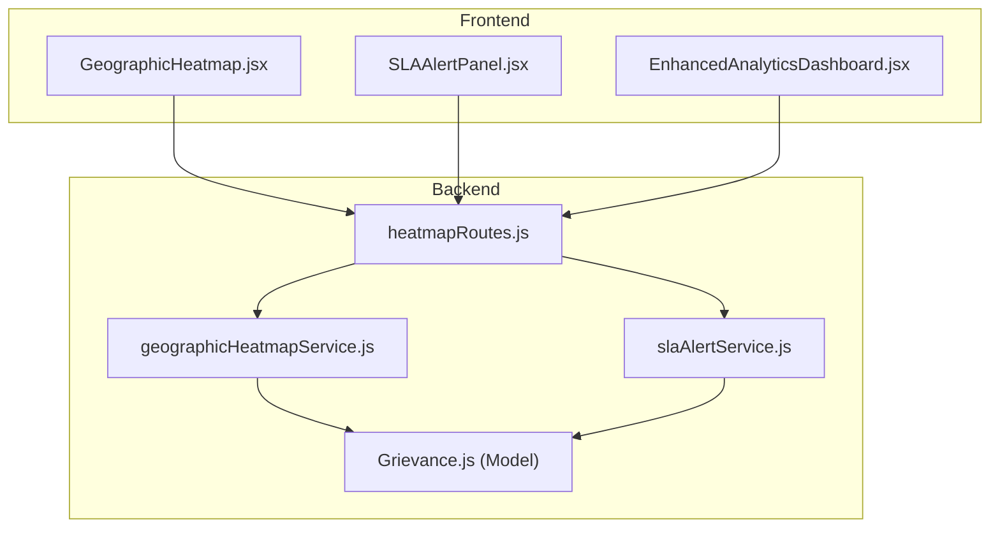
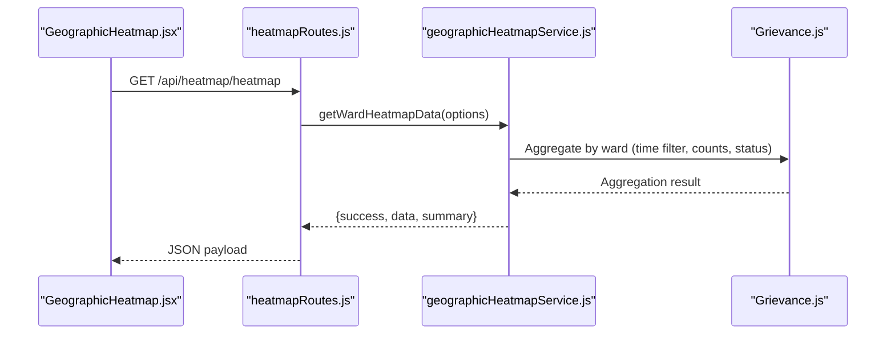
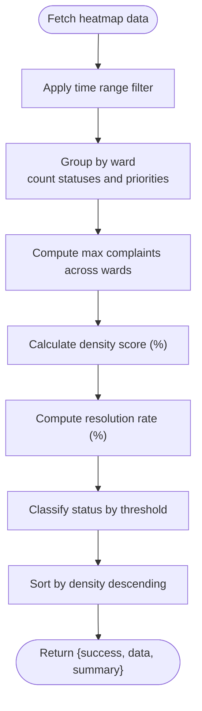
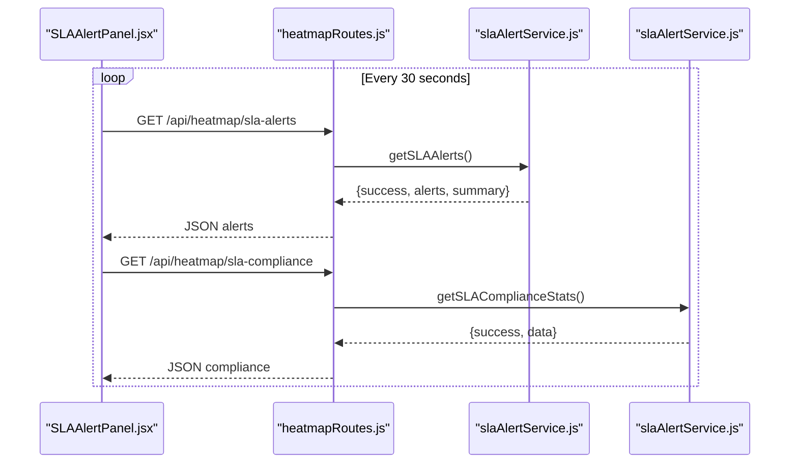
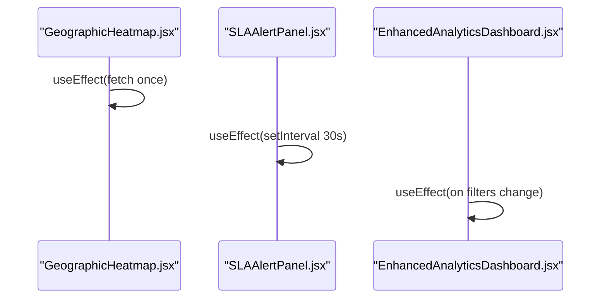
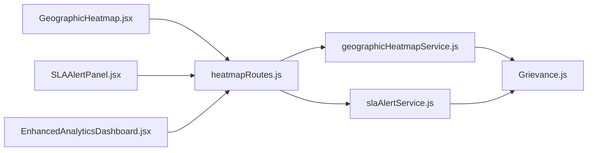

# Geographic Analytics & Heatmaps

<cite>
**Referenced Files in This Document**
- [GeographicHeatmap.jsx](file://Frontend/src/components/analytics/GeographicHeatmap.jsx)
- [SLAAlertPanel.jsx](file://Frontend/src/components/analytics/SLAAlertPanel.jsx)
- [geographicHeatmapService.js](file://backend/src/services/geographicHeatmapService.js)
- [slaAlertService.js](file://backend/src/services/slaAlertService.js)
- [heatmapRoutes.js](file://backend/src/routes/heatmapRoutes.js)
- [Grievance.js](file://backend/src/models/Grievance.js)
- [EnhancedAnalyticsDashboard.jsx](file://Frontend/src/components/analytics/EnhancedAnalyticsDashboard.jsx)
</cite>

## Table of Contents
1. [Introduction](#introduction)
2. [Project Structure](#project-structure)
3. [Core Components](#core-components)
4. [Architecture Overview](#architecture-overview)
5. [Detailed Component Analysis](#detailed-component-analysis)
6. [Dependency Analysis](#dependency-analysis)
7. [Performance Considerations](#performance-considerations)
8. [Troubleshooting Guide](#troubleshooting-guide)
9. [Conclusion](#conclusion)

## Introduction
This document explains the geographic analytics and heatmap system, focusing on:
- Ward-based complaint density visualization and intensity mapping
- SLA monitoring and alerting across priority tiers
- Frontend visualization components and real-time updates
- Backend aggregation services and route handlers
- Data model foundations and indexing for performance

The system enables administrators and ward officials to monitor hotspots, track resolution performance, and receive timely SLA breach alerts.

## Project Structure
The geographic analytics feature spans frontend components and backend services:
- Frontend: GeographicHeatmap and SLAAlertPanel components consume backend endpoints
- Backend: Services compute aggregated metrics; routes expose endpoints protected by authentication and role-based authorization
- Data model: Grievance schema defines complaint records with geographic and status metadata

**Diagram sources**
- [GeographicHeatmap.jsx](file://Frontend/src/components/analytics/GeographicHeatmap.jsx)
- [SLAAlertPanel.jsx](file://Frontend/src/components/analytics/SLAAlertPanel.jsx)
- [EnhancedAnalyticsDashboard.jsx](file://Frontend/src/components/analytics/EnhancedAnalyticsDashboard.jsx)
- [heatmapRoutes.js](file://backend/src/routes/heatmapRoutes.js)
- [geographicHeatmapService.js](file://backend/src/services/geographicHeatmapService.js)
- [slaAlertService.js](file://backend/src/services/slaAlertService.js)
- [Grievance.js](file://backend/src/models/Grievance.js)

**Section sources**
- [GeographicHeatmap.jsx](file://Frontend/src/components/analytics/GeographicHeatmap.jsx)
- [SLAAlertPanel.jsx](file://Frontend/src/components/analytics/SLAAlertPanel.jsx)
- [geographicHeatmapService.js](file://backend/src/services/geographicHeatmapService.js)
- [slaAlertService.js](file://backend/src/services/slaAlertService.js)
- [heatmapRoutes.js](file://backend/src/routes/heatmapRoutes.js)
- [Grievance.js](file://backend/src/models/Grievance.js)
- [EnhancedAnalyticsDashboard.jsx](file://Frontend/src/components/analytics/EnhancedAnalyticsDashboard.jsx)

## Core Components
- GeographicHeatmap (frontend): Fetches ward-level density metrics and renders a color-coded grid with density bars and status badges.
- SLAAlertPanel (frontend): Periodically polls SLA breach alerts and compliance statistics, displaying consolidated alerts and compliance rates.
- geographicHeatmapService (backend): Aggregates complaints by ward, computes density scores, resolution rates, and status categories.
- slaAlertService (backend): Detects SLA breaches per priority tier and calculates compliance statistics.
- heatmapRoutes (backend): Exposes endpoints for heatmap data, hotspots, SLA alerts, and SLA compliance with role-based access control.
- Grievance model (backend): Defines complaint fields including status, priority, ward, and timestamps; includes indexes for performance.

**Section sources**
- [GeographicHeatmap.jsx](file://Frontend/src/components/analytics/GeographicHeatmap.jsx)
- [SLAAlertPanel.jsx](file://Frontend/src/components/analytics/SLAAlertPanel.jsx)
- [geographicHeatmapService.js](file://backend/src/services/geographicHeatmapService.js)
- [slaAlertService.js](file://backend/src/services/slaAlertService.js)
- [heatmapRoutes.js](file://backend/src/routes/heatmapRoutes.js)
- [Grievance.js](file://backend/src/models/Grievance.js)

## Architecture Overview
The system follows a client-server pattern:
- Frontend components call backend endpoints via authenticated requests
- Backend routes delegate to services that query the database using aggregation pipelines
- Results are returned as structured JSON for visualization

**Diagram sources**
- [GeographicHeatmap.jsx](file://Frontend/src/components/analytics/GeographicHeatmap.jsx)
- [heatmapRoutes.js](file://backend/src/routes/heatmapRoutes.js)
- [geographicHeatmapService.js](file://backend/src/services/geographicHeatmapService.js)
- [Grievance.js](file://backend/src/models/Grievance.js)

## Detailed Component Analysis

### Geographic Heatmap Generation Algorithm
The backend computes:
- Ward-level totals: total complaints, pending, in-progress, resolved, high-priority
- Density score: percentage derived from normalized total complaints across wards
- Resolution rate: resolved divided by total (rounded)
- Status classification: based on resolution rate thresholds

Frontend:
- Renders a responsive grid of cards per ward with:
  - Ward name
  - Status badge and color
  - Totals and pending counts
  - Density bar indicating relative intensity

**Diagram sources**
- [geographicHeatmapService.js](file://backend/src/services/geographicHeatmapService.js)

**Section sources**
- [geographicHeatmapService.js](file://backend/src/services/geographicHeatmapService.js)
- [GeographicHeatmap.jsx](file://Frontend/src/components/analytics/GeographicHeatmap.jsx)

### SLA Monitoring Implementation
Backend:
- SLA targets per priority tier define maximum allowed time windows
- Breach detection identifies pending/in-progress complaints older than the target threshold
- Compliance statistics compute average resolution hours and compliance rates per priority

Frontend:
- Polls both alerts and compliance endpoints periodically
- Displays consolidated breach summary and per-tier compliance cards with color-coded badges

**Diagram sources**
- [SLAAlertPanel.jsx](file://Frontend/src/components/analytics/SLAAlertPanel.jsx)
- [heatmapRoutes.js](file://backend/src/routes/heatmapRoutes.js)
- [slaAlertService.js](file://backend/src/services/slaAlertService.js)

**Section sources**
- [slaAlertService.js](file://backend/src/services/slaAlertService.js)
- [SLAAlertPanel.jsx](file://Frontend/src/components/analytics/SLAAlertPanel.jsx)
- [heatmapRoutes.js](file://backend/src/routes/heatmapRoutes.js)

### Spatial Data Visualization and Intensity Mapping
Current implementation:
- Visualization is a tabular/numeric grid of wards with density percentages and status indicators
- No direct geospatial rendering (e.g., polygons or markers) is present in the referenced frontend components

Recommendations for future enhancements:
- Integrate a mapping library (e.g., Leaflet or react-map-gl) to render ward boundaries and choropleth intensity
- Convert ward identifiers to GeoJSON geometries and apply color ramps based on density scores
- Add interactive tooltips and zoom controls for drill-down insights

Note: The current frontend components focus on density bars and status badges rather than map overlays.

**Section sources**
- [GeographicHeatmap.jsx](file://Frontend/src/components/analytics/GeographicHeatmap.jsx)

### Real-Time Update Mechanisms
- GeographicHeatmap: One-time fetch on mount
- SLAAlertPanel: Polls endpoints every 30 seconds with cleanup on unmount
- EnhancedAnalyticsDashboard: Fetches enhanced analytics on filter/timeframe changes

**Diagram sources**
- [GeographicHeatmap.jsx](file://Frontend/src/components/analytics/GeographicHeatmap.jsx)
- [SLAAlertPanel.jsx](file://Frontend/src/components/analytics/SLAAlertPanel.jsx)
- [EnhancedAnalyticsDashboard.jsx](file://Frontend/src/components/analytics/EnhancedAnalyticsDashboard.jsx)

**Section sources**
- [GeographicHeatmap.jsx](file://Frontend/src/components/analytics/GeographicHeatmap.jsx)
- [SLAAlertPanel.jsx](file://Frontend/src/components/analytics/SLAAlertPanel.jsx)
- [EnhancedAnalyticsDashboard.jsx](file://Frontend/src/components/analytics/EnhancedAnalyticsDashboard.jsx)

## Dependency Analysis
- Frontend components depend on:
  - Local storage for auth tokens
  - Backend routes for data
- Backend routes depend on:
  - Authentication and role-based authorization middleware
  - Geographic heatmap and SLA alert services
- Services depend on:
  - Grievance model for aggregation and filtering
- Model includes indexes to optimize ward-based queries and time-series sorting

**Diagram sources**
- [GeographicHeatmap.jsx](file://Frontend/src/components/analytics/GeographicHeatmap.jsx)
- [SLAAlertPanel.jsx](file://Frontend/src/components/analytics/SLAAlertPanel.jsx)
- [EnhancedAnalyticsDashboard.jsx](file://Frontend/src/components/analytics/EnhancedAnalyticsDashboard.jsx)
- [heatmapRoutes.js](file://backend/src/routes/heatmapRoutes.js)
- [geographicHeatmapService.js](file://backend/src/services/geographicHeatmapService.js)
- [slaAlertService.js](file://backend/src/services/slaAlertService.js)
- [Grievance.js](file://backend/src/models/Grievance.js)

**Section sources**
- [heatmapRoutes.js](file://backend/src/routes/heatmapRoutes.js)
- [geographicHeatmapService.js](file://backend/src/services/geographicHeatmapService.js)
- [slaAlertService.js](file://backend/src/services/slaAlertService.js)
- [Grievance.js](file://backend/src/models/Grievance.js)

## Performance Considerations
- Database indexes on frequently queried fields (ward, status, priority, createdAt) improve aggregation performance.
- Aggregation pipeline limits and projections reduce payload sizes.
- Frontend polling intervals should balance freshness and network load; consider WebSocket or server-sent events for true real-time updates.
- For large datasets, consider:
  - Pagination or cursor-based fetching
  - Caching strategies at the API gateway or CDN
  - Pre-aggregated materialized views for hotspots

[No sources needed since this section provides general guidance]

## Troubleshooting Guide
Common issues and resolutions:
- Authentication failures:
  - Ensure a valid auth token is present in local storage and attached to requests
- CORS or endpoint errors:
  - Verify backend routes are reachable and properly mounted
- Empty or stale data:
  - Confirm time range filters and query parameters
  - Check that complaints exist within the selected period
- Performance degradation:
  - Review database indexes and aggregation complexity
  - Reduce polling frequency or implement caching

**Section sources**
- [GeographicHeatmap.jsx](file://Frontend/src/components/analytics/GeographicHeatmap.jsx)
- [SLAAlertPanel.jsx](file://Frontend/src/components/analytics/SLAAlertPanel.jsx)
- [heatmapRoutes.js](file://backend/src/routes/heatmapRoutes.js)
- [geographicHeatmapService.js](file://backend/src/services/geographicHeatmapService.js)
- [slaAlertService.js](file://backend/src/services/slaAlertService.js)

## Conclusion
The geographic analytics and heatmap system provides actionable insights through:
- Ward-level density and status indicators
- Real-time SLA breach detection and compliance reporting
- Scalable backend aggregation with role-based access control

Future enhancements can introduce spatial visualization and event-driven updates to further improve responsiveness and user experience.