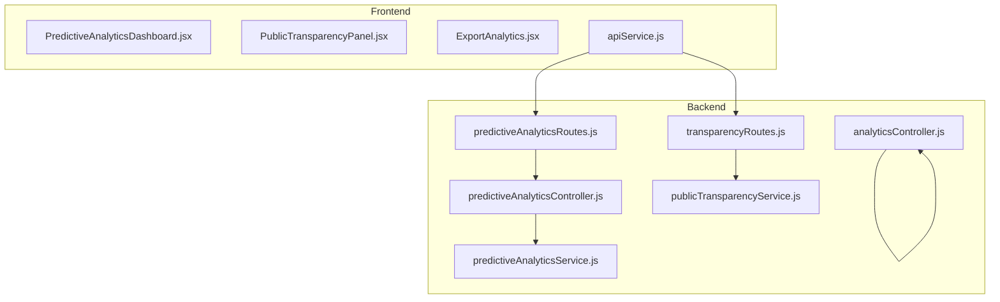
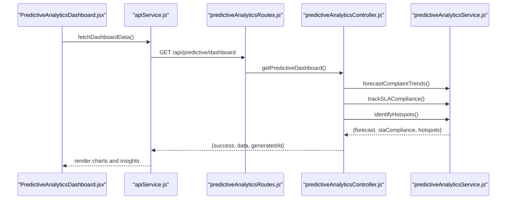
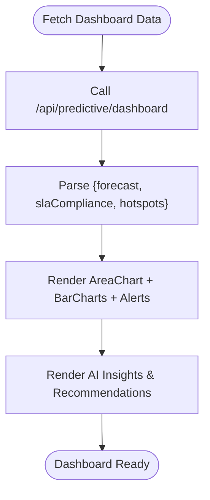
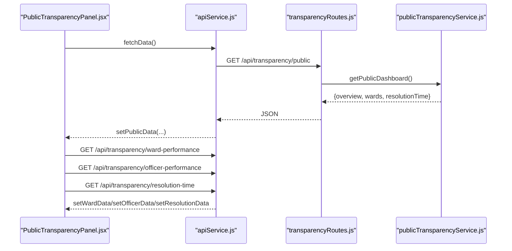
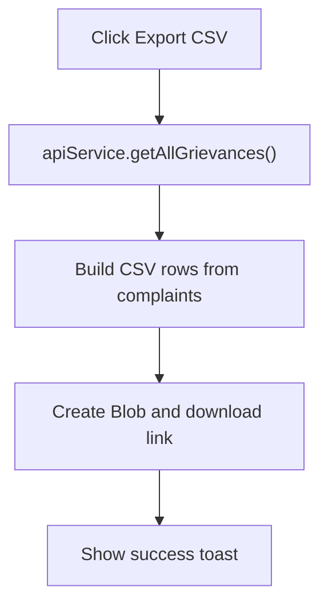
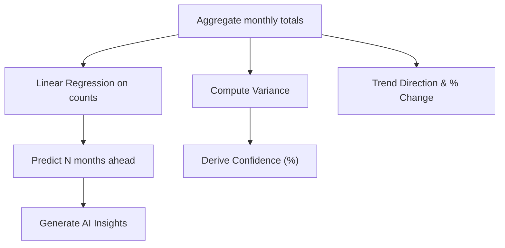
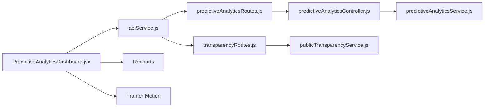

# Predictive Analytics & Visualization

<cite>
**Referenced Files in This Document**
- [PredictiveAnalyticsDashboard.jsx](file://Frontend/src/components/analytics/PredictiveAnalyticsDashboard.jsx)
- [PredictiveAnalytics.jsx](file://Frontend/src/pages/admin/PredictiveAnalytics.jsx)
- [PublicTransparencyPanel.jsx](file://Frontend/src/components/analytics/PublicTransparencyPanel.jsx)
- [ExportAnalytics.jsx](file://Frontend/src/components/analytics/ExportAnalytics.jsx)
- [apiService.js](file://Frontend/src/services/apiService.js)
- [predictiveAnalyticsController.js](file://backend/src/controllers/predictiveAnalyticsController.js)
- [predictiveAnalyticsService.js](file://backend/src/services/predictiveAnalyticsService.js)
- [predictiveAnalyticsRoutes.js](file://backend/src/routes/predictiveAnalyticsRoutes.js)
- [publicTransparencyService.js](file://backend/src/services/publicTransparencyService.js)
- [transparencyRoutes.js](file://backend/src/routes/transparencyRoutes.js)
- [analyticsController.js](file://backend/src/controllers/analyticsController.js)
</cite>

## Table of Contents
1. [Introduction](#introduction)
2. [Project Structure](#project-structure)
3. [Core Components](#core-components)
4. [Architecture Overview](#architecture-overview)
5. [Detailed Component Analysis](#detailed-component-analysis)
6. [Dependency Analysis](#dependency-analysis)
7. [Performance Considerations](#performance-considerations)
8. [Troubleshooting Guide](#troubleshooting-guide)
9. [Conclusion](#conclusion)
10. [Appendices](#appendices)

## Introduction
This document describes the predictive analytics and visualization system, covering:
- Predictive analytics dashboard implementation for trend forecasting, SLA compliance tracking, and hotspot identification
- Public transparency panel for citizen-facing analytics
- Export functionality for data sharing (CSV)
- Real-time prediction updates and refresh mechanisms
- Underlying machine learning models, confidence calculation, and accuracy metrics
- Visualization components and data sharing protocols
- Integration with external analytics tools and performance optimization strategies

## Project Structure
The system spans a frontend React application and a Node.js/Express backend. Key modules:
- Frontend dashboards and panels (predictive analytics, public transparency, export)
- Backend controllers and services implementing forecasting, SLA tracking, and hotspot detection
- Routing exposing REST endpoints for internal/admin and public transparency
- Shared API service for frontend-backend communication

**Diagram sources**
- [PredictiveAnalyticsDashboard.jsx:1-514](file://Frontend/src/components/analytics/PredictiveAnalyticsDashboard.jsx#L1-L514)
- [PublicTransparencyPanel.jsx:1-232](file://Frontend/src/components/analytics/PublicTransparencyPanel.jsx#L1-L232)
- [ExportAnalytics.jsx:1-106](file://Frontend/src/components/analytics/ExportAnalytics.jsx#L1-L106)
- [apiService.js:1-539](file://Frontend/src/services/apiService.js#L1-L539)
- [predictiveAnalyticsRoutes.js:1-54](file://backend/src/routes/predictiveAnalyticsRoutes.js#L1-L54)
- [predictiveAnalyticsController.js:1-190](file://backend/src/controllers/predictiveAnalyticsController.js#L1-L190)
- [predictiveAnalyticsService.js:1-519](file://backend/src/services/predictiveAnalyticsService.js#L1-L519)
- [transparencyRoutes.js:1-65](file://backend/src/routes/transparencyRoutes.js#L1-L65)
- [publicTransparencyService.js:1-222](file://backend/src/services/publicTransparencyService.js#L1-L222)
- [analyticsController.js:1-203](file://backend/src/controllers/analyticsController.js#L1-L203)

**Section sources**
- [PredictiveAnalyticsDashboard.jsx:1-514](file://Frontend/src/components/analytics/PredictiveAnalyticsDashboard.jsx#L1-L514)
- [PublicTransparencyPanel.jsx:1-232](file://Frontend/src/components/analytics/PublicTransparencyPanel.jsx#L1-L232)
- [ExportAnalytics.jsx:1-106](file://Frontend/src/components/analytics/ExportAnalytics.jsx#L1-L106)
- [apiService.js:1-539](file://Frontend/src/services/apiService.js#L1-L539)
- [predictiveAnalyticsRoutes.js:1-54](file://backend/src/routes/predictiveAnalyticsRoutes.js#L1-L54)
- [predictiveAnalyticsController.js:1-190](file://backend/src/controllers/predictiveAnalyticsController.js#L1-L190)
- [predictiveAnalyticsService.js:1-519](file://backend/src/services/predictiveAnalyticsService.js#L1-L519)
- [transparencyRoutes.js:1-65](file://backend/src/routes/transparencyRoutes.js#L1-L65)
- [publicTransparencyService.js:1-222](file://backend/src/services/publicTransparencyService.js#L1-L222)
- [analyticsController.js:1-203](file://backend/src/controllers/analyticsController.js#L1-L203)

## Core Components
- Predictive Analytics Dashboard: Renders trend forecasts, SLA compliance, and hotspots with charts and insights.
- Public Transparency Panel: Presents public ward performance, officer scores, and resolution time analytics.
- Export Analytics: Enables CSV export of grievances for offline analysis.
- Backend Controllers and Services: Implement forecasting, SLA tracking, and hotspot detection using aggregation pipelines and basic ML primitives.
- Routing and Authentication: Enforce role-based access for admin/ward_admin endpoints; public endpoints require no auth.

**Section sources**
- [PredictiveAnalyticsDashboard.jsx:53-514](file://Frontend/src/components/analytics/PredictiveAnalyticsDashboard.jsx#L53-L514)
- [PublicTransparencyPanel.jsx:12-232](file://Frontend/src/components/analytics/PublicTransparencyPanel.jsx#L12-L232)
- [ExportAnalytics.jsx:8-106](file://Frontend/src/components/analytics/ExportAnalytics.jsx#L8-L106)
- [predictiveAnalyticsController.js:14-187](file://backend/src/controllers/predictiveAnalyticsController.js#L14-L187)
- [predictiveAnalyticsService.js:66-512](file://backend/src/services/predictiveAnalyticsService.js#L66-L512)
- [transparencyRoutes.js:16-63](file://backend/src/routes/transparencyRoutes.js#L16-L63)

## Architecture Overview
The system follows a layered architecture:
- Frontend dashboards consume REST endpoints via a shared API service
- Backend routes delegate to controllers, which orchestrate service functions
- Services compute analytics using aggregation pipelines and simple ML methods
- Public transparency endpoints expose read-only data without authentication

**Diagram sources**
- [PredictiveAnalyticsDashboard.jsx:63-87](file://Frontend/src/components/analytics/PredictiveAnalyticsDashboard.jsx#L63-L87)
- [apiService.js:462-478](file://Frontend/src/services/apiService.js#L462-L478)
- [predictiveAnalyticsRoutes.js:41-45](file://backend/src/routes/predictiveAnalyticsRoutes.js#L41-L45)
- [predictiveAnalyticsController.js:88-114](file://backend/src/controllers/predictiveAnalyticsController.js#L88-L114)
- [predictiveAnalyticsService.js:66-512](file://backend/src/services/predictiveAnalyticsService.js#L66-L512)

## Detailed Component Analysis

### Predictive Analytics Dashboard
- Purpose: Present AI-driven insights on complaint trends, SLA compliance, and geographic hotspots.
- Data fetching: Uses a single endpoint to retrieve combined dashboard data and supports manual refresh.
- Visualizations:
  - Trend Forecast: Area chart comparing historical and predicted values; displays trend direction, next-month prediction, and confidence.
  - SLA Compliance: Bar chart comparing actual compliance vs targets by priority; includes alerts.
  - Hotspots: Horizontal bar chart of hotspot scores by ward; lists recommendations.
- Interactions: Refresh button triggers a new fetch; loading and error states handled gracefully.

**Diagram sources**
- [PredictiveAnalyticsDashboard.jsx:63-87](file://Frontend/src/components/analytics/PredictiveAnalyticsDashboard.jsx#L63-L87)
- [predictiveAnalyticsController.js:88-114](file://backend/src/controllers/predictiveAnalyticsController.js#L88-L114)

**Section sources**
- [PredictiveAnalyticsDashboard.jsx:53-514](file://Frontend/src/components/analytics/PredictiveAnalyticsDashboard.jsx#L53-L514)
- [PredictiveAnalytics.jsx:9-17](file://Frontend/src/pages/admin/PredictiveAnalytics.jsx#L9-L17)

### Public Transparency Panel
- Purpose: Provide a citizen-facing analytics view with public ward performance, officer performance, and resolution time analytics.
- Data sources: Public dashboard overview plus separate endpoints for ward performance, officer performance, and resolution time.
- Visualizations:
  - Ward performance: Bar chart of resolution rates and summary cards per ward.
  - Officer performance: Ranked list with badges and counts.
  - Resolution time: Category-wise average resolution hours.
- Access: Public dashboard requires no authentication; others require admin/ward_admin roles.

**Diagram sources**
- [PublicTransparencyPanel.jsx:23-51](file://Frontend/src/components/analytics/PublicTransparencyPanel.jsx#L23-L51)
- [transparencyRoutes.js:16-63](file://backend/src/routes/transparencyRoutes.js#L16-L63)
- [publicTransparencyService.js:180-215](file://backend/src/services/publicTransparencyService.js#L180-L215)

**Section sources**
- [PublicTransparencyPanel.jsx:12-232](file://Frontend/src/components/analytics/PublicTransparencyPanel.jsx#L12-L232)
- [transparencyRoutes.js:16-63](file://backend/src/routes/transparencyRoutes.js#L16-L63)
- [publicTransparencyService.js:12-222](file://backend/src/services/publicTransparencyService.js#L12-L222)

### Export Analytics
- Purpose: Allow administrators to export grievances data for offline analysis.
- Implementation: Calls backend to fetch all grievances, constructs CSV content, and triggers browser download.
- Current support: CSV export; PDF export is present as a disabled UI element.

**Diagram sources**
- [ExportAnalytics.jsx:12-61](file://Frontend/src/components/analytics/ExportAnalytics.jsx#L12-L61)
- [apiService.js:124-137](file://Frontend/src/services/apiService.js#L124-L137)

**Section sources**
- [ExportAnalytics.jsx:8-106](file://Frontend/src/components/analytics/ExportAnalytics.jsx#L8-L106)
- [apiService.js:124-137](file://Frontend/src/services/apiService.js#L124-L137)

### Machine Learning Models and Algorithms
- Trend Forecasting:
  - Historical aggregation by month with counts of total complaints.
  - Predictions computed using linear regression on cumulative counts.
  - Confidence derived from dataset variance relative to mean.
  - Trend direction and percentage calculated via moving averages comparison.
- SLA Compliance Tracking:
  - Aggregates resolved complaints with computed resolution time per priority.
  - Calculates compliance rates and generates alerts when targets are not met.
- Hotspot Identification:
  - Aggregates by ward and category; computes hotspot score combining complaint volume, pending ratio, high-priority ratio, and average resolution time.
  - Severity classification and top categories selection for recommendations.

**Diagram sources**
- [predictiveAnalyticsService.js:66-167](file://backend/src/services/predictiveAnalyticsService.js#L66-L167)
- [predictiveAnalyticsService.js:238-381](file://backend/src/services/predictiveAnalyticsService.js#L238-L381)
- [predictiveAnalyticsService.js:383-512](file://backend/src/services/predictiveAnalyticsService.js#L383-L512)

**Section sources**
- [predictiveAnalyticsService.js:66-167](file://backend/src/services/predictiveAnalyticsService.js#L66-L167)
- [predictiveAnalyticsService.js:238-381](file://backend/src/services/predictiveAnalyticsService.js#L238-L381)
- [predictiveAnalyticsService.js:383-512](file://backend/src/services/predictiveAnalyticsService.js#L383-L512)

### Visualization Components
- Charts:
  - Recharts-based area chart for historical vs forecasted complaint volumes.
  - Bar charts for SLA compliance by priority and hotspot scores by ward.
  - Responsive containers for adaptive layouts.
- UI Elements:
  - Cards, alerts, badges, and tabs for organized presentation.
  - Motion effects for recommendation lists.

**Section sources**
- [PredictiveAnalyticsDashboard.jsx:21-51](file://Frontend/src/components/analytics/PredictiveAnalyticsDashboard.jsx#L21-L51)
- [PredictiveAnalyticsDashboard.jsx:234-271](file://Frontend/src/components/analytics/PredictiveAnalyticsDashboard.jsx#L234-L271)
- [PublicTransparencyPanel.jsx:120-130](file://Frontend/src/components/analytics/PublicTransparencyPanel.jsx#L120-L130)

### Data Sharing Protocols
- CSV Export: Constructed from fetched grievances with headers and escaped values; saved as a downloadable file.
- Public Transparency: Public dashboard endpoint returns aggregated overview and category analytics without authentication.
- Authentication: Admin/ward_admin protected endpoints use bearer tokens.

**Section sources**
- [ExportAnalytics.jsx:12-61](file://Frontend/src/components/analytics/ExportAnalytics.jsx#L12-L61)
- [transparencyRoutes.js:16-23](file://backend/src/routes/transparencyRoutes.js#L16-L23)
- [predictiveAnalyticsRoutes.js:19-21](file://backend/src/routes/predictiveAnalyticsRoutes.js#L19-L21)

## Dependency Analysis
- Frontend depends on:
  - apiService for REST calls
  - Recharts for visualization
  - Framer Motion for animations
- Backend controllers depend on:
  - predictiveAnalyticsService and publicTransparencyService
  - Authentication middleware for role-based access
- Services depend on:
  - MongoDB aggregation pipelines over the Grievance model

**Diagram sources**
- [PredictiveAnalyticsDashboard.jsx:1-37](file://Frontend/src/components/analytics/PredictiveAnalyticsDashboard.jsx#L1-L37)
- [apiService.js:1-14](file://Frontend/src/services/apiService.js#L1-L14)
- [predictiveAnalyticsRoutes.js:1-11](file://backend/src/routes/predictiveAnalyticsRoutes.js#L1-L11)
- [transparencyRoutes.js:1-5](file://backend/src/routes/transparencyRoutes.js#L1-L5)
- [predictiveAnalyticsController.js:1-8](file://backend/src/controllers/predictiveAnalyticsController.js#L1-L8)
- [predictiveAnalyticsService.js:1-7](file://backend/src/services/predictiveAnalyticsService.js#L1-L7)
- [publicTransparencyService.js:1-7](file://backend/src/services/publicTransparencyService.js#L1-L7)

**Section sources**
- [apiService.js:1-14](file://Frontend/src/services/apiService.js#L1-L14)
- [predictiveAnalyticsController.js:1-8](file://backend/src/controllers/predictiveAnalyticsController.js#L1-L8)
- [predictiveAnalyticsService.js:1-7](file://backend/src/services/predictiveAnalyticsService.js#L1-L7)
- [publicTransparencyService.js:1-7](file://backend/src/services/publicTransparencyService.js#L1-L7)

## Performance Considerations
- Parallel Data Fetching:
  - Dashboard aggregates multiple analytics concurrently to reduce latency.
  - Public transparency panel fetches multiple endpoints in parallel.
- Aggregation Pipelines:
  - Backend uses MongoDB aggregation for efficient server-side computation.
- Client-Side Rendering:
  - Recharts renders responsive charts; consider virtualization for very large datasets.
- Export Scalability:
  - CSV generation occurs in-memory; large datasets may benefit from server-side streaming or batch exports.
- Caching:
  - Introduce caching for repeated queries with fixed timeframes to reduce database load.
- Pagination:
  - Consider paginating export endpoints for large datasets.

[No sources needed since this section provides general guidance]

## Troubleshooting Guide
- Dashboard Load Failures:
  - Verify authentication token presence and validity.
  - Check backend route availability and controller/service error logs.
- SLA Alerts Misalignment:
  - Confirm SLA targets and time conversions align with expectations.
- Hotspot Scores Unexpected:
  - Review aggregation thresholds and weighting factors.
- Export Errors:
  - Inspect CSV construction and browser download behavior; ensure sufficient memory for large exports.

**Section sources**
- [PredictiveAnalyticsDashboard.jsx:63-87](file://Frontend/src/components/analytics/PredictiveAnalyticsDashboard.jsx#L63-L87)
- [predictiveAnalyticsController.js:14-32](file://backend/src/controllers/predictiveAnalyticsController.js#L14-L32)
- [predictiveAnalyticsService.js:134-166](file://backend/src/services/predictiveAnalyticsService.js#L134-L166)
- [ExportAnalytics.jsx:12-61](file://Frontend/src/components/analytics/ExportAnalytics.jsx#L12-L61)

## Conclusion
The predictive analytics and visualization system integrates frontend dashboards with backend analytics services to deliver actionable insights. It leverages simple yet effective ML primitives (moving averages, linear regression) and robust aggregation pipelines to produce forecasts, SLA metrics, and hotspots. The public transparency panel ensures open access to key metrics, while export capabilities support data sharing. With targeted performance improvements and standardized error handling, the system can scale to larger workloads and broader user bases.

[No sources needed since this section summarizes without analyzing specific files]

## Appendices

### API Definitions

- Predictive Analytics
  - GET /api/predictive/forecast
    - Query: historicalMonths (default 6), forecastMonths (default 3)
    - Response: trend, forecast, historical, insights
  - GET /api/predictive/sla-compliance
    - Query: days (default 30)
    - Response: overall, byPriority, byCategory, byWard, alerts
  - GET /api/predictive/hotspots
    - Query: days (default 30), minComplaintsThreshold (default 5)
    - Response: hotspots, criticalCount, recommendations, summary
  - GET /api/predictive/dashboard
    - Response: {success, data: {forecast, slaCompliance, hotspots}, generatedAt}
  - GET /api/predictive/resource-planning
    - Response: recommendations, staffAllocation, predictedLoad, criticalAreas, analysis

- Public Transparency
  - GET /api/transparency/public
    - Response: {success, overview, wards, resolutionTime}
  - GET /api/transparency/ward-performance
    - Query: ward (optional)
    - Response: {success, data, summary}
  - GET /api/transparency/officer-performance
    - Response: {success, data}
  - GET /api/transparency/resolution-time
    - Response: {success, detailed, byCategory}

- Additional Analytics (Admin)
  - GET /api/analytics/trends
    - Query: range (monthly|daily|weekly), startDate, endDate
    - Response: {success, data}
  - GET /api/analytics/ward-performance
    - Response: {success, data}
  - GET /api/analytics/resolution-time
    - Response: {success, data}
  - GET /api/analytics/category-correlation
    - Response: {success, data}

**Section sources**
- [predictiveAnalyticsRoutes.js:23-51](file://backend/src/routes/predictiveAnalyticsRoutes.js#L23-L51)
- [transparencyRoutes.js:12-63](file://backend/src/routes/transparencyRoutes.js#L12-L63)
- [analyticsController.js:8-202](file://backend/src/controllers/analyticsController.js#L8-L202)