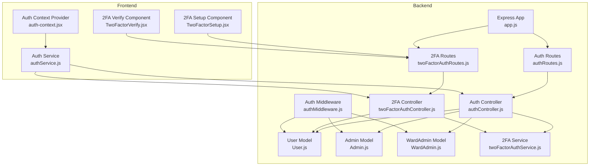
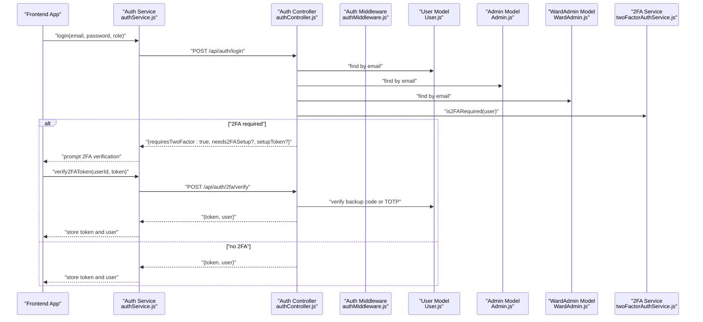
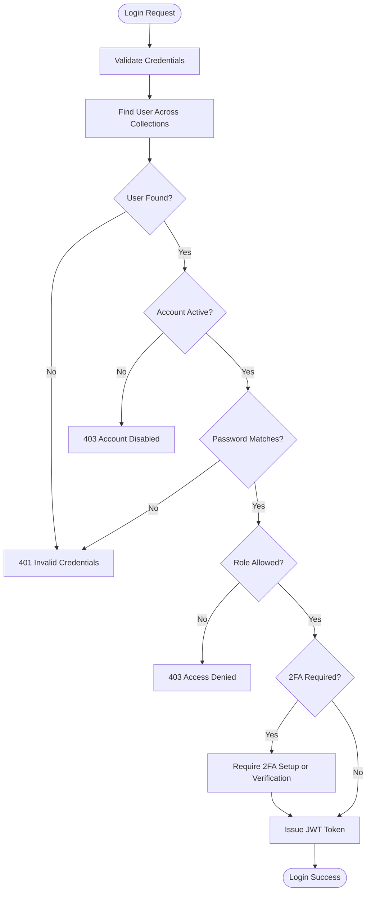
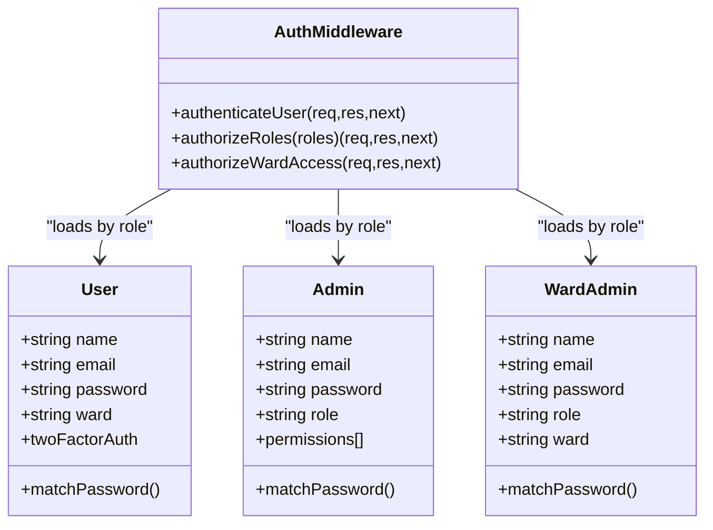
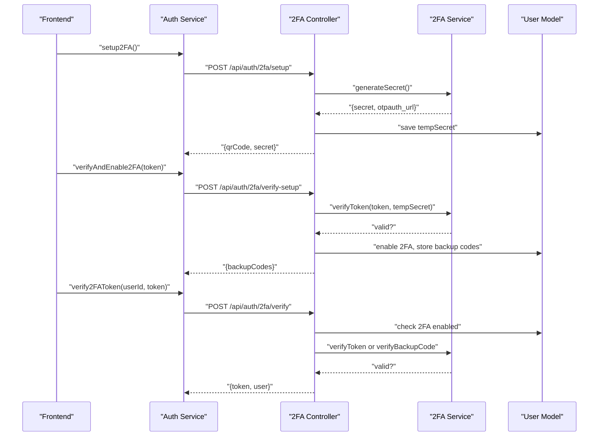
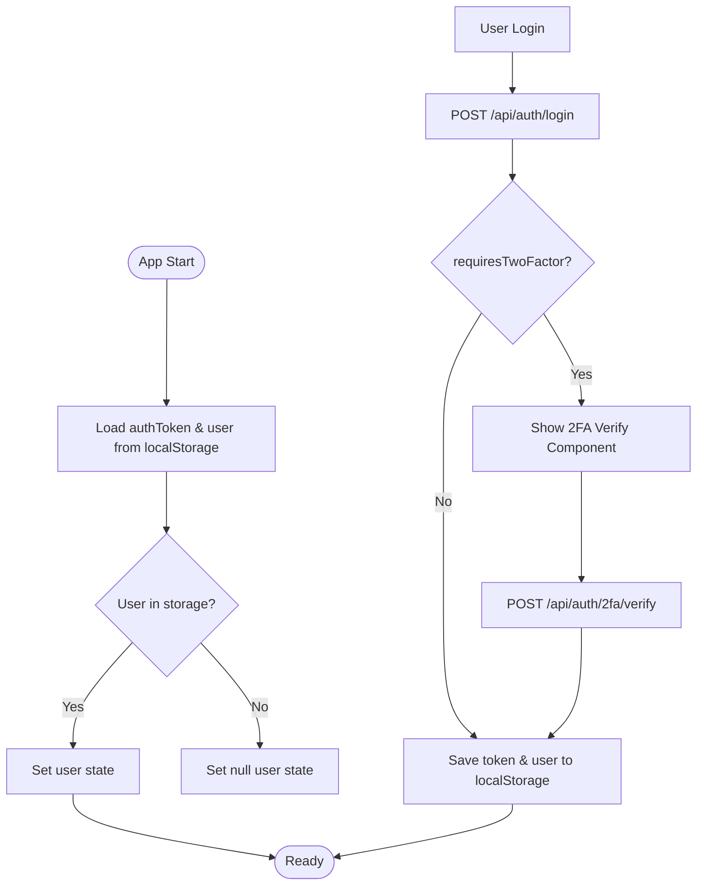
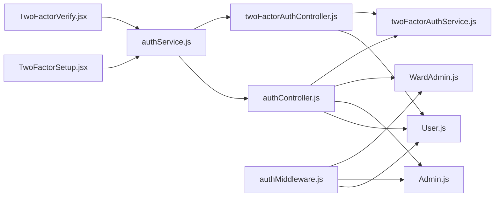

# Authentication & Authorization System

<cite>
**Referenced Files in This Document**
- [authController.js](file://backend/src/controllers/authController.js)
- [authMiddleware.js](file://backend/src/middleware/authMiddleware.js)
- [twoFactorAuthController.js](file://backend/src/controllers/twoFactorAuthController.js)
- [twoFactorAuthService.js](file://backend/src/services/twoFactorAuthService.js)
- [User.js](file://backend/src/models/User.js)
- [Admin.js](file://backend/src/models/Admin.js)
- [WardAdmin.js](file://backend/src/models/WardAdmin.js)
- [auth-context.jsx](file://frontend/src/context/auth-context.jsx)
- [authService.js](file://frontend/src/services/authService.js)
- [authRoutes.js](file://backend/src/routes/authRoutes.js)
- [twoFactorAuthRoutes.js](file://backend/src/routes/twoFactorAuthRoutes.js)
- [TwoFactorSetup.jsx](file://frontend/src/components/security/TwoFactorSetup.jsx)
- [TwoFactorVerify.jsx](file://frontend/src/components/security/TwoFactorVerify.jsx)
- [app.js](file://backend/src/app.js)
</cite>

## Table of Contents
1. [Introduction](#introduction)
2. [Project Structure](#project-structure)
3. [Core Components](#core-components)
4. [Architecture Overview](#architecture-overview)
5. [Detailed Component Analysis](#detailed-component-analysis)
6. [Dependency Analysis](#dependency-analysis)
7. [Performance Considerations](#performance-considerations)
8. [Troubleshooting Guide](#troubleshooting-guide)
9. [Conclusion](#conclusion)

## Introduction
This document provides comprehensive authentication and authorization documentation for the multi-role system. It covers JWT-based authentication, role hierarchy (citizen, ward admin, super admin), and mandatory two-factor authentication (2FA) implementation. It also documents the authentication middleware, token validation processes, session management, user registration workflow, password hashing, and security measures. The guide includes API endpoints, protected route implementation, role-based access control patterns, frontend authentication state management examples, and security best practices.

## Project Structure
The authentication system spans both backend and frontend layers:
- Backend: Express routes, controllers, middleware, models, and services
- Frontend: React context provider, service layer, and UI components for 2FA setup and verification

**Diagram sources**
- [app.js:1-71](file://backend/src/app.js#L1-L71)
- [authRoutes.js:1-10](file://backend/src/routes/authRoutes.js#L1-L10)
- [twoFactorAuthRoutes.js:1-63](file://backend/src/routes/twoFactorAuthRoutes.js#L1-L63)
- [authController.js:1-237](file://backend/src/controllers/authController.js#L1-L237)
- [twoFactorAuthController.js:1-453](file://backend/src/controllers/twoFactorAuthController.js#L1-L453)
- [authMiddleware.js:1-114](file://backend/src/middleware/authMiddleware.js#L1-L114)
- [User.js:1-165](file://backend/src/models/User.js#L1-L165)
- [Admin.js:1-55](file://backend/src/models/Admin.js#L1-L55)
- [WardAdmin.js:1-61](file://backend/src/models/WardAdmin.js#L1-L61)
- [twoFactorAuthService.js:1-152](file://backend/src/services/twoFactorAuthService.js#L1-L152)
- [auth-context.jsx:1-143](file://frontend/src/context/auth-context.jsx#L1-L143)
- [authService.js:1-99](file://frontend/src/services/authService.js#L1-L99)
- [TwoFactorSetup.jsx:1-395](file://frontend/src/components/security/TwoFactorSetup.jsx#L1-L395)
- [TwoFactorVerify.jsx:1-200](file://frontend/src/components/security/TwoFactorVerify.jsx#L1-L200)

**Section sources**
- [app.js:1-71](file://backend/src/app.js#L1-L71)
- [authRoutes.js:1-10](file://backend/src/routes/authRoutes.js#L1-L10)
- [twoFactorAuthRoutes.js:1-63](file://backend/src/routes/twoFactorAuthRoutes.js#L1-L63)

## Core Components
- JWT-based authentication with role-aware token payload and middleware validation
- Multi-role hierarchy: citizen (user), ward admin, super admin (admin)
- Mandatory 2FA enforcement for all login attempts for citizens
- Password hashing using bcrypt for all user types
- Session management via localStorage in the frontend with token and user persistence
- Role-based access control (RBAC) with middleware authorization and ward-based filters for ward admins

Key implementation highlights:
- Controllers handle registration, login, and 2FA operations
- Middleware validates tokens and authorizes roles and ward boundaries
- Services encapsulate 2FA secret generation, QR code creation, and backup code management
- Models define schemas, password hashing, and 2FA fields for users

**Section sources**
- [authController.js:1-237](file://backend/src/controllers/authController.js#L1-L237)
- [authMiddleware.js:1-114](file://backend/src/middleware/authMiddleware.js#L1-L114)
- [twoFactorAuthController.js:1-453](file://backend/src/controllers/twoFactorAuthController.js#L1-L453)
- [twoFactorAuthService.js:1-152](file://backend/src/services/twoFactorAuthService.js#L1-L152)
- [User.js:1-165](file://backend/src/models/User.js#L1-L165)
- [Admin.js:1-55](file://backend/src/models/Admin.js#L1-L55)
- [WardAdmin.js:1-61](file://backend/src/models/WardAdmin.js#L1-L61)

## Architecture Overview
The authentication architecture follows a layered design:
- Route handlers delegate to controllers
- Controllers interact with models and services
- Middleware validates tokens and enforces RBAC
- Frontend communicates with backend via REST endpoints and manages local session state

**Diagram sources**
- [authController.js:90-237](file://backend/src/controllers/authController.js#L90-L237)
- [authMiddleware.js:10-55](file://backend/src/middleware/authMiddleware.js#L10-L55)
- [twoFactorAuthService.js:125-135](file://backend/src/services/twoFactorAuthService.js#L125-L135)
- [authService.js:37-80](file://frontend/src/services/authService.js#L37-L80)

## Detailed Component Analysis

### JWT-Based Authentication Flow
- Registration: Validates password criteria, checks uniqueness across collections, creates citizen user, and issues JWT with role and ward
- Login: Searches admins → ward_admins → users; verifies password; enforces role-based access; triggers 2FA for citizens
- Token payload includes id, role, and ward; middleware decodes and loads user from appropriate collection
- Logout clears localStorage tokens and user data

**Diagram sources**
- [authController.js:90-237](file://backend/src/controllers/authController.js#L90-L237)
- [authMiddleware.js:10-55](file://backend/src/middleware/authMiddleware.js#L10-L55)

**Section sources**
- [authController.js:7-88](file://backend/src/controllers/authController.js#L7-L88)
- [authController.js:90-237](file://backend/src/controllers/authController.js#L90-L237)
- [authMiddleware.js:10-55](file://backend/src/middleware/authMiddleware.js#L10-L55)

### Role Hierarchy and Access Control
- Roles: admin (super admin), ward_admin, user (citizen)
- Middleware loads user from the correct collection based on token role and enforces:
  - Role authorization via authorizeRoles
  - Ward-based access control for ward_admin via authorizeWardAccess
- Admins can access all wards; ward_admins are scoped to their assigned ward

**Diagram sources**
- [authMiddleware.js:10-104](file://backend/src/middleware/authMiddleware.js#L10-L104)
- [User.js:1-165](file://backend/src/models/User.js#L1-L165)
- [Admin.js:1-55](file://backend/src/models/Admin.js#L1-L55)
- [WardAdmin.js:1-61](file://backend/src/models/WardAdmin.js#L1-L61)

**Section sources**
- [authMiddleware.js:61-104](file://backend/src/middleware/authMiddleware.js#L61-L104)

### Two-Factor Authentication (2FA) Implementation
- Mandatory 2FA for all citizens on every login
- Setup flow generates secret and QR code; enables 2FA after verification
- Backup codes generated, hashed, and stored; can be regenerated
- Verification accepts either TOTP or backup code; marks backup code as used upon first use
- Separate routes for setup, verification, status, disable, and backup code regeneration

**Diagram sources**
- [twoFactorAuthController.js:15-136](file://backend/src/controllers/twoFactorAuthController.js#L15-L136)
- [twoFactorAuthController.js:143-265](file://backend/src/controllers/twoFactorAuthController.js#L143-L265)
- [twoFactorAuthService.js:15-105](file://backend/src/services/twoFactorAuthService.js#L15-L105)
- [User.js:116-141](file://backend/src/models/User.js#L116-L141)

**Section sources**
- [twoFactorAuthController.js:15-453](file://backend/src/controllers/twoFactorAuthController.js#L15-L453)
- [twoFactorAuthService.js:15-152](file://backend/src/services/twoFactorAuthService.js#L15-L152)
- [User.js:116-141](file://backend/src/models/User.js#L116-L141)

### Password Hashing and Security Measures
- All user types (User, Admin, WardAdmin) use bcrypt for password hashing
- Pre-save hooks ensure passwords are hashed before save
- Password comparison method used during login
- Additional security validations in registration (password length, character requirements, no email reuse)

**Section sources**
- [User.js:146-156](file://backend/src/models/User.js#L146-L156)
- [Admin.js:40-52](file://backend/src/models/Admin.js#L40-L52)
- [WardAdmin.js:46-58](file://backend/src/models/WardAdmin.js#L46-L58)
- [authController.js:15-41](file://backend/src/controllers/authController.js#L15-L41)

### Session Management and Frontend State
- Frontend stores authToken and user data in localStorage
- AuthContext initializes user state from storage and exposes authentication helpers
- AuthService handles network requests to backend endpoints
- 2FA components integrate with the backend to complete setup and verification flows

**Diagram sources**
- [auth-context.jsx:6-27](file://frontend/src/context/auth-context.jsx#L6-L27)
- [authService.js:37-80](file://frontend/src/services/authService.js#L37-L80)
- [TwoFactorVerify.jsx:21-100](file://frontend/src/components/security/TwoFactorVerify.jsx#L21-L100)

**Section sources**
- [auth-context.jsx:1-143](file://frontend/src/context/auth-context.jsx#L1-L143)
- [authService.js:1-99](file://frontend/src/services/authService.js#L1-L99)
- [TwoFactorSetup.jsx:32-75](file://frontend/src/components/security/TwoFactorSetup.jsx#L32-L75)
- [TwoFactorVerify.jsx:21-100](file://frontend/src/components/security/TwoFactorVerify.jsx#L21-L100)

### Protected Routes and RBAC Patterns
- Mount auth and 2FA routes under /api/auth and /api/auth/2fa
- Apply authenticateUser middleware to private endpoints
- Use authorizeRoles to restrict access to specific roles
- Use authorizeWardAccess to enforce ward scoping for ward_admin

**Section sources**
- [app.js:43-44](file://backend/src/app.js#L43-L44)
- [twoFactorAuthRoutes.js:25-60](file://backend/src/routes/twoFactorAuthRoutes.js#L25-L60)
- [authMiddleware.js:61-104](file://backend/src/middleware/authMiddleware.js#L61-L104)

## Dependency Analysis
The authentication system exhibits clear separation of concerns:
- Controllers depend on models and services
- Middleware depends on models for user lookup
- Frontend services depend on backend routes
- 2FA service is isolated and reusable across controllers

**Diagram sources**
- [authController.js:1-5](file://backend/src/controllers/authController.js#L1-L5)
- [twoFactorAuthController.js:1-2](file://backend/src/controllers/twoFactorAuthController.js#L1-L2)
- [authMiddleware.js:1-4](file://backend/src/middleware/authMiddleware.js#L1-L4)
- [User.js:1-2](file://backend/src/models/User.js#L1-L2)
- [Admin.js:1-2](file://backend/src/models/Admin.js#L1-L2)
- [WardAdmin.js:1-2](file://backend/src/models/WardAdmin.js#L1-L2)
- [twoFactorAuthService.js:1-2](file://backend/src/services/twoFactorAuthService.js#L1-L2)
- [authService.js:1](file://frontend/src/services/authService.js#L1)
- [TwoFactorSetup.jsx:1](file://frontend/src/components/security/TwoFactorSetup.jsx#L1)
- [TwoFactorVerify.jsx:1](file://frontend/src/components/security/TwoFactorVerify.jsx#L1)

**Section sources**
- [authController.js:1-5](file://backend/src/controllers/authController.js#L1-L5)
- [twoFactorAuthController.js:1-2](file://backend/src/controllers/twoFactorAuthController.js#L1-L2)
- [authMiddleware.js:1-4](file://backend/src/middleware/authMiddleware.js#L1-L4)

## Performance Considerations
- Token verification is O(1) with constant-time lookups by ID
- Password hashing uses bcrypt with cost 10; acceptable for production with proper infrastructure
- 2FA verification uses speakeasy with configurable time window; adjust window based on latency tolerance
- Indexes on email, ward, and leaderboard fields improve query performance
- Consider rate limiting on login and 2FA endpoints to mitigate brute force attacks

## Troubleshooting Guide
Common issues and resolutions:
- Invalid or expired token: Ensure frontend persists authToken and re-authenticates when needed
- Account disabled: Verify isActive flag in the appropriate collection
- 2FA setup failures: Confirm secret generation and QR code availability; ensure 6-digit TOTP verification
- Backup code usage: Each backup code is single-use; regenerate if exhausted
- Role access denied: Confirm role passed during login matches intended access; admins bypass ward restrictions

**Section sources**
- [authMiddleware.js:46-54](file://backend/src/middleware/authMiddleware.js#L46-L54)
- [twoFactorAuthController.js:75-102](file://backend/src/controllers/twoFactorAuthController.js#L75-L102)
- [twoFactorAuthController.js:179-195](file://backend/src/controllers/twoFactorAuthController.js#L179-L195)

## Conclusion
The authentication and authorization system implements a robust, multi-role architecture with mandatory 2FA for citizens, secure password handling, and comprehensive RBAC controls. The backend provides clear separation of concerns with controllers, middleware, models, and services, while the frontend offers seamless session management and integrated 2FA UX. Adhering to the documented patterns and best practices will maintain security and scalability across the platform.