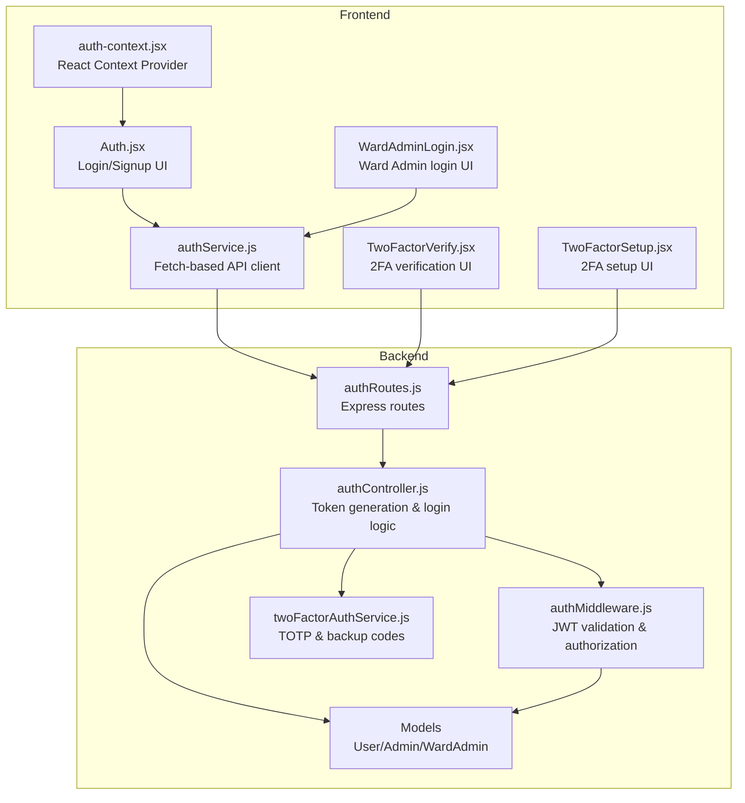
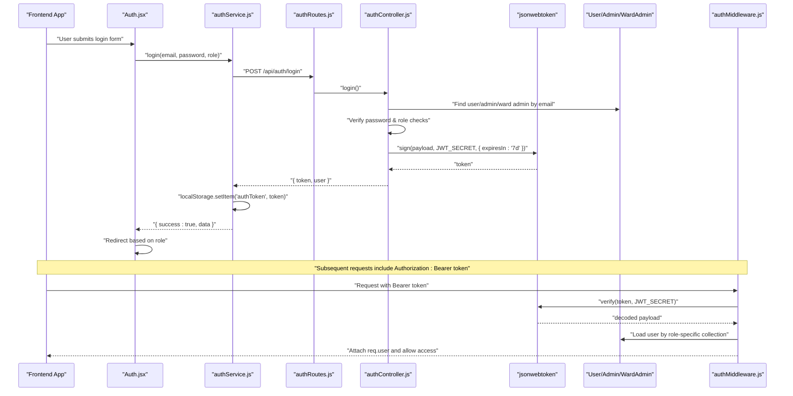
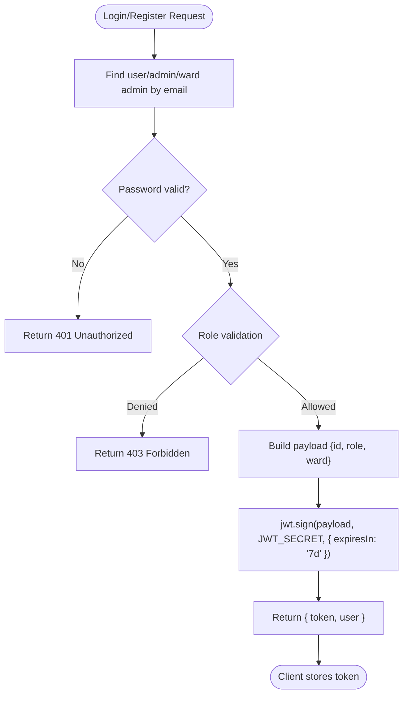
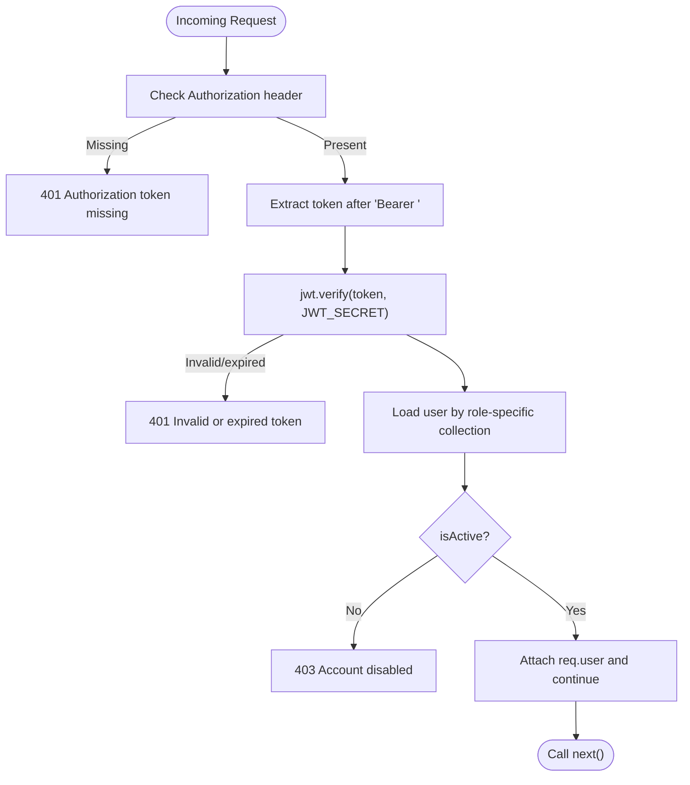
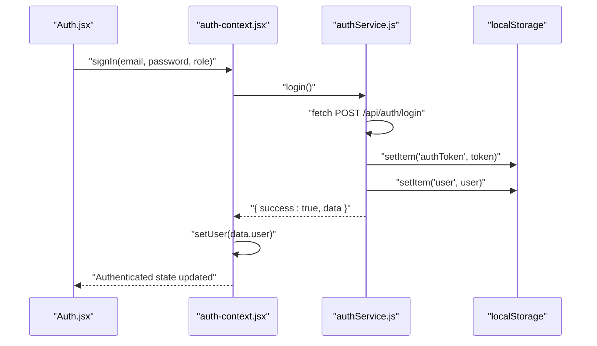
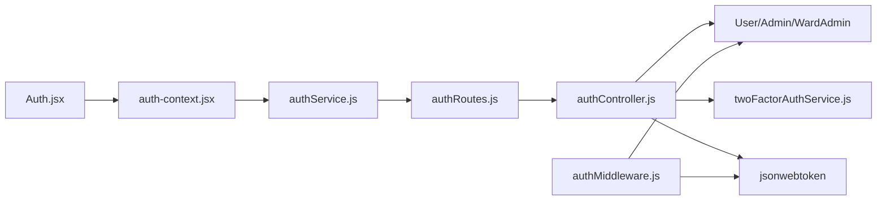

# JWT Authentication Flow

<cite>
**Referenced Files in This Document**
- [authController.js](file://backend/src/controllers/authController.js)
- [authMiddleware.js](file://backend/src/middleware/authMiddleware.js)
- [authRoutes.js](file://backend/src/routes/authRoutes.js)
- [authService.js](file://frontend/src/services/authService.js)
- [auth-context.jsx](file://frontend/src/context/auth-context.jsx)
- [Auth.jsx](file://frontend/src/pages/Auth.jsx)
- [User.js](file://backend/src/models/User.js)
- [Admin.js](file://backend/src/models/Admin.js)
- [WardAdmin.js](file://backend/src/models/WardAdmin.js)
- [twoFactorAuthService.js](file://backend/src/services/twoFactorAuthService.js)
- [TwoFactorVerify.jsx](file://frontend/src/components/security/TwoFactorVerify.jsx)
- [TwoFactorSetup.jsx](file://frontend/src/components/security/TwoFactorSetup.jsx)
- [WardAdminLogin.jsx](file://frontend/src/pages/WardAdminLogin.jsx)
</cite>

## Table of Contents
1. [Introduction](#introduction)
2. [Project Structure](#project-structure)
3. [Core Components](#core-components)
4. [Architecture Overview](#architecture-overview)
5. [Detailed Component Analysis](#detailed-component-analysis)
6. [Dependency Analysis](#dependency-analysis)
7. [Performance Considerations](#performance-considerations)
8. [Troubleshooting Guide](#troubleshooting-guide)
9. [Conclusion](#conclusion)

## Introduction
This document provides comprehensive documentation for the JWT authentication flow implementation. It covers token generation, payload structure, signing with JWT_SECRET, expiration handling, secure storage in frontend applications, authentication middleware, role-based access control, token refresh strategies, logout mechanisms, and security considerations. Practical examples demonstrate token usage in API requests, frontend authentication state management, and error handling for expired or invalid tokens.

## Project Structure
The authentication system spans both backend and frontend:
- Backend: Express routes, controllers, middleware, and models implement JWT token generation, validation, and role-based authorization.
- Frontend: Services manage token storage and retrieval, while context providers coordinate authentication state and UI flows.

**Diagram sources**
- [authRoutes.js:1-10](file://backend/src/routes/authRoutes.js#L1-L10)
- [authController.js:1-237](file://backend/src/controllers/authController.js#L1-L237)
- [authMiddleware.js:1-114](file://backend/src/middleware/authMiddleware.js#L1-L114)
- [authService.js:1-99](file://frontend/src/services/authService.js#L1-L99)
- [auth-context.jsx:1-143](file://frontend/src/context/auth-context.jsx#L1-L143)
- [Auth.jsx:1-443](file://frontend/src/pages/Auth.jsx#L1-L443)
- [TwoFactorVerify.jsx:1-200](file://frontend/src/components/security/TwoFactorVerify.jsx#L1-L200)
- [TwoFactorSetup.jsx:1-395](file://frontend/src/components/security/TwoFactorSetup.jsx#L1-L395)
- [WardAdminLogin.jsx:1-170](file://frontend/src/pages/WardAdminLogin.jsx#L1-L170)
- [User.js:1-165](file://backend/src/models/User.js#L1-L165)
- [Admin.js:1-55](file://backend/src/models/Admin.js#L1-L55)
- [WardAdmin.js:1-61](file://backend/src/models/WardAdmin.js#L1-L61)
- [twoFactorAuthService.js:1-152](file://backend/src/services/twoFactorAuthService.js#L1-L152)

**Section sources**
- [authRoutes.js:1-10](file://backend/src/routes/authRoutes.js#L1-L10)
- [authController.js:1-237](file://backend/src/controllers/authController.js#L1-L237)
- [authMiddleware.js:1-114](file://backend/src/middleware/authMiddleware.js#L1-L114)
- [authService.js:1-99](file://frontend/src/services/authService.js#L1-L99)
- [auth-context.jsx:1-143](file://frontend/src/context/auth-context.jsx#L1-L143)
- [Auth.jsx:1-443](file://frontend/src/pages/Auth.jsx#L1-L443)
- [TwoFactorVerify.jsx:1-200](file://frontend/src/components/security/TwoFactorVerify.jsx#L1-L200)
- [TwoFactorSetup.jsx:1-395](file://frontend/src/components/security/TwoFactorSetup.jsx#L1-L395)
- [WardAdminLogin.jsx:1-170](file://frontend/src/pages/WardAdminLogin.jsx#L1-L170)
- [User.js:1-165](file://backend/src/models/User.js#L1-L165)
- [Admin.js:1-55](file://backend/src/models/Admin.js#L1-L55)
- [WardAdmin.js:1-61](file://backend/src/models/WardAdmin.js#L1-L61)
- [twoFactorAuthService.js:1-152](file://backend/src/services/twoFactorAuthService.js#L1-L152)

## Core Components
- Backend JWT Generation and Validation:
  - Token payload includes user ID, role, and ward information for ward admins.
  - Tokens are signed using JWT_SECRET with a 7-day expiration.
  - Authentication middleware verifies tokens and attaches user context to requests.
  - Role-based authorization restricts access to resources.
- Frontend Authentication State Management:
  - authService persists tokens and user data in localStorage.
  - auth-context manages global authentication state and exposes role checks.
  - Auth and WardAdminLogin pages orchestrate login/signup flows and redirects.
  - TwoFactorVerify and TwoFactorSetup handle mandatory 2FA enforcement.

**Section sources**
- [authController.js:58-84](file://backend/src/controllers/authController.js#L58-L84)
- [authController.js:192-202](file://backend/src/controllers/authController.js#L192-L202)
- [authMiddleware.js:10-55](file://backend/src/middleware/authMiddleware.js#L10-L55)
- [authMiddleware.js:61-71](file://backend/src/middleware/authMiddleware.js#L61-L71)
- [authMiddleware.js:77-104](file://backend/src/middleware/authMiddleware.js#L77-L104)
- [authService.js:25-28](file://frontend/src/services/authService.js#L25-L28)
- [authService.js:70-73](file://frontend/src/services/authService.js#L70-L73)
- [auth-context.jsx:18-27](file://frontend/src/context/auth-context.jsx#L18-L27)
- [auth-context.jsx:43-72](file://frontend/src/context/auth-context.jsx#L43-L72)
- [auth-context.jsx:74-78](file://frontend/src/context/auth-context.jsx#L74-L78)

## Architecture Overview
The authentication flow integrates frontend services, backend routes/controllers, middleware, and models. Tokens are generated upon successful registration/login and validated on protected routes. Role-based access control ensures appropriate permissions. Mandatory 2FA adds an additional security layer.

**Diagram sources**
- [authController.js:90-237](file://backend/src/controllers/authController.js#L90-L237)
- [authMiddleware.js:10-55](file://backend/src/middleware/authMiddleware.js#L10-L55)
- [authRoutes.js:1-10](file://backend/src/routes/authRoutes.js#L1-L10)
- [authService.js:37-80](file://frontend/src/services/authService.js#L37-L80)
- [Auth.jsx:102-150](file://frontend/src/pages/Auth.jsx#L102-L150)

## Detailed Component Analysis

### Token Generation and Payload Structure
- Payload fields:
  - id: MongoDB ObjectId of the authenticated user/admin.
  - role: One of admin, ward_admin, or user.
  - ward: Present for ward_admin; included in user response for completeness.
- Signing and expiration:
  - Signed with JWT_SECRET from environment variables.
  - Expires in 7 days for standard login/register flows.
- 2FA setup token:
  - A short-lived token (15 minutes) is issued when 2FA setup is required.

**Diagram sources**
- [authController.js:90-237](file://backend/src/controllers/authController.js#L90-L237)
- [authController.js:58-84](file://backend/src/controllers/authController.js#L58-L84)
- [authController.js:192-202](file://backend/src/controllers/authController.js#L192-L202)
- [authController.js:153-177](file://backend/src/controllers/authController.js#L153-L177)

**Section sources**
- [authController.js:58-84](file://backend/src/controllers/authController.js#L58-L84)
- [authController.js:192-202](file://backend/src/controllers/authController.js#L192-L202)
- [authController.js:153-177](file://backend/src/controllers/authController.js#L153-L177)

### Authentication Middleware
- Validates Authorization header format and extracts Bearer token.
- Verifies token signature using JWT_SECRET.
- Loads user from the appropriate collection based on role in the token.
- Enforces account activation and attaches user context to req.user.
- Provides role-based authorization and ward-based access control for ward_admin.

**Diagram sources**
- [authMiddleware.js:10-55](file://backend/src/middleware/authMiddleware.js#L10-L55)

**Section sources**
- [authMiddleware.js:10-55](file://backend/src/middleware/authMiddleware.js#L10-L55)
- [authMiddleware.js:61-71](file://backend/src/middleware/authMiddleware.js#L61-L71)
- [authMiddleware.js:77-104](file://backend/src/middleware/authMiddleware.js#L77-L104)

### Frontend Authentication State Management
- authService:
  - Stores tokens and user data in localStorage upon successful login/register.
  - Exposes helpers to retrieve tokens, user info, and authentication status.
- auth-context:
  - Initializes authentication state from localStorage.
  - Provides sign-in/sign-out flows and role-based flags.
  - Listens to storage events to keep UI synchronized.
- Auth and WardAdminLogin:
  - Orchestrate login/signup, handle 2FA prompts, and redirect based on role.

**Diagram sources**
- [authService.js:37-80](file://frontend/src/services/authService.js#L37-L80)
- [auth-context.jsx:43-72](file://frontend/src/context/auth-context.jsx#L43-L72)
- [Auth.jsx:102-150](file://frontend/src/pages/Auth.jsx#L102-L150)

**Section sources**
- [authService.js:25-28](file://frontend/src/services/authService.js#L25-L28)
- [authService.js:70-73](file://frontend/src/services/authService.js#L70-L73)
- [auth-context.jsx:18-27](file://frontend/src/context/auth-context.jsx#L18-L27)
- [auth-context.jsx:43-72](file://frontend/src/context/auth-context.jsx#L43-L72)
- [Auth.jsx:102-150](file://frontend/src/pages/Auth.jsx#L102-L150)

### Token Usage in API Requests
- Frontend:
  - Uses Authorization header with Bearer token for authenticated requests.
  - Example: Authorization: Bearer <token>.
- Backend:
  - authMiddleware extracts and validates the token.
  - Protected routes apply role and ward-based authorization.

**Section sources**
- [authMiddleware.js:10-55](file://backend/src/middleware/authMiddleware.js#L10-L55)
- [authService.js:37-80](file://frontend/src/services/authService.js#L37-L80)

### Logout Mechanisms
- Frontend:
  - Removes authToken and user from localStorage.
  - Clears authentication state in context.
- Backend:
  - No server-side session invalidation; token remains valid until expiration.

**Section sources**
- [authService.js:82-85](file://frontend/src/services/authService.js#L82-L85)
- [auth-context.jsx:74-78](file://frontend/src/context/auth-context.jsx#L74-L78)

### Token Refresh Strategies
- Current implementation:
  - Tokens expire in 7 days; no automatic refresh endpoint is implemented.
  - Frontend relies on storing the token locally for subsequent authenticated requests.
- Recommendations:
  - Implement a dedicated refresh endpoint that issues a new JWT with the same claims.
  - Use a separate refresh token stored securely (e.g., HttpOnly cookie) to minimize exposure.
  - Apply sliding expiration or rolling tokens to balance security and UX.

[No sources needed since this section provides general guidance]

### Security Considerations
- JWT_SECRET:
  - Must be kept secret and rotated periodically.
  - Should be configured via environment variables on both frontend build and backend runtime.
- Token Storage:
  - Frontend stores tokens in localStorage; consider HttpOnly cookies for higher security.
  - Implement SameSite and Secure attributes for cookies if used.
- 2FA Enforcement:
  - Mandatory 2FA for all users on login attempts.
  - Backup codes are handled securely; ensure proper hashing and one-time use policies.
- Role-Based Access Control:
  - authMiddleware enforces role-based authorization.
  - authorizeWardAccess restricts ward_admin access to their assigned ward.

**Section sources**
- [authController.js:153-177](file://backend/src/controllers/authController.js#L153-L177)
- [authMiddleware.js:61-71](file://backend/src/middleware/authMiddleware.js#L61-L71)
- [authMiddleware.js:77-104](file://backend/src/middleware/authMiddleware.js#L77-L104)
- [twoFactorAuthService.js:125-135](file://backend/src/services/twoFactorAuthService.js#L125-L135)

### Error Handling for Expired or Invalid Tokens
- Backend:
  - Returns 401 for missing/invalid/expired tokens.
  - Returns 403 for disabled accounts.
- Frontend:
  - Displays user-friendly messages for network errors and role mismatches.
  - Clears local storage on logout and resets authentication state.

**Section sources**
- [authMiddleware.js:13-15](file://backend/src/middleware/authMiddleware.js#L13-L15)
- [authMiddleware.js:52-54](file://backend/src/middleware/authMiddleware.js#L52-L54)
- [authService.js:31-34](file://frontend/src/services/authService.js#L31-L34)
- [Auth.jsx:118-132](file://frontend/src/pages/Auth.jsx#L118-L132)

## Dependency Analysis
The authentication system exhibits clear separation of concerns:
- Routes depend on controllers for business logic.
- Controllers depend on models for data access and twoFactorAuthService for 2FA operations.
- Middleware depends on models and JWT library for validation and authorization.
- Frontend services depend on backend endpoints and localStorage for state persistence.

**Diagram sources**
- [authRoutes.js:1-10](file://backend/src/routes/authRoutes.js#L1-L10)
- [authController.js:1-237](file://backend/src/controllers/authController.js#L1-L237)
- [authMiddleware.js:1-114](file://backend/src/middleware/authMiddleware.js#L1-L114)
- [authService.js:1-99](file://frontend/src/services/authService.js#L1-L99)
- [auth-context.jsx:1-143](file://frontend/src/context/auth-context.jsx#L1-L143)
- [Auth.jsx:1-443](file://frontend/src/pages/Auth.jsx#L1-L443)
- [User.js:1-165](file://backend/src/models/User.js#L1-L165)
- [Admin.js:1-55](file://backend/src/models/Admin.js#L1-L55)
- [WardAdmin.js:1-61](file://backend/src/models/WardAdmin.js#L1-L61)
- [twoFactorAuthService.js:1-152](file://backend/src/services/twoFactorAuthService.js#L1-L152)

**Section sources**
- [authRoutes.js:1-10](file://backend/src/routes/authRoutes.js#L1-L10)
- [authController.js:1-237](file://backend/src/controllers/authController.js#L1-L237)
- [authMiddleware.js:1-114](file://backend/src/middleware/authMiddleware.js#L1-L114)
- [authService.js:1-99](file://frontend/src/services/authService.js#L1-L99)
- [auth-context.jsx:1-143](file://frontend/src/context/auth-context.jsx#L1-L143)
- [Auth.jsx:1-443](file://frontend/src/pages/Auth.jsx#L1-L443)
- [User.js:1-165](file://backend/src/models/User.js#L1-L165)
- [Admin.js:1-55](file://backend/src/models/Admin.js#L1-L55)
- [WardAdmin.js:1-61](file://backend/src/models/WardAdmin.js#L1-L61)
- [twoFactorAuthService.js:1-152](file://backend/src/services/twoFactorAuthService.js#L1-L152)

## Performance Considerations
- Token verification occurs on every protected request; ensure JWT_SECRET is cached appropriately and avoid unnecessary re-hashing.
- Model queries in authMiddleware should leverage indexes on email and role fields to minimize lookup times.
- Consider implementing token blacklisting or short-lived access tokens with refresh tokens to reduce long-lived token exposure.

[No sources needed since this section provides general guidance]

## Troubleshooting Guide
- Common Issues:
  - Missing Authorization header: Ensure frontend sends Authorization: Bearer <token>.
  - Invalid or expired token: Re-authenticate the user; tokens expire in 7 days.
  - Disabled account: Contact administrator to enable the account.
  - Role mismatch: Verify the role passed during login matches the intended portal.
- Frontend Tips:
  - Check localStorage for authToken and user entries.
  - Use browser devtools to inspect network requests and responses.
  - Confirm backend is running and reachable at the configured API URL.

**Section sources**
- [authMiddleware.js:13-15](file://backend/src/middleware/authMiddleware.js#L13-L15)
- [authMiddleware.js:52-54](file://backend/src/middleware/authMiddleware.js#L52-L54)
- [authService.js:31-34](file://frontend/src/services/authService.js#L31-L34)
- [Auth.jsx:118-132](file://frontend/src/pages/Auth.jsx#L118-L132)

## Conclusion
The JWT authentication flow integrates robust token generation, validation, and role-based authorization with mandatory 2FA enforcement. Frontend services and context providers manage authentication state seamlessly, while backend middleware ensures secure access to protected resources. For enhanced security and scalability, consider implementing token refresh strategies, secure token storage, and periodic JWT_SECRET rotation.