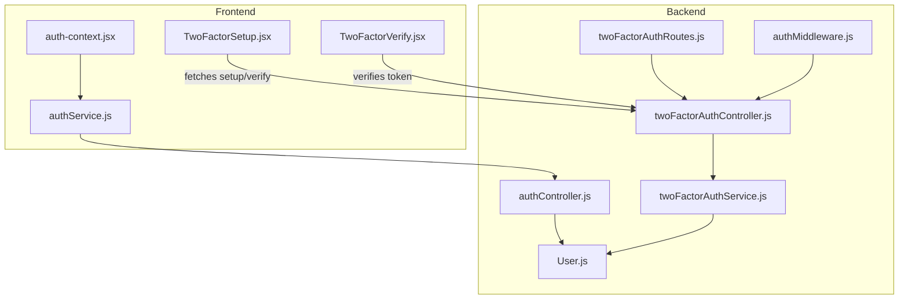
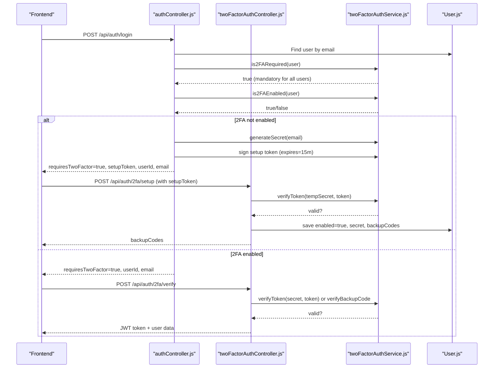
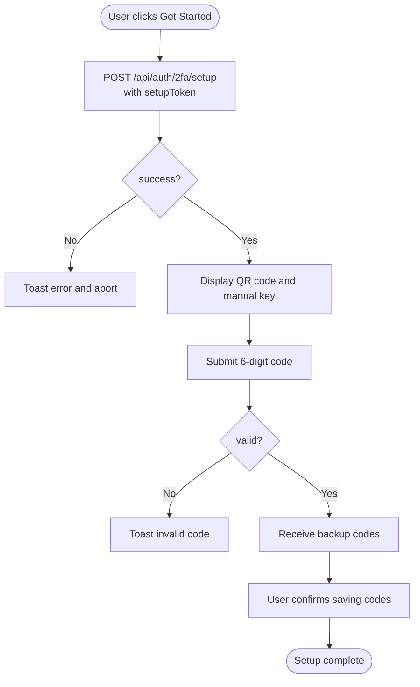
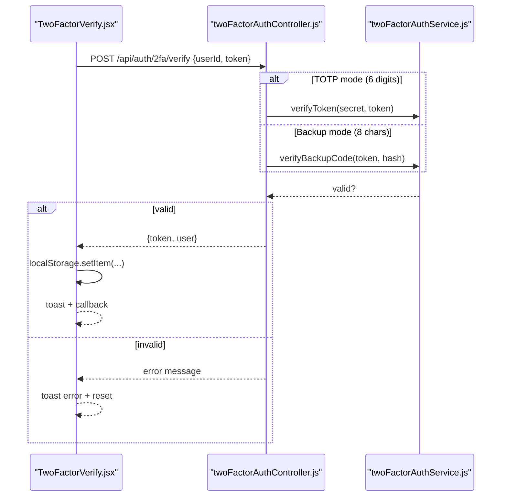
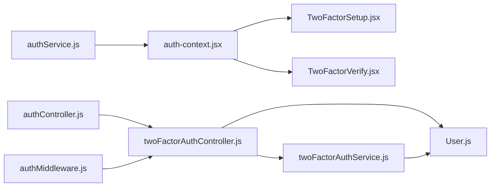

# Multi-Factor Authentication (2FA)

<cite>
**Referenced Files in This Document**
- [TwoFactorSetup.jsx](file://Frontend/src/components/security/TwoFactorSetup.jsx)
- [TwoFactorVerify.jsx](file://Frontend/src/components/security/TwoFactorVerify.jsx)
- [auth-context.jsx](file://Frontend/src/context/auth-context.jsx)
- [authService.js](file://Frontend/src/services/authService.js)
- [twoFactorAuthController.js](file://backend/src/controllers/twoFactorAuthController.js)
- [twoFactorAuthService.js](file://backend/src/services/twoFactorAuthService.js)
- [twoFactorAuthRoutes.js](file://backend/src/routes/twoFactorAuthRoutes.js)
- [authMiddleware.js](file://backend/src/middleware/authMiddleware.js)
- [authController.js](file://backend/src/controllers/authController.js)
- [User.js](file://backend/src/models/User.js)
- [test-2fa-auth.js](file://backend/test-2fa-auth.js)
- [test-core-2fa.js](file://backend/test-core-2fa.js)
- [2FA_VALIDATION_REPORT.md](file://2FA_VALIDATION_REPORT.md)
</cite>

## Table of Contents
1. [Introduction](#introduction)
2. [Project Structure](#project-structure)
3. [Core Components](#core-components)
4. [Architecture Overview](#architecture-overview)
5. [Detailed Component Analysis](#detailed-component-analysis)
6. [Dependency Analysis](#dependency-analysis)
7. [Performance Considerations](#performance-considerations)
8. [Troubleshooting Guide](#troubleshooting-guide)
9. [Conclusion](#conclusion)

## Introduction
This document describes the multi-factor authentication (2FA) system for the SmartCity portal. It explains the mandatory 2FA requirement for citizen users, the end-to-end setup and verification workflows, the TOTP (Time-based One-Time Password) implementation, QR code generation, backup code creation, and the temporary setup tokens used during initial configuration. It also covers frontend components for 2FA setup and verification, error handling for invalid codes, user experience considerations, recovery scenarios, and administrative controls.

## Project Structure
The 2FA implementation spans frontend React components and backend Node.js services/controllers:

- Frontend:
  - Security components for 2FA setup and verification
  - Authentication context and service for login orchestration
- Backend:
  - Controllers for 2FA setup, verification, and management
  - Service layer implementing TOTP, QR code generation, and backup codes
  - Routes exposing 2FA endpoints
  - Authentication middleware and user model with 2FA fields

**Diagram sources**
- [authService.js:1-99](file://Frontend/src/services/authService.js#L1-L99)
- [auth-context.jsx:1-143](file://Frontend/src/context/auth-context.jsx#L1-L143)
- [TwoFactorSetup.jsx:1-395](file://Frontend/src/components/security/TwoFactorSetup.jsx#L1-L395)
- [TwoFactorVerify.jsx:1-200](file://Frontend/src/components/security/TwoFactorVerify.jsx#L1-L200)
- [authController.js:1-237](file://backend/src/controllers/authController.js#L1-L237)
- [twoFactorAuthController.js:1-453](file://backend/src/controllers/twoFactorAuthController.js#L1-L453)
- [twoFactorAuthService.js:1-152](file://backend/src/services/twoFactorAuthService.js#L1-L152)
- [twoFactorAuthRoutes.js:1-63](file://backend/src/routes/twoFactorAuthRoutes.js#L1-L63)
- [authMiddleware.js:1-114](file://backend/src/middleware/authMiddleware.js#L1-L114)
- [User.js:1-165](file://backend/src/models/User.js#L1-L165)

**Section sources**
- [authService.js:1-99](file://Frontend/src/services/authService.js#L1-L99)
- [auth-context.jsx:1-143](file://Frontend/src/context/auth-context.jsx#L1-L143)
- [TwoFactorSetup.jsx:1-395](file://Frontend/src/components/security/TwoFactorSetup.jsx#L1-L395)
- [TwoFactorVerify.jsx:1-200](file://Frontend/src/components/security/TwoFactorVerify.jsx#L1-L200)
- [authController.js:1-237](file://backend/src/controllers/authController.js#L1-L237)
- [twoFactorAuthController.js:1-453](file://backend/src/controllers/twoFactorAuthController.js#L1-L453)
- [twoFactorAuthService.js:1-152](file://backend/src/services/twoFactorAuthService.js#L1-L152)
- [twoFactorAuthRoutes.js:1-63](file://backend/src/routes/twoFactorAuthRoutes.js#L1-L63)
- [authMiddleware.js:1-114](file://backend/src/middleware/authMiddleware.js#L1-L114)
- [User.js:1-165](file://backend/src/models/User.js#L1-L165)

## Core Components
- Frontend 2FA Setup Component:
  - Initializes 2FA setup and receives QR code and secret
  - Verifies the initial TOTP code
  - Generates and displays backup codes
  - Supports copy/download actions for backup codes
- Frontend 2FA Verification Component:
  - Accepts either TOTP codes (6 digits) or backup codes (8 characters)
  - Handles switching between modes
  - Saves tokens and user data upon successful verification
- Backend 2FA Controller:
  - Generates secrets and QR URLs
  - Verifies setup tokens and enables 2FA
  - Verifies login-time tokens (TOTP or backup codes)
  - Manages disabling 2FA and regenerating backup codes
- 2FA Service:
  - Implements TOTP generation/verification with a configurable time window
  - Creates QR codes from otpauth URLs
  - Generates and hashes backup codes
  - Enforces mandatory 2FA for all users
- Authentication Controller:
  - Orchestrates login flow and triggers 2FA when required
  - Issues short-lived setup tokens for new 2FA configurations
- User Model:
  - Stores 2FA state, secret, temp secret, backup codes, and timestamps

**Section sources**
- [TwoFactorSetup.jsx:1-395](file://Frontend/src/components/security/TwoFactorSetup.jsx#L1-L395)
- [TwoFactorVerify.jsx:1-200](file://Frontend/src/components/security/TwoFactorVerify.jsx#L1-L200)
- [twoFactorAuthController.js:1-453](file://backend/src/controllers/twoFactorAuthController.js#L1-L453)
- [twoFactorAuthService.js:1-152](file://backend/src/services/twoFactorAuthService.js#L1-L152)
- [authController.js:1-237](file://backend/src/controllers/authController.js#L1-L237)
- [User.js:116-141](file://backend/src/models/User.js#L116-L141)

## Architecture Overview
The 2FA system enforces mandatory 2FA for all citizen users on every login attempt. The flow integrates with the existing authentication pipeline:

- On login, the backend checks if 2FA is required for the user (always true for citizens)
- If 2FA is not enabled, the backend issues a short-lived setup token and instructs the frontend to render the 2FA setup component
- If 2FA is enabled, the backend instructs the frontend to render the 2FA verification component
- After successful verification, the backend returns a long-lived JWT token and user data

**Diagram sources**
- [authController.js:153-190](file://backend/src/controllers/authController.js#L153-L190)
- [twoFactorAuthController.js:15-136](file://backend/src/controllers/twoFactorAuthController.js#L15-L136)
- [twoFactorAuthService.js:125-135](file://backend/src/services/twoFactorAuthService.js#L125-L135)
- [User.js:116-141](file://backend/src/models/User.js#L116-L141)

## Detailed Component Analysis

### Frontend: TwoFactorSetup Component
Responsibilities:
- Step 1: Initialize 2FA setup and receive QR code and secret
- Step 2: Verify the initial TOTP code and enable 2FA
- Step 3: Present and manage backup codes (copy/download)
- Error handling and user feedback via toast notifications

Key behaviors:
- Uses a setup token (temporary) when provided by the backend during login
- Generates QR code client-side from the otpauth URL returned by the backend
- Validates 6-digit TOTP codes before submission
- Copies secret and backup codes to clipboard and supports downloading backup codes

**Diagram sources**
- [TwoFactorSetup.jsx:32-127](file://Frontend/src/components/security/TwoFactorSetup.jsx#L32-L127)

**Section sources**
- [TwoFactorSetup.jsx:17-169](file://Frontend/src/components/security/TwoFactorSetup.jsx#L17-L169)

### Frontend: TwoFactorVerify Component
Responsibilities:
- Accepts either TOTP (6 digits) or backup code (8 characters)
- Switches between modes dynamically
- Submits verification to the backend and persists tokens and user data
- Provides user feedback and warnings

**Diagram sources**
- [TwoFactorVerify.jsx:21-100](file://Frontend/src/components/security/TwoFactorVerify.jsx#L21-L100)
- [twoFactorAuthController.js:143-265](file://backend/src/controllers/twoFactorAuthController.js#L143-L265)
- [twoFactorAuthService.js:102-105](file://backend/src/services/twoFactorAuthService.js#L102-L105)

**Section sources**
- [TwoFactorVerify.jsx:16-199](file://Frontend/src/components/security/TwoFactorVerify.jsx#L16-L199)

### Backend: 2FA Controller
Endpoints and responsibilities:
- POST /api/auth/2fa/setup: generates a temp secret and returns QR data
- POST /api/auth/2fa/verify-setup: verifies the setup code and enables 2FA with backup codes
- POST /api/auth/2fa/verify: verifies login-time tokens (TOTP or backup codes) and returns JWT
- POST /api/auth/2fa/disable: disables 2FA requiring password and current TOTP
- POST /api/auth/2fa/regenerate-backup-codes: regenerates backup codes with password verification
- GET /api/auth/2fa/status: reports 2FA status

Security highlights:
- Backup codes are hashed before storage and marked used upon verification
- Mandatory 2FA enforcement returns true for all users
- Time window for TOTP verification is configured

**Section sources**
- [twoFactorAuthController.js:15-453](file://backend/src/controllers/twoFactorAuthController.js#L15-L453)
- [twoFactorAuthRoutes.js:20-61](file://backend/src/routes/twoFactorAuthRoutes.js#L20-L61)

### 2FA Service Layer
Capabilities:
- Secret generation with issuer/name metadata
- QR code generation from otpauth URL
- TOTP verification with configurable time window
- Backup code generation and hashing
- 2FA requirement enforcement policy

**Section sources**
- [twoFactorAuthService.js:15-151](file://backend/src/services/twoFactorAuthService.js#L15-L151)

### Authentication Controller Integration
Behavior:
- Determines user role and checks 2FA requirement
- Issues short-lived setup tokens for new 2FA setups
- Redirects to 2FA verification when 2FA is already enabled
- Builds JWT tokens on successful verification

**Section sources**
- [authController.js:153-190](file://backend/src/controllers/authController.js#L153-L190)

### User Model: 2FA Schema
Fields:
- enabled: boolean flag
- secret: base32-encoded secret for TOTP
- tempSecret: temporary secret during setup
- backupCodes: array of hashed codes with used flags
- enabledAt: timestamp when 2FA was enabled

**Section sources**
- [User.js:116-141](file://backend/src/models/User.js#L116-L141)

## Dependency Analysis
The 2FA system exhibits clear separation of concerns:

- Frontend depends on:
  - authService for login orchestration
  - Context for user state
  - Security components for UI flows
- Backend controllers depend on:
  - Services for cryptographic operations
  - Middleware for authentication
  - Models for persistence

**Diagram sources**
- [authService.js:1-99](file://Frontend/src/services/authService.js#L1-L99)
- [auth-context.jsx:1-143](file://Frontend/src/context/auth-context.jsx#L1-L143)
- [TwoFactorSetup.jsx:1-395](file://Frontend/src/components/security/TwoFactorSetup.jsx#L1-L395)
- [TwoFactorVerify.jsx:1-200](file://Frontend/src/components/security/TwoFactorVerify.jsx#L1-L200)
- [authController.js:1-237](file://backend/src/controllers/authController.js#L1-L237)
- [twoFactorAuthController.js:1-453](file://backend/src/controllers/twoFactorAuthController.js#L1-L453)
- [twoFactorAuthService.js:1-152](file://backend/src/services/twoFactorAuthService.js#L1-L152)
- [User.js:1-165](file://backend/src/models/User.js#L1-L165)
- [authMiddleware.js:1-114](file://backend/src/middleware/authMiddleware.js#L1-L114)

**Section sources**
- [authService.js:1-99](file://Frontend/src/services/authService.js#L1-L99)
- [auth-context.jsx:1-143](file://Frontend/src/context/auth-context.jsx#L1-L143)
- [TwoFactorSetup.jsx:1-395](file://Frontend/src/components/security/TwoFactorSetup.jsx#L1-L395)
- [TwoFactorVerify.jsx:1-200](file://Frontend/src/components/security/TwoFactorVerify.jsx#L1-L200)
- [authController.js:1-237](file://backend/src/controllers/authController.js#L1-L237)
- [twoFactorAuthController.js:1-453](file://backend/src/controllers/twoFactorAuthController.js#L1-L453)
- [twoFactorAuthService.js:1-152](file://backend/src/services/twoFactorAuthService.js#L1-L152)
- [User.js:1-165](file://backend/src/models/User.js#L1-L165)
- [authMiddleware.js:1-114](file://backend/src/middleware/authMiddleware.js#L1-L114)

## Performance Considerations
- TOTP verification uses a small time window to accommodate clock drift; ensure system time synchronization.
- Backup code verification compares hashed values; consider indexing hashed backups for large datasets.
- QR code generation is performed server-side and returned as a data URL; client-side rendering is lightweight.
- Rate limiting is not currently implemented at the 2FA endpoints; consider adding rate limiting to mitigate brute-force attempts.

[No sources needed since this section provides general guidance]

## Troubleshooting Guide
Common issues and resolutions:
- Invalid verification code:
  - Ensure the authenticator app time is synchronized
  - Confirm the 6-digit TOTP code length
  - For backup codes, ensure 8-character uppercase input
- Setup failures:
  - Verify the setup token is fresh (short-lived)
  - Confirm the QR code is scanned or the manual key is entered correctly
- Backup code usage:
  - Each backup code is single-use; after use, it is marked and cannot be reused
  - Regenerate backup codes if needed via the dedicated endpoint
- Brute force protection:
  - No built-in rate limiting; consider implementing IP-based or user-based limits
- Session and state:
  - After successful verification, the frontend stores the JWT and user data in local storage
  - If the user state does not update, check for storage change listeners and network errors

**Section sources**
- [TwoFactorVerify.jsx:21-100](file://Frontend/src/components/security/TwoFactorVerify.jsx#L21-L100)
- [twoFactorAuthController.js:179-195](file://backend/src/controllers/twoFactorAuthController.js#L179-L195)
- [2FA_VALIDATION_REPORT.md:74-76](file://2FA_VALIDATION_REPORT.md#L74-L76)

## Conclusion
The 2FA implementation enforces mandatory 2FA for all citizen users on every login, ensuring robust security. The system supports TOTP via QR code generation, backup codes for recovery, and seamless integration with the existing authentication flow. While the core functionality is validated and production-ready, future enhancements such as rate limiting and session management would further improve resilience and user experience.