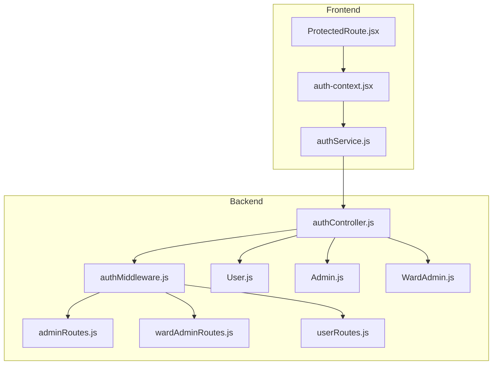
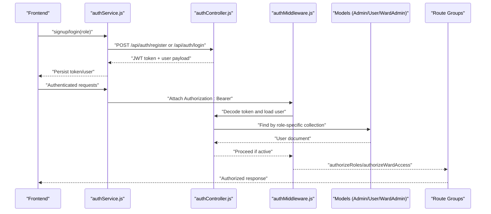
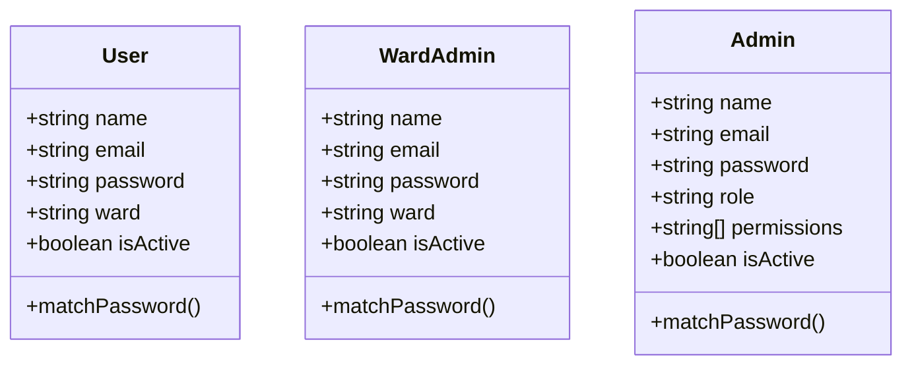
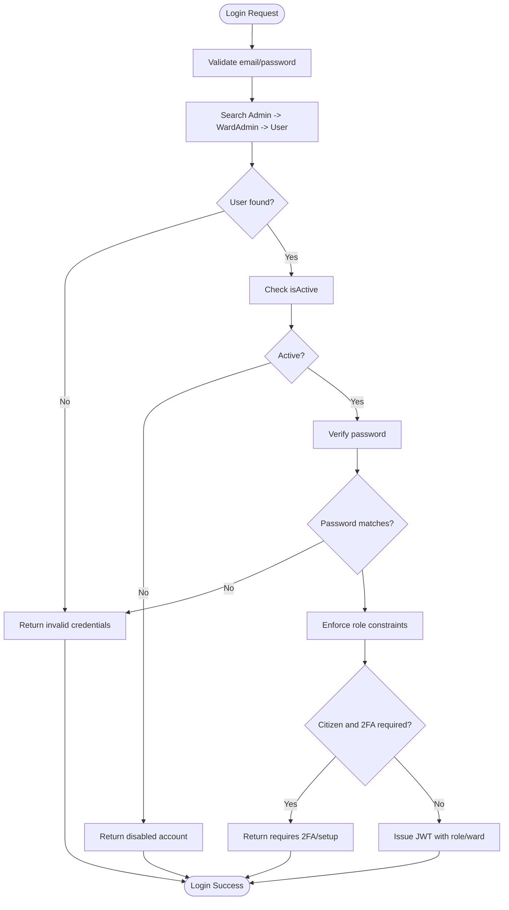
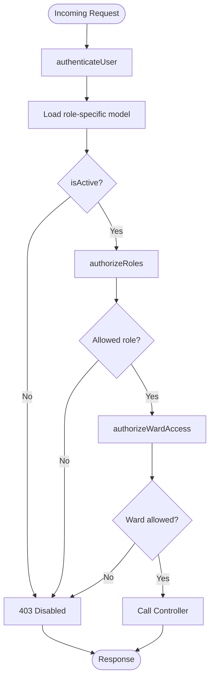
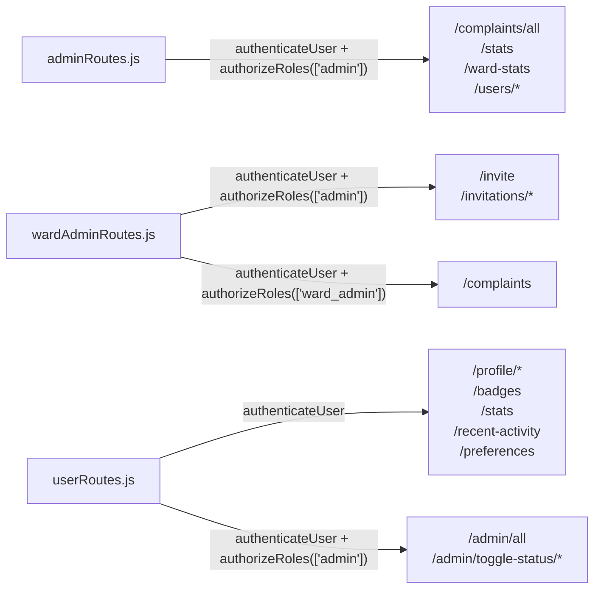
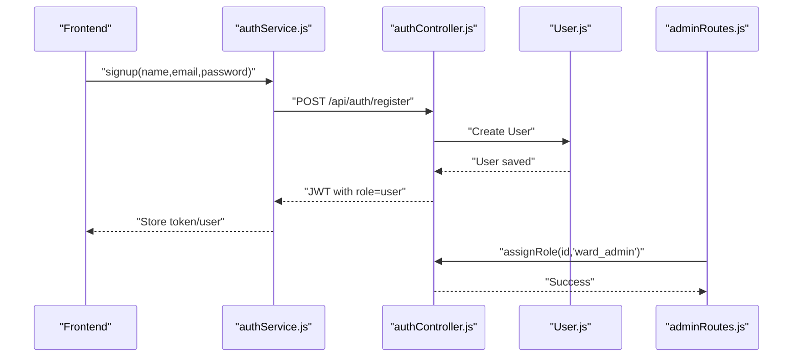
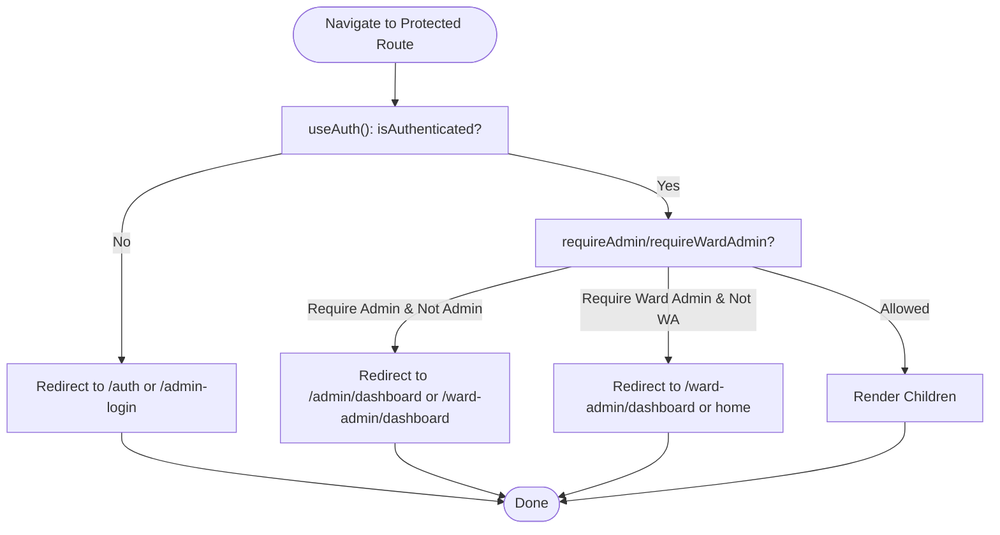
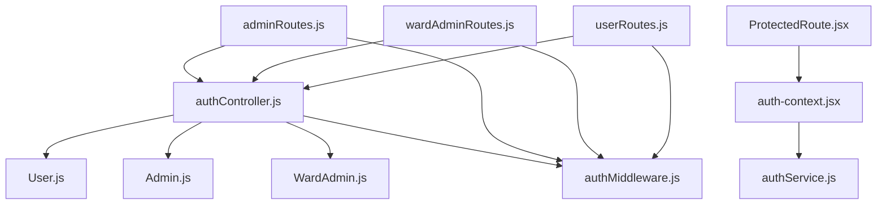

# Role-Based Access Control (RBAC)

<cite>
**Referenced Files in This Document**
- [authController.js](file://backend/src/controllers/authController.js)
- [authMiddleware.js](file://backend/src/middleware/authMiddleware.js)
- [User.js](file://backend/src/models/User.js)
- [Admin.js](file://backend/src/models/Admin.js)
- [WardAdmin.js](file://backend/src/models/WardAdmin.js)
- [auth-context.jsx](file://Frontend/src/context/auth-context.jsx)
- [ProtectedRoute.jsx](file://Frontend/src/components/ProtectedRoute.jsx)
- [authService.js](file://Frontend/src/services/authService.js)
- [adminRoutes.js](file://backend/src/routes/adminRoutes.js)
- [wardAdminRoutes.js](file://backend/src/routes/wardAdminRoutes.js)
- [userRoutes.js](file://backend/src/routes/userRoutes.js)
</cite>

## Table of Contents
1. [Introduction](#introduction)
2. [Project Structure](#project-structure)
3. [Core Components](#core-components)
4. [Architecture Overview](#architecture-overview)
5. [Detailed Component Analysis](#detailed-component-analysis)
6. [Dependency Analysis](#dependency-analysis)
7. [Performance Considerations](#performance-considerations)
8. [Troubleshooting Guide](#troubleshooting-guide)
9. [Conclusion](#conclusion)

## Introduction
This document describes the role-based access control (RBAC) system implemented in the Smart City Voice Reporting platform. It covers the three-tier role hierarchy (user/citizen, ward_admin, admin), role validation during login, middleware enforcement of access restrictions, and route protection mechanisms. It also documents the user registration process, automatic role assignment, role upgrade/downgrade procedures, protected route implementation, frontend role checking, and dynamic UI rendering based on user roles. Examples of role-specific API access, administrative privileges, and security boundaries between user types are included.

## Project Structure
The RBAC system spans both backend and frontend:
- Backend: Authentication controller, role-aware middleware, Mongoose models for each role, and route groups enforcing role-based access.
- Frontend: Authentication context, protected route wrapper, and service layer for API communication.

**Diagram sources**
- [authController.js:1-237](file://backend/src/controllers/authController.js#L1-L237)
- [authMiddleware.js:1-114](file://backend/src/middleware/authMiddleware.js#L1-L114)
- [User.js:1-165](file://backend/src/models/User.js#L1-L165)
- [Admin.js:1-55](file://backend/src/models/Admin.js#L1-L55)
- [WardAdmin.js:1-61](file://backend/src/models/WardAdmin.js#L1-L61)
- [adminRoutes.js:1-40](file://backend/src/routes/adminRoutes.js#L1-L40)
- [wardAdminRoutes.js:1-28](file://backend/src/routes/wardAdminRoutes.js#L1-L28)
- [userRoutes.js:1-51](file://backend/src/routes/userRoutes.js#L1-L51)
- [auth-context.jsx:1-143](file://Frontend/src/context/auth-context.jsx#L1-L143)
- [ProtectedRoute.jsx:1-47](file://Frontend/src/components/ProtectedRoute.jsx#L1-L47)
- [authService.js:1-99](file://Frontend/src/services/authService.js#L1-L99)

**Section sources**
- [authController.js:1-237](file://backend/src/controllers/authController.js#L1-L237)
- [authMiddleware.js:1-114](file://backend/src/middleware/authMiddleware.js#L1-L114)
- [User.js:1-165](file://backend/src/models/User.js#L1-L165)
- [Admin.js:1-55](file://backend/src/models/Admin.js#L1-L55)
- [WardAdmin.js:1-61](file://backend/src/models/WardAdmin.js#L1-L61)
- [adminRoutes.js:1-40](file://backend/src/routes/adminRoutes.js#L1-L40)
- [wardAdminRoutes.js:1-28](file://backend/src/routes/wardAdminRoutes.js#L1-L28)
- [userRoutes.js:1-51](file://backend/src/routes/userRoutes.js#L1-L51)
- [auth-context.jsx:1-143](file://Frontend/src/context/auth-context.jsx#L1-L143)
- [ProtectedRoute.jsx:1-47](file://Frontend/src/components/ProtectedRoute.jsx#L1-L47)
- [authService.js:1-99](file://Frontend/src/services/authService.js#L1-L99)

## Core Components
- Role hierarchy:
  - user (citizen): default role for registrations; can access user routes and submit complaints.
  - ward_admin: assigned to a specific ward; can access ward-specific data and manage invitations.
  - admin (super admin): highest privilege; can manage users, complaints, and system announcements.
- Registration and login:
  - Registration creates a user in the citizens collection and assigns role "user".
  - Login searches across admin, ward_admin, and user collections and validates role and activation status.
- Middleware enforcement:
  - authenticateUser verifies JWT and loads the correct role-specific model.
  - authorizeRoles restricts routes to allowed roles.
  - authorizeWardAccess enforces ward boundaries for ward_admin.
- Route protection:
  - Routes are grouped under adminRoutes, wardAdminRoutes, and userRoutes with middleware applied.
- Frontend integration:
  - Auth context stores user role and exposes helpers for UI decisions.
  - ProtectedRoute enforces role-based navigation and redirects accordingly.

**Section sources**
- [authController.js:7-88](file://backend/src/controllers/authController.js#L7-L88)
- [authController.js:90-237](file://backend/src/controllers/authController.js#L90-L237)
- [authMiddleware.js:10-55](file://backend/src/middleware/authMiddleware.js#L10-L55)
- [authMiddleware.js:61-71](file://backend/src/middleware/authMiddleware.js#L61-L71)
- [authMiddleware.js:77-104](file://backend/src/middleware/authMiddleware.js#L77-L104)
- [adminRoutes.js:21-39](file://backend/src/routes/adminRoutes.js#L21-L39)
- [wardAdminRoutes.js:19-27](file://backend/src/routes/wardAdminRoutes.js#L19-L27)
- [userRoutes.js:35-48](file://backend/src/routes/userRoutes.js#L35-L48)
- [auth-context.jsx:99-102](file://Frontend/src/context/auth-context.jsx#L99-L102)
- [ProtectedRoute.jsx:5-44](file://Frontend/src/components/ProtectedRoute.jsx#L5-L44)

## Architecture Overview
The RBAC architecture ensures that:
- Tokens carry role claims and are verified centrally.
- Requests are routed through middleware to enforce role and ward boundaries.
- Frontend components and routes react to role changes for dynamic UI rendering.

**Diagram sources**
- [authService.js:37-75](file://Frontend/src/services/authService.js#L37-L75)
- [authController.js:90-237](file://backend/src/controllers/authController.js#L90-L237)
- [authMiddleware.js:10-55](file://backend/src/middleware/authMiddleware.js#L10-L55)
- [User.js:1-165](file://backend/src/models/User.js#L1-L165)
- [Admin.js:1-55](file://backend/src/models/Admin.js#L1-L55)
- [WardAdmin.js:1-61](file://backend/src/models/WardAdmin.js#L1-L61)
- [adminRoutes.js:21-39](file://backend/src/routes/adminRoutes.js#L21-L39)
- [wardAdminRoutes.js:19-27](file://backend/src/routes/wardAdminRoutes.js#L19-L27)
- [userRoutes.js:35-48](file://backend/src/routes/userRoutes.js#L35-L48)

## Detailed Component Analysis

### Role Hierarchy and Data Models
- user (citizen):
  - Stored in the User collection; no role field; role is inferred as "user" at runtime.
  - Includes ward assignment and engagement-related fields.
- ward_admin:
  - Stored in the WardAdmin collection; role is "ward_admin"; includes assigned ward.
- admin (super admin):
  - Stored in the Admin collection; role is "admin"; includes permissions array.

**Diagram sources**
- [User.js:4-165](file://backend/src/models/User.js#L4-L165)
- [WardAdmin.js:4-61](file://backend/src/models/WardAdmin.js#L4-L61)
- [Admin.js:4-55](file://backend/src/models/Admin.js#L4-L55)

**Section sources**
- [User.js:23-31](file://backend/src/models/User.js#L23-L31)
- [WardAdmin.js:23-32](file://backend/src/models/WardAdmin.js#L23-L32)
- [Admin.js:23-31](file://backend/src/models/Admin.js#L23-L31)

### Authentication and Role Validation During Login
- Login flow:
  - Searches admin, ward_admin, then user collections in that order.
  - Validates isActive and password.
  - Enforces role constraints based on requested role ("admin" vs "user").
  - Issues 2FA-required responses for citizens meeting criteria.
  - Issues JWT with role claim and optional ward for ward_admin.

**Diagram sources**
- [authController.js:90-237](file://backend/src/controllers/authController.js#L90-L237)

**Section sources**
- [authController.js:90-237](file://backend/src/controllers/authController.js#L90-L237)

### Middleware Enforcement: Authentication, Authorization, and Ward Access
- authenticateUser:
  - Verifies JWT and loads the correct role-specific model.
  - Sets req.user with role and checks isActive.
- authorizeRoles:
  - Restricts routes to allowed roles.
- authorizeWardAccess:
  - Super admin bypasses.
  - Ward admin access restricted to their assigned ward; injects req.wardFilter for downstream filtering.

**Diagram sources**
- [authMiddleware.js:10-55](file://backend/src/middleware/authMiddleware.js#L10-L55)
- [authMiddleware.js:61-71](file://backend/src/middleware/authMiddleware.js#L61-L71)
- [authMiddleware.js:77-104](file://backend/src/middleware/authMiddleware.js#L77-L104)

**Section sources**
- [authMiddleware.js:10-55](file://backend/src/middleware/authMiddleware.js#L10-L55)
- [authMiddleware.js:61-71](file://backend/src/middleware/authMiddleware.js#L61-L71)
- [authMiddleware.js:77-104](file://backend/src/middleware/authMiddleware.js#L77-L104)

### Route Protection Mechanisms
- adminRoutes:
  - Requires authentication and role "admin".
  - Protects grievance stats, user management, and system announcements.
- wardAdminRoutes:
  - Public invitation endpoints.
  - Protected endpoints for super admin to manage ward admins.
  - Protected endpoint for ward admins to access their ward complaints.
- userRoutes:
  - User self-service endpoints.
  - Super admin endpoints for managing users.

**Diagram sources**
- [adminRoutes.js:21-39](file://backend/src/routes/adminRoutes.js#L21-L39)
- [wardAdminRoutes.js:19-27](file://backend/src/routes/wardAdminRoutes.js#L19-L27)
- [userRoutes.js:19-51](file://backend/src/routes/userRoutes.js#L19-L51)

**Section sources**
- [adminRoutes.js:21-39](file://backend/src/routes/adminRoutes.js#L21-L39)
- [wardAdminRoutes.js:19-27](file://backend/src/routes/wardAdminRoutes.js#L19-L27)
- [userRoutes.js:19-51](file://backend/src/routes/userRoutes.js#L19-L51)

### User Registration, Automatic Role Assignment, and 2FA
- Registration:
  - Creates a citizen in the User collection and assigns role "user".
  - Issues JWT with role claim.
- Automatic role assignment:
  - Role is derived from the collection where the user is found during login.
- 2FA for citizens:
  - If required, login returns requiresTwoFactor with setupToken or verification prompt.
- Role upgrade/downgrade:
  - Implemented via user management endpoints under adminRoutes (assignRole, toggleUserStatus).

**Diagram sources**
- [authController.js:7-88](file://backend/src/controllers/authController.js#L7-L88)
- [User.js:1-165](file://backend/src/models/User.js#L1-L165)
- [adminRoutes.js:33](file://backend/src/routes/adminRoutes.js#L33)

**Section sources**
- [authController.js:7-88](file://backend/src/controllers/authController.js#L7-L88)
- [authController.js:144-151](file://backend/src/controllers/authController.js#L144-L151)
- [adminRoutes.js:33](file://backend/src/routes/adminRoutes.js#L33)

### Protected Route Implementation and Frontend Role Checking
- Frontend Auth Context:
  - Provides isAuthenticated, isAdmin, isWardAdmin, isManagement.
  - Persists tokens and user data in localStorage.
- ProtectedRoute:
  - Redirects unauthenticated users to appropriate login pages.
  - Enforces requireAdmin and requireWardAdmin flags.
  - Redirects admins to admin dashboard and ward admins to their dashboard.

**Diagram sources**
- [ProtectedRoute.jsx:5-44](file://Frontend/src/components/ProtectedRoute.jsx#L5-L44)
- [auth-context.jsx:99-102](file://Frontend/src/context/auth-context.jsx#L99-L102)

**Section sources**
- [auth-context.jsx:99-102](file://Frontend/src/context/auth-context.jsx#L99-L102)
- [ProtectedRoute.jsx:5-44](file://Frontend/src/components/ProtectedRoute.jsx#L5-L44)

### Dynamic UI Rendering Based on Roles
- The Auth Context exposes role flags (isAdmin, isWardAdmin, isManagement) enabling components to conditionally render menus, buttons, and sections.
- ProtectedRoute ensures navigational boundaries align with role capabilities.

**Section sources**
- [auth-context.jsx:99-102](file://Frontend/src/context/auth-context.jsx#L99-L102)
- [ProtectedRoute.jsx:5-44](file://Frontend/src/components/ProtectedRoute.jsx#L5-L44)

### Examples of Role-Specific API Access and Administrative Privileges
- Admin-only endpoints:
  - GET /admin/complaints/all
  - GET /admin/stats
  - GET /admin/ward-stats
  - GET /admin/users
  - PUT /admin/users/:id/assign-role
  - PATCH /admin/users/toggle-status/:id
  - POST /admin/announcement
- Ward admin-only endpoints:
  - GET /ward-admin/complaints
  - POST /ward-admin/invite (super admin only)
  - GET /ward-admin/invitations (super admin only)
- User-only endpoints:
  - GET /user/profile
  - GET /user/badges
  - GET /user/stats
  - GET /user/recent-activity
  - PATCH /user/preferences
  - GET /user/admin/all (super admin only)
  - PATCH /user/admin/toggle-status/:id (super admin only)

**Section sources**
- [adminRoutes.js:25-37](file://backend/src/routes/adminRoutes.js#L25-L37)
- [wardAdminRoutes.js:25-26](file://backend/src/routes/wardAdminRoutes.js#L25-L26)
- [userRoutes.js:19-51](file://backend/src/routes/userRoutes.js#L19-L51)

## Dependency Analysis
The RBAC system exhibits clear separation of concerns:
- Controllers depend on models and middleware.
- Routes depend on controllers and middleware.
- Frontend depends on services and context.
- Models encapsulate role-specific fields and methods.

**Diagram sources**
- [authController.js:1-237](file://backend/src/controllers/authController.js#L1-L237)
- [authMiddleware.js:1-114](file://backend/src/middleware/authMiddleware.js#L1-L114)
- [User.js:1-165](file://backend/src/models/User.js#L1-L165)
- [Admin.js:1-55](file://backend/src/models/Admin.js#L1-L55)
- [WardAdmin.js:1-61](file://backend/src/models/WardAdmin.js#L1-L61)
- [adminRoutes.js:1-40](file://backend/src/routes/adminRoutes.js#L1-L40)
- [wardAdminRoutes.js:1-28](file://backend/src/routes/wardAdminRoutes.js#L1-L28)
- [userRoutes.js:1-51](file://backend/src/routes/userRoutes.js#L1-L51)
- [auth-context.jsx:1-143](file://Frontend/src/context/auth-context.jsx#L1-L143)
- [ProtectedRoute.jsx:1-47](file://Frontend/src/components/ProtectedRoute.jsx#L1-L47)
- [authService.js:1-99](file://Frontend/src/services/authService.js#L1-L99)

**Section sources**
- [authController.js:1-237](file://backend/src/controllers/authController.js#L1-L237)
- [authMiddleware.js:1-114](file://backend/src/middleware/authMiddleware.js#L1-L114)
- [adminRoutes.js:1-40](file://backend/src/routes/adminRoutes.js#L1-L40)
- [wardAdminRoutes.js:1-28](file://backend/src/routes/wardAdminRoutes.js#L1-L28)
- [userRoutes.js:1-51](file://backend/src/routes/userRoutes.js#L1-L51)
- [auth-context.jsx:1-143](file://Frontend/src/context/auth-context.jsx#L1-L143)
- [ProtectedRoute.jsx:1-47](file://Frontend/src/components/ProtectedRoute.jsx#L1-L47)
- [authService.js:1-99](file://Frontend/src/services/authService.js#L1-L99)

## Performance Considerations
- Token verification occurs on every protected request; keep JWT_SECRET secure and consider short-lived tokens with refresh strategies if needed.
- Middleware performs a single role-specific lookup per request; ensure indexes on email and role-relevant fields.
- Model methods (matchPassword) rely on bcrypt; hashing cost is configured in models; avoid excessive re-hashing.

## Troubleshooting Guide
- 401 Missing or invalid token:
  - Ensure Authorization header is present and formatted as "Bearer <token>".
- 403 Role not authorized:
  - Verify the user's role matches the route’s allowed roles.
- 403 Forbidden ward access:
  - Ward admins can only access data for their assigned ward; confirm the ward parameter matches the logged-in user's ward.
- Account disabled:
  - Confirm isActive flag in the appropriate collection.
- Login role mismatch:
  - Admin login attempts from non-admin accounts are rejected; use the correct login portal.

**Section sources**
- [authMiddleware.js:13-14](file://backend/src/middleware/authMiddleware.js#L13-L14)
- [authMiddleware.js:46-48](file://backend/src/middleware/authMiddleware.js#L46-L48)
- [authMiddleware.js:63-68](file://backend/src/middleware/authMiddleware.js#L63-L68)
- [authMiddleware.js:89-94](file://backend/src/middleware/authMiddleware.js#L89-L94)
- [authController.js:144-151](file://backend/src/controllers/authController.js#L144-L151)

## Conclusion
The RBAC system enforces a clear, layered security model:
- Role discovery during login and middleware enforcement ensure strict access control.
- Ward-level boundaries protect sensitive data for ward admins.
- Frontend integration provides seamless role-aware navigation and UI rendering.
- Administrative controls enable safe role upgrades/downgrades and user management.