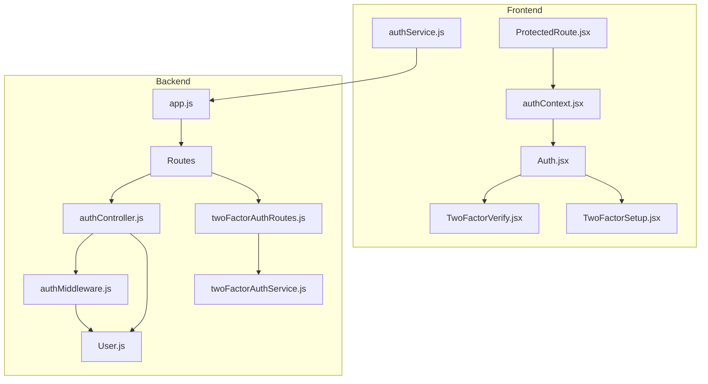
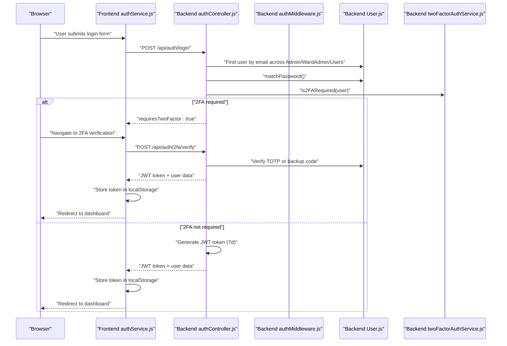
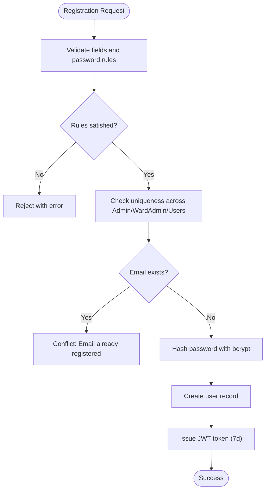
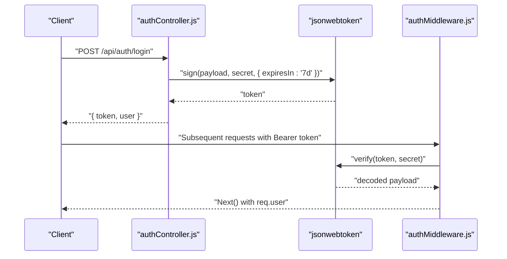
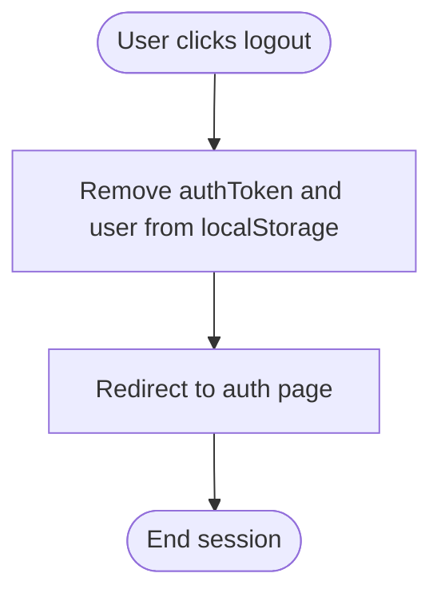
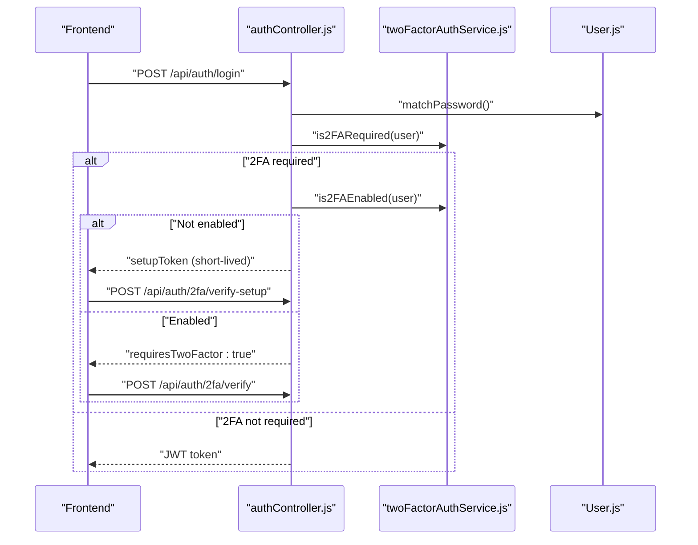
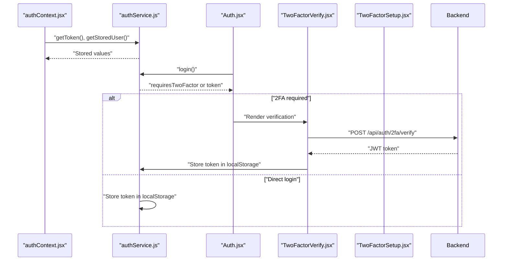
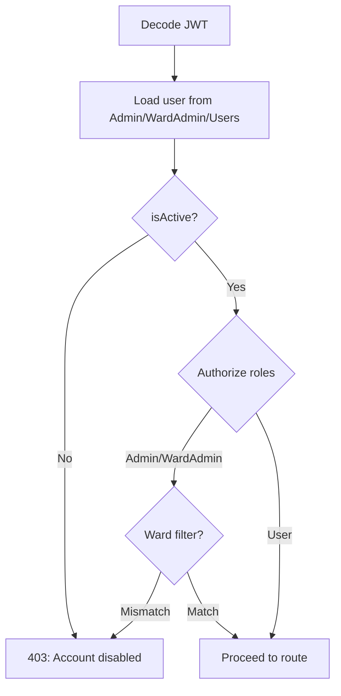
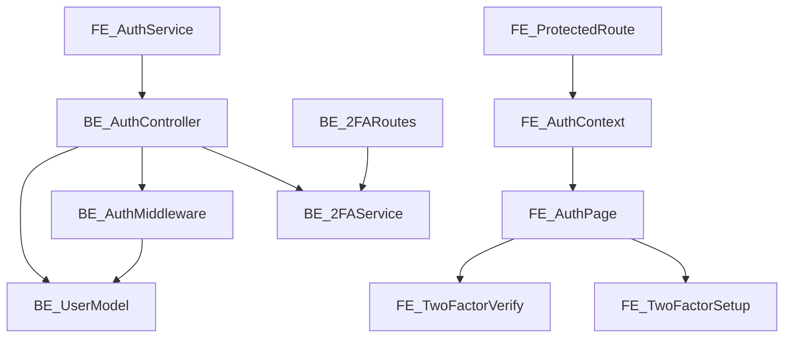

# Session Management & Security

<cite>
**Referenced Files in This Document**
- [authController.js](file://backend/src/controllers/authController.js)
- [authMiddleware.js](file://backend/src/middleware/authMiddleware.js)
- [User.js](file://backend/src/models/User.js)
- [twoFactorAuthService.js](file://backend/src/services/twoFactorAuthService.js)
- [twoFactorAuthRoutes.js](file://backend/src/routes/twoFactorAuthRoutes.js)
- [authContext.jsx](file://frontend/src/context/auth-context.jsx)
- [authService.js](file://frontend/src/services/authService.js)
- [Auth.jsx](file://frontend/src/pages/Auth.jsx)
- [TwoFactorVerify.jsx](file://frontend/src/components/security/TwoFactorVerify.jsx)
- [TwoFactorSetup.jsx](file://frontend/src/components/security/TwoFactorSetup.jsx)
- [ProtectedRoute.jsx](file://frontend/src/components/ProtectedRoute.jsx)
- [app.js](file://backend/src/app.js)
- [2FA_VALIDATION_REPORT.md](file://2FA_VALIDATION_REPORT.md)
- [test-2fa-consistency.js](file://test-2fa-consistency.js)
</cite>

## Table of Contents
1. [Introduction](#introduction)
2. [Project Structure](#project-structure)
3. [Core Components](#core-components)
4. [Architecture Overview](#architecture-overview)
5. [Detailed Component Analysis](#detailed-component-analysis)
6. [Dependency Analysis](#dependency-analysis)
7. [Performance Considerations](#performance-considerations)
8. [Troubleshooting Guide](#troubleshooting-guide)
9. [Conclusion](#conclusion)

## Introduction
This document provides comprehensive documentation for session management and security implementation in the Smart City Grievance Redressal System. It explains password hashing with bcrypt, password validation rules, and constraints preventing weak passwords. It documents session timeout handling, token expiration policies, and automatic logout mechanisms. Security measures covered include mandatory two-factor authentication (2FA) enforcement, rate limiting considerations, and account lockout policies. The document also details the password reset workflow, email verification processes, and security audit logging. Frontend session persistence, automatic token refresh, and secure cookie handling are addressed alongside common security vulnerabilities and mitigation strategies.

## Project Structure
The system follows a layered architecture with clear separation between backend Express server, MongoDB models, middleware, and frontend React application. Authentication and security logic spans both backend controllers and frontend services.

**Diagram sources**
- [app.js:28-71](file://backend/src/app.js#L28-L71)
- [authController.js:1-237](file://backend/src/controllers/authController.js#L1-L237)
- [authMiddleware.js:1-114](file://backend/src/middleware/authMiddleware.js#L1-L114)
- [User.js:1-165](file://backend/src/models/User.js#L1-L165)
- [twoFactorAuthRoutes.js:1-63](file://backend/src/routes/twoFactorAuthRoutes.js#L1-L63)
- [twoFactorAuthService.js:1-152](file://backend/src/services/twoFactorAuthService.js#L1-L152)
- [authService.js:1-99](file://frontend/src/services/authService.js#L1-L99)
- [authContext.jsx:1-143](file://frontend/src/context/auth-context.jsx#L1-L143)
- [Auth.jsx:1-443](file://frontend/src/pages/Auth.jsx#L1-L443)
- [TwoFactorVerify.jsx:1-200](file://frontend/src/components/security/TwoFactorVerify.jsx#L1-L200)
- [TwoFactorSetup.jsx:1-395](file://frontend/src/components/security/TwoFactorSetup.jsx#L1-L395)
- [ProtectedRoute.jsx:1-47](file://frontend/src/components/ProtectedRoute.jsx#L1-L47)

**Section sources**
- [app.js:28-71](file://backend/src/app.js#L28-L71)
- [authController.js:1-237](file://backend/src/controllers/authController.js#L1-L237)
- [authMiddleware.js:1-114](file://backend/src/middleware/authMiddleware.js#L1-L114)
- [User.js:1-165](file://backend/src/models/User.js#L1-L165)
- [twoFactorAuthRoutes.js:1-63](file://backend/src/routes/twoFactorAuthRoutes.js#L1-L63)
- [twoFactorAuthService.js:1-152](file://backend/src/services/twoFactorAuthService.js#L1-L152)
- [authService.js:1-99](file://frontend/src/services/authService.js#L1-L99)
- [authContext.jsx:1-143](file://frontend/src/context/auth-context.jsx#L1-L143)
- [Auth.jsx:1-443](file://frontend/src/pages/Auth.jsx#L1-L443)
- [TwoFactorVerify.jsx:1-200](file://frontend/src/components/security/TwoFactorVerify.jsx#L1-L200)
- [TwoFactorSetup.jsx:1-395](file://frontend/src/components/security/TwoFactorSetup.jsx#L1-L395)
- [ProtectedRoute.jsx:1-47](file://frontend/src/components/ProtectedRoute.jsx#L1-L47)

## Core Components
- Backend authentication controller handles registration and login with strict password validation and role-based access control.
- JWT-based session tokens are issued with a seven-day expiration and validated by middleware.
- User model enforces bcrypt password hashing and includes two-factor authentication fields.
- Two-factor authentication service enforces mandatory 2FA on every login attempt with TOTP and backup codes.
- Frontend authentication service persists tokens in localStorage and coordinates 2FA flows.
- Protected route component guards access based on authentication and role checks.

**Section sources**
- [authController.js:7-88](file://backend/src/controllers/authController.js#L7-L88)
- [authController.js:90-237](file://backend/src/controllers/authController.js#L90-L237)
- [authMiddleware.js:10-55](file://backend/src/middleware/authMiddleware.js#L10-L55)
- [User.js:146-156](file://backend/src/models/User.js#L146-L156)
- [twoFactorAuthService.js:125-135](file://backend/src/services/twoFactorAuthService.js#L125-L135)
- [authService.js:1-99](file://frontend/src/services/authService.js#L1-L99)
- [ProtectedRoute.jsx:5-44](file://frontend/src/components/ProtectedRoute.jsx#L5-L44)

## Architecture Overview
The authentication flow integrates frontend and backend components to provide secure user access with mandatory 2FA.

**Diagram sources**
- [authController.js:90-237](file://backend/src/controllers/authController.js#L90-L237)
- [authMiddleware.js:10-55](file://backend/src/middleware/authMiddleware.js#L10-L55)
- [User.js:146-156](file://backend/src/models/User.js#L146-L156)
- [twoFactorAuthService.js:125-135](file://backend/src/services/twoFactorAuthService.js#L125-L135)
- [authService.js:37-80](file://frontend/src/services/authService.js#L37-L80)
- [TwoFactorVerify.jsx:37-100](file://frontend/src/components/security/TwoFactorVerify.jsx#L37-L100)

## Detailed Component Analysis

### Password Hashing and Validation
- Password hashing: The User model uses bcrypt to hash passwords before saving, ensuring strong cryptographic protection.
- Password validation rules enforced during registration include length constraints and character requirements.
- Additional constraints prevent passwords from containing the email address.

**Diagram sources**
- [authController.js:7-88](file://backend/src/controllers/authController.js#L7-L88)
- [User.js:146-156](file://backend/src/models/User.js#L146-L156)

**Section sources**
- [authController.js:15-40](file://backend/src/controllers/authController.js#L15-L40)
- [User.js:146-156](file://backend/src/models/User.js#L146-L156)

### JWT Session Tokens and Expiration
- JWT tokens are generated with a seven-day expiration and carry user identity, role, and ward information.
- Authentication middleware verifies tokens and populates the request with the user object.
- Token validation errors result in unauthorized responses.

**Diagram sources**
- [authController.js:192-202](file://backend/src/controllers/authController.js#L192-L202)
- [authMiddleware.js:19-54](file://backend/src/middleware/authMiddleware.js#L19-L54)

**Section sources**
- [authController.js:58-68](file://backend/src/controllers/authController.js#L58-L68)
- [authController.js:192-202](file://backend/src/controllers/authController.js#L192-L202)
- [authMiddleware.js:19-54](file://backend/src/middleware/authMiddleware.js#L19-L54)

### Automatic Logout Mechanisms
- Frontend logout clears stored authentication token and user data from localStorage.
- Backend middleware rejects requests with invalid or expired tokens.
- Session timeout is effectively managed client-side via token expiration and absence of stored tokens.

**Diagram sources**
- [authService.js:82-85](file://frontend/src/services/authService.js#L82-L85)
- [authMiddleware.js:52-54](file://backend/src/middleware/authMiddleware.js#L52-L54)

**Section sources**
- [authService.js:82-85](file://frontend/src/services/authService.js#L82-L85)
- [authMiddleware.js:52-54](file://backend/src/middleware/authMiddleware.js#L52-L54)

### Two-Factor Authentication (2FA) Enforcement
- Mandatory 2FA is enforced on every login attempt for all users.
- If 2FA is not yet enabled, a short-lived setup token is issued for initial configuration.
- TOTP verification and backup codes are supported with robust validation.

**Diagram sources**
- [authController.js:153-190](file://backend/src/controllers/authController.js#L153-L190)
- [twoFactorAuthService.js:125-135](file://backend/src/services/twoFactorAuthService.js#L125-L135)
- [TwoFactorVerify.jsx:37-100](file://frontend/src/components/security/TwoFactorVerify.jsx#L37-L100)

**Section sources**
- [authController.js:153-190](file://backend/src/controllers/authController.js#L153-L190)
- [twoFactorAuthService.js:125-135](file://backend/src/services/twoFactorAuthService.js#L125-L135)
- [2FA_VALIDATION_REPORT.md:48-85](file://2FA_VALIDATION_REPORT.md#L48-L85)
- [test-2fa-consistency.js:1-85](file://test-2fa-consistency.js#L1-L85)

### Frontend Session Persistence and 2FA Flow
- Frontend stores JWT tokens and user data in localStorage upon successful authentication.
- The authentication context initializes state from stored data and listens for storage changes.
- The 2FA setup and verification components coordinate with backend endpoints to finalize authentication.

**Diagram sources**
- [authContext.jsx:10-27](file://frontend/src/context/auth-context.jsx#L10-L27)
- [authService.js:37-80](file://frontend/src/services/authService.js#L37-L80)
- [Auth.jsx:102-154](file://frontend/src/pages/Auth.jsx#L102-L154)
- [TwoFactorVerify.jsx:37-100](file://frontend/src/components/security/TwoFactorVerify.jsx#L37-L100)
- [TwoFactorSetup.jsx:36-75](file://frontend/src/components/security/TwoFactorSetup.jsx#L36-L75)

**Section sources**
- [authContext.jsx:10-27](file://frontend/src/context/auth-context.jsx#L10-L27)
- [authService.js:37-80](file://frontend/src/services/authService.js#L37-L80)
- [Auth.jsx:102-154](file://frontend/src/pages/Auth.jsx#L102-L154)
- [TwoFactorVerify.jsx:37-100](file://frontend/src/components/security/TwoFactorVerify.jsx#L37-L100)
- [TwoFactorSetup.jsx:36-75](file://frontend/src/components/security/TwoFactorSetup.jsx#L36-L75)

### Role-Based Access Control and Ward Filtering
- Authentication middleware resolves user identity from the JWT and loads the appropriate collection.
- Authorization middleware enforces role-based access and restricts ward_admin access to their assigned ward.

**Diagram sources**
- [authMiddleware.js:26-104](file://backend/src/middleware/authMiddleware.js#L26-L104)

**Section sources**
- [authMiddleware.js:26-104](file://backend/src/middleware/authMiddleware.js#L26-L104)

### Security Measures: CSRF Protection, Rate Limiting, and Account Lockout
- CSRF protection: Not implemented in the current codebase. Consider integrating CSRF tokens or SameSite cookies for enhanced protection.
- Rate limiting: Not implemented in the current codebase. Implement rate limiting for login and 2FA verification endpoints to mitigate brute-force attacks.
- Account lockout: Not implemented in the current codebase. Implement failed attempt tracking and temporary lockout mechanisms.

[No sources needed since this section provides general guidance]

### Password Reset Workflow and Email Verification
- Password reset workflow: Not implemented in the current codebase. Implement a secure password reset flow with time-limited tokens and email verification.
- Email verification: Not implemented in the current codebase. Implement email verification during registration and password reset.

[No sources needed since this section provides general guidance]

### Security Audit Logging
- Security audit logging: Not implemented in the current codebase. Implement centralized logging for authentication events, failed attempts, and administrative actions.

[No sources needed since this section provides general guidance]

### Secure Cookie Handling
- Secure cookie handling: Not implemented in the current codebase. The frontend currently uses localStorage for tokens. Consider migrating to HttpOnly cookies with SameSite and Secure attributes for enhanced protection.

[No sources needed since this section provides general guidance]

## Dependency Analysis
The authentication system exhibits low coupling between frontend and backend components, with clear separation of concerns. The backend controllers depend on models and services, while the frontend depends on services and context providers.

**Diagram sources**
- [authService.js:1-99](file://frontend/src/services/authService.js#L1-L99)
- [authController.js:1-237](file://backend/src/controllers/authController.js#L1-L237)
- [authMiddleware.js:1-114](file://backend/src/middleware/authMiddleware.js#L1-L114)
- [User.js:1-165](file://backend/src/models/User.js#L1-L165)
- [twoFactorAuthService.js:1-152](file://backend/src/services/twoFactorAuthService.js#L1-L152)
- [twoFactorAuthRoutes.js:1-63](file://backend/src/routes/twoFactorAuthRoutes.js#L1-L63)
- [authContext.jsx:1-143](file://frontend/src/context/auth-context.jsx#L1-L143)
- [Auth.jsx:1-443](file://frontend/src/pages/Auth.jsx#L1-L443)
- [TwoFactorVerify.jsx:1-200](file://frontend/src/components/security/TwoFactorVerify.jsx#L1-L200)
- [TwoFactorSetup.jsx:1-395](file://frontend/src/components/security/TwoFactorSetup.jsx#L1-L395)
- [ProtectedRoute.jsx:1-47](file://frontend/src/components/ProtectedRoute.jsx#L1-L47)

**Section sources**
- [authService.js:1-99](file://frontend/src/services/authService.js#L1-L99)
- [authController.js:1-237](file://backend/src/controllers/authController.js#L1-L237)
- [authMiddleware.js:1-114](file://backend/src/middleware/authMiddleware.js#L1-L114)
- [User.js:1-165](file://backend/src/models/User.js#L1-L165)
- [twoFactorAuthService.js:1-152](file://backend/src/services/twoFactorAuthService.js#L1-L152)
- [twoFactorAuthRoutes.js:1-63](file://backend/src/routes/twoFactorAuthRoutes.js#L1-L63)
- [authContext.jsx:1-143](file://frontend/src/context/auth-context.jsx#L1-L143)
- [Auth.jsx:1-443](file://frontend/src/pages/Auth.jsx#L1-L443)
- [TwoFactorVerify.jsx:1-200](file://frontend/src/components/security/TwoFactorVerify.jsx#L1-L200)
- [TwoFactorSetup.jsx:1-395](file://frontend/src/components/security/TwoFactorSetup.jsx#L1-L395)
- [ProtectedRoute.jsx:1-47](file://frontend/src/components/ProtectedRoute.jsx#L1-L47)

## Performance Considerations
- Token verification occurs on every protected request; ensure efficient middleware implementation and consider caching decoded tokens for short periods.
- Password hashing uses bcrypt with a fixed cost factor; maintain balance between security and performance.
- 2FA verification adds latency; optimize QR code generation and TOTP validation for responsive user experience.

[No sources needed since this section provides general guidance]

## Troubleshooting Guide
- Invalid or expired token: Ensure clients re-authenticate when tokens expire or become invalid.
- 2FA verification failures: Confirm correct time synchronization for TOTP and verify backup codes are not reused.
- Account disabled: Verify user.isActive flag and contact administrators for activation.
- Network errors: Confirm backend availability and CORS configuration.

**Section sources**
- [authMiddleware.js:52-54](file://backend/src/middleware/authMiddleware.js#L52-L54)
- [authController.js:133-136](file://backend/src/controllers/authController.js#L133-L136)
- [test-2fa-consistency.js:1-85](file://test-2fa-consistency.js#L1-L85)

## Conclusion
The system implements robust authentication with mandatory 2FA enforcement, bcrypt-based password hashing, and JWT-based session tokens with seven-day expiration. Frontend components persist tokens securely and orchestrate 2FA flows. While the current implementation provides strong foundational security, enhancements such as CSRF protection, rate limiting, account lockout policies, secure cookie handling, password reset workflows, and comprehensive audit logging are recommended for production hardening.