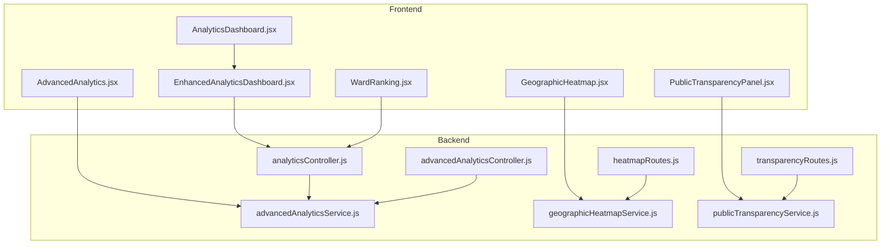
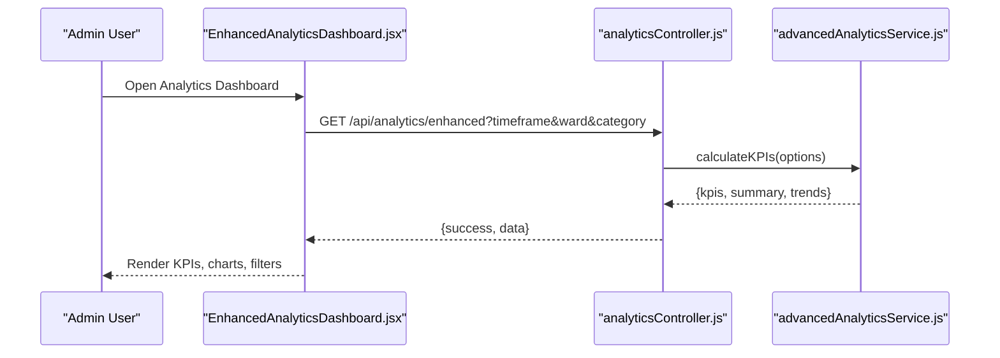
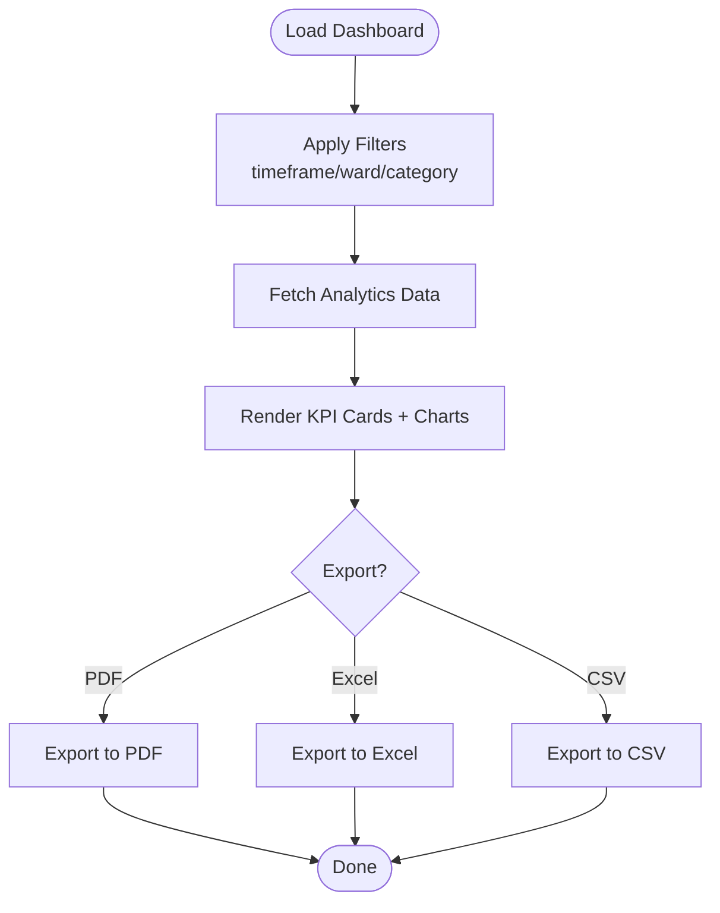
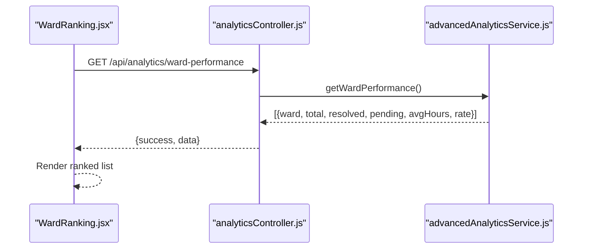
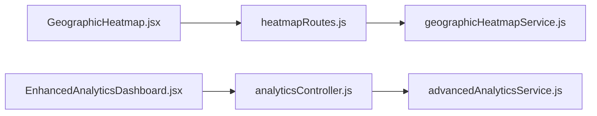
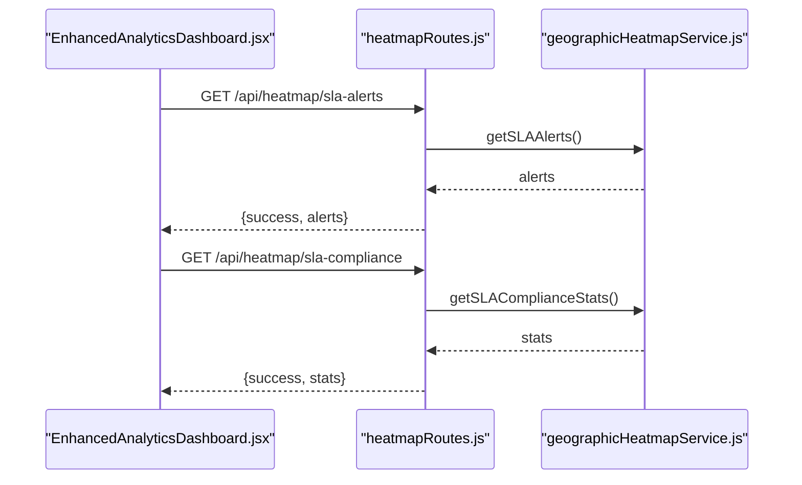
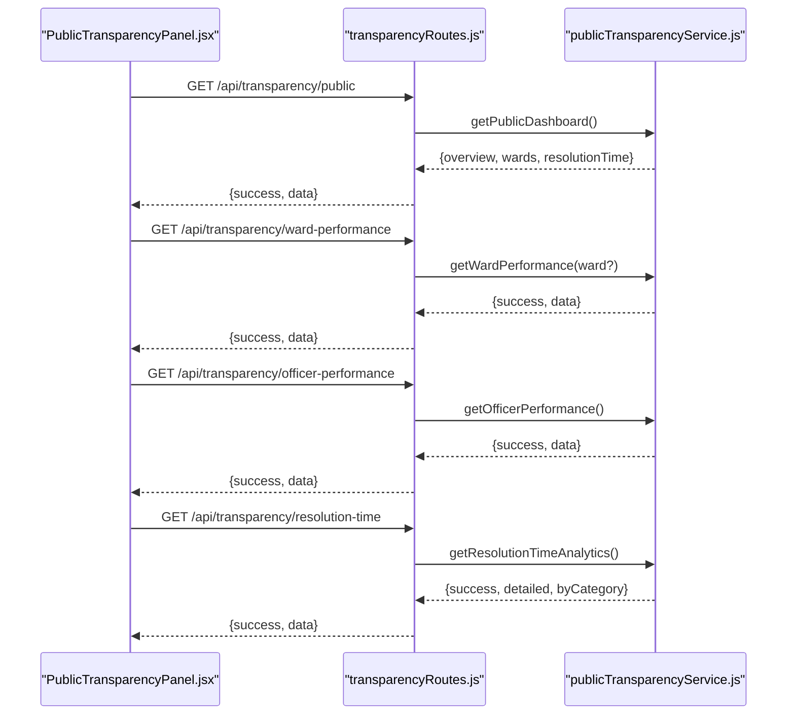
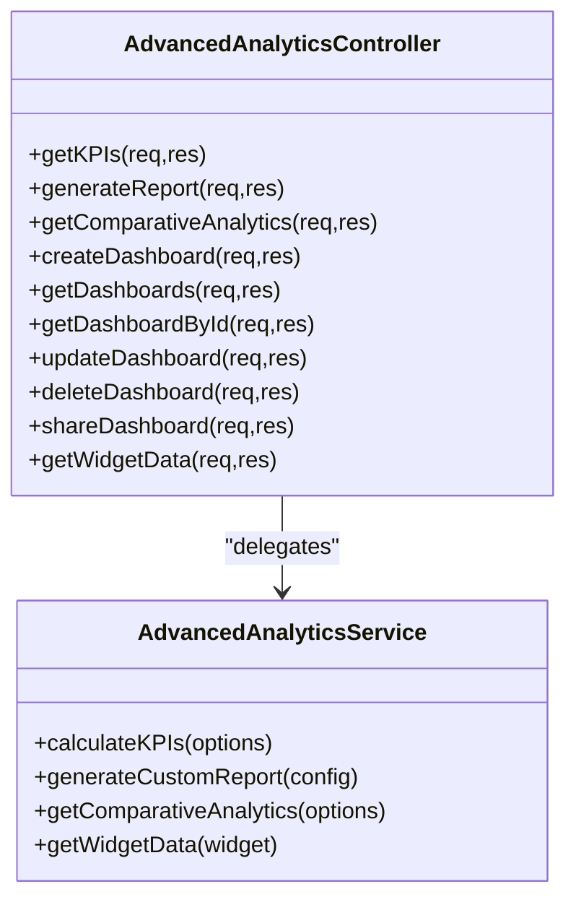
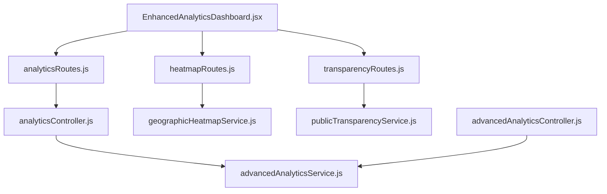

# Complaint Analytics and Reporting

<cite>
**Referenced Files in This Document**
- [AnalyticsDashboard.jsx](file://Frontend/src/pages/admin/AnalyticsDashboard.jsx)
- [EnhancedAnalyticsDashboard.jsx](file://Frontend/src/components/analytics/EnhancedAnalyticsDashboard.jsx)
- [AdvancedAnalytics.jsx](file://Frontend/src/components/analytics/AdvancedAnalytics.jsx)
- [WardRanking.jsx](file://Frontend/src/components/analytics/WardRanking.jsx)
- [GeographicHeatmap.jsx](file://Frontend/src/components/analytics/GeographicHeatmap.jsx)
- [PublicTransparencyPanel.jsx](file://Frontend/src/components/analytics/PublicTransparencyPanel.jsx)
- [analyticsController.js](file://backend/src/controllers/analyticsController.js)
- [advancedAnalyticsController.js](file://backend/src/controllers/advancedAnalyticsController.js)
- [analyticsRoutes.js](file://backend/src/routes/analyticsRoutes.js)
- [heatmapRoutes.js](file://backend/src/routes/heatmapRoutes.js)
- [transparencyRoutes.js](file://backend/src/routes/transparencyRoutes.js)
- [advancedAnalyticsService.js](file://backend/src/services/advancedAnalyticsService.js)
- [geographicHeatmapService.js](file://backend/src/services/geographicHeatmapService.js)
- [publicTransparencyService.js](file://backend/src/services/publicTransparencyService.js)
</cite>

## Table of Contents
1. [Introduction](#introduction)
2. [Project Structure](#project-structure)
3. [Core Components](#core-components)
4. [Architecture Overview](#architecture-overview)
5. [Detailed Component Analysis](#detailed-component-analysis)
6. [Dependency Analysis](#dependency-analysis)
7. [Performance Considerations](#performance-considerations)
8. [Troubleshooting Guide](#troubleshooting-guide)
9. [Conclusion](#conclusion)
10. [Appendices](#appendices)

## Introduction
This document describes the complaint analytics and reporting capabilities of the SmartCity platform. It covers administrative dashboards, statistics, SLA compliance, geographic heatmaps, public transparency, and export/reporting features. It also outlines backend APIs, data aggregation logic, and practical examples for configuring analytics queries, building dashboards, and exporting data for sharing.

## Project Structure
The analytics system spans frontend React components and backend Express routes/services. The frontend renders interactive dashboards and visualizations, while the backend exposes protected and public endpoints for data retrieval and computation.

**Diagram sources**
- [AnalyticsDashboard.jsx:1-24](file://Frontend/src/pages/admin/AnalyticsDashboard.jsx#L1-L24)
- [EnhancedAnalyticsDashboard.jsx:1-598](file://Frontend/src/components/analytics/EnhancedAnalyticsDashboard.jsx#L1-L598)
- [AdvancedAnalytics.jsx:1-120](file://Frontend/src/components/analytics/AdvancedAnalytics.jsx#L1-L120)
- [WardRanking.jsx:1-75](file://Frontend/src/components/analytics/WardRanking.jsx#L1-L75)
- [GeographicHeatmap.jsx:1-101](file://Frontend/src/components/analytics/GeographicHeatmap.jsx#L1-L101)
- [PublicTransparencyPanel.jsx:1-232](file://Frontend/src/components/analytics/PublicTransparencyPanel.jsx#L1-L232)
- [analyticsController.js:1-203](file://backend/src/controllers/analyticsController.js#L1-L203)
- [advancedAnalyticsController.js:1-397](file://backend/src/controllers/advancedAnalyticsController.js#L1-L397)
- [heatmapRoutes.js:1-68](file://backend/src/routes/heatmapRoutes.js#L1-L68)
- [transparencyRoutes.js:1-65](file://backend/src/routes/transparencyRoutes.js#L1-L65)
- [advancedAnalyticsService.js:1-532](file://backend/src/services/advancedAnalyticsService.js#L1-L532)
- [geographicHeatmapService.js:1-91](file://backend/src/services/geographicHeatmapService.js#L1-L91)
- [publicTransparencyService.js:1-222](file://backend/src/services/publicTransparencyService.js#L1-L222)

**Section sources**
- [AnalyticsDashboard.jsx:1-24](file://Frontend/src/pages/admin/AnalyticsDashboard.jsx#L1-L24)
- [EnhancedAnalyticsDashboard.jsx:1-598](file://Frontend/src/components/analytics/EnhancedAnalyticsDashboard.jsx#L1-L598)
- [AdvancedAnalytics.jsx:1-120](file://Frontend/src/components/analytics/AdvancedAnalytics.jsx#L1-L120)
- [WardRanking.jsx:1-75](file://Frontend/src/components/analytics/WardRanking.jsx#L1-L75)
- [GeographicHeatmap.jsx:1-101](file://Frontend/src/components/analytics/GeographicHeatmap.jsx#L1-L101)
- [PublicTransparencyPanel.jsx:1-232](file://Frontend/src/components/analytics/PublicTransparencyPanel.jsx#L1-L232)
- [analyticsController.js:1-203](file://backend/src/controllers/analyticsController.js#L1-L203)
- [advancedAnalyticsController.js:1-397](file://backend/src/controllers/advancedAnalyticsController.js#L1-L397)
- [analyticsRoutes.js:1-22](file://backend/src/routes/analyticsRoutes.js#L1-L22)
- [heatmapRoutes.js:1-68](file://backend/src/routes/heatmapRoutes.js#L1-L68)
- [transparencyRoutes.js:1-65](file://backend/src/routes/transparencyRoutes.js#L1-L65)
- [advancedAnalyticsService.js:1-532](file://backend/src/services/advancedAnalyticsService.js#L1-L532)
- [geographicHeatmapService.js:1-91](file://backend/src/services/geographicHeatmapService.js#L1-L91)
- [publicTransparencyService.js:1-222](file://backend/src/services/publicTransparencyService.js#L1-L222)

## Core Components
- Administrative Analytics Dashboard: Renders KPI cards, charts, filters, and export options. Supports timeframe selection, ward/category filters, and export to PDF/Excel/CSV.
- Advanced Analytics Module: Provides enhanced insights, KPI tracking, comparative analytics, and custom dashboard creation.
- Ward Ranking: Displays ranked wards by resolution rate with counts and average resolution time.
- Geographic Heatmap: Visualizes ward complaint density and status (normal/warning/critical).
- Public Transparency Panel: Public-facing dashboard with ward performance, officer scores, and resolution time analytics.
- Backend Controllers and Services: Compute KPIs, comparative analytics, heatmaps, and public transparency data via MongoDB aggregation pipelines.

**Section sources**
- [EnhancedAnalyticsDashboard.jsx:46-598](file://Frontend/src/components/analytics/EnhancedAnalyticsDashboard.jsx#L46-L598)
- [AdvancedAnalytics.jsx:17-120](file://Frontend/src/components/analytics/AdvancedAnalytics.jsx#L17-L120)
- [WardRanking.jsx:7-75](file://Frontend/src/components/analytics/WardRanking.jsx#L7-L75)
- [GeographicHeatmap.jsx:12-101](file://Frontend/src/components/analytics/GeographicHeatmap.jsx#L12-L101)
- [PublicTransparencyPanel.jsx:12-232](file://Frontend/src/components/analytics/PublicTransparencyPanel.jsx#L12-L232)
- [advancedAnalyticsController.js:15-85](file://backend/src/controllers/advancedAnalyticsController.js#L15-L85)
- [advancedAnalyticsService.js:87-207](file://backend/src/services/advancedAnalyticsService.js#L87-L207)
- [geographicHeatmapService.js:8-63](file://backend/src/services/geographicHeatmapService.js#L8-L63)
- [publicTransparencyService.js:12-62](file://backend/src/services/publicTransparencyService.js#L12-L62)

## Architecture Overview
The analytics architecture follows a layered pattern:
- Frontend: React components render dashboards and charts, manage filters, and export reports.
- Backend: Express routes delegate to services that compute analytics using MongoDB aggregation.
- Data: Complaints and users collections feed the analytics computations.

**Diagram sources**
- [EnhancedAnalyticsDashboard.jsx:57-85](file://Frontend/src/components/analytics/EnhancedAnalyticsDashboard.jsx#L57-L85)
- [analyticsController.js:8-53](file://backend/src/controllers/analyticsController.js#L8-L53)
- [advancedAnalyticsService.js:87-207](file://backend/src/services/advancedAnalyticsService.js#L87-L207)

## Detailed Component Analysis

### Administrative Dashboard Statistics
- Total complaints, resolved/pending counts, resolution rate, average resolution time, and active users are displayed via KPI cards.
- Filters: timeframe (7d/30d/90d/1y), ward, and category.
- Export: PDF, Excel, CSV with prebuilt sheets for summary, ward performance, and category analysis.

**Diagram sources**
- [EnhancedAnalyticsDashboard.jsx:46-184](file://Frontend/src/components/analytics/EnhancedAnalyticsDashboard.jsx#L46-L184)

**Section sources**
- [EnhancedAnalyticsDashboard.jsx:244-267](file://Frontend/src/components/analytics/EnhancedAnalyticsDashboard.jsx#L244-L267)
- [EnhancedAnalyticsDashboard.jsx:317-381](file://Frontend/src/components/analytics/EnhancedAnalyticsDashboard.jsx#L317-L381)
- [EnhancedAnalyticsDashboard.jsx:568-594](file://Frontend/src/components/analytics/EnhancedAnalyticsDashboard.jsx#L568-L594)

### Ward Performance Metrics and Ranking
- Ward ranking by resolution rate with counts of resolved/pending and average resolution time.
- Backend computes aggregated stats per ward and sorts by resolution rate.

**Diagram sources**
- [WardRanking.jsx:11-21](file://Frontend/src/components/analytics/WardRanking.jsx#L11-L21)
- [analyticsController.js:60-114](file://backend/src/controllers/analyticsController.js#L60-L114)
- [advancedAnalyticsService.js:322-418](file://backend/src/services/advancedAnalyticsService.js#L322-L418)

**Section sources**
- [WardRanking.jsx:36-66](file://Frontend/src/components/analytics/WardRanking.jsx#L36-L66)
- [analyticsController.js:60-114](file://backend/src/controllers/analyticsController.js#L60-L114)

### Ward-wise Complaint Distribution and Issue Type Categorization
- Ward distribution: heatmap-style grid with color-coded status (normal/warning/critical) and density score.
- Issue type categorization: pie chart of complaints by category; bar chart of category resolution rates; line chart of average resolution time by category.

**Diagram sources**
- [GeographicHeatmap.jsx:20-33](file://Frontend/src/components/analytics/GeographicHeatmap.jsx#L20-L33)
- [heatmapRoutes.js:20-27](file://backend/src/routes/heatmapRoutes.js#L20-L27)
- [geographicHeatmapService.js:8-63](file://backend/src/services/geographicHeatmapService.js#L8-L63)
- [EnhancedAnalyticsDashboard.jsx:431-527](file://Frontend/src/components/analytics/EnhancedAnalyticsDashboard.jsx#L431-L527)
- [analyticsController.js:165-202](file://backend/src/controllers/analyticsController.js#L165-L202)
- [advancedAnalyticsService.js:498-523](file://backend/src/services/advancedAnalyticsService.js#L498-L523)

**Section sources**
- [GeographicHeatmap.jsx:53-95](file://Frontend/src/components/analytics/GeographicHeatmap.jsx#L53-L95)
- [EnhancedAnalyticsDashboard.jsx:431-527](file://Frontend/src/components/analytics/EnhancedAnalyticsDashboard.jsx#L431-L527)

### Resolution Trend Analysis and SLA Compliance Tracking
- Monthly trends: stacked area chart of total vs resolved complaints over time.
- Historical trends: dual-axis line chart of complaint volume and resolution rate.
- SLA tracking: heatmap routes expose SLA alerts and compliance stats for real-time monitoring.

**Diagram sources**
- [EnhancedAnalyticsDashboard.jsx:530-565](file://Frontend/src/components/analytics/EnhancedAnalyticsDashboard.jsx#L530-L565)
- [heatmapRoutes.js:46-66](file://backend/src/routes/heatmapRoutes.js#L46-L66)
- [geographicHeatmapService.js:8-63](file://backend/src/services/geographicHeatmapService.js#L8-L63)

**Section sources**
- [EnhancedAnalyticsDashboard.jsx:530-565](file://Frontend/src/components/analytics/EnhancedAnalyticsDashboard.jsx#L530-L565)
- [heatmapRoutes.js:42-66](file://backend/src/routes/heatmapRoutes.js#L42-L66)

### Public Transparency Features
- Public dashboard overview: total/pending/resolved complaints and resolution rate.
- Ward performance: bar chart and summary cards.
- Officer performance: ranked scores and resolution metrics.
- Resolution time analytics: average hours by category and priority.

**Diagram sources**
- [PublicTransparencyPanel.jsx:19-51](file://Frontend/src/components/analytics/PublicTransparencyPanel.jsx#L19-L51)
- [transparencyRoutes.js:16-63](file://backend/src/routes/transparencyRoutes.js#L16-L63)
- [publicTransparencyService.js:180-221](file://backend/src/services/publicTransparencyService.js#L180-L221)

**Section sources**
- [PublicTransparencyPanel.jsx:72-101](file://Frontend/src/components/analytics/PublicTransparencyPanel.jsx#L72-L101)
- [PublicTransparencyPanel.jsx:110-158](file://Frontend/src/components/analytics/PublicTransparencyPanel.jsx#L110-L158)
- [PublicTransparencyPanel.jsx:161-198](file://Frontend/src/components/analytics/PublicTransparencyPanel.jsx#L161-L198)
- [PublicTransparencyPanel.jsx:200-226](file://Frontend/src/components/analytics/PublicTransparencyPanel.jsx#L200-L226)

### Advanced Analytics and Custom Dashboards
- KPI tracking: overall resolution rate, average resolution time, first response time, complaint volume, growth rate, satisfaction, reopen rate, staff productivity, SLA compliance.
- Comparative analytics: rank wards/categories by resolution rate or time.
- Custom dashboards: create, share, and manage dashboard widgets with granular permissions.

**Diagram sources**
- [advancedAnalyticsController.js:15-396](file://backend/src/controllers/advancedAnalyticsController.js#L15-L396)
- [advancedAnalyticsService.js:87-531](file://backend/src/services/advancedAnalyticsService.js#L87-L531)

**Section sources**
- [AdvancedAnalytics.jsx:48-105](file://Frontend/src/components/analytics/AdvancedAnalytics.jsx#L48-L105)
- [advancedAnalyticsController.js:15-85](file://backend/src/controllers/advancedAnalyticsController.js#L15-L85)
- [advancedAnalyticsService.js:14-82](file://backend/src/services/advancedAnalyticsService.js#L14-L82)

## Dependency Analysis
- Frontend dashboards depend on backend analytics endpoints and services.
- Backend routes enforce authentication and role-based authorization.
- Services encapsulate data computation using MongoDB aggregation pipelines.

**Diagram sources**
- [EnhancedAnalyticsDashboard.jsx:57-85](file://Frontend/src/components/analytics/EnhancedAnalyticsDashboard.jsx#L57-L85)
- [analyticsRoutes.js:12-19](file://backend/src/routes/analyticsRoutes.js#L12-L19)
- [heatmapRoutes.js:13-53](file://backend/src/routes/heatmapRoutes.js#L13-L53)
- [transparencyRoutes.js:12-63](file://backend/src/routes/transparencyRoutes.js#L12-L63)
- [analyticsController.js:8-53](file://backend/src/controllers/analyticsController.js#L8-L53)
- [geographicHeatmapService.js:8-63](file://backend/src/services/geographicHeatmapService.js#L8-L63)
- [publicTransparencyService.js:12-62](file://backend/src/services/publicTransparencyService.js#L12-L62)
- [advancedAnalyticsController.js:15-85](file://backend/src/controllers/advancedAnalyticsController.js#L15-L85)
- [advancedAnalyticsService.js:87-207](file://backend/src/services/advancedAnalyticsService.js#L87-L207)

**Section sources**
- [analyticsRoutes.js:12-19](file://backend/src/routes/analyticsRoutes.js#L12-L19)
- [heatmapRoutes.js:13-53](file://backend/src/routes/heatmapRoutes.js#L13-L53)
- [transparencyRoutes.js:12-63](file://backend/src/routes/transparencyRoutes.js#L12-L63)

## Performance Considerations
- Aggregation pipelines: Prefer server-side grouping and sorting to minimize payload sizes.
- Pagination and limits: Use limits for hotspot queries to cap result sets.
- Caching: Consider caching frequent dashboard queries with appropriate invalidation.
- Export performance: For large datasets, stream exports or paginate to avoid memory spikes.

## Troubleshooting Guide
- Authentication errors: Ensure the admin/ward_admin roles and valid auth tokens are present for protected endpoints.
- Empty or stale data: Verify filter parameters (timeframe, ward, category) and confirm backend aggregation results.
- Export failures: Confirm browser support for HTML-to-PDF conversion and file writing for Excel/CSV.

**Section sources**
- [analyticsRoutes.js:13-14](file://backend/src/routes/analyticsRoutes.js#L13-L14)
- [heatmapRoutes.js:13-14](file://backend/src/routes/heatmapRoutes.js#L13-L14)
- [transparencyRoutes.js:13-14](file://backend/src/routes/transparencyRoutes.js#L13-L14)
- [EnhancedAnalyticsDashboard.jsx:75-84](file://Frontend/src/components/analytics/EnhancedAnalyticsDashboard.jsx#L75-L84)

## Conclusion
The analytics system provides comprehensive administrative and public-facing insights into complaint trends, ward performance, geographic hotspots, and SLA compliance. It combines flexible filtering, rich visualizations, and robust export capabilities to support data-driven governance decisions.

## Appendices

### Example Analytics Queries and Dashboard Configurations
- KPIs endpoint: GET /api/analytics/kpis?startDate=&endDate=&ward=&category=&compareWithPrevious=true
- Comparative analytics: GET /api/analytics/comparative?compareBy=ward&metric=resolutionRate&startDate=&endDate=
- Custom report generation: POST /api/analytics/reports/generate with body containing reportType, dataSource, metrics, dimensions, filters, dateRange, format
- Custom dashboard: POST /api/analytics/dashboards with name, description, widgets, layout, category, isPublic, tags

**Section sources**
- [advancedAnalyticsController.js:15-85](file://backend/src/controllers/advancedAnalyticsController.js#L15-L85)
- [advancedAnalyticsController.js:43-58](file://backend/src/controllers/advancedAnalyticsController.js#L43-L58)
- [advancedAnalyticsController.js:92-129](file://backend/src/controllers/advancedAnalyticsController.js#L92-L129)

### Export Capabilities for Data Sharing
- PDF export: Capture dashboard DOM and convert to PDF using html2canvas and jspdf.
- Excel export: Build workbook with summary, ward performance, and category analysis sheets.
- CSV export: Generate CSV with key metrics and values.

**Section sources**
- [EnhancedAnalyticsDashboard.jsx:87-220](file://Frontend/src/components/analytics/EnhancedAnalyticsDashboard.jsx#L87-L220)