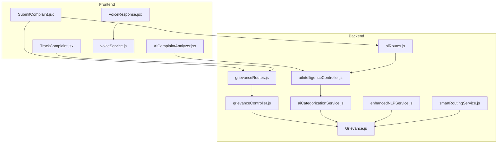
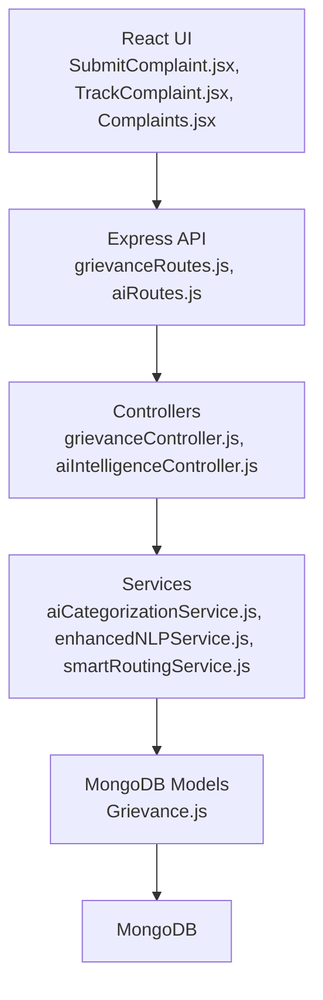
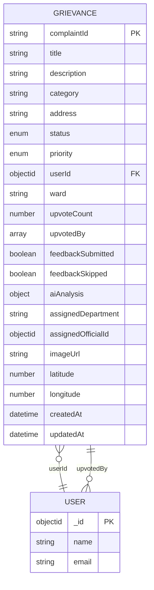
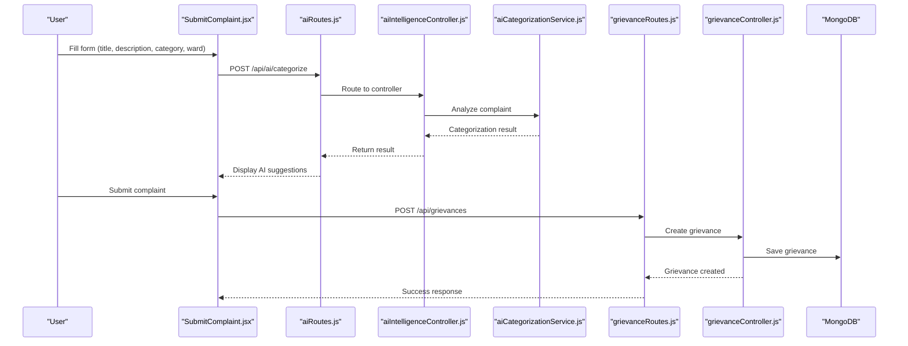
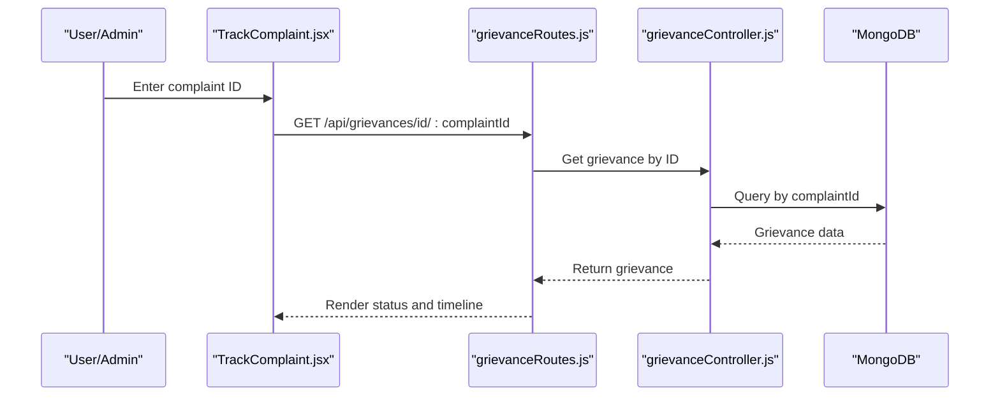
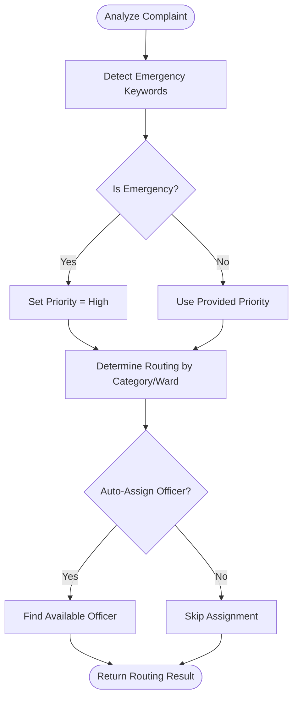
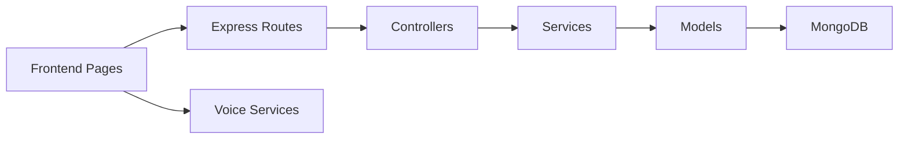

# Complaint Management System

<cite>
**Referenced Files in This Document**
- [Grievance.js](file://backend/src/models/Grievance.js)
- [grievanceController.js](file://backend/src/controllers/grievanceController.js)
- [grievanceRoutes.js](file://backend/src/routes/grievanceRoutes.js)
- [aiIntelligenceController.js](file://backend/src/controllers/aiIntelligenceController.js)
- [aiRoutes.js](file://backend/src/routes/aiRoutes.js)
- [aiCategorizationService.js](file://backend/src/services/aiCategorizationService.js)
- [enhancedNLPService.js](file://backend/src/services/enhancedNLPService.js)
- [smartRoutingService.js](file://backend/src/services/smartRoutingService.js)
- [SubmitComplaint.jsx](file://Frontend/src/pages/SubmitComplaint.jsx)
- [TrackComplaint.jsx](file://Frontend/src/pages/TrackComplaint.jsx)
- [Complaints.jsx](file://Frontend/src/pages/admin/Complaints.jsx)
- [AIComplaintAnalyzer.jsx](file://Frontend/src/components/ai/AIComplaintAnalyzer.jsx)
- [voiceService.js](file://Frontend/src/services/voiceService.js)
- [VoiceResponse.jsx](file://Frontend/src/components/voice/VoiceResponse.jsx)
</cite>

## Table of Contents
1. [Introduction](#introduction)
2. [Project Structure](#project-structure)
3. [Core Components](#core-components)
4. [Architecture Overview](#architecture-overview)
5. [Detailed Component Analysis](#detailed-component-analysis)
6. [Dependency Analysis](#dependency-analysis)
7. [Performance Considerations](#performance-considerations)
8. [Troubleshooting Guide](#troubleshooting-guide)
9. [Conclusion](#conclusion)

## Introduction
This document provides comprehensive documentation for the complaint management system, covering the complete lifecycle from submission to resolution. It details the complaint creation workflow, status tracking mechanisms, department assignment processes, and priority management systems. It also documents the complaint data model, field definitions, validation rules, and business logic. Integration between voice and text complaint submission, duplicate detection algorithms, and complaint categorization are explained. Administrative workflows for complaint review, assignment, and resolution tracking are included, along with API endpoints, frontend components, and reporting capabilities.

## Project Structure
The system consists of:
- Backend: Express.js server with MongoDB/Mongoose models, controllers, routes, and services for AI categorization, enhanced NLP, smart routing, and analytics.
- Frontend: React application with pages for submitting and tracking complaints, admin dashboards, and AI-assisted analysis components.
- Voice integration: Web Speech APIs for speech-to-text and text-to-speech during complaint submission and status updates.

**Diagram sources**
- [grievanceRoutes.js:1-62](file://backend/src/routes/grievanceRoutes.js#L1-L62)
- [grievanceController.js:1-752](file://backend/src/controllers/grievanceController.js#L1-L752)
- [aiRoutes.js:1-94](file://backend/src/routes/aiRoutes.js#L1-L94)
- [aiIntelligenceController.js:1-342](file://backend/src/controllers/aiIntelligenceController.js#L1-L342)
- [Grievance.js:1-115](file://backend/src/models/Grievance.js#L1-L115)
- [aiCategorizationService.js:1-344](file://backend/src/services/aiCategorizationService.js#L1-L344)
- [enhancedNLPService.js:1-487](file://backend/src/services/enhancedNLPService.js#L1-L487)
- [smartRoutingService.js:1-199](file://backend/src/services/smartRoutingService.js#L1-L199)
- [SubmitComplaint.jsx:1-973](file://Frontend/src/pages/SubmitComplaint.jsx#L1-L973)
- [TrackComplaint.jsx:1-399](file://Frontend/src/pages/TrackComplaint.jsx#L1-L399)
- [AIComplaintAnalyzer.jsx:1-276](file://Frontend/src/components/ai/AIComplaintAnalyzer.jsx#L1-L276)
- [voiceService.js:160-233](file://Frontend/src/services/voiceService.js#L160-L233)
- [VoiceResponse.jsx:128-155](file://Frontend/src/components/voice/VoiceResponse.jsx#L128-L155)

**Section sources**
- [grievanceRoutes.js:1-62](file://backend/src/routes/grievanceRoutes.js#L1-L62)
- [grievanceController.js:1-752](file://backend/src/controllers/grievanceController.js#L1-L752)
- [aiRoutes.js:1-94](file://backend/src/routes/aiRoutes.js#L1-L94)
- [aiIntelligenceController.js:1-342](file://backend/src/controllers/aiIntelligenceController.js#L1-L342)
- [Grievance.js:1-115](file://backend/src/models/Grievance.js#L1-L115)
- [aiCategorizationService.js:1-344](file://backend/src/services/aiCategorizationService.js#L1-L344)
- [enhancedNLPService.js:1-487](file://backend/src/services/enhancedNLPService.js#L1-L487)
- [smartRoutingService.js:1-199](file://backend/src/services/smartRoutingService.js#L1-L199)
- [SubmitComplaint.jsx:1-973](file://Frontend/src/pages/SubmitComplaint.jsx#L1-L973)
- [TrackComplaint.jsx:1-399](file://Frontend/src/pages/TrackComplaint.jsx#L1-L399)
- [AIComplaintAnalyzer.jsx:1-276](file://Frontend/src/components/ai/AIComplaintAnalyzer.jsx#L1-L276)
- [voiceService.js:160-233](file://Frontend/src/services/voiceService.js#L160-L233)
- [VoiceResponse.jsx:128-155](file://Frontend/src/components/voice/VoiceResponse.jsx#L128-L155)

## Core Components
- Complaint Model: Defines complaint fields, enums, indexes, and embedded AI analysis data.
- Controllers: Handle CRUD operations, status updates, upvotes, resolution, and admin analytics.
- Routes: Expose REST endpoints for citizens, public tracking, and admin management.
- AI Intelligence: Provides categorization, priority prediction, duplicate detection, and smart routing.
- Frontend Pages: Submission wizard, tracking page, and admin management interface.
- Voice Integration: Speech-to-text and text-to-speech for enhanced accessibility.

**Section sources**
- [Grievance.js:1-115](file://backend/src/models/Grievance.js#L1-L115)
- [grievanceController.js:1-752](file://backend/src/controllers/grievanceController.js#L1-L752)
- [grievanceRoutes.js:1-62](file://backend/src/routes/grievanceRoutes.js#L1-L62)
- [aiIntelligenceController.js:1-342](file://backend/src/controllers/aiIntelligenceController.js#L1-L342)
- [aiCategorizationService.js:1-344](file://backend/src/services/aiCategorizationService.js#L1-L344)
- [SubmitComplaint.jsx:1-973](file://Frontend/src/pages/SubmitComplaint.jsx#L1-L973)
- [TrackComplaint.jsx:1-399](file://Frontend/src/pages/TrackComplaint.jsx#L1-L399)
- [Complaints.jsx:1-195](file://Frontend/src/pages/admin/Complaints.jsx#L1-L195)

## Architecture Overview
The system follows a layered architecture:
- Presentation Layer: React pages and components for citizen and admin experiences.
- API Layer: Express routes and controllers handling requests and responses.
- Service Layer: AI categorization, enhanced NLP, smart routing, and analytics services.
- Data Layer: Mongoose models and MongoDB collections.

**Diagram sources**
- [grievanceRoutes.js:1-62](file://backend/src/routes/grievanceRoutes.js#L1-L62)
- [aiRoutes.js:1-94](file://backend/src/routes/aiRoutes.js#L1-L94)
- [grievanceController.js:1-752](file://backend/src/controllers/grievanceController.js#L1-L752)
- [aiIntelligenceController.js:1-342](file://backend/src/controllers/aiIntelligenceController.js#L1-L342)
- [aiCategorizationService.js:1-344](file://backend/src/services/aiCategorizationService.js#L1-L344)
- [enhancedNLPService.js:1-487](file://backend/src/services/enhancedNLPService.js#L1-L487)
- [smartRoutingService.js:1-199](file://backend/src/services/smartRoutingService.js#L1-L199)
- [Grievance.js:1-115](file://backend/src/models/Grievance.js#L1-L115)

## Detailed Component Analysis

### Complaint Data Model
The complaint model defines the complaint entity with fields for identification, description, category, status, priority, user association, ward, AI analysis, and optional media/geolocation.

**Diagram sources**
- [Grievance.js:1-115](file://backend/src/models/Grievance.js#L1-L115)

**Section sources**
- [Grievance.js:1-115](file://backend/src/models/Grievance.js#L1-L115)

### Complaint Creation Workflow
Citizens submit complaints via a multi-step form. The workflow includes personal information, issue details, location/media, and review. AI categorization and sentiment analysis are integrated. Voice input is supported for text entry. Upon submission, the backend validates the ward field, generates a complaint ID, persists the record, and triggers notifications.

**Diagram sources**
- [SubmitComplaint.jsx:160-341](file://Frontend/src/pages/SubmitComplaint.jsx#L160-L341)
- [aiRoutes.js:15-44](file://backend/src/routes/aiRoutes.js#L15-L44)
- [aiIntelligenceController.js:15-43](file://backend/src/controllers/aiIntelligenceController.js#L15-L43)
- [aiCategorizationService.js:278-332](file://backend/src/services/aiCategorizationService.js#L278-L332)
- [grievanceRoutes.js:26](file://backend/src/routes/grievanceRoutes.js#L26)
- [grievanceController.js:70-217](file://backend/src/controllers/grievanceController.js#L70-L217)

**Section sources**
- [SubmitComplaint.jsx:160-341](file://Frontend/src/pages/SubmitComplaint.jsx#L160-L341)
- [aiRoutes.js:15-44](file://backend/src/routes/aiRoutes.js#L15-L44)
- [aiIntelligenceController.js:15-43](file://backend/src/controllers/aiIntelligenceController.js#L15-L43)
- [aiCategorizationService.js:278-332](file://backend/src/services/aiCategorizationService.js#L278-L332)
- [grievanceRoutes.js:26](file://backend/src/routes/grievanceRoutes.js#L26)
- [grievanceController.js:70-217](file://backend/src/controllers/grievanceController.js#L70-L217)

### Status Tracking Mechanisms
The tracking page allows users to search by complaint ID and displays status, priority, timeline, and feedback options for resolved complaints. Admins can filter and update status/priority.

**Diagram sources**
- [TrackComplaint.jsx:123-151](file://Frontend/src/pages/TrackComplaint.jsx#L123-L151)
- [grievanceRoutes.js:33](file://backend/src/routes/grievanceRoutes.js#L33)
- [grievanceController.js:10-42](file://backend/src/controllers/grievanceController.js#L10-L42)

**Section sources**
- [TrackComplaint.jsx:123-151](file://Frontend/src/pages/TrackComplaint.jsx#L123-L151)
- [grievanceRoutes.js:33](file://backend/src/routes/grievanceRoutes.js#L33)
- [grievanceController.js:10-42](file://backend/src/controllers/grievanceController.js#L10-L42)

### Department Assignment Processes
Smart routing determines department and target response time based on category, priority, and ward. Emergency detection overrides priority automatically.

**Diagram sources**
- [smartRoutingService.js:41-190](file://backend/src/services/smartRoutingService.js#L41-L190)

**Section sources**
- [smartRoutingService.js:41-190](file://backend/src/services/smartRoutingService.js#L41-L190)

### Priority Management Systems
Priority levels are high, medium, and low. AI detects urgency keywords to suggest priority. Emergency keywords force high priority. Admins can update priority and status.

**Section sources**
- [aiCategorizationService.js:133-167](file://backend/src/services/aiCategorizationService.js#L133-L167)
- [grievanceController.js:344-428](file://backend/src/controllers/grievanceController.js#L344-L428)
- [Complaints.jsx:20-34](file://Frontend/src/pages/admin/Complaints.jsx#L20-L34)

### Complaint Categorization
AI categorization uses keyword matching to classify complaints into predefined categories with confidence scores. Priority prediction identifies urgency keywords. Both are exposed via AI routes and controllers.

**Section sources**
- [aiCategorizationService.js:92-128](file://backend/src/services/aiCategorizationService.js#L92-L128)
- [aiCategorizationService.js:133-167](file://backend/src/services/aiCategorizationService.js#L133-L167)
- [aiIntelligenceController.js:50-116](file://backend/src/controllers/aiIntelligenceController.js#L50-L116)
- [aiRoutes.js:15-44](file://backend/src/routes/aiRoutes.js#L15-L44)

### Duplicate Detection Algorithms
Duplicate detection compares new complaints against recent pending/in-progress complaints in the same ward using Jaccard similarity. Enhanced NLP adds Levenshtein similarity and multi-language support.

**Section sources**
- [aiCategorizationService.js:172-229](file://backend/src/services/aiCategorizationService.js#L172-L229)
- [enhancedNLPService.js:337-401](file://backend/src/services/enhancedNLPService.js#L337-L401)
- [enhancedNLPService.js:283-332](file://backend/src/services/enhancedNLPService.js#L283-L332)

### Administrative Workflows
Admins can view all complaints, filter by ward, update status and priority, mark as resolved, and view audit logs. The admin page supports real-time updates.

**Section sources**
- [grievanceRoutes.js:44-59](file://backend/src/routes/grievanceRoutes.js#L44-L59)
- [grievanceController.js:243-292](file://backend/src/controllers/grievanceController.js#L243-L292)
- [grievanceController.js:344-428](file://backend/src/controllers/grievanceController.js#L344-L428)
- [grievanceController.js:520-569](file://backend/src/controllers/grievanceController.js#L520-L569)
- [grievanceController.js:728-751](file://backend/src/controllers/grievanceController.js#L728-L751)
- [Complaints.jsx:1-195](file://Frontend/src/pages/admin/Complaints.jsx#L1-L195)

### API Endpoints for Complaint Operations
- POST /api/grievances: Create complaint (citizen/admin)
- GET /api/grievances/my: Get user's grievances
- GET /api/grievances/id/:complaintId: Public tracking by ID
- GET /api/grievances/public: Public list with sorting/filtering
- GET /api/grievances/:id/audit-logs: Admin view audit logs
- PUT /api/grievances/:id: Update status/priority (admin/ward_admin)
- POST /api/grievances/:id/resolve: Mark as resolved (admin/ward_admin)
- GET /api/grievances/: (admin/ward_admin) List with role-based filtering

**Section sources**
- [grievanceRoutes.js:26-59](file://backend/src/routes/grievanceRoutes.js#L26-L59)
- [grievanceController.js:223-337](file://backend/src/controllers/grievanceController.js#L223-L337)
- [grievanceController.js:344-428](file://backend/src/controllers/grievanceController.js#L344-L428)
- [grievanceController.js:520-569](file://backend/src/controllers/grievanceController.js#L520-L569)
- [grievanceController.js:728-751](file://backend/src/controllers/grievanceController.js#L728-L751)

### Frontend Components for Complaint Management
- SubmitComplaint.jsx: Multi-step wizard with AI suggestions, sentiment analysis, voice input, and geolocation capture.
- TrackComplaint.jsx: Public tracking with status timeline and feedback modal.
- AIComplaintAnalyzer.jsx: Displays AI analysis results including categorization, priority, duplicates, and routing.
- VoiceResponse.jsx and voiceService.js: Text-to-speech for status announcements and voice controls.

**Section sources**
- [SubmitComplaint.jsx:1-973](file://Frontend/src/pages/SubmitComplaint.jsx#L1-L973)
- [TrackComplaint.jsx:1-399](file://Frontend/src/pages/TrackComplaint.jsx#L1-L399)
- [AIComplaintAnalyzer.jsx:1-276](file://Frontend/src/components/ai/AIComplaintAnalyzer.jsx#L1-L276)
- [VoiceResponse.jsx:128-155](file://Frontend/src/components/voice/VoiceResponse.jsx#L128-L155)
- [voiceService.js:160-233](file://Frontend/src/services/voiceService.js#L160-L233)

### Reporting Capabilities
Admin dashboards expose statistics including total complaints, pending/resolved/in-progress counts, ward-wise distributions, issue-type distributions, and resolution trends. AI statistics provide category and priority distributions over time windows.

**Section sources**
- [grievanceController.js:576-621](file://backend/src/controllers/grievanceController.js#L576-L621)
- [grievanceController.js:616-722](file://backend/src/controllers/grievanceController.js#L616-L722)
- [aiIntelligenceController.js:196-292](file://backend/src/controllers/aiIntelligenceController.js#L196-L292)

## Dependency Analysis
The system exhibits clear separation of concerns:
- Controllers depend on services for AI logic and on models for persistence.
- Routes connect frontend requests to controllers.
- Frontend pages integrate with backend APIs and voice services.

**Diagram sources**
- [grievanceRoutes.js:1-62](file://backend/src/routes/grievanceRoutes.js#L1-L62)
- [grievanceController.js:1-752](file://backend/src/controllers/grievanceController.js#L1-L752)
- [aiIntelligenceController.js:1-342](file://backend/src/controllers/aiIntelligenceController.js#L1-L342)
- [aiCategorizationService.js:1-344](file://backend/src/services/aiCategorizationService.js#L1-L344)
- [enhancedNLPService.js:1-487](file://backend/src/services/enhancedNLPService.js#L1-L487)
- [smartRoutingService.js:1-199](file://backend/src/services/smartRoutingService.js#L1-L199)
- [Grievance.js:1-115](file://backend/src/models/Grievance.js#L1-L115)
- [SubmitComplaint.jsx:1-973](file://Frontend/src/pages/SubmitComplaint.jsx#L1-L973)
- [voiceService.js:160-233](file://Frontend/src/services/voiceService.js#L160-L233)

**Section sources**
- [grievanceRoutes.js:1-62](file://backend/src/routes/grievanceRoutes.js#L1-L62)
- [grievanceController.js:1-752](file://backend/src/controllers/grievanceController.js#L1-L752)
- [aiIntelligenceController.js:1-342](file://backend/src/controllers/aiIntelligenceController.js#L1-L342)
- [aiCategorizationService.js:1-344](file://backend/src/services/aiCategorizationService.js#L1-L344)
- [enhancedNLPService.js:1-487](file://backend/src/services/enhancedNLPService.js#L1-L487)
- [smartRoutingService.js:1-199](file://backend/src/services/smartRoutingService.js#L1-L199)
- [Grievance.js:1-115](file://backend/src/models/Grievance.js#L1-L115)
- [SubmitComplaint.jsx:1-973](file://Frontend/src/pages/SubmitComplaint.jsx#L1-L973)
- [voiceService.js:160-233](file://Frontend/src/services/voiceService.js#L160-L233)

## Performance Considerations
- Database indexing: Composite indexes on ward, status, priority, category, and timestamps optimize common queries.
- Query limits: Duplicate detection limits results to prevent performance degradation.
- Parallel processing: AI analysis runs categorization, priority prediction, and duplicate detection concurrently.
- Asynchronous notifications: Email/SMS notifications are non-blocking to avoid slowing down request handling.
- Frontend caching: Local state and memoization reduce re-renders and redundant API calls.

[No sources needed since this section provides general guidance]

## Troubleshooting Guide
Common issues and resolutions:
- Validation errors on submission: Ensure ward is provided and valid; verify required fields are filled.
- Duplicate detection warnings: Review similar complaints before resubmitting; adjust wording to differentiate.
- Priority escalation alerts: Confirm emergency keywords were detected; verify notification delivery.
- Status update failures: Check role-based access for ward admins; ensure complaint exists and belongs to the same ward.

**Section sources**
- [grievanceController.js:85-102](file://backend/src/controllers/grievanceController.js#L85-L102)
- [aiCategorizationService.js:172-229](file://backend/src/services/aiCategorizationService.js#L172-L229)
- [smartRoutingService.js:41-59](file://backend/src/services/smartRoutingService.js#L41-L59)

## Conclusion
The complaint management system provides a robust, scalable solution for citizens and administrators. It integrates AI-driven categorization, priority management, smart routing, and voice-enabled submission/updates. The modular backend and reactive frontend deliver a seamless user experience with comprehensive reporting and administrative controls.

[No sources needed since this section summarizes without analyzing specific files]