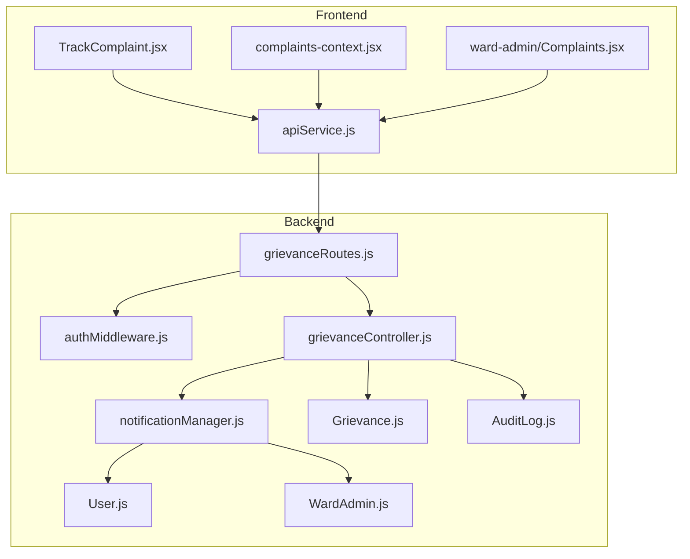
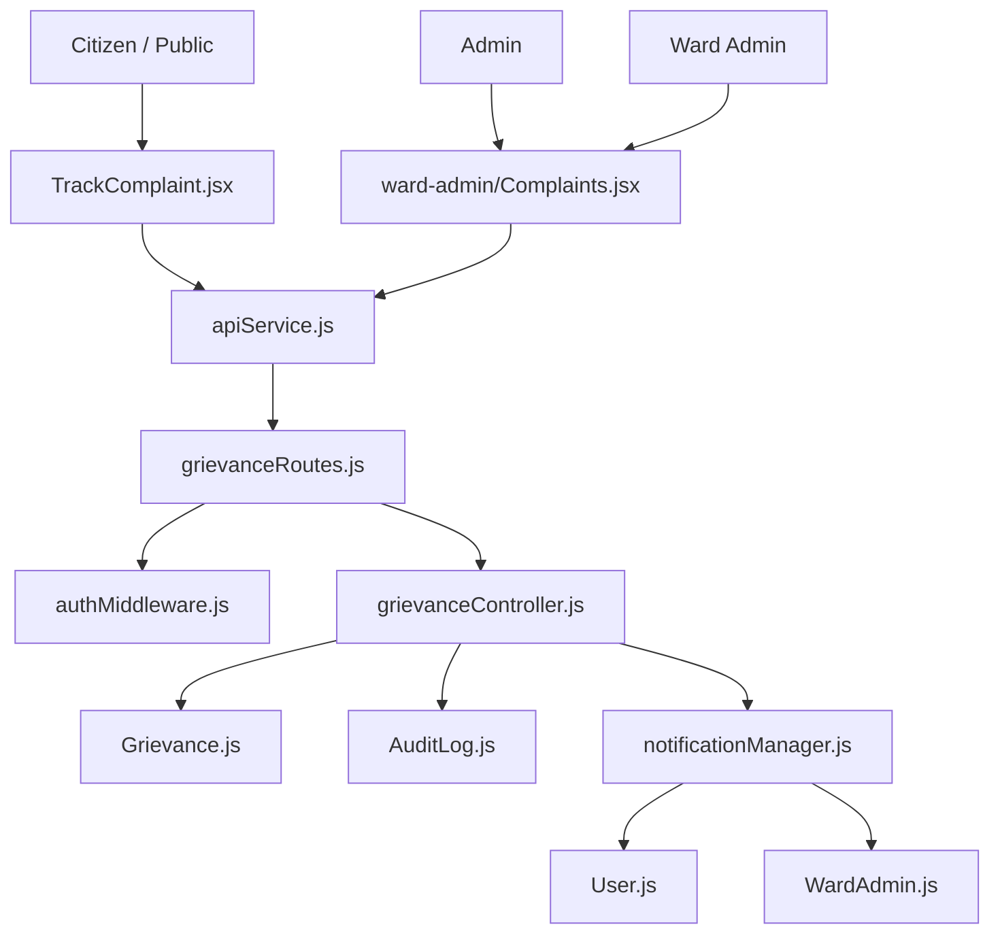
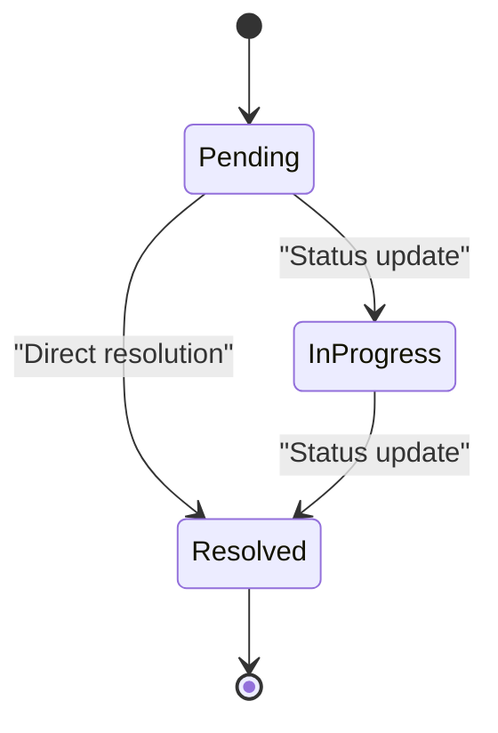
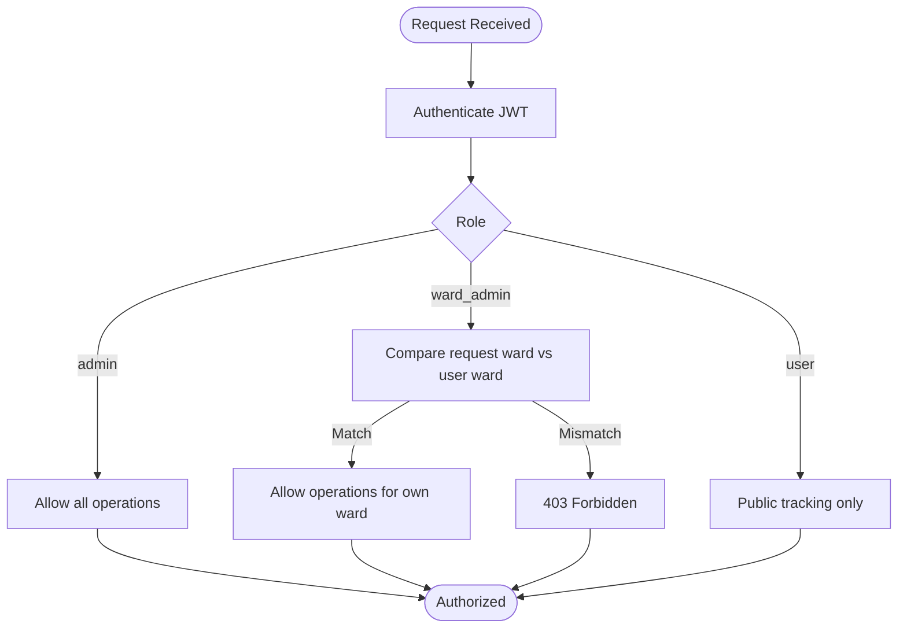
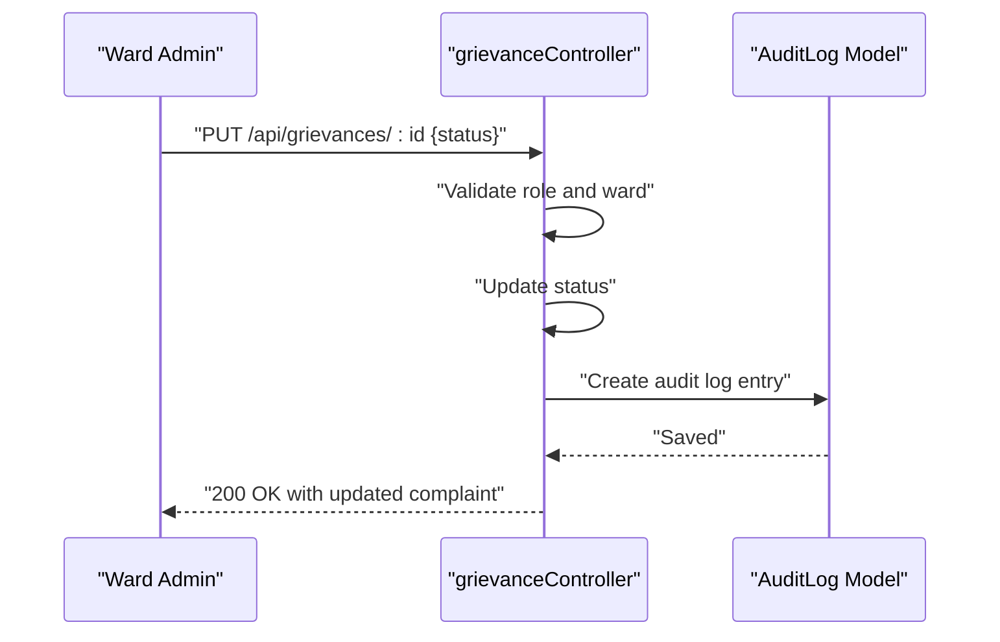
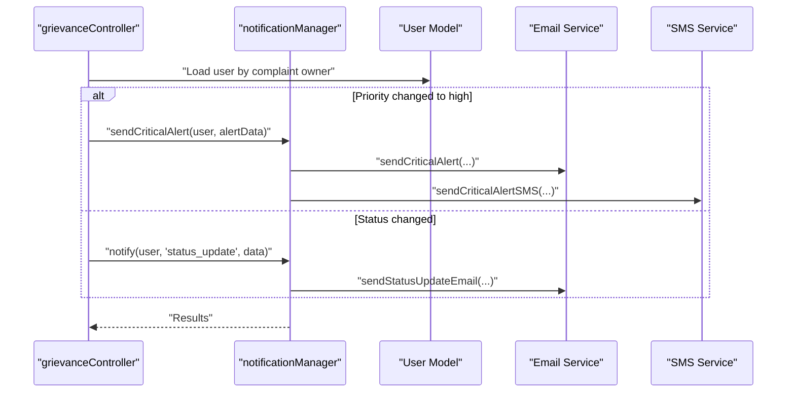
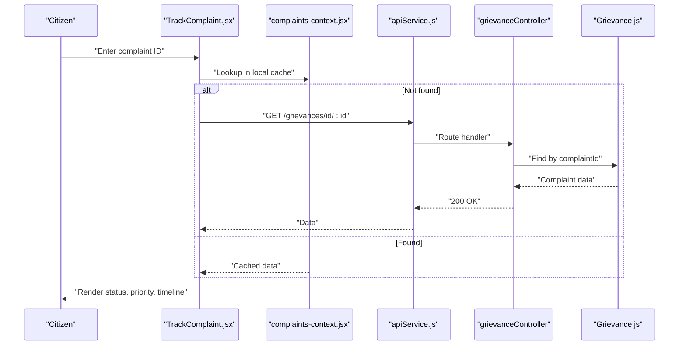
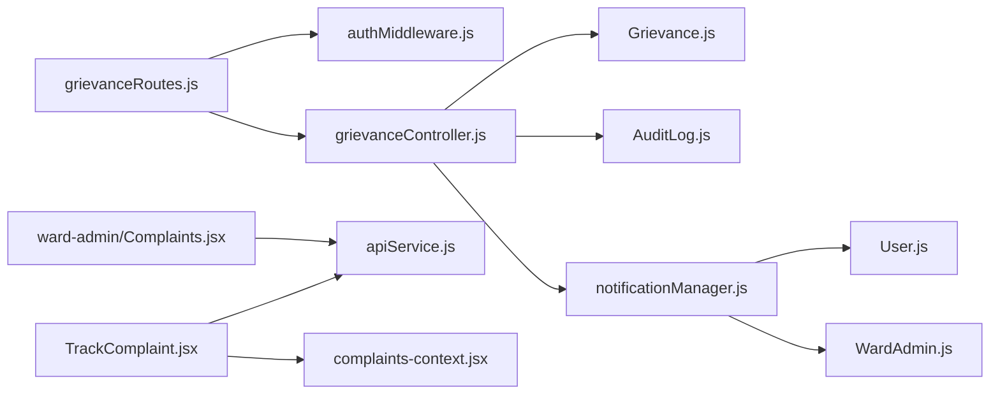

# Complaint Status Tracking and Updates

<cite>
**Referenced Files in This Document**
- [Grievance.js](file://backend/src/models/Grievance.js)
- [AuditLog.js](file://backend/src/models/AuditLog.js)
- [grievanceController.js](file://backend/src/controllers/grievanceController.js)
- [grievanceRoutes.js](file://backend/src/routes/grievanceRoutes.js)
- [notificationManager.js](file://backend/src/services/notificationManager.js)
- [authMiddleware.js](file://backend/src/middleware/authMiddleware.js)
- [User.js](file://backend/src/models/User.js)
- [WardAdmin.js](file://backend/src/models/WardAdmin.js)
- [complaints-context.jsx](file://Frontend/src/context/complaints-context.jsx)
- [TrackComplaint.jsx](file://Frontend/src/pages/TrackComplaint.jsx)
- [Complaints.jsx](file://Frontend/src/pages/ward-admin/Complaints.jsx)
- [apiService.js](file://Frontend/src/services/apiService.js)
</cite>

## Table of Contents
1. [Introduction](#introduction)
2. [Project Structure](#project-structure)
3. [Core Components](#core-components)
4. [Architecture Overview](#architecture-overview)
5. [Detailed Component Analysis](#detailed-component-analysis)
6. [Dependency Analysis](#dependency-analysis)
7. [Performance Considerations](#performance-considerations)
8. [Troubleshooting Guide](#troubleshooting-guide)
9. [Conclusion](#conclusion)
10. [Appendices](#appendices)

## Introduction
This document explains the complaint status tracking and update mechanisms in the Smart City platform. It covers the complaint lifecycle from submission to resolution, status transitions and their business implications, role-based access control (including ward-based restrictions for ward administrators), audit logging for status changes, the notification system (email and SMS), and the public complaint tracking interface. It also includes examples of status update requests, access control scenarios, and notification triggers for different status changes.

## Project Structure
The complaint tracking system spans backend models, controllers, routes, middleware, and frontend components/services:
- Backend models define complaint and audit data structures.
- Controllers implement CRUD and status update logic with access control and notifications.
- Routes expose endpoints for citizens, public tracking, and administrative dashboards.
- Middleware enforces authentication, role-based authorization, and ward-based access.
- Frontend provides public tracking, citizen dashboards, and ward admin management UIs.
- Services orchestrate notifications across email and SMS channels.

**Diagram sources**
- [grievanceRoutes.js:1-62](file://backend/src/routes/grievanceRoutes.js#L1-L62)
- [authMiddleware.js:1-114](file://backend/src/middleware/authMiddleware.js#L1-L114)
- [grievanceController.js:1-752](file://backend/src/controllers/grievanceController.js#L1-L752)
- [notificationManager.js:1-93](file://backend/src/services/notificationManager.js#L1-L93)
- [Grievance.js:1-115](file://backend/src/models/Grievance.js#L1-L115)
- [AuditLog.js:1-42](file://backend/src/models/AuditLog.js#L1-L42)
- [User.js:1-165](file://backend/src/models/User.js#L1-L165)
- [WardAdmin.js:1-61](file://backend/src/models/WardAdmin.js#L1-L61)
- [TrackComplaint.jsx:1-399](file://Frontend/src/pages/TrackComplaint.jsx#L1-L399)
- [complaints-context.jsx:1-153](file://Frontend/src/context/complaints-context.jsx#L1-L153)
- [apiService.js:1-539](file://Frontend/src/services/apiService.js#L1-L539)
- [Complaints.jsx:1-468](file://Frontend/src/pages/ward-admin/Complaints.jsx#L1-L468)

**Section sources**
- [grievanceRoutes.js:1-62](file://backend/src/routes/grievanceRoutes.js#L1-L62)
- [grievanceController.js:1-752](file://backend/src/controllers/grievanceController.js#L1-L752)
- [authMiddleware.js:1-114](file://backend/src/middleware/authMiddleware.js#L1-L114)
- [Grievance.js:1-115](file://backend/src/models/Grievance.js#L1-L115)
- [AuditLog.js:1-42](file://backend/src/models/AuditLog.js#L1-L42)
- [notificationManager.js:1-93](file://backend/src/services/notificationManager.js#L1-L93)
- [User.js:1-165](file://backend/src/models/User.js#L1-L165)
- [WardAdmin.js:1-61](file://backend/src/models/WardAdmin.js#L1-L61)
- [TrackComplaint.jsx:1-399](file://Frontend/src/pages/TrackComplaint.jsx#L1-L399)
- [complaints-context.jsx:1-153](file://Frontend/src/context/complaints-context.jsx#L1-L153)
- [apiService.js:1-539](file://Frontend/src/services/apiService.js#L1-L539)
- [Complaints.jsx:1-468](file://Frontend/src/pages/ward-admin/Complaints.jsx#L1-L468)

## Core Components
- Complaint model: Defines complaint fields, statuses, priorities, and metadata. Includes indexes for performance and geolocation/image fields.
- Audit log model: Captures status change events with actor identity and timestamps.
- Grievance controller: Implements creation, retrieval, status/priority updates, resolution, and audit log retrieval with role-based access checks.
- Grievance routes: Expose endpoints for citizens, public tracking, and administrative dashboards; apply authentication and authorization.
- Notification manager: Orchestrates email/SMS notifications based on user preferences and event types.
- Authentication middleware: Authenticates JWT tokens, resolves user identity across collections, authorizes roles, and enforces ward-based access for ward admins.
- Frontend contexts and pages: Provide public tracking, citizen dashboards, and ward admin management UIs.

**Section sources**
- [Grievance.js:1-115](file://backend/src/models/Grievance.js#L1-L115)
- [AuditLog.js:1-42](file://backend/src/models/AuditLog.js#L1-L42)
- [grievanceController.js:1-752](file://backend/src/controllers/grievanceController.js#L1-L752)
- [grievanceRoutes.js:1-62](file://backend/src/routes/grievanceRoutes.js#L1-L62)
- [notificationManager.js:1-93](file://backend/src/services/notificationManager.js#L1-L93)
- [authMiddleware.js:1-114](file://backend/src/middleware/authMiddleware.js#L1-L114)
- [User.js:1-165](file://backend/src/models/User.js#L1-L165)
- [WardAdmin.js:1-61](file://backend/src/models/WardAdmin.js#L1-L61)
- [TrackComplaint.jsx:1-399](file://Frontend/src/pages/TrackComplaint.jsx#L1-L399)
- [complaints-context.jsx:1-153](file://Frontend/src/context/complaints-context.jsx#L1-L153)
- [apiService.js:1-539](file://Frontend/src/services/apiService.js#L1-L539)
- [Complaints.jsx:1-468](file://Frontend/src/pages/ward-admin/Complaints.jsx#L1-L468)

## Architecture Overview
The system follows a layered architecture:
- Presentation layer: Public tracking page and administrative dashboards.
- Application layer: Routes and controllers implementing business logic.
- Domain layer: Models representing complaints and audit logs.
- Infrastructure layer: Middleware for auth/authorization and notification services.

**Diagram sources**
- [grievanceRoutes.js:1-62](file://backend/src/routes/grievanceRoutes.js#L1-L62)
- [authMiddleware.js:1-114](file://backend/src/middleware/authMiddleware.js#L1-L114)
- [grievanceController.js:1-752](file://backend/src/controllers/grievanceController.js#L1-L752)
- [notificationManager.js:1-93](file://backend/src/services/notificationManager.js#L1-L93)
- [Grievance.js:1-115](file://backend/src/models/Grievance.js#L1-L115)
- [AuditLog.js:1-42](file://backend/src/models/AuditLog.js#L1-L42)
- [User.js:1-165](file://backend/src/models/User.js#L1-L165)
- [WardAdmin.js:1-61](file://backend/src/models/WardAdmin.js#L1-L61)
- [TrackComplaint.jsx:1-399](file://Frontend/src/pages/TrackComplaint.jsx#L1-L399)
- [Complaints.jsx:1-468](file://Frontend/src/pages/ward-admin/Complaints.jsx#L1-L468)
- [apiService.js:1-539](file://Frontend/src/services/apiService.js#L1-L539)

## Detailed Component Analysis

### Complaint Lifecycle and Status Transitions
- Initial state: New complaints are created with status pending and default priority medium.
- Status transitions:
  - pending → in-progress
  - in-progress → resolved
  - pending → resolved (direct resolution)
- Priority escalations:
  - Priority can be raised to high; this triggers critical alerts regardless of user notification preferences.

**Diagram sources**
- [Grievance.js:29-38](file://backend/src/models/Grievance.js#L29-L38)
- [grievanceController.js:344-428](file://backend/src/controllers/grievanceController.js#L344-L428)

**Section sources**
- [Grievance.js:29-38](file://backend/src/models/Grievance.js#L29-L38)
- [grievanceController.js:344-428](file://backend/src/controllers/grievanceController.js#L344-L428)

### Role-Based Access Control for Status Updates
- Authentication:
  - JWT verified; user resolved across Admin, WardAdmin, or User collections.
- Authorization:
  - Roles allowed: admin, ward_admin, user.
- Ward-based restrictions:
  - Ward admins can only manage complaints within their assigned ward.
  - Attempts to update complaints outside their ward are rejected.
- Public tracking:
  - Public endpoint for tracking does not require authentication.

**Diagram sources**
- [authMiddleware.js:10-55](file://backend/src/middleware/authMiddleware.js#L10-L55)
- [authMiddleware.js:61-71](file://backend/src/middleware/authMiddleware.js#L61-L71)
- [authMiddleware.js:77-104](file://backend/src/middleware/authMiddleware.js#L77-L104)
- [grievanceController.js:344-428](file://backend/src/controllers/grievanceController.js#L344-L428)

**Section sources**
- [authMiddleware.js:10-55](file://backend/src/middleware/authMiddleware.js#L10-L55)
- [authMiddleware.js:61-71](file://backend/src/middleware/authMiddleware.js#L61-L71)
- [authMiddleware.js:77-104](file://backend/src/middleware/authMiddleware.js#L77-L104)
- [grievanceController.js:344-428](file://backend/src/controllers/grievanceController.js#L344-L428)

### Audit Logging for Status Changes
- Every status change creates an audit log entry capturing:
  - complaintId
  - changedBy: userId, role, name
  - oldStatus, newStatus
  - action type (default: status_update)
  - timestamp
- Access control for audit logs:
  - Ward admins can only view logs for complaints in their ward.

**Diagram sources**
- [grievanceController.js:47-63](file://backend/src/controllers/grievanceController.js#L47-L63)
- [grievanceController.js:344-428](file://backend/src/controllers/grievanceController.js#L344-L428)
- [AuditLog.js:1-42](file://backend/src/models/AuditLog.js#L1-L42)

**Section sources**
- [grievanceController.js:47-63](file://backend/src/controllers/grievanceController.js#L47-L63)
- [grievanceController.js:728-751](file://backend/src/controllers/grievanceController.js#L728-L751)
- [AuditLog.js:1-42](file://backend/src/models/AuditLog.js#L1-L42)

### Notification System for Status Updates
- Notification orchestration:
  - Email: sent for registration and status updates by default.
  - SMS: sent conditionally based on user preferences and availability.
- Critical alerts:
  - Priority escalation to high triggers critical alerts via email and SMS (SMS even if disabled, phone exists).
- Notification triggers:
  - Registration: upon complaint creation.
  - Status update: upon status change.
  - Priority escalation: upon priority set to high.

**Diagram sources**
- [grievanceController.js:154-206](file://backend/src/controllers/grievanceController.js#L154-L206)
- [grievanceController.js:395-418](file://backend/src/controllers/grievanceController.js#L395-L418)
- [notificationManager.js:7-54](file://backend/src/services/notificationManager.js#L7-L54)
- [notificationManager.js:60-87](file://backend/src/services/notificationManager.js#L60-L87)

**Section sources**
- [grievanceController.js:154-206](file://backend/src/controllers/grievanceController.js#L154-L206)
- [grievanceController.js:395-418](file://backend/src/controllers/grievanceController.js#L395-L418)
- [notificationManager.js:7-54](file://backend/src/services/notificationManager.js#L7-L54)
- [notificationManager.js:60-87](file://backend/src/services/notificationManager.js#L60-L87)

### Public Complaint Tracking Interface
- Endpoint: GET /api/grievances/id/:complaintId (public, no auth).
- Frontend:
  - TrackComplaint page allows citizens to enter a complaint ID and view status, priority, and timeline.
  - Timeline reflects current status progression with dates derived from created/updated timestamps.
- Local caching:
  - Frontend context caches complaints; falls back to direct API calls if not found locally.

**Diagram sources**
- [grievanceRoutes.js:33-33](file://backend/src/routes/grievanceRoutes.js#L33-L33)
- [grievanceController.js:10-42](file://backend/src/controllers/grievanceController.js#L10-L42)
- [TrackComplaint.jsx:123-151](file://Frontend/src/pages/TrackComplaint.jsx#L123-L151)
- [complaints-context.jsx:115-128](file://Frontend/src/context/complaints-context.jsx#L115-L128)
- [apiService.js:187-203](file://Frontend/src/services/apiService.js#L187-L203)

**Section sources**
- [grievanceRoutes.js:33-33](file://backend/src/routes/grievanceRoutes.js#L33-L33)
- [grievanceController.js:10-42](file://backend/src/controllers/grievanceController.js#L10-L42)
- [TrackComplaint.jsx:123-151](file://Frontend/src/pages/TrackComplaint.jsx#L123-L151)
- [complaints-context.jsx:115-128](file://Frontend/src/context/complaints-context.jsx#L115-L128)
- [apiService.js:187-203](file://Frontend/src/services/apiService.js#L187-L203)

### Examples

#### Example 1: Status Update Request
- Endpoint: PUT /api/grievances/{complaintId}
- Request body:
  - status: "in-progress" or "resolved"
  - priority: optional ("high" triggers critical alert)
- Expected outcome:
  - Complaint updated if authorized.
  - Audit log created.
  - Notifications sent (email/SMS) if applicable.

**Section sources**
- [grievanceController.js:344-428](file://backend/src/controllers/grievanceController.js#L344-L428)
- [grievanceRoutes.js:47-47](file://backend/src/routes/grievanceRoutes.js#L47-L47)
- [apiService.js:139-156](file://Frontend/src/services/apiService.js#L139-L156)

#### Example 2: Access Control Scenario
- Ward admin attempts to update a complaint from another ward:
  - Backend rejects with 403.
- Super admin can update any complaint:
  - No ward restriction applies.

**Section sources**
- [grievanceController.js:354-360](file://backend/src/controllers/grievanceController.js#L354-L360)
- [authMiddleware.js:77-104](file://backend/src/middleware/authMiddleware.js#L77-L104)

#### Example 3: Notification Triggers
- Registration:
  - Email confirmation sent automatically.
- Status update:
  - Email notification sent to the complaint owner.
- Priority escalation to high:
  - Critical alert sent via email and SMS (SMS even if disabled, if phone exists).

**Section sources**
- [grievanceController.js:154-206](file://backend/src/controllers/grievanceController.js#L154-L206)
- [grievanceController.js:395-418](file://backend/src/controllers/grievanceController.js#L395-L418)
- [notificationManager.js:7-54](file://backend/src/services/notificationManager.js#L7-L54)
- [notificationManager.js:60-87](file://backend/src/services/notificationManager.js#L60-L87)

## Dependency Analysis
- Controllers depend on models and services for persistence, notifications, and auditing.
- Routes depend on controllers and middleware for enforcement.
- Frontend depends on API service and context providers for state and network calls.
- Authentication middleware centralizes role and ward checks.

**Diagram sources**
- [grievanceRoutes.js:1-62](file://backend/src/routes/grievanceRoutes.js#L1-L62)
- [authMiddleware.js:1-114](file://backend/src/middleware/authMiddleware.js#L1-L114)
- [grievanceController.js:1-752](file://backend/src/controllers/grievanceController.js#L1-L752)
- [Grievance.js:1-115](file://backend/src/models/Grievance.js#L1-L115)
- [AuditLog.js:1-42](file://backend/src/models/AuditLog.js#L1-L42)
- [notificationManager.js:1-93](file://backend/src/services/notificationManager.js#L1-L93)
- [User.js:1-165](file://backend/src/models/User.js#L1-L165)
- [WardAdmin.js:1-61](file://backend/src/models/WardAdmin.js#L1-L61)
- [TrackComplaint.jsx:1-399](file://Frontend/src/pages/TrackComplaint.jsx#L1-L399)
- [complaints-context.jsx:1-153](file://Frontend/src/context/complaints-context.jsx#L1-L153)
- [apiService.js:1-539](file://Frontend/src/services/apiService.js#L1-L539)
- [Complaints.jsx:1-468](file://Frontend/src/pages/ward-admin/Complaints.jsx#L1-L468)

**Section sources**
- [grievanceRoutes.js:1-62](file://backend/src/routes/grievanceRoutes.js#L1-L62)
- [grievanceController.js:1-752](file://backend/src/controllers/grievanceController.js#L1-L752)
- [authMiddleware.js:1-114](file://backend/src/middleware/authMiddleware.js#L1-L114)
- [notificationManager.js:1-93](file://backend/src/services/notificationManager.js#L1-L93)
- [Grievance.js:1-115](file://backend/src/models/Grievance.js#L1-L115)
- [AuditLog.js:1-42](file://backend/src/models/AuditLog.js#L1-L42)
- [User.js:1-165](file://backend/src/models/User.js#L1-L165)
- [WardAdmin.js:1-61](file://backend/src/models/WardAdmin.js#L1-L61)
- [TrackComplaint.jsx:1-399](file://Frontend/src/pages/TrackComplaint.jsx#L1-L399)
- [complaints-context.jsx:1-153](file://Frontend/src/context/complaints-context.jsx#L1-L153)
- [apiService.js:1-539](file://Frontend/src/services/apiService.js#L1-L539)
- [Complaints.jsx:1-468](file://Frontend/src/pages/ward-admin/Complaints.jsx#L1-L468)

## Performance Considerations
- Database indexes:
  - Grievance model includes indexes on ward, userId, complaintId, category, priority, status, createdAt, upvoteCount, AI duplicate flags, and assigned department to optimize queries.
- Aggregation and filtering:
  - Admin/ward admin endpoints use aggregation pipelines and targeted filters to reduce payload sizes.
- Asynchronous notifications:
  - Notifications are executed concurrently and non-blockingly to avoid delaying API responses.

[No sources needed since this section provides general guidance]

## Troubleshooting Guide
- Complaint not found during public tracking:
  - Verify the complaint ID is correct and case-sensitive.
  - Confirm the complaint exists in the database.
- Unauthorized access errors:
  - Ensure the requester has the correct role and, for ward admins, belongs to the correct ward.
- Notification failures:
  - Check user preferences (emailEnabled, smsEnabled) and presence of contact details.
  - Review notification manager logs for detailed errors.

**Section sources**
- [grievanceController.js:10-42](file://backend/src/controllers/grievanceController.js#L10-L42)
- [grievanceController.js:354-360](file://backend/src/controllers/grievanceController.js#L354-L360)
- [notificationManager.js:7-54](file://backend/src/services/notificationManager.js#L7-L54)

## Conclusion
The complaint status tracking system integrates robust role-based access control, comprehensive audit logging, and a flexible notification framework. The public tracking interface ensures transparency, while administrative dashboards streamline operations. The design emphasizes security, scalability, and user experience across all layers.

[No sources needed since this section summarizes without analyzing specific files]

## Appendices

### API Definitions and Behaviors
- Public tracking:
  - GET /api/grievances/id/:complaintId
  - Returns complaint details without authentication.
- Status update:
  - PUT /api/grievances/:id
  - Requires admin or ward_admin; enforces ward-based access.
- Audit logs:
  - GET /api/grievances/:id/audit-logs
  - Requires admin or ward_admin; enforces ward-based access.

**Section sources**
- [grievanceRoutes.js:33-33](file://backend/src/routes/grievanceRoutes.js#L33-L33)
- [grievanceRoutes.js:47-49](file://backend/src/routes/grievanceRoutes.js#L47-L49)
- [grievanceController.js:728-751](file://backend/src/controllers/grievanceController.js#L728-L751)