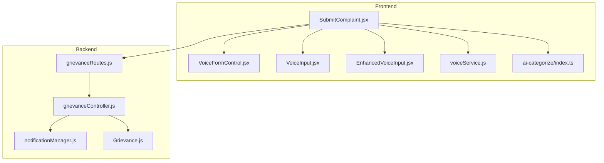
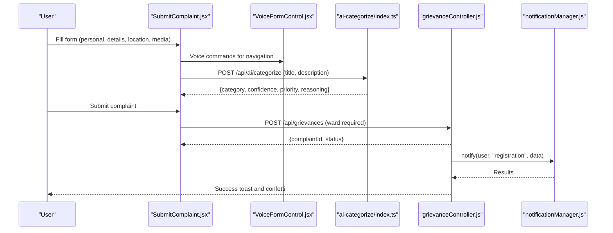
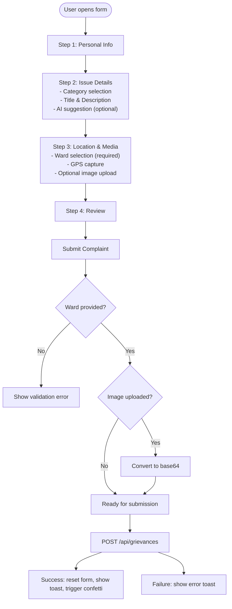
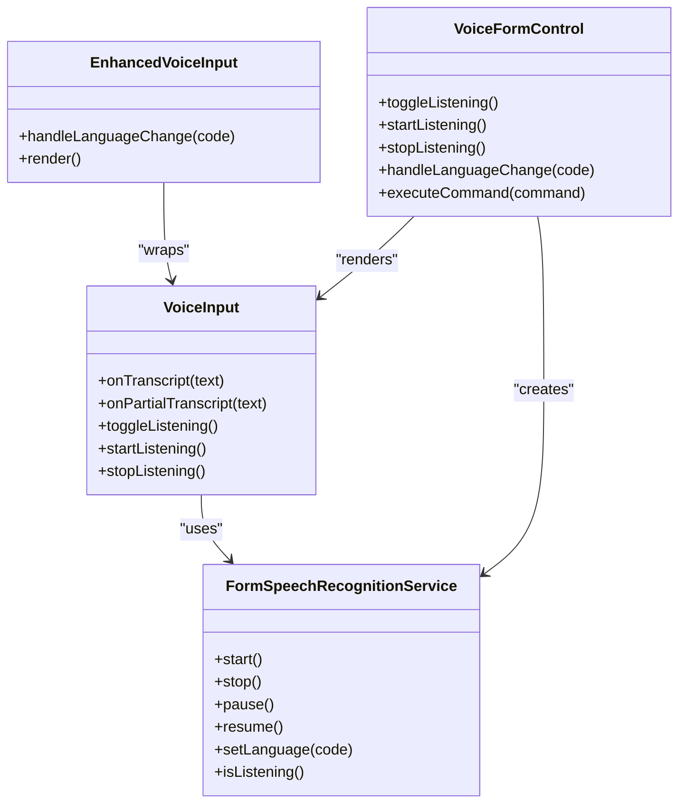
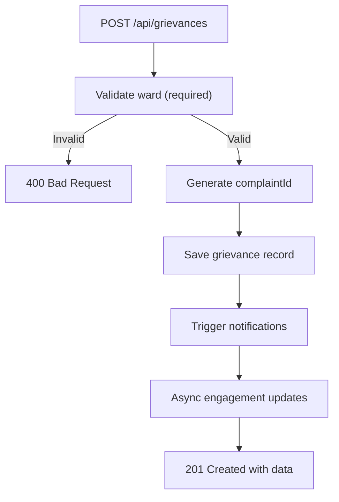
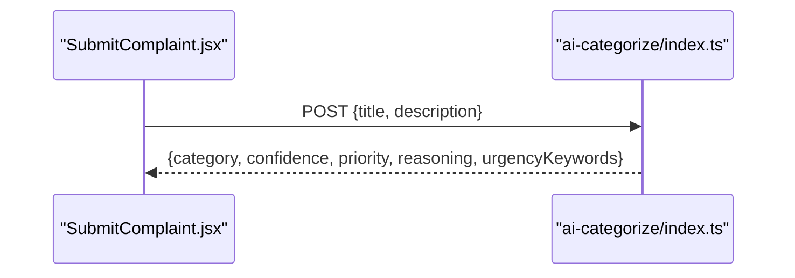
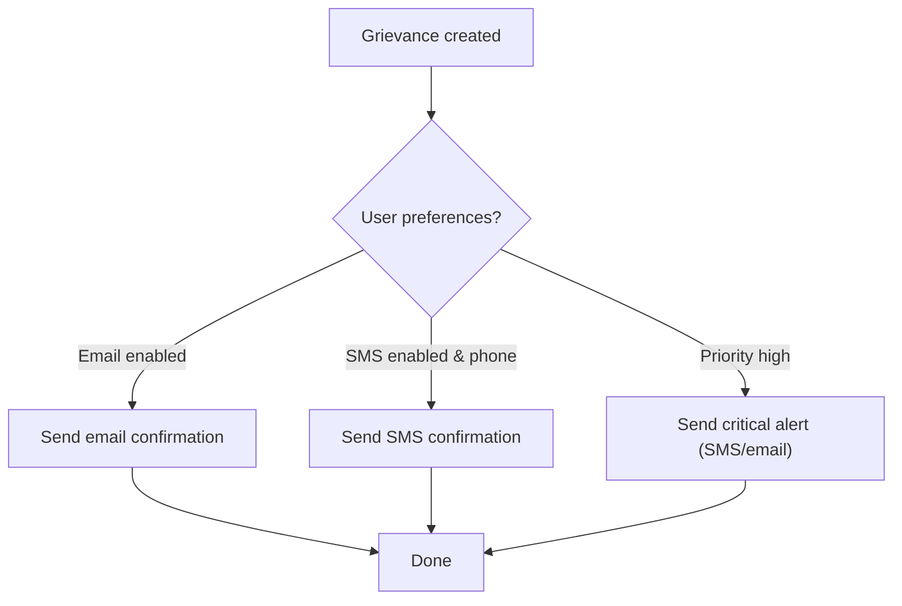
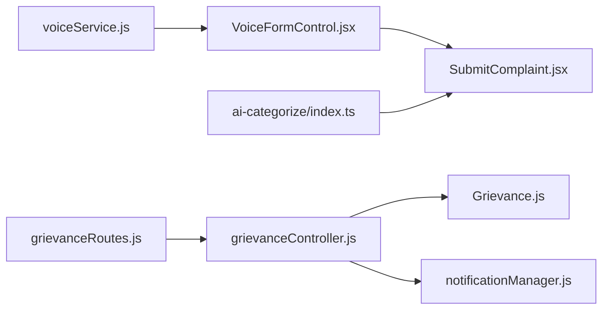

# Complaint Submission and Creation

<cite>
**Referenced Files in This Document**
- [SubmitComplaint.jsx](file://Frontend/src/pages/SubmitComplaint.jsx)
- [VoiceInput.jsx](file://Frontend/src/components/VoiceInput.jsx)
- [EnhancedVoiceInput.jsx](file://Frontend/src/components/Voice/EnhancedVoiceInput.jsx)
- [VoiceFormControl.jsx](file://Frontend/src/components/voice/VoiceFormControl.jsx)
- [voiceService.js](file://Frontend/src/services/voiceService.js)
- [grievanceController.js](file://backend/src/controllers/grievanceController.js)
- [grievanceRoutes.js](file://backend/src/routes/grievanceRoutes.js)
- [Grievance.js](file://backend/src/models/Grievance.js)
- [notificationManager.js](file://backend/src/services/notificationManager.js)
- [ai-categorize/index.ts](file://Frontend/supabase/functions/ai-categorize/index.ts)
</cite>

## Table of Contents
1. [Introduction](#introduction)
2. [Project Structure](#project-structure)
3. [Core Components](#core-components)
4. [Architecture Overview](#architecture-overview)
5. [Detailed Component Analysis](#detailed-component-analysis)
6. [Dependency Analysis](#dependency-analysis)
7. [Performance Considerations](#performance-considerations)
8. [Troubleshooting Guide](#troubleshooting-guide)
9. [Conclusion](#conclusion)
10. [Appendices](#appendices)

## Introduction
This document explains the complete complaint submission and creation workflow, covering both voice-enabled and text-based input methods, strict ward validation, complaint ID generation, data validation rules, backend integration for voice processing and transcription, the complaint data model, API endpoints, frontend components, and notification triggers. It also provides examples, validation scenarios, and error handling patterns.

## Project Structure
The complaint submission workflow spans three main areas:
- Frontend form and voice components
- Backend API and controllers
- AI categorization and notification services

**Diagram sources**
- [SubmitComplaint.jsx:48-341](file://Frontend/src/pages/SubmitComplaint.jsx#L48-L341)
- [VoiceFormControl.jsx:244-761](file://Frontend/src/components/voice/VoiceFormControl.jsx#L244-L761)
- [VoiceInput.jsx:131-458](file://Frontend/src/components/VoiceInput.jsx#L131-L458)
- [EnhancedVoiceInput.jsx:24-116](file://Frontend/src/components/Voice/EnhancedVoiceInput.jsx#L24-L116)
- [voiceService.js:1-778](file://Frontend/src/services/voiceService.js#L1-L778)
- [ai-categorize/index.ts:86-223](file://Frontend/supabase/functions/ai-categorize/index.ts#L86-L223)
- [grievanceRoutes.js:1-62](file://backend/src/routes/grievanceRoutes.js#L1-L62)
- [grievanceController.js:65-217](file://backend/src/controllers/grievanceController.js#L65-L217)
- [notificationManager.js:1-93](file://backend/src/services/notificationManager.js#L1-L93)
- [Grievance.js:1-115](file://backend/src/models/Grievance.js#L1-L115)

**Section sources**
- [SubmitComplaint.jsx:48-341](file://Frontend/src/pages/SubmitComplaint.jsx#L48-L341)
- [grievanceRoutes.js:23-29](file://backend/src/routes/grievanceRoutes.js#L23-L29)

## Core Components
- Frontend complaint form with multi-step wizard, geolocation capture, file upload, and AI suggestions.
- Voice input components supporting continuous listening, waveform visualization, and multilingual TTS/STT.
- Backend grievance controller enforcing strict ward validation, generating complaint IDs, and triggering notifications.
- AI categorization function providing category, confidence, priority, and urgency insights.
- Notification manager orchestrating email and SMS alerts.

**Section sources**
- [SubmitComplaint.jsx:48-341](file://Frontend/src/pages/SubmitComplaint.jsx#L48-L341)
- [VoiceFormControl.jsx:244-761](file://Frontend/src/components/voice/VoiceFormControl.jsx#L244-L761)
- [voiceService.js:327-758](file://Frontend/src/services/voiceService.js#L327-L758)
- [grievanceController.js:65-217](file://backend/src/controllers/grievanceController.js#L65-L217)
- [ai-categorize/index.ts:86-223](file://Frontend/supabase/functions/ai-categorize/index.ts#L86-L223)
- [notificationManager.js:1-93](file://backend/src/services/notificationManager.js#L1-L93)

## Architecture Overview
The workflow integrates voice/text input, AI categorization, backend validation, and notification delivery.

**Diagram sources**
- [SubmitComplaint.jsx:161-341](file://Frontend/src/pages/SubmitComplaint.jsx#L161-L341)
- [VoiceFormControl.jsx:342-396](file://Frontend/src/components/voice/VoiceFormControl.jsx#L342-L396)
- [ai-categorize/index.ts:86-223](file://Frontend/supabase/functions/ai-categorize/index.ts#L86-L223)
- [grievanceController.js:65-217](file://backend/src/controllers/grievanceController.js#L65-L217)
- [notificationManager.js:7-54](file://backend/src/services/notificationManager.js#L7-L54)

## Detailed Component Analysis

### Frontend Complaint Form (SubmitComplaint)
- Multi-step wizard with personal info, issue details, location/media, and review.
- Ward selection is mandatory and validated before submission.
- Geolocation captured automatically on the location step.
- File upload with 1 MB size limit; images converted to base64 for storage.
- AI categorization suggestion fetched from backend endpoint with debounce.
- Voice input integration via VoiceInput and EnhancedVoiceInput components.
- Notification triggers include success toast and confetti.

**Diagram sources**
- [SubmitComplaint.jsx:48-341](file://Frontend/src/pages/SubmitComplaint.jsx#L48-L341)

**Section sources**
- [SubmitComplaint.jsx:48-341](file://Frontend/src/pages/SubmitComplaint.jsx#L48-L341)

### Voice Input Components
- VoiceInput: Core microphone component with continuous STT, waveform visualization, and state management.
- EnhancedVoiceInput: Wraps VoiceInput with language selector and multilingual placeholders.
- VoiceFormControl: Full-featured voice control panel for form navigation, language switching, audio visualization, and feedback.

**Diagram sources**
- [VoiceInput.jsx:131-458](file://Frontend/src/components/VoiceInput.jsx#L131-L458)
- [EnhancedVoiceInput.jsx:24-116](file://Frontend/src/components/Voice/EnhancedVoiceInput.jsx#L24-L116)
- [VoiceFormControl.jsx:244-761](file://Frontend/src/components/voice/VoiceFormControl.jsx#L244-L761)
- [voiceService.js:327-758](file://Frontend/src/services/voiceService.js#L327-L758)

**Section sources**
- [VoiceInput.jsx:131-458](file://Frontend/src/components/VoiceInput.jsx#L131-L458)
- [EnhancedVoiceInput.jsx:24-116](file://Frontend/src/components/Voice/EnhancedVoiceInput.jsx#L24-L116)
- [VoiceFormControl.jsx:244-761](file://Frontend/src/components/voice/VoiceFormControl.jsx#L244-L761)
- [voiceService.js:327-758](file://Frontend/src/services/voiceService.js#L327-L758)

### Backend Complaint Controller and Routes
- Route: POST /api/grievances requires authentication and enforces role-based access.
- Strict ward validation: ward is mandatory and must match predefined values.
- Complaint ID generation: derived from the last record’s ID pattern with numeric padding.
- Notification triggers: registration confirmation and critical alerts for high priority.
- Engagement events: streak and challenge updates are triggered asynchronously.

**Diagram sources**
- [grievanceController.js:65-217](file://backend/src/controllers/grievanceController.js#L65-L217)
- [grievanceRoutes.js:23-29](file://backend/src/routes/grievanceRoutes.js#L23-L29)

**Section sources**
- [grievanceController.js:65-217](file://backend/src/controllers/grievanceController.js#L65-L217)
- [grievanceRoutes.js:23-29](file://backend/src/routes/grievanceRoutes.js#L23-L29)

### AI Categorization Integration
- Frontend calls POST /api/ai/categorize with title and description.
- Backend function performs keyword-based urgency detection and attempts AI categorization via external gateway.
- Falls back to keyword-based categorization if AI is unavailable.
- Returns category, confidence, reasoning, priority, and urgency keywords.

**Diagram sources**
- [SubmitComplaint.jsx:161-199](file://Frontend/src/pages/SubmitComplaint.jsx#L161-L199)
- [ai-categorize/index.ts:86-223](file://Frontend/supabase/functions/ai-categorize/index.ts#L86-L223)

**Section sources**
- [SubmitComplaint.jsx:161-199](file://Frontend/src/pages/SubmitComplaint.jsx#L161-L199)
- [ai-categorize/index.ts:86-223](file://Frontend/supabase/functions/ai-categorize/index.ts#L86-L223)

### Notification System
- Registration notifications: email confirmation and optional SMS.
- Critical alerts: bypass preferences for emergency SMS and always send email.
- Non-blocking orchestration: Promise.allSettled ensures one failure does not stop others.

**Diagram sources**
- [grievanceController.js:154-206](file://backend/src/controllers/grievanceController.js#L154-L206)
- [notificationManager.js:7-87](file://backend/src/services/notificationManager.js#L7-L87)

**Section sources**
- [grievanceController.js:154-206](file://backend/src/controllers/grievanceController.js#L154-L206)
- [notificationManager.js:7-87](file://backend/src/services/notificationManager.js#L7-L87)

## Dependency Analysis
- Frontend depends on voiceService for speech recognition and TTS, and on AI categorization for suggestions.
- Backend depends on the Grievance model and notification manager.
- Routes enforce authentication and role-based authorization.

**Diagram sources**
- [voiceService.js:1-778](file://Frontend/src/services/voiceService.js#L1-L778)
- [VoiceFormControl.jsx:244-761](file://Frontend/src/components/voice/VoiceFormControl.jsx#L244-L761)
- [SubmitComplaint.jsx:48-341](file://Frontend/src/pages/SubmitComplaint.jsx#L48-L341)
- [ai-categorize/index.ts:86-223](file://Frontend/supabase/functions/ai-categorize/index.ts#L86-L223)
- [grievanceRoutes.js:1-62](file://backend/src/routes/grievanceRoutes.js#L1-L62)
- [grievanceController.js:65-217](file://backend/src/controllers/grievanceController.js#L65-L217)
- [Grievance.js:1-115](file://backend/src/models/Grievance.js#L1-L115)
- [notificationManager.js:1-93](file://backend/src/services/notificationManager.js#L1-L93)

**Section sources**
- [grievanceRoutes.js:1-62](file://backend/src/routes/grievanceRoutes.js#L1-L62)
- [grievanceController.js:65-217](file://backend/src/controllers/grievanceController.js#L65-L217)
- [Grievance.js:1-115](file://backend/src/models/Grievance.js#L1-L115)

## Performance Considerations
- Voice recognition uses continuous listening with interimResults disabled to avoid partial processing, reducing CPU load.
- Debounce mechanism limits AI categorization requests during typing.
- Base64 conversion for images increases payload size; consider streaming uploads for large files.
- Notification sending is non-blocking and asynchronous to maintain fast response times.

## Troubleshooting Guide
Common issues and resolutions:
- Ward validation fails: Ensure the selected ward matches one of the allowed values.
- Voice input not supported: Browser may lack SpeechRecognition support; prompt users to enable permissions or use a supported browser.
- AI categorization errors: The system falls back to keyword-based categorization; verify title/description length and content.
- File upload errors: Enforce 1 MB limit; inform users to select smaller images.
- Notification failures: Check user preferences and contact details; non-blocking orchestration ensures partial failures do not block submission.

**Section sources**
- [grievanceController.js:85-102](file://backend/src/controllers/grievanceController.js#L85-L102)
- [VoiceInput.jsx:184-281](file://Frontend/src/components/VoiceInput.jsx#L184-L281)
- [ai-categorize/index.ts:152-169](file://Frontend/supabase/functions/ai-categorize/index.ts#L152-L169)
- [SubmitComplaint.jsx:260-269](file://Frontend/src/pages/SubmitComplaint.jsx#L260-L269)
- [notificationManager.js:50-54](file://backend/src/services/notificationManager.js#L50-L54)

## Conclusion
The complaint submission workflow combines robust frontend voice/text input with strict backend validation, intelligent AI categorization, and reliable notification delivery. The system emphasizes user experience through multilingual voice control, automatic geolocation capture, and responsive feedback, while ensuring compliance with ward-based validation and secure, non-blocking processing.

## Appendices

### API Endpoints
- POST /api/grievances: Submit a new complaint (requires authentication and role).
- GET /api/grievances/id/:complaintId: Public tracking by complaint ID.
- POST /api/ai/categorize: AI-powered categorization and urgency detection.

**Section sources**
- [grievanceRoutes.js:23-33](file://backend/src/routes/grievanceRoutes.js#L23-L33)
- [ai-categorize/index.ts:86-223](file://Frontend/supabase/functions/ai-categorize/index.ts#L86-L223)

### Data Validation Rules
- Ward is mandatory and must be one of the predefined values.
- Title, description, category, address, and priority are required.
- Image size must not exceed 1 MB.
- Geolocation is optional but recommended for accurate routing.

**Section sources**
- [grievanceController.js:85-102](file://backend/src/controllers/grievanceController.js#L85-L102)
- [SubmitComplaint.jsx:260-269](file://Frontend/src/pages/SubmitComplaint.jsx#L260-L269)

### Complaint Data Model
Fields include complaintId, title, description, category, address, status, priority, userId, ward, image URL, and geolocation coordinates. Additional AI and engagement fields are supported.

**Section sources**
- [Grievance.js:3-98](file://backend/src/models/Grievance.js#L3-L98)

### Examples and Scenarios
- Example request body for complaint submission:
  - title: "Broken street light"
  - description: "Light has been out for several days"
  - category: "Street Lighting"
  - address: "Main Street near Park"
  - ward: "Ward 3"
  - priority: "high"
  - imageUrl: "data:image/png;base64,..."
  - latitude: 12.9716
  - longitude: 77.5946
- Validation scenario: Ward not provided → 400 error with message indicating required field.
- Error handling: AI gateway failure → fallback to keyword-based categorization; notification failures → logged but do not block submission.

**Section sources**
- [SubmitComplaint.jsx:281-299](file://Frontend/src/pages/SubmitComplaint.jsx#L281-L299)
- [grievanceController.js:85-102](file://backend/src/controllers/grievanceController.js#L85-L102)
- [ai-categorize/index.ts:152-169](file://Frontend/supabase/functions/ai-categorize/index.ts#L152-L169)
- [notificationManager.js:50-54](file://backend/src/services/notificationManager.js#L50-L54)