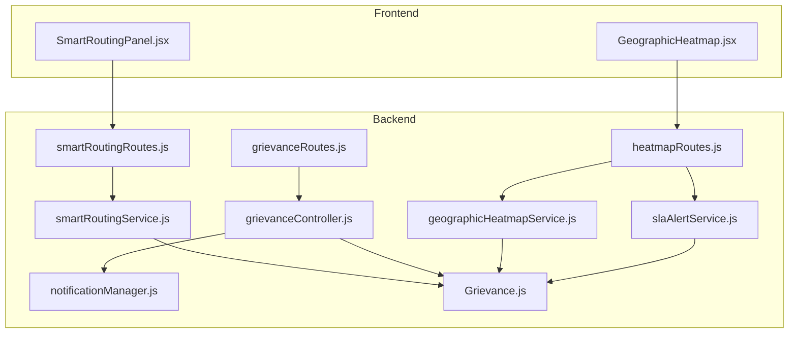
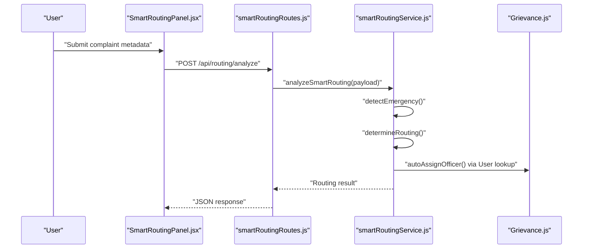
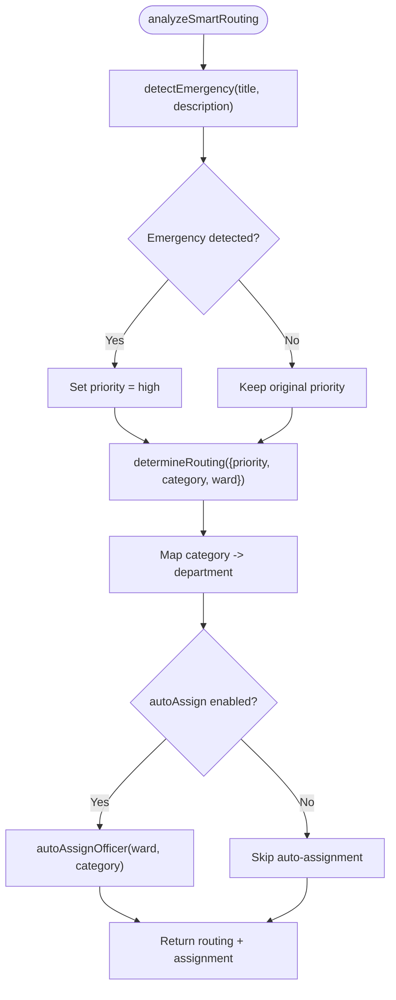
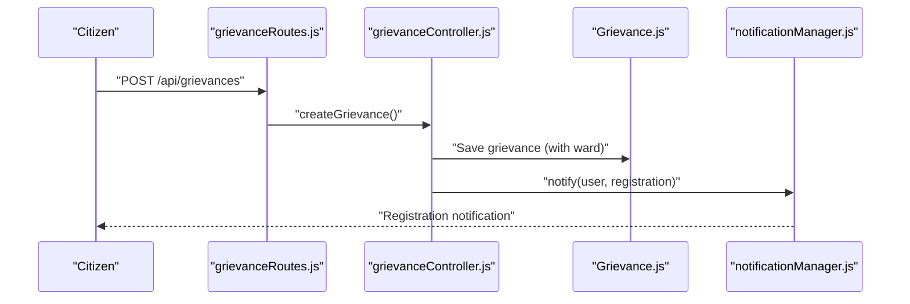
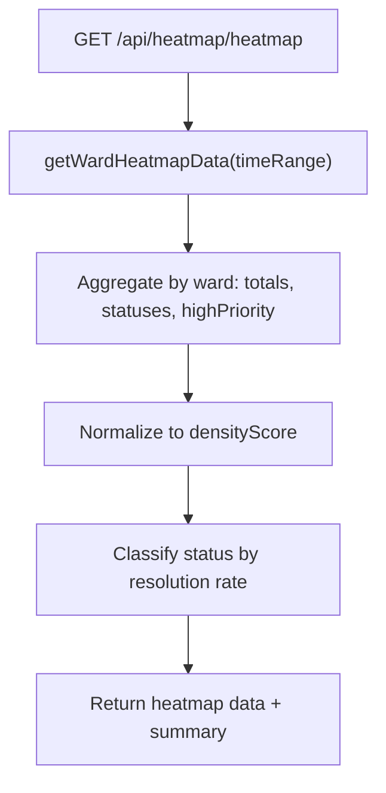
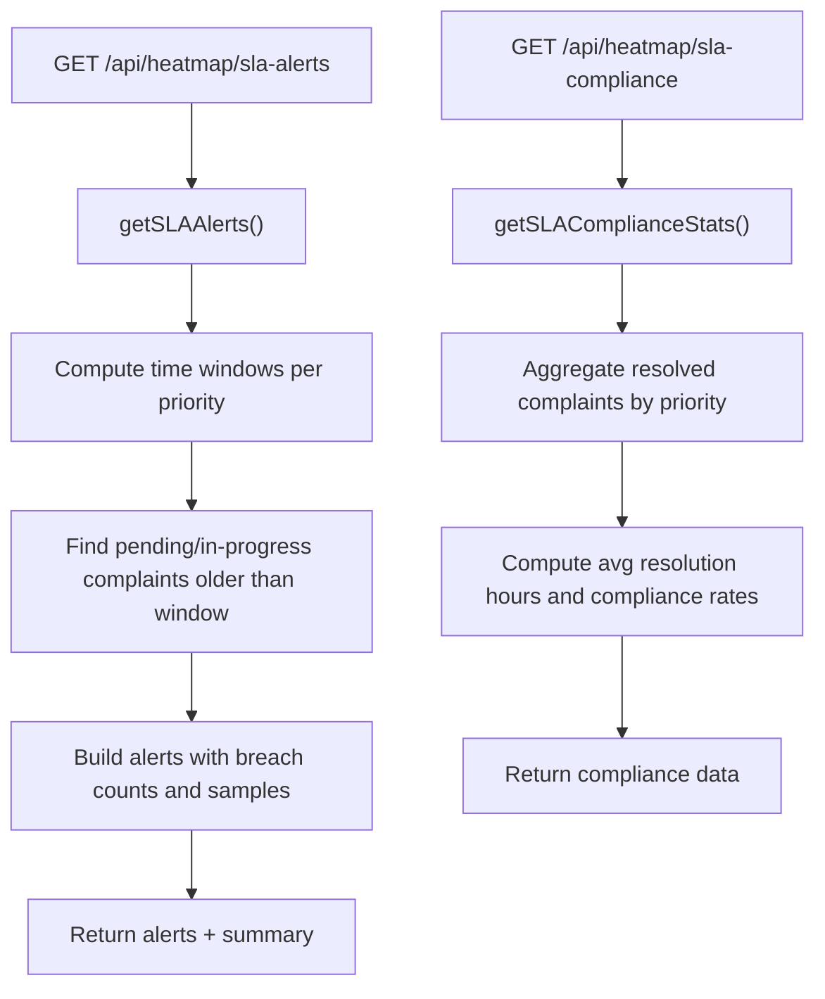
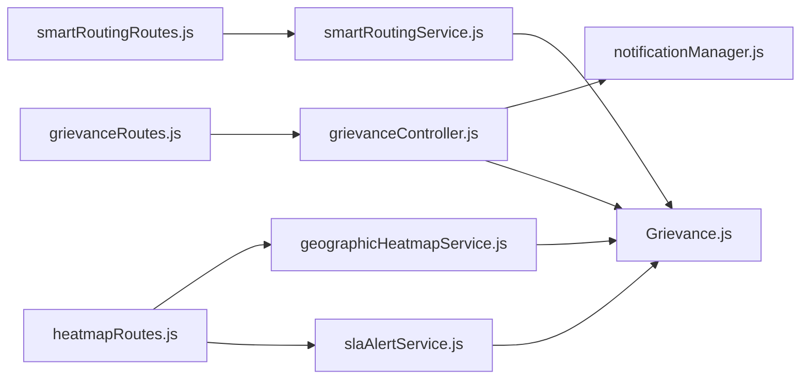

# Department Assignment and Routing

<cite>
**Referenced Files in This Document**
- [smartRoutingService.js](file://backend/src/services/smartRoutingService.js)
- [smartRoutingRoutes.js](file://backend/src/routes/smartRoutingRoutes.js)
- [grievanceController.js](file://backend/src/controllers/grievanceController.js)
- [grievanceRoutes.js](file://backend/src/routes/grievanceRoutes.js)
- [geographicHeatmapService.js](file://backend/src/services/geographicHeatmapService.js)
- [heatmapRoutes.js](file://backend/src/routes/heatmapRoutes.js)
- [slaAlertService.js](file://backend/src/services slaAlertService.js)
- [notificationManager.js](file://backend/src/services/notificationManager.js)
- [Grievance.js](file://backend/src/models/Grievance.js)
- [GeographicHeatmap.jsx](file://frontend/src/components/analytics/GeographicHeatmap.jsx)
- [SmartRoutingPanel.jsx](file://frontend/src/components/analytics/SmartRoutingPanel.jsx)
</cite>

## Table of Contents
1. [Introduction](#introduction)
2. [Project Structure](#project-structure)
3. [Core Components](#core-components)
4. [Architecture Overview](#architecture-overview)
5. [Detailed Component Analysis](#detailed-component-analysis)
6. [Dependency Analysis](#dependency-analysis)
7. [Performance Considerations](#performance-considerations)
8. [Troubleshooting Guide](#troubleshooting-guide)
9. [Conclusion](#conclusion)

## Introduction
This document explains the department assignment and smart routing system for municipal grievance/complaint management. It covers:
- Complaint categorization and automatic routing based on category and location
- Smart routing algorithms including emergency detection, priority-based routing, and officer auto-assignment
- Manual assignment capabilities for administrators
- Integration with geographic heatmap and SLA monitoring for routing efficiency
- Priority-based routing with expedited processing for high-priority complaints
- Examples of routing scenarios, assignment rules, and performance metrics

## Project Structure
The system spans backend services and routes for smart routing, grievance lifecycle management, geographic heatmaps, and SLA monitoring, plus frontend panels for interactive routing analysis and heatmap visualization.

**Diagram sources**
- [smartRoutingRoutes.js:1-78](file://backend/src/routes/smartRoutingRoutes.js#L1-L78)
- [grievanceRoutes.js:1-62](file://backend/src/routes/grievanceRoutes.js#L1-L62)
- [heatmapRoutes.js:1-68](file://backend/src/routes/heatmapRoutes.js#L1-L68)
- [smartRoutingService.js:1-199](file://backend/src/services/smartRoutingService.js#L1-L199)
- [geographicHeatmapService.js:1-91](file://backend/src/services/geographicHeatmapService.js#L1-L91)
- [slaAlertService.js:1-95](file://backend/src/services/slaAlertService.js#L1-L95)
- [notificationManager.js:1-93](file://backend/src/services/notificationManager.js#L1-L93)
- [grievanceController.js:1-752](file://backend/src/controllers/grievanceController.js#L1-L752)
- [Grievance.js:1-115](file://backend/src/models/Grievance.js#L1-L115)
- [SmartRoutingPanel.jsx:1-178](file://frontend/src/components/analytics/SmartRoutingPanel.jsx#L1-L178)
- [GeographicHeatmap.jsx:1-101](file://frontend/src/components/analytics/GeographicHeatmap.jsx#L1-L101)

**Section sources**
- [smartRoutingRoutes.js:1-78](file://backend/src/routes/smartRoutingRoutes.js#L1-L78)
- [grievanceRoutes.js:1-62](file://backend/src/routes/grievanceRoutes.js#L1-L62)
- [heatmapRoutes.js:1-68](file://backend/src/routes/heatmapRoutes.js#L1-L68)
- [smartRoutingService.js:1-199](file://backend/src/services/smartRoutingService.js#L1-L199)
- [geographicHeatmapService.js:1-91](file://backend/src/services/geographicHeatmapService.js#L1-L91)
- [slaAlertService.js:1-95](file://backend/src/services/slaAlertService.js#L1-L95)
- [notificationManager.js:1-93](file://backend/src/services/notificationManager.js#L1-L93)
- [grievanceController.js:1-752](file://backend/src/controllers/grievanceController.js#L1-L752)
- [Grievance.js:1-115](file://backend/src/models/Grievance.js#L1-L115)
- [SmartRoutingPanel.jsx:1-178](file://frontend/src/components/analytics/SmartRoutingPanel.jsx#L1-L178)
- [GeographicHeatmap.jsx:1-101](file://frontend/src/components/analytics/GeographicHeatmap.jsx#L1-L101)

## Core Components
- Smart Routing Service: Implements emergency detection, priority-based routing, and officer auto-assignment.
- Grievance Controller: Manages complaint lifecycle, including creation, status/priority updates, and notifications.
- Geographic Heatmap Service: Aggregates ward-level complaint density and category hotspots.
- SLA Alert Service: Monitors SLA breaches and computes compliance metrics.
- Frontend Panels: Provide interactive routing analysis and heatmap visualization.

**Section sources**
- [smartRoutingService.js:1-199](file://backend/src/services/smartRoutingService.js#L1-L199)
- [grievanceController.js:65-217](file://backend/src/controllers/grievanceController.js#L65-L217)
- [geographicHeatmapService.js:1-91](file://backend/src/services/geographicHeatmapService.js#L1-L91)
- [slaAlertService.js:1-95](file://backend/src/services/slaAlertService.js#L1-L95)
- [SmartRoutingPanel.jsx:1-178](file://frontend/src/components/analytics/SmartRoutingPanel.jsx#L1-L178)
- [GeographicHeatmap.jsx:1-101](file://frontend/src/components/analytics/GeographicHeatmap.jsx#L1-L101)

## Architecture Overview
The system integrates frontend panels with backend routes and services to deliver smart routing decisions and operational insights.

**Diagram sources**
- [SmartRoutingPanel.jsx:21-42](file://frontend/src/components/analytics/SmartRoutingPanel.jsx#L21-L42)
- [smartRoutingRoutes.js:18-38](file://backend/src/routes/smartRoutingRoutes.js#L18-L38)
- [smartRoutingService.js:161-190](file://backend/src/services/smartRoutingService.js#L161-L190)
- [Grievance.js:1-115](file://backend/src/models/Grievance.js#L1-L115)

## Detailed Component Analysis

### Smart Routing Service
Implements:
- Emergency keyword detection and severity scoring
- Priority-based routing configuration with target response times and escalation levels
- Department mapping from categories
- Officer auto-assignment by ward with fallback to admin

Key behaviors:
- Emergency override: If emergency keywords are detected, priority is elevated to high.
- Auto-assignment: Searches for an active ward_admin in the same ward; falls back to any active admin.
- Routing result includes department, target response time, escalation level, and supervisor notification flag.

**Diagram sources**
- [smartRoutingService.js:161-190](file://backend/src/services/smartRoutingService.js#L161-L190)
- [smartRoutingService.js:120-156](file://backend/src/services/smartRoutingService.js#L120-L156)
- [smartRoutingService.js:64-115](file://backend/src/services/smartRoutingService.js#L64-L115)

**Section sources**
- [smartRoutingService.js:1-199](file://backend/src/services/smartRoutingService.js#L1-L199)

### Grievance Lifecycle and Notifications
- Creation enforces mandatory ward field and strict validation.
- Registration triggers notifications; high-priority complaints trigger critical alerts.
- Status and priority updates are audited and notify users accordingly.

**Diagram sources**
- [grievanceRoutes.js:26-27](file://backend/src/routes/grievanceRoutes.js#L26-L27)
- [grievanceController.js:70-217](file://backend/src/controllers/grievanceController.js#L70-L217)
- [notificationManager.js:7-54](file://backend/src/services/notificationManager.js#L7-L54)

**Section sources**
- [grievanceController.js:65-217](file://backend/src/controllers/grievanceController.js#L65-L217)
- [grievanceRoutes.js:1-62](file://backend/src/routes/grievanceRoutes.js#L1-L62)
- [notificationManager.js:1-93](file://backend/src/services/notificationManager.js#L1-L93)

### Geographic Heatmap Integration
- Ward-level aggregation of complaints by status and priority.
- Density score normalization and status classification (critical/warning/normal).
- Hotspot discovery by ward-category combinations.

**Diagram sources**
- [heatmapRoutes.js:20-27](file://backend/src/routes/heatmapRoutes.js#L20-L27)
- [geographicHeatmapService.js:8-63](file://backend/src/services/geographicHeatmapService.js#L8-L63)

**Section sources**
- [geographicHeatmapService.js:1-91](file://backend/src/services/geographicHeatmapService.js#L1-L91)
- [heatmapRoutes.js:1-68](file://backend/src/routes/heatmapRoutes.js#L1-L68)
- [GeographicHeatmap.jsx:1-101](file://frontend/src/components/analytics/GeographicHeatmap.jsx#L1-L101)

### SLA Monitoring and Compliance
- Real-time SLA breach detection per priority tier.
- Compliance statistics computed from resolved complaints with measured resolution times.

**Diagram sources**
- [heatmapRoutes.js:46-66](file://backend/src/routes/heatmapRoutes.js#L46-L66)
- [slaAlertService.js:14-62](file://backend/src/services/slaAlertService.js#L14-L62)
- [slaAlertService.js:64-93](file://backend/src/services/slaAlertService.js#L64-L93)

**Section sources**
- [slaAlertService.js:1-95](file://backend/src/services/slaAlertService.js#L1-L95)
- [heatmapRoutes.js:1-68](file://backend/src/routes/heatmapRoutes.js#L1-L68)

### Frontend Panels
- SmartRoutingPanel: Allows administrators to simulate routing by entering complaint metadata and displays emergency detection, final priority, target response time, department, and auto-assigned officer.
- GeographicHeatmap: Fetches and renders ward-level heatmap data with density indicators and status badges.

**Section sources**
- [SmartRoutingPanel.jsx:1-178](file://frontend/src/components/analytics/SmartRoutingPanel.jsx#L1-L178)
- [GeographicHeatmap.jsx:1-101](file://frontend/src/components/analytics/GeographicHeatmap.jsx#L1-L101)

## Dependency Analysis
- Routes depend on services for business logic and on controllers for CRUD operations.
- Services depend on models for persistence and on each other for coordinated behavior.
- Frontend panels consume backend routes via authenticated fetch calls.

**Diagram sources**
- [smartRoutingRoutes.js:1-78](file://backend/src/routes/smartRoutingRoutes.js#L1-L78)
- [grievanceRoutes.js:1-62](file://backend/src/routes/grievanceRoutes.js#L1-L62)
- [heatmapRoutes.js:1-68](file://backend/src/routes/heatmapRoutes.js#L1-L68)
- [smartRoutingService.js:1-199](file://backend/src/services/smartRoutingService.js#L1-L199)
- [geographicHeatmapService.js:1-91](file://backend/src/services/geographicHeatmapService.js#L1-L91)
- [slaAlertService.js:1-95](file://backend/src/services/slaAlertService.js#L1-L95)
- [notificationManager.js:1-93](file://backend/src/services/notificationManager.js#L1-L93)
- [grievanceController.js:1-752](file://backend/src/controllers/grievanceController.js#L1-L752)
- [Grievance.js:1-115](file://backend/src/models/Grievance.js#L1-L115)

**Section sources**
- [smartRoutingRoutes.js:1-78](file://backend/src/routes/smartRoutingRoutes.js#L1-L78)
- [grievanceRoutes.js:1-62](file://backend/src/routes/grievanceRoutes.js#L1-L62)
- [heatmapRoutes.js:1-68](file://backend/src/routes/heatmapRoutes.js#L1-L68)
- [smartRoutingService.js:1-199](file://backend/src/services/smartRoutingService.js#L1-L199)
- [geographicHeatmapService.js:1-91](file://backend/src/services/geographicHeatmapService.js#L1-L91)
- [slaAlertService.js:1-95](file://backend/src/services/slaAlertService.js#L1-L95)
- [notificationManager.js:1-93](file://backend/src/services/notificationManager.js#L1-L93)
- [grievanceController.js:1-752](file://backend/src/controllers/grievanceController.js#L1-L752)
- [Grievance.js:1-115](file://backend/src/models/Grievance.js#L1-L115)

## Performance Considerations
- Indexing: The Grievance model defines indexes on ward, category, priority, status, and timestamps to optimize routing and analytics queries.
- Aggregation efficiency: Heatmap and SLA services use aggregation pipelines to compute counts and averages server-side.
- Asynchronous notifications: Notification orchestration runs concurrently and non-blockingly to avoid impacting response times.

Recommendations:
- Monitor query plans for large time windows in heatmap and SLA calculations.
- Consider caching frequently accessed heatmap summaries for dashboard rendering.
- Add pagination for SLA breach lists when volumes grow.

**Section sources**
- [Grievance.js:102-113](file://backend/src/models/Grievance.js#L102-L113)
- [geographicHeatmapService.js:14-63](file://backend/src/services/geographicHeatmapService.js#L14-L63)
- [slaAlertService.js:64-93](file://backend/src/services/slaAlertService.js#L64-L93)
- [notificationManager.js:49-54](file://backend/src/services/notificationManager.js#L49-L54)

## Troubleshooting Guide
Common issues and resolutions:
- Emergency detection returning unexpected results:
  - Verify input payload includes title and description; ensure keywords are present for detection.
  - Review emergency keyword list and severity thresholds.
- Auto-assignment failures:
  - Confirm presence of active ward_admin in the specified ward; otherwise fallback to admin is used.
  - Check database connectivity and user role assignments.
- Routing endpoint errors:
  - Validate required fields (title, optional description, priority, category, ward).
  - Inspect service error handling and logging.
- Heatmap and SLA endpoints:
  - Ensure authentication and role checks pass; verify time range and limits.
  - Check aggregation pipeline performance and indexes.

**Section sources**
- [smartRoutingRoutes.js:18-76](file://backend/src/routes/smartRoutingRoutes.js#L18-L76)
- [smartRoutingService.js:41-115](file://backend/src/services/smartRoutingService.js#L41-L115)
- [geographicHeatmapService.js:8-63](file://backend/src/services/geographicHeatmapService.js#L8-L63)
- [slaAlertService.js:14-62](file://backend/src/services/slaAlertService.js#L14-L62)

## Conclusion
The department assignment and smart routing system combines emergency detection, priority-based routing, and officer auto-assignment with geographic insights and SLA monitoring. Administrators can leverage frontend panels to simulate routing scenarios, while the backend ensures robust, auditable, and scalable processing of municipal complaints.