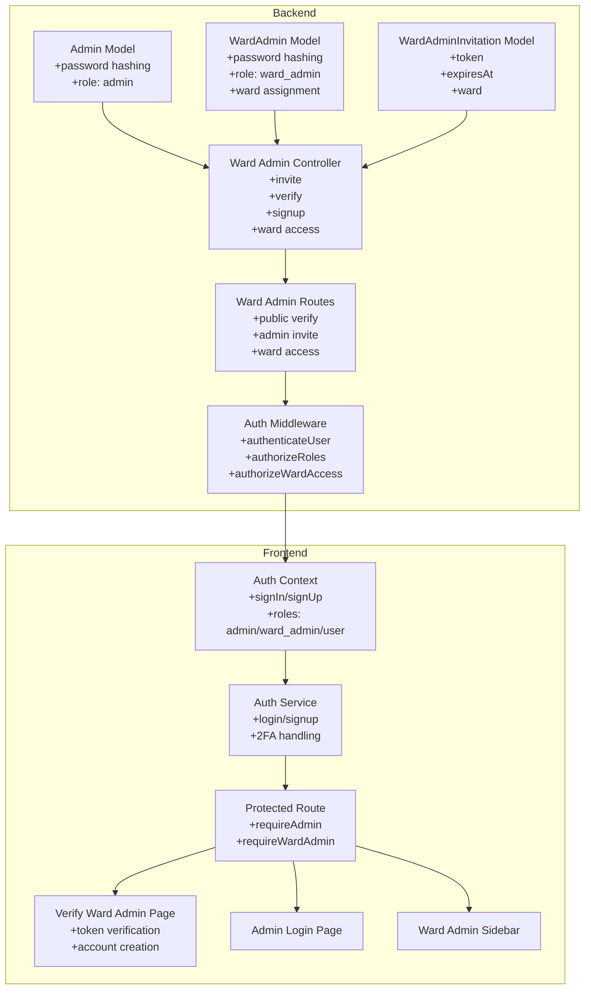
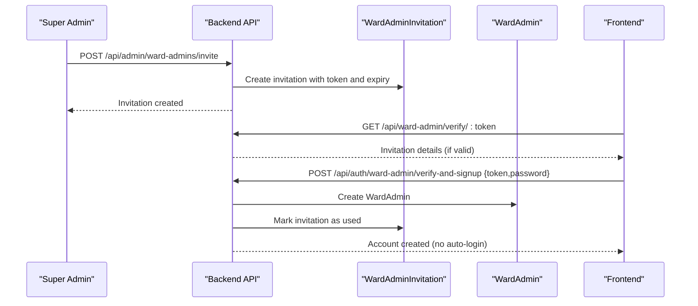
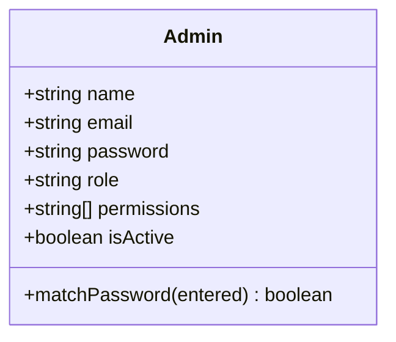
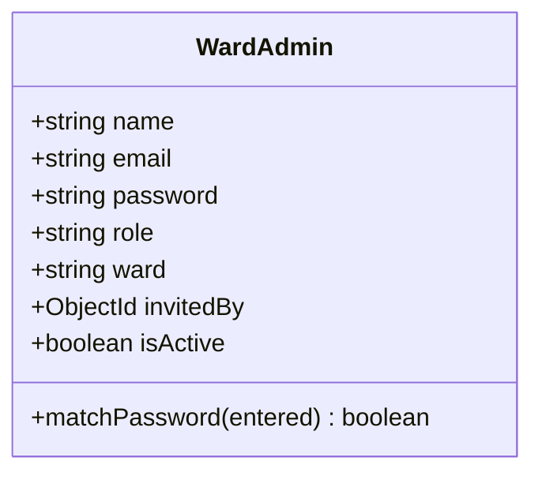
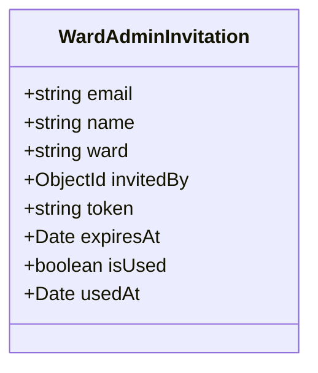
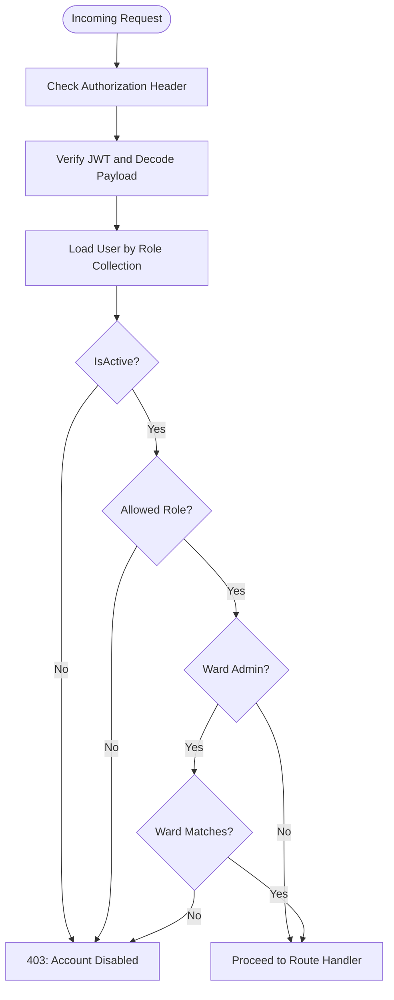
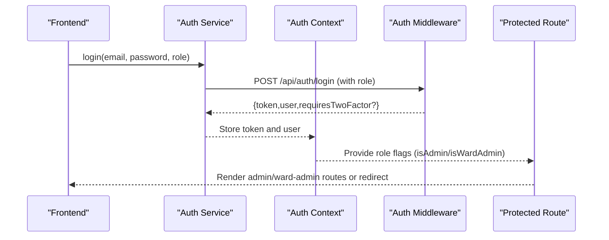
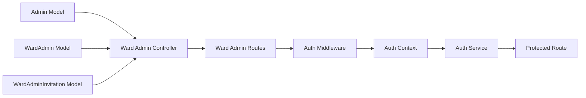

# Administrative Models & Permissions

<cite>
**Referenced Files in This Document**
- [Admin.js](file://backend/src/models/Admin.js)
- [WardAdmin.js](file://backend/src/models/WardAdmin.js)
- [WardAdminInvitation.js](file://backend/src/models/WardAdminInvitation.js)
- [wardAdminController.js](file://backend/src/controllers/wardAdminController.js)
- [wardAdminRoutes.js](file://backend/src/routes/wardAdminRoutes.js)
- [authMiddleware.js](file://backend/src/middleware/authMiddleware.js)
- [auth-context.jsx](file://Frontend/src/context/auth-context.jsx)
- [authService.js](file://Frontend/src/services/authService.js)
- [ProtectedRoute.jsx](file://Frontend/src/components/ProtectedRoute.jsx)
- [VerifyWardAdmin.jsx](file://Frontend/src/pages/VerifyWardAdmin.jsx)
- [AdminLogin.jsx](file://Frontend/src/pages/AdminLogin.jsx)
- [WardAdminSidebar.jsx](file://Frontend/src/components/WardAdminSidebar.jsx)
</cite>

## Table of Contents
1. [Introduction](#introduction)
2. [Project Structure](#project-structure)
3. [Core Components](#core-components)
4. [Architecture Overview](#architecture-overview)
5. [Detailed Component Analysis](#detailed-component-analysis)
6. [Dependency Analysis](#dependency-analysis)
7. [Performance Considerations](#performance-considerations)
8. [Troubleshooting Guide](#troubleshooting-guide)
9. [Conclusion](#conclusion)

## Introduction
This document provides comprehensive data model documentation for administrative entities in the SmartCity Portal, focusing on the Admin and WardAdmin models, their role-specific attributes, access permissions, and the multi-tier authentication system. It explains how the system separates citizen users from administrative users, outlines role hierarchies, permission matrices, access control patterns, and security considerations. It also documents the WardAdminInvitation model and the invitation/verification workflow that enables secure onboarding of administrative users at the ward level.

## Project Structure
The administrative models and permissions span both backend and frontend layers:
- Backend models define Admin, WardAdmin, and WardAdminInvitation entities with schema-level constraints and security hooks.
- Backend controllers and routes implement invitation workflows, verification, and ward-specific access enforcement.
- Middleware enforces authentication and role-based authorization across all requests.
- Frontend context, services, and protected routing integrate the multi-tier authentication system and role-aware navigation.

**Diagram sources**
- [Admin.js:1-55](file://backend/src/models/Admin.js#L1-L55)
- [WardAdmin.js:1-61](file://backend/src/models/WardAdmin.js#L1-L61)
- [WardAdminInvitation.js:1-50](file://backend/src/models/WardAdminInvitation.js#L1-L50)
- [wardAdminController.js:1-450](file://backend/src/controllers/wardAdminController.js#L1-L450)
- [wardAdminRoutes.js:1-28](file://backend/src/routes/wardAdminRoutes.js#L1-L28)
- [authMiddleware.js:1-114](file://backend/src/middleware/authMiddleware.js#L1-L114)
- [auth-context.jsx:1-143](file://Frontend/src/context/auth-context.jsx#L1-L143)
- [authService.js:1-99](file://Frontend/src/services/authService.js#L1-L99)
- [ProtectedRoute.jsx:1-47](file://Frontend/src/components/ProtectedRoute.jsx#L1-L47)
- [VerifyWardAdmin.jsx:1-292](file://Frontend/src/pages/VerifyWardAdmin.jsx#L1-L292)
- [AdminLogin.jsx:1-199](file://Frontend/src/pages/AdminLogin.jsx#L1-L199)
- [WardAdminSidebar.jsx:1-95](file://Frontend/src/components/WardAdminSidebar.jsx#L1-L95)

**Section sources**
- [Admin.js:1-55](file://backend/src/models/Admin.js#L1-L55)
- [WardAdmin.js:1-61](file://backend/src/models/WardAdmin.js#L1-L61)
- [WardAdminInvitation.js:1-50](file://backend/src/models/WardAdminInvitation.js#L1-L50)
- [wardAdminController.js:1-450](file://backend/src/controllers/wardAdminController.js#L1-L450)
- [wardAdminRoutes.js:1-28](file://backend/src/routes/wardAdminRoutes.js#L1-L28)
- [authMiddleware.js:1-114](file://backend/src/middleware/authMiddleware.js#L1-L114)
- [auth-context.jsx:1-143](file://Frontend/src/context/auth-context.jsx#L1-L143)
- [authService.js:1-99](file://Frontend/src/services/authService.js#L1-L99)
- [ProtectedRoute.jsx:1-47](file://Frontend/src/components/ProtectedRoute.jsx#L1-L47)
- [VerifyWardAdmin.jsx:1-292](file://Frontend/src/pages/VerifyWardAdmin.jsx#L1-L292)
- [AdminLogin.jsx:1-199](file://Frontend/src/pages/AdminLogin.jsx#L1-L199)
- [WardAdminSidebar.jsx:1-95](file://Frontend/src/components/WardAdminSidebar.jsx#L1-L95)

## Core Components
This section documents the administrative data models and their core attributes and behaviors.

- Admin Model
  - Purpose: Superuser administrative entity with system-wide privileges.
  - Key attributes:
    - name: string, required
    - email: string, unique, lowercase, required
    - password: string, hashed before save, required
    - role: string, immutable default "admin"
    - permissions: array of strings, defaults to manage_users, manage_complaints, manage_ward_admins, view_reports
    - isActive: boolean, default true
  - Security:
    - Pre-save hook hashes passwords using bcrypt.
    - Provides password comparison method for authentication.
  - Access: Full administrative access controlled by role and permissions.

- WardAdmin Model
  - Purpose: Administrative entity scoped to a specific ward.
  - Key attributes:
    - name: string, required
    - email: string, unique, lowercase, required
    - password: string, hashed before save, required
    - role: string, immutable default "ward_admin"
    - ward: string, required, enum ["Ward 1", "Ward 2", "Ward 3", "Ward 4", "Ward 5"]
    - invitedBy: ObjectId referencing Admin, optional
    - isActive: boolean, default true
  - Security:
    - Pre-save hook hashes passwords using bcrypt.
    - Provides password comparison method for authentication.
  - Access: Limited to data within their assigned ward; enforced by middleware and controllers.

- WardAdminInvitation Model
  - Purpose: Manages invitations for onboarding new WardAdmin users.
  - Key attributes:
    - email: string, unique, lowercase, required
    - name: string, required
    - ward: string, enum ["Ward 1", "Ward 2", "Ward 3", "Ward 4", "Ward 5"], required
    - invitedBy: ObjectId referencing User (citizen), required
    - token: string, unique, required
    - expiresAt: Date, required
    - isUsed: boolean, default false
    - usedAt: Date, optional
  - Lifecycle:
    - Automatically cleaned up after expiration via TTL index on expiresAt.

**Section sources**
- [Admin.js:1-55](file://backend/src/models/Admin.js#L1-L55)
- [WardAdmin.js:1-61](file://backend/src/models/WardAdmin.js#L1-L61)
- [WardAdminInvitation.js:1-50](file://backend/src/models/WardAdminInvitation.js#L1-L50)

## Architecture Overview
The system implements a multi-tier authentication and authorization architecture:
- Authentication: JWT-based tokens carry role claims to identify user type (admin, ward_admin, user).
- Authorization: Role-based access control (RBAC) combined with ward-scoped access for ward_admin.
- Separation of concerns:
  - Citizen users (role=user) are authenticated against the User collection.
  - Administrative users (role=admin or role=ward_admin) are authenticated against Admin or WardAdmin collections respectively.
- Invitation workflow: Super Admin creates invitations with expiring tokens; invited users verify and sign up without auto-login.

**Diagram sources**
- [wardAdminController.js:14-101](file://backend/src/controllers/wardAdminController.js#L14-L101)
- [wardAdminController.js:108-179](file://backend/src/controllers/wardAdminController.js#L108-L179)
- [wardAdminController.js:186-298](file://backend/src/controllers/wardAdminController.js#L186-L298)
- [wardAdminRoutes.js:15-17](file://backend/src/routes/wardAdminRoutes.js#L15-L17)

**Section sources**
- [wardAdminController.js:14-101](file://backend/src/controllers/wardAdminController.js#L14-L101)
- [wardAdminController.js:108-179](file://backend/src/controllers/wardAdminController.js#L108-L179)
- [wardAdminController.js:186-298](file://backend/src/controllers/wardAdminController.js#L186-L298)
- [wardAdminRoutes.js:15-17](file://backend/src/routes/wardAdminRoutes.js#L15-L17)

## Detailed Component Analysis

### Admin Model
- Schema and constraints:
  - Enforces unique email, lowercase normalization, minimum password length.
  - Immutable role ensures role cannot be changed post-creation.
  - Default permissions array defines baseline administrative capabilities.
- Security:
  - Pre-save hashing of passwords using bcrypt.
  - Password comparison method for login verification.
- Access patterns:
  - Role "admin" grants superuser privileges across the system.
  - Middleware and routes restrict sensitive operations to admin role.

**Diagram sources**
- [Admin.js:4-38](file://backend/src/models/Admin.js#L4-L38)

**Section sources**
- [Admin.js:1-55](file://backend/src/models/Admin.js#L1-L55)

### WardAdmin Model
- Schema and constraints:
  - Enforces unique email, lowercase normalization, minimum password length.
  - Enumerated ward values restrict assignments to predefined wards.
  - Optional invitedBy reference to Admin for auditability.
- Security:
  - Pre-save hashing of passwords using bcrypt.
  - Password comparison method for login verification.
- Access patterns:
  - Role "ward_admin" grants access only to data within their assigned ward.
  - Ward-scoped access enforced by middleware and controllers.

**Diagram sources**
- [WardAdmin.js:4-44](file://backend/src/models/WardAdmin.js#L4-L44)

**Section sources**
- [WardAdmin.js:1-61](file://backend/src/models/WardAdmin.js#L1-L61)

### WardAdminInvitation Model
- Schema and lifecycle:
  - Unique token per invitation with expiration date.
  - TTL index on expiresAt ensures automatic cleanup of expired records.
  - Tracks who invited (invitedBy) and whether the invitation was used.
- Workflow integration:
  - Controller generates tokens with 7-day expiry.
  - Email delivery handled by email service; failures rollback invitation creation.
  - Verification endpoints confirm validity and prevent duplicate accounts.

**Diagram sources**
- [WardAdminInvitation.js:3-45](file://backend/src/models/WardAdminInvitation.js#L3-L45)

**Section sources**
- [WardAdminInvitation.js:1-50](file://backend/src/models/WardAdminInvitation.js#L1-L50)

### Authentication and Authorization Middleware
- authenticateUser:
  - Extracts Bearer token from Authorization header.
  - Verifies JWT and loads user from Admin, WardAdmin, or User collection based on role claim.
  - Blocks inactive accounts and normalizes role for citizens (role=user).
- authorizeRoles:
  - Enforces role-based access to protected routes.
- authorizeWardAccess:
  - Super Admin bypasses ward checks.
  - Ward Admin access restricted to their assigned ward; rejects mismatched ward parameters.

**Diagram sources**
- [authMiddleware.js:10-55](file://backend/src/middleware/authMiddleware.js#L10-L55)
- [authMiddleware.js:61-71](file://backend/src/middleware/authMiddleware.js#L61-L71)
- [authMiddleware.js:77-104](file://backend/src/middleware/authMiddleware.js#L77-L104)

**Section sources**
- [authMiddleware.js:1-114](file://backend/src/middleware/authMiddleware.js#L1-L114)

### Frontend Multi-Tier Authentication Integration
- Auth Context:
  - Centralized authentication state with role detection (isAdmin, isWardAdmin, isManagement).
  - Integrates with local storage for persistence across sessions.
- Protected Routes:
  - enforce role-based redirection for admin and ward admin dashboards.
  - Redirect unauthorized users appropriately based on role and route requirements.
- Login Pages:
  - AdminLogin page submits role="admin" to backend.
  - Ward Admin pages handle verification and signup flows after invitation validation.
- Navigation:
  - WardAdminSidebar displays role-aware menu items and current ward context.

**Diagram sources**
- [authService.js:37-80](file://Frontend/src/services/authService.js#L37-L80)
- [auth-context.jsx:6-134](file://Frontend/src/context/auth-context.jsx#L6-L134)
- [ProtectedRoute.jsx:5-44](file://Frontend/src/components/ProtectedRoute.jsx#L5-L44)
- [AdminLogin.jsx:22-91](file://Frontend/src/pages/AdminLogin.jsx#L22-L91)

**Section sources**
- [auth-context.jsx:1-143](file://Frontend/src/context/auth-context.jsx#L1-L143)
- [authService.js:1-99](file://Frontend/src/services/authService.js#L1-L99)
- [ProtectedRoute.jsx:1-47](file://Frontend/src/components/ProtectedRoute.jsx#L1-L47)
- [AdminLogin.jsx:1-199](file://Frontend/src/pages/AdminLogin.jsx#L1-L199)
- [WardAdminSidebar.jsx:1-95](file://Frontend/src/components/WardAdminSidebar.jsx#L1-L95)

## Dependency Analysis
The administrative subsystem exhibits clear separation of concerns and layered dependencies:
- Models depend on Mongoose for schema definition and pre-save hooks.
- Controllers depend on models and services for business logic and external integrations.
- Routes depend on controllers and middleware for request handling.
- Frontend depends on backend APIs and middleware for authentication and authorization.

**Diagram sources**
- [Admin.js:1-55](file://backend/src/models/Admin.js#L1-L55)
- [WardAdmin.js:1-61](file://backend/src/models/WardAdmin.js#L1-L61)
- [WardAdminInvitation.js:1-50](file://backend/src/models/WardAdminInvitation.js#L1-L50)
- [wardAdminController.js:1-450](file://backend/src/controllers/wardAdminController.js#L1-L450)
- [wardAdminRoutes.js:1-28](file://backend/src/routes/wardAdminRoutes.js#L1-L28)
- [authMiddleware.js:1-114](file://backend/src/middleware/authMiddleware.js#L1-L114)
- [auth-context.jsx:1-143](file://Frontend/src/context/auth-context.jsx#L1-L143)
- [authService.js:1-99](file://Frontend/src/services/authService.js#L1-L99)
- [ProtectedRoute.jsx:1-47](file://Frontend/src/components/ProtectedRoute.jsx#L1-L47)

**Section sources**
- [wardAdminRoutes.js:1-28](file://backend/src/routes/wardAdminRoutes.js#L1-L28)
- [authMiddleware.js:1-114](file://backend/src/middleware/authMiddleware.js#L1-L114)

## Performance Considerations
- Token verification and user lookup:
  - Ensure JWT secret is strong and consistent across services.
  - Cache frequently accessed user metadata where appropriate to reduce database round trips.
- Invitation cleanup:
  - TTL index on expiresAt minimizes manual cleanup overhead.
- Role-based queries:
  - Use targeted projections and indexes on role and ward fields to optimize access checks.
- Frontend caching:
  - Persist minimal user state in local storage to avoid repeated network calls on re-renders.

## Troubleshooting Guide
Common issues and resolutions:
- Authentication failures:
  - Missing or malformed Authorization header: ensure "Bearer <token>" format.
  - Expired or invalid JWT: regenerate token via login flow.
  - User not found in collection: verify role claim matches the intended collection.
- Authorization errors:
  - Role mismatch: ensure route requires the correct role (admin vs ward_admin).
  - Ward access violation: verify ward parameter matches the logged-in user's ward.
- Invitation workflow:
  - Invalid or expired token: check token validity and expiry date.
  - Duplicate account creation: ensure no existing user in User/Admin/WardAdmin collections.
  - Email delivery failure: retry invitation creation; backend rolls back on email failure.

**Section sources**
- [authMiddleware.js:13-54](file://backend/src/middleware/authMiddleware.js#L13-L54)
- [wardAdminController.js:108-179](file://backend/src/controllers/wardAdminController.js#L108-L179)
- [wardAdminController.js:186-298](file://backend/src/controllers/wardAdminController.js#L186-L298)

## Conclusion
The administrative models and permissions system establishes a robust, role-scoped access control framework:
- Admin and WardAdmin models encapsulate role-specific attributes and security behaviors.
- The WardAdminInvitation model streamlines secure onboarding with token-based verification and expiration.
- Middleware enforces authentication and authorization consistently across routes.
- Frontend integrates seamlessly with backend APIs to provide role-aware navigation and protection.
This design supports clear separation between citizen and administrative users while enabling scalable, secure administration at the ward level.