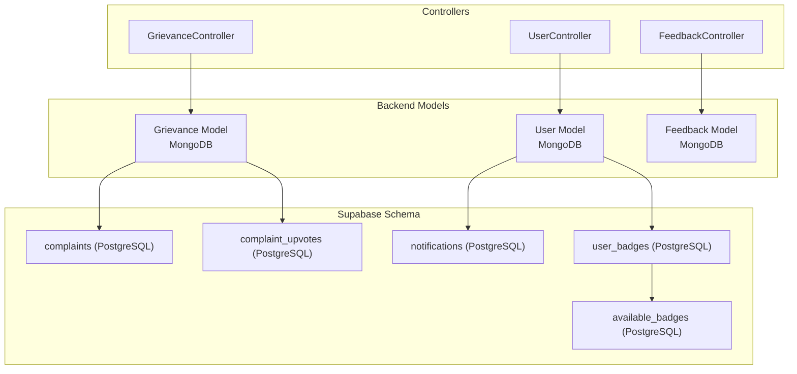
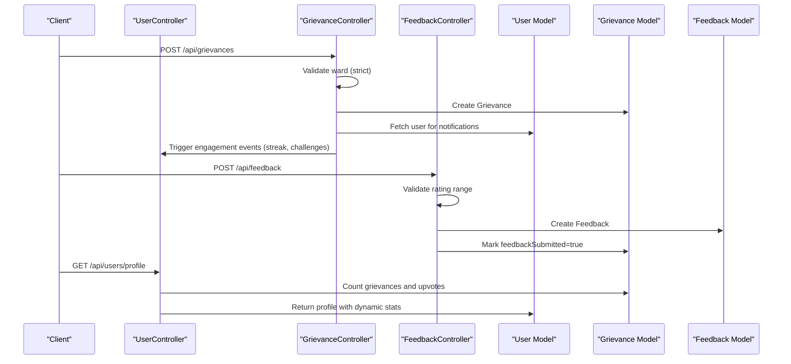
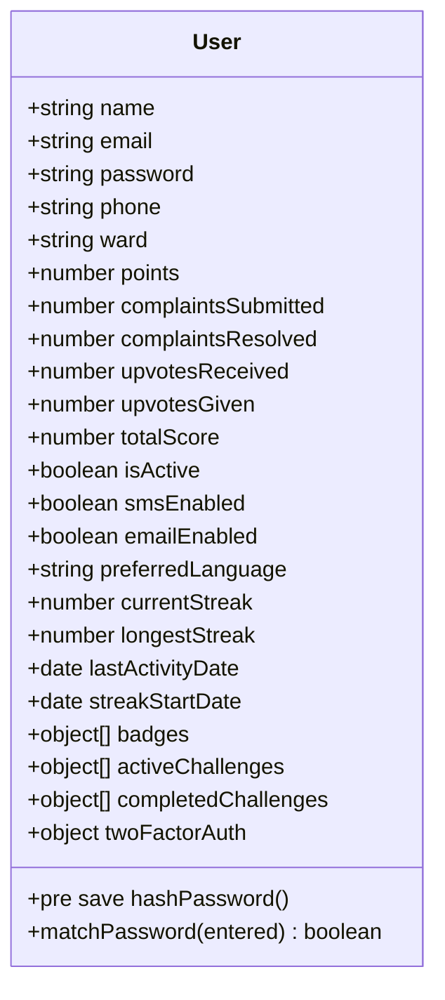
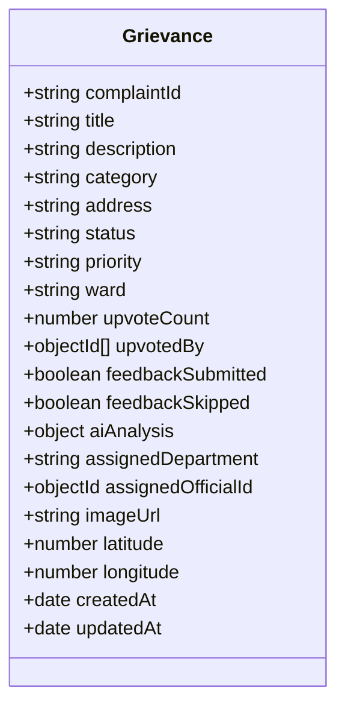
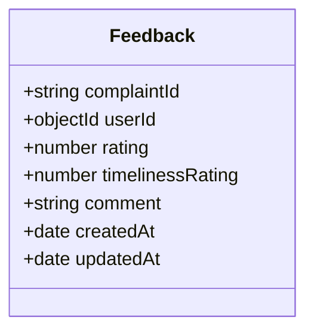
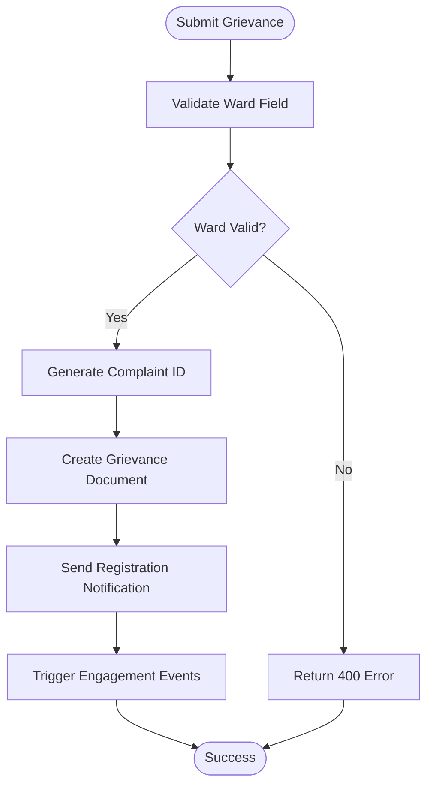
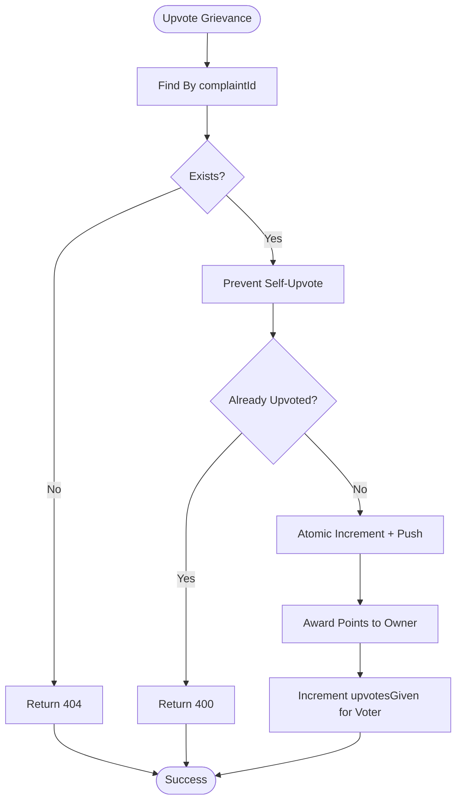
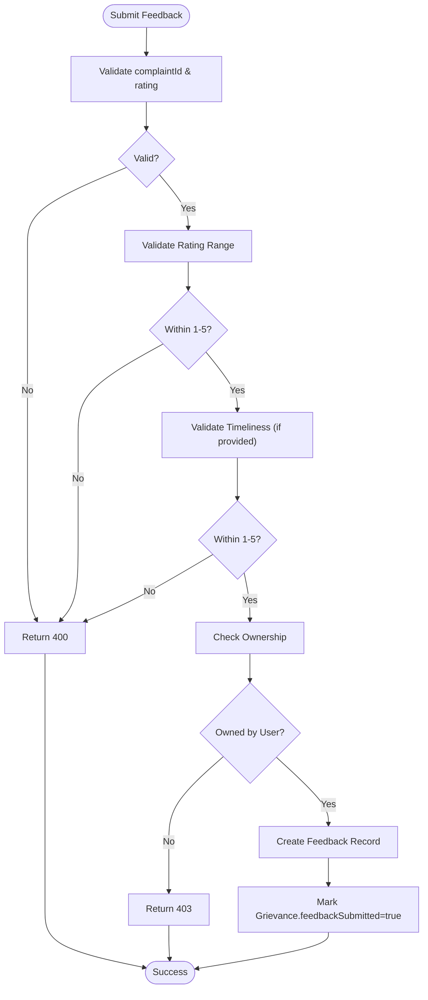
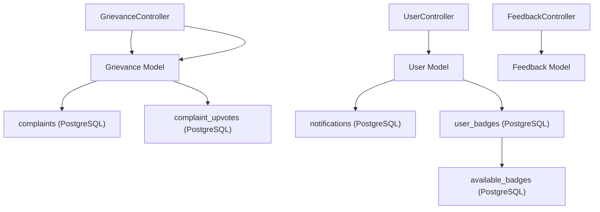

# Core User & Complaint Models

<cite>
**Referenced Files in This Document**
- [User.js](file://backend/src/models/User.js)
- [Grievance.js](file://backend/src/models/Grievance.js)
- [Feedback.js](file://backend/src/models/Feedback.js)
- [userController.js](file://backend/src/controllers/userController.js)
- [grievanceController.js](file://backend/src/controllers/grievanceController.js)
- [feedbackController.js](file://backend/src/controllers/feedbackController.js)
- [types.ts](file://Frontend/src/integrations/supabase/types.ts)
- [20260109195527_19c1635e-2c87-4d72-9195-25cd61fb9064.sql](file://Frontend/supabase/migrations/20260109195527_19c1635e-2c87-4d72-9195-25cd61fb9064.sql)
- [20260110200542_ba1fdd08-97e5-452f-ad68-a6a0adc4d026.sql](file://Frontend/supabase/migrations/20260110200542_ba1fdd08-97e5-452f-ad68-a6a0adc4d026.sql)
- [20260111091530_3a214bc1-7339-4a67-8f5c-1cab34fb9d11.sql](file://Frontend/supabase/migrations/20260111091530_3a214bc1-7339-4a67-8f5c-1cab34fb9d11.sql)
</cite>

## Table of Contents
1. [Introduction](#introduction)
2. [Project Structure](#project-structure)
3. [Core Components](#core-components)
4. [Architecture Overview](#architecture-overview)
5. [Detailed Component Analysis](#detailed-component-analysis)
6. [Dependency Analysis](#dependency-analysis)
7. [Performance Considerations](#performance-considerations)
8. [Troubleshooting Guide](#troubleshooting-guide)
9. [Conclusion](#conclusion)

## Introduction
This document provides comprehensive data model documentation for the core User, Grievance, and Feedback entities in the Smart Voice Report system. It details field definitions, data types, constraints, validations, and relationships between these entities. The documentation also covers gamification tracking, notification preferences, and AI intelligence fields, along with practical usage patterns derived from the backend controllers and Supabase database schema.

## Project Structure
The data models are implemented in the backend using Mongoose for MongoDB and supported by Supabase PostgreSQL for additional features such as notifications, badges, and upvotes. The controllers orchestrate CRUD operations and enforce business rules around authentication, authorization, and data integrity.

**Diagram sources**
- [User.js:1-165](file://backend/src/models/User.js#L1-L165)
- [Grievance.js:1-115](file://backend/src/models/Grievance.js#L1-L115)
- [Feedback.js:1-40](file://backend/src/models/Feedback.js#L1-L40)
- [userController.js:1-523](file://backend/src/controllers/userController.js#L1-L523)
- [grievanceController.js:1-752](file://backend/src/controllers/grievanceController.js#L1-L752)
- [feedbackController.js:1-225](file://backend/src/controllers/feedbackController.js#L1-L225)
- [20260109195527_19c1635e-2c87-4d72-9195-25cd61fb9064.sql:32-45](file://Frontend/supabase/migrations/20260109195527_19c1635e-2c87-4d72-9195-25cd61fb9064.sql#L32-L45)
- [20260111091530_3a214bc1-7339-4a67-8f5c-1cab34fb9d11.sql:4-11](file://Frontend/supabase/migrations/20260111091530_3a214bc1-7339-4a67-8f5c-1cab34fb9d11.sql#L4-L11)

**Section sources**
- [User.js:1-165](file://backend/src/models/User.js#L1-L165)
- [Grievance.js:1-115](file://backend/src/models/Grievance.js#L1-L115)
- [Feedback.js:1-40](file://backend/src/models/Feedback.js#L1-L40)
- [userController.js:1-523](file://backend/src/controllers/userController.js#L1-L523)
- [grievanceController.js:1-752](file://backend/src/controllers/grievanceController.js#L1-L752)
- [feedbackController.js:1-225](file://backend/src/controllers/feedbackController.js#L1-L225)

## Core Components

### User Model
The User model captures authentication credentials, profile information, engagement metrics, gamification tracking, and notification preferences. It includes fields for ward assignment, points, complaints submitted/resolved, upvotes received/given, badges, streaks, challenges, and two-factor authentication settings.

Key characteristics:
- Authentication fields: email (unique, lowercase, trimmed), password (hashed via pre-save hook), and optional phone number.
- Profile information: name (required, trimmed), ward (enum: "Ward 1" to "Ward 5", default "Ward 1").
- Engagement metrics: points (default 0), complaintsSubmitted (default 0), complaintsResolved (default 0), upvotesReceived (default 0), upvotesGiven (default 0), totalScore (default 0).
- Gamification tracking: badges array with nested badgeId, name, category, and earnedAt; streak fields (currentStreak, longestStreak, lastActivityDate, streakStartDate); challenge participation arrays (activeChallenges, completedChallenges).
- Notification preferences: emailEnabled (default true), smsEnabled (default false), preferredLanguage (default "en").
- Two-Factor Authentication: enabled flag, secret, tempSecret, and backupCodes array with code, used flag, and usedAt timestamp.
- Indexes: email, ward, totalScore (leaderboard), points, upvotesReceived, and createdAt.

Validation and constraints:
- Email uniqueness enforced at schema level.
- Password minimum length enforced via schema validation.
- Ward enum validation enforced via schema enum.
- Badge and challenge arrays support nested objects with defaults.

Relationships:
- One-to-many with Grievance via userId reference.
- Many-to-many with badges via user_badges table (Supabase).

**Section sources**
- [User.js:4-165](file://backend/src/models/User.js#L4-L165)
- [userController.js:10-125](file://backend/src/controllers/userController.js#L10-L125)

### Grievance Model
The Grievance model stores complaint details, status tracking, AI intelligence fields, and geolocation/image metadata. It enforces strict ward-based validation during creation and supports upvote tracking and feedback linkage.

Key characteristics:
- Identity: complaintId (unique, auto-generated), title (required, trimmed), description (required, trimmed), category (required, trimmed).
- Location: address (trimmed), ward (required enum: "Ward 1" to "Ward 5"), plus optional imageUrl, latitude, longitude.
- Status tracking: status (enum: "pending", "in-progress", "resolved", default "pending"), priority (enum: "low", "medium", "high", default "medium").
- Ownership and assignment: userId (required ObjectId reference to User), assignedDepartment (string), assignedOfficialId (ObjectId reference to User).
- Upvotes: upvoteCount (default 0), upvotedBy array (ObjectIds referencing User).
- Feedback tracking: feedbackSubmitted (default false), feedbackSkipped (default false).
- AI Intelligence fields: aiAnalysis object containing suggestedCategory, categoryConfidence, suggestedPriority, priorityConfidence, isDuplicateSuspected (default false), duplicateMatches (array of complaint IDs), routingDepartment, detectedKeywords, and analysisTimestamp.
- Timestamps: createdAt and updatedAt managed by Mongoose timestamps.

Validation and constraints:
- Strict ward validation during creation (Mandatory field with enum enforcement).
- Unique complaintId enforced at schema level.
- Indexes optimized for ward queries, status filtering, priority sorting, category filtering, and AI duplicate detection.

Relationships:
- Belongs to User via userId.
- References User for assignedOfficialId.
- Links to Feedback via complaintId.

**Section sources**
- [Grievance.js:3-115](file://backend/src/models/Grievance.js#L3-L115)
- [grievanceController.js:70-217](file://backend/src/controllers/grievanceController.js#L70-L217)

### Feedback Model
The Feedback model captures user ratings, timeliness ratings, and comments for resolved complaints. It ensures one feedback per complaint per user through a unique compound index.

Key characteristics:
- complaintId (required, references Grievance.complaintId), userId (required ObjectId reference to User), rating (required number, min 1, max 5), timelinessRating (optional number, min 1, max 5), comment (optional trimmed string).
- Timestamps: createdAt and updatedAt managed by Mongoose timestamps.

Validation and constraints:
- Required fields: complaintId and rating.
- Rating range validation: 1–5 inclusive.
- Timeliness rating range validation: 1–5 inclusive when provided.
- Unique compound index on complaintId and userId prevents duplicate feedback entries.

Relationships:
- Belongs to Grievance via complaintId.
- Belongs to User via userId.

**Section sources**
- [Feedback.js:3-39](file://backend/src/models/Feedback.js#L3-L39)
- [feedbackController.js:8-82](file://backend/src/controllers/feedbackController.js#L8-L82)

## Architecture Overview
The system integrates MongoDB models with Supabase PostgreSQL tables to support advanced features like notifications, badges, and upvotes. Controllers coordinate data access, enforce authorization rules, and trigger gamification events.

**Diagram sources**
- [grievanceController.js:70-217](file://backend/src/controllers/grievanceController.js#L70-L217)
- [feedbackController.js:8-82](file://backend/src/controllers/feedbackController.js#L8-L82)
- [userController.js:10-64](file://backend/src/controllers/userController.js#L10-L64)

## Detailed Component Analysis

### User Model Class Diagram

**Diagram sources**
- [User.js:4-165](file://backend/src/models/User.js#L4-L165)

**Section sources**
- [User.js:4-165](file://backend/src/models/User.js#L4-L165)

### Grievance Model Class Diagram

**Diagram sources**
- [Grievance.js:3-115](file://backend/src/models/Grievance.js#L3-L115)

**Section sources**
- [Grievance.js:3-115](file://backend/src/models/Grievance.js#L3-L115)

### Feedback Model Class Diagram

**Diagram sources**
- [Feedback.js:3-39](file://backend/src/models/Feedback.js#L3-L39)

**Section sources**
- [Feedback.js:3-39](file://backend/src/models/Feedback.js#L3-L39)

### Grievance Submission Flow

**Diagram sources**
- [grievanceController.js:70-217](file://backend/src/controllers/grievanceController.js#L70-L217)

**Section sources**
- [grievanceController.js:70-217](file://backend/src/controllers/grievanceController.js#L70-L217)

### Upvote and Points Award Flow

**Diagram sources**
- [grievanceController.js:434-514](file://backend/src/controllers/grievanceController.js#L434-L514)

**Section sources**
- [grievanceController.js:434-514](file://backend/src/controllers/grievanceController.js#L434-L514)

### Feedback Submission Validation Flow

**Diagram sources**
- [feedbackController.js:8-82](file://backend/src/controllers/feedbackController.js#L8-L82)

**Section sources**
- [feedbackController.js:8-82](file://backend/src/controllers/feedbackController.js#L8-L82)

## Dependency Analysis
The models and controllers exhibit clear separation of concerns with explicit dependencies:
- Controllers depend on models for data access and business logic.
- Models define schema-level constraints and indexes.
- Supabase schema complements MongoDB models for notifications, badges, and upvotes.

**Diagram sources**
- [userController.js:1-523](file://backend/src/controllers/userController.js#L1-L523)
- [grievanceController.js:1-752](file://backend/src/controllers/grievanceController.js#L1-L752)
- [feedbackController.js:1-225](file://backend/src/controllers/feedbackController.js#L1-L225)
- [Grievance.js:1-115](file://backend/src/models/Grievance.js#L1-L115)
- [User.js:1-165](file://backend/src/models/User.js#L1-L165)
- [Feedback.js:1-40](file://backend/src/models/Feedback.js#L1-L40)
- [20260109195527_19c1635e-2c87-4d72-9195-25cd61fb9064.sql:32-45](file://Frontend/supabase/migrations/20260109195527_19c1635e-2c87-4d72-9195-25cd61fb9064.sql#L32-L45)
- [20260111091530_3a214bc1-7339-4a67-8f5c-1cab34fb9d11.sql:4-11](file://Frontend/supabase/migrations/20260111091530_3a214bc1-7339-4a67-8f5c-1cab34fb9d11.sql#L4-L11)
- [20260110200542_ba1fdd08-97e5-452f-ad68-a6a0adc4d026.sql:1-20](file://Frontend/supabase/migrations/20260110200542_ba1fdd08-97e5-452f-ad68-a6a0adc4d026.sql#L1-L20)

**Section sources**
- [userController.js:1-523](file://backend/src/controllers/userController.js#L1-L523)
- [grievanceController.js:1-752](file://backend/src/controllers/grievanceController.js#L1-L752)
- [feedbackController.js:1-225](file://backend/src/controllers/feedbackController.js#L1-L225)
- [Grievance.js:1-115](file://backend/src/models/Grievance.js#L1-L115)
- [User.js:1-165](file://backend/src/models/User.js#L1-L165)
- [Feedback.js:1-40](file://backend/src/models/Feedback.js#L1-L40)

## Performance Considerations
- Indexes: Mongoose models define indexes for email, ward, totalScore, points, upvotesReceived, complaintId, category, priority, status, createdAt, upvoteCount, AI duplicate detection, and assignedDepartment to optimize frequent queries.
- Aggregation and Sorting: Controllers leverage indexes for leaderboard sorting (upvoteCount), status filtering, and category/priority queries.
- Supabase Triggers: PostgreSQL triggers maintain upvote counts and notifications, reducing application-level computation and ensuring consistency.
- Atomic Operations: Upvote increments and decrements are performed atomically to prevent race conditions.

[No sources needed since this section provides general guidance]

## Troubleshooting Guide
Common issues and resolutions:
- Duplicate Feedback Error: Attempting to submit multiple feedback entries for the same complaint per user results in a duplicate key error; ensure unique constraint is respected.
  - Reference: [feedbackController.js:74-81](file://backend/src/controllers/feedbackController.js#L74-L81)
- Ward Validation Failure: Complaint submission requires a valid ward; invalid or missing ward causes a 400 error.
  - Reference: [grievanceController.js:85-102](file://backend/src/controllers/grievanceController.js#L85-L102)
- Self-Upvote Prevention: Upvoting one's own grievance is blocked; ensure voter and owner ObjectId comparisons are handled correctly.
  - Reference: [grievanceController.js:446-451](file://backend/src/controllers/grievanceController.js#L446-L451)
- Access Control for Status Updates: Ward admins cannot modify grievances outside their assigned ward; verify role and ward filters.
  - Reference: [grievanceController.js:354-360](file://backend/src/controllers/grievanceController.js#L354-L360)

**Section sources**
- [feedbackController.js:74-81](file://backend/src/controllers/feedbackController.js#L74-L81)
- [grievanceController.js:85-102](file://backend/src/controllers/grievanceController.js#L85-L102)
- [grievanceController.js:446-451](file://backend/src/controllers/grievanceController.js#L446-L451)
- [grievanceController.js:354-360](file://backend/src/controllers/grievanceController.js#L354-L360)

## Conclusion
The User, Grievance, and Feedback models form the backbone of the Smart Voice Report system, integrating MongoDB for complaint lifecycle management with Supabase for notifications, badges, and upvotes. The schema enforces strong constraints, supports gamification and engagement features, and provides robust controller-level validation and authorization. Together, these components deliver a scalable and maintainable foundation for citizen engagement and administrative oversight.