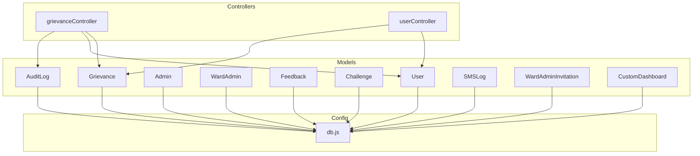
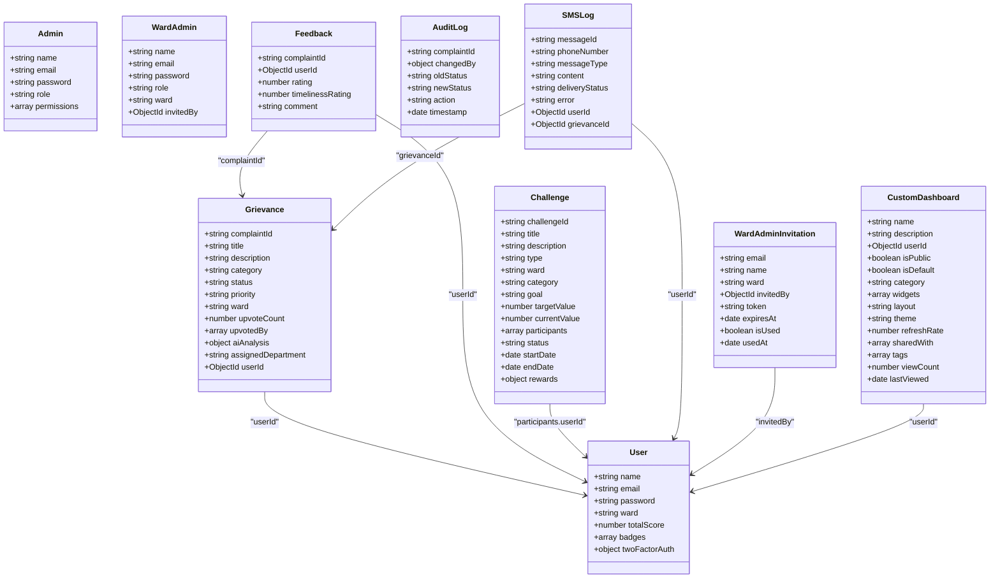
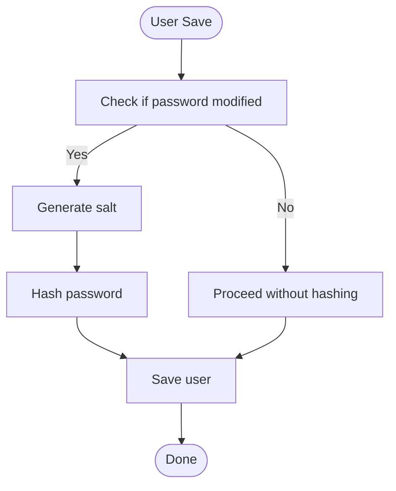
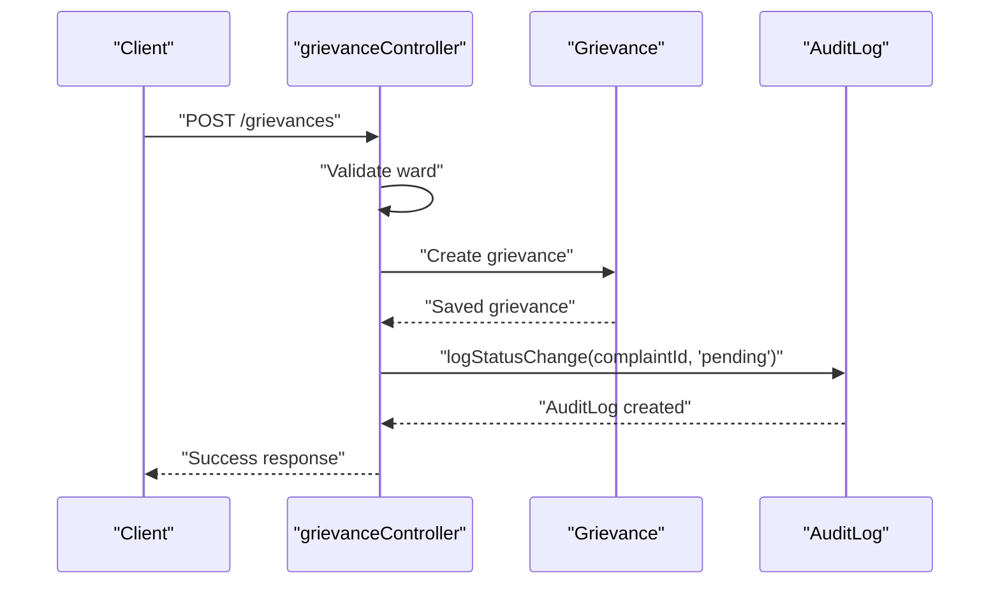
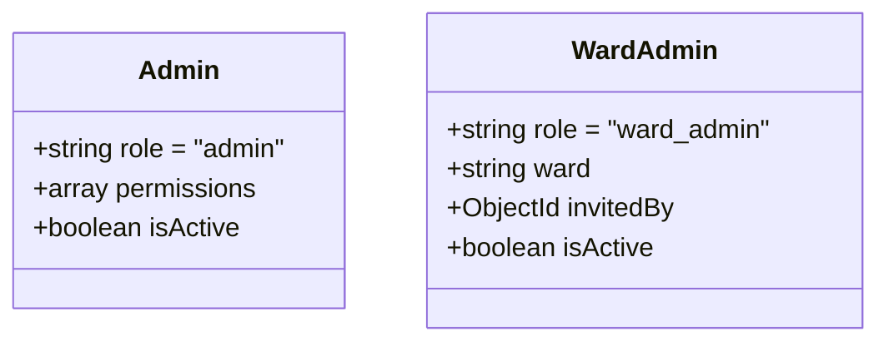
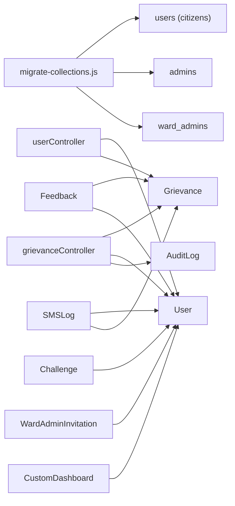

# Data Models & Database Schema

<cite>
**Referenced Files in This Document**
- [User.js](file://backend/src/models/User.js)
- [Grievance.js](file://backend/src/models/Grievance.js)
- [Admin.js](file://backend/src/models/Admin.js)
- [WardAdmin.js](file://backend/src/models/WardAdmin.js)
- [Feedback.js](file://backend/src/models/Feedback.js)
- [Challenge.js](file://backend/src/models/Challenge.js)
- [AuditLog.js](file://backend/src/models/AuditLog.js)
- [SMSLog.js](file://backend/src/models/SMSLog.js)
- [WardAdminInvitation.js](file://backend/src/models/WardAdminInvitation.js)
- [CustomDashboard.js](file://backend/src/models/CustomDashboard.js)
- [db.js](file://backend/src/config/db.js)
- [grievanceController.js](file://backend/src/controllers/grievanceController.js)
- [userController.js](file://backend/src/controllers/userController.js)
- [migrate-collections.js](file://backend/migrate-collections.js)
</cite>

## Table of Contents
1. [Introduction](#introduction)
2. [Project Structure](#project-structure)
3. [Core Components](#core-components)
4. [Architecture Overview](#architecture-overview)
5. [Detailed Component Analysis](#detailed-component-analysis)
6. [Dependency Analysis](#dependency-analysis)
7. [Performance Considerations](#performance-considerations)
8. [Troubleshooting Guide](#troubleshooting-guide)
9. [Conclusion](#conclusion)

## Introduction
This document describes the MongoDB schema design and entity relationships for the Smart Voice Report platform. It focuses on the User, Grievance, Admin, WardAdmin, Feedback, Challenge, and supporting models (AuditLog, SMSLog, WardAdminInvitation, CustomDashboard). It also covers indexing strategies, query optimization patterns, and operational migration steps that separate roles into dedicated collections.

## Project Structure
The data models are defined under the backend models directory and are used by controllers and services. The database connection is configured centrally and used across the application.

**Diagram sources**
- [User.js:1-165](file://backend/src/models/User.js#L1-L165)
- [Grievance.js:1-115](file://backend/src/models/Grievance.js#L1-L115)
- [Admin.js:1-55](file://backend/src/models/Admin.js#L1-L55)
- [WardAdmin.js:1-61](file://backend/src/models/WardAdmin.js#L1-L61)
- [Feedback.js:1-40](file://backend/src/models/Feedback.js#L1-L40)
- [Challenge.js:1-96](file://backend/src/models/Challenge.js#L1-L96)
- [AuditLog.js:1-42](file://backend/src/models/AuditLog.js#L1-L42)
- [SMSLog.js:1-47](file://backend/src/models/SMSLog.js#L1-L47)
- [WardAdminInvitation.js:1-50](file://backend/src/models/WardAdminInvitation.js#L1-L50)
- [CustomDashboard.js:1-160](file://backend/src/models/CustomDashboard.js#L1-L160)
- [grievanceController.js:1-200](file://backend/src/controllers/grievanceController.js#L1-L200)
- [userController.js:1-200](file://backend/src/controllers/userController.js#L1-L200)
- [db.js:1-18](file://backend/src/config/db.js#L1-L18)

**Section sources**
- [db.js:1-18](file://backend/src/config/db.js#L1-L18)
- [User.js:1-165](file://backend/src/models/User.js#L1-L165)
- [Grievance.js:1-115](file://backend/src/models/Grievance.js#L1-L115)
- [Admin.js:1-55](file://backend/src/models/Admin.js#L1-L55)
- [WardAdmin.js:1-61](file://backend/src/models/WardAdmin.js#L1-L61)
- [Feedback.js:1-40](file://backend/src/models/Feedback.js#L1-L40)
- [Challenge.js:1-96](file://backend/src/models/Challenge.js#L1-L96)
- [AuditLog.js:1-42](file://backend/src/models/AuditLog.js#L1-L42)
- [SMSLog.js:1-47](file://backend/src/models/SMSLog.js#L1-L47)
- [WardAdminInvitation.js:1-50](file://backend/src/models/WardAdminInvitation.js#L1-L50)
- [CustomDashboard.js:1-160](file://backend/src/models/CustomDashboard.js#L1-L160)

## Core Components
This section outlines each model’s purpose, key fields, and relationships.

- User
  - Purpose: Citizen profile, authentication, engagement metrics, badges, streaks, challenges, and preferences.
  - Key fields: name, email, password, ward, points, complaintsSubmitted/resolved, upvotesReceived/given, badges, totalScore, isActive, phone, smsEnabled, emailEnabled, preferredLanguage, streaks, activeChallenges/completedChallenges, twoFactorAuth.
  - Indexes: email, ward, totalScore (leaderboard), points (leaderboard), upvotesReceived (engagement).
  - Notes: Password hashing via pre-save hook; no role field; citizens live in the users collection; admins and ward admins in separate collections.

- Grievance
  - Purpose: Complaint record with status/priority/routing, user association, upvotes, AI intelligence, image/geolocation.
  - Key fields: complaintId (unique), title, description, category, address, status, priority, userId (refers to User), ward, upvoteCount/upvotedBy, feedbackSubmitted/skipped, aiAnalysis, assignedDepartment/assignedOfficialId, imageUrl, latitude/longitude.
  - Indexes: ward, userId, complaintId, category, priority, status, createdAt desc, upvoteCount (leaderboard), aiAnalysis.isDuplicateSuspected, assignedDepartment.
  - Notes: Timestamps enabled; complaintId auto-generated; strict ward requirement during creation.

- Admin
  - Purpose: System administrators with role and permissions.
  - Key fields: name, email, password, role (immutable), permissions, isActive.
  - Notes: Pre-save password hashing; immutable role enforcement.

- WardAdmin
  - Purpose: Ward-level administrators with assigned ward and optional invitation linkage.
  - Key fields: name, email, password, role (immutable), ward, invitedBy (refers to Admin), isActive.
  - Notes: Pre-save password hashing; immutable role enforcement.

- Feedback
  - Purpose: User ratings and comments for resolved complaints.
  - Key fields: complaintId (refers to Grievance), userId (refers to User), rating (1–5), timelinessRating (1–5), comment.
  - Indexes: unique composite on complaintId+userId to prevent duplicates.

- Challenge
  - Purpose: Gamified events with goals, participants, dates, and rewards.
  - Key fields: challengeId (unique), title/description, type (ward/city/category), ward/category, goal/target/current value, participants, status, startDate/endDate, rewards, isActive.
  - Indexes: status+endDate, ward+status, challengeId.

- AuditLog
  - Purpose: Track status changes for complaints with actor and timestamps.
  - Key fields: complaintId, changedBy.userId/name/role, oldStatus/newStatus, action, timestamp.

- SMSLog
  - Purpose: Track outbound SMS messages with delivery status and associations.
  - Key fields: messageId, phoneNumber, messageType, content, deliveryStatus, error, userId (refers to User), grievanceId (refers to Grievance).
  - Indexes: messageId, phoneNumber, messageType, deliveryStatus, userId, grievanceId.

- WardAdminInvitation
  - Purpose: Invite ward admins with tokens and expiration.
  - Key fields: email, name, ward, invitedBy (refers to User), token (unique), expiresAt, isUsed, usedAt.
  - Indexes: expiresAt with TTL to auto-clean expired invites.

- CustomDashboard
  - Purpose: Store user-configurable dashboard layouts and widget configurations.
  - Key fields: name, description, userId (refers to User), isPublic/isDefault, category, widgets (with type, dataSource, metrics, filters, dimensions, layout, config), layout/theme, refreshRate, sharedWith, tags, viewCount/lastViewed.
  - Indexes: userId, isPublic, category, tags, createdAt desc.

**Section sources**
- [User.js:1-165](file://backend/src/models/User.js#L1-L165)
- [Grievance.js:1-115](file://backend/src/models/Grievance.js#L1-L115)
- [Admin.js:1-55](file://backend/src/models/Admin.js#L1-L55)
- [WardAdmin.js:1-61](file://backend/src/models/WardAdmin.js#L1-L61)
- [Feedback.js:1-40](file://backend/src/models/Feedback.js#L1-L40)
- [Challenge.js:1-96](file://backend/src/models/Challenge.js#L1-L96)
- [AuditLog.js:1-42](file://backend/src/models/AuditLog.js#L1-L42)
- [SMSLog.js:1-47](file://backend/src/models/SMSLog.js#L1-L47)
- [WardAdminInvitation.js:1-50](file://backend/src/models/WardAdminInvitation.js#L1-L50)
- [CustomDashboard.js:1-160](file://backend/src/models/CustomDashboard.js#L1-L160)

## Architecture Overview
The system separates citizen users from admin roles into distinct collections. Controllers orchestrate operations, and models define schemas and indexes. The migration script ensures historical role data is moved into appropriate collections.

**Diagram sources**
- [User.js:1-165](file://backend/src/models/User.js#L1-L165)
- [Grievance.js:1-115](file://backend/src/models/Grievance.js#L1-L115)
- [Admin.js:1-55](file://backend/src/models/Admin.js#L1-L55)
- [WardAdmin.js:1-61](file://backend/src/models/WardAdmin.js#L1-L61)
- [Feedback.js:1-40](file://backend/src/models/Feedback.js#L1-L40)
- [Challenge.js:1-96](file://backend/src/models/Challenge.js#L1-L96)
- [AuditLog.js:1-42](file://backend/src/models/AuditLog.js#L1-L42)
- [SMSLog.js:1-47](file://backend/src/models/SMSLog.js#L1-L47)
- [WardAdminInvitation.js:1-50](file://backend/src/models/WardAdminInvitation.js#L1-L50)
- [CustomDashboard.js:1-160](file://backend/src/models/CustomDashboard.js#L1-L160)

## Detailed Component Analysis

### User Model
- Authentication: Password hashed before save; comparison method exposed.
- Profile: Name, email, phone, preferred language, activity flags (smsEnabled, emailEnabled).
- Engagement: Points, complaints submitted/resolved, upvotes received/given, badges array, totalScore.
- Streaks and Challenges: Current/longest streaks, lastActivityDate, streakStartDate; active and completed challenges with progress.
- Permissions: No role field; citizens only; admins/ward admins in separate collections.
- Indexes: email, ward, totalScore, points, upvotesReceived.

**Diagram sources**
- [User.js:146-152](file://backend/src/models/User.js#L146-L152)

**Section sources**
- [User.js:1-165](file://backend/src/models/User.js#L1-L165)

### Grievance Model
- Identity: Auto-generated complaintId; strict ward requirement during creation.
- Status and Priority: Enumerated values; timestamps enabled.
- Routing and AI: assignedDepartment, assignedOfficialId, aiAnalysis with confidence scores, duplicate detection, keywords, routing department.
- Engagement: upvoteCount and upvotedBy array; feedbackSubmitted/skipped flags.
- Indexes: ward, userId, complaintId, category, priority, status, createdAt desc, upvoteCount, aiAnalysis.isDuplicateSuspected, assignedDepartment.

**Diagram sources**
- [grievanceController.js:70-200](file://backend/src/controllers/grievanceController.js#L70-L200)
- [Grievance.js:1-115](file://backend/src/models/Grievance.js#L1-L115)
- [AuditLog.js:1-42](file://backend/src/models/AuditLog.js#L1-L42)

**Section sources**
- [Grievance.js:1-115](file://backend/src/models/Grievance.js#L1-L115)
- [grievanceController.js:1-200](file://backend/src/controllers/grievanceController.js#L1-L200)

### Admin and WardAdmin Models
- Admin: Immutable role "admin", default permissions array, isActive flag.
- WardAdmin: Immutable role "ward_admin", required ward, optional invitedBy reference to Admin, isActive flag.
- Both enforce pre-save password hashing and provide password comparison methods.

**Diagram sources**
- [Admin.js:1-55](file://backend/src/models/Admin.js#L1-L55)
- [WardAdmin.js:1-61](file://backend/src/models/WardAdmin.js#L1-L61)

**Section sources**
- [Admin.js:1-55](file://backend/src/models/Admin.js#L1-L55)
- [WardAdmin.js:1-61](file://backend/src/models/WardAdmin.js#L1-L61)

### Feedback Model
- Enforces uniqueness per user per complaint via a compound index.
- Associates ratings and optional comments to a specific grievance and user.

**Section sources**
- [Feedback.js:1-40](file://backend/src/models/Feedback.js#L1-L40)

### Challenge Model
- Supports ward/city/category-level challenges with targets and participant contributions.
- Includes reward metadata and lifecycle (upcoming/active/completed/expired).

**Section sources**
- [Challenge.js:1-96](file://backend/src/models/Challenge.js#L1-L96)

### Supporting Models
- AuditLog: Tracks status updates with actor identity and timestamps.
- SMSLog: Records outbound messages with delivery status and optional errors; indexed for efficient querying.
- WardAdminInvitation: Manages invitations with TTL-based cleanup.
- CustomDashboard: Stores user-defined dashboards with rich widget configuration.

**Section sources**
- [AuditLog.js:1-42](file://backend/src/models/AuditLog.js#L1-L42)
- [SMSLog.js:1-47](file://backend/src/models/SMSLog.js#L1-L47)
- [WardAdminInvitation.js:1-50](file://backend/src/models/WardAdminInvitation.js#L1-L50)
- [CustomDashboard.js:1-160](file://backend/src/models/CustomDashboard.js#L1-L160)

## Dependency Analysis
- Collections separation: The migration script moves admin and ward admin accounts from the users collection into admins and ward_admins respectively, ensuring clean role segregation.
- Referential integrity: Several models reference User (Grievance.userId, Feedback.userId, Challenge.participants.userId, SMSLog.userId, CustomDashboard.userId). Some models reference Grievance (Feedback.complaintId, SMSLog.grievanceId).
- Controller usage: Controllers rely on models for persistence and expose endpoints that leverage indexes for filtering and sorting.

**Diagram sources**
- [migrate-collections.js:1-159](file://backend/migrate-collections.js#L1-L159)
- [grievanceController.js:1-200](file://backend/src/controllers/grievanceController.js#L1-L200)
- [userController.js:1-200](file://backend/src/controllers/userController.js#L1-L200)
- [Grievance.js:1-115](file://backend/src/models/Grievance.js#L1-L115)
- [User.js:1-165](file://backend/src/models/User.js#L1-L165)
- [Feedback.js:1-40](file://backend/src/models/Feedback.js#L1-L40)
- [Challenge.js:1-96](file://backend/src/models/Challenge.js#L1-L96)
- [SMSLog.js:1-47](file://backend/src/models/SMSLog.js#L1-L47)
- [WardAdminInvitation.js:1-50](file://backend/src/models/WardAdminInvitation.js#L1-L50)
- [CustomDashboard.js:1-160](file://backend/src/models/CustomDashboard.js#L1-L160)

**Section sources**
- [migrate-collections.js:1-159](file://backend/migrate-collections.js#L1-L159)
- [grievanceController.js:1-200](file://backend/src/controllers/grievanceController.js#L1-L200)
- [userController.js:1-200](file://backend/src/controllers/userController.js#L1-L200)

## Performance Considerations
- Indexes
  - User: email, ward, totalScore (desc), points (desc), upvotesReceived (desc).
  - Grievance: ward, userId, complaintId, category, priority, status, createdAt desc, upvoteCount (desc), aiAnalysis.isDuplicateSuspected, assignedDepartment.
  - Feedback: unique compound index on complaintId+userId.
  - Challenge: status+endDate, ward+status, challengeId.
  - SMSLog: messageId, phoneNumber, messageType, deliveryStatus, userId, grievanceId.
  - WardAdminInvitation: expiresAt with TTL for automatic cleanup.
  - CustomDashboard: userId, isPublic, category, tags, createdAt desc.
- Query patterns
  - Ward-based filtering: leverage ward index on Grievance and Challenge.
  - Leaderboard sorting: use totalScore and upvoteCount descending indexes.
  - Duplicate feedback prevention: use unique compound index on Feedback.
  - Invitation cleanup: TTL index on expiresAt.
- Operational notes
  - Strict ward validation during grievance creation prevents invalid documents.
  - Dynamic stats calculation in userController aggregates from Grievance collection.

**Section sources**
- [User.js:158-164](file://backend/src/models/User.js#L158-L164)
- [Grievance.js:102-112](file://backend/src/models/Grievance.js#L102-L112)
- [Feedback.js:36-37](file://backend/src/models/Feedback.js#L36-L37)
- [Challenge.js:90-93](file://backend/src/models/Challenge.js#L90-L93)
- [SMSLog.js:4-44](file://backend/src/models/SMSLog.js#L4-L44)
- [WardAdminInvitation.js:47-48](file://backend/src/models/WardAdminInvitation.js#L47-L48)
- [CustomDashboard.js:152-158](file://backend/src/models/CustomDashboard.js#L152-L158)
- [grievanceController.js:85-102](file://backend/src/controllers/grievanceController.js#L85-L102)
- [userController.js:10-64](file://backend/src/controllers/userController.js#L10-L64)

## Troubleshooting Guide
- Authentication failures
  - Ensure password hashing occurs via pre-save hooks; verify bcrypt is available and functioning.
  - Confirm matchPassword method usage in controllers.
- Role segregation issues
  - After migration, confirm admins and ward admins are present in admins and ward_admins collections respectively; users collection should only contain citizens.
- Grievance creation errors
  - Validate ward presence and format; the controller enforces strict ward validation.
  - Check complaintId generation and uniqueness constraints.
- Duplicate feedback
  - The unique compound index on complaintId+userId prevents duplicates; handle duplicate key errors gracefully in controllers.
- Audit logging
  - Ensure logStatusChange is invoked on status transitions; verify AuditLog fields and timestamps.
- SMS delivery tracking
  - Monitor deliveryStatus transitions and error fields; use indexes for efficient querying by phoneNumber and deliveryStatus.
- Invitation cleanup
  - Confirm TTL index on expiresAt is active; expired documents should auto-remove.

**Section sources**
- [User.js:146-156](file://backend/src/models/User.js#L146-L156)
- [Admin.js:40-52](file://backend/src/models/Admin.js#L40-L52)
- [WardAdmin.js:46-58](file://backend/src/models/WardAdmin.js#L46-L58)
- [migrate-collections.js:51-155](file://backend/migrate-collections.js#L51-L155)
- [grievanceController.js:85-102](file://backend/src/controllers/grievanceController.js#L85-L102)
- [Feedback.js:36-37](file://backend/src/models/Feedback.js#L36-L37)
- [AuditLog.js:1-42](file://backend/src/models/AuditLog.js#L1-L42)
- [SMSLog.js:1-47](file://backend/src/models/SMSLog.js#L1-L47)
- [WardAdminInvitation.js:47-48](file://backend/src/models/WardAdminInvitation.js#L47-L48)

## Conclusion
The schema design cleanly separates citizen users from admin roles, supports robust complaint lifecycle tracking with AI intelligence and engagement features, and provides strong indexing for performance. Controllers enforce validation and maintain referential integrity, while migration scripts ensure historical data aligns with the new structure. The documented indexes and query patterns enable efficient filtering, sorting, and reporting across the platform.