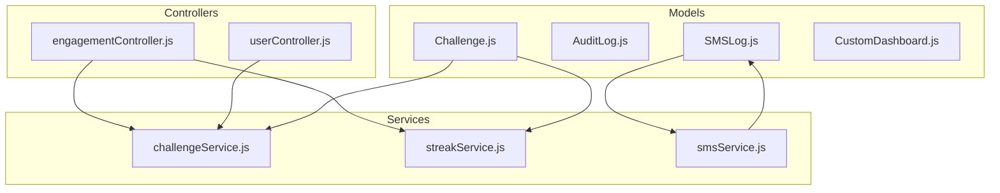
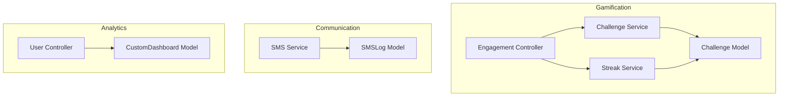
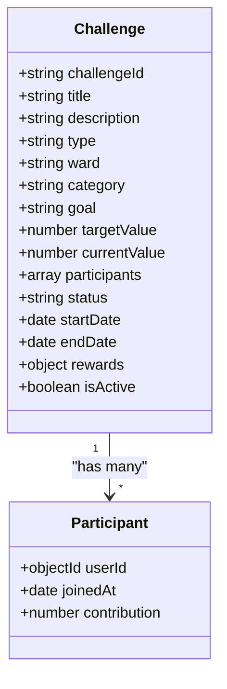
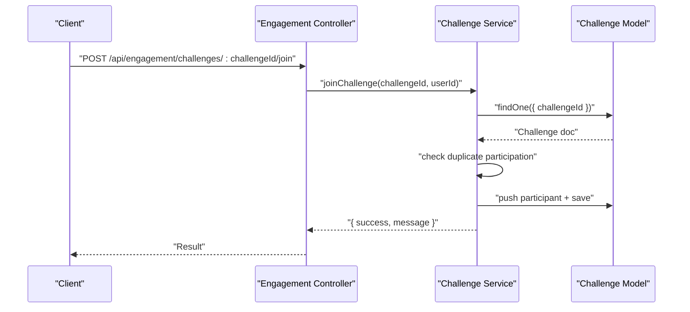
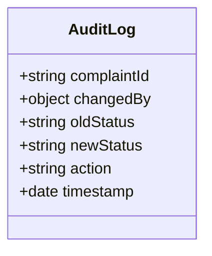
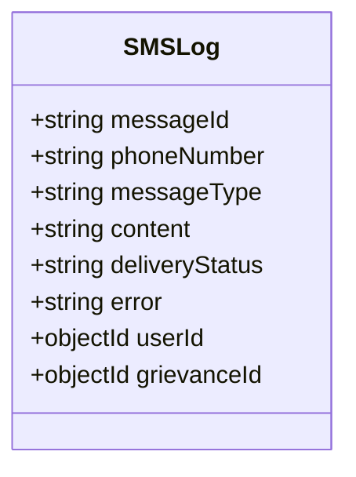
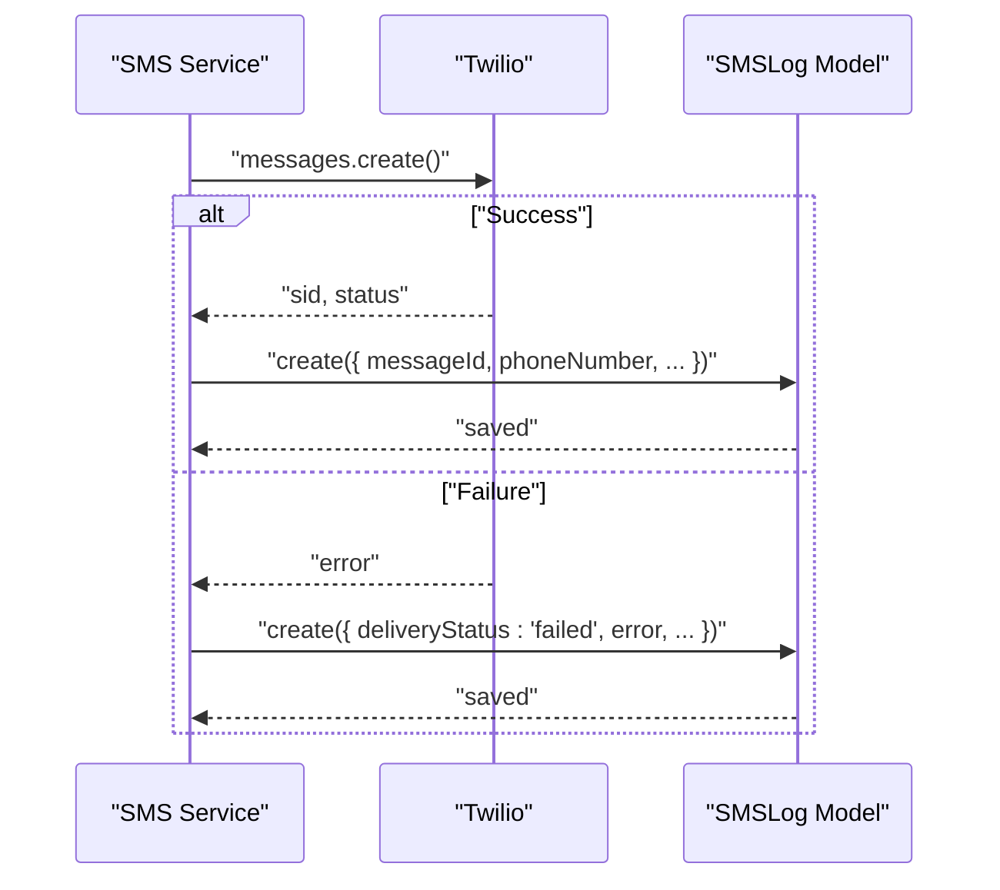
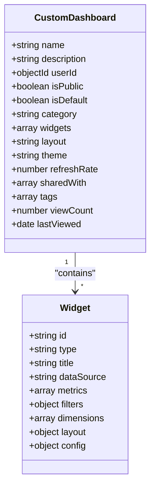
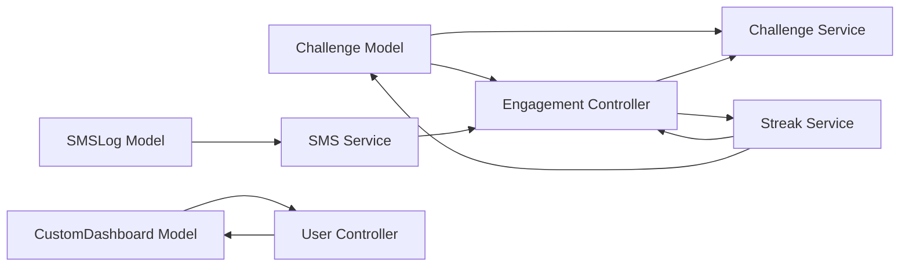

# Supporting Models & Relationships

<cite>
**Referenced Files in This Document**
- [Challenge.js](file://backend/src/models/Challenge.js)
- [AuditLog.js](file://backend/src/models/AuditLog.js)
- [SMSLog.js](file://backend/src/models/SMSLog.js)
- [CustomDashboard.js](file://backend/src/models/CustomDashboard.js)
- [challengeService.js](file://backend/src/services/gamification/challengeService.js)
- [streakService.js](file://backend/src/services/gamification/streakService.js)
- [engagementController.js](file://backend/src/controllers/engagementController.js)
- [smsService.js](file://backend/src/services/smsService.js)
- [userController.js](file://backend/src/controllers/userController.js)
</cite>

## Table of Contents
1. [Introduction](#introduction)
2. [Project Structure](#project-structure)
3. [Core Components](#core-components)
4. [Architecture Overview](#architecture-overview)
5. [Detailed Component Analysis](#detailed-component-analysis)
6. [Dependency Analysis](#dependency-analysis)
7. [Performance Considerations](#performance-considerations)
8. [Troubleshooting Guide](#troubleshooting-guide)
9. [Conclusion](#conclusion)

## Introduction
This document provides comprehensive documentation for four supporting data models: Challenge, AuditLog, SMSLog, and CustomDashboard. It explains their schemas, relationships with core models, indexing strategies for performance, and integration points within the system. Special attention is given to gamification features (daily/weekly/monthly challenges), participation tracking, reward systems, system activity auditing, SMS delivery tracking, and user-configurable analytics dashboards.

## Project Structure
The relevant models and services are located under the backend/src directory:
- Models define the data schemas and indexes.
- Services encapsulate business logic for gamification and SMS delivery.
- Controllers orchestrate requests and coordinate with services/models.

**Diagram sources**
- [Challenge.js:1-96](file://backend/src/models/Challenge.js#L1-L96)
- [AuditLog.js:1-42](file://backend/src/models/AuditLog.js#L1-L42)
- [SMSLog.js:1-47](file://backend/src/models/SMSLog.js#L1-L47)
- [CustomDashboard.js:1-160](file://backend/src/models/CustomDashboard.js#L1-L160)
- [challengeService.js:1-384](file://backend/src/services/gamification/challengeService.js#L1-L384)
- [streakService.js:1-237](file://backend/src/services/gamification/streakService.js#L1-L237)
- [smsService.js:1-162](file://backend/src/services/smsService.js#L1-L162)
- [engagementController.js:1-225](file://backend/src/controllers/engagementController.js#L1-L225)
- [userController.js:1-523](file://backend/src/controllers/userController.js#L1-L523)

**Section sources**
- [Challenge.js:1-96](file://backend/src/models/Challenge.js#L1-L96)
- [AuditLog.js:1-42](file://backend/src/models/AuditLog.js#L1-L42)
- [SMSLog.js:1-47](file://backend/src/models/SMSLog.js#L1-L47)
- [CustomDashboard.js:1-160](file://backend/src/models/CustomDashboard.js#L1-L160)
- [challengeService.js:1-384](file://backend/src/services/gamification/challengeService.js#L1-L384)
- [streakService.js:1-237](file://backend/src/services/gamification/streakService.js#L1-L237)
- [smsService.js:1-162](file://backend/src/services/smsService.js#L1-L162)
- [engagementController.js:1-225](file://backend/src/controllers/engagementController.js#L1-L225)
- [userController.js:1-523](file://backend/src/controllers/userController.js#L1-L523)

## Core Components
This section documents each model’s purpose, schema attributes, and operational behavior.

### Challenge Model
Purpose:
- Defines community challenges with time-bound participation, optional ward/category scoping, and reward metadata.
- Tracks participant contributions and overall progress toward targets.

Key schema attributes:
- challengeId: Unique identifier for the challenge.
- title, description: Challenge identity and details.
- type: Scope ("ward", "city", "category").
- ward, category: Optional scoping fields; null for city-level challenges.
- goal, targetValue, currentValue: Defines the objective and current progress.
- participants: Array of participant entries with userId, joinedAt, and contribution.
- status: Lifecycle state ("upcoming", "active", "completed", "expired").
- startDate, endDate: Challenge validity window.
- rewards: Badge and points metadata.
- isActive: Administrative toggle.

Indexes:
- Composite index on status and endDate to optimize status-based queries.
- Composite index on ward and status for scoped lookups.
- Single-field index on challengeId for uniqueness and lookup.

Gamification integration:
- Controlled by a feature flag to enable/disable advanced engagement features.
- Supports creation, joining, progress updates, leaderboards, and status transitions.

Operational highlights:
- Participants are tracked per challenge; progress increments update both participant and global challenge counters.
- Status transitions occur via scheduled maintenance tasks.

**Section sources**
- [Challenge.js:7-95](file://backend/src/models/Challenge.js#L7-L95)
- [challengeService.js:24-71](file://backend/src/services/gamification/challengeService.js#L24-L71)
- [challengeService.js:115-165](file://backend/src/services/gamification/challengeService.js#L115-L165)
- [challengeService.js:176-232](file://backend/src/services/gamification/challengeService.js#L176-L232)
- [challengeService.js:241-274](file://backend/src/services/gamification/challengeService.js#L241-L274)
- [challengeService.js:328-372](file://backend/src/services/gamification/challengeService.js#L328-L372)

### AuditLog Model
Purpose:
- Records system activity for compliance and auditability, capturing changes to grievance statuses initiated by administrators or authorized users.

Key schema attributes:
- complaintId: Reference to the affected grievance.
- changedBy: Nested object containing userId, role, and optional name of the actor.
- oldStatus, newStatus: Before and after states of the grievance status.
- action: Type of action recorded (defaulted to status update).
- timestamp: When the change occurred.

Notes:
- Timestamps are managed manually; no automatic timestamps are applied.

Use cases:
- Compliance reporting.
- Investigating administrative actions.
- Auditing status manipulation timelines.

**Section sources**
- [AuditLog.js:3-39](file://backend/src/models/AuditLog.js#L3-L39)

### SMSLog Model
Purpose:
- Tracks SMS delivery lifecycle, message content, recipient, and associated entities for analytics and troubleshooting.

Key schema attributes:
- messageId: Provider message identifier (Twilio SID).
- phoneNumber: Recipient phone number.
- messageType: Enumerated category (registration, status_update, resolution, critical_alert, announcement).
- content: Message body.
- deliveryStatus: Enumerated state (queued, sent, delivered, failed, undelivered).
- error: Optional error message on failure.
- userId: Reference to the User who received the message.
- grievanceId: Reference to the Grievance related to the message.

Indexes:
- Index on messageId for fast lookup by provider ID.
- Index on phoneNumber for recipient-centric queries.
- Index on deliveryStatus for delivery analytics.
- Index on userId and grievanceId for association lookups.

Integration:
- Populated automatically by the SMS service upon successful or failed delivery attempts.

**Section sources**
- [SMSLog.js:3-46](file://backend/src/models/SMSLog.js#L3-L46)
- [smsService.js:24-77](file://backend/src/services/smsService.js#L24-L77)

### CustomDashboard Model
Purpose:
- Enables users to create personalized analytics dashboards with configurable widgets, filters, layouts, themes, and sharing permissions.

Key schema attributes:
- name, description: Dashboard identity and notes.
- userId: Owner of the dashboard.
- isPublic, isDefault: Visibility and default selection flags.
- category: Dashboard classification (executive, operational, analytical, custom).
- widgets: Array of widget definitions with type, title, data source, metrics, filters, dimensions, layout, and config.
- layout: Grid, freeform, or tabs arrangement.
- theme: Light, dark, or auto mode.
- refreshRate: Auto-refresh interval in seconds.
- sharedWith: Array of user permissions (view/edit).
- tags: Metadata for categorization.
- viewCount, lastViewed: Usage analytics.

Indexes:
- Index on userId for ownership queries.
- Index on isPublic for public dashboards.
- Index on category for filtering.
- Index on tags for tagging.
- Index on createdAt for ordering.

Widget configuration:
- Supports KPI cards, charts (line, bar, pie, area, gauge, funnel, scatter, map), and tables.
- Metrics support aggregations (count, sum, avg, min, max, distinct).
- Filters support category, priority, status, ward, date range, and custom filters.
- Layout supports grid coordinates and sizing.
- Config supports color palettes, legend/grid/tooltip visibility, refresh intervals, and custom settings.

**Section sources**
- [CustomDashboard.js:9-159](file://backend/src/models/CustomDashboard.js#L9-L159)

## Architecture Overview
The models integrate with services and controllers to deliver gamification, auditing, communications, and analytics capabilities.

**Diagram sources**
- [Challenge.js:1-96](file://backend/src/models/Challenge.js#L1-L96)
- [challengeService.js:1-384](file://backend/src/services/gamification/challengeService.js#L1-L384)
- [streakService.js:1-237](file://backend/src/services/gamification/streakService.js#L1-L237)
- [engagementController.js:1-225](file://backend/src/controllers/engagementController.js#L1-L225)
- [SMSLog.js:1-47](file://backend/src/models/SMSLog.js#L1-L47)
- [smsService.js:1-162](file://backend/src/services/smsService.js#L1-L162)
- [CustomDashboard.js:1-160](file://backend/src/models/CustomDashboard.js#L1-L160)
- [userController.js:1-523](file://backend/src/controllers/userController.js#L1-L523)

## Detailed Component Analysis

### Challenge Model Analysis
The Challenge model encapsulates gamification parameters and participation tracking. It supports:
- Daily/weekly/monthly challenge contexts via type and date windows.
- Participation tracking with per-participant contribution and joinedAt timestamps.
- Reward metadata (badgeId, points, description) for completion incentives.
- Status lifecycle management with automatic transitions and manual overrides.

**Diagram sources**
- [Challenge.js:7-95](file://backend/src/models/Challenge.js#L7-L95)

Operational flows:
- Creation sets status based on current time relative to startDate.
- Joining checks duplicates and updates both Challenge and User participation arrays.
- Progress updates increment participant and global counters; completion triggers status change.
- Leaderboard computation sorts participants by contribution.

**Diagram sources**
- [engagementController.js:142-161](file://backend/src/controllers/engagementController.js#L142-L161)
- [challengeService.js:115-165](file://backend/src/services/gamification/challengeService.js#L115-L165)

**Section sources**
- [Challenge.js:7-95](file://backend/src/models/Challenge.js#L7-L95)
- [challengeService.js:24-71](file://backend/src/services/gamification/challengeService.js#L24-L71)
- [challengeService.js:115-165](file://backend/src/services/gamification/challengeService.js#L115-L165)
- [challengeService.js:176-232](file://backend/src/services/gamification/challengeService.js#L176-L232)
- [challengeService.js:241-274](file://backend/src/services/gamification/challengeService.js#L241-L274)
- [challengeService.js:328-372](file://backend/src/services/gamification/challengeService.js#L328-L372)

### AuditLog Model Analysis
The AuditLog model captures administrative actions affecting grievance status for compliance and audit trails.

**Diagram sources**
- [AuditLog.js:3-39](file://backend/src/models/AuditLog.js#L3-L39)

Operational notes:
- Manual timestamp management ensures deterministic audit records.
- Designed for read-heavy workloads; consider partitioning or retention policies for long-term storage.

**Section sources**
- [AuditLog.js:3-39](file://backend/src/models/AuditLog.js#L3-L39)

### SMSLog Model Analysis
The SMSLog model tracks SMS delivery outcomes and supports analytics and troubleshooting.

**Diagram sources**
- [SMSLog.js:3-46](file://backend/src/models/SMSLog.js#L3-L46)

Delivery pipeline:
- SMS service validates environment configuration and recipient.
- On success, logs provider SID and status; on failure, logs error and sets failed status.

**Diagram sources**
- [smsService.js:24-77](file://backend/src/services/smsService.js#L24-L77)
- [SMSLog.js:3-46](file://backend/src/models/SMSLog.js#L3-L46)

**Section sources**
- [SMSLog.js:3-46](file://backend/src/models/SMSLog.js#L3-L46)
- [smsService.js:24-77](file://backend/src/services/smsService.js#L24-L77)

### CustomDashboard Model Analysis
The CustomDashboard model enables personalization and analytics customization with robust widget configuration.

**Diagram sources**
- [CustomDashboard.js:9-159](file://backend/src/models/CustomDashboard.js#L9-L159)

Configuration capabilities:
- Rich widget types and metric aggregations.
- Flexible filters and dimensions for drill-down analytics.
- Layout and theme controls for presentation.
- Sharing permissions and tagging for collaboration and discovery.

**Section sources**
- [CustomDashboard.js:9-159](file://backend/src/models/CustomDashboard.js#L9-L159)

## Dependency Analysis
This section maps dependencies among models, services, and controllers.

**Diagram sources**
- [Challenge.js:1-96](file://backend/src/models/Challenge.js#L1-L96)
- [challengeService.js:1-384](file://backend/src/services/gamification/challengeService.js#L1-L384)
- [streakService.js:1-237](file://backend/src/services/gamification/streakService.js#L1-L237)
- [engagementController.js:1-225](file://backend/src/controllers/engagementController.js#L1-L225)
- [SMSLog.js:1-47](file://backend/src/models/SMSLog.js#L1-L47)
- [smsService.js:1-162](file://backend/src/services/smsService.js#L1-L162)
- [CustomDashboard.js:1-160](file://backend/src/models/CustomDashboard.js#L1-L160)
- [userController.js:1-523](file://backend/src/controllers/userController.js#L1-L523)

Observations:
- Challenge Service depends on Challenge and User models for participation and progress tracking.
- SMS Service depends on SMSLog for persistence of delivery outcomes.
- Engagement Controller orchestrates Challenge and Streak services for user dashboards.
- CustomDashboard integrates with User Controller for user-centric analytics.

**Section sources**
- [challengeService.js:1-384](file://backend/src/services/gamification/challengeService.js#L1-L384)
- [streakService.js:1-237](file://backend/src/services/gamification/streakService.js#L1-L237)
- [engagementController.js:1-225](file://backend/src/controllers/engagementController.js#L1-L225)
- [smsService.js:1-162](file://backend/src/services/smsService.js#L1-L162)
- [userController.js:1-523](file://backend/src/controllers/userController.js#L1-L523)

## Performance Considerations
Indexing strategies:
- Challenge model:
  - Composite index on status and endDate to efficiently query active/upcoming/expired challenges.
  - Composite index on ward and status to filter by location and state.
  - Single-field index on challengeId for uniqueness and fast lookups.
- SMSLog model:
  - Index on messageId for provider SID retrieval.
  - Index on phoneNumber for recipient-centric queries.
  - Index on deliveryStatus for delivery analytics and monitoring.
  - Indexes on userId and grievanceId for association lookups.
- CustomDashboard model:
  - Index on userId for ownership queries.
  - Index on isPublic for public dashboards.
  - Index on category and tags for filtering and discovery.
  - Index on createdAt for chronological ordering.

Additional recommendations:
- Use capped collections for AuditLog if historical retention is bounded.
- Implement TTL indexes for short-lived logs (e.g., temporary notifications).
- Batch writes for high-volume operations (e.g., SMS log inserts).
- Monitor slow queries and add targeted indexes based on query patterns.

[No sources needed since this section provides general guidance]

## Troubleshooting Guide
Common issues and resolutions:
- Challenge feature disabled:
  - Symptom: Challenge operations return disabled messages.
  - Cause: Feature flag not enabled.
  - Resolution: Enable the feature flag and restart services.
  - Evidence: Service checks feature flag before processing.
- Duplicate challenge join:
  - Symptom: Join fails with duplicate participation message.
  - Cause: User already joined the challenge.
  - Resolution: Inform user or pre-check participation.
- SMS delivery failures:
  - Symptom: Delivery status marked as failed with error details.
  - Cause: Twilio misconfiguration or invalid recipient.
  - Resolution: Validate credentials and phone number; inspect error field.
- Missing indexes:
  - Symptom: Slow queries on status, ward, or user-scoped lookups.
  - Cause: Missing or unused indexes.
  - Resolution: Add recommended composite and single-field indexes.

**Section sources**
- [challengeService.js:14-16](file://backend/src/services/gamification/challengeService.js#L14-L16)
- [challengeService.js:126-133](file://backend/src/services/gamification/challengeService.js#L126-L133)
- [smsService.js:26-29](file://backend/src/services/smsService.js#L26-L29)
- [smsService.js:31-39](file://backend/src/services/smsService.js#L31-L39)
- [SMSLog.js:3-46](file://backend/src/models/SMSLog.js#L3-L46)

## Conclusion
The supporting models—Challenge, AuditLog, SMSLog, and CustomDashboard—are foundational to gamification, compliance, communications, and analytics. Their schemas, indexes, and service integrations enable scalable, auditable, and user-centric features. Proper indexing and operational safeguards ensure performance and reliability across daily/weekly/monthly challenge cycles, SMS delivery tracking, and customizable analytics dashboards.