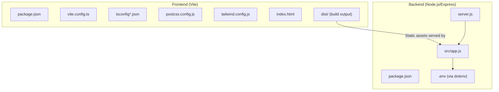
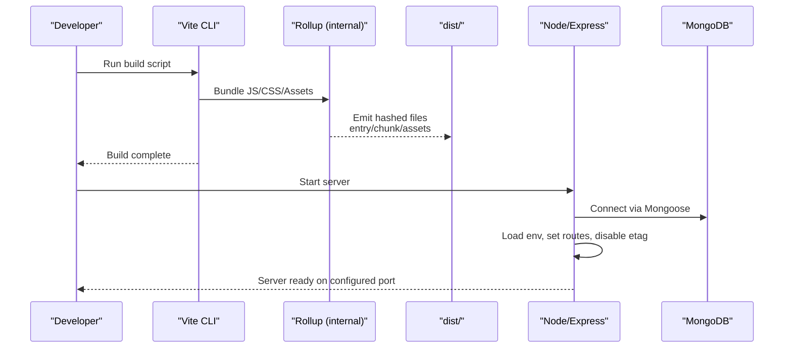
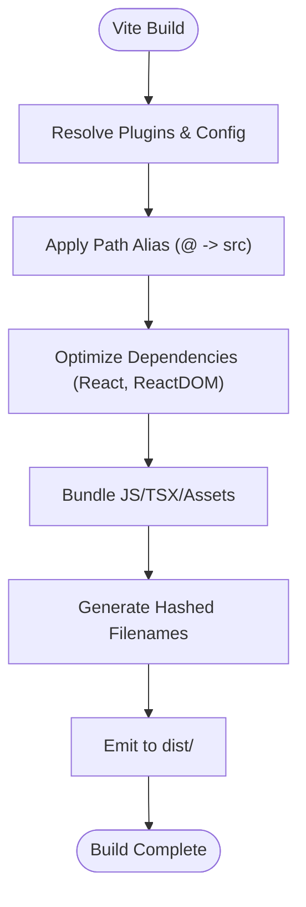
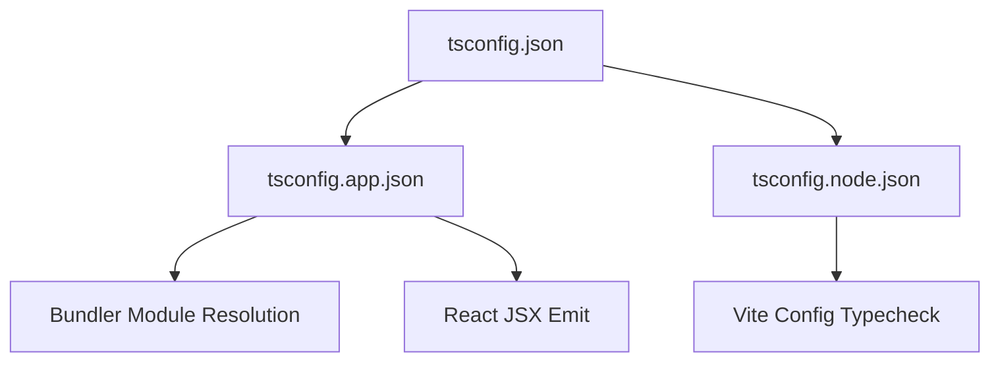
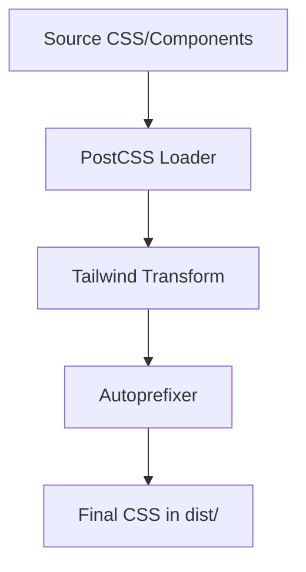
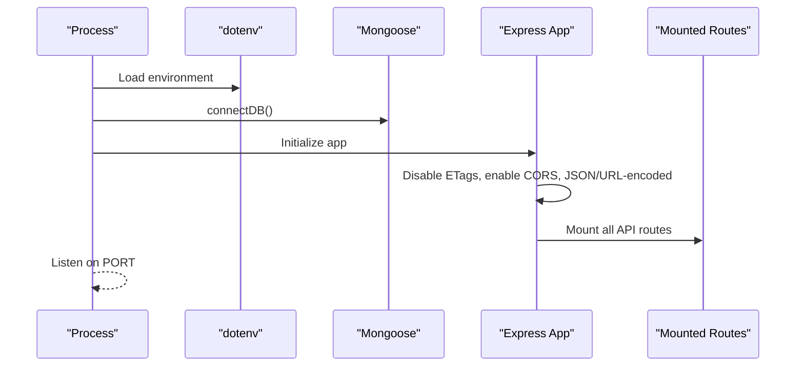
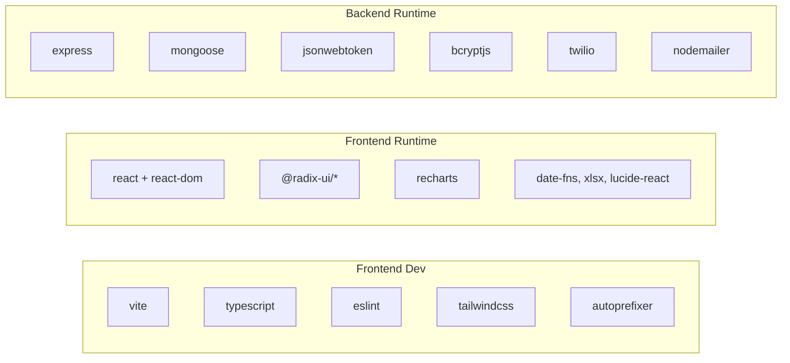

# Build & Packaging Process

<cite>
**Referenced Files in This Document**
- [package.json](file://Frontend/package.json)
- [vite.config.ts](file://Frontend/vite.config.ts)
- [tsconfig.json](file://Frontend/tsconfig.json)
- [tsconfig.app.json](file://Frontend/tsconfig.app.json)
- [tsconfig.node.json](file://Frontend/tsconfig.node.json)
- [postcss.config.js](file://Frontend/postcss.config.js)
- [tailwind.config.js](file://Frontend/tailwind.config.js)
- [index.html](file://Frontend/index.html)
- [server.js](file://backend/server.js)
- [app.js](file://backend/src/app.js)
- [package.json](file://backend/package.json)
- [config.toml](file://Frontend/supabase/config.toml)
</cite>

## Table of Contents
1. [Introduction](#introduction)
2. [Project Structure](#project-structure)
3. [Core Components](#core-components)
4. [Architecture Overview](#architecture-overview)
5. [Detailed Component Analysis](#detailed-component-analysis)
6. [Dependency Analysis](#dependency-analysis)
7. [Performance Considerations](#performance-considerations)
8. [Troubleshooting Guide](#troubleshooting-guide)
9. [Conclusion](#conclusion)
10. [Appendices](#appendices)

## Introduction
This document explains the build and packaging processes for the Smart Voice Report application, covering both the frontend React application built with Vite and the backend Node.js/Express server. It details development and production configurations, asset optimization, cache busting, dependency optimization, static asset handling, TypeScript compilation, and environment-specific setups. It also outlines deployment artifact preparation and provides guidance for performance optimization and troubleshooting.

## Project Structure
The project is split into two primary areas:
- Frontend: React application using Vite, TypeScript, Tailwind CSS, and PostCSS. It produces a static site with optimized assets and a service worker for PWA support.
- Backend: Node.js/Express server that serves APIs and integrates with MongoDB via Mongoose. It uses environment variables loaded via dotenv and exposes health checks.

**Diagram sources**
- [package.json:1-92](file://Frontend/package.json#L1-L92)
- [vite.config.ts:1-39](file://Frontend/vite.config.ts#L1-L39)
- [tsconfig.json:1-17](file://Frontend/tsconfig.json#L1-L17)
- [postcss.config.js:1-7](file://Frontend/postcss.config.js#L1-L7)
- [tailwind.config.js:1-120](file://Frontend/tailwind.config.js#L1-L120)
- [index.html:1-34](file://Frontend/index.html#L1-L34)
- [server.js:1-22](file://backend/server.js#L1-L22)
- [app.js:1-71](file://backend/src/app.js#L1-L71)

**Section sources**
- [package.json:1-92](file://Frontend/package.json#L1-L92)
- [vite.config.ts:1-39](file://Frontend/vite.config.ts#L1-L39)
- [tsconfig.json:1-17](file://Frontend/tsconfig.json#L1-L17)
- [postcss.config.js:1-7](file://Frontend/postcss.config.js#L1-L7)
- [tailwind.config.js:1-120](file://Frontend/tailwind.config.js#L1-L120)
- [index.html:1-34](file://Frontend/index.html#L1-L34)
- [server.js:1-22](file://backend/server.js#L1-L22)
- [app.js:1-71](file://backend/src/app.js#L1-L71)

## Core Components
- Frontend build pipeline powered by Vite with React plugin, TypeScript configuration, Tailwind CSS, and PostCSS.
- Production asset hashing for cache busting and deterministic builds.
- Backend runtime controlled by Express with CORS, logging, and route mounting.
- Environment configuration via dotenv and explicit port selection.

Key build and packaging responsibilities:
- Frontend: compile TypeScript/JSX, resolve aliases, optimize dependencies, bundle assets, inject cache-busting filenames, and produce a static distribution.
- Backend: serve the API and static assets, load environment variables, and expose health endpoints.

**Section sources**
- [package.json:6-11](file://Frontend/package.json#L6-L11)
- [vite.config.ts:7-38](file://Frontend/vite.config.ts#L7-L38)
- [tsconfig.app.json:1-31](file://Frontend/tsconfig.app.json#L1-L31)
- [tsconfig.node.json:1-23](file://Frontend/tsconfig.node.json#L1-L23)
- [postcss.config.js:1-7](file://Frontend/postcss.config.js#L1-L7)
- [tailwind.config.js:1-120](file://Frontend/tailwind.config.js#L1-L120)
- [index.html:20-27](file://Frontend/index.html#L20-L27)
- [server.js:1-22](file://backend/server.js#L1-L22)
- [app.js:28-71](file://backend/src/app.js#L28-L71)

## Architecture Overview
The build and packaging architecture separates concerns between frontend and backend:
- Frontend build produces a static site with hashed assets and a service worker manifest.
- Backend server loads environment variables, connects to the database, and mounts routes for all API endpoints.
- Static assets generated by the frontend are served by the backend Express app.

**Diagram sources**
- [package.json:6-11](file://Frontend/package.json#L6-L11)
- [vite.config.ts:28-38](file://Frontend/vite.config.ts#L28-L38)
- [server.js:1-22](file://backend/server.js#L1-L22)
- [app.js:28-71](file://backend/src/app.js#L28-L71)

## Detailed Component Analysis

### Frontend Build Pipeline (Vite)
- Development server:
  - Host binding, port configuration, and strict port behavior.
  - Security headers to prevent caching during development.
- Plugins:
  - React plugin for JSX/TSX transforms.
  - Optional component tagger plugin activated in development mode.
- Aliasing and dependency deduplication:
  - Alias @ to src for clean imports.
  - Dedupe React and ReactDOM to avoid duplicates.
- Dependency optimization:
  - Pre-bundle React and ReactDOM for faster dev startup.
- Asset output and cache busting:
  - Hashed filenames for entries, chunks, and assets to enable long-term caching and cache busting.
- TypeScript integration:
  - Separate tsconfig files for app and node contexts.
  - Bundler module resolution and allow-importing TS extensions.
- CSS pipeline:
  - Tailwind CSS and Autoprefixer via PostCSS.
  - Tailwind content scanning configured for components and app paths.
- HTML template:
  - PWA manifest and service worker references included in the HTML template.

**Diagram sources**
- [vite.config.ts:7-38](file://Frontend/vite.config.ts#L7-L38)
- [tsconfig.app.json:9-14](file://Frontend/tsconfig.app.json#L9-L14)
- [postcss.config.js:1-7](file://Frontend/postcss.config.js#L1-L7)
- [tailwind.config.js:3-3](file://Frontend/tailwind.config.js#L3-L3)

**Section sources**
- [vite.config.ts:7-38](file://Frontend/vite.config.ts#L7-L38)
- [tsconfig.app.json:1-31](file://Frontend/tsconfig.app.json#L1-L31)
- [tsconfig.node.json:1-23](file://Frontend/tsconfig.node.json#L1-L23)
- [postcss.config.js:1-7](file://Frontend/postcss.config.js#L1-L7)
- [tailwind.config.js:1-120](file://Frontend/tailwind.config.js#L1-L120)
- [index.html:20-27](file://Frontend/index.html#L20-L27)

### TypeScript Compilation Setup
- Root tsconfig orchestrates app and node configs.
- App tsconfig targets modern environments, uses bundler module resolution, and enables JSX with react-jsx.
- Node tsconfig targets ES2022, uses bundler resolution for Vite config.

**Diagram sources**
- [tsconfig.json:1-17](file://Frontend/tsconfig.json#L1-L17)
- [tsconfig.app.json:1-31](file://Frontend/tsconfig.app.json#L1-L31)
- [tsconfig.node.json:1-23](file://Frontend/tsconfig.node.json#L1-L23)

**Section sources**
- [tsconfig.json:1-17](file://Frontend/tsconfig.json#L1-L17)
- [tsconfig.app.json:1-31](file://Frontend/tsconfig.app.json#L1-L31)
- [tsconfig.node.json:1-23](file://Frontend/tsconfig.node.json#L1-L23)

### CSS and Tailwind Pipeline
- PostCSS pipeline enabled with Tailwind and Autoprefixer.
- Tailwind scans components and app directories to purge unused styles.
- Theme customization and animations are configured centrally.

**Diagram sources**
- [postcss.config.js:1-7](file://Frontend/postcss.config.js#L1-L7)
- [tailwind.config.js:1-120](file://Frontend/tailwind.config.js#L1-L120)

**Section sources**
- [postcss.config.js:1-7](file://Frontend/postcss.config.js#L1-L7)
- [tailwind.config.js:1-120](file://Frontend/tailwind.config.js#L1-L120)

### Backend Node.js Build and Runtime
- Scripts:
  - Start server using Node.
  - Development with nodemon for auto-restarts.
- Environment:
  - Dotenv loads environment variables before server initialization.
- Server bootstrap:
  - Connects to MongoDB via Mongoose.
  - Starts Express app on configured port.
- Application:
  - Disables ETags to prevent stale 304 responses.
  - Enables CORS, JSON/URL-encoded bodies with increased limits, Morgan logging.
  - Mounts all API routes under /api/*.
  - Health endpoint exposed at GET /health.

**Diagram sources**
- [server.js:1-22](file://backend/server.js#L1-L22)
- [app.js:28-71](file://backend/src/app.js#L28-L71)
- [package.json:6-9](file://backend/package.json#L6-L9)

**Section sources**
- [package.json:6-9](file://backend/package.json#L6-L9)
- [server.js:1-22](file://backend/server.js#L1-L22)
- [app.js:28-71](file://backend/src/app.js#L28-L71)

### Supabase Functions Configuration
- Local Supabase configuration defines ports for API, database, and Studio.
- Function endpoints are configured for AI chatbot and categorization functions with JWT verification disabled for local testing.

**Section sources**
- [config.toml:1-22](file://Frontend/supabase/config.toml#L1-L22)

## Dependency Analysis
- Frontend dependencies include React ecosystem libraries, UI primitives, charts, date utilities, and PDF generation. Dev dependencies include Vite, TypeScript, ESLint, Tailwind, and PostCSS tooling.
- Backend dependencies include Express, Mongoose, bcrypt, JWT, Twilio, Nodemailer, and development utilities like nodemon.

**Diagram sources**
- [package.json:13-90](file://Frontend/package.json#L13-L90)
- [package.json:10-26](file://backend/package.json#L10-L26)

**Section sources**
- [package.json:13-90](file://Frontend/package.json#L13-L90)
- [package.json:10-26](file://backend/package.json#L10-L26)

## Performance Considerations
- Cache busting:
  - Hashed asset filenames in production ensure long-lived caching while preventing stale assets.
- Dependency optimization:
  - React and ReactDOM pre-bundling reduces cold-start time in development.
  - Aliasing improves module resolution performance.
- Asset pipeline:
  - Tailwind purging reduces CSS size; ensure content globs remain accurate.
  - PostCSS and Autoprefixer minimize vendor prefixes and normalize CSS.
- Backend performance:
  - Disable ETags to avoid stale cached responses.
  - Increase body parser limits for base64 uploads.
  - Centralized logging with Morgan aids performance monitoring.
- Bundle analysis:
  - Use Vite’s built-in preview and analyze plugin to inspect bundle composition.
- Environment-specific builds:
  - Use Vite modes to tailor dev vs prod behavior (headers, plugins).

[No sources needed since this section provides general guidance]

## Troubleshooting Guide
- Frontend
  - Missing assets or broken links after build:
    - Verify hashed filenames are referenced correctly; ensure public/index.html references the service worker and manifest properly.
  - Development server caching issues:
    - Confirm development headers disable caching.
  - TypeScript errors:
    - Ensure tsconfig app/node align with bundler mode and JSX settings.
  - Tailwind not generating styles:
    - Confirm content paths scan components and app directories.
- Backend
  - Environment variables not loading:
    - Ensure dotenv is called before requiring app modules.
  - Port conflicts:
    - Adjust PORT or kill conflicting processes.
  - MongoDB connection failures:
    - Verify connection string and network access.
  - ETag-related caching problems:
    - Confirm ETags are disabled in Express app.
- Supabase Functions
  - Local function endpoints unreachable:
    - Check local Supabase ports and function configuration.

**Section sources**
- [vite.config.ts:8-17](file://Frontend/vite.config.ts#L8-L17)
- [index.html:20-27](file://Frontend/index.html#L20-L27)
- [tsconfig.app.json:9-14](file://Frontend/tsconfig.app.json#L9-L14)
- [tailwind.config.js:3-3](file://Frontend/tailwind.config.js#L3-L3)
- [server.js:1-2](file://backend/server.js#L1-L2)
- [app.js:30-32](file://backend/src/app.js#L30-L32)
- [config.toml:1-22](file://Frontend/supabase/config.toml#L1-L22)

## Conclusion
The build and packaging system combines Vite for a fast, optimized frontend with a robust Node.js/Express backend. The frontend leverages modern tooling with cache-busting, dependency optimization, and a streamlined CSS pipeline. The backend focuses on reliability, environment-driven configuration, and a clean routing model. Together, they provide a solid foundation for development, testing, and production deployment.

[No sources needed since this section summarizes without analyzing specific files]

## Appendices

### Build Scripts and Commands
- Frontend
  - Development: starts Vite dev server.
  - Production build: compiles and optimizes the React app.
  - Preview: serves the production build locally.
- Backend
  - Start: runs the server with Node.
  - Dev: runs the server with nodemon for hot reload.

**Section sources**
- [package.json:6-11](file://Frontend/package.json#L6-L11)
- [package.json:6-9](file://backend/package.json#L6-L9)

### Environment Variables and Ports
- Frontend
  - Development server binds to a configurable host/port with cache-control headers.
- Backend
  - Loads environment variables via dotenv.
  - Uses a configurable port with defaults.

**Section sources**
- [vite.config.ts:8-17](file://Frontend/vite.config.ts#L8-L17)
- [server.js:7-7](file://backend/server.js#L7-L7)
- [app.js:34-37](file://backend/src/app.js#L34-L37)