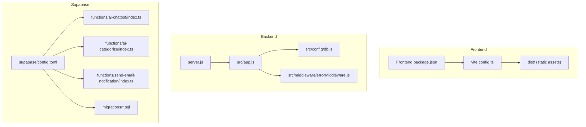
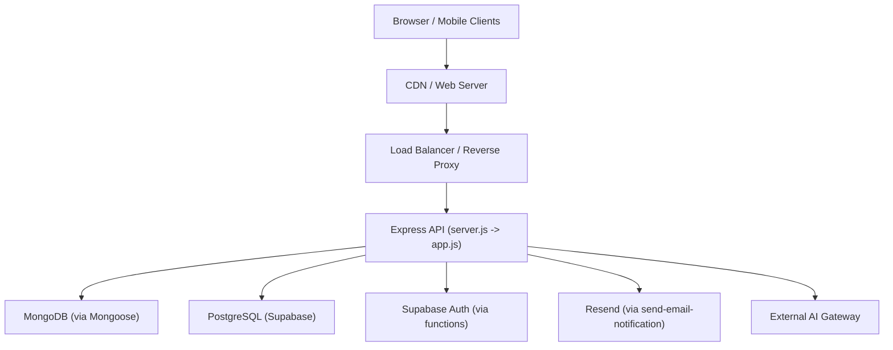
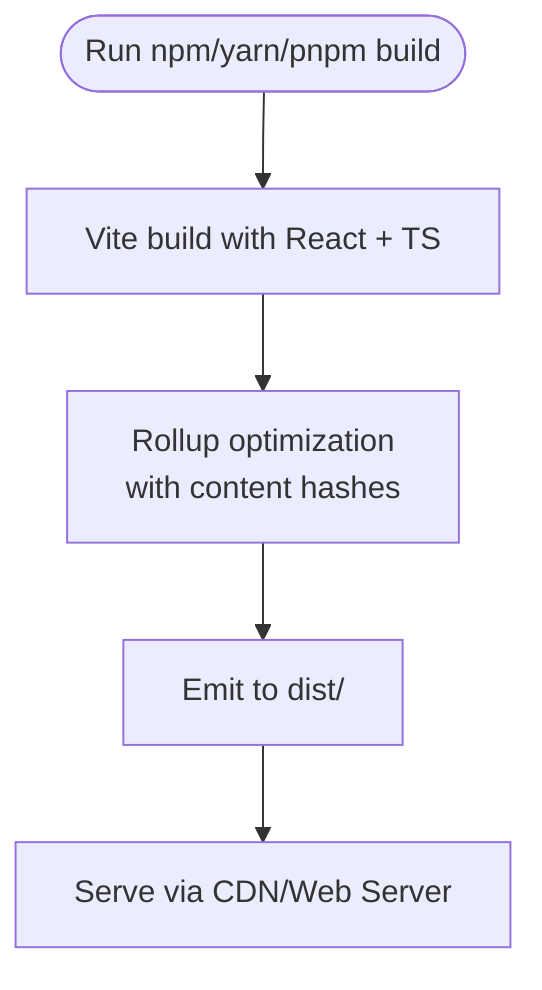
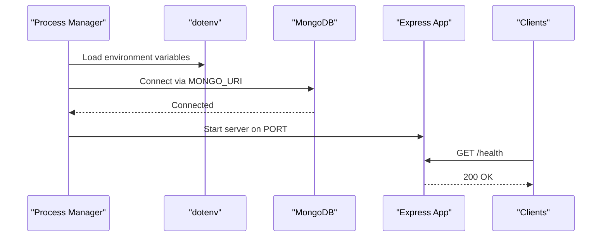
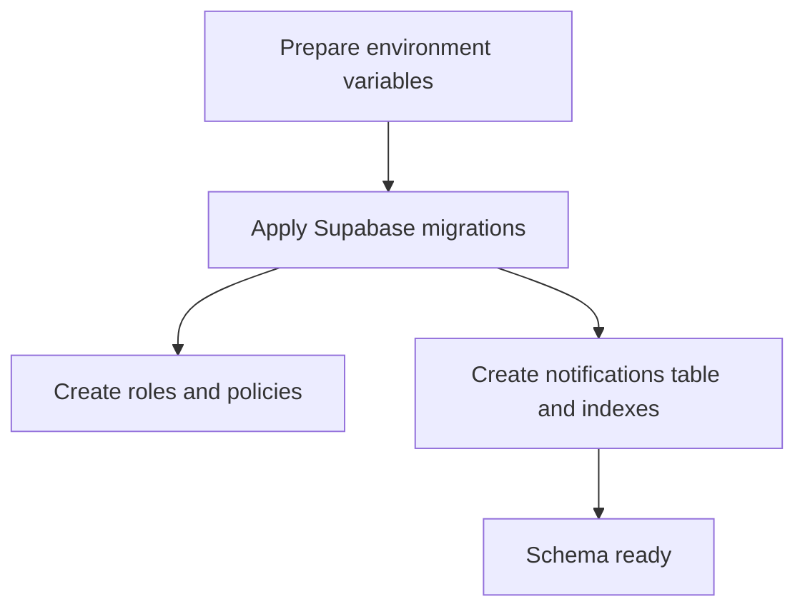
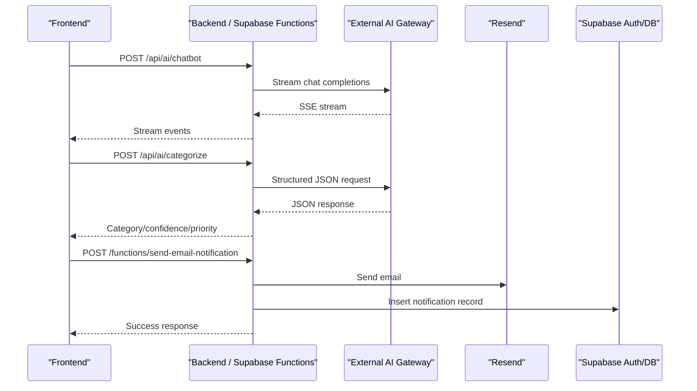
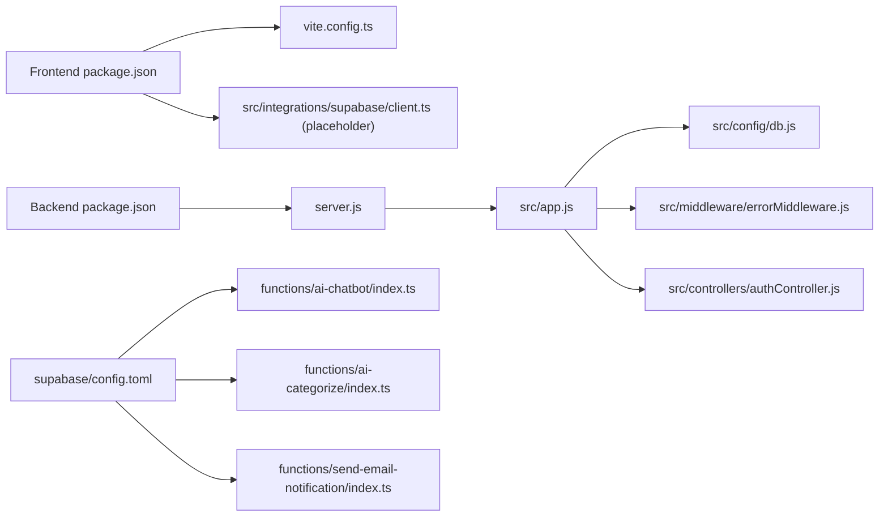

# Deployment & DevOps

<cite>
**Referenced Files in This Document**
- [package.json](file://Frontend/package.json)
- [vite.config.ts](file://Frontend/vite.config.ts)
- [.gitignore](file://Frontend/.gitignore)
- [config.toml](file://Frontend/supabase/config.toml)
- [20260103164505_7ef66a27-61e5-4229-acf2-c592ec82bd45.sql](file://Frontend/supabase/migrations/20260103164505_7ef66a27-61e5-4229-acf2-c592ec82bd45.sql)
- [20260108191133_02ddf716-c5c4-48c9-9459-b24f42d145f8.sql](file://Frontend/supabase/migrations/20260108191133_02ddf716-c5c4-48c9-9459-b24f42d145f8.sql)
- [index.ts (ai-chatbot)](file://Frontend/supabase/functions/ai-chatbot/index.ts)
- [index.ts (ai-categorize)](file://Frontend/supabase/functions/ai-categorize/index.ts)
- [index.ts (send-email-notification)](file://Frontend/supabase/functions/send-email-notification/index.ts)
- [server.js](file://backend/server.js)
- [package.json](file://backend/package.json)
- [db.js](file://backend/src/config/db.js)
- [app.js](file://backend/src/app.js)
- [errorMiddleware.js](file://backend/src/middleware/errorMiddleware.js)
- [authController.js](file://backend/src/controllers/authController.js)
- [client.ts](file://Frontend/src/integrations/supabase/client.ts)
</cite>

## Table of Contents
1. [Introduction](#introduction)
2. [Project Structure](#project-structure)
3. [Core Components](#core-components)
4. [Architecture Overview](#architecture-overview)
5. [Detailed Component Analysis](#detailed-component-analysis)
6. [Dependency Analysis](#dependency-analysis)
7. [Performance Considerations](#performance-considerations)
8. [Troubleshooting Guide](#troubleshooting-guide)
9. [Conclusion](#conclusion)
10. [Appendices](#appendices)

## Introduction
This document provides comprehensive deployment and DevOps guidance for the Smart Voice Report system. It covers production deployment strategies, infrastructure setup, frontend build process, backend deployment configurations, database migration procedures, Supabase AI function deployment, environment variable management, CI/CD pipeline setup, monitoring and logging, performance optimization, scaling strategies, infrastructure requirements, security hardening, disaster recovery planning, deployment automation, rollback procedures, and operational maintenance tasks.

## Project Structure
The project comprises:
- Frontend built with Vite, React, TypeScript, and TailwindCSS, producing static assets deployed via a CDN or web server.
- Backend built with Express.js, Node.js, and MongoDB via Mongoose.
- Supabase-managed PostgreSQL schema and serverless functions for AI chatbot, categorization, and email notifications.

**Diagram sources**
- [package.json:1-92](file://Frontend/package.json#L1-L92)
- [vite.config.ts:1-39](file://Frontend/vite.config.ts#L1-L39)
- [server.js:1-22](file://backend/server.js#L1-L22)
- [app.js:1-71](file://backend/src/app.js#L1-L71)
- [db.js:1-18](file://backend/src/config/db.js#L1-L18)
- [errorMiddleware.js:1-21](file://backend/src/middleware/errorMiddleware.js#L1-L21)
- [config.toml:1-22](file://Frontend/supabase/config.toml#L1-L22)
- [index.ts (ai-chatbot):1-117](file://Frontend/supabase/functions/ai-chatbot/index.ts#L1-L117)
- [index.ts (ai-categorize):1-223](file://Frontend/supabase/functions/ai-categorize/index.ts#L1-L223)
- [index.ts (send-email-notification):1-163](file://Frontend/supabase/functions/send-email-notification/index.ts#L1-L163)
- [20260103164505_7ef66a27-61e5-4229-acf2-c592ec82bd45.sql:1-75](file://Frontend/supabase/migrations/20260103164505_7ef66a27-61e5-4229-acf2-c592ec82bd45.sql#L1-L75)
- [20260108191133_02ddf716-c5c4-48c9-9459-b24f42d145f8.sql:1-46](file://Frontend/supabase/migrations/20260108191133_02ddf716-c5c4-48c9-9459-b24f42d145f8.sql#L1-L46)

**Section sources**
- [package.json:1-92](file://Frontend/package.json#L1-L92)
- [vite.config.ts:1-39](file://Frontend/vite.config.ts#L1-L39)
- [server.js:1-22](file://backend/server.js#L1-L22)
- [app.js:1-71](file://backend/src/app.js#L1-L71)
- [db.js:1-18](file://backend/src/config/db.js#L1-L18)
- [errorMiddleware.js:1-21](file://backend/src/middleware/errorMiddleware.js#L1-L21)
- [config.toml:1-22](file://Frontend/supabase/config.toml#L1-L22)

## Core Components
- Frontend build and distribution:
  - Uses Vite with React and TypeScript. Production builds include content hashing for cache busting and optimized Rollup output.
  - Static assets are emitted under dist/.
- Backend runtime and API:
  - Express server loads environment variables, connects to MongoDB, and exposes REST endpoints.
  - Health check endpoint and centralized error handling.
- Supabase functions and schema:
  - AI chatbot and categorization functions integrate with external AI gateway.
  - Email notification function integrates with Resend and Supabase Auth.
  - PostgreSQL schema with row-level security and indexes for notifications and roles.

**Section sources**
- [package.json:1-92](file://Frontend/package.json#L1-L92)
- [vite.config.ts:28-37](file://Frontend/vite.config.ts#L28-L37)
- [server.js:1-22](file://backend/server.js#L1-L22)
- [app.js:39-41](file://backend/src/app.js#L39-L41)
- [errorMiddleware.js:1-21](file://backend/src/middleware/errorMiddleware.js#L1-L21)
- [config.toml:1-22](file://Frontend/supabase/config.toml#L1-L22)
- [index.ts (ai-chatbot):1-117](file://Frontend/supabase/functions/ai-chatbot/index.ts#L1-L117)
- [index.ts (ai-categorize):1-223](file://Frontend/supabase/functions/ai-categorize/index.ts#L1-L223)
- [index.ts (send-email-notification):1-163](file://Frontend/supabase/functions/send-email-notification/index.ts#L1-L163)
- [20260103164505_7ef66a27-61e5-4229-acf2-c592ec82bd45.sql:1-75](file://Frontend/supabase/migrations/20260103164505_7ef66a27-61e5-4229-acf2-c592ec82bd45.sql#L1-L75)
- [20260108191133_02ddf716-c5c4-48c9-9459-b24f42d145f8.sql:1-46](file://Frontend/supabase/migrations/20260108191133_02ddf716-c5c4-48c9-9459-b24f42d145f8.sql#L1-L46)

## Architecture Overview
Production deployment architecture:
- Frontend static assets served via CDN or web server.
- Backend Express API exposed behind a reverse proxy/load balancer.
- MongoDB hosted on managed cloud provider.
- Supabase-managed PostgreSQL for schema and serverless functions.
- AI gateway integration for LLM-powered features.
- Email delivery via Resend.

**Diagram sources**
- [server.js:1-22](file://backend/server.js#L1-L22)
- [app.js:1-71](file://backend/src/app.js#L1-L71)
- [index.ts (send-email-notification):1-163](file://Frontend/supabase/functions/send-email-notification/index.ts#L1-L163)
- [index.ts (ai-chatbot):1-117](file://Frontend/supabase/functions/ai-chatbot/index.ts#L1-L117)
- [index.ts (ai-categorize):1-223](file://Frontend/supabase/functions/ai-categorize/index.ts#L1-L223)

## Detailed Component Analysis

### Frontend Build Process
- Build commands and scripts are defined in the frontend package.json.
- Vite configuration sets development server, aliases, dependency optimization, and production cache-busting filenames.
- Static assets are produced in dist/, which should be served by CDN or web server.

**Diagram sources**
- [package.json:6-11](file://Frontend/package.json#L6-L11)
- [vite.config.ts:28-37](file://Frontend/vite.config.ts#L28-L37)

**Section sources**
- [package.json:6-11](file://Frontend/package.json#L6-L11)
- [vite.config.ts:1-39](file://Frontend/vite.config.ts#L1-L39)
- [.gitignore:10-12](file://Frontend/.gitignore#L10-L12)

### Backend Deployment Configuration
- Environment variables:
  - PORT, MONGO_URI, JWT_SECRET, and other secrets are loaded via dotenv.
- Startup:
  - server.js initializes dotenv, connects to MongoDB, and starts the Express app.
- API routing:
  - Centralized app.js mounts all route modules and registers error handlers.
- Health checks:
  - GET /health endpoint returns status ok.

**Diagram sources**
- [server.js:1-22](file://backend/server.js#L1-L22)
- [db.js:1-18](file://backend/src/config/db.js#L1-L18)
- [app.js:39-41](file://backend/src/app.js#L39-L41)

**Section sources**
- [server.js:1-22](file://backend/server.js#L1-L22)
- [db.js:1-18](file://backend/src/config/db.js#L1-L18)
- [app.js:1-71](file://backend/src/app.js#L1-L71)

### Database Migration Procedures
- Supabase PostgreSQL schema:
  - Roles and RLS policies for user roles.
  - Notifications table with RLS and indexes.
- Migration files:
  - Apply schema changes using Supabase CLI or dashboard.
- MongoDB:
  - Connection handled by Mongoose; ensure URI is configured in environment.

**Diagram sources**
- [20260103164505_7ef66a27-61e5-4229-acf2-c592ec82bd45.sql:1-75](file://Frontend/supabase/migrations/20260103164505_7ef66a27-61e5-4229-acf2-c592ec82bd45.sql#L1-L75)
- [20260108191133_02ddf716-c5c4-48c9-9459-b24f42d145f8.sql:1-46](file://Frontend/supabase/migrations/20260108191133_02ddf716-c5c4-48c9-9459-b24f42d145f8.sql#L1-L46)

**Section sources**
- [20260103164505_7ef66a27-61e5-4229-acf2-c592ec82bd45.sql:1-75](file://Frontend/supabase/migrations/20260103164505_7ef66a27-61e5-4229-acf2-c592ec82bd45.sql#L1-L75)
- [20260108191133_02ddf716-c5c4-48c9-9459-b24f42d145f8.sql:1-46](file://Frontend/supabase/migrations/20260108191133_02ddf716-c5c4-48c9-9459-b24f42d145f8.sql#L1-L46)
- [db.js:1-18](file://backend/src/config/db.js#L1-L18)

### Supabase AI Function Deployment
- Functions:
  - ai-chatbot: Streams LLM responses from external gateway.
  - ai-categorize: Structured JSON output with fallback keyword categorization.
  - send-email-notification: Sends HTML emails via Resend and creates in-app notifications.
- Configuration:
  - config.toml defines ports, API settings, and function-specific flags.
- Environment variables:
  - ai-chatbot and ai-categorize require LOVABLE_API_KEY.
  - send-email-notification requires RESEND_API_KEY, SUPABASE_URL, SUPABASE_SERVICE_ROLE_KEY, and SITE_URL.

**Diagram sources**
- [index.ts (ai-chatbot):40-108](file://Frontend/supabase/functions/ai-chatbot/index.ts#L40-L108)
- [index.ts (ai-categorize):116-211](file://Frontend/supabase/functions/ai-categorize/index.ts#L116-L211)
- [index.ts (send-email-notification):101-146](file://Frontend/supabase/functions/send-email-notification/index.ts#L101-L146)
- [config.toml:17-21](file://Frontend/supabase/config.toml#L17-L21)

**Section sources**
- [index.ts (ai-chatbot):1-117](file://Frontend/supabase/functions/ai-chatbot/index.ts#L1-L117)
- [index.ts (ai-categorize):1-223](file://Frontend/supabase/functions/ai-categorize/index.ts#L1-L223)
- [index.ts (send-email-notification):1-163](file://Frontend/supabase/functions/send-email-notification/index.ts#L1-L163)
- [config.toml:1-22](file://Frontend/supabase/config.toml#L1-L22)

### Environment Variable Management
- Backend:
  - Required: MONGO_URI, JWT_SECRET, PORT (default 3000).
  - Optional: Logging and feature flags as needed.
- Supabase Functions:
  - ai-chatbot: LOVABLE_API_KEY.
  - send-email-notification: RESEND_API_KEY, SUPABASE_URL, SUPABASE_SERVICE_ROLE_KEY, SITE_URL.

**Section sources**
- [server.js:1-22](file://backend/server.js#L1-L22)
- [db.js:1-18](file://backend/src/config/db.js#L1-L18)
- [index.ts (ai-chatbot):56-61](file://Frontend/supabase/functions/ai-chatbot/index.ts#L56-L61)
- [index.ts (send-email-notification):5-93](file://Frontend/supabase/functions/send-email-notification/index.ts#L5-L93)

### CI/CD Pipeline Setup
Recommended stages:
- Build:
  - Frontend: Install dependencies and run build; upload dist/ artifacts.
  - Backend: Install dependencies and run tests/lint.
- Test:
  - Unit/integration tests for backend.
  - E2E testing for critical flows.
- Deploy:
  - Frontend: Deploy dist/ to CDN or static hosting.
  - Backend: Deploy to container/service platform with health checks.
  - Supabase: Apply migrations and deploy functions.
- Release:
  - Tag releases and promote artifacts.
- Rollback:
  - Maintain artifact retention and blue/green deployments.

[No sources needed since this section provides general guidance]

### Monitoring and Logging
- Backend:
  - Morgan access logs in development; configure structured logging in production.
  - Centralized error handling returns minimal stack traces in production.
- Frontend:
  - No explicit logging configuration observed; consider adding error reporting SDK.
- Infrastructure:
  - Monitor MongoDB connection health and replica set status.
  - Track Supabase function invocations and latency.
  - Observe AI gateway rate limits and error rates.

**Section sources**
- [app.js:37-37](file://backend/src/app.js#L37-L37)
- [errorMiddleware.js:8-18](file://backend/src/middleware/errorMiddleware.js#L8-L18)

### Performance Optimization
- Frontend:
  - Content hashing for cache busting.
  - Dependency optimization and aliasing.
- Backend:
  - Limit payload sizes for uploads.
  - Disable ETags to avoid stale cached responses.
- Database:
  - Use indexes on frequently queried columns (e.g., notifications).
- AI Functions:
  - Stream responses to reduce latency.
  - Implement fallback logic when AI is unavailable.

**Section sources**
- [vite.config.ts:28-37](file://Frontend/vite.config.ts#L28-L37)
- [app.js:30-36](file://backend/src/app.js#L30-L36)
- [20260108191133_02ddf716-c5c4-48c9-9459-b24f42d145f8.sql:43-46](file://Frontend/supabase/migrations/20260108191133_02ddf716-c5c4-48c9-9459-b24f42d145f8.sql#L43-L46)
- [index.ts (ai-chatbot):104-108](file://Frontend/supabase/functions/ai-chatbot/index.ts#L104-L108)

### Scaling Strategies
- Horizontal scaling:
  - Stateless backend behind load balancer.
  - CDN for global distribution of static assets.
- Stateful scaling:
  - MongoDB sharding and replica sets.
  - PostgreSQL read replicas if needed.
- AI functions:
  - Use managed function platforms with autoscaling.
  - Implement circuit breakers and retries.

[No sources needed since this section provides general guidance]

### Infrastructure Requirements
- Compute:
  - Backend: Containerized or serverless runtime with persistent connections.
  - Frontend: CDN or static hosting.
- Storage:
  - MongoDB Atlas or compatible managed service.
  - Supabase PostgreSQL for schema and functions.
- Networking:
  - Secure TLS termination at load balancer.
  - Private subnets for database connectivity.
- Secrets:
  - Secret manager for API keys and database credentials.

[No sources needed since this section provides general guidance]

### Security Hardening
- Transport:
  - Enforce HTTPS and HSTS.
- Authentication:
  - JWT-based sessions with secure cookies in production.
  - 2FA enforcement for citizen users.
- Authorization:
  - Role-based access control and RLS policies.
- Secrets:
  - Store all secrets in environment variables or secret managers.
- Functions:
  - Restrict CORS and validate inputs rigorously.
  - Avoid exposing internal service keys.

**Section sources**
- [authController.js:154-190](file://backend/src/controllers/authController.js#L154-L190)
- [20260103164505_7ef66a27-61e5-4229-acf2-c592ec82bd45.sql:46-57](file://Frontend/supabase/migrations/20260103164505_7ef66a27-61e5-4229-acf2-c592ec82bd45.sql#L46-L57)
- [index.ts (send-email-notification):82-160](file://Frontend/supabase/functions/send-email-notification/index.ts#L82-L160)

### Disaster Recovery Planning
- Backups:
  - Automated MongoDB backups and point-in-time recovery.
  - Supabase database snapshots.
- Failover:
  - Multi-region deployments with health checks.
  - CDN failover to secondary regions.
- Recovery:
  - Test restore procedures regularly.
  - Maintain immutable artifacts for quick rollbacks.

[No sources needed since this section provides general guidance]

### Deployment Automation and Rollback Procedures
- Automation:
  - Use IaC (Infrastructure as Code) for environments.
  - Automate migrations and function deployments.
- Rollback:
  - Keep previous versions of artifacts.
  - Use blue/green or canary deployments.
  - Maintain rollback scripts for database migrations.

[No sources needed since this section provides general guidance]

### Operational Maintenance Tasks
- Daily:
  - Monitor health endpoints and error logs.
  - Review AI gateway quotas and costs.
- Weekly:
  - Rotate secrets and refresh JWT signing keys.
  - Audit access logs and RLS policy effectiveness.
- Monthly:
  - Review CDN cache hit ratios and optimize caching headers.
  - Reassess database indexes and query performance.

[No sources needed since this section provides general guidance]

## Dependency Analysis
- Frontend depends on Vite, React, and Supabase client (deprecated placeholder).
- Backend depends on Express, Mongoose, and various services.
- Supabase functions depend on external AI gateway and Resend.

**Diagram sources**
- [package.json:1-92](file://Frontend/package.json#L1-L92)
- [vite.config.ts:1-39](file://Frontend/vite.config.ts#L1-L39)
- [client.ts:1-24](file://Frontend/src/integrations/supabase/client.ts#L1-L24)
- [package.json:1-28](file://backend/package.json#L1-L28)
- [server.js:1-22](file://backend/server.js#L1-L22)
- [app.js:1-71](file://backend/src/app.js#L1-L71)
- [db.js:1-18](file://backend/src/config/db.js#L1-L18)
- [errorMiddleware.js:1-21](file://backend/src/middleware/errorMiddleware.js#L1-L21)
- [authController.js:1-237](file://backend/src/controllers/authController.js#L1-L237)
- [config.toml:1-22](file://Frontend/supabase/config.toml#L1-L22)
- [index.ts (ai-chatbot):1-117](file://Frontend/supabase/functions/ai-chatbot/index.ts#L1-L117)
- [index.ts (ai-categorize):1-223](file://Frontend/supabase/functions/ai-categorize/index.ts#L1-L223)
- [index.ts (send-email-notification):1-163](file://Frontend/supabase/functions/send-email-notification/index.ts#L1-L163)

**Section sources**
- [package.json:1-92](file://Frontend/package.json#L1-L92)
- [package.json:1-28](file://backend/package.json#L1-L28)
- [client.ts:1-24](file://Frontend/src/integrations/supabase/client.ts#L1-L24)
- [server.js:1-22](file://backend/server.js#L1-L22)
- [app.js:1-71](file://backend/src/app.js#L1-L71)
- [db.js:1-18](file://backend/src/config/db.js#L1-L18)
- [errorMiddleware.js:1-21](file://backend/src/middleware/errorMiddleware.js#L1-L21)
- [authController.js:1-237](file://backend/src/controllers/authController.js#L1-L237)
- [config.toml:1-22](file://Frontend/supabase/config.toml#L1-L22)

## Performance Considerations
- Frontend:
  - Use hashed asset filenames and long-lived caching for static assets.
  - Lazy-load non-critical components.
- Backend:
  - Tune connection pool sizes and timeouts for MongoDB.
  - Implement request size limits and compression.
- AI Functions:
  - Stream responses and handle rate limits gracefully.
  - Cache frequent results where appropriate.

[No sources needed since this section provides general guidance]

## Troubleshooting Guide
- MongoDB connection failures:
  - Verify MONGO_URI and network connectivity.
- Backend 500 errors:
  - Check centralized error handler logs and stack traces in development.
- Supabase function errors:
  - Confirm environment variables are set and AI gateway responses are parsable.
- CORS and streaming:
  - Ensure proper headers and preflight handling in functions.

**Section sources**
- [db.js:6-8](file://backend/src/config/db.js#L6-L8)
- [errorMiddleware.js:8-18](file://backend/src/middleware/errorMiddleware.js#L8-L18)
- [index.ts (ai-chatbot):56-61](file://Frontend/supabase/functions/ai-chatbot/index.ts#L56-L61)
- [index.ts (send-email-notification):82-160](file://Frontend/supabase/functions/send-email-notification/index.ts#L82-L160)

## Conclusion
This guide outlines a production-ready deployment strategy for the Smart Voice Report system, covering frontend build, backend deployment, database migrations, Supabase AI functions, environment management, CI/CD, monitoring, performance, scaling, security, and operations. Adopt the recommended practices to ensure reliability, scalability, and maintainability.

## Appendices
- Supabase configuration reference:
  - Ports, API settings, and function flags.
- Migration checklist:
  - Apply schema, verify RLS, confirm indexes, test notifications.

**Section sources**
- [config.toml:1-22](file://Frontend/supabase/config.toml#L1-L22)
- [20260103164505_7ef66a27-61e5-4229-acf2-c592ec82bd45.sql:1-75](file://Frontend/supabase/migrations/20260103164505_7ef66a27-61e5-4229-acf2-c592ec82bd45.sql#L1-L75)
- [20260108191133_02ddf716-c5c4-48c9-9459-b24f42d145f8.sql:1-46](file://Frontend/supabase/migrations/20260108191133_02ddf716-c5c4-48c9-9459-b24f42d145f8.sql#L1-L46)