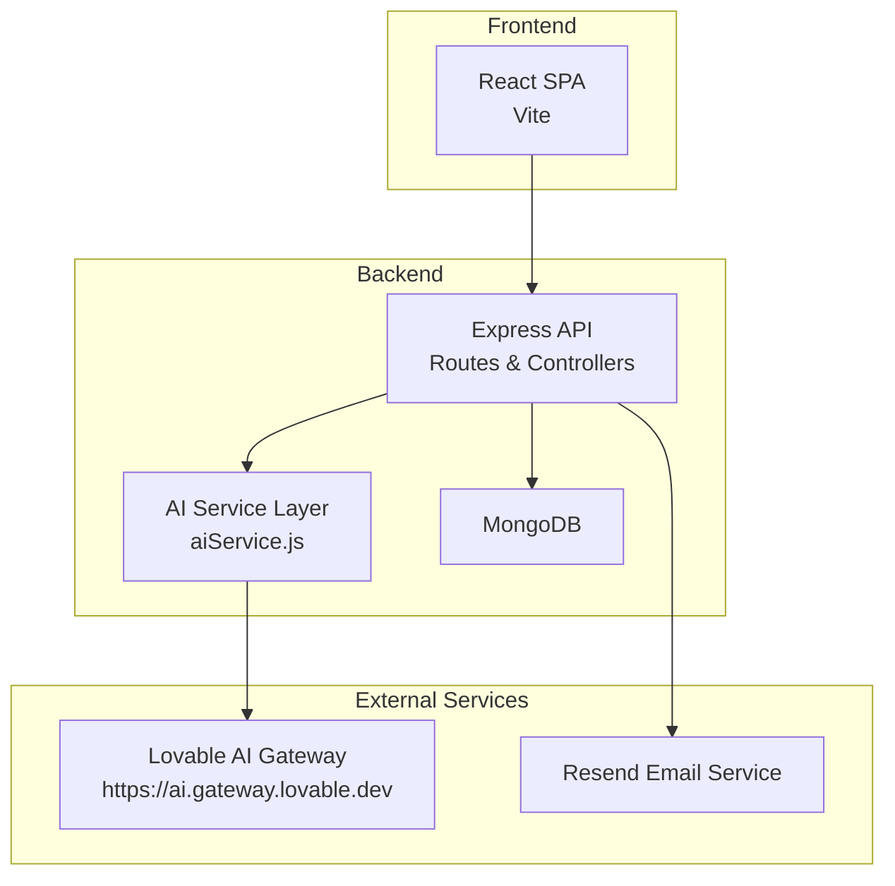
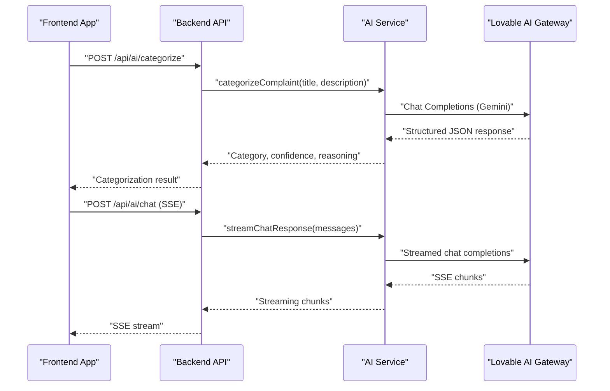
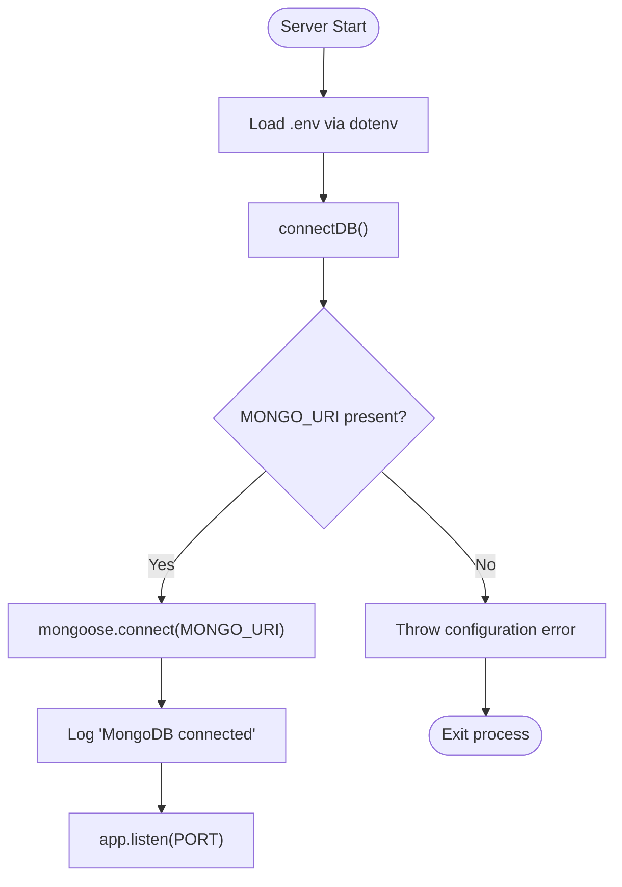
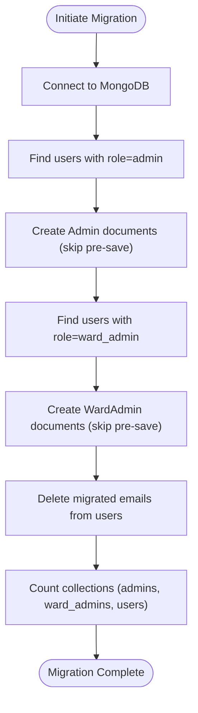
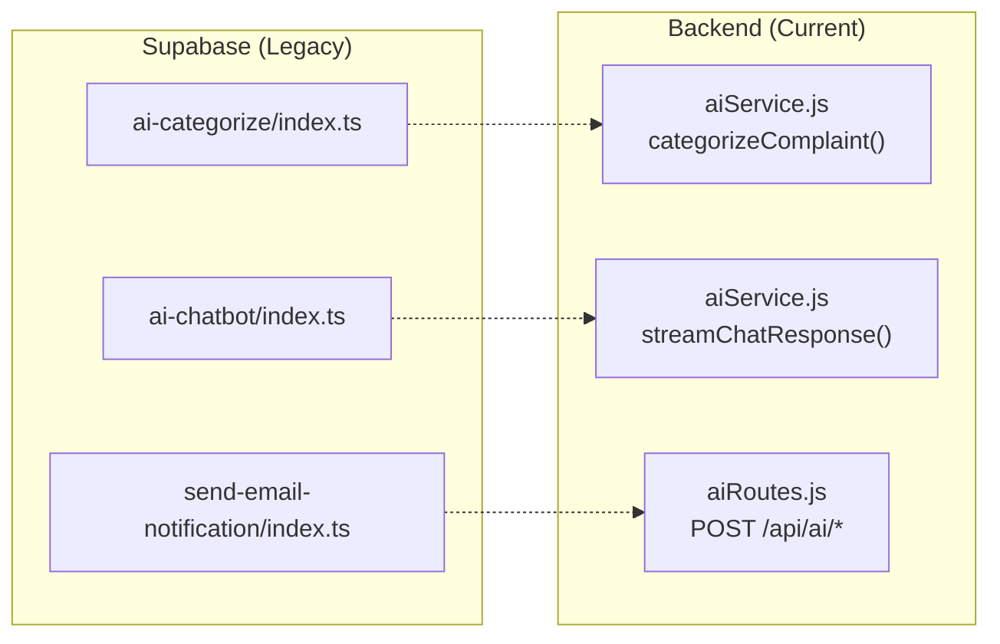
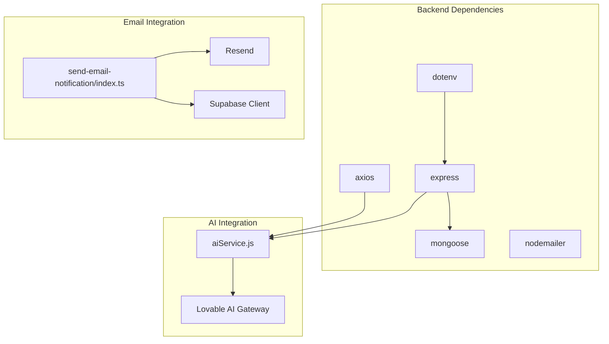

# Infrastructure & Environment Setup

<cite>
**Referenced Files in This Document**
- [db.js](file://backend/src/config/db.js)
- [server.js](file://backend/server.js)
- [package.json](file://backend/package.json)
- [aiService.js](file://backend/src/services/aiService.js)
- [aiRoutes.js](file://backend/src/routes/aiRoutes.js)
- [migrate-collections.js](file://backend/migrate-collections.js)
- [20260103164505_7ef66a27-61e5-4229-acf2-c592ec82bd45.sql](file://Frontend/supabase/migrations/20260103164505_7ef66a27-61e5-4229-acf2-c592ec82bd45.sql)
- [20260108191133_02ddf716-c5c4-48c9-9459-b24f42d145f8.sql](file://Frontend/supabase/migrations/20260108191133_02ddf716-c5c4-48c9-9459-b24f42d145f8.sql)
- [config.toml](file://Frontend/supabase/config.toml)
- [index.ts (ai-categorize)](file://Frontend/supabase/functions/ai-categorize/index.ts)
- [index.ts (ai-chatbot)](file://Frontend/supabase/functions/ai-chatbot/index.ts)
- [index.ts (send-email-notification)](file://Frontend/supabase/functions/send-email-notification/index.ts)
- [client.ts (supabase client placeholder)](file://Frontend/src/integrations/supabase/client.ts)
- [SUPABASE_MIGRATION_SUMMARY.md](file://SUPABASE_MIGRATION_SUMMARY.md)
</cite>

## Table of Contents
1. [Introduction](#introduction)
2. [Project Structure](#project-structure)
3. [Core Components](#core-components)
4. [Architecture Overview](#architecture-overview)
5. [Detailed Component Analysis](#detailed-component-analysis)
6. [Dependency Analysis](#dependency-analysis)
7. [Performance Considerations](#performance-considerations)
8. [Troubleshooting Guide](#troubleshooting-guide)
9. [Conclusion](#conclusion)
10. [Appendices](#appendices)

## Introduction
This document provides comprehensive infrastructure and environment setup guidance for the Smart Voice Report system. It covers:
- MongoDB connection setup and configuration validation
- Database migration procedures and collection restructuring
- AI function deployment and migration from Supabase Edge Functions to the Node.js backend
- Environment variable management and secrets handling
- Network configuration, firewall, and security group recommendations for production
- Scaling considerations and resource allocation guidelines

## Project Structure
The system comprises:
- A Node.js backend using Express and Mongoose for MongoDB connectivity
- Supabase Edge Functions (originally) for AI categorization, chatbot, and email notifications
- A consolidated architecture where AI functions were migrated to the backend for unified data access and simplified deployment

**Diagram sources**
- [server.js:1-22](file://backend/server.js#L1-L22)
- [aiService.js:1-322](file://backend/src/services/aiService.js#L1-L322)
- [aiRoutes.js:1-94](file://backend/src/routes/aiRoutes.js#L1-L94)
- [db.js:1-18](file://backend/src/config/db.js#L1-L18)

**Section sources**
- [server.js:1-22](file://backend/server.js#L1-L22)
- [package.json:1-28](file://backend/package.json#L1-L28)

## Core Components
- MongoDB connection and configuration
- AI service layer for complaint categorization and chatbot streaming
- Backend routes exposing AI endpoints
- Database migration scripts and Supabase migrations
- Supabase Edge Functions (migrated to backend)

Key environment variables:
- MONGO_URI: MongoDB connection string
- LOVABLE_API_KEY: Authentication key for Lovable AI Gateway
- PORT: Backend server port (default 3000)
- RESEND_API_KEY: Email service credentials
- SUPABASE_URL, SUPABASE_SERVICE_ROLE_KEY: Legacy Supabase integration placeholders

**Section sources**
- [db.js:1-18](file://backend/src/config/db.js#L1-L18)
- [aiService.js:1-322](file://backend/src/services/aiService.js#L1-L322)
- [aiRoutes.js:1-94](file://backend/src/routes/aiRoutes.js#L1-L94)
- [migrate-collections.js:1-159](file://backend/migrate-collections.js#L1-L159)
- [20260103164505_7ef66a27-61e5-4229-acf2-c592ec82bd45.sql:1-75](file://Frontend/supabase/migrations/20260103164505_7ef66a27-61e5-4229-acf2-c592ec82bd45.sql#L1-L75)
- [20260108191133_02ddf716-c5c4-48c9-9459-b24f42d145f8.sql:1-46](file://Frontend/supabase/migrations/20260108191133_02ddf716-c5c4-48c9-9459-b24f42d145f8.sql#L1-L46)
- [config.toml:1-22](file://Frontend/supabase/config.toml#L1-L22)
- [index.ts (ai-categorize):1-223](file://Frontend/supabase/functions/ai-categorize/index.ts#L1-L223)
- [index.ts (ai-chatbot):1-117](file://Frontend/supabase/functions/ai-chatbot/index.ts#L1-L117)
- [index.ts (send-email-notification):1-163](file://Frontend/supabase/functions/send-email-notification/index.ts#L1-L163)
- [client.ts (supabase client placeholder):1-24](file://Frontend/src/integrations/supabase/client.ts#L1-L24)
- [SUPABASE_MIGRATION_SUMMARY.md:1-337](file://SUPABASE_MIGRATION_SUMMARY.md#L1-L337)

## Architecture Overview
The system integrates a React frontend with a Node.js backend that exposes AI-powered endpoints. AI functions were migrated from Supabase Edge Functions to the backend for centralized data access and streamlined deployment.

**Diagram sources**
- [aiRoutes.js:1-94](file://backend/src/routes/aiRoutes.js#L1-L94)
- [aiService.js:96-213](file://backend/src/services/aiService.js#L96-L213)
- [index.ts (ai-categorize):117-150](file://Frontend/supabase/functions/ai-categorize/index.ts#L117-L150)
- [index.ts (ai-chatbot):65-102](file://Frontend/supabase/functions/ai-chatbot/index.ts#L65-L102)

## Detailed Component Analysis

### Database Configuration and Connection Management
- MongoDB connection is established via Mongoose using the MONGO_URI environment variable.
- The connection validates the presence of the URI and logs successful connections.
- The backend loads environment variables using dotenv before starting the server.

**Diagram sources**
- [server.js:1-22](file://backend/server.js#L1-L22)
- [db.js:1-18](file://backend/src/config/db.js#L1-L18)

**Section sources**
- [db.js:1-18](file://backend/src/config/db.js#L1-L18)
- [server.js:1-22](file://backend/server.js#L1-L22)

### Database Migration Procedures
- The migration script separates admin and ward admin accounts from the users collection into dedicated collections.
- It migrates records preserving hashed passwords and timestamps, then removes migrated entries from the users collection.
- Verification counts are printed for admins, ward admins, and citizens after completion.

**Diagram sources**
- [migrate-collections.js:51-155](file://backend/migrate-collections.js#L51-L155)

**Section sources**
- [migrate-collections.js:1-159](file://backend/migrate-collections.js#L1-L159)

### Supabase AI Function Deployment and Migration
- Original Supabase Edge Functions included:
  - ai-categorize: Structured JSON categorization with urgency detection
  - ai-chatbot: Streaming chatbot powered by Lovable AI
  - send-email-notification: Email notifications via Resend with in-app notification creation
- Migration summary documents the move to backend AI service and routes, updating frontend endpoints and removing Supabase dependencies.

**Diagram sources**
- [index.ts (ai-categorize):1-223](file://Frontend/supabase/functions/ai-categorize/index.ts#L1-L223)
- [index.ts (ai-chatbot):1-117](file://Frontend/supabase/functions/ai-chatbot/index.ts#L1-L117)
- [index.ts (send-email-notification):1-163](file://Frontend/supabase/functions/send-email-notification/index.ts#L1-L163)
- [aiService.js:96-213](file://backend/src/services/aiService.js#L96-L213)
- [aiRoutes.js:1-94](file://backend/src/routes/aiRoutes.js#L1-L94)
- [SUPABASE_MIGRATION_SUMMARY.md:1-337](file://SUPABASE_MIGRATION_SUMMARY.md#L1-L337)

**Section sources**
- [index.ts (ai-categorize):1-223](file://Frontend/supabase/functions/ai-categorize/index.ts#L1-L223)
- [index.ts (ai-chatbot):1-117](file://Frontend/supabase/functions/ai-chatbot/index.ts#L1-L117)
- [index.ts (send-email-notification):1-163](file://Frontend/supabase/functions/send-email-notification/index.ts#L1-L163)
- [aiService.js:1-322](file://backend/src/services/aiService.js#L1-L322)
- [aiRoutes.js:1-94](file://backend/src/routes/aiRoutes.js#L1-L94)
- [SUPABASE_MIGRATION_SUMMARY.md:1-337](file://SUPABASE_MIGRATION_SUMMARY.md#L1-L337)

### Environment Variable Management and Secrets
- Backend requires:
  - MONGO_URI: MongoDB connection string
  - LOVABLE_API_KEY: Lovable AI Gateway authentication
  - Optional: PORT (defaults to 3000)
- Email notifications require:
  - RESEND_API_KEY
  - SUPABASE_URL and SUPABASE_SERVICE_ROLE_KEY (placeholders retained for legacy integration)
- Frontend requires:
  - VITE_BACKEND_URL pointing to the backend API

Validation and fallback behavior:
- Missing LOVABLE_API_KEY triggers a warning and fallback to keyword-based categorization.
- Missing MONGO_URI causes an immediate configuration error during startup.

**Section sources**
- [aiService.js:10-17](file://backend/src/services/aiService.js#L10-L17)
- [index.ts (send-email-notification):5-93](file://Frontend/supabase/functions/send-email-notification/index.ts#L5-L93)
- [client.ts (supabase client placeholder):1-24](file://Frontend/src/integrations/supabase/client.ts#L1-L24)
- [SUPABASE_MIGRATION_SUMMARY.md:36-44](file://SUPABASE_MIGRATION_SUMMARY.md#L36-L44)

### Database Schema and Row Level Security (RLS)
- Supabase migrations define:
  - Enum type for roles and a user_roles table with RLS policies
  - Notifications table with RLS policies for authenticated users
  - Security definer functions to check roles and retrieve user roles
  - Triggers to auto-assign 'user' role on signup

These migrations establish role-based access control and audit-friendly notification handling.

**Section sources**
- [20260103164505_7ef66a27-61e5-4229-acf2-c592ec82bd45.sql:1-75](file://Frontend/supabase/migrations/20260103164505_7ef66a27-61e5-4229-acf2-c592ec82bd45.sql#L1-L75)
- [20260108191133_02ddf716-c5c4-48c9-9459-b24f42d145f8.sql:1-46](file://Frontend/supabase/migrations/20260108191133_02ddf716-c5c4-48c9-9459-b24f42d145f8.sql#L1-L46)

## Dependency Analysis
- Backend dependencies include Express, Mongoose, dotenv, axios, and others for AI and email services.
- The AI service depends on the Lovable AI Gateway for structured completions and streaming responses.
- Email notifications depend on Resend and Supabase client for user lookup and in-app notifications.

**Diagram sources**
- [package.json:10-26](file://backend/package.json#L10-L26)
- [aiService.js:7-12](file://backend/src/services/aiService.js#L7-L12)
- [index.ts (send-email-notification):2-3](file://Frontend/supabase/functions/send-email-notification/index.ts#L2-L3)

**Section sources**
- [package.json:10-26](file://backend/package.json#L10-L26)

## Performance Considerations
- AI categorization and chatbot responses rely on external Lovable AI Gateway. Implement retry logic and circuit breakers in production deployments.
- Streaming chatbot responses use Server-Sent Events (SSE). Ensure proxies and load balancers support SSE streaming.
- MongoDB connection pooling: Use connection pooling parameters appropriate for expected concurrency. Consider environment-specific pool sizes and timeouts.
- Email throughput: Rate limits apply to Resend; implement queuing and exponential backoff for bulk notifications.

[No sources needed since this section provides general guidance]

## Troubleshooting Guide
Common issues and resolutions:
- AI categorization not working:
  - Verify LOVABLE_API_KEY is set in backend environment.
  - Confirm backend runs on the expected port and responds to /api/ai/categorize.
- Chatbot streaming issues:
  - Ensure SSE headers are correctly set and proxies do not buffer streaming responses.
- MongoDB connection failures:
  - Confirm MONGO_URI is present and reachable.
  - Check network ACLs and firewall rules for MongoDB port accessibility.
- Email notifications failing:
  - Validate RESEND_API_KEY and SITE_URL environment variables.
  - Confirm Supabase credentials for user lookup if still referenced.

**Section sources**
- [SUPABASE_MIGRATION_SUMMARY.md:272-300](file://SUPABASE_MIGRATION_SUMMARY.md#L272-L300)
- [aiRoutes.js:64-82](file://backend/src/routes/aiRoutes.js#L64-L82)
- [db.js:6-8](file://backend/src/config/db.js#L6-L8)

## Conclusion
The system consolidates AI functionality into the backend for unified data access and simplified deployment. MongoDB serves as the single source of truth, while AI and email services integrate via secure environment variables. Production readiness requires validating environment configurations, enabling SSE streaming, and applying robust networking and security controls.

[No sources needed since this section summarizes without analyzing specific files]

## Appendices

### Environment Variables Reference
- Backend
  - MONGO_URI: MongoDB connection string
  - LOVABLE_API_KEY: Lovable AI Gateway authentication
  - PORT: Backend server port (default 3000)
- Email Notifications
  - RESEND_API_KEY: Email service credentials
  - SUPABASE_URL, SUPABASE_SERVICE_ROLE_KEY: Legacy Supabase integration placeholders
- Frontend
  - VITE_BACKEND_URL: Backend API base URL

**Section sources**
- [aiService.js:10-17](file://backend/src/services/aiService.js#L10-L17)
- [index.ts (send-email-notification):5-93](file://Frontend/supabase/functions/send-email-notification/index.ts#L5-L93)
- [SUPABASE_MIGRATION_SUMMARY.md:36-44](file://SUPABASE_MIGRATION_SUMMARY.md#L36-L44)

### Network Configuration and Security Groups (Production)
- Ports to open:
  - Backend API: TCP 3000 (or custom PORT)
  - MongoDB: TCP 27017 (internal network only)
- Security groups:
  - Allow inbound traffic from frontend hosts and monitoring systems
  - Restrict outbound traffic to Lovable AI Gateway and Resend domains
  - Enforce TLS termination at reverse proxy/load balancer
- Firewall:
  - Limit access to administrative endpoints to trusted networks
  - Enable rate limiting for AI and email endpoints

[No sources needed since this section provides general guidance]