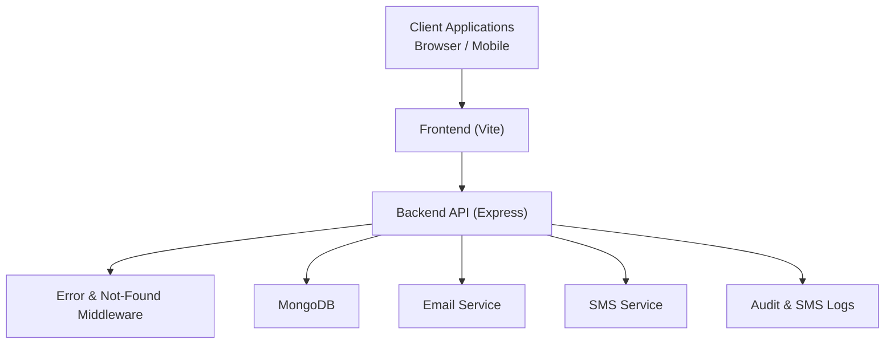
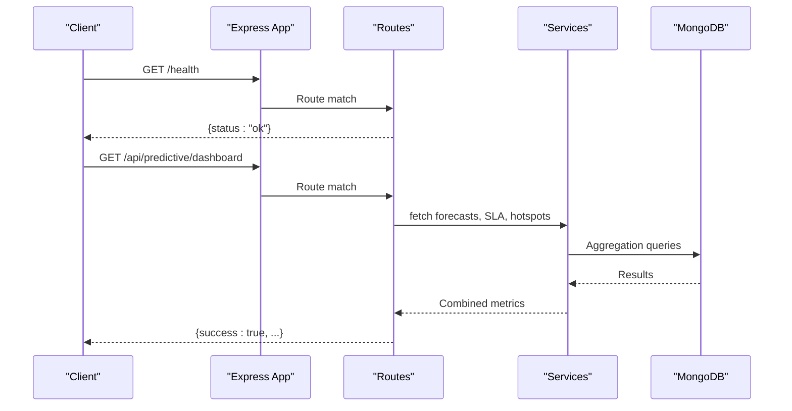
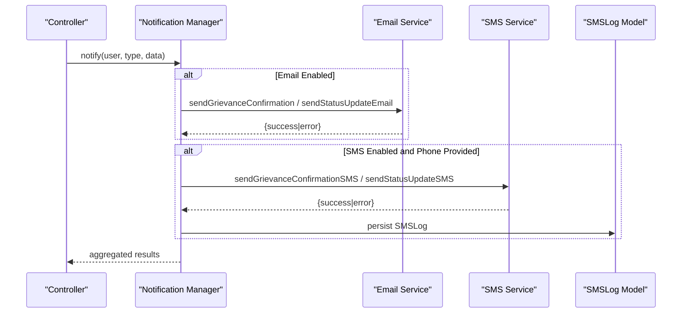
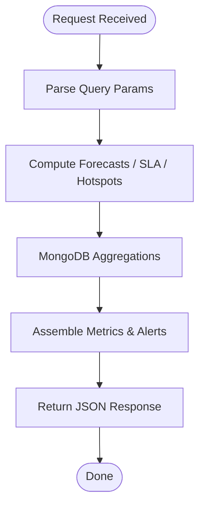
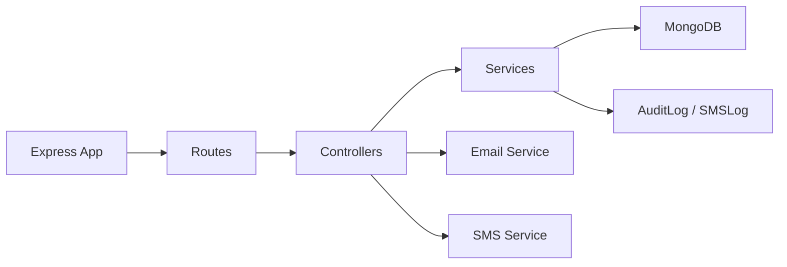

# Monitoring & Operations

<cite>
**Referenced Files in This Document**
- [server.js](file://backend/server.js)
- [app.js](file://backend/src/app.js)
- [errorMiddleware.js](file://backend/src/middleware/errorMiddleware.js)
- [db.js](file://backend/src/config/db.js)
- [package.json](file://backend/package.json)
- [emailService.js](file://backend/src/services/emailService.js)
- [notificationManager.js](file://backend/src/services/notificationManager.js)
- [smsService.js](file://backend/src/services/smsService.js)
- [SMSLog.js](file://backend/src/models/SMSLog.js)
- [AuditLog.js](file://backend/src/models/AuditLog.js)
- [predictiveAnalyticsController.js](file://backend/src/controllers/predictiveAnalyticsController.js)
- [slaAlertService.js](file://backend/src/services/slaAlertService.js)
- [heatmapRoutes.js](file://backend/src/routes/heatmapRoutes.js)
- [validation-suite.js](file://validation-suite.js)
</cite>

## Table of Contents
1. [Introduction](#introduction)
2. [Project Structure](#project-structure)
3. [Core Components](#core-components)
4. [Architecture Overview](#architecture-overview)
5. [Detailed Component Analysis](#detailed-component-analysis)
6. [Dependency Analysis](#dependency-analysis)
7. [Performance Considerations](#performance-considerations)
8. [Troubleshooting Guide](#troubleshooting-guide)
9. [Conclusion](#conclusion)
10. [Appendices](#appendices)

## Introduction
This document provides comprehensive monitoring and operations guidance for the Smart City Grievance Redressal System. It covers observability, error tracking, logging configuration, performance metrics collection, health checks, dashboard setup, alerting, incident response, operational tasks (log rotation, backups, maintenance), troubleshooting, performance optimization, capacity planning, security monitoring, audit logging, and compliance reporting.

## Project Structure
The system consists of:
- Backend API built with Express, exposing health checks, analytics endpoints, and operational routes.
- Middleware for standardized error handling and route-not-found responses.
- Database connectivity via Mongoose.
- Notification pipeline supporting email and SMS with logging and audit trails.
- Predictive analytics and SLA monitoring services.
- Operational scripts for validation and deployment readiness.

**Diagram sources**
- [app.js:1-71](file://backend/src/app.js#L1-L71)
- [server.js:1-22](file://backend/server.js#L1-L22)
- [db.js:1-18](file://backend/src/config/db.js#L1-L18)
- [emailService.js:203-235](file://backend/src/services/emailService.js#L203-L235)
- [smsService.js:1-37](file://backend/src/services/smsService.js#L1-L37)
- [SMSLog.js:1-47](file://backend/src/models/SMSLog.js#L1-L47)
- [AuditLog.js:1-42](file://backend/src/models/AuditLog.js#L1-L42)

**Section sources**
- [app.js:1-71](file://backend/src/app.js#L1-L71)
- [server.js:1-22](file://backend/server.js#L1-L22)
- [db.js:1-18](file://backend/src/config/db.js#L1-L18)
- [package.json:1-28](file://backend/package.json#L1-L28)

## Core Components
- Health endpoint: Provides a simple 200 OK response for liveness/readiness checks.
- Error handling: Centralized middleware logs errors and returns structured JSON responses.
- Logging: Console-based logging for operational events, notification attempts, and failures.
- Notifications: Asynchronous orchestration of email and SMS with per-channel error handling.
- Analytics and SLA: Predictive analytics and SLA services expose metrics and alerts via dedicated endpoints.
- Audit and SMS logs: Dedicated models for tracking audit events and SMS delivery status.

**Section sources**
- [app.js:39-41](file://backend/src/app.js#L39-L41)
- [errorMiddleware.js:1-21](file://backend/src/middleware/errorMiddleware.js#L1-L21)
- [emailService.js:203-235](file://backend/src/services/emailService.js#L203-L235)
- [notificationManager.js:1-93](file://backend/src/services/notificationManager.js#L1-L93)
- [smsService.js:1-37](file://backend/src/services/smsService.js#L1-L37)
- [SMSLog.js:1-47](file://backend/src/models/SMSLog.js#L1-L47)
- [AuditLog.js:1-42](file://backend/src/models/AuditLog.js#L1-L42)
- [predictiveAnalyticsController.js:1-91](file://backend/src/controllers/predictiveAnalyticsController.js#L1-L91)
- [slaAlertService.js:41-84](file://backend/src/services/slaAlertService.js#L41-L84)

## Architecture Overview
The backend exposes health and analytics endpoints, integrates with MongoDB, and orchestrates notifications. Predictive analytics and SLA services feed dashboards and alerting.

**Diagram sources**
- [app.js:39-68](file://backend/src/app.js#L39-L68)
- [predictiveAnalyticsController.js:83-91](file://backend/src/controllers/predictiveAnalyticsController.js#L83-L91)
- [slaAlertService.js:64-84](file://backend/src/services/slaAlertService.js#L64-L84)

## Detailed Component Analysis

### Health Checks and Liveness
- Endpoint: GET /health returns a simple JSON payload indicating service availability.
- Validation: The system validation suite performs a basic health check against this endpoint.

Operational guidance:
- Configure load balancers and container orchestrators to probe /health.
- Use readiness probes to gate traffic until database connection is established.

**Section sources**
- [app.js:39-41](file://backend/src/app.js#L39-L41)
- [validation-suite.js:14-28](file://validation-suite.js#L14-L28)

### Error Tracking and Logging Configuration
- Centralized error handler logs stack traces in development and sanitized messages in production.
- Not-found handler responds with structured JSON for unmatched routes.
- Console logging is used across services for operational visibility.

Recommendations:
- Integrate structured logging (e.g., Winston/Pino) with transporters to external systems.
- Add correlation IDs to requests for end-to-end tracing.
- Separate logs by level (error/warn/info/debug) and rotate based on size/time.

**Section sources**
- [errorMiddleware.js:8-18](file://backend/src/middleware/errorMiddleware.js#L8-L18)
- [app.js:37-37](file://backend/src/app.js#L37-L37)

### Database Connectivity and Health
- Database connection is established during server startup.
- Startup logs indicate successful connection; failures exit the process.

Operational guidance:
- Monitor startup logs for connection errors.
- Use database-specific health checks in containerized environments.
- Ensure MONGO_URI is set and reachable from the runtime environment.

**Section sources**
- [db.js:3-15](file://backend/src/config/db.js#L3-L15)
- [server.js:9-19](file://backend/server.js#L9-L19)

### Notification Pipeline (Email and SMS)
- Notification manager coordinates asynchronous delivery across channels.
- Email service supports SendGrid or Gmail SMTP with templating.
- SMS service uses Twilio with feature flag control and logging.

Key behaviors:
- Non-blocking delivery: failures in one channel do not prevent others.
- Critical alerts bypass user preferences for SMS when appropriate.
- SMS logs capture delivery status and errors for auditing.

**Diagram sources**
- [notificationManager.js:7-54](file://backend/src/services/notificationManager.js#L7-L54)
- [emailService.js:356-407](file://backend/src/services/emailService.js#L356-L407)
- [smsService.js:24-37](file://backend/src/services/smsService.js#L24-L37)
- [SMSLog.js:1-47](file://backend/src/models/SMSLog.js#L1-L47)

**Section sources**
- [notificationManager.js:1-93](file://backend/src/services/notificationManager.js#L1-L93)
- [emailService.js:203-235](file://backend/src/services/emailService.js#L203-L235)
- [smsService.js:1-37](file://backend/src/services/smsService.js#L1-L37)
- [SMSLog.js:1-47](file://backend/src/models/SMSLog.js#L1-L47)

### Predictive Analytics and SLA Monitoring
- Controllers expose endpoints for forecasting, SLA compliance, hotspots, and combined dashboard.
- Services compute metrics and generate alerts based on thresholds.
- Heatmap routes provide SLA alerts and compliance statistics.

**Diagram sources**
- [predictiveAnalyticsController.js:14-91](file://backend/src/controllers/predictiveAnalyticsController.js#L14-L91)
- [slaAlertService.js:64-84](file://backend/src/services/slaAlertService.js#L64-L84)
- [heatmapRoutes.js:41-68](file://backend/src/routes/heatmapRoutes.js#L41-L68)

**Section sources**
- [predictiveAnalyticsController.js:1-91](file://backend/src/controllers/predictiveAnalyticsController.js#L1-L91)
- [slaAlertService.js:41-84](file://backend/src/services/slaAlertService.js#L41-L84)
- [heatmapRoutes.js:41-68](file://backend/src/routes/heatmapRoutes.js#L41-L68)

### Audit Logging
- AuditLog model captures complaint status changes with actor identity, roles, and timestamps.
- Useful for compliance reporting and forensic analysis.

**Section sources**
- [AuditLog.js:1-42](file://backend/src/models/AuditLog.js#L1-L42)

## Dependency Analysis
- Express app mounts routes and error middleware.
- Routes depend on services for analytics and SLA computations.
- Services depend on MongoDB for aggregations and counts.
- Notification services depend on external providers (email/SMS) and persist logs.

**Diagram sources**
- [app.js:5-26](file://backend/src/app.js#L5-L26)
- [predictiveAnalyticsController.js:1-2](file://backend/src/controllers/predictiveAnalyticsController.js#L1-L2)
- [slaAlertService.js:41-84](file://backend/src/services/slaAlertService.js#L41-L84)
- [emailService.js:203-235](file://backend/src/services/emailService.js#L203-L235)
- [smsService.js:1-37](file://backend/src/services/smsService.js#L1-L37)
- [SMSLog.js:1-47](file://backend/src/models/SMSLog.js#L1-L47)
- [AuditLog.js:1-42](file://backend/src/models/AuditLog.js#L1-L42)

**Section sources**
- [app.js:1-71](file://backend/src/app.js#L1-L71)
- [package.json:10-22](file://backend/package.json#L10-L22)

## Performance Considerations
- Request sizing: Body parser limits increased to accommodate base64 uploads.
- ETag disabled to avoid stale cached responses.
- Asynchronous operations in engagement triggers to prevent blocking.
- Parallel fetching in predictive analytics dashboard controller.

Recommendations:
- Instrument endpoints with timing metrics (response time, throughput).
- Add rate limiting and circuit breakers for downstream services.
- Optimize MongoDB queries with appropriate indexes (existing models define indexed fields).
- Scale horizontally and monitor memory/CPU utilization.

**Section sources**
- [app.js:30-36](file://backend/src/app.js#L30-L36)
- [grievanceController.js:182-205](file://backend/src/controllers/grievanceController.js#L182-L205)
- [predictiveAnalyticsController.js:88-91](file://backend/src/controllers/predictiveAnalyticsController.js#L88-L91)

## Troubleshooting Guide
Common operational issues and resolutions:

- Backend not responding
  - Confirm /health endpoint returns 200 OK.
  - Check startup logs for database connection errors.
  - Validate environment variables and ports.

- Analytics endpoints failing
  - Verify database connectivity and collections.
  - Inspect service logs for aggregation errors.

- Email notifications not sent
  - Ensure email provider credentials are configured.
  - Check logs for transporter creation and send failures.

- SMS notifications not sent
  - Confirm ENABLE_SMS flag is true.
  - Validate Twilio credentials and sender number.
  - Review SMSLog entries for delivery status and errors.

- SLA alerts and compliance not updating
  - Confirm service runs and logs indicate success.
  - Check MongoDB aggregation results and indexes.

- Error responses lack stack traces
  - In production, stack traces are omitted; enable development mode locally for debugging.

**Section sources**
- [validation-suite.js:14-84](file://validation-suite.js#L14-L84)
- [db.js:3-15](file://backend/src/config/db.js#L3-L15)
- [emailService.js:203-235](file://backend/src/services/emailService.js#L203-L235)
- [smsService.js:24-37](file://backend/src/services/smsService.js#L24-L37)
- [SMSLog.js:1-47](file://backend/src/models/SMSLog.js#L1-L47)
- [slaAlertService.js:58-61](file://backend/src/services/slaAlertService.js#L58-L61)
- [errorMiddleware.js:8-18](file://backend/src/middleware/errorMiddleware.js#L8-L18)

## Conclusion
The system provides essential observability primitives (health checks, centralized error handling, and console logs) and robust operational capabilities (notifications, audit logs, and analytics). To enhance monitoring and operations maturity, integrate structured logging, metrics instrumentation, alerting, and comprehensive dashboards aligned with the exposed endpoints and services.

## Appendices

### Monitoring Dashboards and Metrics
- Health dashboard: Track /health endpoint success rate and latency.
- Analytics dashboard: Visualize SLA compliance, hotspots, and forecasts.
- Audit dashboard: Surface audit log events for compliance and security reviews.
- Notification dashboard: Monitor email/SMS delivery rates and failures.

### Alerting Mechanisms
- Threshold-based alerts for SLA breaches and low compliance.
- Critical alert notifications via email/SMS.
- Operational alerts for database connectivity, email/SMS provider outages.

### Incident Response Procedures
- Define escalation tiers and runbooks for database, email/SMS provider, and analytics failures.
- Use audit logs and SMS logs for forensics during incidents.
- Coordinate with stakeholders for critical alerts.

### Operational Tasks
- Log rotation: Configure logrotate or equivalent for console logs.
- Backups: Schedule regular MongoDB backups and test restoration.
- Maintenance: Apply security patches, review dependency licenses, and rotate secrets.

### Security Monitoring and Compliance
- Monitor authentication and authorization events via audit logs.
- Retain logs per policy and ensure secure storage.
- Report on access patterns, anomalies, and remediation actions.