# Component Library & Design System

<cite>
**Referenced Files in This Document**
- [components.json](file://Frontend/components.json)
- [tailwind.config.js](file://Frontend/tailwind.config.js)
- [postcss.config.js](file://Frontend/postcss.config.js)
- [package.json](file://Frontend/package.json)
- [utils.js](file://Frontend/src/lib/utils.js)
- [button.jsx](file://Frontend/src/components/ui/button.jsx)
- [card.jsx](file://Frontend/src/components/ui/card.jsx)
- [badge.jsx](file://Frontend/src/components/ui/badge.jsx)
- [dialog.jsx](file://Frontend/src/components/ui/dialog.jsx)
- [input.jsx](file://Frontend/src/components/ui/input.jsx)
- [alert.jsx](file://Frontend/src/components/ui/alert.jsx)
- [toaster.jsx](file://Frontend/src/components/ui/toaster.jsx)
- [theme-context.jsx](file://Frontend/src/context/theme-context.jsx)
- [App.css](file://Frontend/src/App.css)
</cite>

## Table of Contents
1. [Introduction](#introduction)
2. [Project Structure](#project-structure)
3. [Core Components](#core-components)
4. [Architecture Overview](#architecture-overview)
5. [Detailed Component Analysis](#detailed-component-analysis)
6. [Dependency Analysis](#dependency-analysis)
7. [Performance Considerations](#performance-considerations)
8. [Troubleshooting Guide](#troubleshooting-guide)
9. [Conclusion](#conclusion)
10. [Appendices](#appendices)

## Introduction
This document describes the component library and design system integration for the frontend. It explains how the shadcn/ui component library is configured, how the design system is structured around Tailwind CSS variables and Radix UI primitives, and how utility functions enable consistent styling and composition. It also documents component composition patterns, prop interfaces, styling strategies, customization guidelines, theme integration, and accessibility compliance.

## Project Structure
The design system is built on:
- Tailwind CSS for utility-first styling and CSS variable-based themes
- Radix UI for accessible base components
- class-variance-authority (CVA) for variant-driven component styling
- A centralized utility function for merging Tailwind classes safely
- A theme provider for light/dark/system mode support

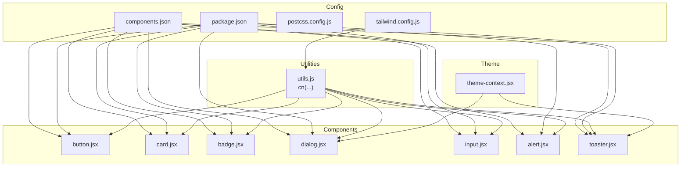

**Diagram sources**
- [components.json:1-21](file://Frontend/components.json#L1-L21)
- [tailwind.config.js:1-120](file://Frontend/tailwind.config.js#L1-L120)
- [postcss.config.js:1-7](file://Frontend/postcss.config.js#L1-L7)
- [package.json:1-92](file://Frontend/package.json#L1-L92)
- [utils.js:1-7](file://Frontend/src/lib/utils.js#L1-L7)
- [button.jsx:1-45](file://Frontend/src/components/ui/button.jsx#L1-L45)
- [card.jsx:1-36](file://Frontend/src/components/ui/card.jsx#L1-L36)
- [badge.jsx:1-28](file://Frontend/src/components/ui/badge.jsx#L1-L28)
- [dialog.jsx:1-84](file://Frontend/src/components/ui/dialog.jsx#L1-L84)
- [input.jsx:1-21](file://Frontend/src/components/ui/input.jsx#L1-L21)
- [alert.jsx:1-37](file://Frontend/src/components/ui/alert.jsx#L1-L37)
- [toaster.jsx:1-25](file://Frontend/src/components/ui/toaster.jsx#L1-L25)
- [theme-context.jsx:1-82](file://Frontend/src/context/theme-context.jsx#L1-L82)

**Section sources**
- [components.json:1-21](file://Frontend/components.json#L1-L21)
- [tailwind.config.js:1-120](file://Frontend/tailwind.config.js#L1-L120)
- [postcss.config.js:1-7](file://Frontend/postcss.config.js#L1-L7)
- [package.json:1-92](file://Frontend/package.json#L1-L92)

## Core Components
This section outlines the design system’s foundational building blocks and how they are composed.

- Utility function for class merging
  - Purpose: Merge conflicting Tailwind classes deterministically while preserving user-provided overrides.
  - Implementation: Uses clsx for conditionals and tailwind-merge for deduplication.
  - Usage pattern: Wrap component props className with cn(...) to compose base styles with variants and user input.

- Component variants with class-variance-authority (CVA)
  - Pattern: Define a variants object with keys for variant and size, then compose base classes with variant-specific classes.
  - Benefits: Centralized variant logic, consistent defaults, and easy extension.

- Radix UI primitives
  - Pattern: Use forwardRef and spread className to maintain composability and accessibility.
  - Benefits: Accessible ARIA attributes, keyboard navigation, and SSR-safe behavior.

- Theme-aware tokens
  - Pattern: Use CSS variables for colors, radii, and animations; extend Tailwind theme to resolve these variables at build time.
  - Benefits: Consistent design tokens across components and easy theme switching.

Examples of core components:
- Button: Variant and size combinations with gradient and hero options; supports asChild via Radix Slot.
- Card: Semantic sections (header, title, description, content, footer) with consistent spacing and shadows.
- Badge: Lightweight indicator with variant-driven styling.
- Dialog: Overlay, portal, and content with motion and accessibility attributes.
- Input: Text input with focus states and responsive sizing.
- Alert: Variant-driven styling with optional icon placement.
- Toaster: Toast provider and renderer using a shared hook.

**Section sources**
- [utils.js:1-7](file://Frontend/src/lib/utils.js#L1-L7)
- [button.jsx:1-45](file://Frontend/src/components/ui/button.jsx#L1-L45)
- [card.jsx:1-36](file://Frontend/src/components/ui/card.jsx#L1-L36)
- [badge.jsx:1-28](file://Frontend/src/components/ui/badge.jsx#L1-L28)
- [dialog.jsx:1-84](file://Frontend/src/components/ui/dialog.jsx#L1-L84)
- [input.jsx:1-21](file://Frontend/src/components/ui/input.jsx#L1-L21)
- [alert.jsx:1-37](file://Frontend/src/components/ui/alert.jsx#L1-L37)
- [toaster.jsx:1-25](file://Frontend/src/components/ui/toaster.jsx#L1-L25)

## Architecture Overview
The design system architecture integrates configuration, utilities, components, and theme management into a cohesive system.

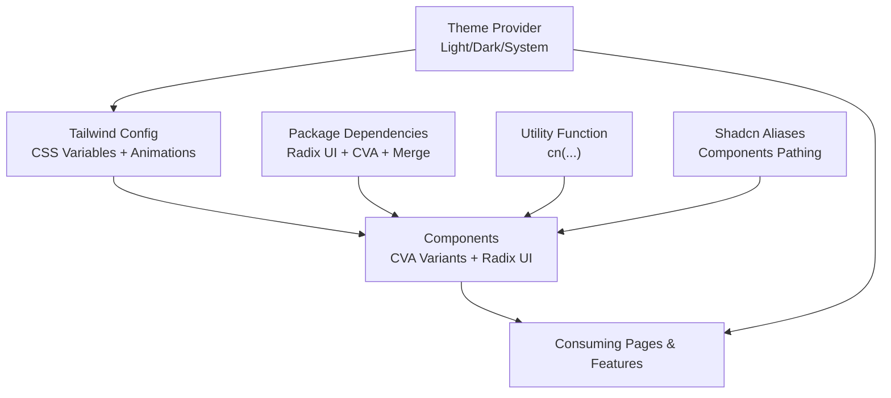

**Diagram sources**
- [tailwind.config.js:1-120](file://Frontend/tailwind.config.js#L1-L120)
- [package.json:1-92](file://Frontend/package.json#L1-L92)
- [utils.js:1-7](file://Frontend/src/lib/utils.js#L1-L7)
- [theme-context.jsx:1-82](file://Frontend/src/context/theme-context.jsx#L1-L82)
- [components.json:1-21](file://Frontend/components.json#L1-L21)

## Detailed Component Analysis

### Button Component
- Composition pattern: Accepts variant and size props, merges with user className, and supports asChild for semantic rendering.
- Styling strategy: Base styles plus variant-specific backgrounds, borders, and shadows; transitions and focus-visible rings.
- Accessibility: Inherits focus-visible ring behavior from base styles; supports SVG children with pointer-events reset.

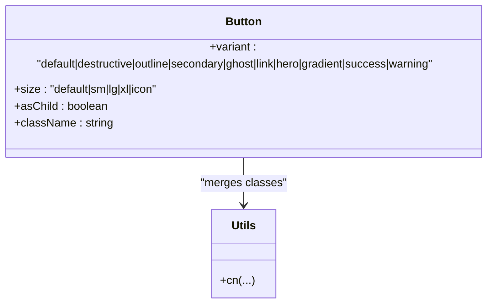

**Diagram sources**
- [button.jsx:1-45](file://Frontend/src/components/ui/button.jsx#L1-L45)
- [utils.js:1-7](file://Frontend/src/lib/utils.js#L1-L7)

**Section sources**
- [button.jsx:1-45](file://Frontend/src/components/ui/button.jsx#L1-L45)

### Card Component Family
- Composition pattern: Header, Title, Description, Content, Footer subcomponents with consistent spacing and typography.
- Styling strategy: Rounded corners, border, and card background tokens; header spacing and content padding.
- Accessibility: No explicit ARIA roles; relies on semantic HTML structure.

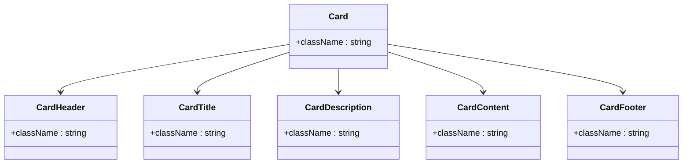

**Diagram sources**
- [card.jsx:1-36](file://Frontend/src/components/ui/card.jsx#L1-L36)

**Section sources**
- [card.jsx:1-36](file://Frontend/src/components/ui/card.jsx#L1-L36)

### Badge Component
- Composition pattern: Lightweight indicator with variant-driven styling.
- Styling strategy: Borderless backgrounds with foreground text; outline variant for contrast scenarios.

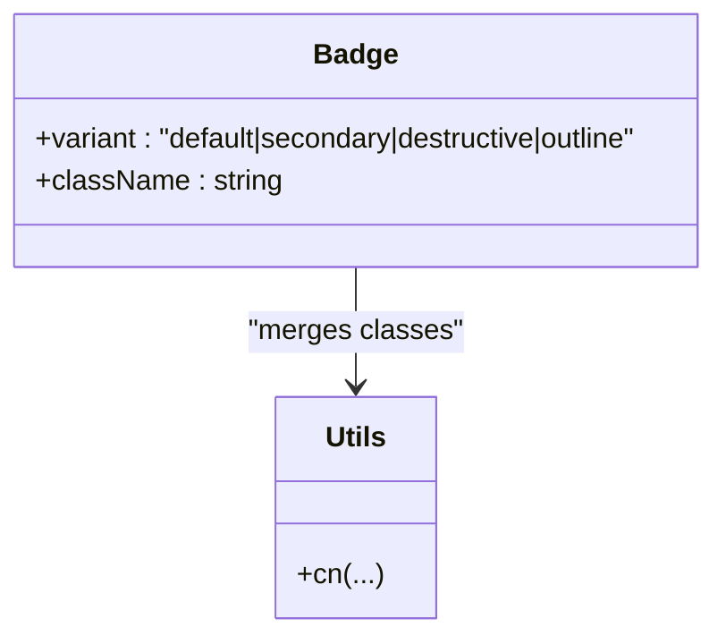

**Diagram sources**
- [badge.jsx:1-28](file://Frontend/src/components/ui/badge.jsx#L1-L28)
- [utils.js:1-7](file://Frontend/src/lib/utils.js#L1-L7)

**Section sources**
- [badge.jsx:1-28](file://Frontend/src/components/ui/badge.jsx#L1-L28)

### Dialog Component Family
- Composition pattern: Root, Trigger, Portal, Overlay, Close, and Content; Header/Footer/Title/Description helpers.
- Styling strategy: Overlay with backdrop blur effect; content with motion classes and responsive breakpoints; close button with focus-visible ring.
- Accessibility: Uses Radix UI primitives for ARIA attributes and keyboard handling; includes sr-only text for close button.

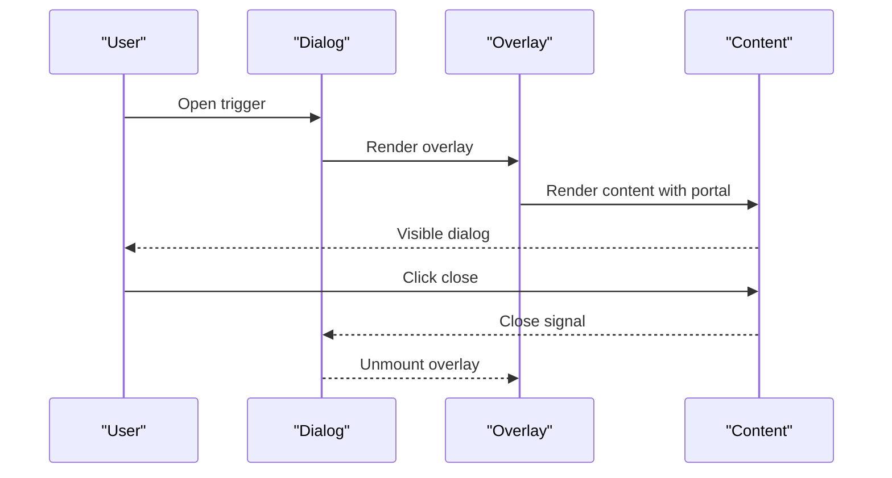

**Diagram sources**
- [dialog.jsx:1-84](file://Frontend/src/components/ui/dialog.jsx#L1-L84)

**Section sources**
- [dialog.jsx:1-84](file://Frontend/src/components/ui/dialog.jsx#L1-L84)

### Input Component
- Composition pattern: ForwardRef wrapper with className merging and controlled props.
- Styling strategy: Responsive padding and ring focus states; placeholder and file input resets.

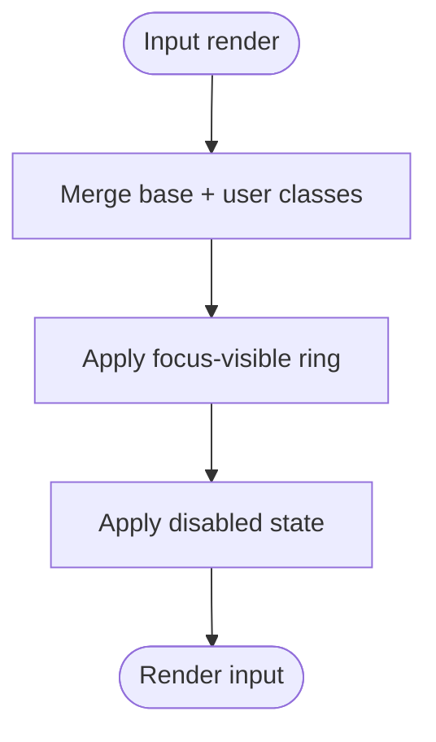

**Diagram sources**
- [input.jsx:1-21](file://Frontend/src/components/ui/input.jsx#L1-L21)
- [utils.js:1-7](file://Frontend/src/lib/utils.js#L1-L7)

**Section sources**
- [input.jsx:1-21](file://Frontend/src/components/ui/input.jsx#L1-L21)

### Alert Component
- Composition pattern: Variant-driven styling with optional icon placement and description container.
- Styling strategy: Relative positioning, icon placement helpers, and destructive variant color overrides.

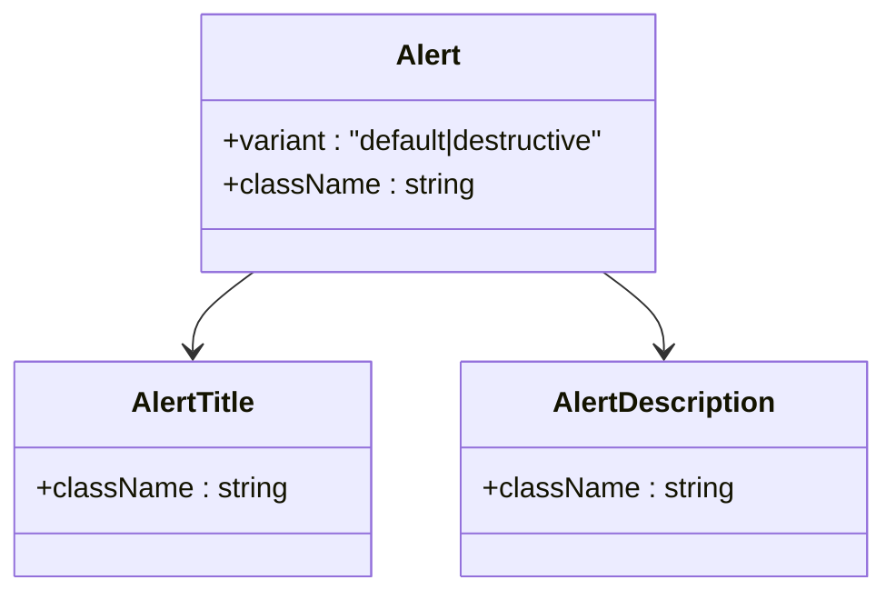

**Diagram sources**
- [alert.jsx:1-37](file://Frontend/src/components/ui/alert.jsx#L1-L37)

**Section sources**
- [alert.jsx:1-37](file://Frontend/src/components/ui/alert.jsx#L1-L37)

### Toaster Component
- Composition pattern: Consumes a shared toast hook and renders a list of toasts with optional actions.
- Styling strategy: Grid layout for title and description; viewport for stacking.

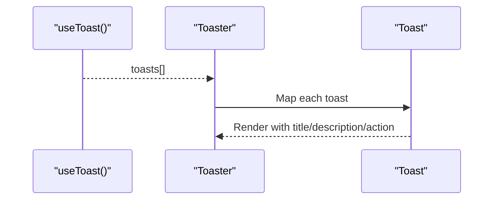

**Diagram sources**
- [toaster.jsx:1-25](file://Frontend/src/components/ui/toaster.jsx#L1-L25)

**Section sources**
- [toaster.jsx:1-25](file://Frontend/src/components/ui/toaster.jsx#L1-L25)

### Theme Provider
- Composition pattern: Context provider with localStorage persistence and system preference detection.
- Styling strategy: Adds light/dark class to root element; updates on theme change and system preference updates.

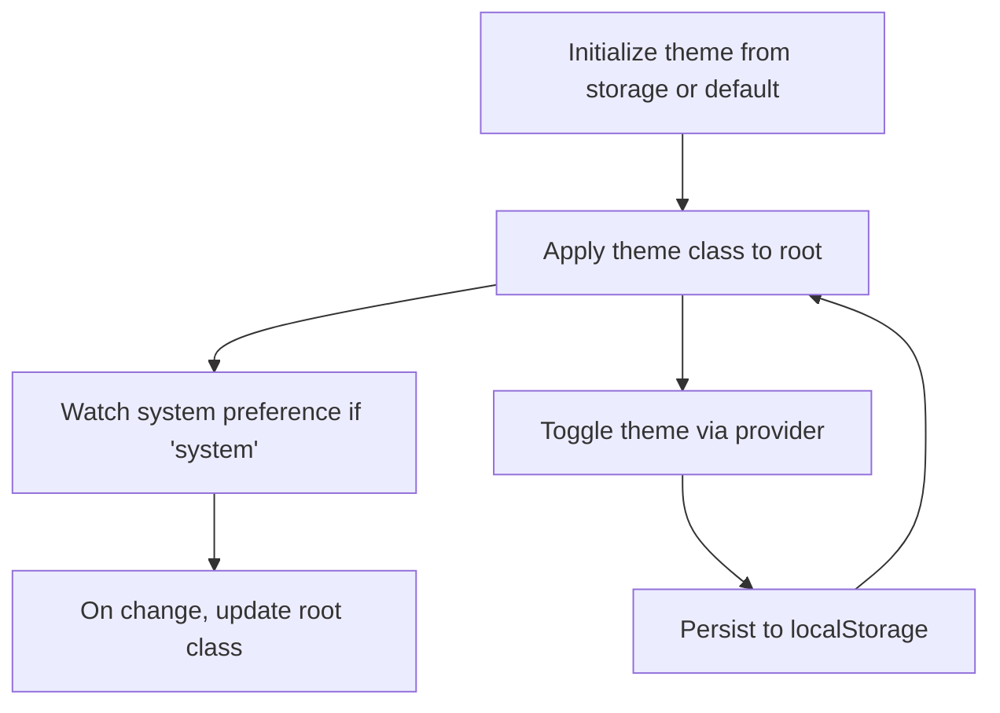

**Diagram sources**
- [theme-context.jsx:1-82](file://Frontend/src/context/theme-context.jsx#L1-L82)

**Section sources**
- [theme-context.jsx:1-82](file://Frontend/src/context/theme-context.jsx#L1-L82)

## Dependency Analysis
The design system depends on:
- Tailwind CSS for utility classes and CSS variables
- Radix UI for accessible base components
- class-variance-authority for variant composition
- tailwind-merge and clsx for safe class merging
- PostCSS for build-time processing

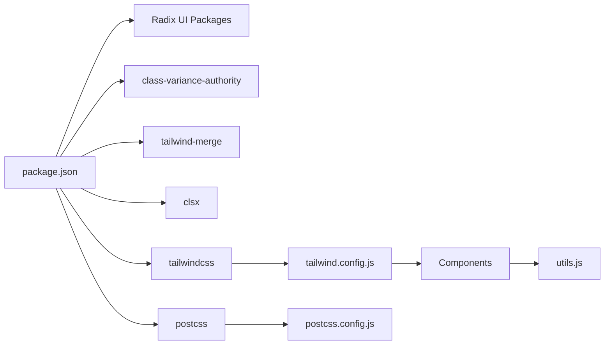

**Diagram sources**
- [package.json:1-92](file://Frontend/package.json#L1-L92)
- [tailwind.config.js:1-120](file://Frontend/tailwind.config.js#L1-L120)
- [postcss.config.js:1-7](file://Frontend/postcss.config.js#L1-L7)
- [utils.js:1-7](file://Frontend/src/lib/utils.js#L1-L7)

**Section sources**
- [package.json:1-92](file://Frontend/package.json#L1-L92)
- [tailwind.config.js:1-120](file://Frontend/tailwind.config.js#L1-L120)
- [postcss.config.js:1-7](file://Frontend/postcss.config.js#L1-L7)

## Performance Considerations
- Prefer variant props over inline styles to leverage CSS variables and reduce reflows.
- Use the utility function for class merging to avoid redundant classes and keep DOM sizes small.
- Keep component variants minimal to reduce CSS bundle size; group similar variants when possible.
- Use responsive utilities sparingly; favor component-level responsive props where appropriate.

## Troubleshooting Guide
- Classes not applying as expected
  - Ensure cn(...) is used to merge base and variant classes.
  - Verify Tailwind is scanning the correct paths and CSS variables are defined.

- Theme not switching
  - Confirm the theme provider is wrapping the app and the root element receives light/dark classes.
  - Check localStorage persistence and system preference listeners.

- Dialog not closing or focus issues
  - Ensure the close button is inside the DialogPrimitive.Content and that portals are rendered.

- Toasts not appearing
  - Verify the Toaster component is mounted and the useToast hook is called.

**Section sources**
- [utils.js:1-7](file://Frontend/src/lib/utils.js#L1-L7)
- [theme-context.jsx:1-82](file://Frontend/src/context/theme-context.jsx#L1-L82)
- [dialog.jsx:1-84](file://Frontend/src/components/ui/dialog.jsx#L1-L84)
- [toaster.jsx:1-25](file://Frontend/src/components/ui/toaster.jsx#L1-L25)

## Conclusion
The design system combines shadcn/ui-style components with Radix UI primitives, CSS variables for theme tokens, and a robust utility layer for class composition. This enables consistent, accessible, and extensible UI across the application. By following the documented patterns and guidelines, teams can extend the system with new components and variants while maintaining design consistency.

## Appendices

### Design Tokens and Theme Integration
- Color scheme
  - Base tokens: background, foreground, border, ring
  - Semantic tokens: primary, secondary, destructive, muted, accent, success, warning, popover, card
  - Dark mode support via CSS variables and class toggling

- Typography
  - Headings and body text use consistent font weights and line heights; adjust via component-level classes

- Spacing and radius
  - Container padding and responsive screens; border radius tokens mapped to CSS variables

- Motion and effects
  - Keyframes and animations for accordion, fade-in, slide-in-right, pulse-glow; applied via component classes

**Section sources**
- [tailwind.config.js:1-120](file://Frontend/tailwind.config.js#L1-L120)
- [theme-context.jsx:1-82](file://Frontend/src/context/theme-context.jsx#L1-L82)

### Component Customization Guidelines
- Extend variants using class-variance-authority
  - Add new variant keys and values to existing variant objects
  - Keep variant names descriptive and scoped to component intent

- Compose classes safely
  - Always pass className through the utility function to prevent conflicts

- Preserve accessibility
  - Use Radix UI primitives and forward refs
  - Maintain focus-visible rings and ARIA attributes

- Responsive design
  - Use Tailwind responsive prefixes on component props or wrappers
  - Avoid excessive responsive utilities; prefer component-level props when feasible

- Accessibility compliance
  - Ensure focus management and keyboard navigation
  - Provide visible focus indicators and screen-reader-friendly labels

**Section sources**
- [button.jsx:1-45](file://Frontend/src/components/ui/button.jsx#L1-L45)
- [dialog.jsx:1-84](file://Frontend/src/components/ui/dialog.jsx#L1-L84)
- [input.jsx:1-21](file://Frontend/src/components/ui/input.jsx#L1-L21)
- [alert.jsx:1-37](file://Frontend/src/components/ui/alert.jsx#L1-L37)
- [utils.js:1-7](file://Frontend/src/lib/utils.js#L1-L7)

### Shadcn/UI Setup and Aliases
- Schema and style
  - JSON schema validates component library configuration
  - Style defaults and TSX usage enabled

- Tailwind integration
  - CSS variables enabled; base color set to slate
  - Aliases for components, utils, ui, lib, and hooks

**Section sources**
- [components.json:1-21](file://Frontend/components.json#L1-L21)
- [tailwind.config.js:1-120](file://Frontend/tailwind.config.js#L1-L120)

### Example: Extending the Design System
- Create a new component variant
  - Define variant options in the component’s variant object
  - Use the utility function to merge base and variant classes
  - Test with the theme provider and responsive breakpoints

- Add a new component
  - Place under the UI directory with a .jsx/.tsx file
  - Use Radix UI primitives and forwardRef
  - Export variants and default props consistently

- Integrate with theme tokens
  - Reference CSS variables for colors and radii
  - Ensure animations and transitions are defined in the Tailwind config

**Section sources**
- [button.jsx:1-45](file://Frontend/src/components/ui/button.jsx#L1-L45)
- [card.jsx:1-36](file://Frontend/src/components/ui/card.jsx#L1-L36)
- [badge.jsx:1-28](file://Frontend/src/components/ui/badge.jsx#L1-L28)
- [dialog.jsx:1-84](file://Frontend/src/components/ui/dialog.jsx#L1-L84)
- [input.jsx:1-21](file://Frontend/src/components/ui/input.jsx#L1-L21)
- [alert.jsx:1-37](file://Frontend/src/components/ui/alert.jsx#L1-L37)
- [utils.js:1-7](file://Frontend/src/lib/utils.js#L1-L7)
- [tailwind.config.js:1-120](file://Frontend/tailwind.config.js#L1-L120)