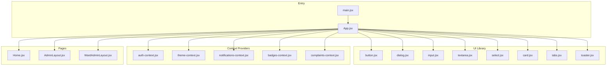
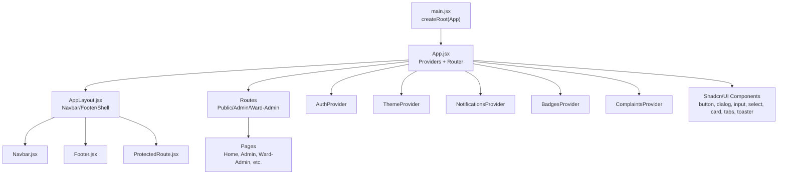
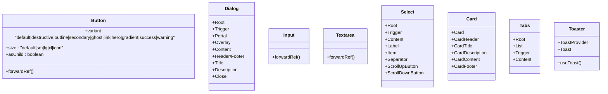
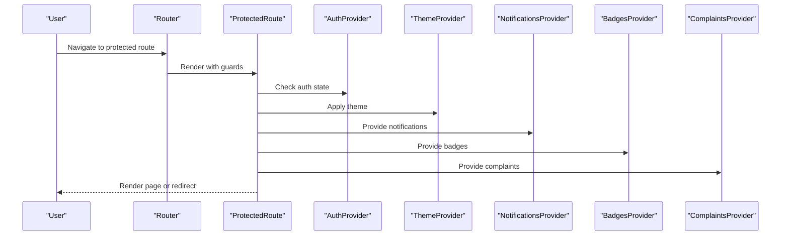
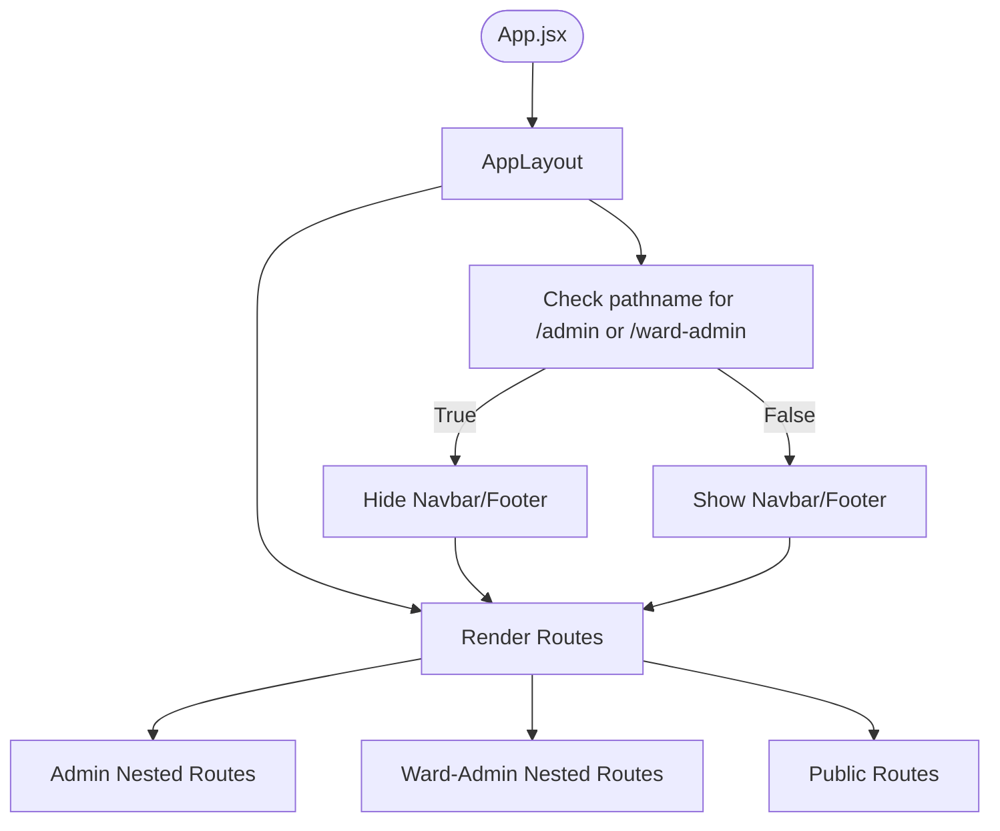
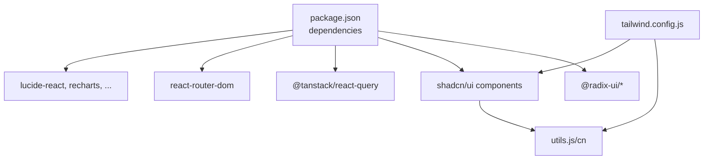

# Frontend Component Architecture

<cite>
**Referenced Files in This Document**
- [App.jsx](file://Frontend/src/App.jsx)
- [main.jsx](file://Frontend/src/main.jsx)
- [components.json](file://Frontend/components.json)
- [tailwind.config.js](file://Frontend/tailwind.config.js)
- [package.json](file://Frontend/package.json)
- [utils.js](file://Frontend/src/lib/utils.js)
- [button.jsx](file://Frontend/src/components/ui/button.jsx)
- [dialog.jsx](file://Frontend/src/components/ui/dialog.jsx)
- [input.jsx](file://Frontend/src/components/ui/input.jsx)
- [card.jsx](file://Frontend/src/components/ui/card.jsx)
- [tabs.jsx](file://Frontend/src/components/ui/tabs.jsx)
- [textarea.jsx](file://Frontend/src/components/ui/textarea.jsx)
- [select.jsx](file://Frontend/src/components/ui/select.jsx)
- [toaster.jsx](file://Frontend/src/components/ui/toaster.jsx)
- [Navbar.jsx](file://Frontend/src/components/Navbar.jsx)
- [Footer.jsx](file://Frontend/src/components/Footer.jsx)
- [ProtectedRoute.jsx](file://Frontend/src/components/ProtectedRoute.jsx)
- [Home.jsx](file://Frontend/src/pages/Home.jsx)
- [AdminLayout.jsx](file://Frontend/src/pages/AdminLayout.jsx)
- [WardAdminLayout.jsx](file://Frontend/src/pages/WardAdminLayout.jsx)
- [auth-context.jsx](file://Frontend/src/context/auth-context.jsx)
- [theme-context.jsx](file://Frontend/src/context/theme-context.jsx)
- [notifications-context.jsx](file://Frontend/src/context/notifications-context.jsx)
- [badges-context.jsx](file://Frontend/src/context/badges-context.jsx)
- [complaints-context.jsx](file://Frontend/src/context/complaints-context.jsx)
- [use-toast.js](file://Frontend/src/hooks/use-toast.js)
- [use-toast.ts](file://Frontend/src/hooks/use-toast.ts)
- [use-mobile.jsx](file://Frontend/src/hooks/use-mobile.jsx)
- [useMobileOptimization.js](file://Frontend/src/hooks/useMobileOptimization.js)
- [useNotificationPreferences.js](file://Frontend/src/hooks/useNotificationPreferences.js)
- [useNotificationSound.js](file://Frontend/src/hooks/useNotificationSound.js)
- [usePushNotifications.js](file://Frontend/src/hooks/usePushNotifications.js)
- [useUpvoteBadges.js](file://Frontend/src/hooks/useUpvoteBadges.js)
- [EnhancedVoiceInput.jsx](file://Frontend/src/components/voice/EnhancedVoiceInput.jsx)
- [VoiceFormControl.jsx](file://Frontend/src/components/voice/VoiceFormControl.jsx)
- [VoiceNavigation.jsx](file://Frontend/src/components/voice/VoiceNavigation.jsx)
- [VoiceResponse.jsx](file://Frontend/src/components/voice/VoiceResponse.jsx)
- [VoiceSearch.jsx](file://Frontend/src/components/voice/VoiceSearch.jsx)
- [AIComplaintAnalyzer.jsx](file://Frontend/src/components/ai/AIComplaintAnalyzer.jsx)
- [SentimentAnalyzer.jsx](file://Frontend/src/components/ai/SentimentAnalyzer.jsx)
- [AdvancedAnalytics.jsx](file://Frontend/src/components/analytics/AdvancedAnalytics.jsx)
- [GeographicHeatmap.jsx](file://Frontend/src/components/analytics/GeographicHeatmap.jsx)
- [TrendChart.jsx](file://Frontend/src/components/analytics/TrendChart.jsx)
- [EnhancedAnalyticsDashboard.jsx](file://Frontend/src/components/analytics-advanced/EnhancedAnalyticsDashboard.jsx)
- [DashboardBuilder.jsx](file://Frontend/src/components/analytics-advanced/DashboardBuilder.jsx)
- [PatternInsights.jsx](file://Frontend/src/components/analytics-advanced/PatternInsights.jsx)
- [ChallengeBoard.jsx](file://Frontend/src/components/engagement/ChallengeBoard.jsx)
- [StreakWidget.jsx](file://Frontend/src/components/engagement/StreakWidget.jsx)
- [OfflineIndicator.jsx](file://Frontend/src/components/mobile/OfflineIndicator.jsx)
- [PWAInstallPrompt.jsx](file://Frontend/src/components/mobile/PWAInstallPrompt.jsx)
- [HeroSection.jsx](file://Frontend/src/components/HeroSection.jsx)
- [FeaturesSection.jsx](file://Frontend/src/components/FeaturesSection.jsx)
- [Leaderboard.jsx](file://Frontend/src/components/Leaderboard.jsx)
- [LoadingSkeleton.jsx](file://Frontend/src/components/LoadingSkeleton.jsx)
- [RippleButton.jsx](file://Frontend/src/components/RippleButton.jsx)
- [StarRating.jsx](file://Frontend/src/components/StarRating.jsx)
- [ThemeToggle.jsx](file://Frontend/src/components/ThemeToggle.jsx)
- [NotificationCenter.jsx](file://Frontend/src/components/NotificationCenter.jsx)
- [PageTransition.jsx](file://Frontend/src/components/PageTransition.jsx)
- [ParticleBackground.jsx](file://Frontend/src/components/ParticleBackground.jsx)
- [HoverEffects.jsx](file://Frontend/src/components/HoverEffects.jsx)
- [ScrollReveal.jsx](file://Frontend/src/components/ScrollReveal.jsx)
- [ServicesSlider.jsx](file://Frontend/src/components/ServicesSlider.jsx)
- [TrendingIssues.jsx](file://Frontend/src/components/TrendingIssues.jsx)
- [UpvoteButton.jsx](file://Frontend/src/components/UpvoteButton.jsx)
- [VoiceInput.jsx](file://Frontend/src/components/VoiceInput.jsx)
- [BadgeDisplay.jsx](file://Frontend/src/components/BadgeDisplay.jsx)
- [BadgeUnlockModal.jsx](file://Frontend/src/components/BadgeUnlockModal.jsx)
- [BadgesSection.jsx](file://Frontend/src/components/BadgesSection.jsx)
- [ConfettiEffect.jsx](file://Frontend/src/components/ConfettiEffect.jsx)
- [FeedbackDisplay.jsx](file://Frontend/src/components/FeedbackDisplay.jsx)
- [FeedbackModal.jsx](file://Frontend/src/components/FeedbackModal.jsx)
- [FeedbackPrompt.jsx](file://Frontend/src/components/FeedbackPrompt.jsx)
- [FeedbackSummaryCard.jsx](file://Frontend/src/components/FeedbackSummaryCard.jsx)
- [RankChangeAnimation.jsx](file://Frontend/src/components/RankChangeAnimation.jsx)
- [AIChatbot.jsx](file://Frontend/src/components/AIChatbot.jsx)
- [AdminSidebar.jsx](file://Frontend/src/components/AdminSidebar.jsx)
- [WardAdminSidebar.jsx](file://Frontend/src/components/WardAdminSidebar.jsx)
</cite>

## Table of Contents
1. [Introduction](#introduction)
2. [Project Structure](#project-structure)
3. [Core Components](#core-components)
4. [Architecture Overview](#architecture-overview)
5. [Detailed Component Analysis](#detailed-component-analysis)
6. [Dependency Analysis](#dependency-analysis)
7. [Performance Considerations](#performance-considerations)
8. [Troubleshooting Guide](#troubleshooting-guide)
9. [Conclusion](#conclusion)
10. [Appendices](#appendices)

## Introduction
This document describes the frontend component architecture of the Smart Voice Report application. It focuses on the React component system, the integration of the shadcn/ui component library, custom component development, and styling strategies using Tailwind CSS. It explains component composition patterns, prop interfaces, state management integration via React contexts, and UI patterns for buttons, dialogs, forms, and navigation. It also covers page component architecture, layout systems, responsive design, reusability patterns, accessibility compliance, and performance optimization techniques.

## Project Structure
The frontend is organized around a clear separation of concerns:
- Application bootstrap and routing live in the root entry file.
- UI primitives and composite components are under a dedicated UI module.
- Feature-specific components are grouped by domain (analytics, voice, engagement, mobile).
- Pages are organized by route and role (admin, ward-admin, public).
- State management is centralized through React contexts.
- Styling leverages Tailwind CSS with a shared utility function for merging classes.

**Diagram sources**
- [main.jsx:1-24](file://Frontend/src/main.jsx#L1-L24)
- [App.jsx:83-216](file://Frontend/src/App.jsx#L83-L216)
- [button.jsx:1-45](file://Frontend/src/components/ui/button.jsx#L1-L45)
- [dialog.jsx:1-84](file://Frontend/src/components/ui/dialog.jsx#L1-L84)
- [input.jsx:1-21](file://Frontend/src/components/ui/input.jsx#L1-L21)
- [textarea.jsx:1-20](file://Frontend/src/components/ui/textarea.jsx#L1-L20)
- [select.jsx:1-123](file://Frontend/src/components/ui/select.jsx#L1-L123)
- [card.jsx:1-36](file://Frontend/src/components/ui/card.jsx#L1-L36)
- [tabs.jsx:1-45](file://Frontend/src/components/ui/tabs.jsx#L1-L45)
- [toaster.jsx:1-25](file://Frontend/src/components/ui/toaster.jsx#L1-L25)
- [auth-context.jsx](file://Frontend/src/context/auth-context.jsx)
- [theme-context.jsx](file://Frontend/src/context/theme-context.jsx)
- [notifications-context.jsx](file://Frontend/src/context/notifications-context.jsx)
- [badges-context.jsx](file://Frontend/src/context/badges-context.jsx)
- [complaints-context.jsx](file://Frontend/src/context/complaints-context.jsx)
- [Home.jsx](file://Frontend/src/pages/Home.jsx)
- [AdminLayout.jsx](file://Frontend/src/pages/AdminLayout.jsx)
- [WardAdminLayout.jsx](file://Frontend/src/pages/WardAdminLayout.jsx)

**Section sources**
- [main.jsx:1-24](file://Frontend/src/main.jsx#L1-L24)
- [App.jsx:83-216](file://Frontend/src/App.jsx#L83-L216)

## Core Components
This section documents the foundational building blocks and their roles in the component system.

- Shadcn/ui primitives and composite components:
  - Button: Provides variant and size variants with forwardRef support and slot composition.
  - Dialog: Implements overlay, portal, content, header/footer, title, and description.
  - Input and Textarea: Styled base form controls with consistent focus states.
  - Select: Complex dropdown with scroll areas, labels, items, and icons.
  - Card: Semantic card layout with header, title, description, content, footer.
  - Tabs: List, trigger, and content wrappers with active state styling.
  - Toaster: Toast provider and renderer using a toast hook.

- Utility function:
  - cn: Merges Tailwind classes safely using clsx and tailwind-merge.

- Styling configuration:
  - Tailwind configuration extends colors, radii, keyframes, and animations.
  - Dark mode is controlled via class strategy.
  - Content paths include pages, components, app, and src.

- Package dependencies:
  - Radix UI primitives, shadcn/ui components, TanStack Query, react-router-dom, and UI libraries.

**Section sources**
- [button.jsx:1-45](file://Frontend/src/components/ui/button.jsx#L1-L45)
- [dialog.jsx:1-84](file://Frontend/src/components/ui/dialog.jsx#L1-L84)
- [input.jsx:1-21](file://Frontend/src/components/ui/input.jsx#L1-L21)
- [textarea.jsx:1-20](file://Frontend/src/components/ui/textarea.jsx#L1-L20)
- [select.jsx:1-123](file://Frontend/src/components/ui/select.jsx#L1-L123)
- [card.jsx:1-36](file://Frontend/src/components/ui/card.jsx#L1-L36)
- [tabs.jsx:1-45](file://Frontend/src/components/ui/tabs.jsx#L1-L45)
- [toaster.jsx:1-25](file://Frontend/src/components/ui/toaster.jsx#L1-L25)
- [utils.js:1-7](file://Frontend/src/lib/utils.js#L1-L7)
- [tailwind.config.js:1-120](file://Frontend/tailwind.config.js#L1-L120)
- [package.json:13-71](file://Frontend/package.json#L13-L71)

## Architecture Overview
The application bootstraps via the root entry, wires providers, and renders routes. The AppLayout composes the shell (navbar, main content, footer) while conditionally hiding these elements for admin routes. ProtectedRoute wraps sensitive routes. Providers supply authentication, theme, notifications, badges, and complaints state. UI components are imported from the local shadcn/ui module.

**Diagram sources**
- [main.jsx:1-24](file://Frontend/src/main.jsx#L1-L24)
- [App.jsx:83-216](file://Frontend/src/App.jsx#L83-L216)
- [App.jsx:56-81](file://Frontend/src/App.jsx#L56-L81)
- [ProtectedRoute.jsx](file://Frontend/src/components/ProtectedRoute.jsx)
- [Navbar.jsx](file://Frontend/src/components/Navbar.jsx)
- [Footer.jsx](file://Frontend/src/components/Footer.jsx)
- [button.jsx:1-45](file://Frontend/src/components/ui/button.jsx#L1-L45)
- [dialog.jsx:1-84](file://Frontend/src/components/ui/dialog.jsx#L1-L84)
- [input.jsx:1-21](file://Frontend/src/components/ui/input.jsx#L1-L21)
- [select.jsx:1-123](file://Frontend/src/components/ui/select.jsx#L1-L123)
- [card.jsx:1-36](file://Frontend/src/components/ui/card.jsx#L1-L36)
- [tabs.jsx:1-45](file://Frontend/src/components/ui/tabs.jsx#L1-L45)
- [toaster.jsx:1-25](file://Frontend/src/components/ui/toaster.jsx#L1-L25)

## Detailed Component Analysis

### Shadcn/UI Component Library Integration
The UI library is implemented locally under components/ui and follows shadcn conventions:
- Variants and sizes are defined via class variance authority (CVA) for components like Button.
- Forward refs and slots enable composition and semantic markup.
- Consistent styling uses the shared cn utility and Tailwind configuration.

**Diagram sources**
- [button.jsx:38-42](file://Frontend/src/components/ui/button.jsx#L38-L42)
- [dialog.jsx:7-46](file://Frontend/src/components/ui/dialog.jsx#L7-L46)
- [input.jsx:5-17](file://Frontend/src/components/ui/input.jsx#L5-L17)
- [textarea.jsx:5-16](file://Frontend/src/components/ui/textarea.jsx#L5-L16)
- [select.jsx:7-122](file://Frontend/src/components/ui/select.jsx#L7-L122)
- [card.jsx:5-34](file://Frontend/src/components/ui/card.jsx#L5-L34)
- [tabs.jsx:6-42](file://Frontend/src/components/ui/tabs.jsx#L6-L42)
- [toaster.jsx:4-24](file://Frontend/src/components/ui/toaster.jsx#L4-L24)

**Section sources**
- [button.jsx:1-45](file://Frontend/src/components/ui/button.jsx#L1-L45)
- [dialog.jsx:1-84](file://Frontend/src/components/ui/dialog.jsx#L1-L84)
- [input.jsx:1-21](file://Frontend/src/components/ui/input.jsx#L1-L21)
- [textarea.jsx:1-20](file://Frontend/src/components/ui/textarea.jsx#L1-L20)
- [select.jsx:1-123](file://Frontend/src/components/ui/select.jsx#L1-L123)
- [card.jsx:1-36](file://Frontend/src/components/ui/card.jsx#L1-L36)
- [tabs.jsx:1-45](file://Frontend/src/components/ui/tabs.jsx#L1-L45)
- [toaster.jsx:1-25](file://Frontend/src/components/ui/toaster.jsx#L1-L25)

### Component Composition Patterns and Prop Interfaces
- Button
  - Props: variant, size, asChild, className, and native button attributes.
  - Composition: Uses Slot for asChild to wrap links or custom elements.
- Dialog
  - Props: Overlay, Content, Header/Footer, Title/Description, Close.
  - Composition: Portal renders content outside DOM hierarchy; overlay animates in/out.
- Input/Textarea/Select
  - Props: className, type/value onChange/disabled, radix props.
  - Composition: Controlled via React refs; focus-visible outlines and ring styles applied.
- Card/Tabs/Toaster
  - Props: className and primitive-specific attributes.
  - Composition: Semantic wrappers for consistent spacing and typography.

**Section sources**
- [button.jsx:38-42](file://Frontend/src/components/ui/button.jsx#L38-L42)
- [dialog.jsx:27-46](file://Frontend/src/components/ui/dialog.jsx#L27-L46)
- [input.jsx:5-17](file://Frontend/src/components/ui/input.jsx#L5-L17)
- [textarea.jsx:5-16](file://Frontend/src/components/ui/textarea.jsx#L5-L16)
- [select.jsx:13-78](file://Frontend/src/components/ui/select.jsx#L13-L78)
- [card.jsx:5-34](file://Frontend/src/components/ui/card.jsx#L5-L34)
- [tabs.jsx:8-42](file://Frontend/src/components/ui/tabs.jsx#L8-L42)
- [toaster.jsx:4-24](file://Frontend/src/components/ui/toaster.jsx#L4-L24)

### State Management Integration
Providers wrap the application to supply global state:
- AuthProvider: Manages authentication state and tokens.
- ThemeProvider: Controls theme preference persistence and switching.
- NotificationsProvider: Centralizes notification state and preferences.
- BadgesProvider: Tracks user badges and unlock events.
- ComplaintsProvider: Manages complaint-related state and lists.

ProtectedRoute enforces role-based access for admin and ward-admin routes.

**Diagram sources**
- [App.jsx:42-47](file://Frontend/src/App.jsx#L42-L47)
- [ProtectedRoute.jsx](file://Frontend/src/components/ProtectedRoute.jsx)
- [auth-context.jsx](file://Frontend/src/context/auth-context.jsx)
- [theme-context.jsx](file://Frontend/src/context/theme-context.jsx)
- [notifications-context.jsx](file://Frontend/src/context/notifications-context.jsx)
- [badges-context.jsx](file://Frontend/src/context/badges-context.jsx)
- [complaints-context.jsx](file://Frontend/src/context/complaints-context.jsx)

**Section sources**
- [App.jsx:42-47](file://Frontend/src/App.jsx#L42-L47)
- [ProtectedRoute.jsx](file://Frontend/src/components/ProtectedRoute.jsx)

### Page Component Architecture and Layout Systems
- AppLayout hides navbar/footer for admin and ward-admin routes and injects chatbot, modals, and mobile enhancements.
- AdminLayout and WardAdminLayout provide nested layouts for administrative sections.
- Home and other pages are rendered conditionally based on route matching.

**Diagram sources**
- [App.jsx:56-81](file://Frontend/src/App.jsx#L56-L81)
- [App.jsx:103-206](file://Frontend/src/App.jsx#L103-L206)
- [AdminLayout.jsx](file://Frontend/src/pages/AdminLayout.jsx)
- [WardAdminLayout.jsx](file://Frontend/src/pages/WardAdminLayout.jsx)

**Section sources**
- [App.jsx:56-81](file://Frontend/src/App.jsx#L56-L81)
- [App.jsx:103-206](file://Frontend/src/App.jsx#L103-L206)

### Responsive Design Implementation
Tailwind configuration enables responsive breakpoints and animations:
- Container sizing and padding for larger screens.
- Color tokens and border radius variables for consistent design.
- Animations for transitions and interactive states.
- Dark mode via class strategy.

**Section sources**
- [tailwind.config.js:1-120](file://Frontend/tailwind.config.js#L1-L120)

### Accessibility Compliance
- Dialog overlay and close button include screen-reader-friendly labels.
- Focus-visible rings and outlines maintain keyboard navigation visibility.
- Select components provide accessible scrolling and item indicators.
- Proper semantic HTML via Card and Tabs primitives.

**Section sources**
- [dialog.jsx:39-42](file://Frontend/src/components/ui/dialog.jsx#L39-L42)
- [select.jsx:86-103](file://Frontend/src/components/ui/select.jsx#L86-L103)
- [card.jsx:5-34](file://Frontend/src/components/ui/card.jsx#L5-L34)
- [tabs.jsx:20-42](file://Frontend/src/components/ui/tabs.jsx#L20-L42)

### UI Component System: Buttons, Dialogs, Forms, Navigation
- Buttons: Variant and size variants with gradient and hero options; supports asChild for semantic links.
- Dialogs: Full overlay with animated entrance/exit; includes header/footer/title/description.
- Forms: Input, Textarea, Select with consistent focus states and optional scroll areas.
- Navigation: Navbar/Footer provide primary navigation; ProtectedRoute guards routes.

**Section sources**
- [button.jsx:7-36](file://Frontend/src/components/ui/button.jsx#L7-L36)
- [dialog.jsx:15-46](file://Frontend/src/components/ui/dialog.jsx#L15-L46)
- [input.jsx:5-17](file://Frontend/src/components/ui/input.jsx#L5-L17)
- [textarea.jsx:5-16](file://Frontend/src/components/ui/textarea.jsx#L5-L16)
- [select.jsx:13-78](file://Frontend/src/components/ui/select.jsx#L13-L78)
- [Navbar.jsx](file://Frontend/src/components/Navbar.jsx)
- [Footer.jsx](file://Frontend/src/components/Footer.jsx)
- [ProtectedRoute.jsx](file://Frontend/src/components/ProtectedRoute.jsx)

### Component Reusability Patterns
- Local shadcn/ui module centralizes UI primitives for reuse across pages and domains.
- Utility function cn ensures consistent class merging across components.
- Context providers encapsulate cross-cutting concerns for reuse in any component subtree.

**Section sources**
- [utils.js:4-6](file://Frontend/src/lib/utils.js#L4-L6)
- [App.jsx:95-213](file://Frontend/src/App.jsx#L95-L213)

### Domain-Specific Components
- Voice: Enhanced voice input, form control, navigation, response handling, and search.
- AI: Complaint analyzer and sentiment analyzer for insights.
- Analytics: Advanced analytics, geographic heatmap, trend charts, and KPI dashboards.
- Engagement: Challenge board and streak widget for gamification.
- Mobile: Offline indicator and PWA install prompt for progressive web app experience.

**Section sources**
- [EnhancedVoiceInput.jsx](file://Frontend/src/components/voice/EnhancedVoiceInput.jsx)
- [VoiceFormControl.jsx](file://Frontend/src/components/voice/VoiceFormControl.jsx)
- [VoiceNavigation.jsx](file://Frontend/src/components/voice/VoiceNavigation.jsx)
- [VoiceResponse.jsx](file://Frontend/src/components/voice/VoiceResponse.jsx)
- [VoiceSearch.jsx](file://Frontend/src/components/voice/VoiceSearch.jsx)
- [AIComplaintAnalyzer.jsx](file://Frontend/src/components/ai/AIComplaintAnalyzer.jsx)
- [SentimentAnalyzer.jsx](file://Frontend/src/components/ai/SentimentAnalyzer.jsx)
- [AdvancedAnalytics.jsx](file://Frontend/src/components/analytics/AdvancedAnalytics.jsx)
- [GeographicHeatmap.jsx](file://Frontend/src/components/analytics/GeographicHeatmap.jsx)
- [TrendChart.jsx](file://Frontend/src/components/analytics/TrendChart.jsx)
- [EnhancedAnalyticsDashboard.jsx](file://Frontend/src/components/analytics-advanced/EnhancedAnalyticsDashboard.jsx)
- [DashboardBuilder.jsx](file://Frontend/src/components/analytics-advanced/DashboardBuilder.jsx)
- [PatternInsights.jsx](file://Frontend/src/components/analytics-advanced/PatternInsights.jsx)
- [ChallengeBoard.jsx](file://Frontend/src/components/engagement/ChallengeBoard.jsx)
- [StreakWidget.jsx](file://Frontend/src/components/engagement/StreakWidget.jsx)
- [OfflineIndicator.jsx](file://Frontend/src/components/mobile/OfflineIndicator.jsx)
- [PWAInstallPrompt.jsx](file://Frontend/src/components/mobile/PWAInstallPrompt.jsx)

### Additional UI Elements and Effects
- HeroSection, FeaturesSection, Leaderboard, LoadingSkeleton, RippleButton, StarRating, ThemeToggle, NotificationCenter, PageTransition, ParticleBackground, HoverEffects, ScrollReveal, ServicesSlider, TrendingIssues, UpvoteButton, VoiceInput, BadgeDisplay, BadgeUnlockModal, BadgesSection, ConfettiEffect, FeedbackDisplay, FeedbackModal, FeedbackPrompt, FeedbackSummaryCard, RankChangeAnimation, AIChatbot, AdminSidebar, WardAdminSidebar.

**Section sources**
- [HeroSection.jsx](file://Frontend/src/components/HeroSection.jsx)
- [FeaturesSection.jsx](file://Frontend/src/components/FeaturesSection.jsx)
- [Leaderboard.jsx](file://Frontend/src/components/Leaderboard.jsx)
- [LoadingSkeleton.jsx](file://Frontend/src/components/LoadingSkeleton.jsx)
- [RippleButton.jsx](file://Frontend/src/components/RippleButton.jsx)
- [StarRating.jsx](file://Frontend/src/components/StarRating.jsx)
- [ThemeToggle.jsx](file://Frontend/src/components/ThemeToggle.jsx)
- [NotificationCenter.jsx](file://Frontend/src/components/NotificationCenter.jsx)
- [PageTransition.jsx](file://Frontend/src/components/PageTransition.jsx)
- [ParticleBackground.jsx](file://Frontend/src/components/ParticleBackground.jsx)
- [HoverEffects.jsx](file://Frontend/src/components/HoverEffects.jsx)
- [ScrollReveal.jsx](file://Frontend/src/components/ScrollReveal.jsx)
- [ServicesSlider.jsx](file://Frontend/src/components/ServicesSlider.jsx)
- [TrendingIssues.jsx](file://Frontend/src/components/TrendingIssues.jsx)
- [UpvoteButton.jsx](file://Frontend/src/components/UpvoteButton.jsx)
- [VoiceInput.jsx](file://Frontend/src/components/VoiceInput.jsx)
- [BadgeDisplay.jsx](file://Frontend/src/components/BadgeDisplay.jsx)
- [BadgeUnlockModal.jsx](file://Frontend/src/components/BadgeUnlockModal.jsx)
- [BadgesSection.jsx](file://Frontend/src/components/BadgesSection.jsx)
- [ConfettiEffect.jsx](file://Frontend/src/components/ConfettiEffect.jsx)
- [FeedbackDisplay.jsx](file://Frontend/src/components/FeedbackDisplay.jsx)
- [FeedbackModal.jsx](file://Frontend/src/components/FeedbackModal.jsx)
- [FeedbackPrompt.jsx](file://Frontend/src/components/FeedbackPrompt.jsx)
- [FeedbackSummaryCard.jsx](file://Frontend/src/components/FeedbackSummaryCard.jsx)
- [RankChangeAnimation.jsx](file://Frontend/src/components/RankChangeAnimation.jsx)
- [AIChatbot.jsx](file://Frontend/src/components/AIChatbot.jsx)
- [AdminSidebar.jsx](file://Frontend/src/components/AdminSidebar.jsx)
- [WardAdminSidebar.jsx](file://Frontend/src/components/WardAdminSidebar.jsx)

## Dependency Analysis
The frontend depends on a set of UI and state management libraries. The UI layer relies on Radix UI primitives and shadcn/ui components. Styling is powered by Tailwind with animations and typography plugins. State management is handled via React contexts and TanStack Query.

**Diagram sources**
- [package.json:13-71](file://Frontend/package.json#L13-L71)
- [tailwind.config.js:1-120](file://Frontend/tailwind.config.js#L1-L120)
- [utils.js:4-6](file://Frontend/src/lib/utils.js#L4-L6)

**Section sources**
- [package.json:13-71](file://Frontend/package.json#L13-L71)
- [tailwind.config.js:1-120](file://Frontend/tailwind.config.js#L1-L120)
- [utils.js:4-6](file://Frontend/src/lib/utils.js#L4-L6)

## Performance Considerations
- Lazy loading: Consider lazy-loading heavy pages and analytics components to reduce initial bundle size.
- Virtualization: For long lists (leaderboard, complaints), use virtualized lists to improve rendering performance.
- Memoization: Wrap expensive computations and components with memoization to avoid unnecessary re-renders.
- Animations: Prefer hardware-accelerated CSS properties and limit heavy JavaScript-driven animations.
- Bundle analysis: Regularly audit bundle size and remove unused dependencies.

## Troubleshooting Guide
- Global error handling: The root entry sets global error handlers for uncaught errors and promise rejections to aid debugging.
- Toast notifications: Toaster integrates with a toast hook to surface runtime messages.
- Protected routes: Ensure authentication and role checks are correctly configured to prevent unauthorized access.

**Section sources**
- [main.jsx:5-13](file://Frontend/src/main.jsx#L5-L13)
- [toaster.jsx:1-25](file://Frontend/src/components/ui/toaster.jsx#L1-L25)
- [ProtectedRoute.jsx](file://Frontend/src/components/ProtectedRoute.jsx)

## Conclusion
The frontend employs a modular, shadcn/ui-aligned component architecture with strong styling via Tailwind CSS and robust state management through React contexts. The system emphasizes composability, accessibility, and reusability, enabling rapid development of complex UIs across public, admin, and ward-admin experiences. By leveraging Radix UI primitives, CVA-based variants, and a unified utility for class merging, the component system remains consistent, maintainable, and extensible.

## Appendices
- shadcn configuration: The components.json file defines aliases and Tailwind integration for the UI library.
- Hooks: A collection of reusable hooks supports mobile optimization, notifications, push notifications, and upvote badges.

**Section sources**
- [components.json:1-21](file://Frontend/components.json#L1-L21)
- [use-mobile.jsx](file://Frontend/src/hooks/use-mobile.jsx)
- [useMobileOptimization.js](file://Frontend/src/hooks/useMobileOptimization.js)
- [useNotificationPreferences.js](file://Frontend/src/hooks/useNotificationPreferences.js)
- [useNotificationSound.js](file://Frontend/src/hooks/useNotificationSound.js)
- [usePushNotifications.js](file://Frontend/src/hooks/usePushNotifications.js)
- [useUpvoteBadges.js](file://Frontend/src/hooks/useUpvoteBadges.js)
- [use-toast.js](file://Frontend/src/hooks/use-toast.js)
- [use-toast.ts](file://Frontend/src/hooks/use-toast.ts)