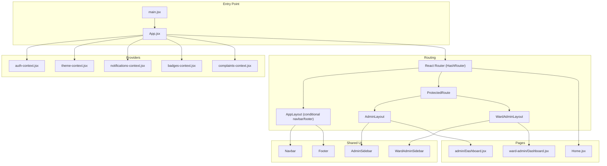
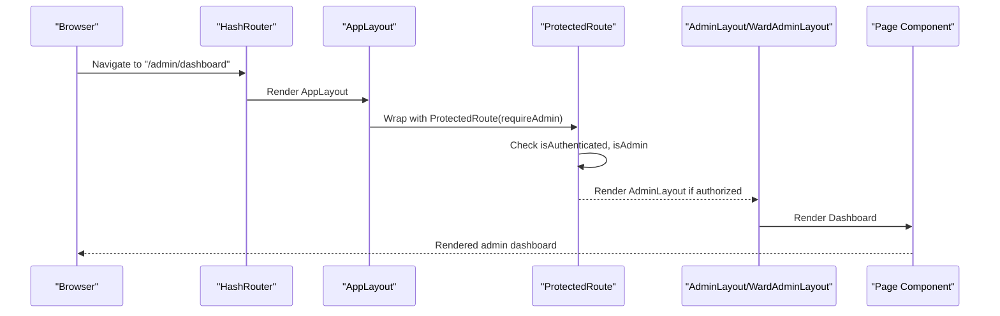
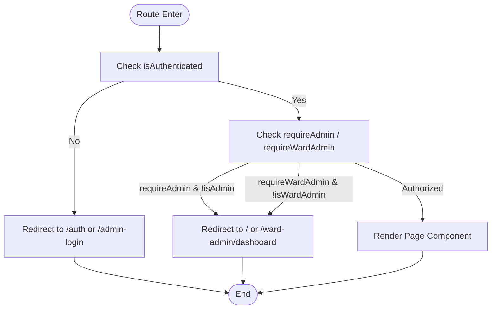
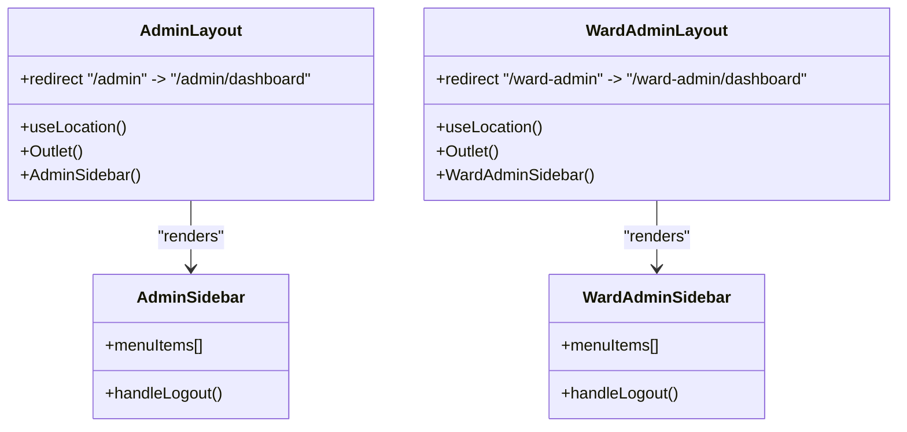
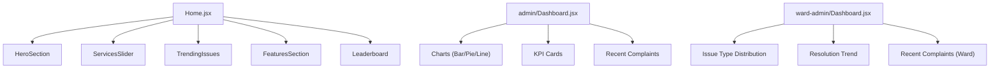
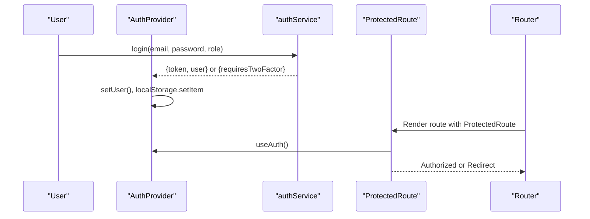
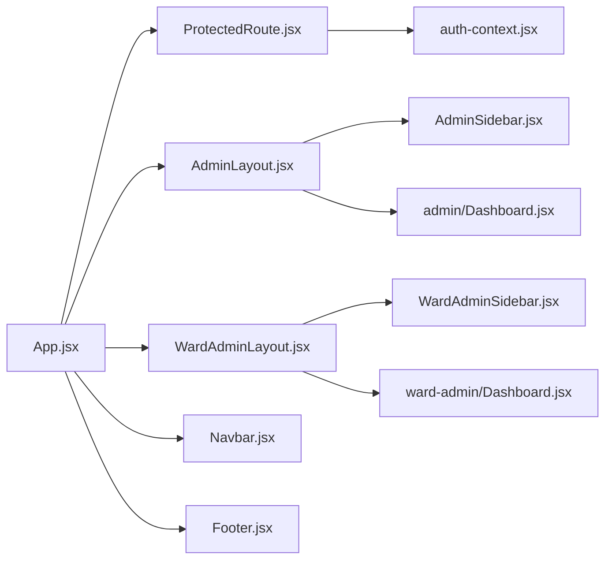

# Page Components & Layout System

<cite>
**Referenced Files in This Document**
- [App.jsx](file://Frontend/src/App.jsx)
- [main.jsx](file://Frontend/src/main.jsx)
- [ProtectedRoute.jsx](file://Frontend/src/components/ProtectedRoute.jsx)
- [auth-context.jsx](file://Frontend/src/context/auth-context.jsx)
- [authService.js](file://Frontend/src/services/authService.js)
- [AdminLayout.jsx](file://Frontend/src/pages/AdminLayout.jsx)
- [WardAdminLayout.jsx](file://Frontend/src/pages/WardAdminLayout.jsx)
- [AdminSidebar.jsx](file://Frontend/src/components/AdminSidebar.jsx)
- [WardAdminSidebar.jsx](file://Frontend/src/components/WardAdminSidebar.jsx)
- [Navbar.jsx](file://Frontend/src/components/Navbar.jsx)
- [Footer.jsx](file://Frontend/src/components/Footer.jsx)
- [Home.jsx](file://Frontend/src/pages/Home.jsx)
- [Dashboard.jsx](file://Frontend/src/pages/admin/Dashboard.jsx)
- [ward-admin/Dashboard.jsx](file://Frontend/src/pages/ward-admin/Dashboard.jsx)
- [use-mobile.jsx](file://Frontend/src/hooks/use-mobile.jsx)
</cite>

## Table of Contents
1. [Introduction](#introduction)
2. [Project Structure](#project-structure)
3. [Core Components](#core-components)
4. [Architecture Overview](#architecture-overview)
5. [Detailed Component Analysis](#detailed-component-analysis)
6. [Dependency Analysis](#dependency-analysis)
7. [Performance Considerations](#performance-considerations)
8. [Troubleshooting Guide](#troubleshooting-guide)
9. [Conclusion](#conclusion)
10. [Appendices](#appendices)

## Introduction
This document explains the page components and layout system architecture for the SmartCity Portal frontend. It covers React Router-based routing, protected routes with role-aware guards, and layout composition patterns. It documents the main application layout with conditional navigation and footer rendering, administrative layouts for super admin and ward admin interfaces, and the page component hierarchy. It also includes responsive design patterns, layout switching logic, and practical examples for creating new page components, implementing route protection, and managing layout variations for different user types.

## Project Structure
The frontend is organized around a central App shell that composes providers, routing, and shared UI. Pages are grouped under feature-based directories, and reusable components are placed under a shared components directory. Providers encapsulate cross-cutting concerns like authentication, theme, notifications, and badges.

**Diagram sources**
- [main.jsx:1-24](file://Frontend/src/main.jsx#L1-L24)
- [App.jsx:83-216](file://Frontend/src/App.jsx#L83-L216)
- [auth-context.jsx:6-134](file://Frontend/src/context/auth-context.jsx#L6-L134)

**Section sources**
- [main.jsx:1-24](file://Frontend/src/main.jsx#L1-L24)
- [App.jsx:83-216](file://Frontend/src/App.jsx#L83-L216)

## Core Components
- App shell and providers: The root App component sets up React Query, theme provider, auth provider, notifications, badges, and complaints providers, then mounts the router and layout.
- AppLayout: A layout wrapper that conditionally hides the navbar and footer for admin and ward-admin routes, enabling full-bleed dashboards.
- ProtectedRoute: A route guard that checks authentication and role requirements, redirecting appropriately for admin, ward-admin, and regular user routes.
- Authentication context and service: Provides user state, role flags, login/logout, and 2FA integration.
- Layouts and sidebars: AdminLayout and WardAdminLayout wrap nested routes and render role-appropriate sidebars and top bars.
- Shared UI: Navbar adapts menu items and actions based on user role and current route; Footer renders a responsive, animated footer.

**Section sources**
- [App.jsx:56-81](file://Frontend/src/App.jsx#L56-L81)
- [ProtectedRoute.jsx:5-47](file://Frontend/src/components/ProtectedRoute.jsx#L5-L47)
- [auth-context.jsx:6-134](file://Frontend/src/context/auth-context.jsx#L6-L134)
- [authService.js:1-99](file://Frontend/src/services/authService.js#L1-L99)
- [AdminLayout.jsx:58-90](file://Frontend/src/pages/AdminLayout.jsx#L58-L90)
- [WardAdminLayout.jsx:5-36](file://Frontend/src/pages/WardAdminLayout.jsx#L5-L36)
- [AdminSidebar.jsx:178-267](file://Frontend/src/components/AdminSidebar.jsx#L178-L267)
- [WardAdminSidebar.jsx:12-95](file://Frontend/src/components/WardAdminSidebar.jsx#L12-L95)
- [Navbar.jsx:12-308](file://Frontend/src/components/Navbar.jsx#L12-L308)
- [Footer.jsx:6-226](file://Frontend/src/components/Footer.jsx#L6-L226)

## Architecture Overview
The routing architecture uses React Router’s HashRouter to support static hosting. The AppLayout conditionally omits the navbar and footer for admin and ward-admin routes. ProtectedRoute enforces authentication and role checks, redirecting unauthenticated users to login or unauthorized users to appropriate dashboards. AdminLayout and WardAdminLayout provide nested routing for administrative sections, each with a dedicated sidebar and top bar.

**Diagram sources**
- [App.jsx:103-206](file://Frontend/src/App.jsx#L103-L206)
- [ProtectedRoute.jsx:5-47](file://Frontend/src/components/ProtectedRoute.jsx#L5-L47)
- [AdminLayout.jsx:58-90](file://Frontend/src/pages/AdminLayout.jsx#L58-L90)

**Section sources**
- [App.jsx:103-206](file://Frontend/src/App.jsx#L103-L206)
- [ProtectedRoute.jsx:5-47](file://Frontend/src/components/ProtectedRoute.jsx#L5-L47)
- [AdminLayout.jsx:58-90](file://Frontend/src/pages/AdminLayout.jsx#L58-L90)
- [WardAdminLayout.jsx:5-36](file://Frontend/src/pages/WardAdminLayout.jsx#L5-L36)

## Detailed Component Analysis

### Routing and Protected Routes
- Route definitions: The App component defines public and protected routes, including nested routes for admin and ward-admin sections.
- Conditional layout: AppLayout hides navbar and footer for admin and ward-admin routes to maximize dashboard real estate.
- Role enforcement: ProtectedRoute checks authentication and enforces requireAdmin or requireWardAdmin flags. It redirects unauthenticated users to login, and unauthorized roles to appropriate dashboards.

**Diagram sources**
- [ProtectedRoute.jsx:5-47](file://Frontend/src/components/ProtectedRoute.jsx#L5-L47)
- [App.jsx:103-206](file://Frontend/src/App.jsx#L103-L206)

**Section sources**
- [App.jsx:103-206](file://Frontend/src/App.jsx#L103-L206)
- [ProtectedRoute.jsx:5-47](file://Frontend/src/components/ProtectedRoute.jsx#L5-L47)

### Main Application Layout and Conditional Rendering
- AppLayout wraps all routes and conditionally hides navbar and footer for admin and ward-admin paths.
- It injects shared UI elements like AI chatbot, badge unlock modal, feedback prompt, offline indicator, and PWA install prompt for non-admin routes.
- This pattern ensures a clean, distraction-free admin experience while preserving user-facing features elsewhere.

**Section sources**
- [App.jsx:56-81](file://Frontend/src/App.jsx#L56-L81)

### Administrative Layouts and Sidebars
- AdminLayout:
  - Redirects bare /admin to /admin/dashboard.
  - Renders AdminSidebar and outlet for nested admin routes.
  - Uses a top bar and fixed sidebar with menu items for admin functions.
- WardAdminLayout:
  - Redirects bare /ward-admin to /ward-admin/dashboard.
  - Renders WardAdminSidebar and outlet for ward admin routes.
  - Provides quick links to home, services, and public pages in the top bar.

**Diagram sources**
- [AdminLayout.jsx:58-90](file://Frontend/src/pages/AdminLayout.jsx#L58-L90)
- [WardAdminLayout.jsx:5-36](file://Frontend/src/pages/WardAdminLayout.jsx#L5-L36)
- [AdminSidebar.jsx:178-267](file://Frontend/src/components/AdminSidebar.jsx#L178-L267)
- [WardAdminSidebar.jsx:12-95](file://Frontend/src/components/WardAdminSidebar.jsx#L12-L95)

**Section sources**
- [AdminLayout.jsx:58-90](file://Frontend/src/pages/AdminLayout.jsx#L58-L90)
- [WardAdminLayout.jsx:5-36](file://Frontend/src/pages/WardAdminLayout.jsx#L5-L36)
- [AdminSidebar.jsx:178-267](file://Frontend/src/components/AdminSidebar.jsx#L178-L267)
- [WardAdminSidebar.jsx:12-95](file://Frontend/src/components/WardAdminSidebar.jsx#L12-L95)

### Page Component Hierarchy
- Home: A composite page composed of hero, services slider, trending issues, features, and leaderboard components.
- Admin Dashboard: A comprehensive analytics dashboard with KPI cards, charts, and recent complaints.
- Ward Admin Dashboard: A focused dashboard for a single ward with localized stats and charts.

**Diagram sources**
- [Home.jsx:7-21](file://Frontend/src/pages/Home.jsx#L7-L21)
- [Dashboard.jsx:206-512](file://Frontend/src/pages/admin/Dashboard.jsx#L206-L512)
- [ward-admin/Dashboard.jsx:179-274](file://Frontend/src/pages/ward-admin/Dashboard.jsx#L179-L274)

**Section sources**
- [Home.jsx:7-21](file://Frontend/src/pages/Home.jsx#L7-L21)
- [Dashboard.jsx:206-512](file://Frontend/src/pages/admin/Dashboard.jsx#L206-L512)
- [ward-admin/Dashboard.jsx:179-274](file://Frontend/src/pages/ward-admin/Dashboard.jsx#L179-L274)

### Authentication Integration
- AuthProvider initializes user state from local storage, exposes role flags (isAdmin, isWardAdmin, isManagement), and handles sign-in/sign-out.
- ProtectedRoute consumes useAuth to enforce access policies.
- authService abstracts API calls for registration, login, and logout, persisting tokens and user data.

**Diagram sources**
- [auth-context.jsx:6-134](file://Frontend/src/context/auth-context.jsx#L6-L134)
- [authService.js:37-99](file://Frontend/src/services/authService.js#L37-L99)
- [ProtectedRoute.jsx:5-47](file://Frontend/src/components/ProtectedRoute.jsx#L5-L47)

**Section sources**
- [auth-context.jsx:6-134](file://Frontend/src/context/auth-context.jsx#L6-L134)
- [authService.js:37-99](file://Frontend/src/services/authService.js#L37-L99)
- [ProtectedRoute.jsx:5-47](file://Frontend/src/components/ProtectedRoute.jsx#L5-L47)

### Responsive Design Patterns and Mobile-First Approach
- useIsMobile hook detects mobile breakpoints to adapt UI behavior.
- Navbar implements a responsive mobile menu with animated transitions.
- Footer uses Framer Motion for staggered animations and a back-to-top button.
- Layouts avoid fixed widths and use Tailwind utilities to remain responsive within admin contexts.

**Section sources**
- [use-mobile.jsx:1-20](file://Frontend/src/hooks/use-mobile.jsx#L1-L20)
- [Navbar.jsx:12-308](file://Frontend/src/components/Navbar.jsx#L12-L308)
- [Footer.jsx:6-226](file://Frontend/src/components/Footer.jsx#L6-L226)
- [AdminLayout.jsx:58-90](file://Frontend/src/pages/AdminLayout.jsx#L58-L90)
- [WardAdminLayout.jsx:5-36](file://Frontend/src/pages/WardAdminLayout.jsx#L5-L36)

### Creating New Page Components
- Place page components under the pages directory, grouping by feature (e.g., pages/admin/, pages/ward-admin/).
- For protected pages, wrap the component with ProtectedRoute in App.jsx routes.
- For admin or ward-admin sections, define nested routes under AdminLayout or WardAdminLayout.
- Example steps:
  - Create a new page component under pages/my-feature/MyFeaturePage.jsx.
  - Add a route in App.jsx under the appropriate layout (public or protected).
  - If admin-only, nest under AdminLayout; if ward-admin-only, nest under WardAdminLayout.
  - Import and render the component inside the route element.

**Section sources**
- [App.jsx:103-206](file://Frontend/src/App.jsx#L103-L206)

### Implementing Route Protection
- Use ProtectedRoute around page components to enforce authentication.
- For super admin-only routes, pass requireAdmin to ProtectedRoute.
- For ward admin-only routes, pass requireWardAdmin to ProtectedRoute.
- ProtectedRoute automatically redirects unauthenticated users to login and unauthorized roles to appropriate dashboards.

**Section sources**
- [ProtectedRoute.jsx:5-47](file://Frontend/src/components/ProtectedRoute.jsx#L5-L47)
- [App.jsx:121-142](file://Frontend/src/App.jsx#L121-L142)
- [App.jsx:181-202](file://Frontend/src/App.jsx#L181-L202)

### Managing Layout Variations for Different User Types
- Admin users: Use AdminLayout with AdminSidebar and admin-specific routes.
- Ward admin users: Use WardAdminLayout with WardAdminSidebar and ward-specific routes.
- Regular users: Use AppLayout with Navbar and Footer; hide them for admin/ward-admin routes via AppLayout logic.
- Role-aware navigation: Navbar adjusts menu items and buttons based on isAuthenticated, isAdmin, and isWardAdmin.

**Section sources**
- [AdminLayout.jsx:58-90](file://Frontend/src/pages/AdminLayout.jsx#L58-L90)
- [WardAdminLayout.jsx:5-36](file://Frontend/src/pages/WardAdminLayout.jsx#L5-L36)
- [App.jsx:56-81](file://Frontend/src/App.jsx#L56-L81)
- [Navbar.jsx:12-308](file://Frontend/src/components/Navbar.jsx#L12-L308)

## Dependency Analysis
The routing and layout system exhibits clear separation of concerns:
- App.jsx orchestrates providers and routes.
- ProtectedRoute depends on auth-context for role checks.
- Layouts depend on sidebars and react-router’s Outlet.
- Pages depend on shared UI components and services.

**Diagram sources**
- [App.jsx:83-216](file://Frontend/src/App.jsx#L83-L216)
- [ProtectedRoute.jsx:5-47](file://Frontend/src/components/ProtectedRoute.jsx#L5-L47)
- [AdminLayout.jsx:58-90](file://Frontend/src/pages/AdminLayout.jsx#L58-L90)
- [WardAdminLayout.jsx:5-36](file://Frontend/src/pages/WardAdminLayout.jsx#L5-L36)
- [AdminSidebar.jsx:178-267](file://Frontend/src/components/AdminSidebar.jsx#L178-L267)
- [WardAdminSidebar.jsx:12-95](file://Frontend/src/components/WardAdminSidebar.jsx#L12-L95)
- [auth-context.jsx:6-134](file://Frontend/src/context/auth-context.jsx#L6-L134)

**Section sources**
- [App.jsx:83-216](file://Frontend/src/App.jsx#L83-L216)
- [ProtectedRoute.jsx:5-47](file://Frontend/src/components/ProtectedRoute.jsx#L5-L47)
- [AdminLayout.jsx:58-90](file://Frontend/src/pages/AdminLayout.jsx#L58-L90)
- [WardAdminLayout.jsx:5-36](file://Frontend/src/pages/WardAdminLayout.jsx#L5-L36)
- [AdminSidebar.jsx:178-267](file://Frontend/src/components/AdminSidebar.jsx#L178-L267)
- [WardAdminSidebar.jsx:12-95](file://Frontend/src/components/WardAdminSidebar.jsx#L12-L95)
- [auth-context.jsx:6-134](file://Frontend/src/context/auth-context.jsx#L6-L134)

## Performance Considerations
- Provider initialization order: Keep providers near the root to minimize re-renders and ensure context availability.
- Conditional layout rendering: AppLayout’s conditional navbar/footer reduces DOM overhead for admin dashboards.
- ProtectedRoute lazy loading: Consider code-splitting for heavy page components to defer bundle size.
- Charts and analytics: Dashboard components fetch data on mount; cache or debounce refresh actions to reduce network calls.

## Troubleshooting Guide
- Authentication issues:
  - Verify tokens and user persistence in localStorage via authService and AuthProvider.
  - Check useAuth flags (isAuthenticated, isAdmin, isWardAdmin) to confirm role resolution.
- Route protection errors:
  - Ensure ProtectedRoute receives correct props (requireAdmin, requireWardAdmin).
  - Confirm redirects target valid login or dashboard routes.
- Layout problems:
  - Admin/ward-admin routes should redirect to index when bare; verify nested routes are defined.
  - AppLayout hiding logic should match route prefixes for admin and ward-admin paths.

**Section sources**
- [authService.js:82-99](file://Frontend/src/services/authService.js#L82-L99)
- [auth-context.jsx:99-102](file://Frontend/src/context/auth-context.jsx#L99-L102)
- [ProtectedRoute.jsx:17-41](file://Frontend/src/components/ProtectedRoute.jsx#L17-L41)
- [AdminLayout.jsx:75-77](file://Frontend/src/pages/AdminLayout.jsx#L75-L77)
- [WardAdminLayout.jsx:19-21](file://Frontend/src/pages/WardAdminLayout.jsx#L19-L21)
- [App.jsx:58](file://Frontend/src/App.jsx#L58)

## Conclusion
The layout and routing system cleanly separates concerns, enforces role-based access, and provides flexible, responsive layouts for different user types. ProtectedRoute and AppLayout form the backbone of access control and UI composition, while AdminLayout and WardAdminLayout deliver focused experiences for administrators. Following the patterns documented here enables consistent development of new pages, robust route protection, and scalable layout variations.

## Appendices
- Example: Adding a new admin-only page
  - Create the page component under pages/admin/MyAdminPage.jsx.
  - Add a route under AdminLayout in App.jsx.
  - Wrap with ProtectedRoute and requireAdmin.
- Example: Adding a new ward-admin page
  - Create the page component under pages/ward-admin/MyWardPage.jsx.
  - Add a route under WardAdminLayout in App.jsx.
  - Wrap with ProtectedRoute and requireWardAdmin.
- Example: Making a page responsive
  - Use useIsMobile to adapt UI behavior.
  - Leverage Tailwind responsive utilities in components.