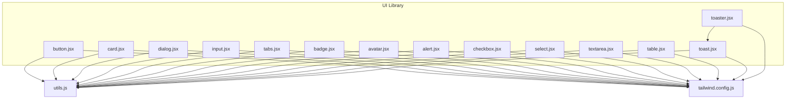
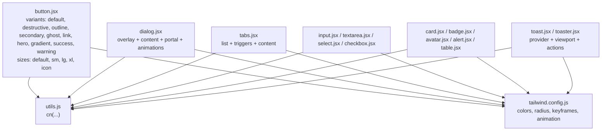
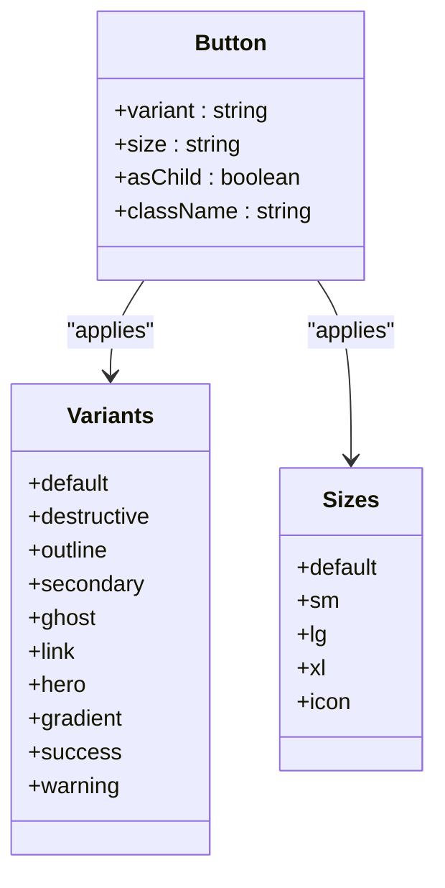
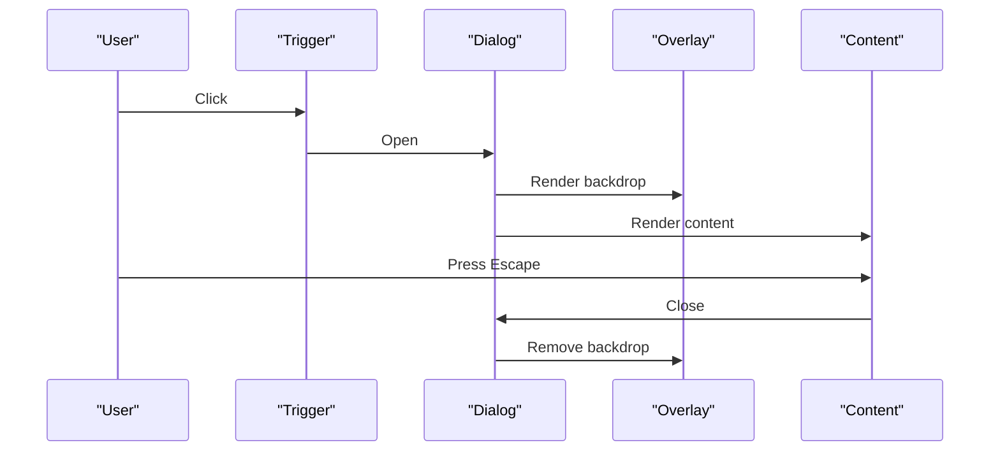
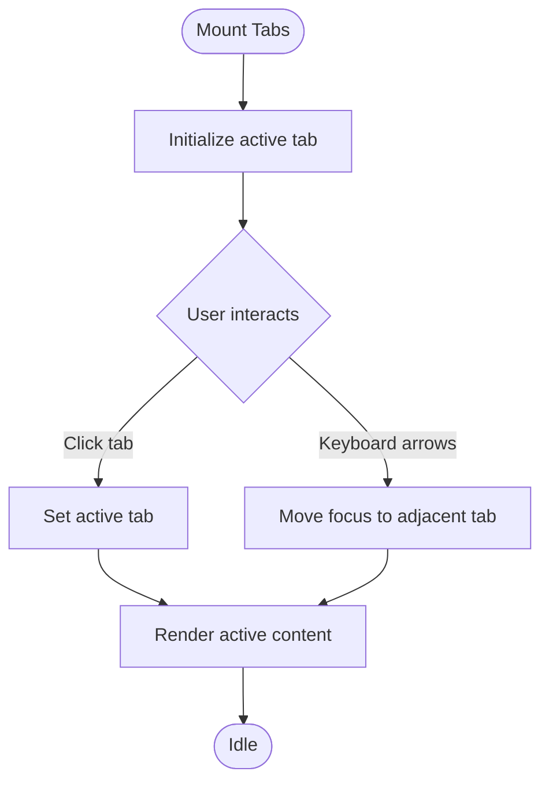
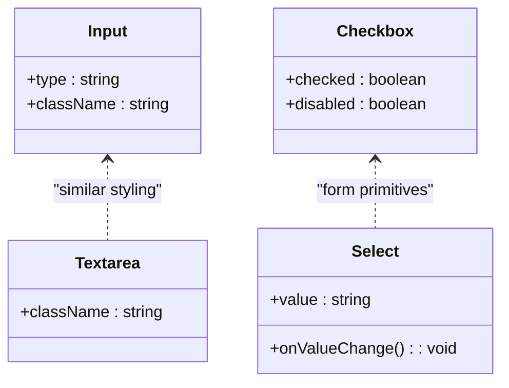
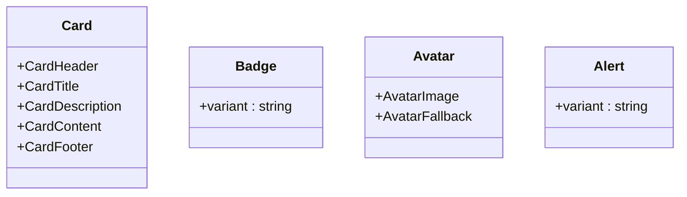
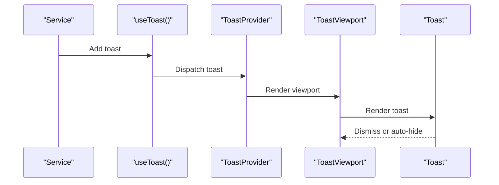
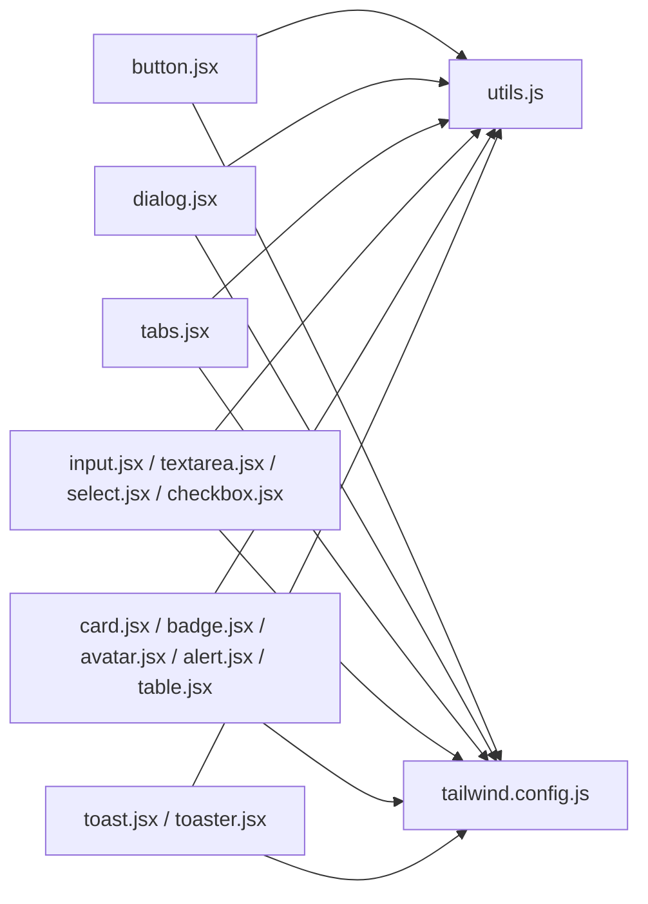

# UI Components & Styling

<cite>
**Referenced Files in This Document**
- [button.jsx](file://Frontend/src/components/ui/button.jsx)
- [card.jsx](file://Frontend/src/components/ui/card.jsx)
- [dialog.jsx](file://Frontend/src/components/ui/dialog.jsx)
- [input.jsx](file://Frontend/src/components/ui/input.jsx)
- [tabs.jsx](file://Frontend/src/components/ui/tabs.jsx)
- [badge.jsx](file://Frontend/src/components/ui/badge.jsx)
- [avatar.jsx](file://Frontend/src/components/ui/avatar.jsx)
- [alert.jsx](file://Frontend/src/components/ui/alert.jsx)
- [checkbox.jsx](file://Frontend/src/components/ui/checkbox.jsx)
- [select.jsx](file://Frontend/src/components/ui/select.jsx)
- [textarea.jsx](file://Frontend/src/components/ui/textarea.jsx)
- [table.jsx](file://Frontend/src/components/ui/table.jsx)
- [toast.jsx](file://Frontend/src/components/ui/toast.jsx)
- [toaster.jsx](file://Frontend/src/components/ui/toaster.jsx)
- [utils.js](file://Frontend/src/lib/utils.js)
- [tailwind.config.js](file://Frontend/tailwind.config.js)
</cite>

## Table of Contents
1. [Introduction](#introduction)
2. [Project Structure](#project-structure)
3. [Core Components](#core-components)
4. [Architecture Overview](#architecture-overview)
5. [Detailed Component Analysis](#detailed-component-analysis)
6. [Dependency Analysis](#dependency-analysis)
7. [Performance Considerations](#performance-considerations)
8. [Troubleshooting Guide](#troubleshooting-guide)
9. [Conclusion](#conclusion)
10. [Appendices](#appendices)

## Introduction
This document provides comprehensive documentation for the UI components and styling implementation used across the application. It covers individual components such as buttons, forms, modals, navigation elements, and interactive components. For each component, we explain props, events, customization options, styling via Tailwind CSS classes, responsive design patterns, and dark/light theme support. Accessibility features, keyboard navigation, and screen reader compatibility are highlighted. We also describe component composition patterns, state management integration, animations, usage examples, best practices, and guidelines for maintaining consistent styling.

## Project Structure
The UI components are organized under a dedicated UI library module. Each component is implemented as a reusable React element with consistent styling and behavior. Utility helpers centralize class merging, while Tailwind CSS configuration defines theme tokens, animations, and responsive breakpoints.

**Diagram sources**
- [button.jsx:1-45](file://Frontend/src/components/ui/button.jsx#L1-L45)
- [card.jsx:1-36](file://Frontend/src/components/ui/card.jsx#L1-L36)
- [dialog.jsx:1-84](file://Frontend/src/components/ui/dialog.jsx#L1-L84)
- [input.jsx:1-21](file://Frontend/src/components/ui/input.jsx#L1-L21)
- [tabs.jsx:1-45](file://Frontend/src/components/ui/tabs.jsx#L1-L45)
- [badge.jsx:1-28](file://Frontend/src/components/ui/badge.jsx#L1-L28)
- [avatar.jsx:1-30](file://Frontend/src/components/ui/avatar.jsx#L1-L30)
- [alert.jsx:1-37](file://Frontend/src/components/ui/alert.jsx#L1-L37)
- [checkbox.jsx:1-24](file://Frontend/src/components/ui/checkbox.jsx#L1-L24)
- [select.jsx:1-123](file://Frontend/src/components/ui/select.jsx#L1-L123)
- [textarea.jsx:1-20](file://Frontend/src/components/ui/textarea.jsx#L1-L20)
- [table.jsx:1-59](file://Frontend/src/components/ui/table.jsx#L1-L59)
- [toast.jsx:1-88](file://Frontend/src/components/ui/toast.jsx#L1-L88)
- [toaster.jsx:1-25](file://Frontend/src/components/ui/toaster.jsx#L1-L25)
- [utils.js:1-7](file://Frontend/src/lib/utils.js#L1-L7)
- [tailwind.config.js:1-120](file://Frontend/tailwind.config.js#L1-L120)

**Section sources**
- [button.jsx:1-45](file://Frontend/src/components/ui/button.jsx#L1-L45)
- [card.jsx:1-36](file://Frontend/src/components/ui/card.jsx#L1-L36)
- [dialog.jsx:1-84](file://Frontend/src/components/ui/dialog.jsx#L1-L84)
- [input.jsx:1-21](file://Frontend/src/components/ui/input.jsx#L1-L21)
- [tabs.jsx:1-45](file://Frontend/src/components/ui/tabs.jsx#L1-L45)
- [badge.jsx:1-28](file://Frontend/src/components/ui/badge.jsx#L1-L28)
- [avatar.jsx:1-30](file://Frontend/src/components/ui/avatar.jsx#L1-L30)
- [alert.jsx:1-37](file://Frontend/src/components/ui/alert.jsx#L1-L37)
- [checkbox.jsx:1-24](file://Frontend/src/components/ui/checkbox.jsx#L1-L24)
- [select.jsx:1-123](file://Frontend/src/components/ui/select.jsx#L1-L123)
- [textarea.jsx:1-20](file://Frontend/src/components/ui/textarea.jsx#L1-L20)
- [table.jsx:1-59](file://Frontend/src/components/ui/table.jsx#L1-L59)
- [toast.jsx:1-88](file://Frontend/src/components/ui/toast.jsx#L1-L88)
- [toaster.jsx:1-25](file://Frontend/src/components/ui/toaster.jsx#L1-L25)
- [utils.js:1-7](file://Frontend/src/lib/utils.js#L1-L7)
- [tailwind.config.js:1-120](file://Frontend/tailwind.config.js#L1-L120)

## Core Components
This section documents the primary UI components and their capabilities.

- Button
  - Purpose: Renders interactive buttons with consistent styling and behavior.
  - Props:
    - variant: Variant selection affecting color and shadow styles.
    - size: Size presets for height, padding, and typography.
    - asChild: Render as a Radix Slot to compose with other elements.
    - Additional standard HTML attributes are passed through.
  - Events: Inherits standard click and keyboard interaction behaviors.
  - Customization: Use variant and size to adapt appearance; pass additional className for overrides.
  - Accessibility: Supports focus-visible outlines and keyboard navigation.
  - Styling: Uses class variance authority (CVA) with Tailwind utilities; includes gradient and hero variants.
  - Animation: Hover effects include scaling and glow transitions.

- Card
  - Purpose: Container component with header, title, description, content, and footer slots.
  - Props: className for each subcomponent; all accept standard HTML attributes.
  - Composition: Compose CardHeader, CardTitle, CardDescription, CardContent, CardFooter as needed.
  - Styling: Uses semantic card colors and shadows; maintains spacing and typography scales.

- Dialog
  - Purpose: Modal overlay with animated content and close controls.
  - Props: Root, Trigger, Portal, Overlay, Content, Header, Footer, Title, Description.
  - Events: Close via Escape key, click outside, or close button; supports portal rendering.
  - Accessibility: Focus trapping, ARIA roles, and screen reader-friendly labels.
  - Styling: Responsive positioning, backdrop overlay with fade and slide animations.

- Input
  - Purpose: Text input field with consistent styling and focus states.
  - Props: type and className; forwards standard input attributes.
  - Styling: Rounded borders, background, placeholder, and focus ring; responsive font sizing.

- Tabs
  - Purpose: Tabbed interface with list, triggers, and content areas.
  - Props: TabsRoot, TabsList, TabsTrigger, TabsContent; active state managed internally.
  - Accessibility: Keyboard navigation (arrow keys), ARIA controls and labels.
  - Styling: Active trigger highlighting and smooth transitions.

- Badge
  - Purpose: Label or indicator with variant styling.
  - Props: variant selection; className for overrides.
  - Styling: Rounded pill shape with border and variant-specific colors.

- Avatar
  - Purpose: User avatar with image and fallback visuals.
  - Props: Avatar, AvatarImage, AvatarFallback; forwards attributes.
  - Styling: Circular layout with overflow hidden; fallback centered.

- Alert
  - Purpose: Notification container with title and description.
  - Props: variant selection; role set to alert for semantics.
  - Styling: Border and background variants; icon placement and spacing.

- Checkbox
  - Purpose: Interactive checkbox with indicator.
  - Props: Inherits primitive attributes; supports checked state.
  - Accessibility: Focus-visible ring and controlled state.
  - Styling: Indicator alignment and check icon.

- Select
  - Purpose: Dropdown selector with scrollable viewport and item interactions.
  - Props: Root, Group, Value, Trigger, Content, Label, Item, Separator, Scroll buttons.
  - Events: Keyboard navigation, scrolling, and selection.
  - Accessibility: ARIA roles and keyboard support.
  - Styling: Animated popper positioning and focus states.

- Textarea
  - Purpose: Multi-line text input with consistent styling.
  - Props: className and forwarded attributes.
  - Styling: Rounded borders, background, placeholder, and focus ring.

- Table
  - Purpose: Scrollable table with header, body, footer, rows, and cells.
  - Props: Table, TableHeader, TableBody, TableFooter, TableRow, TableHead, TableCell, TableCaption.
  - Styling: Borders, hover states, and responsive wrapper.

- Toast
  - Purpose: Notification toast with provider, viewport, and actions.
  - Props: Provider, Viewport, Toast, Title, Description, Action, Close.
  - Events: Swipe gestures, auto-dismiss, and manual close.
  - Accessibility: Screen reader announcements and focus management.
  - Styling: Animations for entering/exiting and destructive variants.

- Toaster
  - Purpose: Renderer for toast notifications using a hook-managed state.
  - Props: None; composes ToastProvider and renders toasts from state.
  - Integration: Consumes useToast hook to manage toast lifecycle.

**Section sources**
- [button.jsx:1-45](file://Frontend/src/components/ui/button.jsx#L1-L45)
- [card.jsx:1-36](file://Frontend/src/components/ui/card.jsx#L1-L36)
- [dialog.jsx:1-84](file://Frontend/src/components/ui/dialog.jsx#L1-L84)
- [input.jsx:1-21](file://Frontend/src/components/ui/input.jsx#L1-L21)
- [tabs.jsx:1-45](file://Frontend/src/components/ui/tabs.jsx#L1-L45)
- [badge.jsx:1-28](file://Frontend/src/components/ui/badge.jsx#L1-L28)
- [avatar.jsx:1-30](file://Frontend/src/components/ui/avatar.jsx#L1-L30)
- [alert.jsx:1-37](file://Frontend/src/components/ui/alert.jsx#L1-L37)
- [checkbox.jsx:1-24](file://Frontend/src/components/ui/checkbox.jsx#L1-L24)
- [select.jsx:1-123](file://Frontend/src/components/ui/select.jsx#L1-L123)
- [textarea.jsx:1-20](file://Frontend/src/components/ui/textarea.jsx#L1-L20)
- [table.jsx:1-59](file://Frontend/src/components/ui/table.jsx#L1-L59)
- [toast.jsx:1-88](file://Frontend/src/components/ui/toast.jsx#L1-L88)
- [toaster.jsx:1-25](file://Frontend/src/components/ui/toaster.jsx#L1-L25)

## Architecture Overview
The UI components follow a consistent pattern:
- Each component exports a forwardRef element with optional variants and sizes.
- Styling is centralized via Tailwind classes and CVA for variant-driven composition.
- Utilities merge classes safely to avoid conflicts.
- Animations and theme tokens are configured globally in Tailwind.

**Diagram sources**
- [utils.js:1-7](file://Frontend/src/lib/utils.js#L1-L7)
- [tailwind.config.js:1-120](file://Frontend/tailwind.config.js#L1-L120)
- [button.jsx:1-45](file://Frontend/src/components/ui/button.jsx#L1-L45)
- [dialog.jsx:1-84](file://Frontend/src/components/ui/dialog.jsx#L1-L84)
- [tabs.jsx:1-45](file://Frontend/src/components/ui/tabs.jsx#L1-L45)
- [input.jsx:1-21](file://Frontend/src/components/ui/input.jsx#L1-L21)
- [textarea.jsx:1-20](file://Frontend/src/components/ui/textarea.jsx#L1-L20)
- [select.jsx:1-123](file://Frontend/src/components/ui/select.jsx#L1-L123)
- [checkbox.jsx:1-24](file://Frontend/src/components/ui/checkbox.jsx#L1-L24)
- [card.jsx:1-36](file://Frontend/src/components/ui/card.jsx#L1-L36)
- [badge.jsx:1-28](file://Frontend/src/components/ui/badge.jsx#L1-L28)
- [avatar.jsx:1-30](file://Frontend/src/components/ui/avatar.jsx#L1-L30)
- [alert.jsx:1-37](file://Frontend/src/components/ui/alert.jsx#L1-L37)
- [table.jsx:1-59](file://Frontend/src/components/ui/table.jsx#L1-L59)
- [toast.jsx:1-88](file://Frontend/src/components/ui/toast.jsx#L1-L88)
- [toaster.jsx:1-25](file://Frontend/src/components/ui/toaster.jsx#L1-L25)

## Detailed Component Analysis

### Button
- Implementation highlights:
  - Uses CVA to define variants and sizes.
  - Supports asChild to render as a slot for composition.
  - Includes focus-visible ring and transition durations.
  - Gradient and hero variants for prominent actions.
- Accessibility:
  - Inherits standard button semantics; supports keyboard activation.
- Styling:
  - Variant classes include background, foreground, and shadow tokens.
  - Size classes adjust height, padding, and text scale.
- Usage patterns:
  - Combine variant and size to match UI context.
  - Use asChild to wrap links or icons.

**Diagram sources**
- [button.jsx:7-36](file://Frontend/src/components/ui/button.jsx#L7-L36)

**Section sources**
- [button.jsx:1-45](file://Frontend/src/components/ui/button.jsx#L1-L45)

### Dialog
- Implementation highlights:
  - Overlay with backdrop blur and fade/slide animations.
  - Portal rendering ensures proper stacking context.
  - Close button includes sr-only label for screen readers.
  - Responsive positioning and max-width constraints.
- Accessibility:
  - Focus trapping via Radix primitives; Escape key support.
  - ARIA roles and modal semantics.
- Styling:
  - Animations for open/close transitions; z-index management.
- Usage patterns:
  - Wrap trigger and content; use DialogTrigger to open programmatically.

**Diagram sources**
- [dialog.jsx:1-84](file://Frontend/src/components/ui/dialog.jsx#L1-L84)

**Section sources**
- [dialog.jsx:1-84](file://Frontend/src/components/ui/dialog.jsx#L1-L84)

### Tabs
- Implementation highlights:
  - List with tab triggers and content area.
  - Active state via data attributes; focus-visible ring.
- Accessibility:
  - Keyboard navigation among tabs; ARIA controls and labels.
- Styling:
  - Smooth transitions for active state; background and shadow tokens.

**Diagram sources**
- [tabs.jsx:1-45](file://Frontend/src/components/ui/tabs.jsx#L1-L45)

**Section sources**
- [tabs.jsx:1-45](file://Frontend/src/components/ui/tabs.jsx#L1-L45)

### Form Controls
- Input
  - Consistent focus ring and placeholder styling; responsive font size.
- Textarea
  - Minimum height and padding; focus ring and disabled state.
- Checkbox
  - Indicator alignment and check icon; focus-visible ring.
- Select
  - Trigger with chevron icon; scroll buttons; viewport with items and separators.
  - Keyboard navigation and selection indicators.

**Diagram sources**
- [input.jsx:1-21](file://Frontend/src/components/ui/input.jsx#L1-L21)
- [textarea.jsx:1-20](file://Frontend/src/components/ui/textarea.jsx#L1-L20)
- [checkbox.jsx:1-24](file://Frontend/src/components/ui/checkbox.jsx#L1-L24)
- [select.jsx:1-123](file://Frontend/src/components/ui/select.jsx#L1-L123)

**Section sources**
- [input.jsx:1-21](file://Frontend/src/components/ui/input.jsx#L1-L21)
- [textarea.jsx:1-20](file://Frontend/src/components/ui/textarea.jsx#L1-L20)
- [checkbox.jsx:1-24](file://Frontend/src/components/ui/checkbox.jsx#L1-L24)
- [select.jsx:1-123](file://Frontend/src/components/ui/select.jsx#L1-L123)

### Surface and Indicators
- Card
  - Header/title/description/content/footer composition.
- Badge
  - Pill-shaped indicator with variant colors.
- Avatar
  - Image with fallback; circular layout.
- Alert
  - Semantic alert with title and description; icon placement.

**Diagram sources**
- [card.jsx:1-36](file://Frontend/src/components/ui/card.jsx#L1-L36)
- [badge.jsx:1-28](file://Frontend/src/components/ui/badge.jsx#L1-L28)
- [avatar.jsx:1-30](file://Frontend/src/components/ui/avatar.jsx#L1-L30)
- [alert.jsx:1-37](file://Frontend/src/components/ui/alert.jsx#L1-L37)

**Section sources**
- [card.jsx:1-36](file://Frontend/src/components/ui/card.jsx#L1-L36)
- [badge.jsx:1-28](file://Frontend/src/components/ui/badge.jsx#L1-L28)
- [avatar.jsx:1-30](file://Frontend/src/components/ui/avatar.jsx#L1-L30)
- [alert.jsx:1-37](file://Frontend/src/components/ui/alert.jsx#L1-L37)

### Notifications
- Toast
  - Provider, viewport, and toast items with actions and close.
  - Animations for swipe and dismissal; destructive variant styling.
- Toaster
  - Renders toasts from state; integrates with useToast hook.

**Diagram sources**
- [toast.jsx:1-88](file://Frontend/src/components/ui/toast.jsx#L1-L88)
- [toaster.jsx:1-25](file://Frontend/src/components/ui/toaster.jsx#L1-L25)

**Section sources**
- [toast.jsx:1-88](file://Frontend/src/components/ui/toast.jsx#L1-L88)
- [toaster.jsx:1-25](file://Frontend/src/components/ui/toaster.jsx#L1-L25)

## Dependency Analysis
- Component dependencies:
  - All components depend on the shared utility function for class merging.
  - Many components rely on Radix UI primitives for accessibility and behavior.
  - Styling depends on Tailwind configuration for theme tokens and animations.
- Coupling and cohesion:
  - Components are cohesive around a single responsibility and loosely coupled via shared utilities.
  - Variants and sizes are defined centrally to maintain consistency.

**Diagram sources**
- [utils.js:1-7](file://Frontend/src/lib/utils.js#L1-L7)
- [tailwind.config.js:1-120](file://Frontend/tailwind.config.js#L1-L120)
- [button.jsx:1-45](file://Frontend/src/components/ui/button.jsx#L1-L45)
- [dialog.jsx:1-84](file://Frontend/src/components/ui/dialog.jsx#L1-L84)
- [tabs.jsx:1-45](file://Frontend/src/components/ui/tabs.jsx#L1-L45)
- [input.jsx:1-21](file://Frontend/src/components/ui/input.jsx#L1-L21)
- [textarea.jsx:1-20](file://Frontend/src/components/ui/textarea.jsx#L1-L20)
- [select.jsx:1-123](file://Frontend/src/components/ui/select.jsx#L1-L123)
- [checkbox.jsx:1-24](file://Frontend/src/components/ui/checkbox.jsx#L1-L24)
- [card.jsx:1-36](file://Frontend/src/components/ui/card.jsx#L1-L36)
- [badge.jsx:1-28](file://Frontend/src/components/ui/badge.jsx#L1-L28)
- [avatar.jsx:1-30](file://Frontend/src/components/ui/avatar.jsx#L1-L30)
- [alert.jsx:1-37](file://Frontend/src/components/ui/alert.jsx#L1-L37)
- [table.jsx:1-59](file://Frontend/src/components/ui/table.jsx#L1-L59)
- [toast.jsx:1-88](file://Frontend/src/components/ui/toast.jsx#L1-L88)
- [toaster.jsx:1-25](file://Frontend/src/components/ui/toaster.jsx#L1-L25)

**Section sources**
- [utils.js:1-7](file://Frontend/src/lib/utils.js#L1-L7)
- [tailwind.config.js:1-120](file://Frontend/tailwind.config.js#L1-L120)
- [button.jsx:1-45](file://Frontend/src/components/ui/button.jsx#L1-L45)
- [dialog.jsx:1-84](file://Frontend/src/components/ui/dialog.jsx#L1-L84)
- [tabs.jsx:1-45](file://Frontend/src/components/ui/tabs.jsx#L1-L45)
- [input.jsx:1-21](file://Frontend/src/components/ui/input.jsx#L1-L21)
- [textarea.jsx:1-20](file://Frontend/src/components/ui/textarea.jsx#L1-L20)
- [select.jsx:1-123](file://Frontend/src/components/ui/select.jsx#L1-L123)
- [checkbox.jsx:1-24](file://Frontend/src/components/ui/checkbox.jsx#L1-L24)
- [card.jsx:1-36](file://Frontend/src/components/ui/card.jsx#L1-L36)
- [badge.jsx:1-28](file://Frontend/src/components/ui/badge.jsx#L1-L28)
- [avatar.jsx:1-30](file://Frontend/src/components/ui/avatar.jsx#L1-L30)
- [alert.jsx:1-37](file://Frontend/src/components/ui/alert.jsx#L1-L37)
- [table.jsx:1-59](file://Frontend/src/components/ui/table.jsx#L1-L59)
- [toast.jsx:1-88](file://Frontend/src/components/ui/toast.jsx#L1-L88)
- [toaster.jsx:1-25](file://Frontend/src/components/ui/toaster.jsx#L1-L25)

## Performance Considerations
- Prefer variant and size props over ad-hoc className overrides to minimize style churn.
- Use asChild patterns judiciously to avoid unnecessary DOM nodes.
- Keep animations subtle and scoped to avoid layout thrashing.
- Consolidate repeated Tailwind utilities via shared variants to reduce CSS output.

## Troubleshooting Guide
- Button not responding to keyboard:
  - Ensure the component receives focus and is not disabled.
- Dialog not closing:
  - Verify Close button is rendered and accessible; confirm portal stacking order.
- Tabs not switching:
  - Check active state data attributes and ensure triggers have proper ARIA controls.
- Select not displaying items:
  - Confirm viewport sizing and scroll buttons are present; ensure items are within the viewport.
- Toast not appearing:
  - Confirm useToast is invoked and Toaster is mounted; verify viewport visibility.

**Section sources**
- [button.jsx:1-45](file://Frontend/src/components/ui/button.jsx#L1-L45)
- [dialog.jsx:1-84](file://Frontend/src/components/ui/dialog.jsx#L1-L84)
- [tabs.jsx:1-45](file://Frontend/src/components/ui/tabs.jsx#L1-L45)
- [select.jsx:1-123](file://Frontend/src/components/ui/select.jsx#L1-L123)
- [toaster.jsx:1-25](file://Frontend/src/components/ui/toaster.jsx#L1-L25)

## Conclusion
The UI library provides a consistent, accessible, and extensible set of components built with Tailwind CSS and Radix UI. Variants, sizes, and utilities enable rapid development while maintaining design system coherence. Accessibility and animation are integrated thoughtfully, and the global Tailwind configuration centralizes theme tokens and motion. Following the patterns and guidelines outlined here ensures reliable reuse and consistent styling across the application.

## Appendices
- Styling approach:
  - Centralized class merging via a utility function.
  - Theme tokens defined in Tailwind configuration; animations and keyframes extended for micro-interactions.
- Responsive design patterns:
  - Use responsive prefixes and container constraints; ensure touch targets meet minimum sizes.
- Dark/light theme support:
  - Semantic color tokens adapt automatically in dark mode; verify contrast ratios for accessibility.
- Best practices:
  - Prefer composition over duplication; leverage variants and sizes; keep className overrides minimal.
  - Test keyboard navigation and screen reader announcements across components.