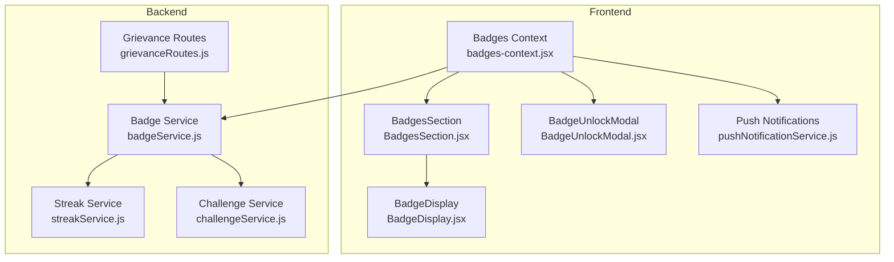
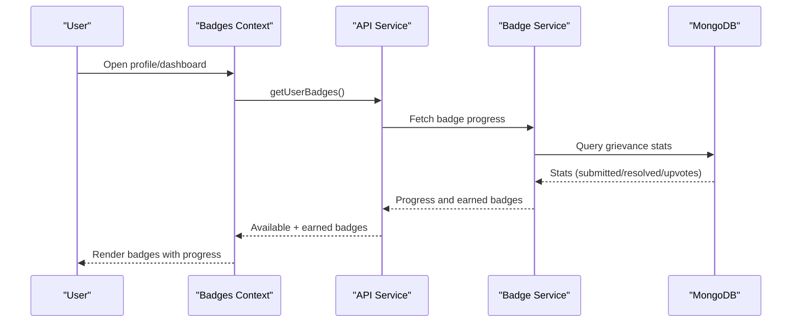
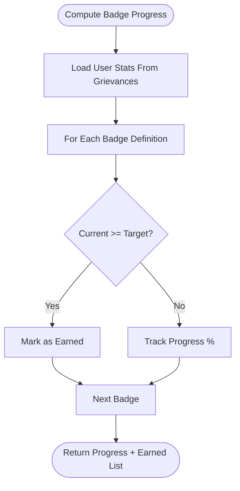
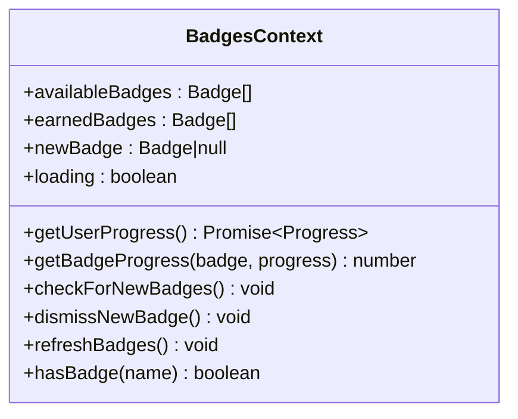
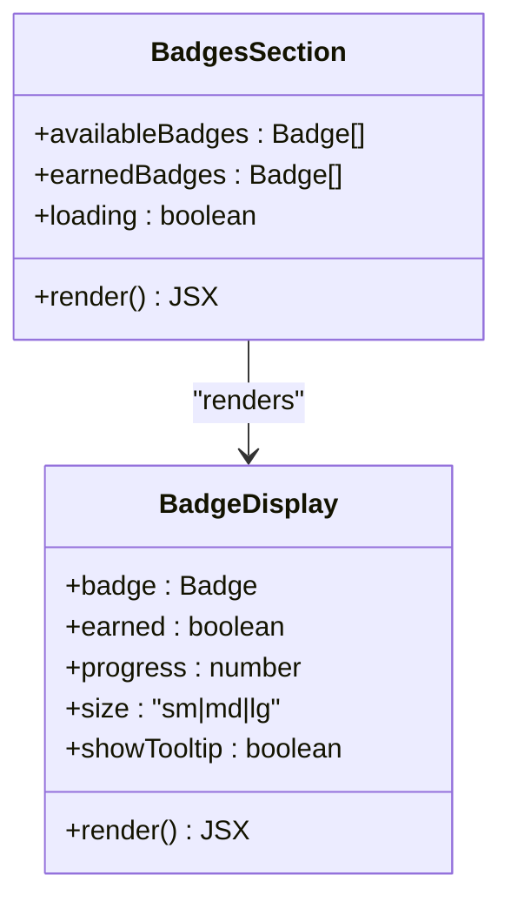
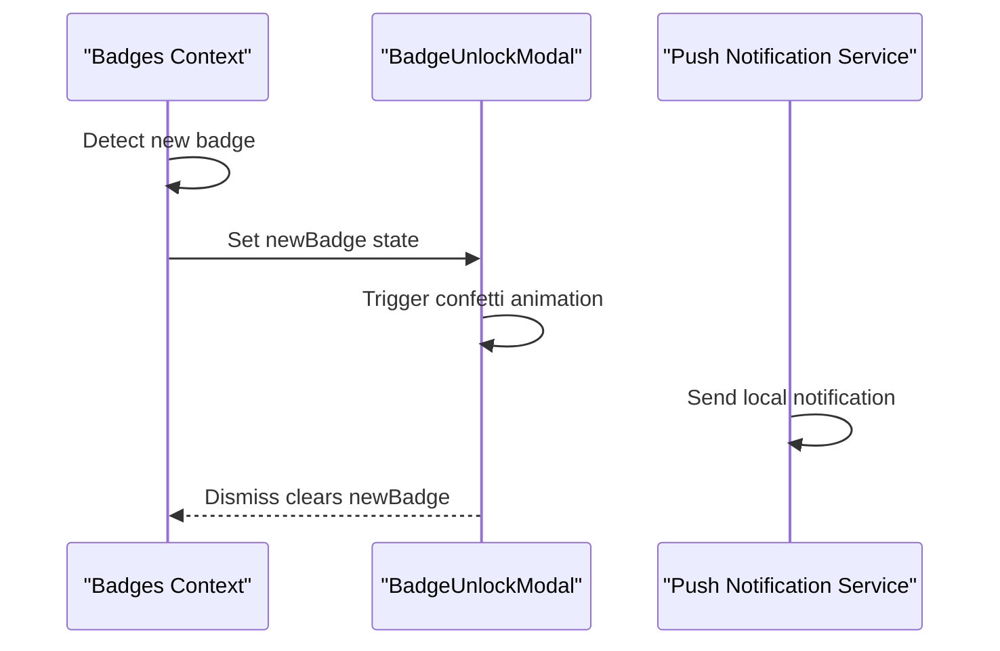
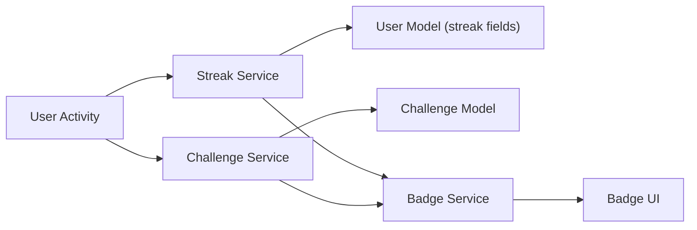
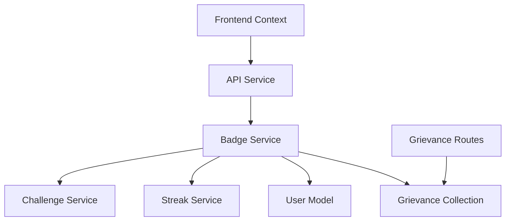

# Achievement & Badge System

<cite>
**Referenced Files in This Document**
- [badges-context.jsx](file://Frontend/src/context/badges-context.jsx)
- [BadgeDisplay.jsx](file://Frontend/src/components/BadgeDisplay.jsx)
- [BadgeUnlockModal.jsx](file://Frontend/src/components/BadgeUnlockModal.jsx)
- [BadgesSection.jsx](file://Frontend/src/components/BadgesSection.jsx)
- [badgeService.js](file://backend/src/services/badgeService.js)
- [streakService.js](file://backend/src/services/gamification/streakService.js)
- [challengeService.js](file://backend/src/services/gamification/challengeService.js)
- [grievanceRoutes.js](file://backend/src/routes/grievanceRoutes.js)
- [pushNotificationService.js](file://Frontend/src/services/pushNotificationService.js)
</cite>

## Table of Contents
1. [Introduction](#introduction)
2. [Project Structure](#project-structure)
3. [Core Components](#core-components)
4. [Architecture Overview](#architecture-overview)
5. [Detailed Component Analysis](#detailed-component-analysis)
6. [Dependency Analysis](#dependency-analysis)
7. [Performance Considerations](#performance-considerations)
8. [Troubleshooting Guide](#troubleshooting-guide)
9. [Conclusion](#conclusion)

## Introduction
This document describes the achievement and badge system that drives user engagement through meaningful milestones and impact indicators. The system defines badge categories and requirements, computes progress dynamically from actual grievance data, and surfaces unlock notifications and visual displays. It supports:
- Milestone badges (e.g., first_report, active_citizen)
- Engagement badges (e.g., popular_voice, supporter)
- Impact badges (e.g., problem_solver, community_hero)
- Streak-based badges (e.g., streak_starter, week_warrior)

The badge engine queries MongoDB collections directly rather than relying on precomputed counters, ensuring accuracy and real-time responsiveness.

## Project Structure
The badge system spans frontend React components and backend services:
- Frontend context and UI components manage badge data, progress, and visual presentation.
- Backend services compute badge progress and scores from actual grievance records and maintain advanced engagement features like streaks and challenges.

**Diagram sources**
- [badges-context.jsx:1-143](file://Frontend/src/context/badges-context.jsx#L1-L143)
- [BadgesSection.jsx:1-153](file://Frontend/src/components/BadgesSection.jsx#L1-L153)
- [BadgeDisplay.jsx:1-186](file://Frontend/src/components/BadgeDisplay.jsx#L1-L186)
- [BadgeUnlockModal.jsx:1-180](file://Frontend/src/components/BadgeUnlockModal.jsx#L1-L180)
- [pushNotificationService.js:259-303](file://Frontend/src/services/pushNotificationService.js#L259-L303)
- [badgeService.js:1-285](file://backend/src/services/badgeService.js#L1-L285)
- [streakService.js:1-237](file://backend/src/services/gamification/streakService.js#L1-L237)
- [challengeService.js:1-384](file://backend/src/services/gamification/challengeService.js#L1-L384)
- [grievanceRoutes.js:1-62](file://backend/src/routes/grievanceRoutes.js#L1-L62)

**Section sources**
- [badges-context.jsx:1-143](file://Frontend/src/context/badges-context.jsx#L1-L143)
- [badgeService.js:1-285](file://backend/src/services/badgeService.js#L1-L285)

## Core Components
- Badges Context: Centralizes badge data, user progress retrieval, progress calculation, and new-badge state management.
- Badge UI Components: Render individual badges, progress rings, tooltips, and the unlock modal with celebratory effects.
- Badge Service: Defines badge categories and requirements, computes user stats from grievance data, and calculates badge progress dynamically.
- Streak and Challenge Services: Power advanced engagement features (streaks and community challenges) used by the badge engine.

Key responsibilities:
- Dynamic computation from actual grievance data (never cached counters).
- Real-time progress tracking and unlock notifications.
- Visual feedback with animations and tooltips.

**Section sources**
- [badges-context.jsx:1-143](file://Frontend/src/context/badges-context.jsx#L1-L143)
- [BadgeDisplay.jsx:1-186](file://Frontend/src/components/BadgeDisplay.jsx#L1-L186)
- [BadgeUnlockModal.jsx:1-180](file://Frontend/src/components/BadgeUnlockModal.jsx#L1-L180)
- [BadgesSection.jsx:1-153](file://Frontend/src/components/BadgesSection.jsx#L1-L153)
- [badgeService.js:1-285](file://backend/src/services/badgeService.js#L1-L285)
- [streakService.js:1-237](file://backend/src/services/gamification/streakService.js#L1-L237)
- [challengeService.js:1-384](file://backend/src/services/gamification/challengeService.js#L1-L384)

## Architecture Overview
The system follows a reactive architecture:
- Frontend context fetches badge definitions and user progress from the backend.
- Backend services compute badge progress and scores from MongoDB collections.
- Frontend components render progress, tooltips, and unlock celebrations.
- Push notifications inform users of newly earned badges.

**Diagram sources**
- [badges-context.jsx:14-40](file://Frontend/src/context/badges-context.jsx#L14-L40)
- [badgeService.js:235-268](file://backend/src/services/badgeService.js#L235-L268)

## Detailed Component Analysis

### Badge Definition Structure and Categories
Badge definitions enumerate all possible achievements with:
- Unique identifier
- Name and description
- Category (milestone, engagement, impact, streak)
- Requirement field (e.g., complaintsSubmitted, complaintsResolved, upvotesReceived, upvotesGiven, currentStreak, longestStreak)
- Target value threshold
- Icon representation

Examples of categories and representative badges:
- Milestone badges: first_report, active_citizen, veteran_reporter, super_reporter
- Engagement badges: popular_voice, community_favorite, supporter
- Impact badges: problem_solver, community_hero, change_maker
- Streak-based badges: streak_starter, week_warrior, dedicated_citizen, consistency_champion, unstoppable

Progress calculation:
- For each badge, progress is computed as min((current / target) * 100, 100).
- Unlock occurs when current meets or exceeds target.

Award mechanism:
- Badges are computed dynamically on demand; no permanent storage of earned badges.
- The system returns currently earned badges based on real-time stats.

**Section sources**
- [badgeService.js:4-142](file://backend/src/services/badgeService.js#L4-L142)
- [badgeService.js:235-268](file://backend/src/services/badgeService.js#L235-L268)

### Dynamic Badge Calculation Engine
The backend service orchestrates badge evaluation:
- Reads actual grievance data to compute user stats (submitted, resolved, upvotes received, upvotes given).
- Incorporates streak data from the user model for streak-based badges.
- Iterates badge definitions and compares current stats to thresholds.
- Returns progress percentages and unlock status for each badge.

**Diagram sources**
- [badgeService.js:149-181](file://backend/src/services/badgeService.js#L149-L181)
- [badgeService.js:202-229](file://backend/src/services/badgeService.js#L202-L229)
- [badgeService.js:235-268](file://backend/src/services/badgeService.js#L235-L268)

**Section sources**
- [badgeService.js:149-181](file://backend/src/services/badgeService.js#L149-L181)
- [badgeService.js:202-229](file://backend/src/services/badgeService.js#L202-L229)
- [badgeService.js:235-268](file://backend/src/services/badgeService.js#L235-L268)

### Frontend Badge Context and Progress Tracking
The context manages:
- Available badges (catalog)
- Earned badges (current session)
- New badge state for unlock modal
- User progress retrieval via API
- Progress calculation per badge using current stats
- Utility to check if a badge has been earned

**Diagram sources**
- [badges-context.jsx:7-134](file://Frontend/src/context/badges-context.jsx#L7-L134)

**Section sources**
- [badges-context.jsx:1-143](file://Frontend/src/context/badges-context.jsx#L1-L143)

### Visual Display Components
BadgeDisplay renders:
- Gradient backgrounds per category
- Progress ring for unearned badges with animated arcs
- Tooltips with name, description, and completion percentage
- Sparkle effects and glow on hover for earned badges

BadgesSection organizes badges by category, shows collection progress, and displays stats cards.

**Diagram sources**
- [BadgeDisplay.jsx:36-186](file://Frontend/src/components/BadgeDisplay.jsx#L36-L186)
- [BadgesSection.jsx:9-153](file://Frontend/src/components/BadgesSection.jsx#L9-L153)

**Section sources**
- [BadgeDisplay.jsx:1-186](file://Frontend/src/components/BadgeDisplay.jsx#L1-L186)
- [BadgesSection.jsx:1-153](file://Frontend/src/components/BadgesSection.jsx#L1-L153)

### Unlock Notification and Celebration
BadgeUnlockModal presents:
- Animated confetti and rays
- Trophy animation
- Badge preview with gradient and tooltip disabled
- Close action to dismiss

Push notification service sends local notifications when a badge is earned.

**Diagram sources**
- [BadgeUnlockModal.jsx:48-180](file://Frontend/src/components/BadgeUnlockModal.jsx#L48-L180)
- [pushNotificationService.js:261-270](file://Frontend/src/services/pushNotificationService.js#L261-L270)

**Section sources**
- [BadgeUnlockModal.jsx:1-180](file://Frontend/src/components/BadgeUnlockModal.jsx#L1-L180)
- [pushNotificationService.js:259-303](file://Frontend/src/services/pushNotificationService.js#L259-L303)

### Advanced Engagement: Streaks and Challenges
Streak Service:
- Tracks current and longest streaks
- Updates streak on user activity
- Resets inactive streaks after a grace period
- Provides leaderboard data

Challenge Service:
- Creates and manages community challenges
- Tracks participant contributions and progress
- Computes leaderboards and updates statuses

These services integrate with the badge engine to support streak-based badges and community-driven goals.

**Diagram sources**
- [streakService.js:43-114](file://backend/src/services/gamification/streakService.js#L43-L114)
- [challengeService.js:24-71](file://backend/src/services/gamification/challengeService.js#L24-L71)
- [badgeService.js:167-181](file://backend/src/services/badgeService.js#L167-L181)

**Section sources**
- [streakService.js:1-237](file://backend/src/services/gamification/streakService.js#L1-L237)
- [challengeService.js:1-384](file://backend/src/services/gamification/challengeService.js#L1-L384)
- [badgeService.js:149-181](file://backend/src/services/badgeService.js#L149-L181)

## Dependency Analysis
- Frontend depends on the backend badge service for progress and earned badges.
- Backend badge service depends on MongoDB collections for grievance stats and user model for streaks.
- Streak and challenge services are independent but feed into the badge engine.
- Routes expose grievance endpoints used by the system indirectly (e.g., upvotes, submissions).

**Diagram sources**
- [badges-context.jsx:14-40](file://Frontend/src/context/badges-context.jsx#L14-L40)
- [badgeService.js:149-181](file://backend/src/services/badgeService.js#L149-L181)
- [grievanceRoutes.js:1-62](file://backend/src/routes/grievanceRoutes.js#L1-L62)

**Section sources**
- [badges-context.jsx:1-143](file://Frontend/src/context/badges-context.jsx#L1-L143)
- [badgeService.js:149-181](file://backend/src/services/badgeService.js#L149-L181)
- [grievanceRoutes.js:1-62](file://backend/src/routes/grievanceRoutes.js#L1-L62)

## Performance Considerations
- Dynamic computation: Badge progress is recalculated on demand, avoiding stale counters and ensuring accuracy.
- Efficient queries: Stats are derived from targeted MongoDB queries and aggregations.
- Frontend rendering: Progress arcs animate smoothly; consider debouncing frequent re-renders if badges update rapidly.
- Streak resets: Daily maintenance jobs reset inactive streaks to keep data realistic.

## Troubleshooting Guide
Common issues and resolutions:
- No badges displayed:
  - Verify user context is authenticated and badges context is mounted.
  - Confirm API responses include available and earned badges.
- Incorrect progress:
  - Ensure grievance data reflects recent activity.
  - Check that requirement fields match expected stat keys.
- Streak badges not unlocking:
  - Confirm streak service is enabled and user activity updates streak.
  - Validate that currentStreak and longestStreak fields are populated.
- Unlock modal not appearing:
  - Check that newBadge state is being set and dismissed properly.
  - Verify push notification permissions if relying on local notifications.

**Section sources**
- [badges-context.jsx:14-40](file://Frontend/src/context/badges-context.jsx#L14-L40)
- [BadgeUnlockModal.jsx:48-65](file://Frontend/src/components/BadgeUnlockModal.jsx#L48-L65)
- [streakService.js:13-15](file://backend/src/services/gamification/streakService.js#L13-L15)
- [pushNotificationService.js:292-295](file://Frontend/src/services/pushNotificationService.js#L292-L295)

## Conclusion
The achievement and badge system leverages real-time grievance data to deliver accurate, motivating recognition. Its modular design integrates cleanly with frontend UI and backend services, enabling scalable enhancements such as streaks and challenges. By focusing on dynamic computation and delightful user feedback, the system encourages sustained participation and community impact.