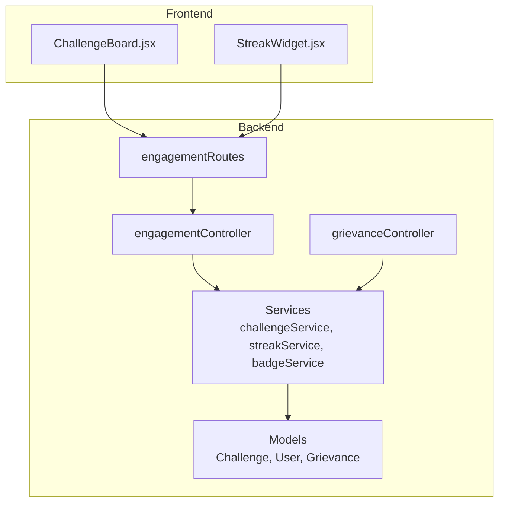
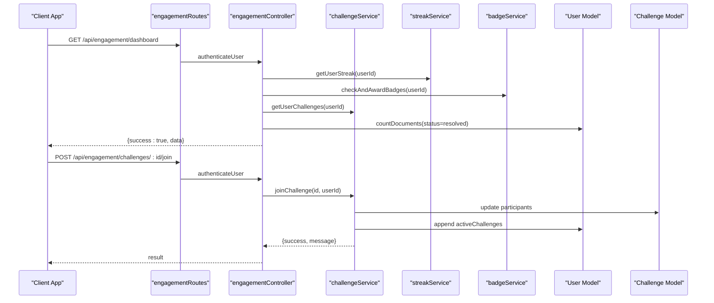
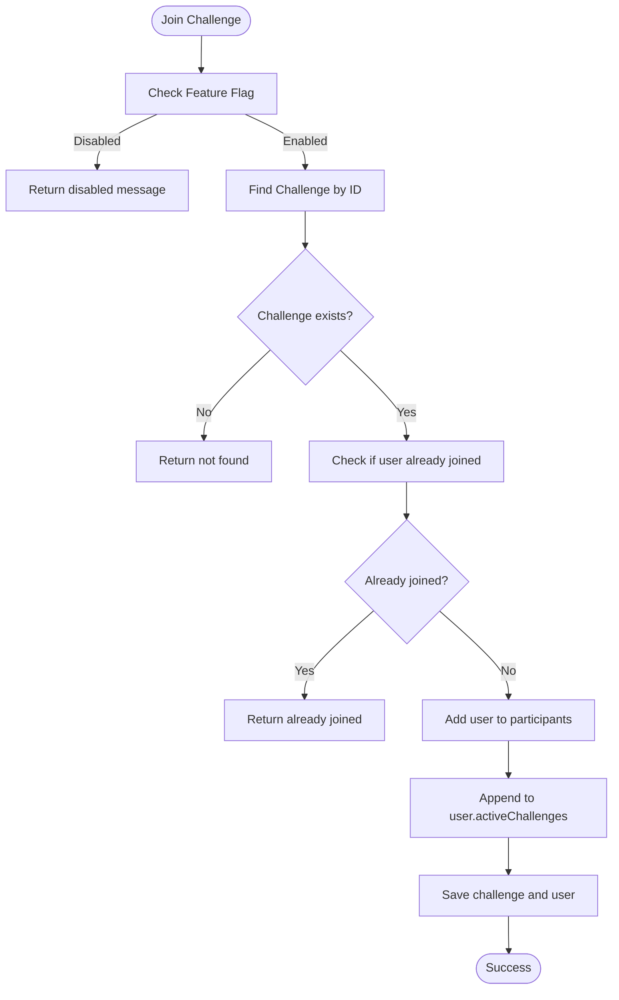
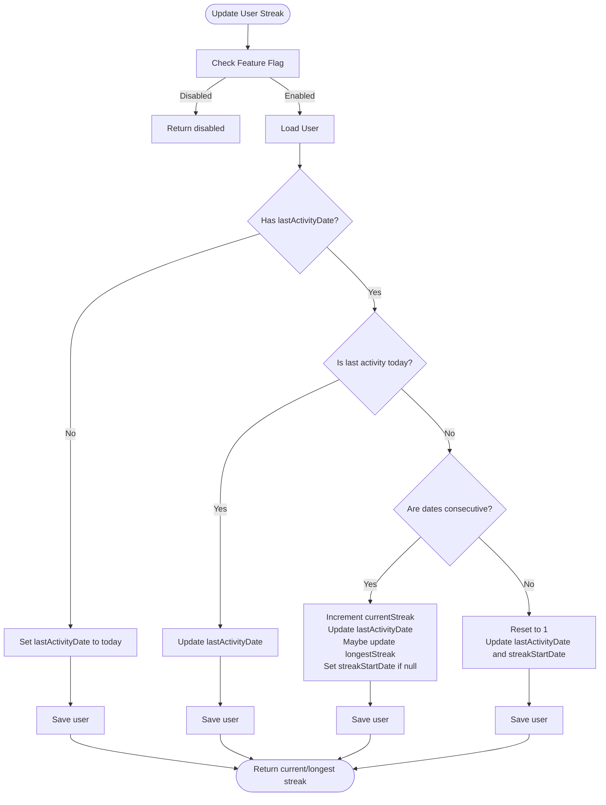
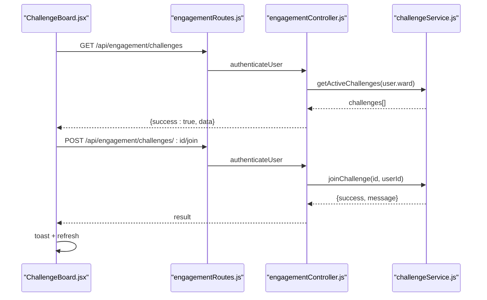
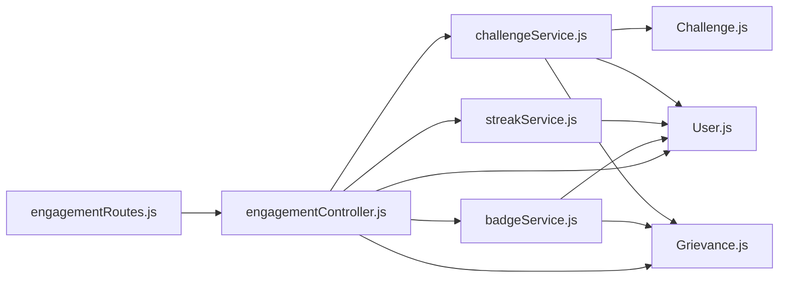

# Challenge & Motivation System

<cite>
**Referenced Files in This Document**
- [Challenge.js](file://backend/src/models/Challenge.js)
- [User.js](file://backend/src/models/User.js)
- [Grievance.js](file://backend/src/models/Grievance.js)
- [challengeService.js](file://backend/src/services/gamification/challengeService.js)
- [streakService.js](file://backend/src/services/gamification/streakService.js)
- [badgeService.js](file://backend/src/services/badgeService.js)
- [engagementController.js](file://backend/src/controllers/engagementController.js)
- [engagementRoutes.js](file://backend/src/routes/engagementRoutes.js)
- [ChallengeBoard.jsx](file://frontend/src/components/engagement/ChallengeBoard.jsx)
- [StreakWidget.jsx](file://frontend/src/components/engagement/StreakWidget.jsx)
- [grievanceController.js](file://backend/src/controllers/grievanceController.js)
- [ADVANCED_ENGAGEMENT_IMPLEMENTATION.md](file://ADVANCED_ENGAGEMENT_IMPLEMENTATION.md)
</cite>

## Table of Contents
1. [Introduction](#introduction)
2. [Project Structure](#project-structure)
3. [Core Components](#core-components)
4. [Architecture Overview](#architecture-overview)
5. [Detailed Component Analysis](#detailed-component-analysis)
6. [Dependency Analysis](#dependency-analysis)
7. [Performance Considerations](#performance-considerations)
8. [Troubleshooting Guide](#troubleshooting-guide)
9. [Conclusion](#conclusion)
10. [Appendices](#appendices)

## Introduction
This document describes the Challenge & Motivation System that powers community-driven engagement within the platform. It covers challenge creation and management, challenge board presentation, motivation algorithms for streaks and goals, persistence and progress tracking, and integration with the broader gamification framework. The system is designed with safety, scalability, and zero-regression guarantees, enabling optional activation via a feature flag.

## Project Structure
The Challenge & Motivation System spans backend services, models, controllers, routes, and frontend components:

- Backend:
  - Models: Challenge, User, Grievance
  - Services: challengeService, streakService, badgeService
  - Controllers: engagementController
  - Routes: engagementRoutes
  - Integration: grievanceController triggers engagement updates
- Frontend:
  - ChallengeBoard: displays active challenges and join actions
  - StreakWidget: shows user streaks and encourages continued participation

**Diagram sources**
- [engagementRoutes.js:15-36](file://backend/src/routes/engagementRoutes.js#L15-L36)
- [engagementController.js:17-70](file://backend/src/controllers/engagementController.js#L17-L70)
- [challengeService.js:1-384](file://backend/src/services/gamification/challengeService.js#L1-L384)
- [streakService.js:1-237](file://backend/src/services/gamification/streakService.js#L1-L237)
- [badgeService.js:1-285](file://backend/src/services/badgeService.js#L1-L285)
- [Challenge.js:1-96](file://backend/src/models/Challenge.js#L1-L96)
- [User.js:1-165](file://backend/src/models/User.js#L1-L165)
- [Grievance.js:1-115](file://backend/src/models/Grievance.js#L1-L115)
- [ChallengeBoard.jsx:1-245](file://frontend/src/components/engagement/ChallengeBoard.jsx#L1-L245)
- [StreakWidget.jsx:1-165](file://frontend/src/components/engagement/StreakWidget.jsx#L1-L165)
- [grievanceController.js:182-209](file://backend/src/controllers/grievanceController.js#L182-L209)

**Section sources**
- [engagementRoutes.js:1-37](file://backend/src/routes/engagementRoutes.js#L1-L37)
- [engagementController.js:1-225](file://backend/src/controllers/engagementController.js#L1-L225)
- [challengeService.js:1-384](file://backend/src/services/gamification/challengeService.js#L1-L384)
- [streakService.js:1-237](file://backend/src/services/gamification/streakService.js#L1-L237)
- [badgeService.js:1-285](file://backend/src/services/badgeService.js#L1-L285)
- [Challenge.js:1-96](file://backend/src/models/Challenge.js#L1-L96)
- [User.js:1-165](file://backend/src/models/User.js#L1-L165)
- [Grievance.js:1-115](file://backend/src/models/Grievance.js#L1-L115)
- [ChallengeBoard.jsx:1-245](file://frontend/src/components/engagement/ChallengeBoard.jsx#L1-L245)
- [StreakWidget.jsx:1-165](file://frontend/src/components/engagement/StreakWidget.jsx#L1-L165)
- [grievanceController.js:182-209](file://backend/src/controllers/grievanceController.js#L182-L209)

## Core Components
- Challenge Model: Defines challenge metadata, scope (ward/city/category), timing, participation, progress, and rewards.
- User Model: Extends user profile with streak fields and challenge participation arrays.
- Grievance Model: Provides engagement context for progress tracking and badge calculations.
- Challenge Service: Creates, manages, and queries challenges; updates progress and statuses.
- Streak Service: Tracks user activity streaks, resets inactive streaks, and computes leaderboards.
- Badge Service: Computes dynamic badges including streak-based ones.
- Engagement Controller: Exposes endpoints for dashboards, streaks, challenges, leaderboards, and sharing.
- Engagement Routes: Protects and exposes engagement endpoints.
- Frontend Components: ChallengeBoard and StreakWidget present challenges and streaks with graceful error handling.

**Section sources**
- [Challenge.js:1-96](file://backend/src/models/Challenge.js#L1-L96)
- [User.js:85-115](file://backend/src/models/User.js#L85-L115)
- [Grievance.js:1-115](file://backend/src/models/Grievance.js#L1-L115)
- [challengeService.js:1-384](file://backend/src/services/gamification/challengeService.js#L1-L384)
- [streakService.js:1-237](file://backend/src/services/gamification/streakService.js#L1-L237)
- [badgeService.js:1-285](file://backend/src/services/badgeService.js#L1-L285)
- [engagementController.js:1-225](file://backend/src/controllers/engagementController.js#L1-L225)
- [engagementRoutes.js:1-37](file://backend/src/routes/engagementRoutes.js#L1-L37)
- [ChallengeBoard.jsx:1-245](file://frontend/src/components/engagement/ChallengeBoard.jsx#L1-L245)
- [StreakWidget.jsx:1-165](file://frontend/src/components/engagement/StreakWidget.jsx#L1-L165)

## Architecture Overview
The system follows an event-driven, fail-safe architecture:
- Feature flag controls activation of advanced engagement features.
- Controllers orchestrate data fetching and return sanitized results on failure.
- Services encapsulate domain logic and persist state.
- Frontend components consume protected endpoints and degrade gracefully.

**Diagram sources**
- [engagementRoutes.js:21-34](file://backend/src/routes/engagementRoutes.js#L21-L34)
- [engagementController.js:17-70](file://backend/src/controllers/engagementController.js#L17-L70)
- [challengeService.js:115-165](file://backend/src/services/gamification/challengeService.js#L115-L165)
- [streakService.js:43-114](file://backend/src/services/gamification/streakService.js#L43-L114)
- [badgeService.js:202-229](file://backend/src/services/badgeService.js#L202-L229)
- [User.js:103-115](file://backend/src/models/User.js#L103-L115)
- [Challenge.js:48-63](file://backend/src/models/Challenge.js#L48-L63)

## Detailed Component Analysis

### Challenge Model and Persistence
The Challenge model defines:
- Identity and scope: challengeId, title, description, type (ward/city/category), ward, category
- Goal and progress: goal, targetValue, currentValue, participants array
- Lifecycle: status (upcoming/active/completed/expired), dates (startDate, endDate), isActive
- Rewards: badgeId, points, description
- Indexes optimize queries by status, ward, and challengeId

Key behaviors:
- Participants track userId, join time, and contribution
- Status transitions occur automatically via scheduled tasks
- Completion triggers when currentValue reaches targetValue

**Section sources**
- [Challenge.js:7-95](file://backend/src/models/Challenge.js#L7-L95)

### Challenge Service: Creation, Join, Progress, Leaderboard
Responsibilities:
- Feature flag gating via isEngagementEnabled
- Create challenge with unique ID, derived status based on dates
- Retrieve active challenges filtered by ward or city-wide
- Join challenge: prevent duplicates, update participant and user records
- Update progress: increment participant/contribution, check completion
- Compute leaderboard per challenge
- Fetch user challenges (active and completed)
- Update statuses: mark expired and activate upcoming challenges

**Diagram sources**
- [challengeService.js:115-165](file://backend/src/services/gamification/challengeService.js#L115-L165)

**Section sources**
- [challengeService.js:14-71](file://backend/src/services/gamification/challengeService.js#L14-L71)
- [challengeService.js:79-106](file://backend/src/services/gamification/challengeService.js#L79-L106)
- [challengeService.js:115-165](file://backend/src/services/gamification/challengeService.js#L115-L165)
- [challengeService.js:176-232](file://backend/src/services/gamification/challengeService.js#L176-L232)
- [challengeService.js:241-274](file://backend/src/services/gamification/challengeService.js#L241-L274)
- [challengeService.js:282-322](file://backend/src/services/gamification/challengeService.js#L282-L322)
- [challengeService.js:328-372](file://backend/src/services/gamification/challengeService.js#L328-L372)

### Streak Service: Motivation Through Daily Habits
Responsibilities:
- Feature flag gating
- Consecutive day detection and today checks
- Update streak on activity: continue or reset, update start date, track longest streak
- Compute user streak data with 48-hour grace window for activity
- Top streaks leaderboard
- Reset inactive streaks after 48 hours

**Diagram sources**
- [streakService.js:43-114](file://backend/src/services/gamification/streakService.js#L43-L114)

**Section sources**
- [streakService.js:13-16](file://backend/src/services/gamification/streakService.js#L13-L16)
- [streakService.js:20-34](file://backend/src/services/gamification/streakService.js#L20-L34)
- [streakService.js:43-114](file://backend/src/services/gamification/streakService.js#L43-L114)
- [streakService.js:122-160](file://backend/src/services/gamification/streakService.js#L122-L160)
- [streakService.js:168-193](file://backend/src/services/gamification/streakService.js#L168-L193)
- [streakService.js:199-228](file://backend/src/services/gamification/streakService.js#L199-L228)

### Badge Service: Dynamic Achievement Tracking
Responsibilities:
- Define badge categories and thresholds (including streak-based badges)
- Dynamically compute user stats from Grievance collection (never rely on stale counters)
- Award badges based on real-time statistics
- Provide badge progress and unlock status
- Calculate user score from complaints, upvotes, and resolved cases

Integration with streaks:
- Streak-based badges depend on User model streak fields

**Section sources**
- [badgeService.js:5-142](file://backend/src/services/badgeService.js#L5-L142)
- [badgeService.js:149-181](file://backend/src/services/badgeService.js#L149-L181)
- [badgeService.js:202-229](file://backend/src/services/badgeService.js#L202-L229)
- [badgeService.js:235-268](file://backend/src/services/badgeService.js#L235-L268)

### Engagement Controller and Routes
Endpoints:
- GET /api/engagement/dashboard: Personalized dashboard combining streak, badges, challenges, stats, and recent activity
- GET /api/engagement/streak: User streak data
- GET /api/engagement/streaks/top: Public top streaks leaderboard
- GET /api/engagement/challenges: Active challenges filtered by user ward or city-wide
- POST /api/engagement/challenges/:challengeId/join: Join a challenge
- GET /api/engagement/challenges/:challengeId/leaderboard: Challenge leaderboard
- GET /api/engagement/share/:badgeId: Shareable achievement (anonymized)

Safety mechanisms:
- All endpoints wrap logic in try-catch and return sanitized data on failure
- Feature flag gating in services ensures graceful disablement

**Section sources**
- [engagementController.js:17-70](file://backend/src/controllers/engagementController.js#L17-L70)
- [engagementController.js:76-92](file://backend/src/controllers/engagementController.js#L76-L92)
- [engagementController.js:98-114](file://backend/src/controllers/engagementController.js#L98-L114)
- [engagementController.js:120-136](file://backend/src/controllers/engagementController.js#L120-L136)
- [engagementController.js:142-161](file://backend/src/controllers/engagementController.js#L142-L161)
- [engagementController.js:167-186](file://backend/src/controllers/engagementController.js#L167-L186)
- [engagementController.js:192-224](file://backend/src/controllers/engagementController.js#L192-L224)
- [engagementRoutes.js:21-34](file://backend/src/routes/engagementRoutes.js#L21-L34)

### Frontend Components: Challenge Board and Streak Widget
ChallengeBoard:
- Fetches active challenges, displays progress, participants, rewards, and join actions
- Uses animations and skeleton loaders for UX resilience
- Handles errors gracefully and refreshes after successful join

StreakWidget:
- Shows current and longest streaks, activity status, and encouraging messages
- Supports compact mode for settings pages
- Displays celebratory messages for long streaks

**Diagram sources**
- [ChallengeBoard.jsx:25-80](file://frontend/src/components/engagement/ChallengeBoard.jsx#L25-L80)
- [engagementRoutes.js:28-31](file://backend/src/routes/engagementRoutes.js#L28-L31)
- [engagementController.js:120-161](file://backend/src/controllers/engagementController.js#L120-L161)
- [challengeService.js:115-165](file://backend/src/services/gamification/challengeService.js#L115-L165)

**Section sources**
- [ChallengeBoard.jsx:15-245](file://frontend/src/components/engagement/ChallengeBoard.jsx#L15-L245)
- [StreakWidget.jsx:13-165](file://frontend/src/components/engagement/StreakWidget.jsx#L13-L165)

### Integration with Grievance Processing
Event-driven updates:
- On complaint submission, streak and challenge progress are updated asynchronously
- Failures are caught and logged without blocking the primary grievance flow
- Challenge progress increments when a complaint-related goal is active

**Section sources**
- [grievanceController.js:182-209](file://backend/src/controllers/grievanceController.js#L182-L209)

## Dependency Analysis
The system exhibits low coupling and high cohesion:
- Services depend on models and each other minimally
- Controllers depend on services and enforce authentication
- Routes isolate endpoint definitions from business logic
- Frontend components depend on protected backend endpoints and degrade gracefully

**Diagram sources**
- [engagementRoutes.js:1-37](file://backend/src/routes/engagementRoutes.js#L1-L37)
- [engagementController.js:1-225](file://backend/src/controllers/engagementController.js#L1-L225)
- [challengeService.js:1-384](file://backend/src/services/gamification/challengeService.js#L1-L384)
- [streakService.js:1-237](file://backend/src/services/gamification/streakService.js#L1-L237)
- [badgeService.js:1-285](file://backend/src/services/badgeService.js#L1-L285)
- [Challenge.js:1-96](file://backend/src/models/Challenge.js#L1-L96)
- [User.js:1-165](file://backend/src/models/User.js#L1-L165)
- [Grievance.js:1-115](file://backend/src/models/Grievance.js#L1-L115)

**Section sources**
- [engagementController.js:17-70](file://backend/src/controllers/engagementController.js#L17-L70)
- [challengeService.js:1-384](file://backend/src/services/gamification/challengeService.js#L1-L384)
- [streakService.js:1-237](file://backend/src/services/gamification/streakService.js#L1-L237)
- [badgeService.js:1-285](file://backend/src/services/badgeService.js#L1-L285)

## Performance Considerations
- Database indexing:
  - Challenge: status, endDate, ward, challengeId
  - User: email, ward, totalScore, points, upvotesReceived
  - Grievance: ward, userId, complaintId, category, priority, status, createdAt, upvoteCount, aiAnalysis flags, assignedDepartment
- Asynchronous processing:
  - Engagement updates during grievance submission avoid blocking the main flow
- Parallel data fetching:
  - Personalized dashboard aggregates multiple data sources concurrently
- Graceful degradation:
  - Frontend components render skeletons and handle API failures without crashing

[No sources needed since this section provides general guidance]

## Troubleshooting Guide
Common scenarios and resolutions:
- Challenges not appearing:
  - Verify feature flag is enabled and challenge dates are valid
  - Confirm user ward filters align with challenge scope
- Join challenge fails:
  - Check duplicate participation and network/API errors
  - Inspect server logs for service exceptions
- Streak not updating:
  - Ensure grievance submission triggers engagement updates
  - Confirm asynchronous updates are not blocked by errors
- Leaderboards show empty data:
  - Controllers return empty arrays on errors; check backend logs
- Frontend crashes:
  - Components already handle API failures gracefully; inspect browser console for CORS/token issues

**Section sources**
- [challengeService.js:24-71](file://backend/src/services/gamification/challengeService.js#L24-L71)
- [challengeService.js:115-165](file://backend/src/services/gamification/challengeService.js#L115-L165)
- [streakService.js:43-114](file://backend/src/services/gamification/streakService.js#L43-L114)
- [engagementController.js:17-70](file://backend/src/controllers/engagementController.js#L17-L70)
- [ChallengeBoard.jsx:25-80](file://frontend/src/components/engagement/ChallengeBoard.jsx#L25-L80)
- [StreakWidget.jsx:22-44](file://frontend/src/components/engagement/StreakWidget.jsx#L22-L44)

## Conclusion
The Challenge & Motivation System introduces robust, optional engagement features that enhance user participation without altering core functionality. With feature flag control, fail-safe endpoints, asynchronous triggers, and resilient frontend components, the system scales safely and maintains zero regression. The combination of streaks, challenges, and dynamic badges creates a comprehensive gamified experience aligned with community goals.

[No sources needed since this section summarizes without analyzing specific files]

## Appendices

### Challenge Types, Difficulty Levels, and Completion Criteria
- Types:
  - Ward-level: scoped to a specific ward
  - City-wide: open to all wards
  - Category-specific: aligned with issue categories
- Difficulty and completion:
  - Completion is determined by reaching the targetValue for the defined goal
  - Progress is tracked both at the individual and challenge level

**Section sources**
- [Challenge.js:22-47](file://backend/src/models/Challenge.js#L22-L47)
- [challengeService.js:200-204](file://backend/src/services/gamification/challengeService.js#L200-L204)

### Reward Distribution and Integration
- Rewards include badgeId, points, and description attached to challenges
- Streak-based badges are awarded dynamically based on User streak fields
- Achievement sharing is anonymized and opt-in

**Section sources**
- [Challenge.js:77-81](file://backend/src/models/Challenge.js#L77-L81)
- [badgeService.js:96-142](file://backend/src/services/badgeService.js#L96-L142)
- [engagementController.js:192-224](file://backend/src/controllers/engagementController.js#L192-L224)

### Example User Interaction Patterns
- View active challenges and progress on the Challenge Board
- Join a challenge to start contributing toward the group goal
- Receive streak notifications and encouragement messages
- Earn badges and share achievements anonymously

**Section sources**
- [ChallengeBoard.jsx:125-241](file://frontend/src/components/engagement/ChallengeBoard.jsx#L125-L241)
- [StreakWidget.jsx:93-161](file://frontend/src/components/engagement/StreakWidget.jsx#L93-L161)
- [grievanceController.js:182-209](file://backend/src/controllers/grievanceController.js#L182-L209)

### Success Metrics and Validation
- Feature flag enables/disables advanced engagement
- Scheduled tasks maintain system health (reset inactive streaks, update challenge statuses)
- Implementation summary documents success criteria and maintenance tasks

**Section sources**
- [ADVANCED_ENGAGEMENT_IMPLEMENTATION.md:84-87](file://ADVANCED_ENGAGEMENT_IMPLEMENTATION.md#L84-L87)
- [streakService.js:199-228](file://backend/src/services/gamification/streakService.js#L199-L228)
- [challengeService.js:328-372](file://backend/src/services/gamification/challengeService.js#L328-L372)
- [ADVANCED_ENGAGEMENT_IMPLEMENTATION.md:174-189](file://ADVANCED_ENGAGEMENT_IMPLEMENTATION.md#L174-L189)