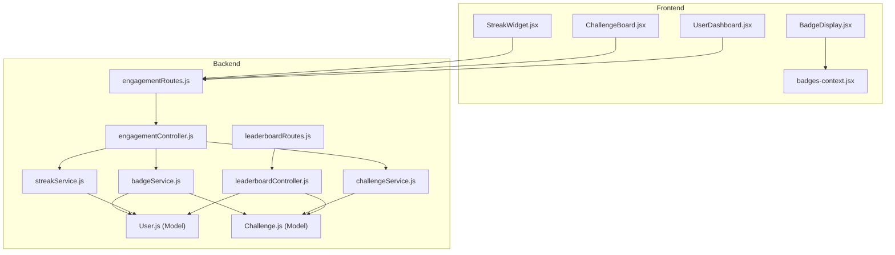
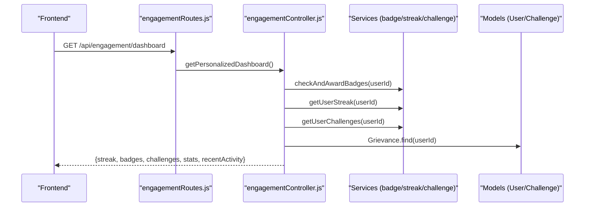
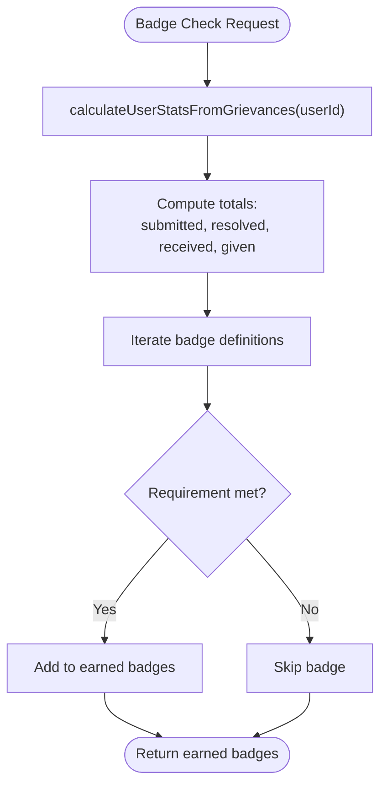
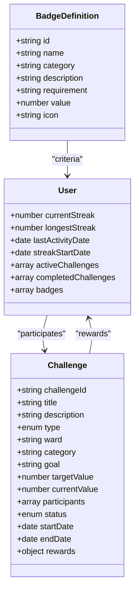
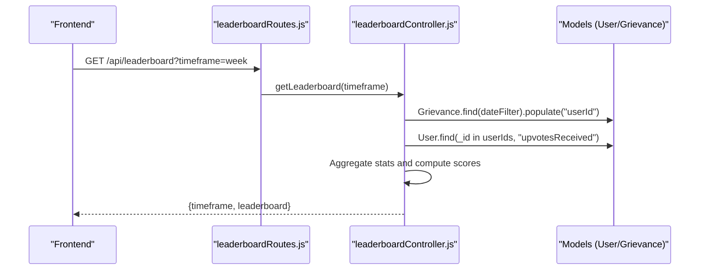
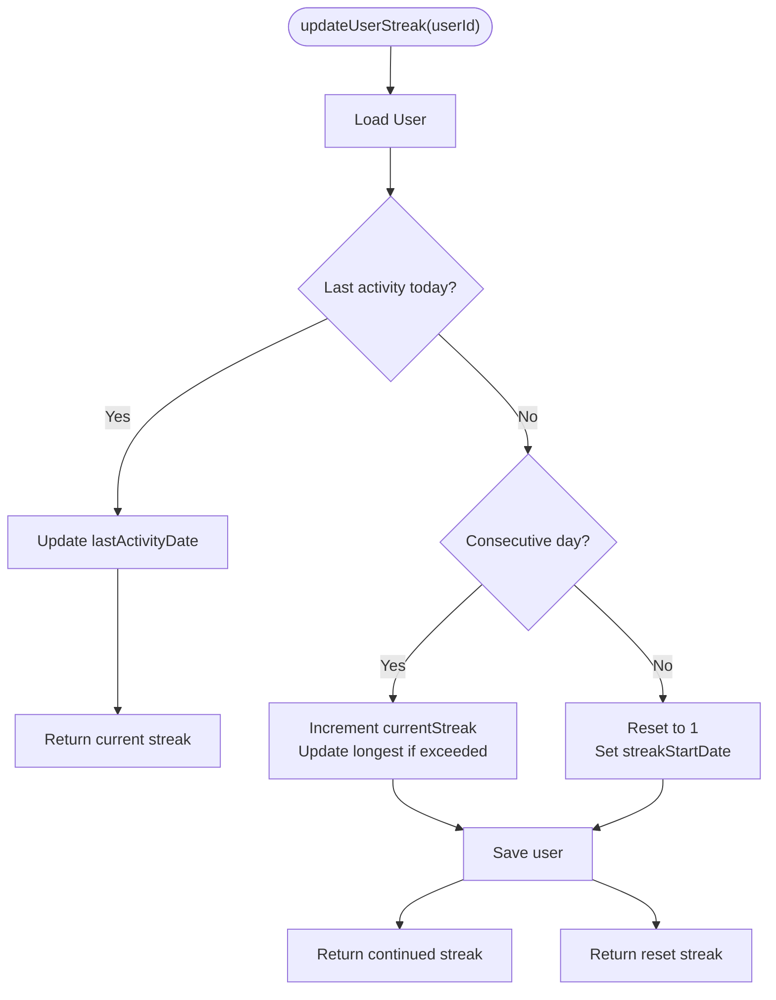
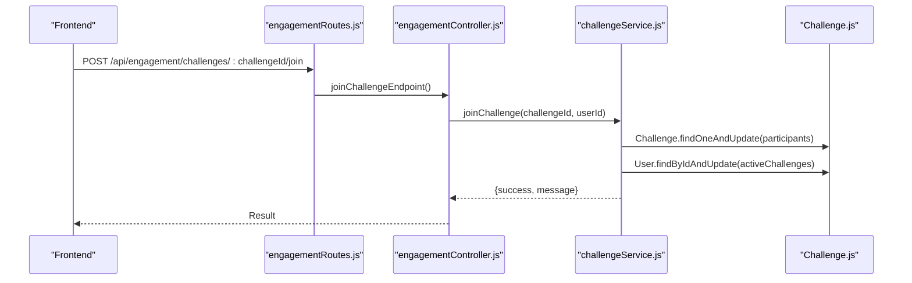
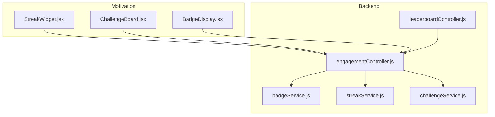
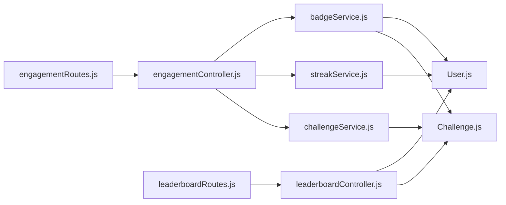

# Gamification & User Engagement System

<cite>
**Referenced Files in This Document**
- [badgeService.js](file://backend/src/services/badgeService.js)
- [streakService.js](file://backend/src/services/gamification/streakService.js)
- [challengeService.js](file://backend/src/services/gamification/challengeService.js)
- [engagementController.js](file://backend/src/controllers/engagementController.js)
- [leaderboardController.js](file://backend/src/controllers/leaderboardController.js)
- [User.js](file://backend/src/models/User.js)
- [Challenge.js](file://backend/src/models/Challenge.js)
- [engagementRoutes.js](file://backend/src/routes/engagementRoutes.js)
- [leaderboardRoutes.js](file://backend/src/routes/leaderboardRoutes.js)
- [StreakWidget.jsx](file://Frontend/src/components/engagement/StreakWidget.jsx)
- [ChallengeBoard.jsx](file://Frontend/src/components/engagement/ChallengeBoard.jsx)
- [BadgeDisplay.jsx](file://Frontend/src/components/BadgeDisplay.jsx)
- [badges-context.jsx](file://Frontend/src/context/badges-context.jsx)
- [UserDashboard.jsx](file://Frontend/src/pages/UserDashboard.jsx)
</cite>

## Table of Contents
1. [Introduction](#introduction)
2. [Project Structure](#project-structure)
3. [Core Components](#core-components)
4. [Architecture Overview](#architecture-overview)
5. [Detailed Component Analysis](#detailed-component-analysis)
6. [Dependency Analysis](#dependency-analysis)
7. [Performance Considerations](#performance-considerations)
8. [Troubleshooting Guide](#troubleshooting-guide)
9. [Conclusion](#conclusion)
10. [Appendices](#appendices)

## Introduction
This document describes the gamification and user engagement system that powers achievements, motivation, leaderboards, streaks, and challenges within the platform. It covers badge creation and management, achievement criteria, reward distribution, leaderboard scoring, streak tracking, challenge participation, and how these features integrate with user engagement metrics. Implementation examples are provided for badge unlocking, leaderboard updates, and streak maintenance.

## Project Structure
The gamification system spans backend services and controllers, MongoDB models, and frontend components and contexts. Routes expose protected endpoints for engagement features, while models define persistence for user streaks, challenges, and badges.

**Diagram sources**
- [engagementRoutes.js:1-37](file://backend/src/routes/engagementRoutes.js#L1-L37)
- [leaderboardRoutes.js:1-14](file://backend/src/routes/leaderboardRoutes.js#L1-L14)
- [engagementController.js:1-225](file://backend/src/controllers/engagementController.js#L1-L225)
- [leaderboardController.js:1-158](file://backend/src/controllers/leaderboardController.js#L1-L158)
- [badgeService.js:1-285](file://backend/src/services/badgeService.js#L1-L285)
- [streakService.js:1-237](file://backend/src/services/gamification/streakService.js#L1-L237)
- [challengeService.js:1-384](file://backend/src/services/gamification/challengeService.js#L1-L384)
- [User.js:1-165](file://backend/src/models/User.js#L1-L165)
- [Challenge.js:1-96](file://backend/src/models/Challenge.js#L1-L96)
- [StreakWidget.jsx:1-165](file://Frontend/src/components/engagement/StreakWidget.jsx#L1-L165)
- [ChallengeBoard.jsx:1-245](file://Frontend/src/components/engagement/ChallengeBoard.jsx#L1-L245)
- [BadgeDisplay.jsx:1-186](file://Frontend/src/components/BadgeDisplay.jsx#L1-L186)
- [badges-context.jsx:1-143](file://Frontend/src/context/badges-context.jsx#L1-L143)
- [UserDashboard.jsx:1-254](file://Frontend/src/pages/UserDashboard.jsx#L1-L254)

**Section sources**
- [engagementRoutes.js:1-37](file://backend/src/routes/engagementRoutes.js#L1-L37)
- [leaderboardRoutes.js:1-14](file://backend/src/routes/leaderboardRoutes.js#L1-L14)
- [engagementController.js:1-225](file://backend/src/controllers/engagementController.js#L1-L225)
- [leaderboardController.js:1-158](file://backend/src/controllers/leaderboardController.js#L1-L158)
- [badgeService.js:1-285](file://backend/src/services/badgeService.js#L1-L285)
- [streakService.js:1-237](file://backend/src/services/gamification/streakService.js#L1-L237)
- [challengeService.js:1-384](file://backend/src/services/gamification/challengeService.js#L1-L384)
- [User.js:1-165](file://backend/src/models/User.js#L1-L165)
- [Challenge.js:1-96](file://backend/src/models/Challenge.js#L1-L96)
- [StreakWidget.jsx:1-165](file://Frontend/src/components/engagement/StreakWidget.jsx#L1-L165)
- [ChallengeBoard.jsx:1-245](file://Frontend/src/components/engagement/ChallengeBoard.jsx#L1-L245)
- [BadgeDisplay.jsx:1-186](file://Frontend/src/components/BadgeDisplay.jsx#L1-L186)
- [badges-context.jsx:1-143](file://Frontend/src/context/badges-context.jsx#L1-L143)
- [UserDashboard.jsx:1-254](file://Frontend/src/pages/UserDashboard.jsx#L1-L254)

## Core Components
- Badge system: Dynamic badge definitions, progress calculation, and award checks based on actual grievance data.
- Streak tracking: Daily activity streaks with continuation rules, resets, and top-streaks leaderboard.
- Challenge board: Time-bound challenges with participation, progress tracking, and per-challenge leaderboards.
- Leaderboard: Score-based ranking using complaint counts, resolved counts, and upvotes received.
- Integration: Controllers orchestrate parallel data retrieval and fail-safe responses; frontend components consume APIs and contexts.

**Section sources**
- [badgeService.js:1-285](file://backend/src/services/badgeService.js#L1-L285)
- [streakService.js:1-237](file://backend/src/services/gamification/streakService.js#L1-L237)
- [challengeService.js:1-384](file://backend/src/services/gamification/challengeService.js#L1-L384)
- [engagementController.js:1-225](file://backend/src/controllers/engagementController.js#L1-L225)
- [leaderboardController.js:1-158](file://backend/src/controllers/leaderboardController.js#L1-L158)

## Architecture Overview
The system follows a layered architecture:
- Routes define protected endpoints for engagement and leaderboard features.
- Controllers coordinate parallel queries and return fail-safe responses.
- Services encapsulate business logic for badges, streaks, and challenges.
- Models persist user streaks, challenge participation, and user metrics.
- Frontend components render widgets, boards, and dashboards with graceful fallbacks.

**Diagram sources**
- [engagementRoutes.js:21-22](file://backend/src/routes/engagementRoutes.js#L21-L22)
- [engagementController.js:17-70](file://backend/src/controllers/engagementController.js#L17-L70)
- [badgeService.js:202-229](file://backend/src/services/badgeService.js#L202-L229)
- [streakService.js:122-160](file://backend/src/services/gamification/streakService.js#L122-L160)
- [challengeService.js:282-322](file://backend/src/services/gamification/challengeService.js#L282-L322)
- [User.js:1-165](file://backend/src/models/User.js#L1-L165)
- [Challenge.js:1-96](file://backend/src/models/Challenge.js#L1-L96)

## Detailed Component Analysis

### Badge Creation and Management System
- Definitions: A curated list of badge definitions with id, name, category, description, requirement metric, target value, and icon.
- Dynamic calculation: User stats are computed from the Grievance collection to avoid stale counters in the User model.
- Scoring: A composite score formula aggregates complaints, upvotes received, and resolved complaints.
- Unlocking: Earning badges is computed on-demand; previously earned badges are returned alongside progress.

**Diagram sources**
- [badgeService.js:149-181](file://backend/src/services/badgeService.js#L149-L181)
- [badgeService.js:202-229](file://backend/src/services/badgeService.js#L202-L229)

Implementation examples:
- Badge unlocking: [checkAndAwardBadges:202-229](file://backend/src/services/badgeService.js#L202-L229)
- Progress computation: [getBadgeProgress:235-268](file://backend/src/services/badgeService.js#L235-L268)
- Score calculation: [calculateUserScore:187-195](file://backend/src/services/badgeService.js#L187-L195)

**Section sources**
- [badgeService.js:4-142](file://backend/src/services/badgeService.js#L4-L142)
- [badgeService.js:149-181](file://backend/src/services/badgeService.js#L149-L181)
- [badgeService.js:187-195](file://backend/src/services/badgeService.js#L187-L195)
- [badgeService.js:202-229](file://backend/src/services/badgeService.js#L202-L229)
- [badgeService.js:235-268](file://backend/src/services/badgeService.js#L235-L268)

### Achievement Criteria and Reward Distribution
- Criteria: Based on grievance metrics (submitted, resolved, upvotes received/given) and streak thresholds.
- Rewards: Challenges define rewards (e.g., points) per challenge; badges are visual recognition without external currency.
- Distribution: Earning badges is immediate upon meeting criteria; challenge rewards are applied upon completion.

**Diagram sources**
- [badgeService.js:4-142](file://backend/src/services/badgeService.js#L4-L142)
- [User.js:85-115](file://backend/src/models/User.js#L85-L115)
- [Challenge.js:7-86](file://backend/src/models/Challenge.js#L7-L86)

**Section sources**
- [badgeService.js:4-142](file://backend/src/services/badgeService.js#L4-L142)
- [challengeService.js:24-71](file://backend/src/services/gamification/challengeService.js#L24-L71)
- [User.js:53-115](file://backend/src/models/User.js#L53-L115)
- [Challenge.js:77-81](file://backend/src/models/Challenge.js#L77-L81)

### Leaderboard System: Ranking, Score Calculation, Competition Management
- Ranking algorithm: Scores are calculated from complaint counts, upvotes received, and resolved counts; sorted descending with rank assignment.
- Timeframes: Weekly and monthly leaderboards supported via date filters.
- Competition management: Leaderboard stats aggregate active citizens, total reports, and total upvotes.

**Diagram sources**
- [leaderboardRoutes.js:9-11](file://backend/src/routes/leaderboardRoutes.js#L9-L11)
- [leaderboardController.js:9-97](file://backend/src/controllers/leaderboardController.js#L9-L97)
- [User.js:45-48](file://backend/src/models/User.js#L45-L48)
- [Challenge.js:48-63](file://backend/src/models/Challenge.js#L48-L63)

Implementation examples:
- Leaderboard computation: [getLeaderboard:9-97](file://backend/src/controllers/leaderboardController.js#L9-L97)
- Stats aggregation: [getLeaderboardStats:104-157](file://backend/src/controllers/leaderboardController.js#L104-L157)

**Section sources**
- [leaderboardController.js:9-97](file://backend/src/controllers/leaderboardController.js#L9-L97)
- [leaderboardController.js:104-157](file://backend/src/controllers/leaderboardController.js#L104-L157)

### Streak Tracking Service: Activity Consistency
- Consecutive day detection and today validation ensure accurate streak continuation.
- Streak lifecycle: update on activity, continue or reset based on continuity, maintain longest streak, and mark activity status.
- Maintenance: daily cron job resets inactive streaks after extended inactivity.

**Diagram sources**
- [streakService.js:43-114](file://backend/src/services/gamification/streakService.js#L43-L114)

Implementation examples:
- Streak update: [updateUserStreak:43-114](file://backend/src/services/gamification/streakService.js#L43-L114)
- Streak retrieval: [getUserStreak:122-160](file://backend/src/services/gamification/streakService.js#L122-L160)
- Inactivity reset: [resetInactiveStreaks:199-228](file://backend/src/services/gamification/streakService.js#L199-L228)

**Section sources**
- [streakService.js:18-34](file://backend/src/services/gamification/streakService.js#L18-L34)
- [streakService.js:43-114](file://backend/src/services/gamification/streakService.js#L43-L114)
- [streakService.js:122-160](file://backend/src/services/gamification/streakService.js#L122-L160)
- [streakService.js:199-228](file://backend/src/services/gamification/streakService.js#L199-L228)

### Challenge Board: Goal Setting and Participation
- Challenge lifecycle: creation, activation/expiry, joining, progress updates, and completion.
- Leaderboards: per-challenge leaderboards sorted by contribution.
- Integration: Users track progress in their active challenges; completion triggers rewards.

**Diagram sources**
- [engagementRoutes.js:142-161](file://backend/src/routes/engagementRoutes.js#L142-L161)
- [engagementController.js:142-161](file://backend/src/controllers/engagementController.js#L142-L161)
- [challengeService.js:115-165](file://backend/src/services/gamification/challengeService.js#L115-L165)
- [Challenge.js:48-63](file://backend/src/models/Challenge.js#L48-L63)

Implementation examples:
- Challenge creation: [createChallenge:24-71](file://backend/src/services/gamification/challengeService.js#L24-L71)
- Join challenge: [joinChallenge:115-165](file://backend/src/services/gamification/challengeService.js#L115-L165)
- Update progress: [updateChallengeProgress:176-232](file://backend/src/services/gamification/challengeService.js#L176-L232)
- Leaderboard: [getChallengeLeaderboard:241-274](file://backend/src/services/gamification/challengeService.js#L241-L274)

**Section sources**
- [challengeService.js:24-71](file://backend/src/services/gamification/challengeService.js#L24-L71)
- [challengeService.js:115-165](file://backend/src/services/gamification/challengeService.js#L115-L165)
- [challengeService.js:176-232](file://backend/src/services/gamification/challengeService.js#L176-L232)
- [challengeService.js:241-274](file://backend/src/services/gamification/challengeService.js#L241-L274)

### Motivation Algorithms and Integration with Engagement Metrics
- Motivation: Streak widget displays current/longest streaks and activity status; Challenge board shows progress and rewards; badges provide visual motivation.
- Integration: Controllers combine streak, badges, challenges, and recent activity into a single dashboard response; leaderboard scores incorporate upvotes and resolved counts.

**Diagram sources**
- [StreakWidget.jsx:13-165](file://Frontend/src/components/engagement/StreakWidget.jsx#L13-L165)
- [ChallengeBoard.jsx:15-245](file://Frontend/src/components/engagement/ChallengeBoard.jsx#L15-L245)
- [BadgeDisplay.jsx:36-186](file://Frontend/src/components/BadgeDisplay.jsx#L36-L186)
- [engagementController.js:17-70](file://backend/src/controllers/engagementController.js#L17-L70)
- [leaderboardController.js:9-97](file://backend/src/controllers/leaderboardController.js#L9-L97)
- [badgeService.js:202-229](file://backend/src/services/badgeService.js#L202-L229)
- [streakService.js:122-160](file://backend/src/services/gamification/streakService.js#L122-L160)
- [challengeService.js:282-322](file://backend/src/services/gamification/challengeService.js#L282-L322)

**Section sources**
- [engagementController.js:17-70](file://backend/src/controllers/engagementController.js#L17-L70)
- [leaderboardController.js:9-97](file://backend/src/controllers/leaderboardController.js#L9-L97)
- [StreakWidget.jsx:13-165](file://Frontend/src/components/engagement/StreakWidget.jsx#L13-L165)
- [ChallengeBoard.jsx:15-245](file://Frontend/src/components/engagement/ChallengeBoard.jsx#L15-L245)
- [BadgeDisplay.jsx:36-186](file://Frontend/src/components/BadgeDisplay.jsx#L36-L186)

## Dependency Analysis
- Controllers depend on services for business logic and on models for persistence.
- Services encapsulate feature-specific logic and are isolated behind a feature flag.
- Routes protect endpoints and delegate to controllers.
- Frontend components rely on API endpoints and contexts for state management.

**Diagram sources**
- [engagementRoutes.js:1-37](file://backend/src/routes/engagementRoutes.js#L1-L37)
- [leaderboardRoutes.js:1-14](file://backend/src/routes/leaderboardRoutes.js#L1-L14)
- [engagementController.js:1-11](file://backend/src/controllers/engagementController.js#L1-L11)
- [leaderboardController.js:1-8](file://backend/src/controllers/leaderboardController.js#L1-L8)
- [badgeService.js:1-5](file://backend/src/services/badgeService.js#L1-L5)
- [streakService.js:1-2](file://backend/src/services/gamification/streakService.js#L1-L2)
- [challengeService.js:1-3](file://backend/src/services/gamification/challengeService.js#L1-L3)
- [User.js:1-3](file://backend/src/models/User.js#L1-L3)
- [Challenge.js:1-3](file://backend/src/models/Challenge.js#L1-L3)

**Section sources**
- [engagementRoutes.js:1-37](file://backend/src/routes/engagementRoutes.js#L1-L37)
- [leaderboardRoutes.js:1-14](file://backend/src/routes/leaderboardRoutes.js#L1-L14)
- [engagementController.js:1-11](file://backend/src/controllers/engagementController.js#L1-L11)
- [leaderboardController.js:1-8](file://backend/src/controllers/leaderboardController.js#L1-L8)
- [badgeService.js:1-5](file://backend/src/services/badgeService.js#L1-L5)
- [streakService.js:1-2](file://backend/src/services/gamification/streakService.js#L1-L2)
- [challengeService.js:1-3](file://backend/src/services/gamification/challengeService.js#L1-L3)
- [User.js:1-3](file://backend/src/models/User.js#L1-L3)
- [Challenge.js:1-3](file://backend/src/models/Challenge.js#L1-L3)

## Performance Considerations
- Parallelization: Controllers use parallel promises to fetch multiple engagement datasets efficiently.
- Indexing: User model includes indexes for leaderboard and engagement metrics.
- Aggregation: Leaderboard controller aggregates from Grievance and User collections; consider caching or materialized views for large datasets.
- Feature flag: Streak and challenge services can be disabled via environment variable to reduce overhead.

[No sources needed since this section provides general guidance]

## Troubleshooting Guide
- Streak not updating: Verify activity date normalization and consecutive day logic; confirm feature flag is enabled.
- Challenges not appearing: Ensure challenge status transitions and date boundaries are correct.
- Leaderboard empty: Confirm date filters and population of user data; check aggregation pipeline.
- Frontend widgets failing: Confirm API responses and error handling; widgets are designed to fail safely.

**Section sources**
- [streakService.js:13-15](file://backend/src/services/gamification/streakService.js#L13-L15)
- [challengeService.js:328-372](file://backend/src/services/gamification/challengeService.js#L328-L372)
- [leaderboardController.js:13-25](file://backend/src/controllers/leaderboardController.js#L13-L25)
- [StreakWidget.jsx:22-44](file://Frontend/src/components/engagement/StreakWidget.jsx#L22-L44)
- [ChallengeBoard.jsx:25-50](file://Frontend/src/components/engagement/ChallengeBoard.jsx#L25-L50)

## Conclusion
The gamification and engagement system combines dynamic badge evaluation, streak tracking, challenge participation, and leaderboard scoring to drive sustained user participation. Its modular backend services, robust controllers, and resilient frontend components deliver a cohesive, fail-safe experience that scales with the community’s goals.

[No sources needed since this section summarizes without analyzing specific files]

## Appendices

### Implementation Examples Index
- Badge unlocking: [checkAndAwardBadges:202-229](file://backend/src/services/badgeService.js#L202-L229)
- Progress computation: [getBadgeProgress:235-268](file://backend/src/services/badgeService.js#L235-L268)
- Score calculation: [calculateUserScore:187-195](file://backend/src/services/badgeService.js#L187-L195)
- Leaderboard computation: [getLeaderboard:9-97](file://backend/src/controllers/leaderboardController.js#L9-L97)
- Stats aggregation: [getLeaderboardStats:104-157](file://backend/src/controllers/leaderboardController.js#L104-L157)
- Streak update: [updateUserStreak:43-114](file://backend/src/services/gamification/streakService.js#L43-L114)
- Streak retrieval: [getUserStreak:122-160](file://backend/src/services/gamification/streakService.js#L122-L160)
- Inactivity reset: [resetInactiveStreaks:199-228](file://backend/src/services/gamification/streakService.js#L199-L228)
- Challenge creation: [createChallenge:24-71](file://backend/src/services/gamification/challengeService.js#L24-L71)
- Join challenge: [joinChallenge:115-165](file://backend/src/services/gamification/challengeService.js#L115-L165)
- Update progress: [updateChallengeProgress:176-232](file://backend/src/services/gamification/challengeService.js#L176-L232)
- Leaderboard: [getChallengeLeaderboard:241-274](file://backend/src/services/gamification/challengeService.js#L241-L274)