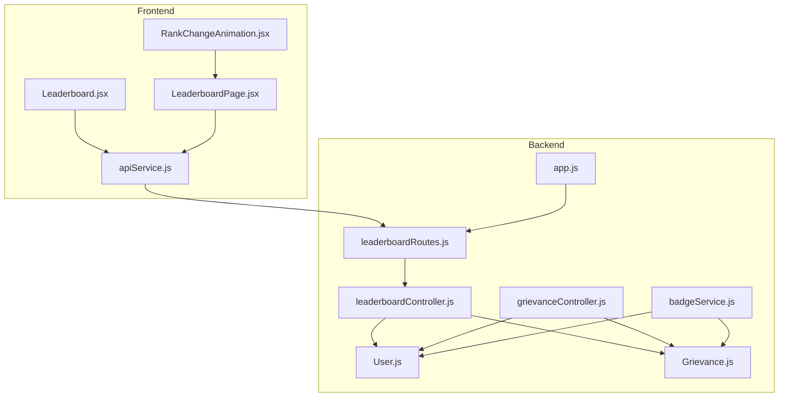
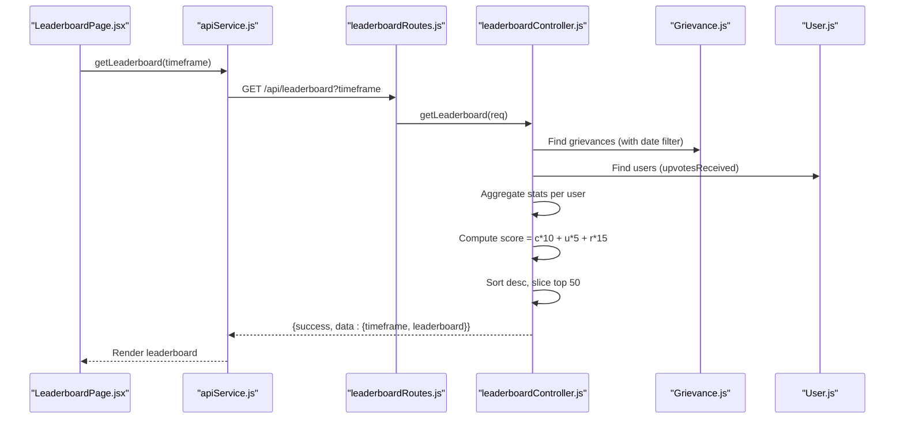
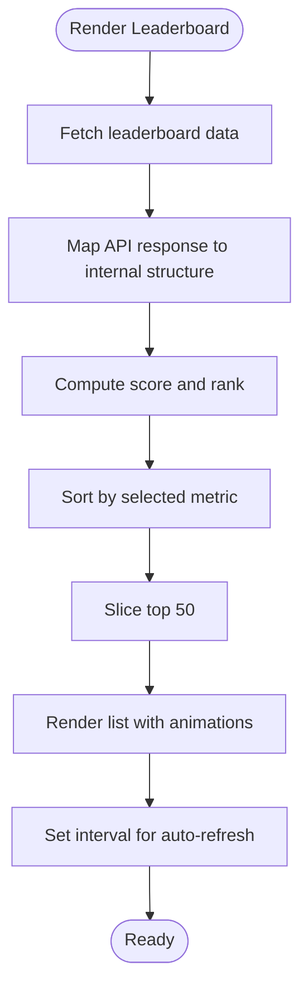
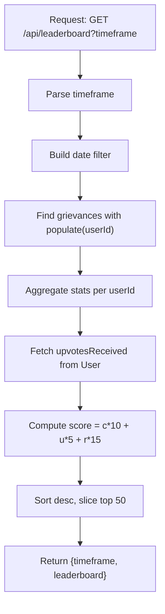
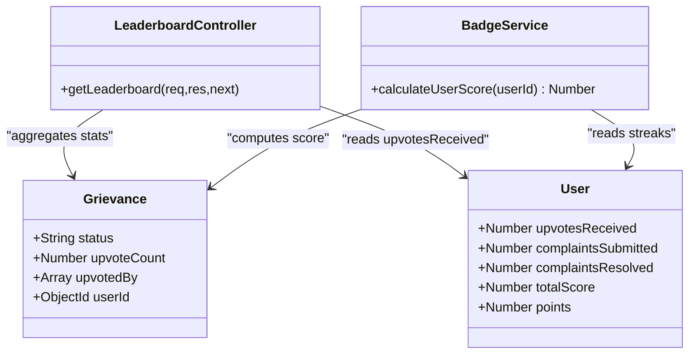
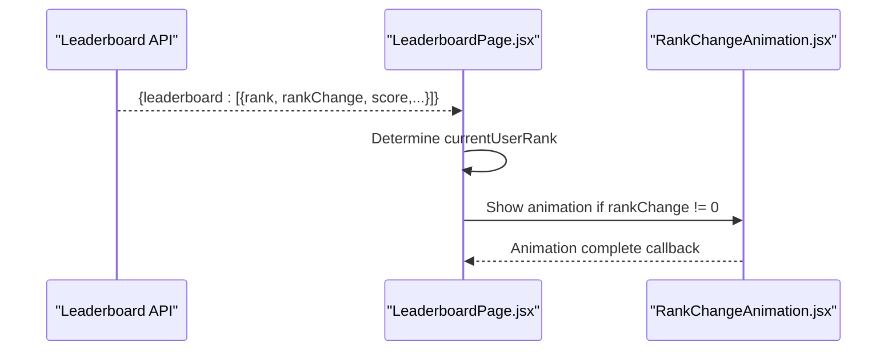
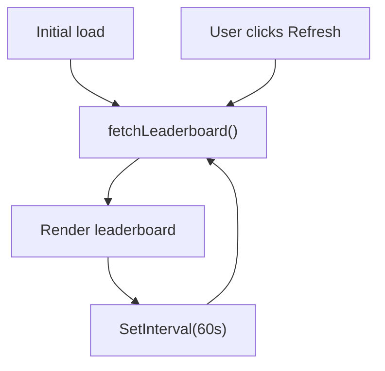
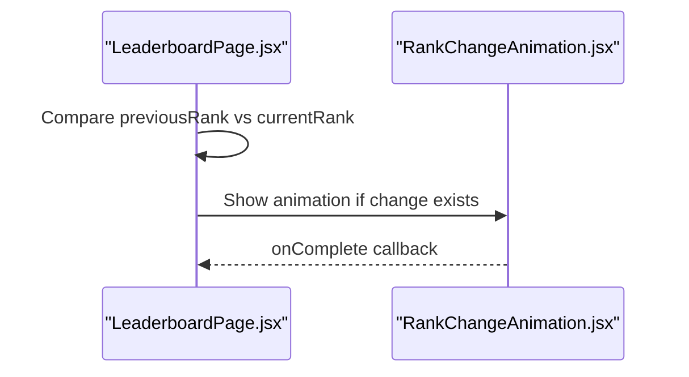
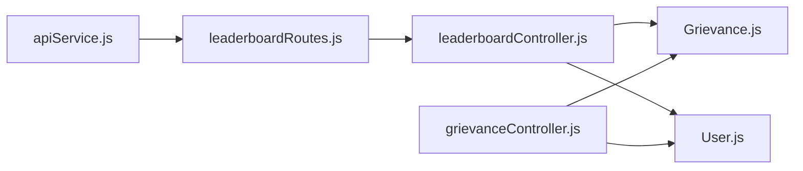

# Leaderboard & Ranking System

<cite>
**Referenced Files in This Document**
- [Leaderboard.jsx](file://Frontend/src/components/Leaderboard.jsx)
- [LeaderboardPage.jsx](file://Frontend/src/pages/LeaderboardPage.jsx)
- [RankChangeAnimation.jsx](file://Frontend/src/components/RankChangeAnimation.jsx)
- [apiService.js](file://Frontend/src/services/apiService.js)
- [leaderboardController.js](file://backend/src/controllers/leaderboardController.js)
- [leaderboardRoutes.js](file://backend/src/routes/leaderboardRoutes.js)
- [grievanceController.js](file://backend/src/controllers/grievanceController.js)
- [badgeService.js](file://backend/src/services/badgeService.js)
- [User.js](file://backend/src/models/User.js)
- [Grievance.js](file://backend/src/models/Grievance.js)
- [app.js](file://backend/src/app.js)
</cite>

## Table of Contents
1. [Introduction](#introduction)
2. [Project Structure](#project-structure)
3. [Core Components](#core-components)
4. [Architecture Overview](#architecture-overview)
5. [Detailed Component Analysis](#detailed-component-analysis)
6. [Dependency Analysis](#dependency-analysis)
7. [Performance Considerations](#performance-considerations)
8. [Troubleshooting Guide](#troubleshooting-guide)
9. [Conclusion](#conclusion)

## Introduction
This document explains the leaderboard and ranking system that powers community recognition for citizen contributions. It covers the scoring algorithm, ranking methodology, position updates, leaderboard refresh mechanisms, visual progress indicators, data structures, sorting logic, and performance optimizations for large user bases. It also includes examples of score calculations, rank positioning, and leaderboard display components.

## Project Structure
The leaderboard system spans the frontend React components and the backend Express API:
- Frontend: Leaderboard display components, animations, and API service integration
- Backend: Leaderboard controller, routes, models, and services that compute scores and ranks

**Diagram sources**
- [Leaderboard.jsx:1-358](file://Frontend/src/components/Leaderboard.jsx#L1-L358)
- [LeaderboardPage.jsx:1-438](file://Frontend/src/pages/LeaderboardPage.jsx#L1-L438)
- [RankChangeAnimation.jsx:1-158](file://Frontend/src/components/RankChangeAnimation.jsx#L1-L158)
- [apiService.js:64-90](file://Frontend/src/services/apiService.js#L64-L90)
- [leaderboardRoutes.js:1-14](file://backend/src/routes/leaderboardRoutes.js#L1-L14)
- [leaderboardController.js:1-158](file://backend/src/controllers/leaderboardController.js#L1-L158)
- [grievanceController.js:451-493](file://backend/src/controllers/grievanceController.js#L451-L493)
- [badgeService.js:149-195](file://backend/src/services/badgeService.js#L149-L195)
- [User.js:1-165](file://backend/src/models/User.js#L1-L165)
- [Grievance.js:1-115](file://backend/src/models/Grievance.js#L1-L115)
- [app.js:49-49](file://backend/src/app.js#L49-L49)

**Section sources**
- [Leaderboard.jsx:1-358](file://Frontend/src/components/Leaderboard.jsx#L1-L358)
- [LeaderboardPage.jsx:1-438](file://Frontend/src/pages/LeaderboardPage.jsx#L1-L438)
- [RankChangeAnimation.jsx:1-158](file://Frontend/src/components/RankChangeAnimation.jsx#L1-L158)
- [apiService.js:64-90](file://Frontend/src/services/apiService.js#L64-L90)
- [leaderboardController.js:1-158](file://backend/src/controllers/leaderboardController.js#L1-L158)
- [leaderboardRoutes.js:1-14](file://backend/src/routes/leaderboardRoutes.js#L1-L14)
- [grievanceController.js:451-493](file://backend/src/controllers/grievanceController.js#L451-L493)
- [badgeService.js:149-195](file://backend/src/services/badgeService.js#L149-L195)
- [User.js:1-165](file://backend/src/models/User.js#L1-L165)
- [Grievance.js:1-115](file://backend/src/models/Grievance.js#L1-L115)
- [app.js:49-49](file://backend/src/app.js#L49-L49)

## Core Components
- Frontend leaderboard displays:
  - Overall leaderboard with score-based ranking
  - Category-specific leaderboards (reports, upvotes)
  - Timeframe filters (all-time, month, week)
  - Animated rank change indicators and user progress cards
- Backend leaderboard computation:
  - Aggregates grievances per user and computes scores
  - Applies timeframe filters
  - Sorts and slices top 50 users
- Real-time updates:
  - Manual refresh button
  - Automatic refresh every 60 seconds
- Scoring algorithm:
  - Points = (complaints × 10) + (upvotes × 5) + (resolved × 15)
  - Upvotes are tracked via the User model’s upvotesReceived field
  - Resolved counts come from Grievance status

**Section sources**
- [Leaderboard.jsx:17-44](file://Frontend/src/components/Leaderboard.jsx#L17-L44)
- [LeaderboardPage.jsx:29-80](file://Frontend/src/pages/LeaderboardPage.jsx#L29-L80)
- [leaderboardController.js:67-97](file://backend/src/controllers/leaderboardController.js#L67-L97)
- [grievanceController.js:480-493](file://backend/src/controllers/grievanceController.js#L480-L493)
- [badgeService.js:183-195](file://backend/src/services/badgeService.js#L183-L195)

## Architecture Overview
The leaderboard pipeline integrates frontend and backend components:

**Diagram sources**
- [LeaderboardPage.jsx:55-80](file://Frontend/src/pages/LeaderboardPage.jsx#L55-L80)
- [apiService.js:64-90](file://Frontend/src/services/apiService.js#L64-L90)
- [leaderboardRoutes.js:9-11](file://backend/src/routes/leaderboardRoutes.js#L9-L11)
- [leaderboardController.js:9-97](file://backend/src/controllers/leaderboardController.js#L9-L97)
- [Grievance.js:1-115](file://backend/src/models/Grievance.js#L1-L115)
- [User.js:1-165](file://backend/src/models/User.js#L1-L165)

## Detailed Component Analysis

### Frontend Leaderboard Components
- LeaderboardPage.jsx
  - Manages timeframe selection (all, month, week)
  - Auto-refreshes every 60 seconds
  - Computes user rank and percentile
  - Renders rank badges, level progress, and animated rank changes
- Leaderboard.jsx
  - Simplified leaderboard for embedded use
  - Supports overall, complaints, and upvotes tabs
  - Uses Framer Motion for staggered list animations
- RankChangeAnimation.jsx
  - Visual animation for rank improvements or declines
  - Provides contextual messaging and particle effects

**Diagram sources**
- [LeaderboardPage.jsx:55-80](file://Frontend/src/pages/LeaderboardPage.jsx#L55-L80)
- [Leaderboard.jsx:21-44](file://Frontend/src/components/Leaderboard.jsx#L21-L44)

**Section sources**
- [LeaderboardPage.jsx:21-80](file://Frontend/src/pages/LeaderboardPage.jsx#L21-L80)
- [Leaderboard.jsx:12-44](file://Frontend/src/components/Leaderboard.jsx#L12-L44)
- [RankChangeAnimation.jsx:5-154](file://Frontend/src/components/RankChangeAnimation.jsx#L5-L154)

### Backend Leaderboard Controller
- Computes timeframe-based filters (all, week, month)
- Aggregates grievances per user and counts:
  - Total complaints
  - Resolved complaints
- Fetches upvotesReceived from User model
- Calculates score per user and sorts descending
- Returns top 50 users with rank and rankChange placeholder

**Diagram sources**
- [leaderboardController.js:9-97](file://backend/src/controllers/leaderboardController.js#L9-L97)
- [Grievance.js:1-115](file://backend/src/models/Grievance.js#L1-L115)
- [User.js:1-165](file://backend/src/models/User.js#L1-L165)

**Section sources**
- [leaderboardController.js:9-97](file://backend/src/controllers/leaderboardController.js#L9-L97)

### Scoring Algorithm and Data Flow
- Scoring formula: (complaints × 10) + (upvotes × 5) + (resolved × 15)
- Upvotes are tracked in User.upvotesReceived
- Resolved counts are derived from Grievance.status
- Badge service also computes dynamic scores for badge checks

**Diagram sources**
- [User.js:45-48](file://backend/src/models/User.js#L45-L48)
- [Grievance.js:29-59](file://backend/src/models/Grievance.js#L29-L59)
- [leaderboardController.js:67-97](file://backend/src/controllers/leaderboardController.js#L67-L97)
- [badgeService.js:183-195](file://backend/src/services/badgeService.js#L183-L195)

**Section sources**
- [grievanceController.js:480-493](file://backend/src/controllers/grievanceController.js#L480-L493)
- [badgeService.js:183-195](file://backend/src/services/badgeService.js#L183-L195)

### Ranking Calculation and Position Updates
- Ranking is computed server-side by sorting scores in descending order
- Each user receives a rank number (1..n)
- rankChange is included in the API response but is set to 0 in the current implementation
- Frontend components render rank icons and animated rank change indicators

**Diagram sources**
- [LeaderboardPage.jsx:48-53](file://Frontend/src/pages/LeaderboardPage.jsx#L48-L53)
- [RankChangeAnimation.jsx:10-24](file://Frontend/src/components/RankChangeAnimation.jsx#L10-L24)

**Section sources**
- [LeaderboardPage.jsx:48-53](file://Frontend/src/pages/LeaderboardPage.jsx#L48-L53)
- [RankChangeAnimation.jsx:10-24](file://Frontend/src/components/RankChangeAnimation.jsx#L10-L24)

### Leaderboard Refresh Mechanisms
- Manual refresh: Button triggers immediate fetch
- Auto-refresh: Interval-based refresh every 60 seconds
- Timeframe filters: All-time, month, week

**Diagram sources**
- [LeaderboardPage.jsx:33-46](file://Frontend/src/pages/LeaderboardPage.jsx#L33-L46)

**Section sources**
- [LeaderboardPage.jsx:33-46](file://Frontend/src/pages/LeaderboardPage.jsx#L33-L46)

### Rank Change Animations and Visual Indicators
- Animated rank change indicators show movement direction and magnitude
- Specialized animation component renders visual feedback for rank improvements or declines
- Icons and colors differentiate top three ranks and highlight current user

**Diagram sources**
- [RankChangeAnimation.jsx:10-24](file://Frontend/src/components/RankChangeAnimation.jsx#L10-L24)

**Section sources**
- [RankChangeAnimation.jsx:10-24](file://Frontend/src/components/RankChangeAnimation.jsx#L10-L24)

### Examples of Score Calculations, Rank Positioning, and Display
- Example 1: A user with 3 reports, 2 upvotes, 1 resolved
  - Score = (3 × 10) + (2 × 5) + (1 × 15) = 30 + 10 + 15 = 55
- Example 2: A user with 1 report, 6 upvotes, 2 resolved
  - Score = (1 × 10) + (6 × 5) + (2 × 15) = 10 + 30 + 30 = 70
- Rank positioning: Sorted by score descending; ties are broken by insertion order (MongoDB sort stability)
- Display components:
  - LeaderboardPage.jsx: renders user avatars, level badges, progress bars, and rank badges
  - Leaderboard.jsx: simplified layout with tabbed views for overall, reports, and upvotes

**Section sources**
- [leaderboardController.js:67-97](file://backend/src/controllers/leaderboardController.js#L67-L97)
- [LeaderboardPage.jsx:390-430](file://Frontend/src/pages/LeaderboardPage.jsx#L390-L430)
- [Leaderboard.jsx:193-227](file://Frontend/src/components/Leaderboard.jsx#L193-L227)

## Dependency Analysis
- Frontend depends on apiService for leaderboard requests
- Backend routes mount leaderboard controller
- Leaderboard controller depends on Grievance and User models
- Upvote increments in grievanceController update User.upvotesReceived and owner points

**Diagram sources**
- [apiService.js:64-90](file://Frontend/src/services/apiService.js#L64-L90)
- [leaderboardRoutes.js:1-14](file://backend/src/routes/leaderboardRoutes.js#L1-L14)
- [leaderboardController.js:1-97](file://backend/src/controllers/leaderboardController.js#L1-L97)
- [Grievance.js:1-115](file://backend/src/models/Grievance.js#L1-L115)
- [User.js:1-165](file://backend/src/models/User.js#L1-L165)
- [grievanceController.js:480-493](file://backend/src/controllers/grievanceController.js#L480-L493)

**Section sources**
- [app.js:49-49](file://backend/src/app.js#L49-L49)
- [leaderboardController.js:1-97](file://backend/src/controllers/leaderboardController.js#L1-L97)
- [grievanceController.js:480-493](file://backend/src/controllers/grievanceController.js#L480-L493)

## Performance Considerations
- Database indexes:
  - User: totalScore, points, upvotesReceived (descending for leaderboard)
  - Grievance: upvoteCount (descending), status, userId, createdAt (descending)
- Aggregation strategy:
  - Server-side aggregation minimizes payload size and ensures accurate counts
- Pagination:
  - Backend slices top 50 users to limit rendering cost
- Sorting complexity:
  - O(n log n) due to sort after aggregation; acceptable for moderate user bases
- Recommendations:
  - Consider materialized leaderboard snapshots for very large datasets
  - Add server-side caching with expiry aligned to refresh intervals
  - Use capped collections or periodic pruning for grievance history to keep aggregations fast

**Section sources**
- [User.js:158-165](file://backend/src/models/User.js#L158-L165)
- [Grievance.js:102-113](file://backend/src/models/Grievance.js#L102-L113)
- [leaderboardController.js:73-74](file://backend/src/controllers/leaderboardController.js#L73-L74)

## Troubleshooting Guide
- No contributors displayed:
  - Verify leaderboard API returns data and timeframe filter is correct
  - Check frontend loading states and empty-state rendering
- Incorrect scores:
  - Confirm upvotesReceived reflects actual upvotes
  - Ensure resolved counts are based on Grievance.status
- Rank not updating:
  - Confirm leaderboard refresh is triggered (manual or auto)
  - Check that rankChange is being calculated and passed to animation component
- Performance issues:
  - Review database indexes and query plans
  - Monitor aggregation size and consider snapshotting leaderboard periodically

**Section sources**
- [LeaderboardPage.jsx:270-282](file://Frontend/src/pages/LeaderboardPage.jsx#L270-L282)
- [Leaderboard.jsx:120-136](file://Frontend/src/components/Leaderboard.jsx#L120-L136)
- [leaderboardController.js:67-97](file://backend/src/controllers/leaderboardController.js#L67-L97)

## Conclusion
The leaderboard and ranking system combines robust backend aggregation with engaging frontend presentation. Scores are computed from real-time data, ensuring fairness and accuracy. The system supports timeframe filtering, automatic and manual refresh, and rich visual feedback for user progress. With appropriate indexing and potential caching, it scales effectively for growing communities.