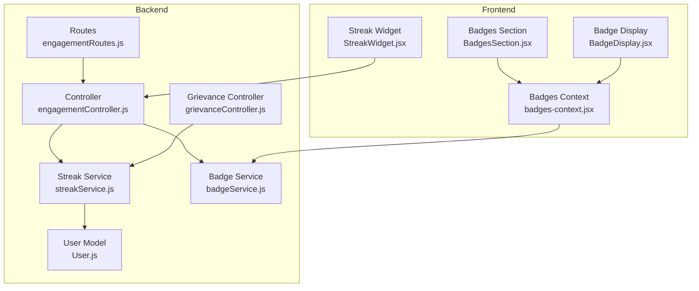
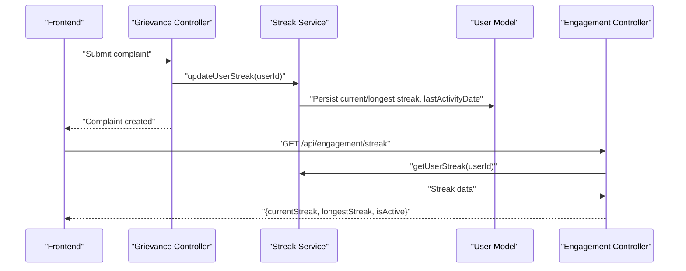
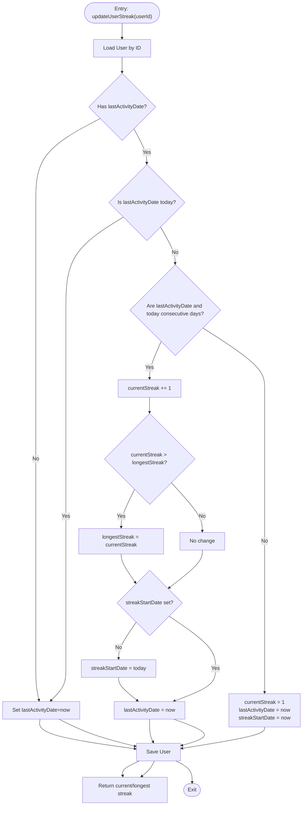
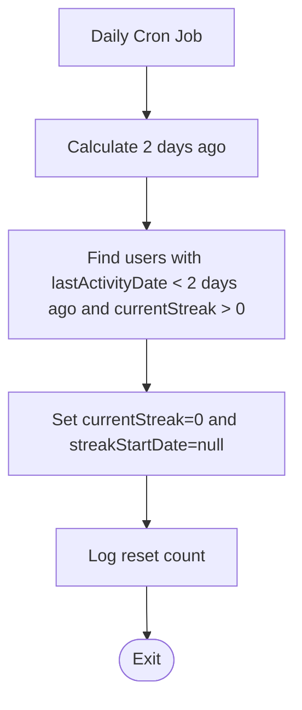
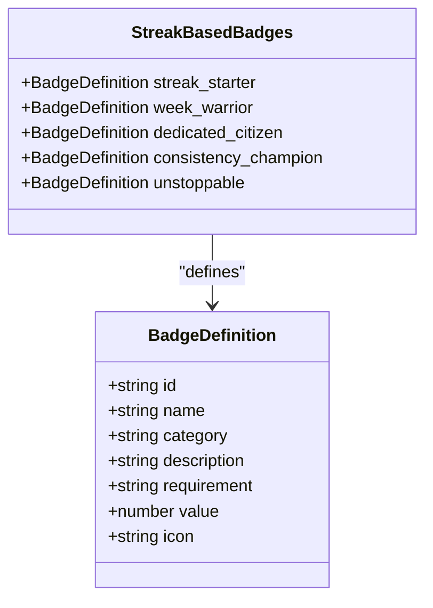
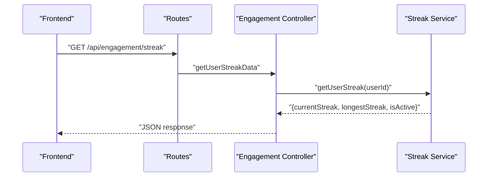
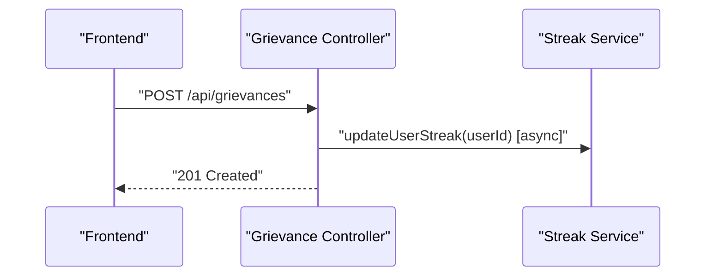
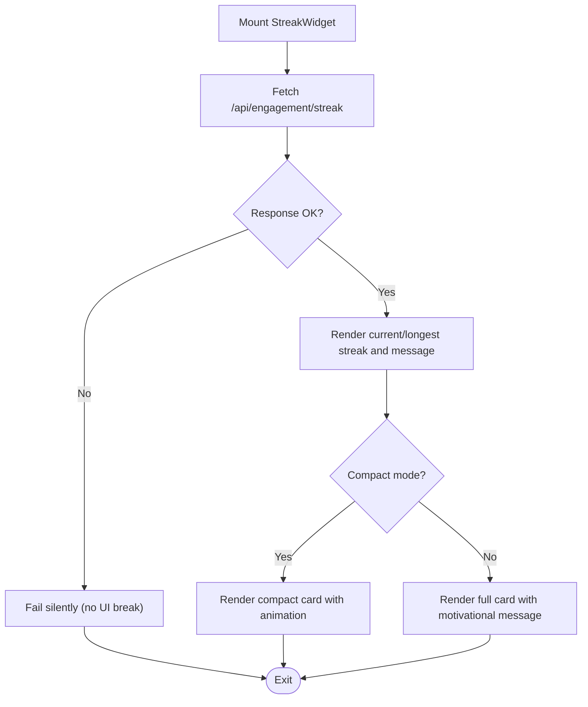
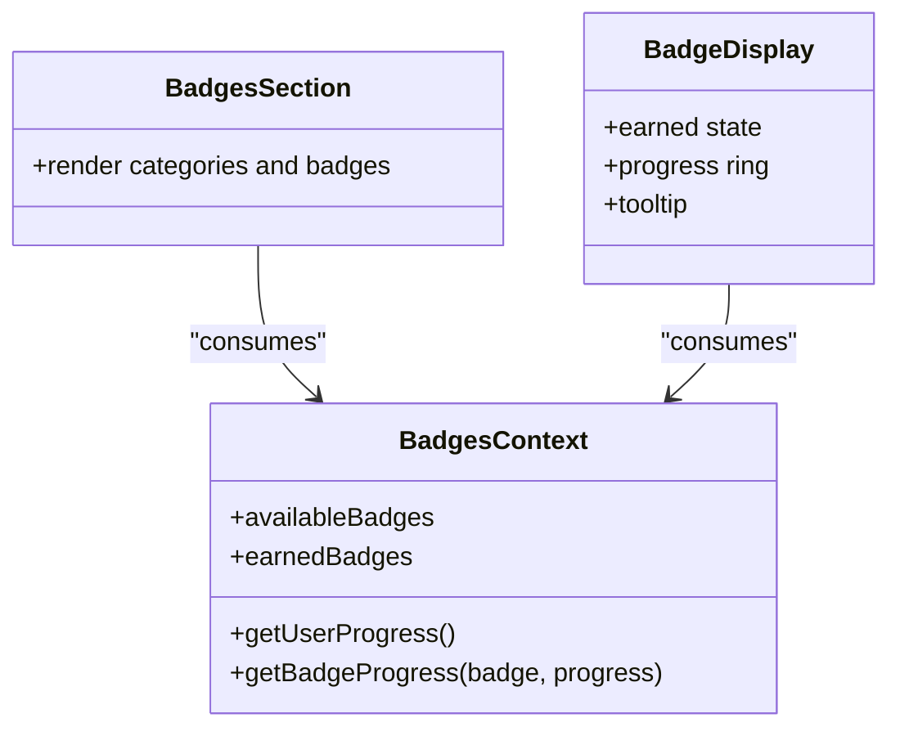
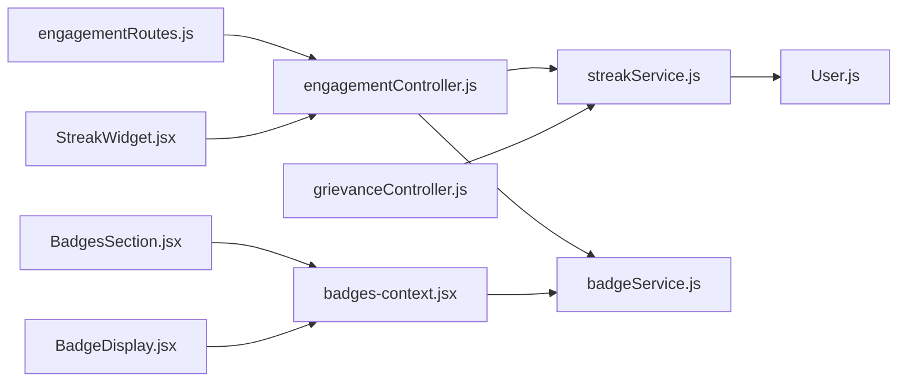

# Streak & Activity Tracking

<cite>
**Referenced Files in This Document**
- [streakService.js](file://backend/src/services/gamification/streakService.js)
- [engagementController.js](file://backend/src/controllers/engagementController.js)
- [engagementRoutes.js](file://backend/src/routes/engagementRoutes.js)
- [grievanceController.js](file://backend/src/controllers/grievanceController.js)
- [badgeService.js](file://backend/src/services/badgeService.js)
- [User.js](file://backend/src/models/User.js)
- [StreakWidget.jsx](file://Frontend/src/components/engagement/StreakWidget.jsx)
- [BadgesSection.jsx](file://Frontend/src/components/BadgesSection.jsx)
- [BadgeDisplay.jsx](file://Frontend/src/components/BadgeDisplay.jsx)
- [badges-context.jsx](file://Frontend/src/context/badges-context.jsx)
</cite>

## Table of Contents
1. [Introduction](#introduction)
2. [Project Structure](#project-structure)
3. [Core Components](#core-components)
4. [Architecture Overview](#architecture-overview)
5. [Detailed Component Analysis](#detailed-component-analysis)
6. [Dependency Analysis](#dependency-analysis)
7. [Performance Considerations](#performance-considerations)
8. [Troubleshooting Guide](#troubleshooting-guide)
9. [Conclusion](#conclusion)

## Introduction
This document explains the streak and activity tracking system, covering streak calculation logic, daily activity detection, streak preservation strategies, streak-based badges, and the streak widget UI. It also provides implementation examples for updating streaks, logging activities, and persisting streak data.

## Project Structure
The streak and activity tracking spans backend services and frontend UI components:
- Backend gamification service manages streak calculations and persistence.
- Controllers expose endpoints for streak retrieval and leaderboard.
- Routes protect and expose engagement features.
- Frontend widgets render streak data and motivate users.
- Badge service computes streak-based badges dynamically.

**Diagram sources**
- [engagementRoutes.js:1-37](file://backend/src/routes/engagementRoutes.js#L1-L37)
- [engagementController.js:1-225](file://backend/src/controllers/engagementController.js#L1-L225)
- [streakService.js:1-237](file://backend/src/services/gamification/streakService.js#L1-L237)
- [grievanceController.js:1-752](file://backend/src/controllers/grievanceController.js#L1-L752)
- [User.js:1-165](file://backend/src/models/User.js#L1-L165)
- [badgeService.js:1-285](file://backend/src/services/badgeService.js#L1-L285)
- [StreakWidget.jsx:1-165](file://Frontend/src/components/engagement/StreakWidget.jsx#L1-L165)
- [BadgesSection.jsx:1-153](file://Frontend/src/components/BadgesSection.jsx#L1-L153)
- [BadgeDisplay.jsx:1-186](file://Frontend/src/components/BadgeDisplay.jsx#L1-L186)
- [badges-context.jsx:1-143](file://Frontend/src/context/badges-context.jsx#L1-L143)

**Section sources**
- [engagementRoutes.js:1-37](file://backend/src/routes/engagementRoutes.js#L1-L37)
- [engagementController.js:1-225](file://backend/src/controllers/engagementController.js#L1-L225)
- [streakService.js:1-237](file://backend/src/services/gamification/streakService.js#L1-L237)
- [grievanceController.js:1-752](file://backend/src/controllers/grievanceController.js#L1-L752)
- [User.js:1-165](file://backend/src/models/User.js#L1-L165)
- [badgeService.js:1-285](file://backend/src/services/badgeService.js#L1-L285)
- [StreakWidget.jsx:1-165](file://Frontend/src/components/engagement/StreakWidget.jsx#L1-L165)
- [BadgesSection.jsx:1-153](file://Frontend/src/components/BadgesSection.jsx#L1-L153)
- [BadgeDisplay.jsx:1-186](file://Frontend/src/components/BadgeDisplay.jsx#L1-L186)
- [badges-context.jsx:1-143](file://Frontend/src/context/badges-context.jsx#L1-L143)

## Core Components
- Streak Service: Calculates and persists streaks, detects consecutive activity, resets streaks after inactivity windows, and exposes leaderboard queries.
- Engagement Controller: Exposes endpoints for user streak data, top streaks, and integrates with badge checks.
- Grievance Controller: Triggers streak updates upon user activities (e.g., complaint submission).
- User Model: Stores streak fields (current, longest, last activity date, streak start date).
- Badge Service: Defines streak-based badges and computes progress dynamically from user stats.
- Frontend Streak Widget: Fetches and renders streak data with visual feedback and motivational messaging.
- Badges UI: Renders available and earned streak-based badges and progress.

**Section sources**
- [streakService.js:1-237](file://backend/src/services/gamification/streakService.js#L1-L237)
- [engagementController.js:1-225](file://backend/src/controllers/engagementController.js#L1-L225)
- [grievanceController.js:180-206](file://backend/src/controllers/grievanceController.js#L180-L206)
- [User.js:85-101](file://backend/src/models/User.js#L85-L101)
- [badgeService.js:96-142](file://backend/src/services/badgeService.js#L96-L142)
- [StreakWidget.jsx:13-165](file://Frontend/src/components/engagement/StreakWidget.jsx#L13-L165)
- [BadgesSection.jsx:1-153](file://Frontend/src/components/BadgesSection.jsx#L1-L153)

## Architecture Overview
The streak system is event-driven: user actions trigger asynchronous streak updates, and the UI consumes endpoints for real-time streak data. Streak persistence is handled by the User model, while badge eligibility is computed dynamically from user stats.

**Diagram sources**
- [grievanceController.js:180-206](file://backend/src/controllers/grievanceController.js#L180-L206)
- [streakService.js:43-114](file://backend/src/services/gamification/streakService.js#L43-L114)
- [User.js:85-101](file://backend/src/models/User.js#L85-L101)
- [engagementController.js:76-92](file://backend/src/controllers/engagementController.js#L76-L92)

## Detailed Component Analysis

### Streak Calculation Logic
- Consecutive day detection compares normalized dates (midnight) to ensure day boundaries.
- Today detection normalizes the last activity date to determine if the user already acted today.
- If consecutive, current streak increments and longest streak updates if exceeded; streak start date is set on first increment.
- If not consecutive, streak resets to 1, last activity date and streak start date are refreshed.
- Streak activity window considers a 48-hour grace period to mark a streak as active.

**Diagram sources**
- [streakService.js:43-114](file://backend/src/services/gamification/streakService.js#L43-L114)
- [streakService.js:18-34](file://backend/src/services/gamification/streakService.js#L18-L34)

**Section sources**
- [streakService.js:18-34](file://backend/src/services/gamification/streakService.js#L18-L34)
- [streakService.js:43-114](file://backend/src/services/gamification/streakService.js#L43-L114)

### Daily Activity Detection and Streak Preservation
- Activity detection uses midnight normalization to compare dates.
- Persistence occurs on every eligible activity, ensuring streak continuity even if the user does not log in daily.
- A daily cron job resets streaks for users inactive beyond a 48-hour window, preventing stale streaks.

**Diagram sources**
- [streakService.js:199-228](file://backend/src/services/gamification/streakService.js#L199-L228)

**Section sources**
- [streakService.js:199-228](file://backend/src/services/gamification/streakService.js#L199-L228)

### Streak-Based Badges
Streak-based badges are defined with current or longest streak thresholds:
- Streak Starter: currentStreak ≥ 3
- Week Warrior: currentStreak ≥ 7
- Dedicated Citizen: currentStreak ≥ 14
- Consistency Champion: currentStreak ≥ 30
- Unstoppable: longestStreak ≥ 60

Eligibility is computed dynamically from user stats, including current and longest streak values.

**Diagram sources**
- [badgeService.js:96-142](file://backend/src/services/badgeService.js#L96-L142)

**Section sources**
- [badgeService.js:96-142](file://backend/src/services/badgeService.js#L96-L142)
- [badgeService.js:149-181](file://backend/src/services/badgeService.js#L149-L181)

### Streak Endpoint and Data Retrieval
- GET /api/engagement/streak returns current/longest streak and activity status.
- GET /api/engagement/streaks/top returns top streak holders.
- The controller aggregates streak data and wraps errors to avoid breaking the UI.

**Diagram sources**
- [engagementRoutes.js:24-26](file://backend/src/routes/engagementRoutes.js#L24-L26)
- [engagementController.js:76-92](file://backend/src/controllers/engagementController.js#L76-L92)
- [streakService.js:122-160](file://backend/src/services/gamification/streakService.js#L122-L160)

**Section sources**
- [engagementRoutes.js:24-26](file://backend/src/routes/engagementRoutes.js#L24-L26)
- [engagementController.js:76-92](file://backend/src/controllers/engagementController.js#L76-L92)
- [streakService.js:122-160](file://backend/src/services/gamification/streakService.js#L122-L160)

### Streak Updates on Activities
- On complaint submission, the grievance controller triggers asynchronous streak updates and optional challenge progress updates.
- This ensures streak logic does not block primary operations and remains resilient.

**Diagram sources**
- [grievanceController.js:180-206](file://backend/src/controllers/grievanceController.js#L180-L206)
- [streakService.js:43-114](file://backend/src/services/gamification/streakService.js#L43-L114)

**Section sources**
- [grievanceController.js:180-206](file://backend/src/controllers/grievanceController.js#L180-L206)
- [streakService.js:43-114](file://backend/src/services/gamification/streakService.js#L43-L114)

### Streak Widget UI and Motivation
- The Streak Widget fetches streak data and renders current/longest streaks, activity status, and motivational messages.
- Compact mode displays a minimal card with animated flame and best streak indicator.
- The widget gracefully handles loading and error states.

**Diagram sources**
- [StreakWidget.jsx:18-44](file://Frontend/src/components/engagement/StreakWidget.jsx#L18-L44)
- [StreakWidget.jsx:64-161](file://Frontend/src/components/engagement/StreakWidget.jsx#L64-L161)

**Section sources**
- [StreakWidget.jsx:13-165](file://Frontend/src/components/engagement/StreakWidget.jsx#L13-L165)

### Badges UI and Progress
- BadgesSection renders categories of badges, progress bars, and individual badge displays.
- BadgeDisplay shows earned/unearned states, progress rings, and tooltips.
- The badges context provides progress computation and user progress fetching.

**Diagram sources**
- [badges-context.jsx:1-143](file://Frontend/src/context/badges-context.jsx#L1-L143)
- [BadgesSection.jsx:1-153](file://Frontend/src/components/BadgesSection.jsx#L1-L153)
- [BadgeDisplay.jsx:1-186](file://Frontend/src/components/BadgeDisplay.jsx#L1-L186)

**Section sources**
- [badges-context.jsx:1-143](file://Frontend/src/context/badges-context.jsx#L1-L143)
- [BadgesSection.jsx:1-153](file://Frontend/src/components/BadgesSection.jsx#L1-L153)
- [BadgeDisplay.jsx:1-186](file://Frontend/src/components/BadgeDisplay.jsx#L1-L186)

## Dependency Analysis
- Backend: Routes depend on controllers; controllers depend on services and models; services depend on models and external systems.
- Frontend: Components depend on context and services; context depends on auth and API service.

**Diagram sources**
- [engagementRoutes.js:1-37](file://backend/src/routes/engagementRoutes.js#L1-L37)
- [engagementController.js:1-225](file://backend/src/controllers/engagementController.js#L1-L225)
- [streakService.js:1-237](file://backend/src/services/gamification/streakService.js#L1-L237)
- [grievanceController.js:1-752](file://backend/src/controllers/grievanceController.js#L1-L752)
- [User.js:1-165](file://backend/src/models/User.js#L1-L165)
- [badgeService.js:1-285](file://backend/src/services/badgeService.js#L1-L285)
- [StreakWidget.jsx:1-165](file://Frontend/src/components/engagement/StreakWidget.jsx#L1-L165)
- [BadgesSection.jsx:1-153](file://Frontend/src/components/BadgesSection.jsx#L1-L153)
- [BadgeDisplay.jsx:1-186](file://Frontend/src/components/BadgeDisplay.jsx#L1-L186)
- [badges-context.jsx:1-143](file://Frontend/src/context/badges-context.jsx#L1-L143)

**Section sources**
- [engagementRoutes.js:1-37](file://backend/src/routes/engagementRoutes.js#L1-L37)
- [engagementController.js:1-225](file://backend/src/controllers/engagementController.js#L1-L225)
- [streakService.js:1-237](file://backend/src/services/gamification/streakService.js#L1-L237)
- [grievanceController.js:1-752](file://backend/src/controllers/grievanceController.js#L1-L752)
- [User.js:1-165](file://backend/src/models/User.js#L1-L165)
- [badgeService.js:1-285](file://backend/src/services/badgeService.js#L1-L285)
- [StreakWidget.jsx:1-165](file://Frontend/src/components/engagement/StreakWidget.jsx#L1-L165)
- [BadgesSection.jsx:1-153](file://Frontend/src/components/BadgesSection.jsx#L1-L153)
- [BadgeDisplay.jsx:1-186](file://Frontend/src/components/BadgeDisplay.jsx#L1-L186)
- [badges-context.jsx:1-143](file://Frontend/src/context/badges-context.jsx#L1-L143)

## Performance Considerations
- Asynchronous engagement updates prevent blocking complaint submissions.
- Midnight normalization avoids timezone and time drift issues.
- Graceful degradation: UI continues rendering even if backend endpoints fail.
- Indexes on user fields (totalScore, points, upvotesReceived) support leaderboard queries and badge computations.

## Troubleshooting Guide
Common issues and resolutions:
- Streak not updating: Verify the feature flag is enabled and asynchronous update is invoked on user actions.
- Streak resets unexpectedly: Confirm the 48-hour reset policy and that the cron job runs as scheduled.
- UI shows stale data: Ensure the widget fetches fresh data and handles network errors without crashing.
- Badge eligibility incorrect: Confirm dynamic computation uses current/longest streak values and badge thresholds.

**Section sources**
- [streakService.js:13-15](file://backend/src/services/gamification/streakService.js#L13-L15)
- [streakService.js:199-228](file://backend/src/services/gamification/streakService.js#L199-L228)
- [StreakWidget.jsx:18-44](file://Frontend/src/components/engagement/StreakWidget.jsx#L18-L44)
- [badgeService.js:202-229](file://backend/src/services/badgeService.js#L202-L229)

## Conclusion
The streak and activity tracking system combines robust backend logic with resilient frontend UI. It maintains accurate streaks through daily activity detection, preserves streaks across sessions, and motivates users via streak-based badges and visual feedback. The modular design ensures scalability and maintainability.