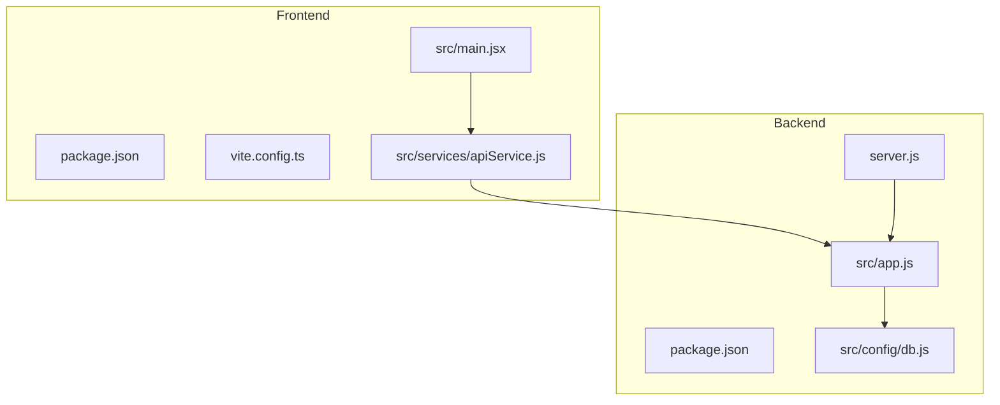
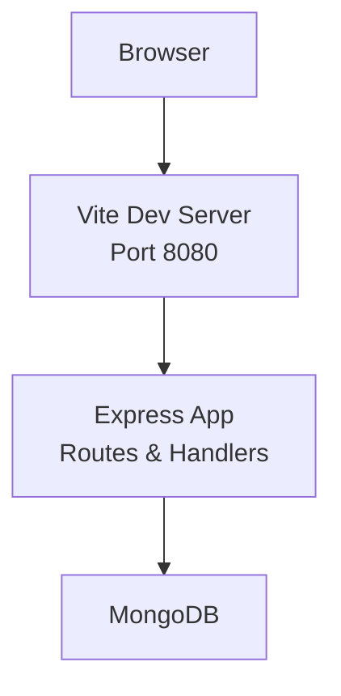

# Getting Started

<cite>
**Referenced Files in This Document**
- [Frontend README.md](file://Frontend/README.md)
- [Frontend package.json](file://Frontend/package.json)
- [Frontend vite.config.ts](file://Frontend/vite.config.ts)
- [Frontend tailwind.config.js](file://Frontend/tailwind.config.js)
- [Frontend components.json](file://Frontend/components.json)
- [Frontend tsconfig.json](file://Frontend/tsconfig.json)
- [Frontend src/main.jsx](file://Frontend/src/main.jsx)
- [Frontend src/services/apiService.js](file://Frontend/src/services/apiService.js)
- [backend package.json](file://backend/package.json)
- [backend server.js](file://backend/server.js)
- [backend src/app.js](file://backend/src/app.js)
- [backend src/config/db.js](file://backend/src/config/db.js)
- [backend src/middleware/errorMiddleware.js](file://backend/src/middleware/errorMiddleware.js)
</cite>

## Table of Contents
1. [Introduction](#introduction)
2. [Prerequisites](#prerequisites)
3. [Installation](#installation)
4. [Environment Configuration](#environment-configuration)
5. [Database Initialization](#database-initialization)
6. [Local Development Setup](#local-development-setup)
7. [Project Structure](#project-structure)
8. [Key Configuration Files](#key-configuration-files)
9. [Essential Environment Variables](#essential-environment-variables)
10. [Architecture Overview](#architecture-overview)
11. [Verification and Testing](#verification-and-testing)
12. [Troubleshooting Guide](#troubleshooting-guide)
13. [Conclusion](#conclusion)

## Introduction
This guide helps you install and run the Smart Voice Report platform locally. It covers prerequisites, step-by-step installation for both frontend and backend, environment configuration, database setup, and local development server startup. You will also learn the project structure, key configuration files, essential environment variables, and how to verify your installation.

## Prerequisites
Before installing the platform, ensure you have the following:
- Node.js and npm installed on your machine
- A compatible version of MongoDB (local instance or a hosted MongoDB service)
- Git for cloning the repository

These tools are required to build and run both the frontend and backend components.

**Section sources**
- [Frontend README.md:21](file://Frontend/README.md#L21)
- [backend package.json:10-22](file://backend/package.json#L10-L22)

## Installation
Follow these steps to install the platform locally:

### Step 1: Clone the repository
Clone the repository using your preferred Git method and navigate into the project directory.

### Step 2: Install backend dependencies
Navigate to the backend directory and install dependencies using npm.

```bash
cd backend
npm install
```

### Step 3: Install frontend dependencies
Navigate to the frontend directory and install dependencies using npm.

```bash
cd ../Frontend
npm install
```

### Step 4: Build frontend (optional)
Optionally build the frontend for production distribution.

```bash
npm run build
```

Verification: After installation, both directories should contain a `node_modules` folder and lock files indicating successful dependency installation.

**Section sources**
- [Frontend README.md:25-36](file://Frontend/README.md#L25-L36)
- [backend package.json:6-8](file://backend/package.json#L6-L8)
- [Frontend package.json:13-70](file://Frontend/package.json#L13-L70)

## Environment Configuration
Configure environment variables for both frontend and backend to enable proper operation.

### Backend environment variables
Set the following environment variable for the backend:
- MONGO_URI: The MongoDB connection string used by the backend to connect to the database.

The backend reads these variables at runtime and throws a clear error if required variables are missing.

### Frontend environment variables
The frontend expects the backend API to be reachable at a specific URL. The frontend service client is configured to communicate with the backend API at http://localhost:3000/api.

Verification: Confirm that the frontend API base URL matches your backend port and that CORS is enabled on the backend.

**Section sources**
- [backend src/config/db.js:4-8](file://backend/src/config/db.js#L4-L8)
- [backend src/app.js:34-37](file://backend/src/app.js#L34-L37)
- [Frontend src/services/apiService.js:2](file://Frontend/src/services/apiService.js#L2)

## Database Initialization
Initialize the database by ensuring MongoDB is running and providing a valid connection string via the MONGO_URI environment variable.

Steps:
1. Start your MongoDB instance (local or cloud-hosted).
2. Set the MONGO_URI environment variable to point to your MongoDB instance.
3. Start the backend server so it connects to the database.

Verification:
- The backend logs a success message upon connecting to MongoDB.
- The backend health endpoint responds with a 200 OK status.

**Section sources**
- [backend src/config/db.js:12-14](file://backend/src/config/db.js#L12-L14)
- [backend server.js:10-14](file://backend/server.js#L10-L14)
- [backend src/app.js:39-41](file://backend/src/app.js#L39-L41)

## Local Development Setup
Start both the frontend and backend servers for local development.

### Backend development server
From the backend directory, start the development server using nodemon for automatic restarts on changes.

```bash
cd backend
npm run dev
```

The backend server listens on the port defined by the PORT environment variable (default 3000) and logs the port number upon successful startup.

### Frontend development server
From the frontend directory, start the Vite development server.

```bash
cd Frontend
npm run dev
```

The frontend server listens on the port defined in the Vite configuration (default 8080) and serves the React application with hot module replacement.

Verification:
- The backend logs "Server running on port ..." after connecting to the database.
- The frontend renders the application and logs success messages during initialization.

**Section sources**
- [backend package.json:8](file://backend/package.json#L8)
- [backend server.js:7](file://backend/server.js#L7)
- [backend server.js:12-14](file://backend/server.js#L12-L14)
- [Frontend vite.config.ts:8-16](file://Frontend/vite.config.ts#L8-L16)
- [Frontend src/main.jsx:18-23](file://Frontend/src/main.jsx#L18-L23)

## Project Structure
The repository is organized into two major parts:
- Frontend: React application with TypeScript, Vite, Tailwind CSS, and shadcn/ui components.
- Backend: Express.js server with Mongoose for MongoDB connectivity and modular route/controller/service architecture.



**Diagram sources**
- [Frontend package.json:1-92](file://Frontend/package.json#L1-L92)
- [Frontend vite.config.ts:1-39](file://Frontend/vite.config.ts#L1-L39)
- [Frontend src/main.jsx:1-24](file://Frontend/src/main.jsx#L1-L24)
- [Frontend src/services/apiService.js:1-539](file://Frontend/src/services/apiService.js#L1-L539)
- [backend package.json:1-28](file://backend/package.json#L1-L28)
- [backend server.js:1-22](file://backend/server.js#L1-L22)
- [backend src/app.js:1-71](file://backend/src/app.js#L1-L71)
- [backend src/config/db.js:1-18](file://backend/src/config/db.js#L1-L18)

**Section sources**
- [Frontend package.json:1-92](file://Frontend/package.json#L1-L92)
- [backend package.json:1-28](file://backend/package.json#L1-L28)

## Key Configuration Files
Review these key configuration files to understand project behavior and customization points:

- Frontend
  - vite.config.ts: Defines development server host/port, caching headers, aliases, and build optimizations.
  - tailwind.config.js: Configures Tailwind CSS theme, animations, and content paths.
  - components.json: Defines shadcn/ui aliases and Tailwind integration.
  - tsconfig.json: Sets up TypeScript path aliases and compiler options.
  - src/main.jsx: Application entry point with global error handlers and rendering logic.

- Backend
  - server.js: Loads environment variables, initializes the database connection, and starts the Express app.
  - src/app.js: Registers middleware, CORS, logging, routes, and error handlers.
  - src/config/db.js: Establishes MongoDB connection using MONGO_URI.
  - src/middleware/errorMiddleware.js: Centralized 404 and error handling logic.

**Section sources**
- [Frontend vite.config.ts:7-38](file://Frontend/vite.config.ts#L7-L38)
- [Frontend tailwind.config.js:1-120](file://Frontend/tailwind.config.js#L1-L120)
- [Frontend components.json:1-21](file://Frontend/components.json#L1-L21)
- [Frontend tsconfig.json:1-17](file://Frontend/tsconfig.json#L1-L17)
- [Frontend src/main.jsx:1-24](file://Frontend/src/main.jsx#L1-L24)
- [backend server.js:1-22](file://backend/server.js#L1-L22)
- [backend src/app.js:1-71](file://backend/src/app.js#L1-L71)
- [backend src/config/db.js:1-18](file://backend/src/config/db.js#L1-L18)
- [backend src/middleware/errorMiddleware.js:1-21](file://backend/src/middleware/errorMiddleware.js#L1-L21)

## Essential Environment Variables
Ensure the following environment variables are configured before running the platform:

- Backend
  - MONGO_URI: Required for MongoDB connection.
  - PORT: Optional; defaults to 3000 if not set.

- Frontend
  - API base URL: The frontend communicates with the backend at http://localhost:3000/api by default. Adjust this if your backend runs on a different host/port.

Verification:
- The backend throws a clear error if MONGO_URI is missing.
- The frontend logs successful rendering and network requests to the backend.

**Section sources**
- [backend src/config/db.js:4-8](file://backend/src/config/db.js#L4-L8)
- [backend server.js:7](file://backend/server.js#L7)
- [Frontend src/services/apiService.js:2](file://Frontend/src/services/apiService.js#L2)
- [Frontend src/main.jsx:18-23](file://Frontend/src/main.jsx#L18-L23)

## Architecture Overview
The platform follows a classic client-server architecture:
- The frontend (React/Vite) serves the user interface and communicates with the backend via REST APIs.
- The backend (Express/Mongoose) exposes REST endpoints and manages MongoDB data persistence.
- Middleware handles CORS, logging, and error responses.



**Diagram sources**
- [Frontend vite.config.ts:8-16](file://Frontend/vite.config.ts#L8-L16)
- [backend src/app.js:28-71](file://backend/src/app.js#L28-L71)
- [backend src/config/db.js:1-18](file://backend/src/config/db.js#L1-L18)

## Verification and Testing
After completing installation and configuration, verify your setup with the following steps:

- Health check
  - Call the backend health endpoint to confirm it is running.
  - Expected response: 200 OK with a status field.

- Database connection
  - Confirm the backend logs indicate a successful MongoDB connection.
  - Ensure the MONGO_URI is correct and accessible.

- Frontend rendering
  - Open the frontend in a browser and confirm it renders without errors.
  - Check the browser console for any global error logs.

- API connectivity
  - Use the frontend to perform basic actions (e.g., fetching leaderboard or user data) and verify network requests succeed.

**Section sources**
- [backend src/app.js:39-41](file://backend/src/app.js#L39-L41)
- [backend src/config/db.js:12-14](file://backend/src/config/db.js#L12-L14)
- [Frontend src/main.jsx:6-13](file://Frontend/src/main.jsx#L6-L13)
- [Frontend src/services/apiService.js:16-539](file://Frontend/src/services/apiService.js#L16-L539)

## Troubleshooting Guide
Common issues and resolutions:

- Missing MONGO_URI
  - Symptom: Backend fails to start with an error indicating the environment variable is not set.
  - Resolution: Set MONGO_URI to a valid MongoDB connection string.

- Port conflicts
  - Symptom: Backend or frontend fails to start due to port already in use.
  - Resolution: Change PORT (backend) or the Vite dev server port in vite.config.ts.

- CORS errors
  - Symptom: Frontend requests fail due to cross-origin restrictions.
  - Resolution: Ensure CORS is enabled on the backend and the frontend base URL matches the backend origin.

- MongoDB connectivity issues
  - Symptom: Backend logs indicate failure to connect to MongoDB.
  - Resolution: Verify the MongoDB instance is running, the connection string is correct, and network/firewall settings allow connections.

- Frontend rendering errors
  - Symptom: Application does not render or shows global errors.
  - Resolution: Check browser console for error logs and ensure environment variables are correctly loaded.

**Section sources**
- [backend src/config/db.js:6-8](file://backend/src/config/db.js#L6-L8)
- [backend server.js:15-18](file://backend/server.js#L15-L18)
- [backend src/app.js:34-37](file://backend/src/app.js#L34-L37)
- [Frontend vite.config.ts:8-16](file://Frontend/vite.config.ts#L8-L16)
- [Frontend src/main.jsx:6-13](file://Frontend/src/main.jsx#L6-L13)

## Conclusion
You have successfully installed the Smart Voice Report platform, configured environment variables, initialized the database, and started both frontend and backend servers. Use the verification and troubleshooting sections to ensure everything is working correctly. For further customization, explore the key configuration files and adjust ports, themes, and API endpoints as needed.