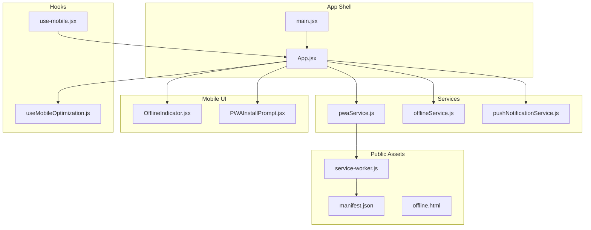
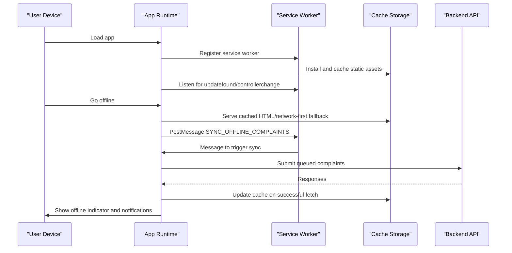
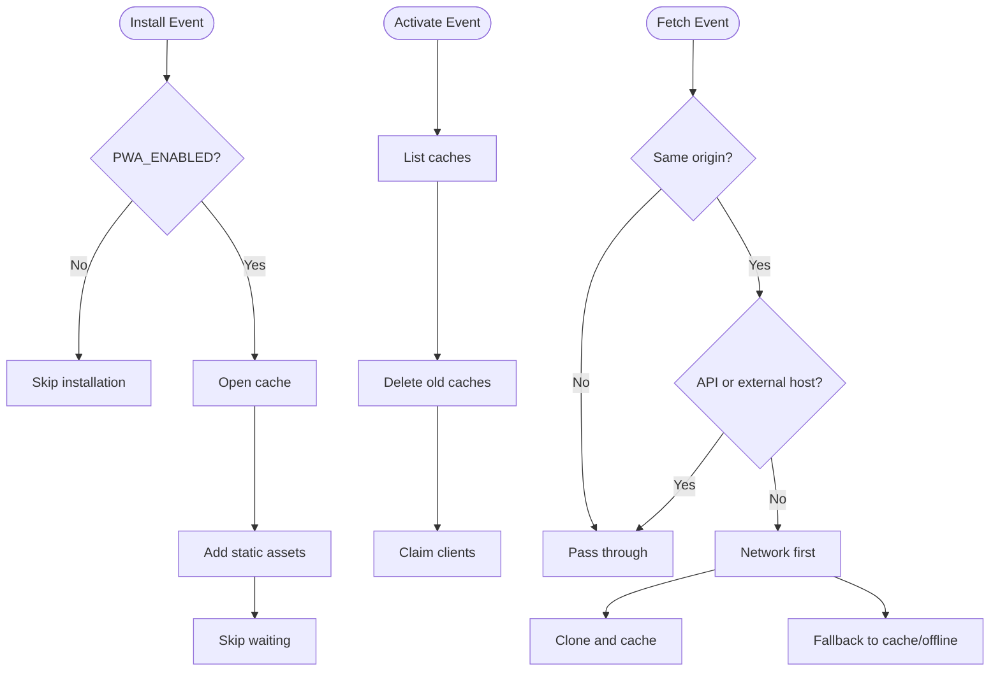
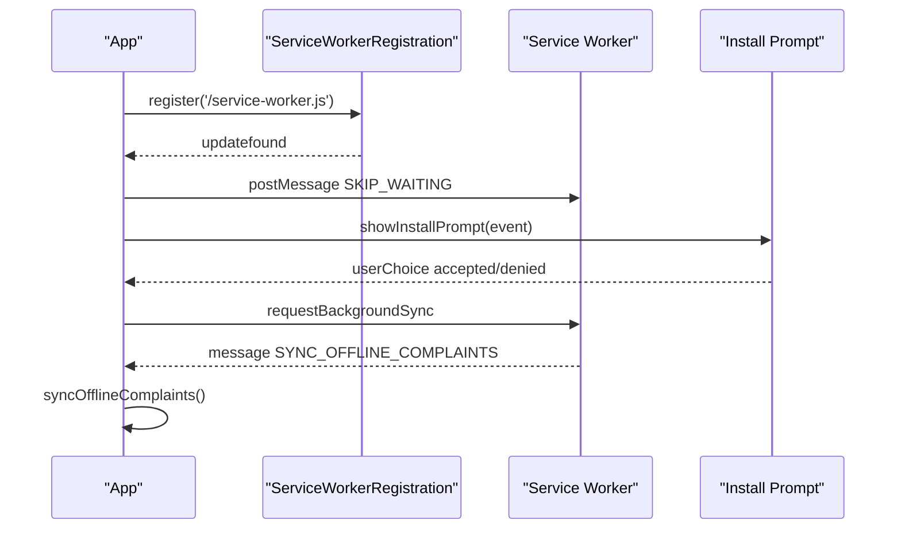
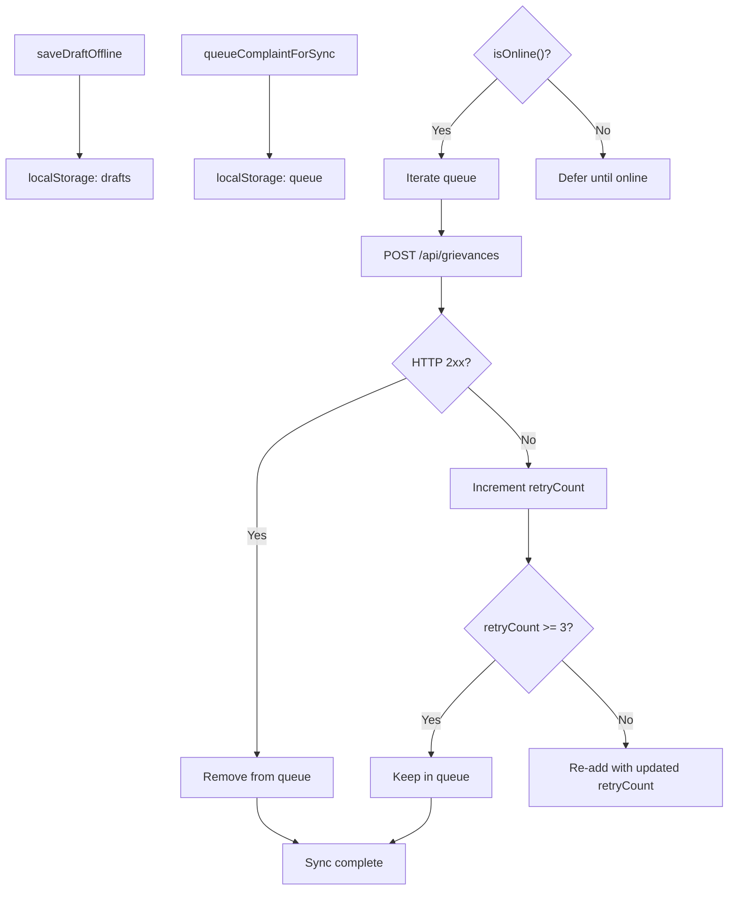
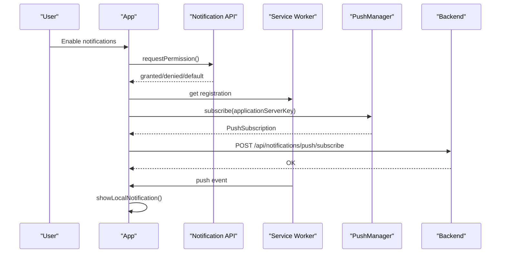
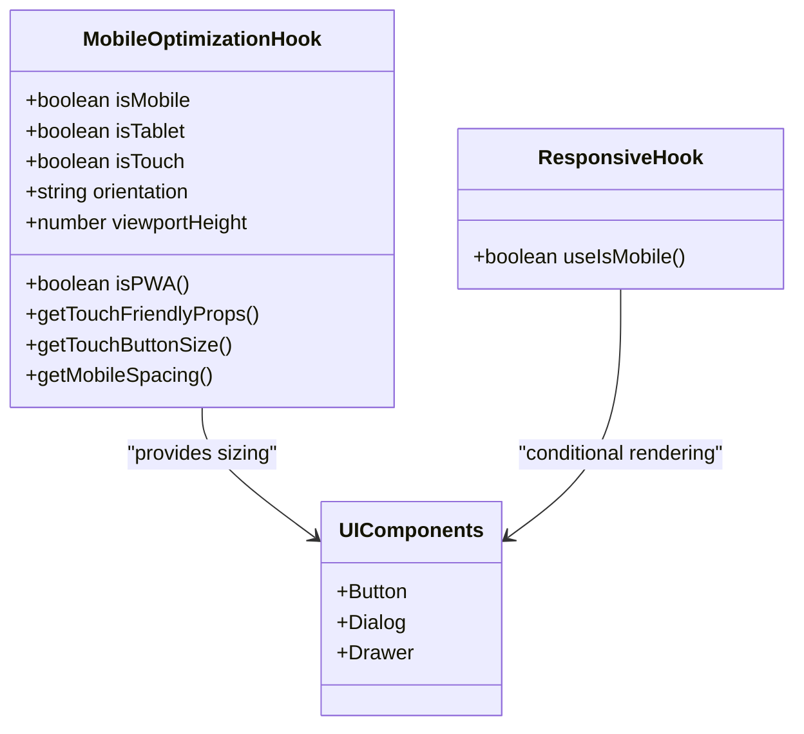
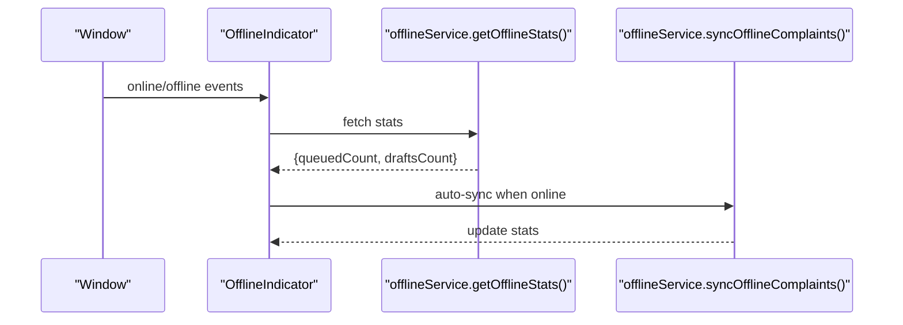
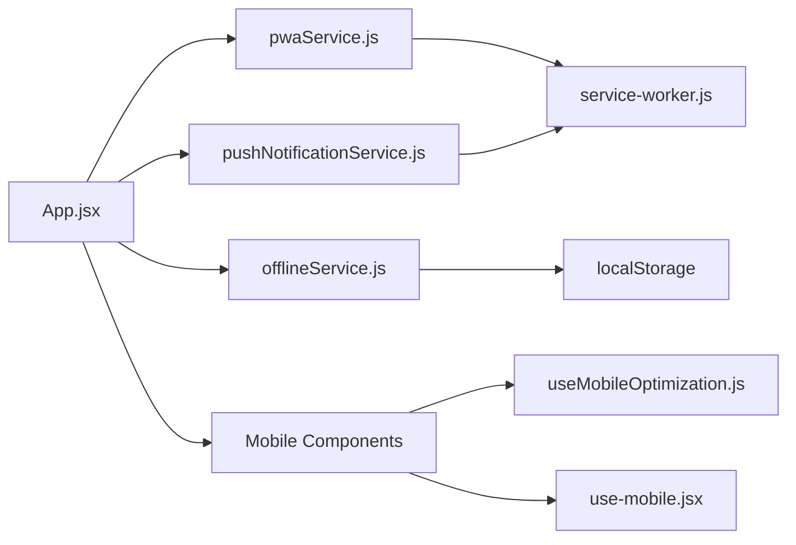

# Mobile Experience & PWA Features

<cite>
**Referenced Files in This Document**
- [service-worker.js](file://Frontend/public/service-worker.js)
- [manifest.json](file://Frontend/public/manifest.json)
- [pwaService.js](file://Frontend/src/services/pwaService.js)
- [OfflineIndicator.jsx](file://Frontend/src/components/mobile/OfflineIndicator.jsx)
- [PWAInstallPrompt.jsx](file://Frontend/src/components/mobile/PWAInstallPrompt.jsx)
- [offlineService.js](file://Frontend/src/services/offlineService.js)
- [pushNotificationService.js](file://Frontend/src/services/pushNotificationService.js)
- [useMobileOptimization.js](file://Frontend/src/hooks/useMobileOptimization.js)
- [use-mobile.jsx](file://Frontend/src/hooks/use-mobile.jsx)
- [App.jsx](file://Frontend/src/App.jsx)
- [main.jsx](file://Frontend/src/main.jsx)
- [MOBILE_EXPERIENCE_IMPLEMENTATION.md](file://MOBILE_EXPERIENCE_IMPLEMENTATION.md)
- [button.jsx](file://Frontend/src/components/ui/button.jsx)
- [dialog.jsx](file://Frontend/src/components/ui/dialog.jsx)
- [drawer.jsx](file://Frontend/src/components/ui/drawer.jsx)
</cite>

## Table of Contents
1. [Introduction](#introduction)
2. [Project Structure](#project-structure)
3. [Core Components](#core-components)
4. [Architecture Overview](#architecture-overview)
5. [Detailed Component Analysis](#detailed-component-analysis)
6. [Dependency Analysis](#dependency-analysis)
7. [Performance Considerations](#performance-considerations)
8. [Troubleshooting Guide](#troubleshooting-guide)
9. [Conclusion](#conclusion)
10. [Appendices](#appendices)

## Introduction
This document explains the Progressive Web App (PWA) and mobile experience enhancements implemented in the SmartCity GRS platform. It covers service worker configuration, offline functionality, app installation prompts, push notifications, background sync, and offline data persistence. It also documents mobile optimization strategies, responsive design patterns, touch-friendly interfaces, and testing approaches for cross-platform compatibility.

## Project Structure
The mobile and PWA features are implemented as optional, non-intrusive additions layered on top of the existing responsive web application. Key locations:
- Service worker and PWA metadata in the public directory
- PWA, offline, and push services in the services directory
- Mobile UI components in the components/mobile directory
- Mobile optimization hooks and responsive utilities
- Integration in the main App component and entry point

**Diagram sources**
- [service-worker.js:1-175](file://Frontend/public/service-worker.js#L1-L175)
- [manifest.json:1-69](file://Frontend/public/manifest.json#L1-L69)
- [pwaService.js:1-171](file://Frontend/src/services/pwaService.js#L1-L171)
- [offlineService.js:1-302](file://Frontend/src/services/offlineService.js#L1-L302)
- [pushNotificationService.js:1-304](file://Frontend/src/services/pushNotificationService.js#L1-L304)
- [OfflineIndicator.jsx:1-134](file://Frontend/src/components/mobile/OfflineIndicator.jsx#L1-L134)
- [PWAInstallPrompt.jsx:1-157](file://Frontend/src/components/mobile/PWAInstallPrompt.jsx#L1-L157)
- [useMobileOptimization.js:1-116](file://Frontend/src/hooks/useMobileOptimization.js#L1-L116)
- [use-mobile.jsx:1-20](file://Frontend/src/hooks/use-mobile.jsx#L1-L20)
- [App.jsx:1-218](file://Frontend/src/App.jsx#L1-L218)
- [main.jsx:1-24](file://Frontend/src/main.jsx#L1-L24)

**Section sources**
- [MOBILE_EXPERIENCE_IMPLEMENTATION.md:1-335](file://MOBILE_EXPERIENCE_IMPLEMENTATION.md#L1-L335)
- [App.jsx:50-80](file://Frontend/src/App.jsx#L50-L80)
- [main.jsx:1-24](file://Frontend/src/main.jsx#L1-L24)

## Core Components
- Service Worker: Implements caching, network-first strategy, background sync, and push notifications.
- PWA Service: Registers the service worker, handles updates, background sync registration, and install prompts.
- Offline Service: Manages offline complaint drafts and queued submissions using localStorage, with retry logic and auto-sync.
- Push Notification Service: Handles browser notification permissions, local notifications, and push subscription lifecycle.
- Mobile UI Components: Offline indicator and PWA install prompt with smooth animations and user controls.
- Mobile Optimization Hooks: Device detection, orientation handling, and touch-friendly UI sizing.

**Section sources**
- [service-worker.js:1-175](file://Frontend/public/service-worker.js#L1-L175)
- [pwaService.js:1-171](file://Frontend/src/services/pwaService.js#L1-L171)
- [offlineService.js:1-302](file://Frontend/src/services/offlineService.js#L1-L302)
- [pushNotificationService.js:1-304](file://Frontend/src/services/pushNotificationService.js#L1-L304)
- [OfflineIndicator.jsx:1-134](file://Frontend/src/components/mobile/OfflineIndicator.jsx#L1-L134)
- [PWAInstallPrompt.jsx:1-157](file://Frontend/src/components/mobile/PWAInstallPrompt.jsx#L1-L157)
- [useMobileOptimization.js:1-116](file://Frontend/src/hooks/useMobileOptimization.js#L1-L116)

## Architecture Overview
The PWA architecture integrates a service worker with the application runtime to provide offline-first behavior, background synchronization, and push notifications. The app registers the service worker on load and communicates with it via message events. Offline data is persisted locally and synchronized when connectivity is restored.

**Diagram sources**
- [pwaService.js:10-71](file://Frontend/src/services/pwaService.js#L10-L71)
- [service-worker.js:20-105](file://Frontend/public/service-worker.js#L20-L105)
- [offlineService.js:168-248](file://Frontend/src/services/offlineService.js#L168-L248)
- [pushNotificationService.js:226-243](file://Frontend/src/services/pushNotificationService.js#L226-L243)

## Detailed Component Analysis

### Service Worker Configuration
The service worker implements:
- Feature flag gating to disable PWA features globally
- Static asset caching during install
- Network-first strategy for HTML with cache fallback
- Exclusion of API calls and cross-origin requests
- Background sync for offline complaint submissions
- Push notification handling and click actions

**Diagram sources**
- [service-worker.js:20-105](file://Frontend/public/service-worker.js#L20-L105)

**Section sources**
- [service-worker.js:1-175](file://Frontend/public/service-worker.js#L1-L175)

### PWA Service and Install Prompts
The PWA service:
- Registers the service worker with scope and handles update notifications
- Listens for messages from the service worker to trigger offline sync
- Provides install prompt orchestration and capability checks
- Exposes helpers to detect PWA mode and request background sync

**Diagram sources**
- [pwaService.js:10-71](file://Frontend/src/services/pwaService.js#L10-L71)
- [PWAInstallPrompt.jsx:17-68](file://Frontend/src/components/mobile/PWAInstallPrompt.jsx#L17-L68)
- [service-worker.js:107-117](file://Frontend/public/service-worker.js#L107-L117)

**Section sources**
- [pwaService.js:1-171](file://Frontend/src/services/pwaService.js#L1-L171)
- [PWAInstallPrompt.jsx:1-157](file://Frontend/src/components/mobile/PWAInstallPrompt.jsx#L1-L157)

### Offline Functionality and Data Persistence
Offline service:
- Feature-flagged and IndexedDB-aware design
- Drafts and queued complaints stored in localStorage
- Auto-sync on reconnect with retry logic and failure reporting
- Stats retrieval for UI indicators

**Diagram sources**
- [offlineService.js:108-248](file://Frontend/src/services/offlineService.js#L108-L248)

**Section sources**
- [offlineService.js:1-302](file://Frontend/src/services/offlineService.js#L1-L302)
- [OfflineIndicator.jsx:1-134](file://Frontend/src/components/mobile/OfflineIndicator.jsx#L1-L134)

### Push Notification System
Push notification service:
- Permission-based opt-in with robust error handling
- Local notifications for complaint status, offline sync, and badges
- Push subscription lifecycle (create, get, unsubscribe)
- Backend integration for saving subscriptions

**Diagram sources**
- [pushNotificationService.js:19-135](file://Frontend/src/services/pushNotificationService.js#L19-L135)
- [pushNotificationService.js:187-219](file://Frontend/src/services/pushNotificationService.js#L187-L219)
- [service-worker.js:119-151](file://Frontend/public/service-worker.js#L119-L151)

**Section sources**
- [pushNotificationService.js:1-304](file://Frontend/src/services/pushNotificationService.js#L1-L304)
- [service-worker.js:119-151](file://Frontend/public/service-worker.js#L119-L151)

### Mobile Optimization Strategies and Touch-Friendly Interfaces
Mobile optimization hook:
- Device detection (mobile/tablet/desktop), touch support, orientation
- Viewport height adjustments for mobile address bar
- Touch-friendly props for inputs and buttons
- PWA mode detection

Responsive utilities:
- Breakpoint hook for conditional rendering
- UI primitives sized for touch targets and readability

**Diagram sources**
- [useMobileOptimization.js:12-113](file://Frontend/src/hooks/useMobileOptimization.js#L12-L113)
- [use-mobile.jsx:5-18](file://Frontend/src/hooks/use-mobile.jsx#L5-L18)
- [button.jsx:7-36](file://Frontend/src/components/ui/button.jsx#L7-L36)
- [dialog.jsx:27-44](file://Frontend/src/components/ui/dialog.jsx#L27-L44)
- [drawer.jsx:22-35](file://Frontend/src/components/ui/drawer.jsx#L22-L35)

**Section sources**
- [useMobileOptimization.js:1-116](file://Frontend/src/hooks/useMobileOptimization.js#L1-L116)
- [use-mobile.jsx:1-20](file://Frontend/src/hooks/use-mobile.jsx#L1-L20)
- [button.jsx:1-45](file://Frontend/src/components/ui/button.jsx#L1-L45)
- [dialog.jsx:1-84](file://Frontend/src/components/ui/dialog.jsx#L1-L84)
- [drawer.jsx:1-76](file://Frontend/src/components/ui/drawer.jsx#L1-L76)

### Mobile UI Components
Offline Indicator:
- Shows real-time online/offline status
- Displays queued complaints and drafts
- Animates sync progress and success messages

PWA Install Prompt:
- Listens for beforeinstallprompt and defers display
- Presents a custom, dismissable prompt with benefits
- Persists user choice in localStorage

**Diagram sources**
- [OfflineIndicator.jsx:16-62](file://Frontend/src/components/mobile/OfflineIndicator.jsx#L16-L62)
- [offlineService.js:270-287](file://Frontend/src/services/offlineService.js#L270-L287)

**Section sources**
- [OfflineIndicator.jsx:1-134](file://Frontend/src/components/mobile/OfflineIndicator.jsx#L1-L134)
- [PWAInstallPrompt.jsx:1-157](file://Frontend/src/components/mobile/PWAInstallPrompt.jsx#L1-L157)

## Dependency Analysis
The PWA and mobile features are modular and layered:
- App depends on PWA service for registration and messaging
- PWA service depends on service worker for background tasks
- Offline service is independent but integrated via UI and messaging
- Push notification service is independent but can integrate with backend
- Mobile optimization hooks are standalone utilities consumed by components

**Diagram sources**
- [App.jsx:50-78](file://Frontend/src/App.jsx#L50-L78)
- [pwaService.js:1-171](file://Frontend/src/services/pwaService.js#L1-L171)
- [offlineService.js:1-302](file://Frontend/src/services/offlineService.js#L1-L302)
- [pushNotificationService.js:1-304](file://Frontend/src/services/pushNotificationService.js#L1-L304)
- [service-worker.js:1-175](file://Frontend/public/service-worker.js#L1-L175)
- [OfflineIndicator.jsx:1-134](file://Frontend/src/components/mobile/OfflineIndicator.jsx#L1-L134)
- [PWAInstallPrompt.jsx:1-157](file://Frontend/src/components/mobile/PWAInstallPrompt.jsx#L1-L157)
- [useMobileOptimization.js:1-116](file://Frontend/src/hooks/useMobileOptimization.js#L1-L116)
- [use-mobile.jsx:1-20](file://Frontend/src/hooks/use-mobile.jsx#L1-L20)

**Section sources**
- [App.jsx:50-80](file://Frontend/src/App.jsx#L50-L80)
- [pwaService.js:1-171](file://Frontend/src/services/pwaService.js#L1-L171)
- [offlineService.js:1-302](file://Frontend/src/services/offlineService.js#L1-L302)
- [pushNotificationService.js:1-304](file://Frontend/src/services/pushNotificationService.js#L1-L304)

## Performance Considerations
- Service worker runs off-main-thread; minimal UI impact
- Network-first strategy reduces repeated network requests for HTML
- Cache cleanup removes stale caches on activation
- Offline storage uses localStorage for simplicity and broad support
- Feature flags allow disabling heavy features in constrained environments
- Responsive design avoids unnecessary reflows and uses efficient CSS utilities

[No sources needed since this section provides general guidance]

## Troubleshooting Guide
Common issues and remedies:
- Service worker not registering: Check browser support and feature flags; verify HTTPS in production
- Install prompt not appearing: Ensure beforeinstallprompt fires and user hasn't dismissed; confirm PWA mode detection
- Offline sync not working: Verify localStorage availability and online status; check retry limits
- Push notifications not received: Confirm permission granted; validate VAPID key and backend endpoint
- Testing offline mode: Use DevTools network throttling or device emulation; simulate offline state

**Section sources**
- [MOBILE_EXPERIENCE_IMPLEMENTATION.md:144-164](file://MOBILE_EXPERIENCE_IMPLEMENTATION.md#L144-L164)
- [pwaService.js:66-70](file://Frontend/src/services/pwaService.js#L66-L70)
- [offlineService.js:13-17](file://Frontend/src/services/offlineService.js#L13-L17)
- [pushNotificationService.js:10-13](file://Frontend/src/services/pushNotificationService.js#L10-L13)

## Conclusion
The PWA and mobile enhancements deliver an app-like experience with offline capabilities, background sync, and push notifications, while maintaining zero regression against existing functionality. The modular design, feature flags, and fail-safe mechanisms ensure safe deployment and easy testing across platforms.

[No sources needed since this section summarizes without analyzing specific files]

## Appendices

### Feature Flags and Configuration
Environment variables control feature availability:
- VITE_ENABLE_PWA: Toggle PWA features
- VITE_ENABLE_PWA_OFFLINE: Toggle offline mode
- VITE_ENABLE_PUSH_NOTIFICATIONS: Toggle push notifications

**Section sources**
- [MOBILE_EXPERIENCE_IMPLEMENTATION.md:94-101](file://MOBILE_EXPERIENCE_IMPLEMENTATION.md#L94-L101)

### Manifest and Icons
The manifest defines app metadata, display mode, theme colors, and icon sets for various densities and purposes.

**Section sources**
- [manifest.json:1-69](file://Frontend/public/manifest.json#L1-L69)

### Entry Point and Global Error Handling
The app initializes providers, routers, and global error handlers. The service worker auto-registration occurs on window load.

**Section sources**
- [main.jsx:1-24](file://Frontend/src/main.jsx#L1-L24)
- [pwaService.js:163-171](file://Frontend/src/services/pwaService.js#L163-L171)