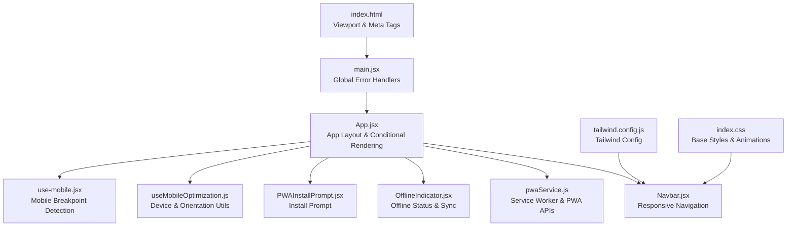
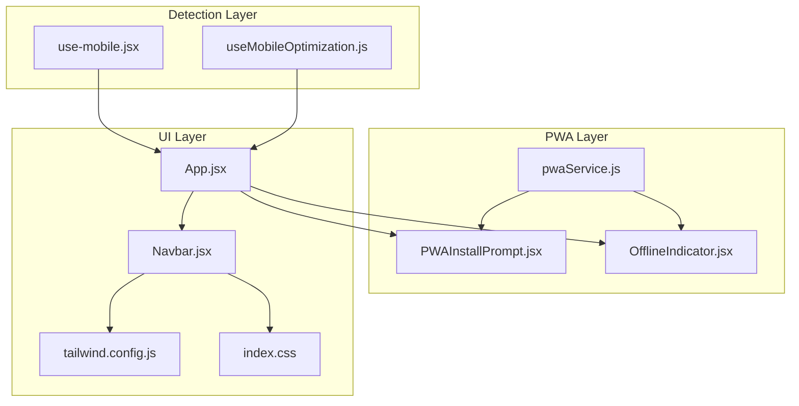
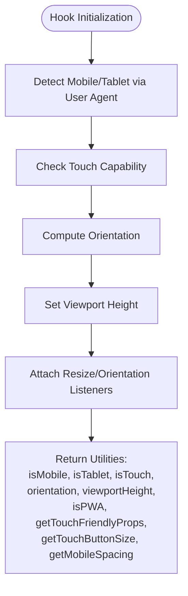
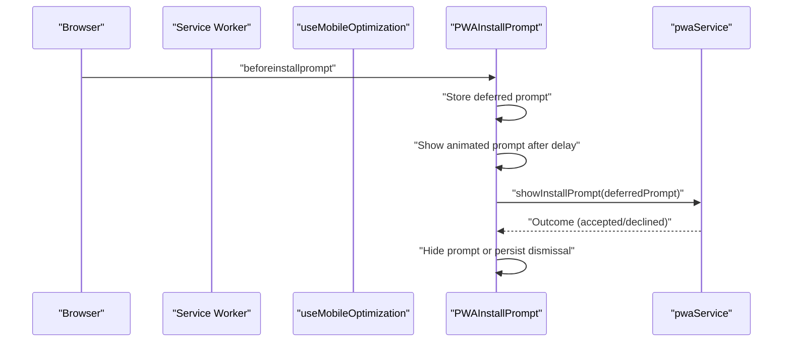
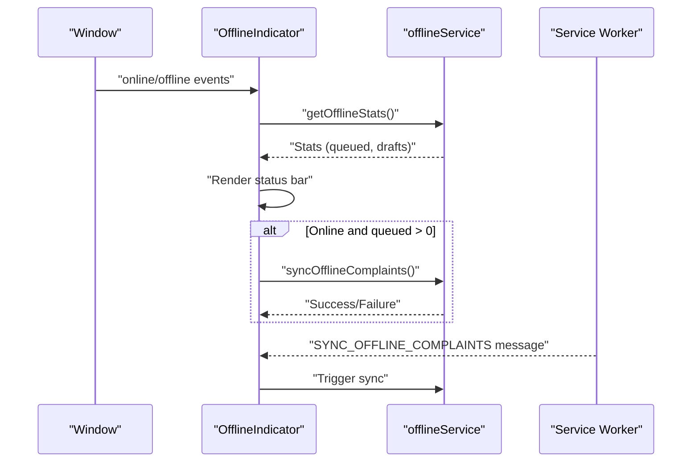
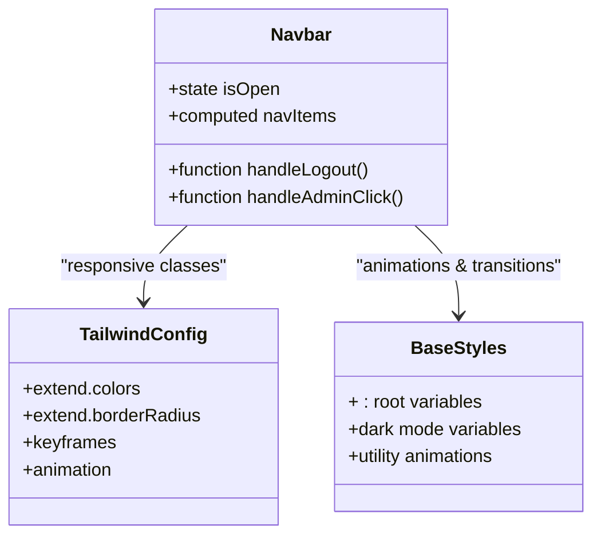
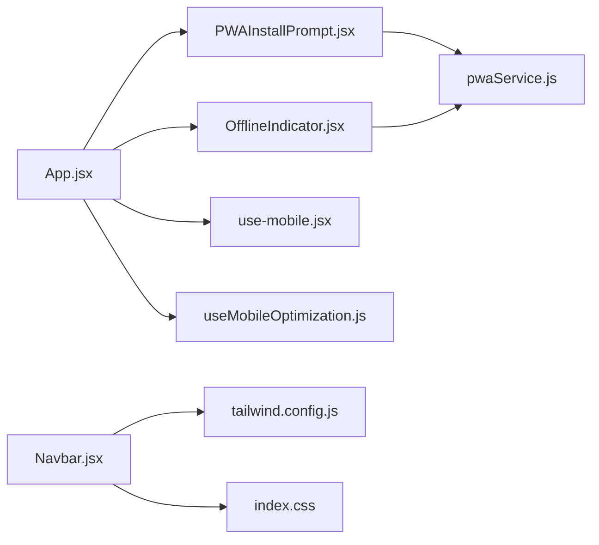

# Mobile Optimization & Responsive Design

<cite>
**Referenced Files in This Document**
- [index.html](file://Frontend/index.html)
- [dist/index.html](file://Frontend/dist/index.html)
- [main.jsx](file://Frontend/src/main.jsx)
- [App.jsx](file://Frontend/src/App.jsx)
- [use-mobile.jsx](file://Frontend/src/hooks/use-mobile.jsx)
- [useMobileOptimization.js](file://Frontend/src/hooks/useMobileOptimization.js)
- [OfflineIndicator.jsx](file://Frontend/src/components/mobile/OfflineIndicator.jsx)
- [PWAInstallPrompt.jsx](file://Frontend/src/components/mobile/PWAInstallPrompt.jsx)
- [pwaService.js](file://Frontend/src/services/pwaService.js)
- [tailwind.config.js](file://Frontend/tailwind.config.js)
- [index.css](file://Frontend/src/index.css)
- [utils.js](file://Frontend/src/lib/utils.js)
- [Navbar.jsx](file://Frontend/src/components/Navbar.jsx)
</cite>

## Table of Contents
1. [Introduction](#introduction)
2. [Project Structure](#project-structure)
3. [Core Components](#core-components)
4. [Architecture Overview](#architecture-overview)
5. [Detailed Component Analysis](#detailed-component-analysis)
6. [Dependency Analysis](#dependency-analysis)
7. [Performance Considerations](#performance-considerations)
8. [Troubleshooting Guide](#troubleshooting-guide)
9. [Conclusion](#conclusion)
10. [Appendices](#appendices)

## Introduction
This document explains the mobile optimization and responsive design implementation in the frontend. It covers mobile detection hooks, responsive breakpoints, adaptive UI components, touch-friendly design patterns, gesture handling, viewport and meta tag configuration, PWA features for offline and installability, and performance considerations tailored for mobile devices. It also outlines testing methodologies for cross-platform compatibility and optimization techniques for various screen sizes and orientations.

## Project Structure
The mobile-first enhancements are integrated at the application shell level and distributed across dedicated hooks, services, and components:
- Viewport and meta tags are configured in the HTML template.
- Mobile detection and device feature utilities are provided by custom hooks.
- PWA installation prompts and offline indicators are implemented as dedicated components.
- Tailwind CSS provides responsive utilities and animations.
- The application layout conditionally renders mobile-enhanced UI elements.

**Diagram sources**
- [index.html:1-34](file://Frontend/index.html#L1-L34)
- [dist/index.html:1-35](file://Frontend/dist/index.html#L1-L35)
- [main.jsx:1-24](file://Frontend/src/main.jsx#L1-L24)
- [App.jsx:1-218](file://Frontend/src/App.jsx#L1-L218)
- [use-mobile.jsx:1-20](file://Frontend/src/hooks/use-mobile.jsx#L1-L20)
- [useMobileOptimization.js:1-116](file://Frontend/src/hooks/useMobileOptimization.js#L1-L116)
- [PWAInstallPrompt.jsx:1-157](file://Frontend/src/components/mobile/PWAInstallPrompt.jsx#L1-L157)
- [OfflineIndicator.jsx:1-134](file://Frontend/src/components/mobile/OfflineIndicator.jsx#L1-L134)
- [pwaService.js:1-171](file://Frontend/src/services/pwaService.js#L1-L171)
- [tailwind.config.js:1-120](file://Frontend/tailwind.config.js#L1-L120)
- [index.css:1-215](file://Frontend/src/index.css#L1-L215)
- [Navbar.jsx:1-200](file://Frontend/src/components/Navbar.jsx#L1-L200)

**Section sources**
- [index.html:1-34](file://Frontend/index.html#L1-L34)
- [dist/index.html:1-35](file://Frontend/dist/index.html#L1-L35)
- [main.jsx:1-24](file://Frontend/src/main.jsx#L1-L24)
- [App.jsx:56-81](file://Frontend/src/App.jsx#L56-L81)
- [tailwind.config.js:1-120](file://Frontend/tailwind.config.js#L1-L120)
- [index.css:1-215](file://Frontend/src/index.css#L1-L215)

## Core Components
- Mobile breakpoint detection: A lightweight hook that tracks viewport width against a fixed breakpoint and media query changes.
- Device and orientation utilities: A comprehensive hook that detects mobile/tablet, touch capability, orientation, viewport height, and PWA mode, plus provides touch-friendly props and sizing helpers.
- PWA installation prompt: A non-intrusive, animated prompt that encourages installation and handles user choice.
- Offline indicator: A floating, animated status bar that communicates online/offline state, queued items, and sync progress.
- Tailwind configuration: Extends design tokens, animations, and responsive behavior for consistent mobile UX.

Key implementation references:
- [useIsMobile hook:5-19](file://Frontend/src/hooks/use-mobile.jsx#L5-L19)
- [useMobileOptimization hook:12-113](file://Frontend/src/hooks/useMobileOptimization.js#L12-L113)
- [PWAInstallPrompt component:12-77](file://Frontend/src/components/mobile/PWAInstallPrompt.jsx#L12-L77)
- [OfflineIndicator component:11-66](file://Frontend/src/components/mobile/OfflineIndicator.jsx#L11-L66)
- [Tailwind config:1-120](file://Frontend/tailwind.config.js#L1-L120)

**Section sources**
- [use-mobile.jsx:1-20](file://Frontend/src/hooks/use-mobile.jsx#L1-L20)
- [useMobileOptimization.js:1-116](file://Frontend/src/hooks/useMobileOptimization.js#L1-L116)
- [PWAInstallPrompt.jsx:1-157](file://Frontend/src/components/mobile/PWAInstallPrompt.jsx#L1-L157)
- [OfflineIndicator.jsx:1-134](file://Frontend/src/components/mobile/OfflineIndicator.jsx#L1-L134)
- [tailwind.config.js:1-120](file://Frontend/tailwind.config.js#L1-L120)

## Architecture Overview
The mobile optimization architecture centers on three pillars:
- Detection and adaptation: Hooks detect device characteristics and expose utilities for responsive rendering.
- Progressive enhancement: PWA features (service worker, install prompt) and offline behavior are layered on top of baseline functionality.
- Consistent UI: Tailwind utilities and animations ensure a cohesive experience across breakpoints and devices.

**Diagram sources**
- [useMobileOptimization.js:1-116](file://Frontend/src/hooks/useMobileOptimization.js#L1-L116)
- [use-mobile.jsx:1-20](file://Frontend/src/hooks/use-mobile.jsx#L1-L20)
- [pwaService.js:1-171](file://Frontend/src/services/pwaService.js#L1-L171)
- [PWAInstallPrompt.jsx:1-157](file://Frontend/src/components/mobile/PWAInstallPrompt.jsx#L1-L157)
- [OfflineIndicator.jsx:1-134](file://Frontend/src/components/mobile/OfflineIndicator.jsx#L1-L134)
- [App.jsx:56-81](file://Frontend/src/App.jsx#L56-L81)
- [Navbar.jsx:1-200](file://Frontend/src/components/Navbar.jsx#L1-L200)
- [tailwind.config.js:1-120](file://Frontend/tailwind.config.js#L1-L120)
- [index.css:1-215](file://Frontend/src/index.css#L1-L215)

## Detailed Component Analysis

### Mobile Detection Hooks
- useIsMobile: Uses a fixed breakpoint and media query listener to reflect viewport changes.
- useMobileOptimization: Provides device classification, orientation, viewport height, PWA mode, and helper functions for touch-friendly props and sizing.

**Diagram sources**
- [useMobileOptimization.js:19-56](file://Frontend/src/hooks/useMobileOptimization.js#L19-L56)

**Section sources**
- [use-mobile.jsx:5-19](file://Frontend/src/hooks/use-mobile.jsx#L5-L19)
- [useMobileOptimization.js:12-113](file://Frontend/src/hooks/useMobileOptimization.js#L12-L113)

### PWA Installation Prompt
- Listens for the beforeinstallprompt event, defers the native prompt, and shows a custom animated prompt after a delay.
- Respects user choice and persists dismissal preference.

**Diagram sources**
- [PWAInstallPrompt.jsx:17-77](file://Frontend/src/components/mobile/PWAInstallPrompt.jsx#L17-L77)
- [pwaService.js:134-153](file://Frontend/src/services/pwaService.js#L134-L153)

**Section sources**
- [PWAInstallPrompt.jsx:1-157](file://Frontend/src/components/mobile/PWAInstallPrompt.jsx#L1-L157)
- [pwaService.js:100-161](file://Frontend/src/services/pwaService.js#L100-L161)

### Offline Indicator
- Monitors online/offline status and periodically updates queued/draft counts.
- Auto-syncs when connectivity is restored and displays animated status with contextual messaging.

**Diagram sources**
- [OfflineIndicator.jsx:16-61](file://Frontend/src/components/mobile/OfflineIndicator.jsx#L16-L61)
- [pwaService.js:49-58](file://Frontend/src/services/pwaService.js#L49-L58)

**Section sources**
- [OfflineIndicator.jsx:1-134](file://Frontend/src/components/mobile/OfflineIndicator.jsx#L1-L134)
- [pwaService.js:10-71](file://Frontend/src/services/pwaService.js#L10-L71)

### Responsive UI Components
- Navbar adapts to mobile with a collapsible menu and responsive alignment.
- Tailwind utilities and animations ensure consistent spacing and transitions across devices.

**Diagram sources**
- [Navbar.jsx:12-75](file://Frontend/src/components/Navbar.jsx#L12-L75)
- [tailwind.config.js:58-116](file://Frontend/tailwind.config.js#L58-L116)
- [index.css:9-135](file://Frontend/src/index.css#L9-L135)

**Section sources**
- [Navbar.jsx:76-200](file://Frontend/src/components/Navbar.jsx#L76-L200)
- [tailwind.config.js:1-120](file://Frontend/tailwind.config.js#L1-L120)
- [index.css:1-215](file://Frontend/src/index.css#L1-L215)

## Dependency Analysis
- App.jsx composes mobile components and conditionally renders them based on route visibility.
- useMobileOptimization integrates with pwaService for PWA checks and with UI components for responsive props.
- Tailwind utilities underpin responsive behavior and animations.

**Diagram sources**
- [App.jsx:51-78](file://Frontend/src/App.jsx#L51-L78)
- [PWAInstallPrompt.jsx:10-10](file://Frontend/src/components/mobile/PWAInstallPrompt.jsx#L10-L10)
- [OfflineIndicator.jsx:9-9](file://Frontend/src/components/mobile/OfflineIndicator.jsx#L9-L9)
- [pwaService.js:100-106](file://Frontend/src/services/pwaService.js#L100-L106)
- [use-mobile.jsx:3-3](file://Frontend/src/hooks/use-mobile.jsx#L3-L3)
- [useMobileOptimization.js:12-113](file://Frontend/src/hooks/useMobileOptimization.js#L12-L113)
- [Navbar.jsx:1-200](file://Frontend/src/components/Navbar.jsx#L1-L200)
- [tailwind.config.js:1-120](file://Frontend/tailwind.config.js#L1-L120)
- [index.css:1-215](file://Frontend/src/index.css#L1-L215)

**Section sources**
- [App.jsx:51-78](file://Frontend/src/App.jsx#L51-L78)
- [useMobileOptimization.js:12-113](file://Frontend/src/hooks/useMobileOptimization.js#L12-L113)
- [pwaService.js:100-106](file://Frontend/src/services/pwaService.js#L100-L106)

## Performance Considerations
- Event listeners for resize/orientation changes are attached and cleaned up to avoid leaks.
- Animated components use lightweight framer-motion animations and CSS transitions.
- PWA features are opt-in via environment flags and gracefully degrade if unsupported.
- Tailwind utilities minimize custom CSS and leverage prebuilt responsive variants.

Recommendations:
- Debounce resize handlers if adding custom logic.
- Prefer CSS transforms and opacity for animations.
- Lazy-load heavy assets and defer non-critical features on mobile.
- Use service worker caching strategies appropriate for offline scenarios.

**Section sources**
- [useMobileOptimization.js:48-56](file://Frontend/src/hooks/useMobileOptimization.js#L48-L56)
- [OfflineIndicator.jsx:30-42](file://Frontend/src/components/mobile/OfflineIndicator.jsx#L30-L42)
- [pwaService.js:17-22](file://Frontend/src/services/pwaService.js#L17-L22)
- [index.css:130-134](file://Frontend/src/index.css#L130-L134)

## Troubleshooting Guide
Common issues and resolutions:
- PWA prompt not appearing:
  - Ensure the beforeinstallprompt event fires and deferredPrompt is stored.
  - Confirm the app is not already installed and the user hasn’t dismissed the prompt.
  - Reference: [PWAInstallPrompt.jsx:26-45](file://Frontend/src/components/mobile/PWAInstallPrompt.jsx#L26-L45), [pwaService.js:134-153](file://Frontend/src/services/pwaService.js#L134-L153)
- Service worker registration failures:
  - Check browser support and feature flag.
  - Review console logs for errors and confirm scope configuration.
  - Reference: [pwaService.js:10-71](file://Frontend/src/services/pwaService.js#L10-L71)
- Offline sync not triggering:
  - Verify online/offline events and queued item counts.
  - Confirm service worker message handling.
  - Reference: [OfflineIndicator.jsx:44-56](file://Frontend/src/components/mobile/OfflineIndicator.jsx#L44-L56), [pwaService.js:49-58](file://Frontend/src/services/pwaService.js#L49-L58)
- Mobile breakpoint misclassification:
  - Validate media query listener and initial width check.
  - Reference: [use-mobile.jsx:8-16](file://Frontend/src/hooks/use-mobile.jsx#L8-L16)
- Touch targets too small:
  - Apply touch-friendly props returned by the optimization hook.
  - Reference: [useMobileOptimization.js:62-73](file://Frontend/src/hooks/useMobileOptimization.js#L62-L73)

**Section sources**
- [PWAInstallPrompt.jsx:17-77](file://Frontend/src/components/mobile/PWAInstallPrompt.jsx#L17-L77)
- [pwaService.js:10-71](file://Frontend/src/services/pwaService.js#L10-L71)
- [OfflineIndicator.jsx:44-56](file://Frontend/src/components/mobile/OfflineIndicator.jsx#L44-L56)
- [use-mobile.jsx:8-16](file://Frontend/src/hooks/use-mobile.jsx#L8-L16)
- [useMobileOptimization.js:62-73](file://Frontend/src/hooks/useMobileOptimization.js#L62-L73)

## Conclusion
The application implements a robust, layered approach to mobile optimization:
- Reliable device and orientation detection.
- Non-intrusive PWA installation and offline capabilities.
- Responsive UI built on Tailwind utilities and animations.
- Performance-conscious design with graceful degradation and clear fallbacks.

These patterns provide a scalable foundation for further enhancements across platforms and devices.

## Appendices

### Viewport and Meta Tags
- Configure viewport width and initial scale.
- Provide Open Graph and Twitter metadata for social sharing.
- Enable PWA-related meta tags for Apple devices and theme color.

References:
- [index.html:4-26](file://Frontend/index.html#L4-L26)
- [dist/index.html:4-27](file://Frontend/dist/index.html#L4-L27)

**Section sources**
- [index.html:4-26](file://Frontend/index.html#L4-L26)
- [dist/index.html:4-27](file://Frontend/dist/index.html#L4-L27)

### Responsive Breakpoints and Patterns
- Fixed mobile breakpoint for coarse-grained adaptation.
- Tailwind’s responsive modifiers and utility classes for spacing, typography, and layout.
- Utility functions for touch-friendly props and sizing.

References:
- [use-mobile.jsx:3-3](file://Frontend/src/hooks/use-mobile.jsx#L3-L3)
- [useMobileOptimization.js:98-100](file://Frontend/src/hooks/useMobileOptimization.js#L98-L100)
- [tailwind.config.js:1-120](file://Frontend/tailwind.config.js#L1-L120)
- [index.css:137-215](file://Frontend/src/index.css#L137-L215)

**Section sources**
- [use-mobile.jsx:3-3](file://Frontend/src/hooks/use-mobile.jsx#L3-L3)
- [useMobileOptimization.js:98-100](file://Frontend/src/hooks/useMobileOptimization.js#L98-L100)
- [tailwind.config.js:1-120](file://Frontend/tailwind.config.js#L1-L120)
- [index.css:137-215](file://Frontend/src/index.css#L137-L215)

### Testing Methodologies for Cross-Platform Compatibility
- Emulation and device labs: Test on representative devices and orientations.
- Feature detection: Validate touch support, PWA availability, and service worker lifecycle.
- Network simulation: Test offline indicators and auto-sync behavior.
- Accessibility: Ensure touch targets meet minimum sizes and keyboard navigation remains usable.

[No sources needed since this section provides general guidance]