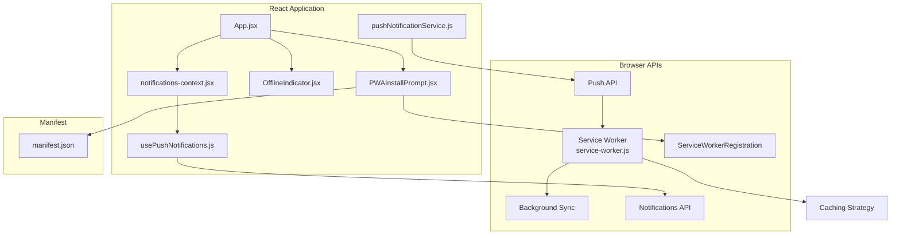
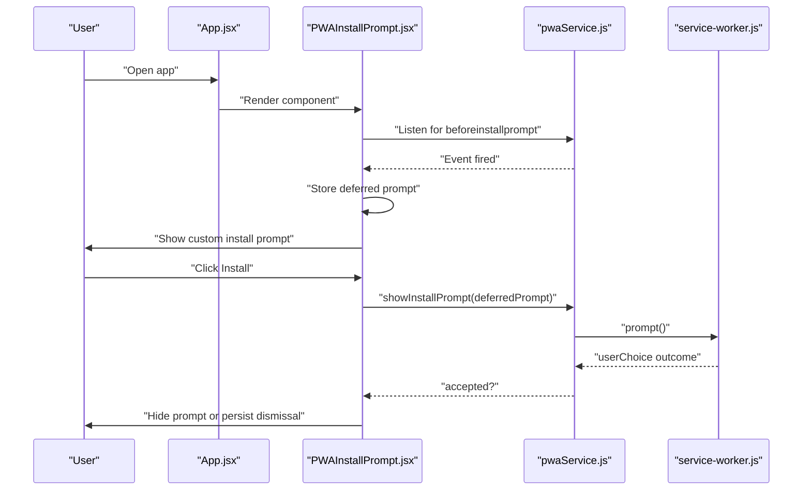
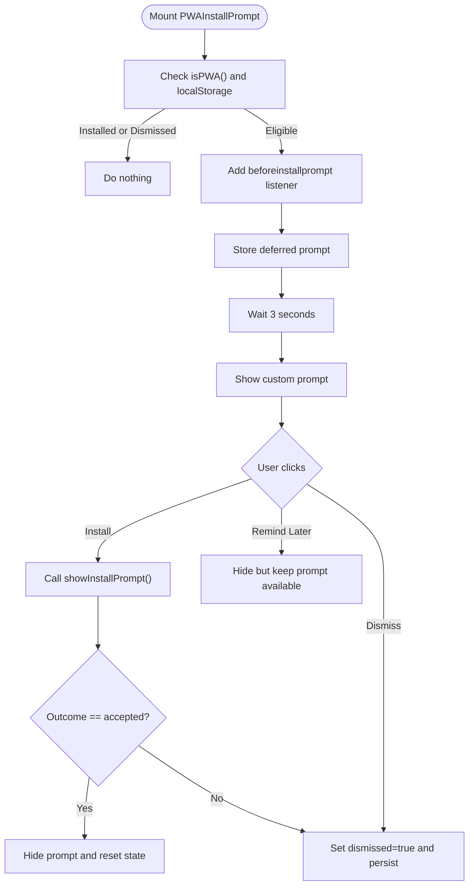
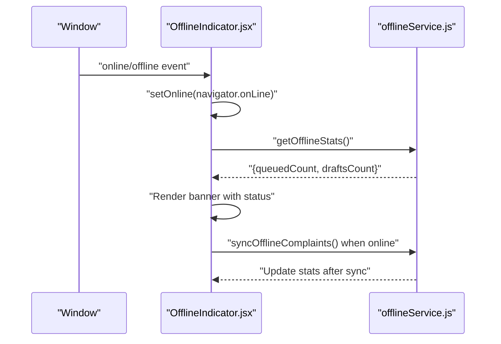
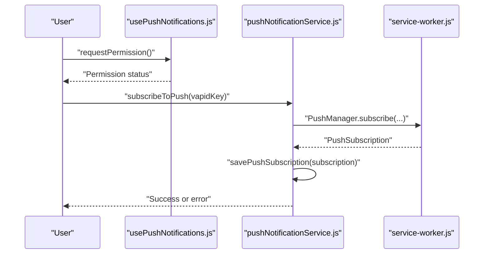
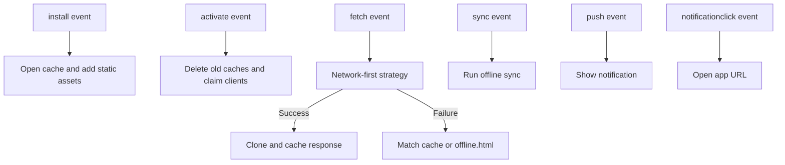
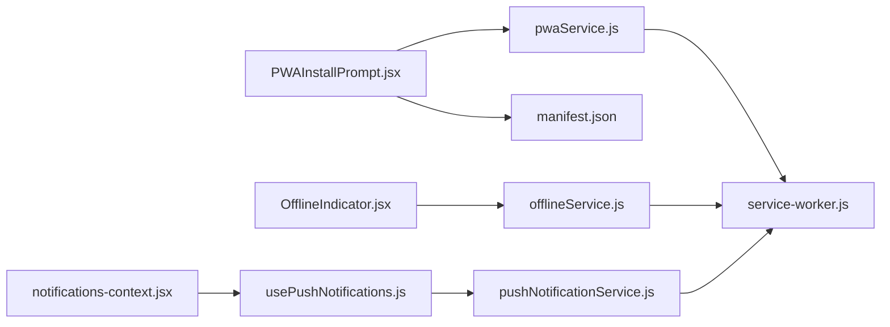

# PWA Installation & Notification System

<cite>
**Referenced Files in This Document**
- [PWAInstallPrompt.jsx](file://Frontend/src/components/mobile/PWAInstallPrompt.jsx)
- [pwaService.js](file://Frontend/src/services/pwaService.js)
- [OfflineIndicator.jsx](file://Frontend/src/components/mobile/OfflineIndicator.jsx)
- [offlineService.js](file://Frontend/src/services/offlineService.js)
- [usePushNotifications.js](file://Frontend/src/hooks/usePushNotifications.js)
- [pushNotificationService.js](file://Frontend/src/services/pushNotificationService.js)
- [notifications-context.jsx](file://Frontend/src/context/notifications-context.jsx)
- [useNotificationPreferences.js](file://Frontend/src/hooks/useNotificationPreferences.js)
- [service-worker.js](file://Frontend/public/service-worker.js)
- [manifest.json](file://Frontend/public/manifest.json)
- [App.jsx](file://Frontend/src/App.jsx)
- [main.jsx](file://Frontend/src/main.jsx)
</cite>

## Table of Contents
1. [Introduction](#introduction)
2. [Project Structure](#project-structure)
3. [Core Components](#core-components)
4. [Architecture Overview](#architecture-overview)
5. [Detailed Component Analysis](#detailed-component-analysis)
6. [Dependency Analysis](#dependency-analysis)
7. [Performance Considerations](#performance-considerations)
8. [Troubleshooting Guide](#troubleshooting-guide)
9. [Conclusion](#conclusion)
10. [Appendices](#appendices)

## Introduction
This document explains the Progressive Web App (PWA) installation and notification systems implemented in the frontend. It covers:
- BeforeInstallPrompt event handling and installation eligibility checks
- User choice management and dismissal logic
- Offline indicator component and connection status detection
- User feedback mechanisms and notification permissions
- Push notification setup and cross-browser compatibility
- Installation prompt UI components and user experience considerations
- Fallback strategies for browsers without PWA installation support
- Testing approaches for installation flows and troubleshooting common issues

## Project Structure
The PWA and notification features are implemented across React components, service workers, and supporting services. Key integration points:
- App-level composition injects mobile experience enhancements
- Service worker handles caching, background sync, and push notifications
- Hooks and services encapsulate permission handling, prompting, and offline behavior

**Diagram sources**
- [App.jsx:51-78](file://Frontend/src/App.jsx#L51-L78)
- [PWAInstallPrompt.jsx:12-45](file://Frontend/src/components/mobile/PWAInstallPrompt.jsx#L12-L45)
- [OfflineIndicator.jsx:11-42](file://Frontend/src/components/mobile/OfflineIndicator.jsx#L11-L42)
- [notifications-context.jsx:10-235](file://Frontend/src/context/notifications-context.jsx#L10-L235)
- [usePushNotifications.js:3-71](file://Frontend/src/hooks/usePushNotifications.js#L3-L71)
- [pushNotificationService.js:10-304](file://Frontend/src/services/pushNotificationService.js#L10-L304)
- [service-worker.js:21-175](file://Frontend/public/service-worker.js#L21-L175)
- [manifest.json:1-69](file://Frontend/public/manifest.json#L1-L69)

**Section sources**
- [App.jsx:51-78](file://Frontend/src/App.jsx#L51-L78)
- [service-worker.js:21-175](file://Frontend/public/service-worker.js#L21-L175)
- [manifest.json:1-69](file://Frontend/public/manifest.json#L1-L69)

## Core Components
- PWAInstallPrompt: Manages BeforeInstallPrompt event, deferred prompt lifecycle, and user choices (accept/dismiss/remind later). Integrates with localStorage for persistence and uses a custom UI with animations.
- pwaService: Registers the service worker, handles updates, background sync registration, and PWA eligibility checks. Provides showInstallPrompt and canInstall helpers.
- OfflineIndicator: Monitors online/offline status, displays contextual feedback, and triggers automatic offline sync when connectivity returns.
- offlineService: Implements offline complaint drafting, queuing, and synchronization with retry logic and storage statistics.
- usePushNotifications: Hook-based wrapper around the Notifications API for permission and notification display.
- pushNotificationService: Full-featured service for push subscriptions, local notifications, and backend integration.
- notifications-context: Centralized notification preferences and delivery pipeline (in-app, sound, push).
- service-worker: Implements caching, background sync, push handling, and message passing to the main app.
- manifest.json: Defines PWA metadata and icons for installation.

**Section sources**
- [PWAInstallPrompt.jsx:12-157](file://Frontend/src/components/mobile/PWAInstallPrompt.jsx#L12-L157)
- [pwaService.js:10-171](file://Frontend/src/services/pwaService.js#L10-L171)
- [OfflineIndicator.jsx:11-134](file://Frontend/src/components/mobile/OfflineIndicator.jsx#L11-L134)
- [offlineService.js:13-302](file://Frontend/src/services/offlineService.js#L13-L302)
- [usePushNotifications.js:3-71](file://Frontend/src/hooks/usePushNotifications.js#L3-L71)
- [pushNotificationService.js:10-304](file://Frontend/src/services/pushNotificationService.js#L10-L304)
- [notifications-context.jsx:10-244](file://Frontend/src/context/notifications-context.jsx#L10-L244)
- [service-worker.js:21-175](file://Frontend/public/service-worker.js#L21-L175)
- [manifest.json:1-69](file://Frontend/public/manifest.json#L1-L69)

## Architecture Overview
The system combines client-side React components with browser APIs and a service worker to deliver a resilient PWA experience:
- Installation flow: Event-driven prompt, user choice capture, and persistent dismissal
- Offline experience: Local storage for drafts and queues, periodic stats, and automatic sync on reconnect
- Notifications: Local notifications via the Notifications API and optional push subscriptions via Push API
- Service worker: Caching, background sync, and push handling with message bridging to the app

**Diagram sources**
- [PWAInstallPrompt.jsx:17-68](file://Frontend/src/components/mobile/PWAInstallPrompt.jsx#L17-L68)
- [pwaService.js:134-153](file://Frontend/src/services/pwaService.js#L134-L153)
- [service-worker.js:144-151](file://Frontend/public/service-worker.js#L144-L151)

## Detailed Component Analysis

### PWA Installation Prompt
- Event handling: Subscribes to beforeinstallprompt, prevents default, stores the event, and conditionally shows a custom prompt after a delay
- Eligibility checks: Uses isPWA and canInstall to gate prompt visibility and avoid redundant prompts
- User choice management: Accept installs via showInstallPrompt; decline invokes dismissal logic persisted in localStorage
- UI and UX: Animated modal with feature highlights, dismiss, remind later, and install actions

**Diagram sources**
- [PWAInstallPrompt.jsx:17-77](file://Frontend/src/components/mobile/PWAInstallPrompt.jsx#L17-L77)
- [pwaService.js:159-161](file://Frontend/src/services/pwaService.js#L159-L161)
- [pwaService.js:134-153](file://Frontend/src/services/pwaService.js#L134-L153)

**Section sources**
- [PWAInstallPrompt.jsx:12-157](file://Frontend/src/components/mobile/PWAInstallPrompt.jsx#L12-L157)
- [pwaService.js:100-161](file://Frontend/src/services/pwaService.js#L100-L161)

### Offline Indicator and Connection Detection
- Connection monitoring: Uses navigator.onLine and listens to online/offline events
- Stats aggregation: Periodic retrieval of offline queue and draft counts
- Auto-sync: Triggers sync when connectivity returns and queued items exist
- Visual feedback: Animated banner indicating online/offline state and sync progress

**Diagram sources**
- [OfflineIndicator.jsx:16-61](file://Frontend/src/components/mobile/OfflineIndicator.jsx#L16-L61)
- [offlineService.js:270-287](file://Frontend/src/services/offlineService.js#L270-L287)
- [offlineService.js:168-248](file://Frontend/src/services/offlineService.js#L168-L248)

**Section sources**
- [OfflineIndicator.jsx:11-134](file://Frontend/src/components/mobile/OfflineIndicator.jsx#L11-L134)
- [offlineService.js:13-302](file://Frontend/src/services/offlineService.js#L13-L302)

### Notification Permissions and Push Setup
- Local notifications: usePushNotifications hook wraps Notification API for permission and display
- Push notifications: pushNotificationService manages subscription lifecycle, backend registration, and local notification helpers
- Cross-browser compatibility: Feature flags and capability checks guard unsupported environments
- Preferences: notifications-context coordinates in-app, sound, and push preferences

**Diagram sources**
- [usePushNotifications.js:15-62](file://Frontend/src/hooks/usePushNotifications.js#L15-L62)
- [pushNotificationService.js:101-219](file://Frontend/src/services/pushNotificationService.js#L101-L219)
- [service-worker.js:120-141](file://Frontend/public/service-worker.js#L120-L141)

**Section sources**
- [usePushNotifications.js:3-71](file://Frontend/src/hooks/usePushNotifications.js#L3-L71)
- [pushNotificationService.js:10-304](file://Frontend/src/services/pushNotificationService.js#L10-L304)
- [notifications-context.jsx:10-244](file://Frontend/src/context/notifications-context.jsx#L10-L244)

### Service Worker Integration
- Caching: Static assets cached on install; network-first strategy with cache fallback
- Background sync: Listens for sync events and triggers offline complaint sync
- Push notifications: Receives push events and shows notifications; handles notification clicks
- Message bridge: Posts messages to clients for app-initiated actions

**Diagram sources**
- [service-worker.js:21-105](file://Frontend/public/service-worker.js#L21-L105)
- [service-worker.js:108-151](file://Frontend/public/service-worker.js#L108-L151)

**Section sources**
- [service-worker.js:21-175](file://Frontend/public/service-worker.js#L21-L175)

### Installation Prompt UI Components and User Experience
- Visual design: Gradient accents, feature bullets, and responsive layout
- Accessibility: Icons with aria labels, keyboard-friendly buttons
- Persistence: Dismissal persists via localStorage to avoid repeated prompts
- Timing: Delayed presentation reduces interruptiveness

**Section sources**
- [PWAInstallPrompt.jsx:79-153](file://Frontend/src/components/mobile/PWAInstallPrompt.jsx#L79-L153)

### Fallback Strategies for Unsupported Browsers
- Feature flags: PWA and push toggles disable functionality gracefully
- Capability checks: Early exits when APIs are missing
- Silent failure: Service worker registration errors do not block app operation
- Graceful degradation: Offline features fall back to local storage without IndexedDB

**Section sources**
- [pwaService.js:17-22](file://Frontend/src/services/pwaService.js#L17-L22)
- [pushNotificationService.js:10-13](file://Frontend/src/services/pushNotificationService.js#L10-L13)
- [offlineService.js:13-17](file://Frontend/src/services/offlineService.js#L13-L17)

## Dependency Analysis
The system exhibits layered dependencies:
- Components depend on services and hooks for behavior
- Services depend on browser APIs and the service worker
- The service worker depends on the app for messages and integrates with browser APIs

**Diagram sources**
- [PWAInstallPrompt.jsx:10](file://Frontend/src/components/mobile/PWAInstallPrompt.jsx#L10)
- [pwaService.js:10-71](file://Frontend/src/services/pwaService.js#L10-L71)
- [OfflineIndicator.jsx:9](file://Frontend/src/components/mobile/OfflineIndicator.jsx#L9)
- [offlineService.js:13-302](file://Frontend/src/services/offlineService.js#L13-L302)
- [usePushNotifications.js:7](file://Frontend/src/hooks/usePushNotifications.js#L7)
- [pushNotificationService.js:10-304](file://Frontend/src/services/pushNotificationService.js#L10-L304)
- [service-worker.js:21-175](file://Frontend/public/service-worker.js#L21-L175)
- [manifest.json:1-69](file://Frontend/public/manifest.json#L1-L69)

**Section sources**
- [App.jsx:51-78](file://Frontend/src/App.jsx#L51-L78)
- [main.jsx:1-24](file://Frontend/src/main.jsx#L1-L24)

## Performance Considerations
- Service worker caching: Network-first strategy ensures fresh content while enabling offline fallback
- Background sync: Queues offline actions and defers processing until connectivity returns
- Debounced UI updates: Stats refresh at intervals to balance responsiveness and performance
- Feature flags: Disable heavy features in constrained environments to preserve performance

[No sources needed since this section provides general guidance]

## Troubleshooting Guide
Common issues and resolutions:
- Installation prompt does not appear
  - Ensure the app is not already installed and the user has not dismissed the prompt
  - Verify canInstall returns true and beforeinstallprompt fires
  - Confirm service worker registration succeeds
  - Check feature flags and environment variables controlling PWA behavior
- Installation accepted but app not added to homescreen
  - Some platforms require user gesture after prompt; ensure the install action is triggered by a user interaction
  - Validate manifest fields and icons
- Offline sync not triggering
  - Confirm online event fires and queued items exist
  - Check localStorage keys and network connectivity
  - Review service worker sync event handling
- Push notifications not received
  - Verify Notification permission is granted
  - Confirm PushManager availability and VAPID key correctness
  - Ensure service worker handles push and notificationclick events
- Global errors and rejections
  - Inspect global error handlers for uncaught exceptions and promise rejections

**Section sources**
- [PWAInstallPrompt.jsx:18-24](file://Frontend/src/components/mobile/PWAInstallPrompt.jsx#L18-L24)
- [pwaService.js:164-170](file://Frontend/src/services/pwaService.js#L164-L170)
- [offlineService.js:290-301](file://Frontend/src/services/offlineService.js#L290-L301)
- [pushNotificationService.js:19-33](file://Frontend/src/services/pushNotificationService.js#L19-L33)
- [main.jsx:6-13](file://Frontend/src/main.jsx#L6-L13)

## Conclusion
The PWA installation and notification systems combine robust client-side components with browser APIs and a service worker to deliver a resilient, user-friendly experience. The design emphasizes:
- Respectful installation prompts with clear user control
- Reliable offline behavior with automatic synchronization
- Flexible notification delivery via local and push channels
- Graceful fallbacks for unsupported environments

[No sources needed since this section summarizes without analyzing specific files]

## Appendices

### Testing Approaches for Installation Flows
- Unit tests for eligibility checks and prompt lifecycle
- Integration tests simulating beforeinstallprompt and user choices
- E2E tests verifying service worker registration and update flows
- Manual QA across browsers to validate cross-browser compatibility

[No sources needed since this section provides general guidance]